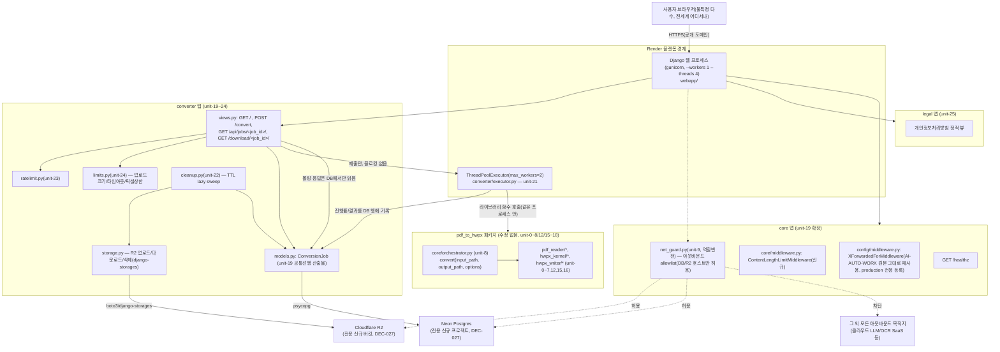

# 03. 시스템 설계서 (System Design) — PDF-TO-HWPX

- 작성 에이전트: 03-system-designer
- 버전: **v5 (DEC-020~028 대규모 리비전 — "로컬 전용 1인 도구" → "공개 웹 변환 서비스"로 근본 전환. v4까지의 DEC-018/019(Bottle, 127.0.0.1 전용)를 전면 대체)**
- 입력: `docs/harness/02-planning.md`(v5, PASS), `docs/harness/decisions.md` DEC-020~028(이번 리비전의 유일한 근거) + 그 이전 DEC-001~019(핵심 변환 로직 관련 결정은 그대로 승계), `docs/harness/03-system-design.md`(v4, 대체 대상), 별도 프로젝트 `C:\big21\vibe-coding\AI-AUTO-WORK`(Django 5.2.17 + Wagtail 7.4.3, Render+Neon+R2 배포 — Wagtail/blog/comments/subscribers는 참고하지 않음, DEC-026)
- **핵심 전제(반드시 지킨 제약)**: unit-0~4(그리고 향후 unit-5~8, 15~18)가 만드는 `pdf_to_hwpx` 패키지(PDF 바이트 입력 → HWPX 바이트 출력)는 **이번 리비전으로 단 한 줄도 수정하지 않는다.** 이 설계서가 다루는 것은 오직 "그 라이브러리를 누가, 어떻게 호출하고, 그 앞뒤에 무엇을 두는가"이다 — 즉 새로운 `webapp/`(Django 프로젝트)가 `pdf_to_hwpx`를 **외부 라이브러리로 import**해서 쓰는 구조다. 02-planning.md v5 §0-3의 "unit-0~4 영향 없음 확인"을 이 설계서도 그대로 재확인한다.
- **본 리비전에서 새로 확정한 항목**(02-planning.md v5가 명시적으로 위임, 근거와 함께 규칙 A-3 예외로 자체 결정 — 전부 `decisions.md` DEC-029~036에 기록):
  1. TTL 구체 시간(60분)
  2. 파일크기(50MB)/변환처리 소프트 타임아웃(5분)/이미지 디컴프레션 상한(1억2800만 픽셀)
  3. 비동기 작업 큐 구체 기술(Celery/RQ/Redis 도입하지 않고, **인프로세스 `ThreadPoolExecutor` + Postgres 기반 Job 모델**로 확정 — 근거는 §2-1)
  4. 레이트리밋(IP당 시간당 20회, 동시 처리 2건) 구체 방식, 캡차는 v1 보류(pre-select만, 미구현)
  5. unit-9(net_guard) 존속 — 단, "아웃바운드 전면차단"에서 **"아웃바운드 화이트리스트(DB/스토리지 호스트만 허용)"로 역할 반전**. unit-13(Bottle 웹 UI) 폐기, unit-20(Django)이 완전 대체
  6. 인프라 리전 — Render/Neon **Singapore 우선 검토**(확인 필요 명시, §2-3), Cloudflare R2는 지역 고정이 사실상 불가능한 서비스 특성상 위치 힌트만 지정. **결론: 어느 리전을 택해도 대한민국 내 리전이 존재하지 않으므로 국외이전 고지는 무조건 필요(§6-2)** — 이것이 이번 리비전에서 가장 중요한 확정 사실 중 하나다.
- 이 문서의 도구 권한은 Read/Write/Grep/Glob/Bash로 제한되어 있어 실시간 웹 조사(WebSearch/WebFetch)를 수행하지 않았다. Render/Neon의 정확한 리전 목록·가격 정책처럼 실시간 확인이 필요한 사실은 "확인 필요"로 명시하고 임의로 단정하지 않았다(§2-3, §8-3).

---

## 1. 아키텍처 개요

### 1-1. 설계 원칙 (v4 대비 무엇이 유지되고 무엇이 바뀌는가)

- **"라이브러리 vs 서비스" 경계를 명확히 분리한다.** `pdf_to_hwpx`(파이썬 패키지, 저장소 루트)는 입출력이 순수 바이트(파일 경로/바이트열)인 **상태 없는 변환 라이브러리**로 그대로 둔다. `webapp/`(신규 Django 프로젝트, 별도 디렉터리)이 이 라이브러리를 호출하는 **상태 있는 서비스**다. 이 경계 덕분에 (a) 핵심 변환 로직 팀(unit-0~8 등)과 웹 서비스 팀(unit-19~26)이 서로의 파일을 건드리지 않고 병행 개발할 수 있고, (b) 배포 형태가 또 바뀌어도(예: 나중에 데스크톱판을 재출시) 라이브러리는 그대로 재사용 가능하다 — v4의 "파이프라인+IR 패턴으로 파서/라이터를 서로 격리한다"는 장애 격리 철학을 한 단계 더 큰 스케일(서비스 vs 라이브러리)로 반복 적용한 것뿐이다.
- **과설계 배제 원칙은 이번에도 유지하되, 기준선이 바뀌었다.** v4는 "실사용자 트래픽이 없는 개인용 도구"를 전제로 DB/큐를 배제했다. v5는 "불특정 다수가 동시에 쓸 수 있는 공개 서비스"가 전제이므로 DB(Neon)와 비동기 처리(작업 큐 성격의 컴포넌트)는 이제 **필요한 것**이다. 그러나 그 안에서도 "지금 필요한 것"(Postgres 1개, 인프로세스 스레드풀)과 "나중에 필요할 수도 있는 것"(Redis 브로커, 별도 워커 프로세스, 프로세스 격리 실행)을 구분해 후자를 지금 비용으로 지불하지 않는다(근거는 §2-1).
- **횡단 관심사 초기화 지점이 CLI/웹 두 곳으로 나뉜다.** `pdf_to_hwpx.common.logging_setup.install()`(파일 기반 로테이팅 로그)은 **CLI 진입점(unit-11)에서만** 호출한다. Django(웹) 진입점은 이 함수를 호출하지 않고 **Django 표준 로깅(stdout)**에 위임한다(§7-1) — 컨테이너 파일시스템은 재시작 시 사라지므로 로컬 파일 로그는 웹 배포에서 의미가 없고, Render는 표준출력만 수집한다. 이 분기 자체가 "어떤 진입점이 무엇을 초기화하는가"를 명시적으로 정의한 설계 결정이다(v4 §1-1 "초기화는 진입점 1곳" 원칙의 자연스러운 확장 — "진입점이 이제 2종류이므로 각자 다른 관심사를 초기화한다"로 구체화).
- **오케스트레이션 API 계약(§4-1, §4-2)은 바뀌지 않는다.** `pdf_to_hwpx.core.orchestrator.convert(input_path, output_path, options) -> ConversionResult`, `ConversionOptions`, `ProgressEvent`, 예외 계층은 v4 §3~§4에서 이미 확정했고 아직 unit-8이 Not Started라 구현 비용도 없다. 이번 리비전은 "누가 이 함수를 어떤 스레드에서, 어떤 상태 저장소로 호출하는가"만 바꾼다.

### 1-2. 컴포넌트/모듈 경계 다이어그램



- **읽는 법**: `EXE`(스레드풀)가 `pdf_to_hwpx`를 직접 함수 호출하는 유일한 지점이다 — HTTP 요청 스레드(`VIEWS`)는 파일을 R2에 올리고 DB 행을 만든 뒤 `EXE.submit(...)`으로 즉시 반환하며, 실제 변환은 절대 요청-응답 스레드 안에서 실행되지 않는다(REQ-027).
- **`LIB` 서브그래프는 이 설계서의 변경 대상이 아니다** — v4 §1-2/§3/§4-1/§4-2가 이미 정의했고, 05/06단계가 별도로 구현·검증 중이다. 이 다이어그램에 다시 그린 이유는 "웹 서비스가 이 라이브러리의 무엇을 어떻게 소비하는지" 경계를 명시하기 위함이지, 내부를 재설계하기 위함이 아니다.
- `NETG`(net_guard, unit-9)는 **역할이 반전**됐다(v4: 아웃바운드 전면 차단 → v5: 아웃바운드 화이트리스트). 이유와 구현은 §6-3.

### 1-3. 작업 단위 확정표 (02단계 §9 후보표 검증·확정 — v5)

> 02단계 §9-1(unit-0~18)의 "불확실" 칸은 **핵심 변환 로직(unit-0~8, 10~12, 14~18) 범위에서는 v4가 이미 확정**했고 이번 리비전으로 변경되지 않는다(v4 §1-3 그대로 유효, 재수록하지 않는다 — 변경 없는 표를 다시 베끼는 것은 문서 중복이므로 v4 원본을 참고). 이 절은 **02 §9-1의 v5 비고가 붙은 unit(9, 11, 13, 18)**과 **02 §9-2의 unit-19~26(신규)**만 다룬다.

**패키지 레이아웃(확정, v5 신규)**:
```
(저장소 루트)
  pdf_to_hwpx/            # 기존 라이브러리 패키지 — 이번 리비전에서 내부 파일 변경 없음
  pyproject.toml          # 기존 그대로. webapp이 이 패키지를 editable install로 의존
  webapp/                 # 신규 Django 프로젝트 루트(AI-AUTO-WORK의 webapp/ 배치 관례 재사용)
    manage.py
    build.sh              # pip install -e .. (pdf_to_hwpx 편집설치) -> pip install -r requirements.txt
                           # -> collectstatic -> migrate -> ensure_superuser(관리자 부트스트랩, AI-AUTO-WORK 패턴)
    requirements.txt
    render.yaml            # rootDir: webapp (AI-AUTO-WORK 패턴 그대로)
    .env.example
    config/
      settings/{base,dev,production}.py
      urls.py, wsgi.py     # ASGI 미사용(§2-1 근거) — wsgi.py만 사용
    core/                  # 앱: 횡단 관심사(AI-AUTO-WORK core 앱 패턴 재사용)
      middleware.py, net_guard.py, admin_auth.py, views.py(healthz), urls.py
    converter/             # 앱: 이 서비스의 핵심 기능
      models.py            # ConversionJob (unit-19가 정의하는 공유 계약)
      views.py, executor.py, storage.py, ratelimit.py, limits.py, cleanup.py
      templates/converter/*.html
      static/converter/*.js
    legal/                 # 앱: 개인정보처리방침(정적 뷰, Wagtail 없음 — DEC-026)
      views.py, templates/legal/*.html
```

| 단위ID | 소속 | 커버 REQ-ID | 선행 단위 | 확정 파일 범위 | 공유 자원 접촉(확정) | 병렬 가능(확정) | v4/02 대비 비고 |
|---|---|---|---|---|---|---|---|
| **unit-19** | C. 웹 서비스 인프라 | REQ-021 | 없음 | `webapp/manage.py`, `webapp/config/settings/*.py`, `webapp/config/urls.py`, `webapp/config/wsgi.py`, **`webapp/config/middleware.py`(`XForwardedForMiddleware` — AI-AUTO-WORK `config/middleware.py` 원본 그대로 재사용, rightmost X-Forwarded-For 값을 `REMOTE_ADDR`로 재설정, production 설정에서만 등록)**, `webapp/core/apps.py`, **`webapp/converter/models.py`(ConversionJob 모델 + 최초 마이그레이션)** | 전역 settings/urls 레지스트리 + **ConversionJob 스키마(unit-20/21/22/24가 전부 이 모델을 소비)** | 불가 — unit-20~26의 공통 선행 | **02 대비 확정**: 02가 "job 상태 데이터 모델 공유 가능성으로 불확실"이라 남긴 unit-20/21 문제를 해소하기 위해, **DEC-016(unit-0 착수 전 `ir.py`를 오케스트레이터가 먼저 만든 선례)과 동일한 방식**으로 `ConversionJob` 모델을 unit-19(공통 선행)의 산출물로 명시 확정했다. unit-20/21/22/24는 이 모델을 소비만 하고 재정의하지 않는다(§3-2 스키마 참고) |
| unit-20 | C | REQ-001, REQ-010, REQ-015 | unit-19 | `converter/views.py`(`GET /`, `POST /convert`, `GET /download/<job_id>/`), `converter/templates/converter/*.html`, `converter/static/converter/app.js` | `ConversionJob` 모델을 소비(스키마는 unit-19 고정), `executor.submit_job()` 함수 시그니처를 **호출**(구현은 unit-21) | **가능(확정)** — unit-19가 모델과 `executor.submit_job(job_id) -> None` 시그니처를 먼저 고정하면, unit-20(뷰)과 unit-21(실행기)은 서로 다른 파일이라 병렬 개발 가능(§4-1에서 이 시그니처를 고정) | 02의 "webui/app.py"(Bottle, unit-13)를 완전히 대체. **02 대비 확정**: 불확실 해소 |
| unit-21 | C | REQ-027 | unit-19 | `converter/executor.py`(ThreadPoolExecutor 싱글톤, `pdf_to_hwpx.core.orchestrator.convert()` 직접 호출) | `ConversionJob` 모델(진행률/결과 기록), `pdf_to_hwpx` 라이브러리(import만, 수정 없음) | **가능(확정, unit-20과 동일 사유)** | 02가 "Celery/RQ 등"으로 열어둔 항목을 **인프로세스 ThreadPoolExecutor로 확정**(DEC-031, §2-1) — 별도 브로커/워커 프로세스 불필요 |
| unit-22 | C | REQ-028 | unit-19, **unit-20/21의 인터페이스 계약(파일범위 아님)** | `converter/cleanup.py`(TTL lazy sweep), R2 lifecycle 정책 문서화(`webapp/render.yaml` 주석 또는 별도 설정 안내) | `ConversionJob` 모델 + `storage.py`의 `delete_job_objects(job)` 함수 시그니처 | **가능(조건부)** — 02는 "불가(통합단계)"로 봤으나, `ConversionJob` 스키마와 `storage.delete_job_objects()` 시그니처가 unit-19/20에서 먼저 고정되면 unit-22는 그 계약에 대해 목(mock)으로 병렬 작성 가능. 다만 **실제 통합 검증(진짜로 다 지워지는지)은 unit-20/21 완료 후 재실행 필요** — 이 점은 02 판단과 사실상 같은 결론(계약은 병렬, 검증은 순차) | **02 대비 정정**: "불가"→"가능(조건부, 검증은 순차)"로 세분화 |
| unit-23 | C | REQ-026 | unit-19 | `converter/ratelimit.py`(IP 기반 LocMemCache 카운터, `admin_auth.py` 패턴 재사용), `converter/views.py`의 데코레이터 삽입 지점(1줄) | `views.py`에 데코레이터 1줄 삽입(자기 소유 파일 아님, unit-20과 최소 접촉 — unit-18(net_guard 1줄 호출)과 동일 패턴), **`config/middleware.py`(unit-19)가 정규화한 `request.META['REMOTE_ADDR']`을 읽기 전용으로 신뢰(파일 접촉 아님 — 단 이 정규화가 없으면 Render 프록시 뒤에서 모든 사용자가 동일한 프록시 IP로 잡혀 레이트리밋이 사실상 무력화된다, §6-4)** | 가능(확정) | 02와 동일 결론 |
| unit-24 | C | REQ-029 | unit-19 | `converter/limits.py`(상수+검증), `core/middleware.py`의 `ContentLengthLimitMiddleware`(신규 클래스, 파일은 `core` 앱 소유이나 unit-19 완료 후 추가) | 미들웨어 스택(순서 의존, §6-3), Pillow 전역 설정(`PIL.Image.MAX_IMAGE_PIXELS`, entry point에서 1회 설정) | 가능(확정) — 02가 "불확실(unit-20/21 흡수 가능성)"로 남겼던 것을 **별도 파일(`limits.py`)로 확정 분리**, 값 참조만 하고 로직은 흡수되지 않음 | **02 대비 확정**: 불확실 해소, 별도 모듈 유지가 단일 책임 원칙에 부합한다고 판단 |
| unit-25 | C | REQ-030 | unit-19 | `legal/views.py`, `legal/templates/legal/privacy.html` | 없음 | 가능(확정) | 02와 동일. Wagtail 미사용(DEC-026), 순수 Django 템플릿 뷰 |
| unit-26 | C | REQ-021(배포 인프라) | unit-19, (실질적으로는 전체 unit의 요구사항을 반영해야 완성) | `webapp/render.yaml`, `webapp/.env.example`, `webapp/build.sh`, `webapp/requirements.txt` | 배포 매니페스트·환경변수 레지스트리(전역) | 불확실(확정 불가, 02와 동일 결론 유지) — 다른 모든 unit의 실제 환경변수 요구사항이 확정되어야 완성되는 통합적 성격이라 항상 마지막 웨이브 배치 | 02와 동일 |
| **unit-9(역할 반전)** | 횡단 | REQ-011(부분) | unit-19 | `core/net_guard.py`(신규 파일 — 기존 v4가 상정한 `core/net_guard.py`와 이름은 같으나 **완전히 새로 작성**, 코드 재사용 없음. 애초에 unit-9는 Not Started였으므로 재작업 비용 없음) | 진입점(`config/wsgi.py`) 1줄 호출 | 가능(확정) | **DEC-033**: "아웃바운드 소켓 전면 차단"(v4)에서 "아웃바운드 화이트리스트(Neon 호스트 + R2 엔드포인트 호스트만 허용, 그 외 전부 `NetworkAccessBlockedError`)"로 역할 반전. 인바운드 127.0.0.1 고정 바인딩 항목은 **완전 폐기**(공개 서비스는 반드시 `0.0.0.0:$PORT`에 바인딩해야 하므로 이 방어 자체가 성립 불가 — Render가 TLS 종단·라우팅을 담당) |
| **unit-13(폐기)** | — | REQ-015 | — | 없음(폐기) | 없음 | 해당없음 | **DEC-034**: Bottle 기반 `webui/app.py`는 unit-13으로 착수된 적이 없으므로(Not Started) 폐기에 따른 재작업 비용이 0이다. REQ-015는 이제 전적으로 unit-20이 담당한다. 이 번호는 앞으로 사용하지 않는다(결번으로 유지, 이력 추적용) |
| unit-11(비고만 갱신) | Feature B | REQ-013 | unit-8 | `cli/__main__.py` — **파일 범위 변경 없음** | 변경 없음 | 변경 없음 | v5에서 로깅 초기화 호출(`logging_setup.install()`)이 CLI 전용임을 재확인(§1-1). 사용주체는 운영자/개발자(02 A-15) |
| unit-18(비고만 갱신) | Feature B | REQ-025 | unit-11, **unit-20**, unit-10 | 삽입 지점이 `webui/templates/index.html`(폐기)에서 **`converter/templates/converter/index.html`(unit-20 소유 파일)**로 이동 | unit-20 파일에 순차 접촉(v4와 동일 패턴 유지) | 불가(v4와 동일, 순차) | 파일 경로만 갱신, 성격(정적 `<a>` 태그, 결제 미연동) 변경 없음 |

**공유 파일/공통 선행 요약(v5)**:
- **unit-19가 이번 리비전의 "공통 선행 unit-0"에 해당** — `webapp/config/settings/*.py`, `webapp/config/urls.py`, **그리고 `converter/models.py`(ConversionJob)**까지 포함해 단독 웨이브로 최우선 배치해야 한다(02 §9-2가 "불가/공통 선행"으로 지정한 것과 방향은 같으나, 이번 설계가 그 범위에 모델 스키마까지 명시적으로 포함시켜 02의 "불확실"을 해소했다).
- unit-20/21/22/24가 공유하는 것은 **파일이 아니라 인터페이스 계약**(`ConversionJob` 필드, `executor.submit_job()`, `storage.delete_job_objects()` 시그니처) — 이 계약은 본 설계서 §3-2/§4-1에서 고정하므로, 오케스트레이터는 unit-19 완료 즉시 unit-20/21/23/24/25를 같은 웨이브에 병렬 배치할 수 있다(unit-22는 계약 기반 병렬 작성 후 통합검증 순차, 위 표 참고).
- 동시 수정 금지(같은 파일 접촉) 조합: (unit-11, unit-18)은 v4와 무관(파일 자체가 다름), (unit-20, unit-18)은 순차. 그 외 새 조합 충돌 없음.
- 오케스트레이터가 반드시 인지할 것: **이 표는 `pdf_to_hwpx/` 패키지 내부의 어떤 파일도 목록에 포함하지 않는다** — unit-19~26 중 어느 것도 unit-0~8/12/15~18의 파일범위를 침범하지 않는다(이것이 이번 리비전의 최우선 제약이었다).

---

## 2. 기술 스택 선정 및 근거

### 2-1. 웹 서비스 계층 신규 스택 (핵심 변환 로직 스택은 v4 §2-1/§2-2 그대로 유지 — 재수록하지 않음)

| 영역 | 채택 | 대안(기각) | 근거 |
|---|---|---|---|
| 웹 프레임워크 | **Django 5.2.x** | Bottle(DEC-019, 폐기 — DEC-034), Flask, FastAPI | DEC-020(사용자 명시적 요구, AI-AUTO-WORK 구조 최대 재사용). Django는 ORM(Neon 연동)·관리자(admin)·미들웨어·설정 계층 분리 관례가 이미 성숙해 있어 "익명 다수 사용자 + DB + 오브젝트스토리지 + 운영자 전용 관리 화면"이 필요한 이번 요구사항 조합에 정확히 맞는다. Bottle은 이 조합(DB ORM, 마이그레이션, 관리자 인증)을 처음부터 다시 만들어야 해 이제는 오히려 더 큰 공수가 든다 |
| CMS | **미사용** | Wagtail | DEC-026 — 콘텐츠 관리가 필요 없는 변환 도구이므로 Wagtail 전체를 들이는 것은 명백한 과설계. Django 자체와 배포 구조만 가져온다 |
| 서빙 모델 | **WSGI (gunicorn, sync/gthread 워커, `--workers 1 --threads 4`)** | ASGI(uvicorn worker, AI-AUTO-WORK 방식) | AI-AUTO-WORK는 ASGI를 쓰지만, 이 프로젝트는 실시간 양방향 통신(WebSocket/SSE)이 전혀 필요 없다(v4부터 "폴링"으로 확정, §2-1 v4 근거 그대로 유효 — 다수 사용자 규모에서도 폴링 자체의 정당성은 변하지 않는다, 단지 서버가 다중 사용자를 처리해야 할 뿐). WSGI+gthread는 비동기 이벤트루프 개념 없이 스레드 여러 개로 동시 요청을 처리할 수 있어 "동기 라이브러리 함수를 그대로 호출"하는 이 서비스의 실행 모델과 정확히 맞는다 — ASGI를 쓰면 오히려 동기 변환 호출이 이벤트 루프를 블로킹하지 않도록 매번 `run_in_executor`로 감싸야 해 불필요한 복잡도가 늘어난다(과설계 회피) |
| 비동기 작업 처리(DEC-024 확정, **DEC-031**) | **인프로세스 `concurrent.futures.ThreadPoolExecutor`(max_workers=2, 싱글톤) + Postgres(Neon) `ConversionJob` 모델로 상태 관리** | Celery+Redis, RQ+Redis, Django-Q(ORM 브로커) | (1) Render 무료 플랜은 "Background Worker" 서비스 타입에 무료 티어를 제공하지 않는다(Web Service만 무료 — 확인 필요 항목, §8-3에 재명시하되 이 판단으로 설계 방향을 정한다). 즉 Celery/RQ가 요구하는 "별도 워커 프로세스"를 무료로 상시 띄울 방법이 없다. (2) Redis(브로커)를 추가하면 새 관리형 서비스(비용·계정·연결 관리)가 하나 더 생긴다 — 이번 서비스의 예상 초기 트래픽(개인/오픈소스 프로젝트 규모)에서는 "지금 필요한 것"이 아니다. (3) Django-Q의 ORM 브로커를 쓰더라도 결국 `qcluster`라는 **별도 프로세스**가 필요해 (1)과 같은 문제가 재발한다. **대안**: 이미 "단일 gunicorn 워커"(AI-AUTO-WORK DEC-026 선례, 이번 프로젝트도 동일 제약)이므로, 그 워커 프로세스 **안에서** 작은 스레드풀로 백그라운드 실행하고 상태는 이미 쓰고 있는 Neon Postgres에 저장하면 **새 인프라를 하나도 추가하지 않고** REQ-027(업로드 즉시 응답 + 진행률 폴링)을 만족한다. 트레이드오프와 한계는 §8-1에 명시(스레드는 강제 종료 불가, 프로세스 재시작 시 진행 중 job 유실) — "나중에 트래픽이 늘어 이 한계가 실제 문제가 되면 그때 Redis+RQ로 전환한다"는 명시적 업그레이드 경로를 남긴다(과설계 회피의 핵심 근거) |
| 데이터베이스 | **PostgreSQL (Neon, 서버리스, DEC-020/027)** | SQLite, MySQL | AI-AUTO-WORK와 동일 이유(Django 표준 관계형 DB, Render 배포 표준 관례). `ConversionJob` 1개 테이블 수준의 단순한 스키마이므로 DB 자체의 기능적 요구는 낮지만, Render 환경에서 "로컬 파일"(SQLite)은 배포 인스턴스 재시작/재배포 시 파일이 초기화될 수 있어 부적합하다 — 관리형 Postgres가 사실상 유일한 합리적 선택 |
| 오브젝트 스토리지 | **Cloudflare R2(S3 호환) + django-storages + boto3** | Render Disk(영구 디스크, 유료), DB에 바이너리 직접 저장 | DEC-020/027. AI-AUTO-WORK와 동일 조합을 그대로 재사용(라이선스 확인은 §2-2). 업로드 PDF·변환 HWPX는 대체로 수 MB~수십 MB의 바이너리라 DB 컬럼에 직접 넣는 것은 Postgres 저장/백업 비용을 불필요하게 늘리는 과설계다 |
| 정적 파일 서빙 | **WhiteNoise** | CDN 직접 구성 | AI-AUTO-WORK 재사용. 이 프로젝트의 정적 자원은 CSS 1개·JS 1개(진행률 폴링 스크립트) 수준이라 별도 CDN은 과설계 |
| 캐시(레이트리밋 카운터) | **Django LocMemCache** | Redis, Memcached | `admin_auth.py`의 `is_rate_limited(ip)` 패턴을 그대로 재사용(§6-3). 단일 워커(--workers 1) 전제에서만 정확하다는 동일한 제약을 그대로 인지하고 설계한다(AI-AUTO-WORK DEC-012/024/026과 동일 트레이드오프) |
| 관리자 인증 | **Django 표준 `django.contrib.admin` + `admin_auth.py` 레이트리밋 패턴 재사용** | 별도 운영자 대시보드 신규 구현 | 이 서비스는 일반 사용자 로그인이 아예 없다(DEC-023) — Django 관리자 계정은 **운영자가 `ConversionJob` 현황을 조회/수동 삭제하는 최소 ops 도구**로만 쓴다. AI-AUTO-WORK의 로그인 무차별대입 방어 패턴(`RateLimitedAdminLoginView`, IP 기준 LocMemCache 카운터)을 그대로 재사용해 새로 설계하지 않는다 |

### 2-2. 라이선스/이용약관 확인 — 신규 의존성만 (핵심 변환 로직 의존성은 v4 §2-2 그대로 유효)

| 의존성/서비스 | 라이선스 또는 약관 확인 결과 | 상업적 이용 | 호출 한도 | 비고 |
|---|---|---|---|---|
| Django | BSD-3-Clause | 가능 | 해당없음(자체 호스팅) | 프로젝트 라이선스(MIT, DEC-014)와 충돌 없음 |
| psycopg[binary] | LGPL-3.0(psycopg3) | 가능(동적 링크 조건 충족, AI-AUTO-WORK가 이미 동일 조합으로 실사용) | 해당없음 | AI-AUTO-WORK 선례 그대로 재확인 |
| dj-database-url | BSD-2-Clause | 가능 | 해당없음 | |
| django-storages[s3] | BSD-3-Clause | 가능 | 해당없음 | |
| boto3 | Apache-2.0 | 가능 | 해당없음(SDK, R2 호출 한도는 아래 참고) | |
| gunicorn | MIT | 가능 | 해당없음 | ASGI용 uvicorn은 채택하지 않으므로(§2-1) `uvicorn[standard]` 의존성은 추가하지 않는다 |
| whitenoise | MIT | 가능 | 해당없음 | |
| **Render(플랫폼)** | Render 서비스 약관(Terms of Service) — **일반 상업적 SaaS 호스팅 이용에 해당하며, 크롤링 등 데이터 수집형 약관 이슈는 해당 없음**(우리가 "이용하는" 대상이 아니라 "호스팅받는" 대상이므로 성격이 다르다). **무료 플랜의 정확한 리소스 한도(RAM/CPU/월 인스턴스시간, Background Worker 무료 제공 여부)는 실시간 웹 조사 권한이 없어 이번 세션에서 확정적으로 재확인하지 못했다** — 기존 지식(2026-01 기준) 근거로 "Background Worker 무료 미제공"을 전제로 설계했으나(§2-1), **실제 계정 개설 시점(10~12단계)에 Render 대시보드에서 재확인 필수**(§8-3 "확인 필요"). 확인 결과가 다르면(예: 무료 Background Worker가 실제로 존재) §2-1 DEC-031을 재검토할 여지가 생기나, 지금 설계(인프로세스 스레드풀)는 그 경우에도 "더 나쁜 선택"이 되는 것이 아니라 "더 단순한 v1 선택"일 뿐이므로 착수를 막지는 않는다 | 확인 불필요(상업적 이용 계약 자체가 서비스 목적) | 무료 플랜 제한(정확한 수치는 위와 동일 사유로 확인 필요) | DEC-027(AI-AUTO-WORK와 계정 분리) |
| **Neon(플랫폼)** | Neon 서비스 약관 — 동일 사유로 크롤링/저작권 이슈 해당 없음(DBaaS 계약). 무료 티어 정확한 컴퓨트/저장 한도는 AI-AUTO-WORK의 `core/monitoring.py`가 이미 "월 100 CU-hour, 0.5GB"로 실측 기재해둔 값이 있어 이를 참고치로 재사용(단, 이 프로젝트는 **별도 신규 Neon 프로젝트**이므로 그 프로젝트 고유의 무료 한도가 그대로 적용된다는 보장까지는 아니며, 실제 확정은 10~12단계) | 확인 불필요 | 참고치: 월 100 CU-hour, 저장 0.5GB(AI-AUTO-WORK 실측값, 재확인 권고) | DEC-027 |
| **Cloudflare R2(플랫폼)** | Cloudflare 서비스 약관 — 오브젝트 스토리지 계약, 크롤링 이슈 해당 없음. R2 무료 티어(월 10GB 저장, Class A/B 오퍼레이션 무료 할당량)는 AI-AUTO-WORK 03단계가 이미 확인한 값과 동일 플랫폼이라 재사용 가능하나, **이번 서비스는 매 요청마다 업로드+다운로드+삭제(오퍼레이션 3회/요청)가 발생**해 블로그(이미지 위주, 쓰기 적음)보다 오퍼레이션 소모 패턴이 다르다는 점을 08/10단계 실측 모니터링 항목으로 남긴다 | 확인 불필요 | 참고치: 월 10GB 저장 + Class A/B 오퍼레이션 무료 할당(재확인 권고) | DEC-027 |

**전체 의존성 라이선스 재확인**: 위 신규 의존성 전부가 MIT/BSD/Apache-2.0/LGPL(동적 링크) 계열로, 프로젝트 라이선스 MIT(DEC-014)와 재배포 의무 충돌이 없다. 오픈소스 공개(DEC-006) 전제도 그대로 유지된다.

### 2-3. 인프라 리전 선택과 국외이전 판단 (DEC-035)

- **판단 대상**: Render(웹 서비스), Neon(DB), Cloudflare R2(스토리지) 3곳 모두 **대한민국 내 리전을 제공하지 않는다**(2026-01 기준 지식으로는 Render/Neon 모두 서울 리전이 없고, Cloudflare R2는 애초에 특정 국가에 물리적으로 고정하는 개념이 약한 글로벌 분산 스토리지다 — 버킷 생성 시 "location hint"만 대륙 단위로 지정 가능). **이 사실 자체(리전 선택지 자체가 전부 국외)는 이번 리비전이 확정할 수 있는 사실이고, 어느 리전을 최종 선택하든 결론이 바뀌지 않는다.**
- **결론(확정)**: **국외이전 고지는 무조건 필요하다.** 02-planning.md v5 §8-3 A-20이 "03단계에서 실제 리전 확정 후 재확인"으로 남긴 질문에 대한 답은 "리전이 무엇이든 Yes"다 — REQ-030(개인정보처리방침)은 이 사실을 명시해야 한다(§6-2).
- **권장 리전(참고, 확정적 웹 조사 불가로 "확인 필요" 유지)**: 한국 사용자 대상 서비스이므로 지연시간을 고려해 **Render Singapore 리전 + Neon AWS `ap-southeast-1`(Singapore) 리전**을 1순위로 검토할 것을 권고한다(2026-01 기준 지식으로 두 플랫폼 모두 싱가포르 리전을 제공한다고 알고 있으나, 실시간 재확인 불가 — 10~12단계 실제 계정 개설 시점에 대시보드에서 반드시 재확인). 확인 결과 싱가포르 리전이 없거나 조건이 맞지 않으면 미국/유럽 리전으로 대체해도 위 "국외이전 고지 필요" 결론 자체는 바뀌지 않으므로 이 선택이 설계를 막지 않는다.
- **개인정보처리방침(REQ-030, unit-25) 반영 사항**: (a) 이전되는 국가(예: 싱가포르 또는 최종 확정 리전), (b) 이전받는 자(Render Inc., 관련 DB 운영사, Cloudflare Inc. — 정확한 법인명은 실제 계정 개설 후 각 사 이용약관에서 재확인해 채운다), (c) 이전 목적(PDF→HWPX 변환 처리 및 TTL 내 임시 저장), (d) 보유·이용기간(§6-2 TTL과 동일, 최대 60분), (e) 이전 거부 방법(이 서비스는 서버 처리가 전제이므로 "거부 시 서비스 이용 불가"임을 정직하게 고지) — 이 5개 항목은 개인정보보호법 제28조의8이 요구하는 국외이전 고지 항목에 대응한다(에이전트가 법률 자문을 대신하는 것이 아님, DEC-021 권고 재확인).

---

## 3. 데이터 모델

### 3-1. 중간표현(IR) — 변경 없음

v4 §3-1(`PageIR`/`TextBlockIR`/`ImageBlockIR`/`TableBlockIR`/`TableCellIR`/`FormulaCandidateIR`, `pdf_to_hwpx/pdf_reader/ir.py`, DEC-016)이 그대로 유효하다. 이 IR은 `pdf_to_hwpx` 패키지 내부에서만 흐르며 Django 계층은 이를 전혀 알 필요가 없다(라이브러리 경계, §1-1).

### 3-2. 신규: `ConversionJob` 모델 (unit-19 산출물, Neon Postgres)

```python
# webapp/converter/models.py
import uuid
from django.db import models

class ConversionJob(models.Model):
    class Status(models.TextChoices):
        PENDING = "pending", "대기중"
        PROCESSING = "processing", "변환중"
        DONE = "done", "완료"
        FAILED = "failed", "실패"
        EXPIRED = "expired", "만료(파일삭제됨)"

        # 상태 전이 규칙(구현자 필독): PENDING -> PROCESSING -> (DONE | FAILED) -> EXPIRED.
        # DONE = orchestrator.convert()가 예외 없이 반환됨(REQ-009 계약대로) — 이 경우
        #   result_success=True/False 둘 다 가능하다(False는 "변환은 끝났지만 품질/부분
        #   실패", 예: 손상된 PDF를 orchestrator가 스스로 감지해 errors에 담아 반환한
        #   경우). 즉 DONE은 "라이브러리가 통제된 방식으로 마쳤다"는 뜻이지 "성공"의
        #   동의어가 아니다.
        # FAILED = executor 자신의 인프라 레벨 실패(orchestrator.convert() 호출 자체가
        #   처리되지 못함) — 예: R2 업로드/다운로드 실패, 예상치 못한 미핸들링 예외로
        #   워커 함수가 죽음. 이 경우 result_success/result_warnings/result_errors는
        #   비어 있을 수 있다.
        # 다운로드 뷰(§4-4)는 이 둘을 구분해 사용자 메시지를 다르게 보여준다:
        #   DONE+result_success=False -> result_errors를 그대로 노출(사용자가 이해할
        #   수 있는 콘텐츠 문제, REQ-009). FAILED -> "서버 처리 중 오류가 발생했습니다.
        #   다시 시도해주세요" 같은 일반 메시지(내부 원인을 사용자에게 노출하지 않음).

    job_id = models.UUIDField(primary_key=True, default=uuid.uuid4, editable=False)
    status = models.CharField(max_length=16, choices=Status.choices, default=Status.PENDING)

    created_at = models.DateTimeField(auto_now_add=True)
    started_at = models.DateTimeField(null=True, blank=True)
    finished_at = models.DateTimeField(null=True, blank=True)
    downloaded_at = models.DateTimeField(null=True, blank=True)
    purged_at = models.DateTimeField(null=True, blank=True)  # R2 오브젝트/원본파일명 삭제 완료 시각

    # 입력 옵션(REQ-014 OCR 등) — ConversionOptions와 1:1 대응
    enable_ocr = models.BooleanField(default=False)
    ocr_lang = models.CharField(max_length=16, default="kor")

    # R2 오브젝트 키(파일 내용 자체는 DB에 없음, §2-1)
    input_object_key = models.CharField(max_length=255)
    output_object_key = models.CharField(max_length=255, blank=True)

    # 진행률(ProgressEvent를 그대로 매핑, §4-1)
    progress_stage = models.CharField(max_length=16, blank=True)
    progress_current_page = models.IntegerField(default=0)
    progress_total_pages = models.IntegerField(default=0)
    progress_message = models.CharField(max_length=255, blank=True)

    # 결과(ConversionResult를 그대로 매핑)
    result_success = models.BooleanField(null=True)
    result_warnings = models.JSONField(default=list)   # list[dict] — ConversionWarning 직렬화
    result_errors = models.JSONField(default=list)      # list[dict] — ConversionIssue 직렬화

    class Meta:
        indexes = [models.Index(fields=["status", "created_at"])]  # cleanup.py의 TTL 스캔 쿼리용
```

- **원본 파일명은 저장하지 않는다(DEC-036).** v4 §6-2가 이미 "파일명 자체에 개인정보가 담길 수 있다"고 지적했는데, 공개 서비스에서는 이 위험이 더 커진다(서버 DB에 저장되기 때문). 사용자가 다운로드 시 원래 파일명을 되찾는 방법은 **서버 저장이 아니라 클라이언트(브라우저 JS)가 기억**하는 방식으로 구현한다 — 업로드 시점에 `<input type="file">`이 이미 `file.name`을 브라우저 메모리에 갖고 있으므로, 다운로드 완료 후 JS가 `<a download="원본이름.hwpx">`로 저장명을 지정한다(서버 응답의 `Content-Disposition`은 `converted.hwpx` 같은 범용 이름만 내려준다). 04단계 UX 설계에 이 인터랙션을 인수인계한다(§8-2).
- **`client_ip`, `original_filename` 등 식별 가능 정보는 이 모델에 아예 필드로 두지 않는다** — 레이트리밋(REQ-026)은 DB가 아니라 LocMemCache(휘발성, 재시작 시 소멸)에서만 IP를 다룬다(§6-3). 이는 REQ-030(수집 최소화)을 스키마 수준에서 강제하는 설계다.
- **보관 정책(2단계)**: (1) `input_object_key`/`output_object_key`가 가리키는 R2 오브젝트 자체는 생성 후 최대 60분(§4-3 TTL) 내 삭제된다(REQ-028). (2) `ConversionJob` 행 자체(파일명 등 식별정보가 없는 익명화된 운영 메타데이터)는 KPI 측정(02 §5-2 "업로드→다운로드 지연시간" 등)을 위해 조금 더 길게(예: 30일) 보관한 뒤 배치로 하드 삭제한다 — 이 30일 보관은 개인정보가 아닌 운영 통계 목적이므로 REQ-030 개인정보처리방침에는 "식별 불가능한 운영 통계"로 명시하고, 개인정보 보관기간(60분)과 혼동되지 않게 문구를 분리한다(§6-2).
- **마이그레이션 전략**: 최초 마이그레이션 1개(unit-19)로 시작, 이후 필드 추가는 표준 Django 마이그레이션으로 관리한다. 기존 v4 §3-1의 IR과 달리 이 모델은 **영속 데이터**이므로 마이그레이션이 실제로 의미를 가진다(v4는 "IR은 휘발성이라 마이그레이션 개념이 없다"고 명시했던 것과 대비).

---

## 4. API/인터페이스 명세

> v4 §4-1(핵심 공개 API)·§4-2(예외 계층)는 **변경 없이 그대로 유효**하다(재수록만 함, 아래 4-1). §4-3(CLI)도 변경 없다. §4-4(웹 이벤트/API 계약)는 **전면 재작성**한다(Bottle 라우트 → Django 뷰, 아래 4-4).

### 4-1. 핵심 공개 API (`pdf_to_hwpx/core/orchestrator.py`, unit-8) — v4 그대로, 변경 없음

```python
def convert(
    input_path: Path,
    output_path: Path,
    options: ConversionOptions | None = None,
) -> ConversionResult:
    """PDF 1개를 HWPX 1개로 변환한다. 실패해도 예외를 던지지 않고
    ConversionResult.success=False + errors에 담아 반환한다(REQ-009).
    호출자(CLI/웹 실행기)가 이 결과를 사용자 메시지로 매핑한다."""
```
(`ConversionOptions`/`ProgressEvent`/`ConversionResult`/`ConversionWarning`/`ConversionStats` 필드 정의는 v4 §4-1과 100% 동일 — 이 문서에서 재정의하지 않는다.)

### 4-2. 예외 계층 (`pdf_to_hwpx/common/exceptions.py`) — v4 §4-2 그대로, 변경 없음

### 4-3. CLI 명세 — v4 §4-3 그대로, 변경 없음 (사용주체만 02 A-15로 재해석됨)

### 4-4. 웹 API 계약 (`webapp/converter/`, REQ-001/010/015/026/027/028/029, 전면 재작성)

**HTTP 라우트 명세**:

| 라우트 | 메서드 | 요청 | 응답 | 설명 |
|---|---|---|---|---|
| `/` | GET | 없음 | `text/html` | 업로드 폼(`<input type="file" accept=".pdf">`), OCR 체크박스, 진행률 영역, 후원 링크(REQ-025), 개인정보처리방침 링크(REQ-030) |
| `/convert` | POST | `multipart/form-data`: `file`, `enable_ocr`, `ocr_lang` | `application/json`: `{"job_id": "<uuid4>"}` (HTTP 202) 또는 에러(아래) | (1) `limits.py`가 `Content-Length`를 사전 검사(§6-4). (2) 업로드 파일을 R2 `uploads/<job_id>.pdf`에 저장. (3) `ConversionJob(status=PENDING)` 행 생성. (4) `executor.submit_job(job_id)` 호출 후 **즉시 응답**(블로킹 없음, REQ-027). 에러 응답: 파일크기 초과 → 413, 레이트리밋 초과 → 429, 큐 포화(대기 20건 초과, §5) → 503 |
| `/api/jobs/<uuid:job_id>/` | GET | 없음 | `application/json`: `{"status": "...", "progress": {...}, "warnings": [...], "errors": [...]}` (job_id 없음/만료됨 → 404) | 브라우저 JS가 0.5~1초 간격 폴링(v4와 동일 메커니즘, 서버측 저장소만 인메모리 dict→DB 행으로 변경). **응답은 오직 DB 조회**이며 라이브러리를 다시 호출하지 않는다 |
| `/download/<uuid:job_id>/` | GET | 없음 | 완료+성공: `application/octet-stream`(`Content-Disposition: attachment; filename="converted.hwpx"`, HTTP 200). 완료+실패(status=DONE, result_success=False): `application/json`으로 `result_errors`를 그대로 노출(**HTTP 422**). 인프라 실패(status=FAILED): `application/json`으로 일반 오류 메시지만 노출, 내부 원인 비노출(**HTTP 422**, §3-2 상태전이 규칙 참고). 진행중: 409. 없음/이미 만료: 404 | **Django 뷰가 R2에서 바이트를 읽어 그대로 스트리밍(proxy)한다**(DEC-036 — presigned URL 리다이렉트 방식은 v1에서 채택하지 않음, 근거 §8-1). 스트리밍이 끝나면 `downloaded_at`을 기록하고 **해당 job의 R2 오브젝트(업로드본+결과본)를 즉시 삭제**한다(REQ-028의 "다운로드 후 즉시 삭제" 조항을 문자 그대로 구현) |
| `/healthz` | GET | 없음 | `text/plain: "ok"` | AI-AUTO-WORK 패턴 그대로 재사용 — DB 접속 확인 없는 얕은 헬스체크(Neon 콜드스타트 오탐 방지, 동일 근거) |
| `/privacy/` | GET | 없음 | `text/html` | 개인정보처리방침(REQ-030, unit-25) |

**진행률 갱신 메커니즘**: v4의 "폴링" 채택 근거(§2-1)는 사용자 규모가 늘어도 그대로 유효하다 — 각 사용자는 자신의 `job_id`만 폴링하므로 동시 사용자 수가 늘어도 폴링은 "요청마다 독립적인 짧은 DB 조회 1건"일 뿐 서버 상태를 무겁게 만들지 않는다.

**실행 계약(`converter/executor.py`, unit-21 — unit-20/22가 의존하는 고정 시그니처)**:
```python
_POOL = ThreadPoolExecutor(max_workers=2)          # DEC-031: 프로세스 전역 싱글톤
_PENDING_QUEUE_LIMIT = 20                            # REQ-029, §5

def submit_job(job_id: uuid.UUID) -> None:
    """PENDING 상태의 ConversionJob을 스레드풀에 제출한다.
    큐 포화(실행중+대기중 job 합계 >= _PENDING_QUEUE_LIMIT) 시
    QueueFullError를 던진다 — 호출자(views.py)가 이를 잡아 HTTP 503으로 매핑한다."""

def _run(job_id: uuid.UUID) -> None:
    """실제 워커 함수(스레드 안에서 실행). R2에서 입력파일을 로컬 임시경로로
    내려받고, ConversionOptions.progress_callback으로 매 ProgressEvent마다
    ConversionJob 행을 UPDATE, orchestrator.convert() 완료 후 결과를 R2에
    올리고 ConversionJob.status/result_*를 UPDATE한다.
    소프트 타임아웃(§5, 5분)은 여기가 아니라 views.py의 폴링 응답 생성 시
    '생성 후 5분 경과 + 아직 processing'이면 TIMEOUT으로 간주해 사용자에게
    보여주는 방식으로 처리한다(스레드 자체를 강제 종료하지 않음 — §8-1 한계 명시)."""
```

- **로깅**: 이 실행 경로는 `pdf_to_hwpx.common.logging_setup.install()`을 호출하지 않는다(§1-1) — `orchestrator.convert()` 내부의 `logging.getLogger(...)` 호출은 Django 표준 로깅(콘솔 핸들러, §7-1)으로 전파된다.
- **동시성 모델 비교(v4 대비)**: v4(Bottle)는 "요청당 스레드 1개"(`threading.Thread(daemon=True)`, 관리 안 되는 무제한 스레드)였다. v5는 **고정 크기 스레드풀(2개)**로 바뀌었다 — 이는 REQ-029(자원남용 방어)의 직접적 요구다: 익명 다수가 동시에 업로드하더라도 실제로 CPU를 쓰는 변환 작업은 최대 2건까지만 동시 실행되고, 나머지는 DB에 PENDING으로 대기하며(간이 큐), 대기가 20건을 넘으면 신규 업로드 자체를 503으로 거절한다(§5).

---

## 5. 비기능 요구사항

> v4 §5의 변환 품질 KPI(성공률/텍스트보존/표보존/처리시간/크래시율)는 그대로 유효(핵심 로직 불변). 아래는 **웹 서비스 계층에 새로 추가되는 목표**다(02 §5-2와 연결).

| 항목 | 목표 | 근거/측정 지점 |
|---|---|---|
| **업로드 파일 크기 상한** | **50MB** (REQ-029, DEC-030) | 02-planning 예시치(500MB)를 **그대로 쓰지 않고 하향 조정**했다 — 근거: Render 무료 웹 인스턴스의 메모리는 넉넉하지 않고(수백MB급으로 추정, §8-3 확인 필요), 이미지가 포함된 PDF는 파싱 중 원본 대비 3~5배의 메모리를 소비할 수 있어(pdfplumber/pypdf/Pillow가 압축 해제된 픽셀 버퍼를 메모리에 올림) 500MB 업로드 1건이 단일 워커 프로세스 전체를 다운시킬 수 있다(REQ-029의 "한 명의 악용/실수가 전체 서비스를 막지 못하게" 원칙과 직결). 50MB는 관공서 제출용 스캔 문서(수십 페이지, 저~중해상도) 대부분을 커버하는 수준이며 "이용자가 체감 못 할 정도로 관대한 상한"(02 원칙)에 부합한다고 판단했다. `Content-Length` 헤더를 본문을 다 읽기 전에 먼저 검사해(`ContentLengthLimitMiddleware`, §6-4) 초과 요청은 즉시 413으로 끊는다 |
| **변환 처리 소프트 타임아웃** | **5분(300초)** | 폴링 응답에서 "생성 후 5분 경과 + 아직 완료 안 됨"이면 사용자에게 "처리 시간이 오래 걸리고 있습니다. 잠시 후 다시 시도해주세요."를 안내(하드 강제종료는 하지 않음, §4-4/§8-1 한계 명시). OCR 미사용 시 목표(≤10초, v4 §5)의 30배 여유를 둔 안전핀 수준 |
| **동시 변환 처리 수** | **최대 2건 동시 실행**, 대기열 20건 초과 시 신규 업로드 거절(503) | ThreadPoolExecutor(max_workers=2) + DB PENDING 카운트(§4-4). 단일 워커 프로세스의 CPU를 소수 작업에 집중시켜 "한 사람의 폭주가 전체를 막는" 상황을 차단(REQ-029) |
| **(주의, 성능 기대치 명확화)** "동시 실행"의 실제 의미 | 진짜 병렬 가속이 아니라 요청격리+처리량 상한 | CPython GIL 때문에 스레드 2개가 각각 CPU 바운드(파싱/렌더링) 작업을 수행해도 코어 여러 개를 동시에 쓰는 진짜 병렬 처리는 아니다(C 확장 일부 구간에서만 GIL이 잠깐 풀림) — "max_workers=2"의 실질 목적은 (a) 변환 작업이 HTTP 요청-응답 스레드를 절대 막지 않게 격리하는 것과 (b) 동시에 CPU를 점유하는 변환 작업 수 자체를 상한선 아래로 강제하는 것이지, 처리 속도를 2배로 만드는 것이 아니다. 구현자가 이 차이를 오해해 "더 빠르게 하려고 max_workers를 늘리면 된다"고 판단하지 않도록 명시한다(Render 무료 인스턴스는 통상 vCPU 1개 미만 공유이므로 늘려도 실제 이득이 제한적이다). |
| **이미지 디컴프레션 상한** | **1억 2,800만 픽셀**(`PIL.Image.MAX_IMAGE_PIXELS`, Django/CLI 진입점에서 전역 1회 설정) | AI-AUTO-WORK의 `WAGTAILIMAGES_MAX_IMAGE_PIXELS` 상수를 그대로 재사용(동일 근거: 디컴프레션 폭탄 방지). **unit-2(`image_extractor.py`) 코드 자체는 수정하지 않는다** — Pillow의 이 값은 프로세스 전역 클래스 속성이라 진입점에서 한 번 설정하면 `Image.open()`/`Image.frombytes()` 경로에 자동 적용된다(정확한 적용 범위는 05/06 구현 시 재확인 필요 — §8-3) |
| **업로드→다운로드 가능 지연시간** | 목표: OCR 미사용 시 P95 ≤ 30초(업로드 완료~변환 완료), OCR 사용 시 P95 ≤ 3분 | 02 §5-2 KPI 구체화. `ConversionJob.created_at`~`finished_at` 차이로 측정 |
| **TTL 삭제 이행률** | 100% (§4-3 참고) | 09단계 보안검증에서 실측 |
| **레이트리밋 임계값** | IP당 시간당 20회 업로드, IP당 동시 진행중 job 2건까지 | §6-3 |
| **콜드스타트 안내** | Render 무료 플랜 유휴 스핀다운(약 15분) 후 첫 요청은 수십 초 지연 가능 — 04 UX가 로딩 안내 문구를 넣어야 함(§8-2) | 02 §7 "인프라 성능 제약" 리스크 대응 |

**장애 대응(재시도/타임아웃/서킷브레이커)**:
- **페이지 단위 격리(벌크헤드)**: v4 §5 그대로 유효 — 한 페이지 실패가 문서 전체를 실패시키지 않는다.
- **OCR 페이지 타임아웃**: v4 §5 그대로(페이지당 30초).
- **큐 수준 서킷브레이커**: 대기열 20건 초과 시 신규 요청을 503으로 즉시 거절하는 것 자체가 "이 서비스 규모에서 필요한 유일한 서킷브레이커"다 — 외부 서비스 호출이 없는 이 아키텍처(REQ-011)에서는 전통적 의미의(원격 API 장애 감지용) 서킷브레이커가 적용될 대상이 없다(과설계 회피).
- **재시도**: R2 업로드/다운로드 실패 시 `boto3`의 기본 재시도(지수 백오프, botocore 기본값) 이상으로 커스텀 재시도 로직을 추가하지 않는다(라이브러리 기본값으로 충분, YAGNI).
- **프로세스 재시작에 따른 job 유실**: Render 배포/재시작(또는 자유 플랜 스핀다운) 시 `PROCESSING` 상태로 멈춘 job은 그대로 고아가 될 수 있다 — v1은 이를 자동 복구하지 않고, 사용자가 재시도(재업로드)하면 되는 수준으로 허용한다(§8-1에 명시적 트레이드오프로 기록). TTL 정리(cleanup.py)가 `created_at` 기준으로 오래된 PENDING/PROCESSING job도 함께 정리해 DB에 좀비 행이 무한히 쌓이는 것은 방지한다.

---

## 6. 보안 설계 원칙

### 6-1. 인증/인가

- **일반 사용자: 인증 없음(완전 익명, DEC-023).** 업로드/변환/다운로드 어디에도 로그인이 없다. 대신 `job_id`(UUID v4, 128비트 엔트로피)가 사실상의 **capability token**(소지 기반 접근 제어) 역할을 한다 — 이 UUID를 아는 사람만 해당 job의 진행률 조회·다운로드가 가능하다. 따라서 **`job_id`는 애플리케이션 로그에 평문으로 과다 노출하지 않는다**(예: 접속 로그의 URL 경로에는 불가피하게 남지만, 별도 애플리케이션 로그에 추가로 재기록하지 않음).
- **운영자: Django 표준 admin(`django.contrib.admin`) + `admin_auth.py` 레이트리밋 패턴(AI-AUTO-WORK 재사용).** 슈퍼유저 1개 계정만 존재(배포 시 `build.sh`의 `ensure_superuser` 부트스트랩, 최초 배포 후 환경변수 삭제 권장 — AI-AUTO-WORK 패턴 그대로). 이 관리자 화면은 **일반 사용자에게 노출되지 않으며 04단계 UX 설계 범위가 아니다**(벤더 기본 제공 화면, AI-AUTO-WORK 03단계가 이미 확립한 원칙 재적용).
- **CSRF**: 업로드 폼은 같은 오리진에서 렌더링된 HTML 폼을 통해서만 제출되므로 Django 표준 `CsrfViewMiddleware`를 그대로 적용한다(예외 처리 불필요 — v4가 Bottle에서 직접 만들어야 했던 것과 달리 Django는 기본 제공).

### 6-2. 개인정보 처리 원칙 (v4 §6-2를 공개 서비스 전제로 전면 재작성 — 01보고서 5-2/5-3절, DEC-021/022/023 교차 확인)

- **처리 주체 지위의 근본적 변화**: v4는 "서버가 없으므로 개인정보처리자 지위가 발생하지 않는다"고 명시했다. **이 결론은 더 이상 성립하지 않는다** — 이제 이 서비스 운영자가 개인정보보호법상 개인정보처리자에 해당할 가능성이 높다(DEC-021). 아래 원칙은 그 전제 위에서 설계됐다.
- **수집 최소화(스키마 수준 강제, §3-2)**: 회원가입·이메일·사용자 식별자를 전혀 수집하지 않는다(DEC-023). 원본 파일명은 서버에 저장하지 않는다(DEC-036). 클라이언트 IP는 DB에 영속 저장하지 않고 레이트리밋 목적으로만 LocMemCache(휘발성, 프로세스 재시작 시 소멸)에서 짧게 다룬다.
- **보관기간과 파기(REQ-028의 구체 구현)**:
  - PDF 원문·변환 결과 파일(R2 오브젝트): **업로드 시점으로부터 최대 60분**(DEC-029) 내 삭제. 다운로드가 완료되면 그 즉시 삭제(§4-4), 다운로드하지 않고 방치된 job은 60분 경과 시 `cleanup.py`의 지연 스윕(lazy sweep)이 삭제한다.
  - **지연 스윕(lazy sweep) 설계**: 별도 상시 실행 프로세스(cron/Celery beat)를 두지 않는다(§2-1 근거와 동일 — Render 무료 플랜에 상시 백그라운드 프로세스를 무료로 둘 방법이 마땅치 않음). 대신 **매 HTTP 요청 처리 중 낮은 확률/쿨다운으로 트리거되는 경량 정리 작업**(`core/middleware.py`에 훅, 최근 실행이 5분 이내면 스킵하는 캐시 락으로 오버헤드 제한)이 `created_at < now-60min`인 미삭제 job을 배치(최대 20건)로 정리한다. **이 방식의 한계**: 트래픽이 전혀 없는 시간대에는 스윕이 지연될 수 있다 — 이를 보완하는 **2차 방어선(백스톱)으로 Cloudflare R2 버킷 자체의 오브젝트 라이프사이클 규칙(예: 24시간 후 자동 만료)을 설정**한다(§8-3 배포 단계 확인 필요 항목 — R2 라이프사이클 규칙의 정확한 설정 방법은 실제 버킷 생성 시점(10~12단계)에 확정). 앱 로직(60분 목표)과 플랫폼 백스톱(24시간 하드 리밋)의 이중 구조로 "TTL 삭제 이행률 100%"(02 §5-2 KPI) 미달 리스크를 낮춘다.
  - `ConversionJob` DB 행 자체(식별정보 없는 운영 메타데이터)는 30일 후 하드 삭제(§3-2).
- **제3자 제공**: 없음. Render/Neon/Cloudflare는 "제3자 제공"이 아니라 **처리위탁(수탁자)** 관계로 보는 것이 정확하다(01보고서 5-2절이 지적한 "처리위탁 계약 검토 필요"가 여기 해당 — DEC-021의 법률자문 권고 대상). 클라우드 LLM/OCR API 등 실제 제3자 서비스로의 전송은 여전히 하지 않는다(REQ-011/020, unit-9 화이트리스트로 기술적 강제, §6-3).
- **국외이전**: §2-3에서 확정한 대로 **무조건 발생**하며 REQ-030 개인정보처리방침에 고지한다.
- **고유식별정보(OCR 경로)**: v4 §6-2의 논리(Tesseract를 서버 프로세스 내부에서만 실행, 외부 OCR SaaS로 전송하지 않음)는 그대로 유효하다 — 단 "로컬"의 의미가 "사용자 PC"에서 "우리가 운영하는 서버 프로세스"로 바뀌었을 뿐이며(02 REQ-014 비고), 이는 곧 서버 운영자가 이 데이터에 대해 사실상 접근 가능하다는 뜻이므로(비록 60분 내 삭제되더라도) 개인정보처리방침에 "OCR 처리 중 고유식별정보가 일시적으로 인식될 수 있음"을 명시한다.
- **로그(§7-1과 연동)**: PDF 본문, 파일명, IP를 애플리케이션 로그에 남기지 않는다. `job_id`(UUID)와 처리 단계(stage)·오류 코드 수준만 남긴다.

### 6-3. 네트워크 통제 (REQ-011의 기술적 강제, unit-9 — v4 대비 완전 역할 반전)

- **v4(폐기)**: "아웃바운드 전면 차단 + 인바운드 127.0.0.1 고정 바인딩". 둘 다 공개 서비스 전제에서는 성립할 수 없다(서버가 DB/스토리지에 나가야 하고, 공개 포트로 들어오는 요청을 받아야 한다).
- **v5(DEC-033, 신규)**: `core/net_guard.py`가 `socket.create_connection`을 몽키패치해, 접속하려는 목적지 호스트가 **허용목록(Neon `DATABASE_URL`의 호스트, R2 `R2_ENDPOINT_URL`의 호스트, 그리고 Render 자체 헬스체크/DNS 등 플랫폼 필수 트래픽)**에 있을 때만 통과시키고, 그 외 목적지는 `NetworkAccessBlockedError`로 차단한다. 허용목록은 하드코딩이 아니라 **기동 시 환경변수(`DATABASE_URL`, `R2_ENDPOINT_URL`)에서 호스트명을 파싱해 동적으로 구성**한다(계정 분리 원칙 DEC-027과도 맞음 — 어느 환경에 배포되든 그 환경의 실제 DB/스토리지만 허용됨).
- **존재 이유**: 이 화이트리스트는 "코드에 실수로 클라우드 LLM/OCR API 호출을 추가하는 것"에 대한 **디펜스-인-뎁스**다 — 정책(REQ-020 Out-of-Scope, REQ-011 처리목적 외 재전송 금지)만으로는 나중에 어떤 기여자(오픈소스 공개, DEC-006)가 실수로 또는 의도치 않게 제3자 API 호출 코드를 추가해도 잡아내지 못하지만, 이 기술적 강제는 코드 리뷰 없이도 즉시 차단한다.
- **알려진 한계(정직하게 명시)**: 이 몽키패치는 파이썬 `socket` 모듈을 경유하는 호출(예: `urllib3`/`requests`/`boto3` — R2 접근이 여기 해당)만 가로챈다. `psycopg[binary]`는 `libpq`(C 라이브러리)가 자체적으로 소켓 syscall을 수행하므로 **이 몽키패치를 우회한다** — 다만 Neon은 애초에 허용 대상이므로 우회되어도 보안 저하는 아니다(차단하려던 대상이 아니라 허용하려던 대상이 우회 경로로 통과할 뿐). 이 한계가 실제로 문제가 되는 경우는 "향후 어떤 의존성이 C 확장으로 소켓을 직접 열어 허용되지 않은 목적지로 나가는" 시나리오이며, 이 설계는 그 시나리오까지 막지는 못한다(디펜스-인-뎁스의 한 겹일 뿐, 유일한 방어선이 아님 — REQ-020 Out-of-Scope 정책·코드 리뷰가 나머지를 담당). 09단계 보안검증이 이 한계를 알고 점검해야 한다.
- **인바운드**: 더 이상 이 unit의 책임이 아니다. 공개 포트 바인딩(`0.0.0.0:$PORT`)은 Django/gunicorn의 표준 동작이고, TLS 종단·라우팅은 Render가 담당한다(AI-AUTO-WORK와 동일). 대신 인바운드 측 방어는 **레이트리밋(unit-23)**과 **업로드 크기 제한(unit-24)**이 담당한다(§6-4).
- 후원 링크(REQ-025)는 v4와 동일하게 이 화이트리스트의 적용 대상이 아니다(브라우저가 여는 것이지 서버 프로세스가 소켓을 여는 것이 아님).

### 6-4. 레이트리밋/캡차 (REQ-026, DEC-032)

- **클라이언트 IP 판별(선행 전제, 중요)**: Render는 리버스 프록시로 요청을 중계하므로, 아무 조치 없이 `request.META['REMOTE_ADDR']`를 읽으면 실제 사용자 IP가 아니라 Render 엣지의 내부 IP가 잡혀 **모든 사용자가 하나의 버킷을 공유하게 되고, 결과적으로 레이트리밋이 사실상 무력화**된다(한 명의 요청 폭주가 즉시 전체 사용자를 429로 막아버리는 정반대의 장애로 이어질 수도 있다). 따라서 `webapp/config/middleware.py::XForwardedForMiddleware`(AI-AUTO-WORK 원본 그대로 재사용 — `X-Forwarded-For` 헤더의 **rightmost 값**만 신뢰해 `REMOTE_ADDR`을 재설정, 클라이언트가 보낸 leftmost 값은 조작 가능하므로 무시)를 `MIDDLEWARE`에 **production 설정에서만** 등록하는 것이 REQ-026의 필수 선행 조건이다(dev 로컬 실행은 Render 엣지라는 전제 자체가 없으므로 등록하지 않는다). 이 미들웨어가 뷰보다 먼저 실행되기만 하면 되므로 `MIDDLEWARE` 리스트 내 정확한 순서는 크게 중요하지 않으나, 관례상 최상단 근처에 둔다.
- **IP 기반 고정 윈도우 카운터**: `converter/ratelimit.py`가 `admin_auth.py`의 `is_rate_limited(ip)` 패턴(LocMemCache `cache.incr`)을 그대로 재사용한다. **임계값**: IP당 시간당 20회 업로드 시도, 초과 시 HTTP 429("요청이 너무 많습니다. 잠시 후 다시 시도해주세요."). 추가로 IP당 **동시 진행중(PENDING+PROCESSING) job 2건**을 넘는 신규 업로드는 즉시 거절(같은 사람이 여러 탭으로 큐를 독점하는 것 방지).
- **`Content-Length` 사전 검사(REQ-029)**: `core/middleware.py`의 `ContentLengthLimitMiddleware`를 `SecurityMiddleware`보다도 앞단에 두어, 본문을 실제로 다 읽기 전에 헤더만으로 50MB 초과 요청을 413으로 즉시 거절한다(불필요한 메모리/대역폭 소모 자체를 회피).
- **캡차(hCaptcha, 사전 선정만 하고 v1 구현은 보류)**: 02-planning REQ-026 원문이 "IP 레이트리밋 + **필요시** 캡차"로 조건부 표현을 썼다는 점에 근거해, v1은 IP 레이트리밋만 구현한다. 캡차 도입 시 채택할 서비스는 **hCaptcha(무료 티어 존재, reCAPTCHA 대비 제3자 트래킹 성격이 상대적으로 약함)**로 사전 선정해두되, 실제 통합(HTML 위젯 삽입, 서버측 검증 호출)은 배포 후 실제 오남용 패턴이 관측되면 그때 추가한다(과설계 회피 — "지금 필요한 것"과 "나중에 필요할 수도 있는 것"의 명시적 구분, §8-1). hCaptcha 채택 시에는 그 자체가 제3자 서비스 호출이 되므로 §6-3의 아웃바운드 화이트리스트에 hCaptcha 검증 API 호스트를 추가해야 한다는 점을 후속 작업 메모로 남긴다.

### 6-5. 의존성 공급망 — v4 §6-4 원칙 유지, 신규 의존성(§2-2)도 동일하게 버전 고정·CVE 스캔은 09단계 확인

### 6-6. LLM/AI 기능 관련 — v4 §6-5 그대로, 변경 없음(REQ-020 Out-of-Scope 유지)

---

## 7. 운영/관측성

### 7-1. 로깅

- **CLI**: v4 그대로(`platformdirs` 기반 로컬 로테이팅 파일 로그, `logging_setup.install()`).
- **웹(신규)**: Django 표준 로깅(콘솔/stdout, `LOGGING` 커스터마이징 없이 Django 기본값 사용 — AI-AUTO-WORK와 동일한 "과설계 방지" 판단, `django.utils.log.DEFAULT_LOGGING`이 이미 `django.request` 로거에 `mail_admins` 핸들러를 연결해두므로 별도 설정 불필요). Render가 stdout을 수집해 대시보드에서 조회 가능하게 한다(컨테이너 파일시스템에 로그 파일을 쓰지 않는다 — 재시작 시 소실되고 애초에 조회 수단도 없음).
- `orchestrator.convert()` 내부 로그 호출(`logging.getLogger("pdf_to_hwpx")`)은 웹 경로에서 Django 콘솔 핸들러로 자연스럽게 전파된다(§1-1).

### 7-2. 에러율/장애 알림 채널 (10단계 검증 대비 — 이번 리비전에서 반드시 실제 채널을 지정)

- **AI-AUTO-WORK의 `ADMINS`+`mail_admins` 패턴을 그대로 재사용**한다(§2-1, 코드 재작성 없이 설정만 이식) — Django 500 에러 발생 시 `DJANGO_ADMIN_EMAIL` 환경변수에 지정된 운영자 이메일로 **자동 즉시 통지**된다. v4의 "중앙 알림 채널 없음, GitHub Issues가 사실상의 장애 신고 채널"이라는 결론은 **더 이상 유효하지 않다** — 공개 서비스는 사용자가 직접 GitHub Issue를 등록해줄 것을 기대할 수 없으므로(v4는 개발자 자신이 유일한 사용자였다), 자동 알림이 필수다.
- 10단계 배포테스트는 "강제로 500 에러를 유발했을 때 실제로 `DJANGO_ADMIN_EMAIL`로 메일이 도착하는지"를 실측 검증해야 한다(AI-AUTO-WORK 03단계와 동일한 검증 방식 — 그 프로젝트의 10단계 실측 사례를 그대로 절차로 재사용할 것을 권고).
- GitHub Issues는 부가 채널로는 유지(오픈소스 공개, DEC-006)하되, 주 채널은 이메일 알림이다.

### 7-3. 사용량 모니터링 (경량, AI-AUTO-WORK `core/monitoring.py` 패턴 재사용 여부는 선택적)

- AI-AUTO-WORK의 요청수/응답시간 경량 대시보드(`RequestMetricsMiddleware`+`monitoring.py`)는 **이번 프로젝트에서는 필수는 아니다** — 그 프로젝트의 "무료 티어 유료 전환 4대 기준" 같은 구체적 트리거가 이 프로젝트에는 아직 정의되어 있지 않다(02 §6 "예산 구체 상한"은 A-16으로 사용자 확인 보류 중). 다만 코드 재사용 비용이 매우 낮으므로(미들웨어 1개 파일), **동일 패턴을 그대로 이식해두는 것을 권장 사항으로만 남긴다**(unit-26 배포 준비 단계에서 시간이 남으면 추가, 필수 완료조건은 아님 — §8-2).

### 7-4. 롤백 전략

- v4의 "GitHub Releases 버전 태그 + 사용자가 재다운로드" 롤백 방식은 **CLI/라이브러리 배포(unit-10/11)에는 계속 유효**하지만, 웹 서비스 자체의 롤백은 **Render의 배포 히스토리 기반 재배포**(이전 성공 빌드로 되돌리기)가 표준 수단이다(AI-AUTO-WORK와 동일 관례). `render.yaml`의 `healthCheckPath: /healthz`가 배포 직후 실패를 감지해 트래픽 전환을 막는 것이 1차 방어선이다.
- **DB 마이그레이션 롤백**: `ConversionJob` 스키마가 단순하므로(§3-2) 마이그레이션 되돌리기 리스크는 낮다. 다만 컬럼 삭제형 마이그레이션은 항상 "먼저 코드가 그 컬럼을 안 쓰게 배포 → 이후 컬럼 삭제 마이그레이션"의 2단계로 나눠 롤백 가능성을 유지한다(표준 무중단 마이그레이션 관례, 이번 설계서가 처음 도입하는 원칙이므로 명시).
- **자동 업데이트(v4 §7-4) 관련 서술은 CLI/데스크톱 배포 맥락에서만 유효** — 웹 서비스는 애초에 사용자가 "업데이트"할 대상이 없다(서버가 곧 최신 버전).

---

## 8. 기획서 대비 트레이드오프 및 미해결 사항

### 8-1. 트레이드오프 (자체 판단, decisions.md DEC-029~036에 근거와 함께 기록)

1. **인프로세스 ThreadPoolExecutor(DEC-031) vs Celery/RQ+Redis** — §2-1에서 상술. **알려진 한계**: (a) Python 스레드는 강제 종료가 불가능해 "소프트 타임아웃"만 제공한다(하드 타임아웃이 필요해지면 서브프로세스 격리로 전환하는 업그레이드 경로를 열어둔다). (b) Render 인스턴스 재시작 시 `PROCESSING` 중이던 job은 유실된다 — v1은 자동 복구를 만들지 않고 사용자 재시도로 충분하다고 판단했다(발생 빈도가 낮고, 발생해도 사용자의 피해가 "다시 업로드해야 함" 수준으로 제한적이기 때문). 트래픽/장애 빈도가 실제로 문제가 되면 그때 Redis+RQ(별도 유료 Background Worker 필요)로 전환한다.
2. **파일크기 50MB(02 예시 500MB보다 하향)** — §5에서 상술. "이용자 체감 없는 관대한 상한"(02 원칙)과 "단일 워커 프로세스의 메모리 보호"(REQ-029) 사이의 균형점을 500MB가 아니라 50MB로 잡았다 — 이는 02가 위임한 재량 범위 안에서의 자체 판단이며, 배포 후 실제로 50MB가 부족하다는 사용자 피드백이 쌓이면 인프라(더 큰 인스턴스)와 함께 재검토 가능하다.
3. **다운로드를 Django 프록시 스트리밍으로 구현(DEC-036) vs R2 프리사인드(presigned) URL 리다이렉트** — 프리사인드 URL은 대역폭을 Cloudflare 엣지로 넘겨 서버 부담을 줄이는 장점이 있으나, "다운로드 즉시 삭제"(REQ-028)를 문자 그대로 구현하려면 프리사인드 URL의 만료시간과 실제 삭제 시점 사이에 경합(race)이 생겨 로직이 더 복잡해진다(다운로드 시작 시점을 서버가 정확히 알 수 없음). 50MB 상한(트레이드오프 2번) 덕분에 프록시 스트리밍의 부담(요청 스레드 점유 시간)이 제한적이므로, v1은 **단순성**(즉시 삭제 로직이 명확함)을 택했다. 트래픽이 늘어 대역폭이 실제 병목이 되면 프리사인드 URL 방식으로 전환 가능(그때는 "다운로드 후 즉시 삭제"를 "다운로드 가능 시간 만료 후 삭제"로 재정의해야 함 — REQ-028 문구 자체의 재해석이 필요해 규칙 A 질문 대상이 될 사안).
4. **원본 파일명 서버 미저장, 클라이언트 측 복원(DEC-036)** — 서버 구현이 단순해지고 개인정보 최소화(REQ-030)에도 부합하지만, 자바스크립트가 비활성화된 브라우저나 다운로드 관리 방식에 따라 파일명 복원이 안 될 수 있다(대부분의 현대 브라우저는 정상 동작). 04 UX 설계에 이 제약을 그대로 인수인계한다.
5. **캡차 미구현(hCaptcha 사전 선정만, DEC-032)** — REQ-026 원문의 "필요시" 조건부 표현에 근거한 의도적 범위 축소. 배포 후 봇 트래픽이 실제로 관측되면 즉시 추가할 수 있도록 기술 선택(hCaptcha)만 미리 확정해뒀다.
6. **unit-9 net_guard 전면 재작성(DEC-033)** — v4의 구현(존재하지 않음, Not Started)을 그대로 반전 적용하는 것이 아니라 처음부터 새로 설계했다. 재작업 비용은 0이다(애초에 코드가 없었음).
7. **unit-13 폐기(DEC-034)** — Bottle 의존성 자체를 프로젝트에서 완전히 제거한다(`pyproject.toml`/`requirements.txt` 어디에도 Bottle을 포함하지 않는다). DEC-019(Bottle 채택 근거) 자체가 틀렸던 것이 아니라 **배포 전제(로컬 전용 → 공개 서비스)가 다시 바뀐 것**이므로 DEC-019를 "실수"로 취급하지 않는다(이력 보존, decisions.md에서 대체 표시만).
8. **PyInstaller 패키징(DEC-011)의 가치 축소** — v1~v4의 "무료·설치 불필요"(02 §3 가치제안②) 실현 수단이 "PyInstaller로 패키징된 데스크톱 실행파일 배포"에서 "그냥 웹사이트 방문"으로 옮겨갔다. CLI(unit-11)가 여전히 존재하지만 이제 운영자/개발자 전용 도구로 재해석됐으므로(02 A-15), PyInstaller로 CLI를 패키징해 배포할 실익이 작아졌다 — **폐기하지는 않되(개발자가 로컬에서 편하게 쓸 수 있는 부가 기능으로는 유효), 더 이상 이 서비스의 핵심 가치제안과 연결되지 않는다는 점을 명시**한다(unit-11 파일범위 자체는 변경 없음, §1-3).
9. **모니터링 대시보드(AI-AUTO-WORK `core/monitoring.py`) 이식은 선택 사항으로 격하** — §7-3에서 상술.

### 8-2. 04단계(UX 디자인) 인수인계 — 무엇이 바뀌어야 하는가

v4까지의 `04-ux-design.md`는 "로컬 웹서버(127.0.0.1), 단일 사용자, Bottle 4라우트" 전제로 작성되어 있다. 04단계 리비전이 반드시 반영해야 할 사항:

1. **완전 익명 다중 사용자 전제**: "내 최근 변환 목록", "재열기" 같은 개인화 UI는 존재할 수 없다(계정 자체가 없고, 서버가 파일명조차 저장하지 않음, §3-2). 각 사용자는 자신의 브라우저 세션 동안만 자신의 `job_id`를 알고 있다.
2. **진행률 폴링 UI는 유지되나 "동시에 여러 사용자가 각자 다른 진행 상태"일 수 있음을 반영**: 화면 자체는 v4와 동일하게 1인칭 시점(내 job의 진행률)이면 되지만, "서버가 바쁩니다"(대기열 포화, §5)·"레이트리밋 초과"(§6-4)·"콜드스타트로 첫 응답이 느릴 수 있음"(§5) 같은 **v4에는 없던 새로운 에러/대기 상태**에 대한 화면 문구가 추가로 필요하다.
3. **관리자 화면 없음(일반 사용자 관점)**: Django 표준 admin은 04 UX 범위 밖이다(§6-1) — 04는 오직 업로드/진행률/다운로드/오류/개인정보처리방침 5개 화면(또는 그 이하)만 설계하면 된다.
4. **다운로드 파일명 복원 인터랙션(§3-2, 트레이드오프 4번)**: 클라이언트 JS가 원본 파일명을 기억했다가 다운로드 완료 시 저장명으로 재적용하는 인터랙션을 화면 설계에 반영해야 한다.
5. **개인정보처리방침 링크 노출 위치**: 업로드 화면 하단(또는 헤더)에 상시 노출해야 한다(REQ-030) — 규제 민감 문구이므로 "추후 반영"으로 미루지 않는다.
6. **후원 링크(REQ-025) 노출 위치**: v4와 동일하게 정적 `<a>` 링크, 위치만 새 템플릿(`converter/templates/converter/index.html`)으로 이동.
7. **"127.0.0.1 전용이라 보안 걱정 없음"이라는 v4의 안심 문구는 전부 삭제**해야 한다 — 이제 실제 공개 인터넷 서비스이므로 HTTPS 자물쇠 표시 등 표준 웹 신뢰 신호(Render가 기본 제공하는 관리형 TLS)에 대한 설명으로 대체 검토.

### 8-3. 미해결 사항 — 확인 필요 (규칙 A, 임의로 정하지 않음)

1. **Render 무료 플랜의 정확한 리소스 한도(RAM/CPU, Background Worker 무료 제공 여부)** — 이번 세션은 실시간 웹 조사 권한이 없어(Read/Grep/Glob/Bash만 보유) 확정하지 못했다. §2-1의 DEC-031(인프로세스 스레드풀 채택) 자체는 "Background Worker 무료 미제공"이라는 가정 위에서도, 제공된다는 것이 확인되더라도 "더 나쁜 선택"이 되지 않는(단순한 v1 선택) 결정이라 착수를 막지 않는다. **10~12단계(실제 계정 개설) 착수 전 반드시 재확인.**
2. **Render/Neon의 정확한 리전 목록(싱가포르 포함 여부)** — §2-3. 최종 리전 선택과 무관하게 "국외이전 고지 필요"라는 결론(REQ-030)은 바뀌지 않으므로 착수를 막지 않는다.
3. **HWPX 지원 대상 버전의 정확한 번호** — v4 §8-3 항목 3 그대로 미해결 유지(변경 없음, 배포형태와 무관한 사안).
4. **hCaptcha 실제 도입 시점** — §6-4, "필요시"의 구체적 트리거(예: 일일 429 발생 건수 N회 초과) 자체는 아직 정의하지 않았다 — 배포 후 실측 데이터를 보고 운영자가 판단할 사안으로 남긴다(지금 임의로 숫자를 정하면 오히려 근거 없는 확정이 된다).
5. **서버 호스팅 예산 상한(02 A-16)** — 02가 사용자 가치판단 영역으로 남긴 것을 그대로 승계한다. 본 설계는 "무료 플랜에서 시작 가능한 구조"(Redis 없음, 별도 유료 워커 없음)로 설계했으나, 실제 운영 중 무료 한도를 넘는 시점의 예산 승인은 여전히 사용자 확인 필요 사안이다.

---

## 9. 변경 이력

| 일시 | 버전 | 변경 내용 | 사유 |
|---|---|---|---|
| 2026-09-27 | v0~v2 | 초안 작성 및 1·2차 내부검증, PASS 확정 | 3단계 최초 |
| 2026-09-27 | v3 | DEC-014(MIT)/DEC-015(GitHub Sponsors) 반영 | 사용자 확정 답변 |
| 2026-09-27 | v4 | DEC-018 리비전: GUI를 Tkinter → 로컬 웹서버(Bottle, 127.0.0.1)+브라우저 UI로 전환 | 사용자 요청 |
| 2026-09-28 | **v5** | **DEC-020~028 대규모 리비전 — "로컬 전용 1인 도구"→"공개 웹 변환 서비스"로 근본 전환.** §1(아키텍처 개요 전면 재작성, Django/webapp 계층 신설, 작업단위 확정표에 unit-19~26 확정 및 unit-9/13 v5 처리 반영), §2(웹 계층 신규 스택·라이선스·ToS 확인, 인프라 리전/국외이전 판단 신설), §3(`ConversionJob` 모델 신규, IR은 변경 없음 재확인), §4(핵심 라이브러리 API 변경없음 재확인 + 웹 API 계약 전면 재작성), §5(파일크기 50MB/타임아웃 5분/동시처리 2건 등 구체 수치 확정), §6(개인정보 처리 원칙 전면 재작성, net_guard 역할반전, 레이트리밋/캡차 확정), §7(장애알림을 GitHub Issues에서 Django ADMINS 이메일 자동알림으로 전환), §8(트레이드오프 9건, 04단계 인수인계 7건, 미해결 5건), §10(신규 — traceability.md 설계매핑 제안). **핵심 변환 로직(`pdf_to_hwpx/` 패키지, unit-0~8/12/15~18)은 이번 리비전으로 단 한 줄도 변경되지 않음**(§0 전제). `decisions.md`에 DEC-029~036 신규 기록(TTL/자원상한/비동기큐기술/레이트리밋/unit-9,13 처리/인프라리전/다운로드방식·파일명 미저장). `traceability.md`는 이번 호출에서 직접 수정하지 않음(§10 제안을 오케스트레이터가 반영). | 사용자의 신규 요구사항 변경(규칙 F와 유사하나 결함 수정이 아니라 명시적 요구사항 변경) — `docs/harness/decisions.md` DEC-020~036, `02-planning.md` v5 |
| 2026-09-28 | v5(1차 내부검증 정정) | 1차 내부검증(작성자 관점)에서 발견한 4건 결함 수정: (1) `config/middleware.py::XForwardedForMiddleware`(AI-AUTO-WORK 원본 재사용) 누락 — REQ-026 레이트리밋이 Render 리버스프록시 뒤에서 REMOTE_ADDR 정규화 없이는 사실상 무력화되는 문제를 §1-2/§1-3(unit-19/23)/§6-4에 명시 추가. (2) `socket.create_connection` 몽키패치(unit-9)가 `psycopg`(libpq, C 라이브러리)를 우회한다는 알려진 한계를 §6-3에 명시(보안 저하는 아님 — 우회되는 대상이 애초에 허용 대상인 Neon이므로). (3) ThreadPoolExecutor "동시 2건 실행"이 GIL로 인해 진짜 병렬가속이 아니라는 점을 §5에 명시해 구현자의 성능 기대치 오해를 예방. (4) `GET /download/<job_id>/` "완료+실패" 응답의 HTTP 상태코드가 미정의였던 것을 422로 확정(§4-4). | 규칙 B 1차 내부검증(작성자 관점) — 상세 근거는 `verify-log_03-system-design.md` v5 절 참고 |

---

## 10. traceability.md 설계 매핑 제안 (오케스트레이터 반영 대기 — 본 설계서는 traceability.md를 직접 수정하지 않았다)

> 02-planning.md v5 §11이 이미 REQ-001/010/011/013/014/015/019/020/021 문구 갱신과 REQ-026~030 신규 발급을 제안해뒀다. 아래는 그 위에 **"설계 매핑(설계서 §)" 컬럼만** 채우는 추가 제안이다. unit-0~4의 구현상태/단위테스트 컬럼은 절대 언급·수정 대상이 아니다(반복 강조).

| REQ-ID | 제안하는 "설계 매핑(설계서 §)" 값 | 비고 |
|---|---|---|
| REQ-001 | `03 §1-2(다이어그램 VIEWS/EXE)`, `§1-3(unit-19/20)`, `§4-4(POST /convert)` | 02가 이미 "unit-20(신규)" 작업단위 추가를 제안했고, 본 설계서가 unit-20의 실제 파일범위(`converter/views.py`)를 확정했다 |
| REQ-010 | `03 §4-4(GET /download/<job_id>/)`, `§8-1(트레이드오프 3)` | 다운로드 방식(프록시 스트리밍) 확정 |
| REQ-011 | `03 §6-2(개인정보 처리 원칙 전면재작성)`, `§6-3(net_guard 역할반전, DEC-033)` | "역할 축소·재정의"가 아니라 "역할 반전"으로 더 구체화됨 — 02가 "축소"로 표현한 것보다 본 설계서가 더 정확한 표현(화이트리스트로 전환은 축소가 아니라 반전) |
| REQ-013 | 변경 없음(v4 매핑 유지: `03 §4-3`) | |
| REQ-014 | 변경 없음(v4 매핑 유지: `03 §1-3(unit-12)`, `§6-2`) | |
| REQ-015 | `03 §4-4(전체 라우트 표)`, `§1-3(unit-20, unit-13 폐기 확정)` | "unit-13 존속 여부 불확실"이 이번에 **"폐기(DEC-034)"로 완전히 해소**됐다 — traceability.md의 "작업 단위" 컬럼에서 unit-13을 제거하고 unit-20만 남겨야 한다 |
| REQ-019 | 변경 없음(v4 매핑 유지) — 단 비고에 "웹 경로는 §7-1(Django 콘솔 로깅)로 별도 처리, unit-0/17 파일 자체는 영향 없음" 추가 제안 | |
| REQ-020 | 변경 없음(v4 매핑 유지: `03 §6-6`) | |
| REQ-021 | `03 §1(전체), §2-1, §2-3, §4-4, §6` | "가장 중요한 v5 변경"이 이번에 실제 설계 매핑을 갖게 됨 |
| REQ-026 | `03 §6-4(레이트리밋/캡차)` | 작업단위는 02 제안대로 unit-23 유지 |
| REQ-027 | `03 §2-1(DEC-031 비동기처리 기술확정)`, `§4-4(실행계약)` | 작업단위는 unit-21 유지 |
| REQ-028 | `03 §3-2(보관정책)`, `§4-4(다운로드시 즉시삭제)`, `§6-2(지연스윕+R2라이프사이클 이중구조)` | 작업단위는 unit-22 유지, TTL 값 60분 확정(DEC-029) |
| REQ-029 | `03 §5(구체수치표)` | 작업단위는 unit-24 유지, 예시치(500MB/30분)를 실제 확정치(50MB/5분)로 대체(DEC-030) — traceability.md 비고란에 "확정치로 대체됨, 예시치 아님" 갱신 제안 |
| REQ-030 | `03 §2-3(국외이전 판단)`, `§6-2` | 작업단위는 unit-25 유지, "국외이전 고지 필요 여부"가 이번에 "필요(확정)"로 해소됨 — traceability.md 비고란에 반영 제안 |

**traceability.md 상단 안내문 추가 제안**: "**03단계 v5 동기화(2026-09-28)**: `03-system-design.md`가 v4(Bottle/127.0.0.1)에서 v5(Django/Render/Neon/R2)로 전면 리비전됨에 따라 REQ-001/010/011/015/021/026~030의 '설계 매핑' 컬럼이 갱신되었다. unit-9는 폐기가 아니라 역할 반전(아웃바운드 화이트리스트), unit-13은 완전 폐기(unit-20이 대체)로 확정되었다. **unit-0~8/12/15~18(핵심 변환 로직)의 구현상태·단위테스트·결함이력은 이 동기화로 전혀 영향받지 않으며 그대로 보존된다.**"

---

## 다음 단계(4단계) 착수 조건 안내

- 4단계(UX 디자인) 착수를 위한 입력 계약(본 문서 PASS + 2회 이상 검증)은 아래 내부검증 로그로 충족된다.
- 04단계가 반드시 반영해야 할 사항은 §8-2에 7개 항목으로 정리했다 — "로컬 웹서버 브라우저 UI"(DEC-018 기반) 산출물을 그대로 쓰지 말고, 익명 다중 사용자·새 에러 상태·개인정보처리방침 링크·파일명 복원 인터랙션을 반영해 리비전할 것.
- 8-3절의 미해결 사항 5건 중 어느 것도 04단계 착수를 막지 않는다(전부 "착수는 가능, 배포 전 재확인 필요" 등급).
