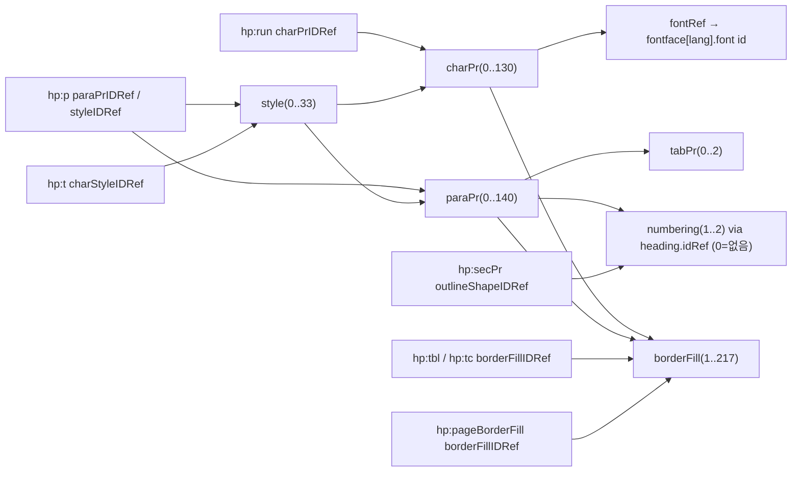

# HWPX 참조 구조 분석 (R1 = 한글이 직접 저장한 정상 HWPX)

- 작성: 03-system-designer, 2026-09-29, 근거 결정: DEC-051(근본 원인), DEC-054(참조 파일 사용 범위)
- 용도: `03-system-design.md` v5.2 §2-4 / §3-3 / §3-4 의 근거 문서. 05 개발자와 06 테스터는 이 문서의 【관찰】 항목만 "확정 사실"로 취급한다.
- **기밀 취급 선언**: 분석 대상 R1은 사용자 내부 문서일 수 있다. 이 문서에는 본문 텍스트·문서 제목·고유명사를 적지 않았다(파일명 자체가 문서 제목이므로 "R1"로만 부른다). 텍스트 노드는 길이만 확인했고, 인용된 XML 골격은 텍스트를 `…`로 가렸다. 태그·속성 이름, enum 값, 레이아웃 수치(구조 값)만 기록했다. R1 파일은 저장소에 복사·임베드하지 않았다.
- 분석 방법: 로컬 Python(`zipfile` + `lxml`) 일회성 스크립트. 외부 전송·웹 검색 없음. 스크립트와 추출물은 `.harness-tmp/_03_hwpx/`에만 두었고 작업 종료 후 삭제했다. (재현 필요 시 아래 §14의 절차로 다시 만든다.)

## 0. 표기 규칙

| 태그 | 의미 |
|---|---|
| 【관찰】 | R1에서 직접 확인. `(n=…)`은 관찰 개수, `[R1:파트#요소경로]`는 근거 위치 |
| 【추론】 | 관찰값에서 이끌어낸 해석. 반증될 수 있음 |
| 【미확인】 | R1에서 관찰되지 않아 확정하지 못함. 스펙 기억으로 채우지 않는다 |
| 【실험】 | 실제 한글에서 열어 봐야 판정 가능(사용자 수행, §12) |

**R1의 성격**: `application="Hancom Office Hangul"`, `appVersion` 9,6,1,10097 (한글 2020/2022 계열), `xmlVersion="1.4"`. 생성 일자 메타가 매우 오래되어 HWP에서 변환·재저장된 이력이 있을 가능성이 있다【추론】 → 신규 작성 문서의 기본값과 다를 수 있다(예: 글꼴 목록의 HFT 서체, 구식 요소). R1은 표 17개·셀 713개·그림 0개·구역 2개짜리 문서 1건이므로 "R1에서 항상 존재"가 곧 "필수"를 뜻하지 않는다.

## 1. 한계

1. 파일 1개만 관찰 → 필수/선택 판정은 "항상 존재 / 일부에만 존재 / 부재" 수준까지만 가능하다.
2. 그림(`hp:pic`), BinData, 머리말/꼬리말, 각주, 수식, 가로 용지, 다단 본문, 글머리표(`hh:bullets`)는 R1에서 관찰되지 않았다 → §13.
3. R1은 자체 검증 XML이므로 "우리 출력이 R1과 같은 모양"이라는 사실은 한글 수용의 필요조건 후보일 뿐 충분조건이 아니다(DEC-051의 교훈).

## 2. 패키지(ZIP) 규칙

【관찰】 엔트리 12개 `[R1:zip central directory]`:

| # | 엔트리 | 압축 | 비고 |
|---|---|---|---|
| 1 | `mimetype` | stored(0) | 19바이트, 개행 없음, extra field 없음 |
| 2 | `version.xml` | stored(0) | |
| 3 | `Contents/header.xml` | deflate | 가장 큼 |
| 4 | `Contents/masterpage0.xml` | deflate | |
| 5 | `Contents/section0.xml` | deflate | |
| 6 | `Contents/section1.xml` | deflate | |
| 7 | `Preview/PrvText.txt` | deflate | |
| 8 | `settings.xml` | deflate | |
| 9 | `Preview/PrvImage.png` | stored(0) | PNG 724x1024 |
| 10 | `META-INF/container.xml` | deflate | |
| 11 | `Contents/content.hpf` | deflate | |
| 12 | `META-INF/manifest.xml` | deflate | |

- `mimetype` 내용은 `application/hwp+zip` (n=1). 우리 기존 구현과 같다.
- 모든 엔트리 타임스탬프 1980-01-01 00:00:00 (n=12). 우리 기존 `_FIXED_DATE_TIME`과 같다.
- deflate 엔트리의 flag_bits=4(압축 옵션 비트), data descriptor(bit3) 없음, ZIP 주석 없음.
- 【추론】 `content.hpf`와 `META-INF/*`가 뒤쪽에 있으므로 한글은 엔트리 순서가 아니라 중앙 디렉터리로 파트를 찾을 가능성이 높다. `mimetype`이 첫 엔트리·stored인 것만 관례로 확실하다. 【실험 E-Z】 로 확인한다.
- 【미확인】 zip 엔트리의 create_system/external_attr 값이 수용에 영향을 주는지(영향 없을 것으로 추정).

XML 프롤로그 【관찰】: 모든 XML 파트가 `<?xml version="1.0" encoding="UTF-8" standalone="yes" ?>`(큰따옴표, `?>` 앞 공백)로 시작하고 루트가 같은 줄에 이어진다(개행 없음, BOM 없음). lxml 기본 직렬화(`<?xml version='1.0' ...?>` 작은따옴표 + 개행)와 바이트가 다르다. XML상 동등하지만 수용 영향 여부는 【실험】. 생성기는 관찰된 바이트 형태를 그대로 재현한다(변수 제거 원칙).

## 3. 패키지 메타 파트

### 3-1. `version.xml` `[R1:version.xml]` (n=1)

```
<hv:HCFVersion xmlns:hv="http://www.hancom.co.kr/hwpml/2011/version"
  tagetApplication="WORDPROCESSOR" major="5" minor="0" micro="5" buildNumber="0" os="1"
  xmlVersion="1.4" application="Hancom Office Hangul" appVersion="9, 6, 1, 10097 WIN32LEWindows_Unknown_Version"/>
```
- 【관찰】 속성명 `tagetApplication`은 철자 그대로(오타 아님, 그대로 써야 함). 루트 요소는 `hv:HCFVersion`, 자식 없음.
- `xmlVersion="1.4"`는 header.xml의 `hh:head@version="1.4"`와 일치한다.
- 【실험 E-V】 `application`/`appVersion`에 우리 생성기 이름을 넣어도 수용되는지(정직한 표기 vs 한글 표기 모사).

### 3-2. `META-INF/container.xml` (n=1)
```
<ocf:container xmlns:ocf="urn:oasis:names:tc:opendocument:xmlns:container" xmlns:hpf="http://www.hancom.co.kr/schema/2011/hpf">
  <ocf:rootfiles>
    <ocf:rootfile full-path="Contents/content.hpf" media-type="application/hwpml-package+xml"/>
    <ocf:rootfile full-path="Preview/PrvText.txt" media-type="text/plain"/>
  </ocf:rootfiles>
</ocf:container>
```
- 【관찰】 `PrvImage.png`는 rootfile에 없다. 우리 기존 구현은 `ocf` 네임스페이스 URI가 `http://www.hancom.co.kr/hwpml/2011/container`(틀림)이고 `version="1.0"` 속성을 붙였다.

### 3-3. `META-INF/manifest.xml` (n=1)
`<odf:manifest xmlns:odf="urn:oasis:names:tc:opendocument:xmlns:manifest:1.0"/>` — 【관찰】 자식 없는 빈 요소. 우리 기존 구현은 `ocf:manifest` + `file-entry` 목록을 채웠다(틀림).

### 3-4. `Contents/content.hpf` (n=1)
- 루트 `opf:package`, 네임스페이스 15개 선언(§4), 속성 `version=""`, `unique-identifier=""`, `id=""` — 【관찰】 세 속성 모두 빈 문자열로 존재.
- `opf:metadata` 【관찰】 자식 순서: `opf:title`(텍스트 있음, 제목이므로 미기록), `opf:language`(값 `ko`), `opf:meta name="creator" content="text"`(빈), `subject`(빈), `description`(빈), `lastsaveby`(텍스트 있음), `CreatedDate`(ISO-8601 UTC `YYYY-MM-DDTHH:MM:SSZ`), `ModifiedDate`(동일 형식), `date`(한국어 로캘 날짜 문자열), `keyword`(빈). `opf:meta`는 항상 `content="text"` 속성을 가지며 값은 요소 텍스트에 둔다.
- `opf:manifest` 【관찰】 `opf:item id=… href=… media-type="application/xml"` 5개: `header`(Contents/header.xml), `masterpage0`, `section0`, `section1`, `settings`(settings.xml). Preview·container 파일과 BinData는 등재되지 않았다(그림이 없는 문서이므로 BinData 등재 방식은 【미확인】).
- `opf:spine` 【관찰】 `opf:itemref idref linear`: `header`(yes), `section0`(yes), `section1`(no). masterpage는 spine에 없다.
- 【추론】 `section1`의 `linear="no"`는 R1 이력(변환) 특성일 수 있다. 신규 문서에서 모든 구역이 `yes`인지 【미확인】.

### 3-5. `settings.xml` (n=1)
`ha:HWPApplicationSetting`(ns `ha`, `config`) 아래 `ha:CaretPosition listIDRef paraIDRef pos`(모두 정수) + `config:config-item-set name="PrintInfo"` 안에 `config:config-item name type`(boolean/short) 7개. 【추론】 뷰어 상태 저장용이며 문서 내용과 무관. 필수 여부 【실험】.

### 3-6. `Preview/PrvText.txt`, `Preview/PrvImage.png`
- PrvText 【관찰】: UTF-8(BOM 없음), 줄 구분 CRLF, 약 1,000자 분량(문서 앞부분 발췌), 첫 줄이 `<`…`>`로 감싸인 형태. 우리는 본문 첫 부분을 같은 형식으로 쓴다(내용은 사용자 자신의 문서이므로 문제 없음).
- PrvImage 【관찰】: PNG(첫 쪽 미리보기 724x1024). 렌더링 기능이 필요하므로 우리는 기본 생략하고, 필요성은 【실험 E-P】.

### 3-7. `Contents/masterpage0.xml` (n=1)
- 【관찰】 루트 `masterPage`는 **접두어·기본 네임스페이스 없이**(무네임스페이스) 15개 xmlns 선언만 가진다. 속성 `id="masterpage0" type="BOTH" pageNumber="0" pageDuplicate="0" pageFront="0"`, 자식 `hp:subList`(속성 `id`, `textDirection`, `lineWrap`, `vertAlign`, `linkListIDRef`, `linkListNextIDRef`, `textWidth`, `textHeight`, `hasTextRef`, `hasNumRef`) 안에 빈 `hp:p` 2개(각 `hp:run` 1개 + `hp:linesegarray`).
- 구역 1(section0)의 `secPr`만 `masterPageCnt="1"` + `<hp:masterPage idRef="masterpage0"/>`를 가지며, 구역 2(section1)는 `masterPageCnt="0"`이고 `hp:masterPage` 자식이 없다 → 【관찰】 바탕쪽이 없는 구역이 정상 저장본에 존재한다. 우리 생성기는 바탕쪽을 만들지 않는다(구역 2 형태).

## 4. 네임스페이스 (15개, 모든 XML 파트의 루트에 동일 선언 — version/container/manifest/settings 제외)

| 접두어 | URI |
|---|---|
| ha | http://www.hancom.co.kr/hwpml/2011/app |
| hp | http://www.hancom.co.kr/hwpml/2011/paragraph |
| hp10 | http://www.hancom.co.kr/hwpml/2016/paragraph |
| hs | http://www.hancom.co.kr/hwpml/2011/section |
| hc | http://www.hancom.co.kr/hwpml/2011/core |
| hh | http://www.hancom.co.kr/hwpml/2011/head |
| hhs | http://www.hancom.co.kr/hwpml/2011/history |
| hm | http://www.hancom.co.kr/hwpml/2011/master-page |
| hpf | http://www.hancom.co.kr/schema/2011/hpf |
| dc | http://purl.org/dc/elements/1.1/ |
| opf | http://www.idpf.org/2007/opf/ |
| ooxmlchart | http://www.hancom.co.kr/hwpml/2016/ooxmlchart |
| hwpunitchar | http://www.hancom.co.kr/hwpml/2016/HwpUnitChar |
| epub | http://www.idpf.org/2007/ops |
| config | urn:oasis:names:tc:opendocument:xmlns:config:1.0 |

- 【관찰】 `header.xml`(`hh:head`), `section*.xml`(`hs:sec`), `content.hpf`(`opf:package`), `masterpage0.xml` 루트가 같은 15개를 선언. `version.xml`은 `hv`(http://www.hancom.co.kr/hwpml/2011/version)만, `container.xml`은 `ocf`(urn:oasis:names:tc:opendocument:xmlns:container)+`hpf`, `manifest.xml`은 `odf`(urn:oasis:names:tc:opendocument:xmlns:manifest:1.0), `settings.xml`은 `ha`+`config`.
- 우리 기존 `opf` URI(`…/hwpml/2011/package`)와 `ocf` URI(`…/hwpml/2011/container`)는 R1과 다르다(틀림).
- 【실험 E-N】 선언 수를 줄여도 되는지(기본은 15개 전부 선언 = 초집합).

## 5. `Contents/header.xml`

### 5-1. 최상위 순서 【관찰】(n=1)
`hh:head`(`version="1.4"`, `secCnt`=구역 수) → `hh:beginNum`(`page footnote endnote pic tbl equation`, 모두 1) → `hh:refList` → `hh:compatibleDocument`(`targetProgram="HWP201X"`, 자식 `hh:layoutCompatibility` 빈 요소) → `hh:docOption`(자식 `hh:linkinfo path="" pageInherit="1" footnoteInherit="0"`) → `hh:trackchageConfig flags="56"`(철자 그대로).

### 5-2. `hh:refList` 자식 순서와 개수 【관찰】
`fontfaces`(7) → `borderFills`(217) → `charProperties`(131) → `tabProperties`(3) → `numberings`(2) → `paraProperties`(141) → `styles`(34). 각 컨테이너의 `itemCnt`는 실제 자식 수와 100% 일치(7개 컨테이너 전부). `hh:bullets`/`hh:memoProperties`는 부재 【관찰: 부재】, 존재 여부 필수성 【미확인】.

### 5-3. 요소별 구조

**fontfaces** `[R1:header#refList/fontfaces]`: `hh:fontface lang fontCnt` 7개, `lang` 값과 순서 = HANGUL, LATIN, HANJA, JAPANESE, OTHER, SYMBOL, USER. `fontCnt`는 자식 `hh:font` 수와 일치(n=7). `hh:font id face type isEmbedded`(id는 각 lang 안에서 0부터 연속, `type` = TTF 44 / HFT 35, `isEmbedded="0"` n=79). 자식은 `hh:typeInfo`(속성 `familyType weight proportion contrast strokeVariation armStyle letterform midline xHeight`, n=79 중 다수) 또는 `hh:substFont face type isEmbedded binaryItemIDRef`(n=7). TTF 기본 글꼴(굴림/돋움/바탕 계열)의 typeInfo는 `familyType=FCAT_GOTHIC weight=6 proportion=0 contrast=0 strokeVariation=1 armStyle=1 letterform=1 midline=1 xHeight=1` 패턴.

**borderFills** (n=217, id 1..217 — **1부터 시작**): `hh:borderFill id threeD shadow centerLine breakCellSeparateLine`(값: 0/0/NONE/0, 전 217건 동일) 자식 순서 `slash`(type NONE, Crooked 0, isCounter 0) → `backSlash` → `leftBorder` → `rightBorder` → `topBorder` → `bottomBorder` → [`diagonal`] → [`hc:fillBrush`]. 각 border는 `type width color`(type: NONE/SOLID/DOUBLE_SLIM, width는 `"0.12 mm"` 형식 문자열, color `#RRGGBB`). `diagonal` 없음 n=35, 있음 n=182 → 선택 요소. `hc:fillBrush` n=10 → 선택, 자식 `hc:winBrush faceColor hatchColor alpha`. 표 본문에서 가장 많이 쓰인 "사방 SOLID 0.12 mm #000000, diagonal 없음, fillBrush 없음" 패턴이 실재(표 15개의 `tbl@borderFillIDRef`가 이 패턴, n=15).

**charProperties/charPr** (n=131, id 0..130): 속성 `id height textColor shadeColor useFontSpace useKerning symMark borderFillIDRef`(height는 1/100 pt: 700~3500 등 17종, textColor `#000000`, shadeColor `none`, useFontSpace 0, useKerning 0, symMark NONE, borderFillIDRef ∈ {1,2,4}). 자식 순서 【관찰】: `hh:fontRef`(속성 `hangul latin hanja japanese other symbol user`, 값은 해당 lang의 font id) → `hh:ratio`(같은 7속성, 값 80~100) → `hh:spacing`(같은 7속성, 값 -26..1) → `hh:relSz`(모두 100) → `hh:offset`(모두 0) → [`hh:bold`(빈 요소, n=5)] → `hh:underline type shape color` → `hh:strikeout shape color` → `hh:outline type` → `hh:shadow type color offsetX offsetY`. `hh:italic`은 R1에 없다 【미확인】(위치·형태는 02_글자서식 필요).

**tabProperties/tabPr** (n=3, id 0..2): `id autoTabLeft autoTabRight`; 자식은 없거나(n=2) `hp:switch`(§5-6) 안에 `hh:tabItem pos type leader [unit]`(n=1).

**numberings/numbering** (n=2, id 1,2): `id start`, 자식 `hh:paraHead` 7개(`start level align useInstWidth autoIndent widthAdjust textOffsetType textOffset numFormat charPrIDRef checkable`, 요소 텍스트가 번호 서식 `^1.` 형태). `charPrIDRef="4294967295"`은 "지정 안 함" 센티널 값 【추론】. section의 `secPr@outlineShapeIDRef`가 이 id를 참조(값 1 또는 2).

**paraProperties/paraPr** (n=141, id 0..140): 속성 `id tabPrIDRef condense fontLineHeight snapToGrid suppressLineNumbers checked`. 자식 순서 141/141 동일: `hh:align`(horizontal ∈ JUSTIFY 99/CENTER 27/RIGHT 8/LEFT 7, vertical BASELINE) → `hh:heading`(type NONE, idRef 0, level 0) → `hh:breakSetting`(breakLatinWord, breakNonLatinWord, widowOrphan, keepWithNext, keepLines, pageBreakBefore, lineWrap=BREAK) → `hh:autoSpacing eAsianEng eAsianNum` → `hp:switch`(§5-6; 안에 `hh:margin`(자식 `hc:intent`, `hc:left`, `hc:right`, `hc:prev`, `hc:next`, 각 `value unit="HWPUNIT"`)과 `hh:lineSpacing type=PERCENT value unit`) → `hh:border borderFillIDRef offsetLeft offsetRight offsetTop offsetBottom connect ignoreMargin`. 요소명 `intent`는 철자 그대로(첫줄 들여쓰기/내어쓰기, 음수 가능). lineSpacing은 141건 전부 `PERCENT`(값 90~230).

**styles/style** (n=34, id 0..33): `id type name engName paraPrIDRef charPrIDRef nextStyleIDRef langID lockForm`. `type` PARA 31 / CHAR 3, `langID="1042"`. id 0 = 기본 "Normal"(한글 표기 바탕글) 문단 스타일. 문단의 `paraPrIDRef`는 스타일의 `paraPrIDRef`와 **다를 수 있다**(첫 문단이 style 0 + 다른 paraPr) → 문단 자체의 paraPrIDRef가 실제 서식을 결정한다【추론】.

### 5-4. ID 참조 그래프 【관찰】(무결성 위반 0건)

- section이 참조하는 charPr 110종, paraPr 123종, style 16종, borderFill 215종이 모두 header에 존재. header 내부 참조(borderFill/tabPr/paraPr/charPr/style/fontRef)도 전부 존재. 참조되지 않는 정의(죽은 항목)가 다수 존재 → 미사용 정의는 허용된다【관찰】.
- **id 시작값 차이**: borderFill·numbering은 1부터, charPr·paraPr·style·tabPr·font는 0부터.

### 5-5. 개수 속성 일치 【관찰】
`itemCnt`(7개 컨테이너)·`fontCnt`(7개 fontface)·`hh:head@secCnt`(=2=section 파일 수) 전부 실제 자식 수와 일치. 생성기는 직렬화 시점에 자식 수로 계산해 쓴다.

### 5-6. `hp:switch` 규칙 【관찰】
paraPr(n=141)의 `hh:margin`+`hh:lineSpacing`, tabPr의 `hh:tabItem`은 다음 래퍼 안에 있다:
```
<hp:switch>
  <hp:case hp:required-namespace="http://www.hancom.co.kr/hwpml/2016/HwpUnitChar"> …새 단위 값… </hp:case>
  <hp:default> …구 단위 값… </hp:default>
</hp:switch>
```
- 두 분기 모두 같은 자식 구조를 가지며, **`default` 분기의 길이 값은 `case` 분기 값의 정확히 2배**(margin 5종 + tabItem pos에서 0이 아닌 값 146/146건 일치, 비율 2.0). `lineSpacing type=PERCENT`의 `value`는 두 분기가 같다(2배 아님).
- 【추론】 case = 1/7200 inch 단위(HWPUNIT), default = 구 단위(1/14400). 생성기는 case 값 v를 만들고 default에 2v를 쓴다.
- switch 없이 직접 margin을 쓰는 형태는 R1에 없다 → 수용 여부 【실험 E-S】(기본은 switch 유지).

### 5-7. header 미관찰 요소 【미확인】
`hh:bullets`, `hh:memoProperties`, `hh:forbiddenWordList`, 변경 추적 관련 상세, `hh:binDataList`(그림 등록 목록이 header에 있는지 여부). 그림 문서에서 필요할지는 04_그림 필요.

## 6. `Contents/section*.xml`

### 6-1. 루트 【관찰】
`hs:sec`(속성 없음, 15개 xmlns 선언). 자식은 `hp:p`만(구역 1: 234개, 구역 2: 52개). 구역 파일 수 = `hh:head@secCnt`.

### 6-2. 구역 설정 `hp:secPr` 【관찰】
위치: **구역의 첫 문단(`hp:p`)의 첫 `hp:run` 안**(n=2, 구역당 1개). 같은 run에 `hp:ctrl`(colPr)이 함께 있다. 순서는 구역 1은 `secPr → ctrl(colPr) → ctrl(pageNum) → tbl → t`, 구역 2는 `ctrl(colPr) → secPr → t`로 달랐다 → 순서 자유도 【추론】(기본은 구역 1 순서).

`hp:secPr` 속성: `id=""`, `textDirection="HORIZONTAL"`, `spaceColumns="1134"`, `tabStop="8000"`, `tabStopVal="4000"`, `tabStopUnit="HWPUNIT"`, `outlineShapeIDRef`(numbering id), `memoShapeIDRef="0"`, `textVerticalWidthHead="0"`, `masterPageCnt`(0/1).
자식 순서(2/2 동일): `hp:grid(lineGrid=0 charGrid=0 wonggojiFormat=0)` → `hp:startNum(pageStartsOn=BOTH page=0 pic=0 tbl=0 equation=0)` → `hp:visibility(hideFirstHeader hideFirstFooter hideFirstMasterPage border=SHOW_ALL fill=SHOW_ALL hideFirstPageNum hideFirstEmptyLine showLineNumber)` → `hp:lineNumberShape(restartType countBy distance startNumber)` → `hp:pagePr` → `hp:footNotePr` → `hp:endNotePr` → `hp:pageBorderFill` ×3(type=BOTH, EVEN, ODD 순, `borderFillIDRef=1 textBorder=PAPER headerInside=0 footerInside=0 fillArea=PAPER`, 자식 `hp:offset left right top bottom`=1417) → [`hp:masterPage idRef`(구역 1만)].
- `hp:pagePr landscape="WIDELY" width="59528" height="84188" gutterType="LEFT_ONLY"` + 자식 `hp:margin header footer gutter left right top bottom` = 4251/4251/0/8503/8503/5669/4251. 세로 A4 용지에 `WIDELY`가 쓰였다 → `landscape`의 다른 값(가로 용지)은 【미확인】.
- `hp:footNotePr`/`hp:endNotePr`: 자식 `autoNumFormat(type=DIGIT userChar prefixChar suffixChar=")" supscript=0)`, `noteLine(length=-1 type=SOLID width="0.1 mm" color=#000000)`, `noteSpacing(betweenNotes=850 belowLine=567 aboveLine=567)`, `numbering(type=CONTINUOUS newNum=1)`, `placement(place, beneathText=0)` — place는 각주 EACH_COLUMN, 미주 END_OF_DOCUMENT.
- `hp:ctrl/hp:colPr id="" type=NEWSPAPER layout=LEFT colCount sameSz=1 sameGap`(n=4; 첫 문단 이외 위치에도 존재, 2단 사례 n=1), `hp:ctrl/hp:pageNum pos=BOTTOM_CENTER formatType=DIGIT sideChar="-"`(n=1, 구역 2에는 없음 → 선택 요소).

### 6-3. 문단 `hp:p` / `hp:run` / `hp:t`
- `hp:p` 속성(6개 전부 존재, n=1085): `id`, `paraPrIDRef`, `styleIDRef`, `pageBreak`(값 0만 관찰, n=1085), `columnBreak`(0), `merged`(0). `id` 값은 `0`(n=27) 또는 `2147483648`(n=1058)만 관찰 — 의미 【미확인】(고유 번호가 아님).
- 자식 순서(1085/1085): `hp:run` 1~6개 → `hp:linesegarray`(마지막, 항상 존재).
- `hp:run` 속성 `charPrIDRef`(n=1229). 자식: `hp:t`만(794), 없음(415 — 빈 run 허용), `tbl`+`t`(16), `ctrl`+`t`(2), `secPr,ctrl,ctrl,tbl,t`(1), `ctrl,secPr,t`(1).
- `hp:t`: 텍스트 노드(혼합 콘텐츠). 속성 `charStyleIDRef`(n=3 존재). 자식 `hp:lineBreak`(빈 요소, 텍스트 사이 삽입, n=1: 문단 안 강제 줄바꿈). 표를 담은 run 끝에는 빈 `<hp:t/>`가 붙는다(n=17 중 다수).
- 글자 서식은 run 단위: 문단 안에서 charPr가 다르면 run이 나뉜다(문단당 최대 6개 관찰).
- 【미확인】 탭(`hp:tab`), 고정폭 공백, 하이퍼링크, 필드(`hp:fieldBegin/End`)는 R1의 어떤 문단에도 나타나지 않았다.
- `pageBreak="1"`의 효과는 【실험 E-B】(R1에서 값 1 미관찰). 자연 쪽 넘김은 R1에서 vertpos가 0으로 되돌아가는 것으로 표현된다(구역 1에서 14회 감소 관찰).

### 6-4. `hp:linesegarray` / `hp:lineseg` 【관찰】(문단 1085개, lineseg 1291개)
속성: `textpos vertpos vertsize textheight baseline spacing horzpos horzsize flags`.
- `textpos`: 그 줄이 시작하는 문단 텍스트 내 글자 위치(0, 다음 줄은 누적 위치). 여러 줄 문단 사례 다수에서 단조 증가.
- `vertpos`: 쪽 안 세로 위치(쪽이 바뀌면 0부근으로 리셋). 같은 문단 내 다음 줄 = `vertpos + vertsize + spacing`(206개 중 201개 일치).
- `vertsize == textheight`: 줄의 최대 글자 높이(해당 문단 run의 최대 charPr `height`와 1066/1068 일치).
- `baseline = round(0.85 × vertsize)` — 1291/1291 일치.
- `spacing`: 줄간격 여분. `lineSpacing PERCENT` 문단에서 `round(vertsize × (percent−100)/100)`과 865/1291 일치(나머지는 표 안/혼합 크기 등, 【미확인】).
- `horzpos`: 0(대부분) 또는 들여쓰기 값. `horzsize`: 줄 너비(본문 = 용지폭 − 좌우 여백 값 근처, 표 셀 안 = `cellSz.width − cellMargin.left − cellMargin.right`).
- `flags`: 첫 줄 `393216`(0x60000), 이어지는 줄 `1441792`(0x160000). 비트 의미 【미확인】 — 값 그대로 사용.
- 【실험 E-L】 linesegarray를 생략/부정확한 값으로 두면 한글이 열 때 재계산하는지.

## 7. 표 `hp:tbl` 【관찰】(n=17, 모두 최상위 문단의 run 안, 중첩 표 0)

계층: `hp:tbl` → `hp:sz` → `hp:pos` → `hp:outMargin` → `hp:inMargin` → [`hp:cellzoneList/hp:cellzone`(n=1)] → `hp:tr`(행 수만큼) → `hp:tc`(셀) → (`hp:subList` → `hp:p`+ , `hp:cellAddr`, `hp:cellSpan`, `hp:cellSz`, `hp:cellMargin`) 순서(713/713 동일).

- `hp:tbl` 속성: `id`(전역 고유 정수, n=17 모두 고유), `zOrder`(0부터 표마다 증가), `numberingType=TABLE`, `textWrap=TOP_AND_BOTTOM`, `textFlow=BOTH_SIDES`, `lock=0`, `dropcapstyle=None`, `pageBreak`(NONE 14 / CELL 3), `repeatHeader=1`, `rowCnt`, `colCnt`, `cellSpacing=0`, `borderFillIDRef`(표 전체 테두리 참조, 11 ×15), `noAdjust`(0/1).
- `hp:sz width widthRelTo=ABSOLUTE height heightRelTo=ABSOLUTE protect=0`.
- `hp:pos treatAsChar=1 affectLSpacing=0 flowWithText=1 allowOverlap=0 holdAnchorAndSO=0 vertRelTo=PARA horzRelTo(PARA/COLUMN) vertAlign=TOP horzAlign=LEFT vertOffset=0 horzOffset=0` — 17/17 글자처럼 취급(인라인).
- `hp:outMargin`/`hp:inMargin left right top bottom`: outMargin 141(12)/140(3)/0/283, inMargin 140(14)/141/510.
- `hp:tc` 속성: `name=""`, `header=0`, `hasMargin`(0:522/1:191), `protect=0`, `editable=0`, `dirty=0`, `borderFillIDRef`(셀별, 211종). `hasMargin=0`이어도 `cellMargin`은 항상 존재하며 표 `inMargin`과 같지 않은 경우가 많다(441건) → hasMargin의 정확한 의미 【미확인】.
- `hp:subList`: `id="" textDirection=HORIZONTAL lineWrap=BREAK vertAlign(CENTER 367/TOP 329/BOTTOM 17) linkListIDRef=0 linkListNextIDRef=0 textWidth=0 textHeight=0 hasTextRef=0 hasNumRef=0`. 셀 안 문단 수 1~5개(1개가 648/713). 셀 안 `hp:p`도 `hp:linesegarray`를 가진다.
- `hp:cellAddr colAddr rowAddr`, `hp:cellSpan colSpan rowSpan`, `hp:cellSz width height`, `hp:cellMargin left right top bottom`(141 ×311, 510 ×224, 567 ×151, 283, 566; top 141/283; bottom 141).
- **병합 규칙 【관찰】(17/17 표)**: 병합으로 덮이는 셀은 `hp:tc`를 만들지 않는다. 모든 `tc`의 (colSpan×rowSpan) 합 = rowCnt×colCnt, `hp:tr` 개수 = rowCnt, 각 tc의 `rowAddr` = 시작 `tr` 인덱스, 셀이 그리드를 겹침 없이 덮음. 병합 사례: colSpan 최대 10, rowSpan 2 등.
- **크기 규칙 【관찰】**: 첫 행 셀 폭 합 = `sz.width`(16/17; 나머지 1건은 첫 행에 rowSpan 셀 존재 등 → 【미확인】). 병합 행은 rowSpan 셀이 앞 행에 있어 합이 작다. 0번 열 셀 높이 합 = `sz.height`(11/17 정확 일치, 나머지는 소폭 차이 — 한글이 열 때 재계산할 가능성 【추론】). 셀 안 lineseg의 `horzsize = cellSz.width − cellMargin.left − cellMargin.right`(예: 32026−282=31744).
- 표를 담는 문단 `hp:p`의 lineseg는 `vertsize = textheight = 표 높이`, `baseline = round(0.85×높이)`(예: 2580→2193).
- 표의 전형 예(골격):
```
<hp:p id="…" paraPrIDRef="…" styleIDRef="0" pageBreak="0" columnBreak="0" merged="0">
 <hp:run charPrIDRef="…">
  <hp:tbl id="…" zOrder="0" numberingType="TABLE" textWrap="TOP_AND_BOTTOM" textFlow="BOTH_SIDES" lock="0" dropcapstyle="None" pageBreak="NONE" repeatHeader="1" rowCnt="…" colCnt="…" cellSpacing="0" borderFillIDRef="…" noAdjust="0">
   <hp:sz …/><hp:pos …/><hp:outMargin …/><hp:inMargin …/>
   <hp:tr><hp:tc name="" header="0" hasMargin="0" protect="0" editable="0" dirty="0" borderFillIDRef="…">
     <hp:subList …><hp:p …><hp:run charPrIDRef="…"><hp:t>…</hp:t></hp:run><hp:linesegarray>…</hp:linesegarray></hp:p></hp:subList>
     <hp:cellAddr …/><hp:cellSpan …/><hp:cellSz …/><hp:cellMargin …/></hp:tc></hp:tr>
  </hp:tbl><hp:t/>
 </hp:run>
 <hp:linesegarray>…</hp:linesegarray>
</hp:p>
```

## 8. 그림 / BinData 【미관찰 — 확정 불가】
R1에는 `hp:pic`, `BinData/` 엔트리, content.hpf의 BinData 등재, header의 바이너리 목록이 전혀 없다. 요소 계층, 이미지 파일 명명, manifest 등록 방식, 크기·위치 속성은 스펙 기억으로 채우지 않는다. **`참조HWPX/04_그림.hwpx` 필요**(§13).

## 9. 단위 검증 【관찰 + 계산】
- 용지 `width=59528`, `height=84188`: 210mm × 297mm를 1/7200 inch로 환산하면 59527.6 × 84188.9 → 일치. 따라서 **HWPUNIT = 1/7200 inch, 1pt = 100 HWPUNIT, 1mm ≈ 283.46 HWPUNIT**.
- 여백 left/right 8503 = 30.0mm, top 5669 = 20.0mm, header/footer 4251 = 15.0mm, 표 셀 여백 141 ≈ 0.5mm, charPr `height` 1000 = 10pt(글자 크기 = pt×100) — 모두 위 환산과 정합.
- 경계 값 폭은 `"0.12 mm"` 같은 mm 문자열이며 HWPUNIT이 아니다.

## 10. 우리 산출물(B0 = 고치기 전 변환 결과) 대비 결함표 【관찰】

| 영역 | R1(정상) | B0(우리, 깨짐) | 심각도 후보 |
|---|---|---|---|
| version.xml | `hv:HCFVersion` + `tagetApplication major minor micro buildNumber os xmlVersion application appVersion` | `tagID="HWPX" major="1" minor="0"` (속성 체계 다름) | 높음(문서 인식 실패의 유력 원인) |
| container.xml | ns `urn:oasis:names:tc:opendocument:xmlns:container`, rootfile 2개 | 다른 ns URI, `version` 속성, rootfile 1개 | 높음 |
| manifest.xml | `odf:manifest` 빈 요소 | `ocf:manifest` + file-entry 목록 | 높음 |
| content.hpf | `opf` ns=idpf, 15 ns, metadata, manifest 5항목, spine 3항목 | `opf` ns 틀림, metadata 없음, spine 1항목 | 높음 |
| header.xml | 413KB, refList 7컨테이너 | 322바이트, 자체 `hh:charShapes/paraShapes` | **치명** |
| section 루트 | 15 ns | 2 ns | 중 |
| `hp:secPr` | 구역 첫 문단 첫 run 안 필수 | 없음 | **치명**(쪽·구역 설정 부재) |
| `hp:p` | `id paraPrIDRef styleIDRef pageBreak columnBreak merged` + `hp:linesegarray` | `paraShapeIDRef`, `bboxPt`(자체 속성), linesegarray 없음 | **치명** |
| `hp:run` | `charPrIDRef` 하나만 | `charShapeIDRef`, `fontName`, `fontSizeHwpunit`, `bold`, `italic` (자체 속성) | **치명** |
| 표 | `hp:tbl`(sz/pos/outMargin/inMargin/tr/tc/subList/cellAddr/cellSpan/cellSz/cellMargin) | 자체 속성(`rowAddr` 등) 구조 | **치명** |
| 그림 | (미관찰) | `BinData/bin*.jpg` + 자체 `hp:pic` | 미확정 |
| Preview/settings | PrvText·PrvImage·풍부한 settings | 없음/빈 요소 | 낮음(필수 여부 【실험】) |
| 글꼴 | header 글꼴 표 + charPr fontRef | run에 PDF 서브셋 글꼴명을 자체 속성으로 기재 | 높음 |
| 텍스트 분할 | 줄/문단 단위 | 글자 조각마다 run(“*”, “w” 등 1글자 run 다수) | 중(품질) |

## 11. 최소 유효 HWPX 판단 — 필수 / 생략 가능 / 미확정

판정 기준: R1에서 "관찰상 생략 사례가 있음"이면 **생략 가능(관찰 근거)**, "R1에 항상 존재"이면 **미확정 → 초집합으로 발행**, 실험 ID가 붙은 항목은 사용자 실험 전까지 확정 금지. 생성기의 기본 정책은 "R1에서 항상 존재하는 요소는 전부 발행(초집합)"이다. 최소화는 실험으로 확인된 것만 한다.

| 요소/파트 | R1 관찰 | 판정 | 근거/실험 |
|---|---|---|---|
| `mimetype`(첫 엔트리·stored) | 항상 | **필수(관례+오류 증거)** | B0에서도 지켰음에도 실패 → 이것만으로는 불충분 |
| `version.xml` | 항상 | 미확정(발행) | E-V |
| `META-INF/container.xml`, `manifest.xml` | 항상 | 미확정(발행) | E-Ablation(D2) |
| `Contents/content.hpf` (metadata/manifest/spine) | 항상 | 미확정(발행) | 〃 |
| `settings.xml` | 항상 | 미확정(발행) | E-Ablation(D2) |
| `Preview/PrvText.txt` | 항상(container rootfile 포함) | 미확정(발행) | E-P |
| `Preview/PrvImage.png` | 항상, 단 rootfile 미등재 | 미확정(기본 생략) | E-P |
| `masterpage0.xml` + `hp:masterPage` | 구역 2에서 부재 | **생략 가능(관찰 근거)** | 구역 2 형태 |
| header `hh:beginNum`, `compatibleDocument`, `docOption`, `trackchageConfig` | 항상 | 미확정(발행) | E-H |
| `hh:refList` 7개 컨테이너 | 항상 | 미확정(발행, 최소 항목만 채움) | E-H(최소 header) |
| fontface 7개 lang 전부 | 항상 | 미확정(발행) | E-H |
| `hh:numbering` ≥1 | 항상(id 1,2) | 미확정(발행, 1개) | E-H |
| `borderFill` `diagonal`/`fillBrush` | 부재 사례 다수 | **생략 가능(관찰 근거)** | n=35 / n=207 |
| `charPr` `hh:bold` | 부재 사례 다수 | **생략 가능(관찰 근거)** | 기본 charPr에 없음 |
| `hh:italic` | 미관찰 | 미확정 | 02_글자서식 |
| `hp:switch` 래퍼 | 항상 | 미확정(발행) | E-S |
| section `hp:secPr` (첫 문단 첫 run) | 구역마다 존재 | 미확정(발행) — B0에서 부재였고 치명 결함 후보 | E-Ablation(D3) |
| `hp:ctrl/colPr` | 구역 첫 문단에 존재 | 미확정(발행) | 〃 |
| `hp:ctrl/pageNum` | 구역 2에서 부재 | **생략 가능(관찰 근거)** | 구역 2 형태 |
| `hp:footNotePr/endNotePr/pageBorderFill×3` | 항상 | 미확정(발행) | 〃 |
| `hp:p` 6개 속성 | 항상 | 미확정(발행) | 〃 |
| 빈 `hp:run` | 415건 존재 | **허용됨(관찰 근거)** | 빈 문단 = run 1개 + 자식 없음 |
| `hp:linesegarray` | 1085/1085 존재 | 미확정(기본 발행, 단일 추정값) | E-L |
| `hp:tbl/cellzoneList` | 1/17 | **생략 가능(관찰 근거)** | |
| XML 프롤로그 바이트 형태 | 통일 | 미확정(관찰 형태 재현) | E-X |
| 15개 xmlns 선언 | 항상 | 미확정(전부 발행) | E-N |
| ZIP 엔트리 순서 | mimetype 이후 임의 | 미확정 | E-Z |

**결론**: R1만으로 "이 요소가 없으면 한글이 거부한다"를 증명할 수 있는 항목은 없다(거부 사례가 없으므로). 그래서 (1) 발행은 초집합, (2) 초집합이 실제로 열리는지를 G1에서 사용자가 확인, (3) 열리지 않으면 층 교체 진단(D-시리즈)으로 결함 층을 이분 탐색한다.

## 12. 실험 절차(사용자가 한글에서 열어 확인)

### 12-1. 기록 양식(모든 실험 공통)
파일명 / 한글 버전(도움말 > 한글 정보) / ① 문서로 인식되어 열리는가(예/아니오, 아니오면 무엇이 보이는가) ② 경고·복구 대화상자 여부(문구 그대로) ③ 내용 표시 일치(체크리스트) ④ 다른 이름으로 저장 성공 여부.

### 12-2. 프로브 세트(G1, unit-4R 이후 생성기가 만든다; 산출은 `.harness-tmp/probe/`, 저장소 미포함)
| 프로브 | 내용 | 확인 목적 |
|---|---|---|
| P1a | 빈 문서(문단 1개, 텍스트 없음), 초집합 발행, version.xml은 R1 관찰 값 그대로 | 초집합 패키지·header·section 수용 |
| P1b | P1a에서 `application`/`appVersion`만 자체 값 | E-V (정직한 표기 수용 여부) |
| P2 | 서로 다른 굵기/크기(20pt)/정렬(가운데)/들여쓰기 문단 5개 | charPr/paraPr 동적 생성, 표시 확인 |
| P3 | 2×2 표 + 가로 병합 표, 사방 실선 | 표 구조·borderFill |
| P4 | 2쪽 분량 + 문단 앞 간격(`prev`), 변형 P4a(lineseg 있음)/P4b(lineseg 생략) | E-B, E-L, 세로 배치 |
| P5(04 수령 후) | 그림 1개 + 아래 글 | pic 구조 |

### 12-3. P1a 실패 시 층 교체 진단(D-시리즈) — 01_빈문서.hwpx(비기밀, 사용자 제공)를 로컬에서만 사용
층 = (A) 패키지 메타(mimetype, version, container, manifest, hpf, settings, Preview), (B) header.xml, (C) section*.xml.
- D1: 01_빈문서의 A층 + 우리 B·C층 → 열림?
- D2: 우리 A층 + 01_빈문서의 B·C층 → 열림?
- D3: 01_빈문서의 A·B층 + 우리 C층 → 열림?
결과로 결함 층을 특정한 뒤 그 층 안에서 파트 하나씩 교체(ablation)한다. 진단 도구는 `tools/`의 스크립트로 두고 01_빈문서는 입력 인자로만 받는다(저장소에 포함하지 않음).

### 12-4. 개별 실험 목록
| ID | 변형 | 알고 싶은 것 |
|---|---|---|
| E-V | version.xml application/appVersion 자체 값 | 정직한 표기 수용 여부 |
| E-X | XML 프롤로그 lxml 기본 형태 | 프롤로그 바이트 영향 |
| E-N | xmlns 15개 → 사용하는 것만 | 네임스페이스 선언 최소화 |
| E-Z | 엔트리 순서 변경(mimetype 첫 번째만 유지) | 순서 의존성 |
| E-P | PrvText/PrvImage 유무 | Preview 필요성 |
| E-H | header 항목 최소화(스타일 1개, 글꼴 소수) | 최소 header |
| E-S | `hp:switch` 제거 | 래퍼 필수 여부 |
| E-B | 둘째 쪽 첫 문단 `pageBreak="1"` | 쪽 나눔 표현 |
| E-L | linesegarray 생략/추정값/부정확값 | 재계산 여부 |

## 13. 미확인 목록과 추가 참조 파일 요청 (규칙 A 질문으로 이관)

| 항목 | 필요한 참조 | 우선순위 |
|---|---|---|
| 빈 문서 최소 골격, 신규 문서 기본 header/글꼴/스타일, version.xml 신규 문서 값 | `01_빈문서.hwpx` | **필수** |
| 그림 개체 `hp:pic`, BinData 파트 명명·등재, header/hpf 등록 | `04_그림.hwpx` | **필수** |
| `hh:italic` 형태·위치, 굵게/크기/정렬의 신규 문서 표현 | `02_글자서식.hwpx` | 권장 |
| 새로 만든 표의 기본 속성(R1은 변환 이력 가능성) | `03_표.hwpx` | 선택 |
| 가로 용지 `landscape` 값 | 가로 방향 빈 문서 1개(`05_가로쪽.hwpx`, 새 제안) | 선택 |
| `hp:p@id` 의미, `pageBreak="1"`, `hasMargin` 의미, lineseg `flags` 비트 | 실험 | E-B 등 |

## 14. 재현 절차(스크립트는 삭제됨)
`.harness-tmp/_03_hwpx/`에 임시 스크립트를 만들어 (1) `zipfile.infolist()`로 엔트리·압축, (2) lxml로 요소별 속성/자식 순서 빈도표, (3) header ID 집합과 section 참조 집합의 차집합, (4) itemCnt/자식 수 비교, (5) 표 그리드 커버리지, (6) lineseg 관계식 검증을 수행했다. 텍스트 노드는 길이만 출력했다. 다시 필요하면 같은 방식으로 `_03_hwpx` 식별자 아래에서만 만들고 끝나면 지운다.
