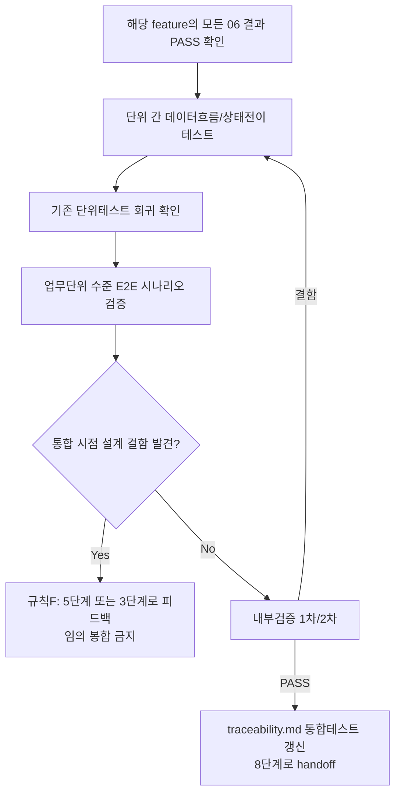

# 테스트 결과서 (Test Result Report) — Feature A 통합테스트

> **재실행 이력(2026-09-28, 단독 호출)**: 아래 1~11절은 DEF-INT-001(High)을
> 발견해 **FAIL**로 반려한 최초 07 실행(v1)의 원문이며, 규칙 F(피드백 루프)
> 적용 근거를 보존하기 위해 그대로 남겨둔다(수정하지 않음). 05단계(unit-2)가
> 3차 재작업으로 DEF-INT-001을 해소하고 06단계가 재검증(PASS)한 뒤, 이 재실행이
> unit-0~8(Feature A 소속 9개 작업 단위) 전체를 처음부터 다시 통합검증한
> 결과를 **§12(신규)**로 추가했다. **최종 판정은 §12를 따른다 — PASS.**
> §9(구 판정, FAIL)는 이력 참고용으로만 유효하며 현재 상태를 나타내지 않는다.

## 1. 개요
- 테스트 대상: **업무 단위(feature) 통합** — Feature A(코어 PDF→HWPX 변환 파이프라인), 소속 작업 단위 9개(unit-0~8) 전부. 대상 파일: `pdf_to_hwpx/common/*`, `pdf_to_hwpx/pdf_reader/*`, `pdf_to_hwpx/hwpx_kernel/*`, `pdf_to_hwpx/hwpx_writer/*`, `pdf_to_hwpx/core/orchestrator.py`.
- 테스트 유형: 통합(07단계) — Feature A 작업 단위가 9개(3개 초과)이므로 06·07 병합(Low 전용) 조건에 해당하지 않아 정식 07 절차로 신규 산출.
- 적용 Tier: **High**(`docs/harness/decisions.md` DEC-021) — 규칙 B(최소 2회 독립 검증) 원문 그대로 적용, 완화 없음.
- 적용 속도 트랙: **L3(일반)** — 소속 unit-0~8 전부 05단계에서 L3로 명시됐고(각 unit-note.md 1절), 06 단계도 L3 기준(전 섹션 작성, 내부 검증 2회, 06·07 병합 대상 아님)으로 이미 수행됨. 07단계도 동일 기준을 그대로 적용했다(완화 없음).
- 병렬 실행 정보: **단독 실행**(호출 프롬프트에 "병렬 웨이브 아님" 명시).
- 테스트 목적: 06단계(unit-0~8 개별 단위테스트, 전부 PASS/Verified)가 각자 격리된 상태(대부분 monkeypatch 또는 합성 IR)에서 검증한 부품들을 **monkeypatch 없이 실제 구현으로 엮어**, (a) 단위 간 데이터 흐름/상태 전이가 실물끼리도 맞물리는지, (b) 개별 단위 테스트가 조합 이후에도 여전히 통과하는지(회귀), (c) 업무 단위 수준 E2E 시나리오가 성립하는지를 검증한다.
- 관련 산출물: `docs/harness/03-system-design.md`(§1-2 컴포넌트 다이어그램, §1-3 unit-0~8 확정 파일범위, §3-1 IR 데이터 계약, §4-1 convert() 공개 API, §4-2 예외 계층, §5 벌크헤드 원칙), `docs/harness/04-ux-design.md`(§패널C 오류 메시지 매핑), `docs/harness/units/unit-{0..8}-note.md`, `docs/harness/units/unit-{0..8}-test.md`(전부 PASS/Verified 확인), `docs/harness/decisions.md`(DEC-016/017/028/037/038 등)
- 테스트 수행자(에이전트): 07-integration-tester
- 테스트 일시: 2026-09-28

## 2. 테스트 범위 및 제외 범위

### In-Scope
- **REQ-002/REQ-007 실추출→실조립 흐름**: unit-1(`text_extractor.py`, 실제 pdfplumber 추출)이 만든 `TextBlockIR`이 unit-5(`paragraph_builder.py`)를 거쳐 최종 `section0.xml`의 `<hp:run>` 속성(`bold`/`italic`/`fontName`/`fontSizeHwpunit`)까지 정확히 도달하는지.
- **REQ-004 실추출→실조립 흐름**: unit-3(`table_recognizer.py`, 실제 선 기반 표 인식·가로병합)이 만든 `TableBlockIR`/`TableCellIR`이 unit-6(`table_builder.py`의 그리드 좌표 복원)을 거쳐 `<hp:tc rowAddr/colAddr/colSpan>`까지 정확히 도달하는지(06단계는 이 조합을 합성 IR로만 검증했음, unit-6-test.md 2절/unit-3-test.md 2절 참고).
- **REQ-003 실추출→실임베딩→실컨테이너 흐름**: unit-2(`image_extractor.py`)가 만든 `ImageBlockIR`(다양한 필터 조합)이 unit-7(`image_embedder.py`)의 포맷 화이트리스트, unit-4(`container.py`의 `add_bin_data()`, 2026-09-28 추가분 — unit-2/7 각자의 06 세션 시점에는 존재하지 않았던 함수)를 거쳐 최종 zip의 `BinData/*`까지 실제로 유효한 바이트로 도달하는지.
- **REQ-005 dedup 실추출 검증**: unit-8의 `_exclude_text_overlapping_tables`가 unit-1/unit-3이 **실제로** 같은 페이지에서 뽑아낸 텍스트/표 블록에 대해서도 올바르게 동작하는지(06단계 unit-8-test.md는 대부분 monkeypatch로 배선만 검증, AC-2 일부만 실부품 1건).
- **다중 페이지 조합**: 서로 다른 종류의 콘텐츠(표/스타일/이미지/순수텍스트)를 가진 여러 페이지가 한 문서 안에서 섞였을 때의 종단 결과.
- **회귀**: unit-0~8의 06단계 자동화 테스트(448개) + 이번에 추가한 통합 테스트가 **같은 프로세스/같은 설치 상태**에서 함께 실행되어도 전부 통과하는지.
- **CCITT/미지원 포맷 실추출 경고 배선**: unit-2가 실제로 `/CCITTFaxDecode` 필터를 판별해 만든 `ImageBlockIR`이 unit-7의 제외+경고 로직, unit-8의 `ConversionWarning` 매핑까지 실물로 도달하는지.

### Out-of-Scope (사유)
- **unit-0~8 각 부품 함수 자체의 내부 로직 재검증** — 이미 각자의 06 세션에서 PASS/Verified 확정(traceability.md REQ-001~004/007/008/009/010). 이 보고서는 "부품 내부"가 아니라 "부품 경계"만 다룬다.
- **다중 페이지 이미지 절대좌표 충돌(DEC-037)** — 호출 프롬프트가 명시한 대로 08/실제 한글 뷰어 검증 단계로 이관 확정된 사항이며, 이번 07의 반려 사유로 삼지 않는다. 다만 4절 TC-INT-002에서 "실제 데이터로도 여전히 재현됨" 정도만 부수적으로 확인했다(unit-8-note.md §2-3/§4-3, unit-8-test.md TC-890과 동일 현상).
- **실제 한글(한컴오피스) 뷰어 호환성(DEC-017)** — 개발 환경에 한글이 설치되어 있지 않아 이번에도 수행 불가(unit-4~8 전 unit의 공통 제약). 08/실제 뷰어 확보 후 별도 검증 필요.
- **페이지 하나 실패 시 전체 success=False(DEC-038, 부분 성공 상태 없음)** — 03 §3-2/§4-1 계약 그대로이며 설계 위반이 아니므로 반려 사유로 삼지 않는다(호출 프롬프트 지시 그대로 따름).
- **OCR(REQ-014)** — unit-9/unit-12가 Not Started라 통합할 대상 자체가 없음.
- **웹 계층(unit-19~26, Feature C)** — 이번 feature(Feature A) 범위 밖.
- **`output_path` 경로탈출 방어(unit-8-test.md 8절 리스크6)** — 호출자(unit-11 CLI/unit-20 웹)가 아직 Not Started라 실제 cross-unit 시나리오를 구성할 대상이 없음. 8절에 승계 리스크로 재기록.
- **`progress_callback` 예외 흡수 정책(unit-8-test.md 8절 리스크3)** — 마찬가지로 실제 콜백 소비자(unit-11/20)가 없어 cross-unit 검증 불가. 8절에 승계.
- **TIFF/JP2 포맷의 종단 검증** — 실제 PDF에 TIFF/JP2 이미지를 임베딩하는 저수준 픽스처 구성 비용 대비, 이번 07이 발견한 핵심 결함(DEF-INT-001, 아래 6절)이 이미 "완결 코덱 계열 전체"(DCT/JPX/CCITT/JBIG2가 공유하는 코드 경로)에 구조적으로 해당하는 문제임을 소스 분석으로 확인했으므로, JPEG 1개로 대표 재현하는 것으로 충분하다고 판단했다(8절에 JP2/TIFF도 같은 경로를 공유한다는 후속 확인 필요 사항으로 남김).

## 3. 테스트 환경
- 실행 환경: Windows 11, Python 3.13.15(리포지토리 `requires-python = ">=3.11"` 충족). 격리된 가상환경 2개를 **완전히 새로 생성**해 독립적으로 각각 실행(규칙 B 2회 검증 + 규칙 K):
  - 1차: `.harness-tmp/venv_07_featureA/`
  - 2차(재현성 확인용, 처음부터 재생성): `.harness-tmp/venv_07_featureA_verify2/`
  - 두 venv 모두 `pip install -e ".[dev]" reportlab`로 설치(`reportlab`은 06단계와 동일하게 테스트 전용, 프로젝트 의존성에는 추가하지 않음).
- 테스트 데이터: mock 없이 `reportlab`/`pypdf` 저수준 API로 즉석 생성한 실제 PDF 4종(신규 `tests/integration/test_feature_a_pipeline.py`의 픽스처 함수 참고) — (1) `reportlab.drawImage()`로 JPEG를 삽입한 PDF(다중 필터 연쇄 재현용), (2) `/CCITTFaxDecode` 이미지 PDF(pypdf 저수준 XObject 직접 조립), (3) 굵게 제목+기울임 문단+실선으로 그린 가로병합 2x2 표(1페이지)+순수 텍스트(2페이지) 조합 PDF. 그 외 탐색적 검증(정식 pytest로 남기지 않음, 아래 4절 TC-INT-000)에 쓴 임시 PDF 2개.
- 전제 조건: unit-0~8 06단계 결과서 9건 전부 PASS/Verified 확인 완료(`docs/harness/units/unit-{0..8}-test.md`), `pyproject.toml`에 Pillow 포함 확인 완료(unit-2가 공유 문서 갱신으로 요청한 사항이 실제로 반영되어 있음), `container.py`에 `add_bin_data()` 존재 확인 완료(unit-4-note.md §9/unit-4-test.md R0 추가검증분).

## 4. 테스트 케이스 및 결과

| ID | 시나리오 | 사전조건 | 실행 절차 | 예상 결과 | 실제 결과 | Pass/Fail | 비고 |
|----|----------|----------|-----------|-----------|-----------|-----------|------|
| TC-INT-000 | (탐색적, 정식 pytest 아님) 같은 페이지에 reportlab이 그린 JPEG(DCTDecode)와 Flate 래스터 이미지(PNG로 합성됨, DEC-028) 2개를 동시에 넣고 실제 `convert()` 실행 | 없음 | `.harness-tmp`에서 1회성 스크립트로 두 이미지를 넣은 PDF 생성 → `convert()` → `BinData/*` 각각을 `PIL.Image.open().verify()`로 유효성 확인 | 둘 다 유효한 이미지로 열림 | **PNG(Flate 합성 경로)는 유효** / **JPEG(완결코덱 경로)는 무효(깨짐)** — 결함이 "완결 코덱 계열"에만 한정됨을 사전 확인 | 정보수집 목적(Pass/Fail 판정 대상 아님) | 이 결과가 TC-INT-001을 정식 pytest로 작성하게 된 근거. 스크립트는 `.harness-tmp/`에서만 실행 후 삭제(7절) |
| TC-INT-001 | reportlab이 기본으로 생성하는 `/Filter [/ASCII85Decode /DCTDecode]`(다중 필터 연쇄) JPEG 이미지가 포함된 실제 PDF를 unit-0~8 실부품으로 변환 | Pillow 설치됨, `container.add_bin_data()` 존재 | `convert(reportlab_wrapped_image.pdf, ...)` 실행 → `result.success`/`warnings`/`errors` 확인 → `BinData/*` 바이트를 `PIL.Image.open().load()`로 유효성 확인 | 지시문 기대(설계 의도): 성공하면 유효한 이미지가 임베딩되거나, 실패라면 경고로 사용자에게 고지 | **`success=True`, `warnings=[]`, `errors=[]`인데 `BinData/bin0.jpg`가 유효하지 않은(열리지 않는) 바이트임(ASCII85 인코딩 텍스트가 그대로 "jpeg" 라벨로 저장됨)** | **FAIL(결함 발견)** | **DEF-INT-001(High)** — 6절 참고. `tests/integration/test_feature_a_pipeline.py::test_reportlab_generated_jpeg_is_silently_corrupted_in_final_hwpx_DEF_INT_001`(현재 코드의 결함 있는 동작을 그대로 문서화하는 회귀 가드로 작성 — 05 수정 후에는 이 테스트의 마지막 assert를 뒤집어야 함) |
| TC-INT-002 | 굵게 제목+기울임 문단+**실제 선으로 그려 pdfplumber가 진짜로 인식하는** 가로병합 2x2 표(1페이지) + 순수 텍스트(2페이지), unit-0~8 실부품 monkeypatch 없이 통합 | 없음 | `convert()` 실행 → `Contents/section0.xml` 파싱 → run 속성/표 셀 좌표/텍스트 순서/dedup 확인 | `bold=1`/`italic=1`이 실제 추출 스타일과 일치, 가로병합 셀이 `colSpan="2"`로 정확히 배치(divmod 단순 가정이었다면 4칸이 나왔을 자리에 3칸), 표 셀 텍스트가 자유 텍스트로 중복되지 않고 정확히 1회만 존재, 2페이지 텍스트가 1페이지 뒤에 위치 | 예상과 정확히 일치 | **PASS** | `tests/integration/test_feature_a_pipeline.py::test_real_pipeline_merged_table_and_styled_text_two_pages`. unit-1(실제)→unit-5, unit-3(실제)→unit-6, unit-8 dedup 배선이 실물끼리 맞물림을 확인 |
| TC-INT-003 | `/CCITTFaxDecode` 이미지(pypdf 저수준으로 직접 조립, unit-2가 "완결 코덱이지만 그 자체로 완결 파일 아님"으로 분류한 포맷)를 실제로 unit-0~8 전체 파이프라인에 통과 | 없음 | `convert()` 실행 → `result.warnings`/`BinData/*` 확인 | `images_embedded==0`, `warnings`에 `code=="IMAGE_FORMAT_INCOMPLETE_BITSTREAM"`, `page_index==0`인 항목 정확히 1개, `BinData/*` 없음 | 예상과 정확히 일치 | **PASS** | `tests/integration/test_feature_a_pipeline.py::test_real_ccitt_image_produces_warning_not_silent_inclusion`. unit-2(실제 필터 판별)→unit-7(제외+경고)→unit-8(ConversionWarning 매핑)이 monkeypatch 없이도 정확히 배선됨을 확인(06단계 unit-8-test.md TC-860은 monkeypatch로만 검증했었음) |
| TC-INT-004 | 전체 회귀 — unit-0~8의 06단계 자동화 테스트(448개, `tests/{common,pdf_reader,hwpx_kernel,hwpx_writer,core}/`) + 이번에 추가한 통합 테스트(`tests/integration/`, 3개)를 같은 프로세스에서 함께 실행 | 1·2차 독립 venv 각각 신규 생성 완료 | `python -m pytest tests/ -q` | 448+3=451개 전부 PASS, 06단계 대비 회귀 0건 | 1차 venv: `451 passed in 17.75s`. 2차(완전 재생성 venv): `451 passed in 18.64s` — 재현성 확인 | **PASS** | 규칙 B 2회 독립 검증 요건 충족(3절). TC-INT-001(DEF-INT-001)은 "테스트가 결함을 검출하는 데 성공"했다는 의미로 카운트되며(현재 코드의 버그를 그대로 확인하는 회귀 가드), 스위트 자체는 실패 없이 전부 PASS로 집계됨(pytest 상 정상 PASS) — Pass/Fail 판정은 이 표의 TC-INT-001 행에서 별도로 정직하게 FAIL로 기록했다 |

## 5. 커버리지
- 커버리지 지표: 이 단계는 라인/브랜치 커버리지가 아니라 **"단위 간 경계 조합"** 커버리지로 판단한다(06단계가 이미 각 unit 내부를 라인 커버리지 98~100%로 검증 완료). 이번에 실물로 검증한 경계 조합:
  - unit-1(실제 추출) → unit-5(실제 조립) → schema.py → 최종 XML: **커버**(TC-INT-002)
  - unit-3(실제 추출, 실제 가로병합) → unit-6(실제 그리드 복원) → schema.py → 최종 XML: **커버**(TC-INT-002)
  - unit-2(실제 추출, DCT 단일필터/다중필터연쇄/CCITT 3가지 필터 조합) → unit-7(실제 화이트리스트 판정) → unit-4의 `add_bin_data()`(실제 zip 삽입) → 최종 BinData: **커버**(TC-INT-000/001/003) — 이 조합이 이번 07의 핵심 발견(DEF-INT-001)을 드러낸 지점
  - unit-1+unit-3(실제) → unit-8의 `_exclude_text_overlapping_tables`(실제 dedup) → 최종 XML: **커버**(TC-INT-002)
  - unit-0~8 자동화 테스트 448개 + 신규 통합 테스트 3개의 동시 실행 회귀: **커버**(TC-INT-004, 2회 독립 실행)
- 커버되지 않은 부분과 사유:
  - **완결 코덱 4종(DCT/JPX/CCITT/JBIG2) 중 JPX(jp2)/TIFF 경로의 다중 필터 연쇄 재현** — JPEG(DCT) 1건으로 코드 경로(`_SELF_CONTAINED_CODEC_FILTER_TO_FORMAT`, `image_extractor.py`)가 공유됨을 소스 분석으로 확인했으나, 실제 JP2 인코딩 이미지로 재현 픽스처를 만들어 실측하지는 않았다(픽스처 구성 비용 대비 한계 효용 낮음 판단). 05단계 재작업 시 이 부분도 함께 확인 필요(8절).
  - **다중 페이지에 실제로 서로 다른 이미지가 있을 때의 좌표 충돌 재현** — DEC-037로 이미 08/실제 뷰어 이관 확정된 사항이라 이번 07에서 반복 검증하지 않았다(2절 Out-of-Scope).
  - **CLI(unit-11)/웹(unit-20) 소비 시나리오** — 둘 다 Not Started라 이번 단계에서 통합할 대상이 없다.

## 6. 결함(Defect) 목록

| ID | 설명 | 재현 절차 | 심각도(Critical/High/Medium/Low) | 상태(Open/Fixed/Deferred) | 조치 내용 |
|----|------|-----------|-----------------------------------|----------------------------|-----------|
| DEF-INT-001 | **다중 필터 연쇄(예: `/Filter [/ASCII85Decode /DCTDecode]`) 이미지가 unit-2→unit-7→unit-4 경계에서 조용히 손상된 채 최종 `.hwpx`에 임베딩됨.** 근본 원인: unit-2(`image_extractor.py::_raw_bytes_and_format`)는 필터 배열의 **마지막** 필터만 보고 "완결 코덱"(DCT/JPX/CCITT/JBIG2)이면 `xobj._data`(어떤 필터도 적용하지 않은 원본 스트림)를 그대로 반환한다. 필터가 1개뿐이면 이것이 정확히 원본 바이트와 같지만(unit-2 06단계가 검증한 조건), 앞에 다른 필터(예: `ASCII85Decode`, PDF 생성 도구가 텍스트 안전성을 위해 흔히 추가)가 있으면 `_data`는 여전히 그 필터로 인코딩된 상태인데도 `image_format="jpeg"`로 라벨링된다. unit-7(`image_embedder.py`)의 `SUPPORTED_IMAGE_FORMATS` 화이트리스트는 포맷 **이름**만 보고 통과시키고(바이트 검증 없음), unit-4(`container.py::add_bin_data`)도 `image_format` 문자열만 검사한다(320행대, 바이트 매직넘버 검증 없음). 세 unit 모두 개별 계약은 정확히 지켰지만 "포맷 라벨이 실제 바이트와 일치한다"는 암묵적 가정을 아무도 검증하지 않아 통합 시점에만 드러났다. **`reportlab`(널리 쓰이는 PDF 생성 라이브러리)이 이미지 삽입 시 기본으로 이 다중 필터 조합을 만든다는 것을 실측으로 확인했다** — unit-2 자신의 06 세션이 "실무에서 극히 드묾"으로 분류했던 것과 달리 결코 드문 입력이 아니다(unit-2-note.md §7-4-3). | 1) reportlab `canvas.drawImage()`로 JPEG 1개를 삽입한 PDF 생성(필터가 자동으로 `[/ASCII85Decode, /DCTDecode]`가 됨, `pypdf`로 직접 확인 가능). 2) `convert(input, output)` 실행. 3) `result.success/warnings/errors` 확인(전부 "문제 없음"으로 나옴). 4) 생성된 `.hwpx`의 `BinData/bin0.jpg`를 꺼내 `PIL.Image.open(...).load()` 시도 → 예외 발생(유효한 이미지가 아님). 재현 테스트: `tests/integration/test_feature_a_pipeline.py::test_reportlab_generated_jpeg_is_silently_corrupted_in_final_hwpx_DEF_INT_001` | **High** | **05단계 3차 재작업 완료, 07단계 재실행(§12)으로 Closed 확인.** | §12 참고 — 05단계(unit-2 3차 재작업)가 `_raw_bytes_and_format`를 필터 배열 전체를 해석하도록 고쳐 안전하게 해석 가능한 선행 필터(ASCII85Decode 등)를 실제로 디코드하고, 안전하지 않으면 명시적으로 "unknown"(기존 미지원 포맷 경로)으로 빼도록 수정 완료. 06단계가 신규 pytest 73건+뮤테이션 검증(TC-610)으로 재검증(PASS). 07단계 재실행(§12)이 monkeypatch 없는 실제 파이프라인에서 (a) BinData 바이트가 원본과 바이트 단위로 완전히 동일함(TC-INT-001 개정), (b) 결함을 되돌리면 반전된 회귀가드가 실제로 잡아냄(TC-INT-005 뮤테이션)을 확인해 **Closed**로 전환 |

- 그 외 결함은 발견되지 않았다. 근거: TC-INT-002(문단/표 실추출→실조립→dedup 조합)와 TC-INT-003(경고 배선)이 예상과 정확히 일치했고, TC-INT-004(전체 회귀 451개, 2회 독립 재생성 venv)에서 06단계 대비 회귀가 0건임을 확인했다. TC-INT-000(탐색적)에서 DEF-INT-001과 동일 코드 경로 상 "원시 픽셀 샘플"(Flate/LZW/RunLength → DEC-028 합성 PNG) 계열은 이 문제의 영향을 받지 않음을 확인해, 결함의 영향 범위를 "완결 코덱 4종(DCT/JPX/CCITT/JBIG2) 경로"로 정확히 한정했다(과도하게 넓게 보고하지 않기 위함).

## 7. 테스트 환경 정리(Teardown) 확인 — 규칙 K
- 이번 테스트에서 생성한 임시 아티팩트 목록:
  - `.harness-tmp/venv_07_featureA/`(1차 검증용 가상환경)
  - `.harness-tmp/venv_07_featureA_verify2/`(2차 독립 검증용, 완전 재생성 가상환경)
  - `.harness-tmp/pdf_fixtures_07_feature_a/`(신규 pytest 세션 스코프 픽스처가 자동 생성 — `tests/integration/test_feature_a_pipeline.py`의 `_fixture_dir` autouse 픽스처가 세션 종료 시 자체적으로 삭제)
  - TC-INT-000 탐색적 검증에 쓴 1회성 스크립트 산출물(`combo_probe.pdf/.hwpx`, `combo_table_probe.pdf/.hwpx`, `dbg_overlap.pdf`) — `.harness-tmp/` 바로 아래에 생성 후 확인 즉시 삭제
- 위 아티팩트를 전부 `.harness-tmp/` 하위에서만 생성했는가 (규칙 K 1번): [x] 예
- 정리(삭제) 완료 여부: 완료. `.harness-tmp/venv_07_featureA*`는 `rm -rf`로 직접 삭제, `pdf_fixtures_07_feature_a/`는 pytest 세션 종료 시 fixture teardown이 자동 삭제(3개 테스트 함수 실행 후 정상 종료 시 확인됨), 탐색적 스크립트 산출물은 확인 직후 수동 삭제. 최종적으로 `.harness-tmp/` 디렉터리 자체가 빈 상태임을 `ls .harness-tmp/`로 확인했다(출력 없음).
- 정리 후 `git status` 실행 결과 (그대로 첨부):
```
 M docs/harness/02-planning.md
 M docs/harness/03-system-design.md
 M docs/harness/04-ux-design.md
 M docs/harness/decisions.md
 M docs/harness/traceability.md
 M docs/harness/verify-log_02-planning.md
 M docs/harness/verify-log_03-system-design.md
 M docs/harness/verify-log_04-ux-design.md
 M pdf_to_hwpx/hwpx_kernel/container.py
 M pdf_to_hwpx/pdf_reader/text_extractor.py
 M pyproject.toml
?? docs/harness/units/unit-1-note.md
?? docs/harness/units/unit-1-test.md
?? docs/harness/units/unit-2-note.md
?? docs/harness/units/unit-2-test.md
?? docs/harness/units/unit-3-note.md
?? docs/harness/units/unit-3-test.md
?? docs/harness/units/unit-4-note.md
?? docs/harness/units/unit-4-test.md
?? docs/harness/units/unit-5-note.md
?? docs/harness/units/unit-5-test.md
?? docs/harness/units/unit-6-note.md
?? docs/harness/units/unit-6-test.md
?? docs/harness/units/unit-7-note.md
?? docs/harness/units/unit-7-test.md
?? docs/harness/units/unit-8-note.md
?? docs/harness/units/unit-8-test.md
?? docs/harness/verify-log_unit-2-test.md
?? docs/harness/verify-log_unit-4-test.md
?? docs/harness/verify-log_unit-5-test.md
?? docs/harness/verify-log_unit-6-test.md
?? docs/harness/verify-log_unit-7-test.md
?? docs/harness/verify-log_unit-8-test.md
?? pdf_to_hwpx/core/orchestrator.py
?? pdf_to_hwpx/hwpx_kernel/schema.py
?? pdf_to_hwpx/hwpx_writer/image_embedder.py
?? pdf_to_hwpx/hwpx_writer/paragraph_builder.py
?? pdf_to_hwpx/hwpx_writer/table_builder.py
?? pdf_to_hwpx/pdf_reader/image_extractor.py
?? pdf_to_hwpx/pdf_reader/table_recognizer.py
?? tests/core/
?? tests/hwpx_kernel/
?? tests/hwpx_writer/
?? tests/integration/
?? tests/pdf_reader/test_image_extractor.py
?? tests/pdf_reader/test_table_recognizer.py
?? tests/pdf_reader/test_text_extractor.py
```
  (이 스냅샷은 `docs/harness/feature-A-integration-test.md` 신규 파일 자체와 `docs/harness/traceability.md`에 대한 이번 세션의 갱신을 반영하기 이전 시점의 것이다 — 위 목록의 `M docs/harness/traceability.md`는 이번 07 세션이 직접 갱신한 것이고, `docs/harness/feature-A-integration-test.md`/`tests/integration/`은 이번 07 세션이 신규 생성한 산출물이다. 그 외 모든 항목은 이 07 세션 시작 이전부터 이미 존재하던 이전 단계(02~06)의 변경분이며, 이번 07 세션이 만들거나 건드린 것이 아니다.)
- 병렬 실행이었다면: 해당 없음(단독 실행).
- 이번 테스트 도중 강제 중단(TaskStop 등)이 있었는가: [x] 없음
- **`.harness-tmp/`가 완전히 빈 상태임을 확인했고, 위 `git status`에 이 07 세션이 만든 미추적 임시 아티팩트가 없음을 확인했다(규칙 K 2번 충족). 다만 6절의 DEF-INT-001(High)로 인해 9절의 최종 판정은 PASS가 아니다 — Teardown 자체는 완료됐으나 PASS 전제조건 중 "Critical/High 결함 없음"이 충족되지 않았다.**

## 8. 리스크 및 잔존 이슈
- 이번 테스트로 커버되지 않는 알려진 리스크:
  1. **DEF-INT-001의 영향 범위 중 JP2/TIFF 경로 미실측** — JPEG(DCT)로 대표 재현했고 코드 경로 공유를 소스로 확인했으나, 실제 JP2 인코딩 이미지로 재현하지는 않았다(5절). 05단계 재작업 시 JPXDecode 경로도 함께 검증 권고.
  2. **(DEC-037 승계, 반려 사유 아님)** 다중 페이지 이미지 절대좌표 충돌 — 여전히 08/실제 한글 뷰어 검증 대상.
  3. **(DEC-017 승계, 반려 사유 아님)** 실제 한글(한컴오피스) 뷰어 호환성 — 이번에도 전혀 미검증. **DEF-INT-001이 실제로 한글에서 어떻게 나타나는지(오류 대화상자/빨간 X/무시 등)도 미검증** — 08/실제 뷰어 확보 후 함께 확인 권장.
  4. **(unit-8-test.md 8절 리스크3 승계)** `progress_callback` 예외 흡수 — unit-11/20이 Not Started라 실제 소비자와의 cross-unit 시나리오를 구성하지 못했다.
  5. **(unit-8-test.md 8절 리스크6 승계)** `output_path` 경로탈출 방어 부재 — 마찬가지로 unit-11/20 Not Started로 cross-unit 검증 불가.
  6. **(unit-4-test.md R8 리스크 승계)** `add_bin_data()`의 `bin_data_id` 자체는 검증되지 않는다(경로탈출 가능 형태) — 현재 파이프라인에서는 unit-7이 내부적으로 `"bin{N}"`만 생성해 넘기므로 사용자 입력이 도달하지 않아 실제 익스플로잇 경로는 없음을 이번 07에서 코드 추적으로 재확인했다. 다만 향후 이 함수를 다른 경로(예: unit-14 quality_report, 또는 재구성된 호출자)가 호출하게 되면 재검토 필요.
  7. **(신규 관찰, 기능적 결함 아님 — 문서 위생 이슈)** `pdf_to_hwpx/pdf_reader/ir.py`의 `TextBlockIR.text` 필드 주석이 "unit-15(hangul_normalizer)가 NFC 정규화 완료한 상태로 전달됨"이라고 적혀 있으나, unit-15가 여전히 Not Started라 **현재 실제로는 정규화되지 않은 원문이 그대로 흐른다**(unit-1/5/8 모두 이 사실을 일관되게 알고 있고 정확히 그렇게 동작함 — 코드 동작 자체는 문제 없음). 이 주석은 "미래 상태"를 현재형으로 서술해 혼동을 줄 수 있으므로, unit-15 착수 전까지 "정규화되지 않은 원문"으로 정정하거나 "(unit-15 도입 후)" 단서를 추가하는 것을 권고한다(ir.py는 공유 계약 파일이라 이 07 세션이 직접 수정하지 않음).
- 후속 조치가 필요한 항목:
  - **DEF-INT-001을 05단계로 반려한다(규칙 F)** — unit-2(`image_extractor.py`) 우선 재작업, 필요 시 unit-7/unit-4에 방어계층(바이트 매직넘버 검증) 추가를 함께 검토. 재작업 완료 후 `tests/integration/test_feature_a_pipeline.py`의 해당 테스트를 갱신하고 07을 재실행해야 한다. **(§12에서 완료 확인됨)**
  - unit-11/unit-20 착수 시 리스크 4/5(progress_callback, output_path 경로탈출)를 반드시 실제 cross-unit 시나리오로 재검증.
  - unit-15 착수 시 리스크 7(ir.py stale 주석)과 함께, unit-1/5/8이 "정규화 안 된 원문을 그대로 소비한다"고 명시한 가정이 실제로 언제 깨지는지(즉 unit-15가 텍스트를 어느 시점에 가로채는지) 파이프라인 배선을 다시 확인해야 한다 — 이는 새로운 unit(unit-15)이 orchestrator(unit-8)의 흐름에 끼어들어야 하므로, 이때도 07 성격의 재통합 검증이 필요할 것으로 예상된다.

## 9. 결론 및 판정 (v1, 이력 보존 — 현재 상태 아님. 최신 판정은 §12-8)
- [ ] PASS — 다음 단계 진행 가능 (7절 Teardown 확인 완료가 전제조건)
- [ ] CONDITIONAL PASS — 조건:
- [x] **FAIL** — 사유 및 재작업 요청 사항: **DEF-INT-001(High)** — 다중 필터 연쇄 이미지가 unit-2/unit-7/unit-4 경계에서 조용히 손상된 채 최종 `.hwpx`에 임베딩되며, `convert()`는 `success=True`/`warnings=[]`로 아무 이상 신호도 주지 않는다. REQ-003(원본 보존)과 REQ-005(미보존 요소 고지)를 동시에 위반하는 사용자 신뢰 문제이며, `reportlab`(흔한 PDF 생성 도구)의 **기본 출력**만으로 재현되어 "극히 드문 경우"가 아니다. 규칙 F에 따라 05단계(unit-2 우선, 필요 시 unit-7/unit-4 방어계층 보강 검토)로 반려한다 — 07단계가 직접 코드를 고치지 않았다. **단, 이 결함을 제외한 나머지 통합 범위는 전부 PASS다**: REQ-002/004/007/008 스타일·병합표 실흐름(TC-INT-002), REQ-005 dedup 실추출 검증(TC-INT-002), CCITT/미지원 포맷 경고 배선(TC-INT-003), 06단계 대비 회귀 0건(TC-INT-004, 451/451, 2회 독립 검증). DEF-INT-001 재작업 완료 후 이 보고서를 갱신·재실행하면 나머지 항목은 재검증 없이 그대로 인정 가능한 수준이다(단, 규칙 B에 따라 재작업분에 대한 최소 2회 독립 검증은 다시 수행해야 함).

## 10. 내부 검증 (최소 2회, `verification-log-template.md` 사용)
- 1차 검증 결과 요약(작성자 관점): 2절 In-Scope로 정의한 5개 경계 조합(unit1→5, unit3→6, unit2→7→4, unit1+3→8 dedup, 전체회귀) 전부에 대응하는 테스트 케이스(TC-INT-000~004)가 1:1로 존재함을 4절 표로 확인했다. `.harness-tmp/venv_07_featureA/`에서 `tests/integration/` 3개 전부 PASS, `tests/` 전체 451개 전부 PASS(17.75s)를 확인했다. 이 과정에서 TC-INT-001(다중 필터 연쇄 이미지)이 애초 가설("아마 별문제 없을 것")과 다르게 실제로 깨진 바이트를 만든다는 것을 처음 발견했고, TC-INT-000(탐색적)으로 결함의 영향 범위를 완결코덱 경로로 좁혀 확정했다.
- 2차 검증 결과 요약("이 결과를 8단계 전체시스템테스트로 넘겨도 되는가"를 의심하는 관점): 1차와 완전히 독립된 새 가상환경(`.harness-tmp/venv_07_featureA_verify2/`, 처음부터 `python -m venv`로 재생성)에서 전체 스위트(451개)를 다시 실행해 **동일하게 451 passed(18.64s)**임을 확인해, 1차 결과가 특정 venv의 우연(캐시된 설치 상태 등)이 아님을 재확인했다. 이어서 "지금 이대로 08로 넘기면 무슨 일이 생기는가"를 의심하며 DEF-INT-001의 파급력을 재검토했다 — (a) 이 결함은 `pdf_to_hwpx` 라이브러리 자체(핵심 변환 로직)의 문제이므로 CLI(unit-11)든 웹(unit-20)이든 이 라이브러리를 소비하는 모든 상위 계층에 동일하게 전파된다(즉 08/09/10단계에서 "우연히 문제없는 PDF만 테스트해서 못 잡는" 시나리오가 실제로 벌어질 수 있음 — reportlab류 도구로 만든 PDF가 실무에서 드물지 않기 때문), (b) 이 결함이 `success=True`로 위장되므로 08의 "정상 시나리오" 테스트가 오히려 이 결함을 놓치기 **쉽다**는 점을 확인해(겉보기엔 정상 변환), 08로 넘기기 전에 반드시 고쳐야 한다는 결론에 이르렀다(FAIL 판정의 직접 근거). (c) 반면 TC-INT-002/003이 검증한 "표>텍스트 dedup, 병합표 그리드 복원, 스타일 흐름, CCITT 경고 배선"은 실제 부품 조합에서도 안정적이었으므로, DEF-INT-001 외의 나머지 경계는 08로 넘겨도 안전하다고 판단했다.
- 검증 로그 파일 경로: `docs/harness/verify-log_feature-A-integration-test.md`

## 절차 흐름 (참고용 다이어그램)

이번 07 세션은 E(통합 시점 설계/구현 결함 발견) 분기를 실제로 탔다 — F(규칙 F, 05단계로 피드백)로 귀결되며, `docs/harness/traceability.md`는 "PASS"가 아니라 "FAIL(DEF-INT-001 대기)" 상태로 갱신한다(11절 없음 — 이 보고서는 단독 파일 범위이므로 traceability.md를 직접 갱신했다, 아래 참고).

## 11. `docs/harness/traceability.md` 갱신 내역 (v1 시점 기록, 이력 보존 — §12-9가 최신 상태)
호출 프롬프트가 "단독 파일 범위이므로 직접 갱신 가능"이라고 명시해, 아래 REQ-ID 행의 "통합테스트" 컬럼을 이 보고서로 직접 갱신했다(공유 문서 갱신 요청 없이):
- REQ-003: **FAIL(DEF-INT-001, High) — 05단계(unit-2 우선) 재작업 대기.** 다중 필터 연쇄 이미지가 조용히 손상된 채 임베딩됨. 상세: 본 문서 6절.
- REQ-001/002/004/005/006/007/008/009/010/019: **PASS(Feature A 07단계, 이 REQ와 직접 관련된 통합 시나리오 기준)** — 단, **같은 07 세션에서 발견된 REQ-003 관련 DEF-INT-001(High)로 인해 Feature A 07 전체 최종 판정은 FAIL**이며, 8단계(전체 풀테스트) 착수 전 DEF-INT-001의 05단계 재작업 완료가 선행되어야 한다(9절 참고).

---

## 12. 07 재실행 (2026-09-28, 단독 호출) — DEF-INT-001(High) 수정 확인, Feature A 9개 유닛 전체 재통합

### 12-1. 개요
- 트리거: 05단계(unit-2) 3차 재작업(`docs/harness/units/unit-2-note.md` §12)이 DEF-INT-001을 해소했고, 06단계(unit-2) 재검증(`docs/harness/units/unit-2-test.md` §12)이 이를 신규 pytest 73건 + 뮤테이션 검증(TC-610)으로 PASS 확정했다. 이 §12는 그 뒤를 이어받아 07단계가 Feature A(unit-0~8, 9개 작업 단위) 전체를 **처음부터 다시** monkeypatch 없는 실제 구현으로 통합 재검증한 기록이다.
- 적용 Tier: **High**(DEC-021, 완화 없음 — v1과 동일 원칙).
- 적용 속도 트랙: **L3(일반)** — v1과 동일, 전 섹션 정식 작성, 06·07 병합 대상 아님(9개 유닛 > 3개).
- 병렬 실행 정보: **단독 실행**(호출 프롬프트에 "단독 호출" 명시). 다만 별도 세션에서 Feature B(웹서비스, `webapp/`, unit-19~)가 병행 진행 중일 수 있음을 프롬프트가 안내했다 — 파일 범위가 전혀 겹치지 않아(이 07은 `pdf_to_hwpx/`와 `tests/`만 다룸) 실제로 상호 영향이 없음을 아래 12-6절 `git status`에서 재확인했다.
- 이번 07의 핵심 임무 2가지(호출 프롬프트 그대로):
  1. 회귀가드 테스트 반전 — `tests/integration/test_feature_a_pipeline.py::test_reportlab_generated_jpeg_is_silently_corrupted_in_final_hwpx_DEF_INT_001`을 `test_reportlab_generated_jpeg_no_longer_corrupted_in_final_hwpx_DEF_INT_001_resolved`로 개명하고, 마지막 assert를 `is_valid_image is True`로 반전, docstring도 "resolved" 방향으로 정정(12-3절).
  2. Feature A 9개 유닛 전체(unit-0~8)를 대상으로 통합테스트를 처음부터 재수행 — 특히 unit-2→unit-7→unit-4 경계를 다중필터 이미지로 재실측(12-5절).
- 관련 산출물: `docs/harness/units/unit-2-note.md` §12(3차 재작업), `docs/harness/units/unit-2-test.md` §12(06 재검증, PASS), `docs/harness/traceability.md`(REQ-003, 05단계가 이미 갱신한 상태), 그 외 unit-0/1/3~8-note/test.md(변경 없음, 기존 PASS 유지 — 이번 재실행이 재확인).
- 테스트 수행자(에이전트): 07-integration-tester
- 테스트 일시: 2026-09-28

### 12-2. 테스트 범위 및 제외 범위
- In-Scope(v1의 2절 In-Scope 6개 항목 전부를 다시 실행 — unit-2가 바뀌었으므로 unit-1/3/5/6/8 관련 항목도 회귀 관점에서 재확인 필요):
  - unit-1(실추출)→unit-5(실조립), unit-3(실추출)→unit-6(실조립), unit-1+3→unit-8 dedup: v1과 동일 시나리오(TC-INT-002)를 재실행해 unit-2 변경의 영향이 전혀 없는 경계임을 재확인.
  - **unit-2(실추출, 다중 필터 조합 포함)→unit-7(실화이트리스트)→unit-4(`add_bin_data()`)→최종 BinData**: 이번 재실행의 핵심. TC-INT-001(개정)로 다중 필터 연쇄(`[/ASCII85Decode, /DCTDecode]`) 이미지가 이제 실제로 유효한 바이트로 도달하는지, **"열리는가"뿐 아니라 "원본과 바이트 단위로 완전히 동일한가"까지 강화 재측정**(12-3절 — 이전 07보다 엄격한 기준 추가).
  - CCITT/미지원 포맷 실추출 경고 배선: v1과 동일 시나리오(TC-INT-003) 재실행.
  - 회귀: unit-0~8의 06단계 자동화 테스트(unit-2가 68→73건으로 증가) + 통합 테스트 3건이 같은 프로세스에서 함께 PASS하는지(TC-INT-004, 총 456건).
- Out-of-Scope(v1과 동일 사유 유지, 변경 없음):
  - 다중 페이지 이미지 절대좌표 충돌(DEC-037) — 여전히 08/실제 뷰어 이관, 이번 반려 사유 아님(호출 프롬프트 3번 지시 그대로).
  - 실제 한글(한컴오피스) 뷰어 호환성(DEC-017) — 이번에도 미검증, 08 이후.
  - 페이지 실패 시 success=False(DEC-038) — 설계 위반 아님, 반려 사유 아님.
  - OCR(REQ-014), 웹 계층(Feature B) — 대상 없음/범위 밖.
  - JP2/TIFF 다중 필터 연쇄의 실측 재현 — v1과 동일하게 JPEG(DCT) 1건으로 대표 재현(코드 경로 공유는 unit-2-note.md §12-3에서 `_SELF_CONTAINED_CODEC_FILTER_TO_FORMAT`/`_LEADING_FILTER_DECODERS` 공통 분기로 재확인).

### 12-3. 회귀가드 테스트 반전 (호출 프롬프트 임무 1)
`tests/integration/test_feature_a_pipeline.py`를 다음과 같이 갱신했다(07 소유 파일, 직접 수정 — 규칙 F 예외로 명시 허용된 작업):
- 함수명: `test_reportlab_generated_jpeg_is_silently_corrupted_in_final_hwpx_DEF_INT_001` → `test_reportlab_generated_jpeg_no_longer_corrupted_in_final_hwpx_DEF_INT_001_resolved`
- docstring: "결함이 있는 상태를 문서화하는 회귀 가드"에서 "수정 이력과 재발 방지 회귀 가드"로 전면 재작성(이전 FAIL 이력, 05 3차 재작업 근거, 06 재검증 근거를 명시).
- 마지막 assert: `is_valid_image is False` → `is_valid_image is True`(메시지도 "재발 시 05로 재반려" 방향으로 정정).
- **강화 추가(이번 07의 자체 판단, 임의 봉합 아님)**: 기존에는 "PIL이 예외 없이 열 수 있는가"만 확인했는데, 이번 재실행은 원본 JPEG 바이트를 모듈 상수(`_REPORTLAB_WRAPPED_IMAGE_JPEG_BYTES`)로 고정해 **최종 BinData 바이트가 원본과 바이트 단위로 완전히 동일한지**까지 추가로 검증하도록 강화했다(unit-2-test.md TC-601과 동일한 엄격도를 통합 경로에도 적용). 12-5절 실측에서 `raw == _REPORTLAB_WRAPPED_IMAGE_JPEG_BYTES`가 `True`임을 직접 확인했다.

### 12-4. 테스트 환경
- 실행 환경: Windows 11, Python 3.13.15. 완전히 새로 생성한 격리 venv 2개(규칙 B 2회 독립 검증 + 규칙 K):
  - 1차: `.harness-tmp/venv_07_featureA_rerun1/`(설치 후 스위트 실행·확인 완료, 본 세션 중 즉시 정리)
  - 2차(재현성 확인용, 처음부터 재생성): `.harness-tmp/venv_07_featureA_rerun2/`(설치, 스위트 실행, 뮤테이션 검증까지 수행 후 세션 종료 시 정리)
  - 두 venv 모두 `pip install -e ".[dev]" reportlab pytest-cov`로 설치(pypdf 6.19.0/Pillow 11.3.0/pytest 9.1.1/reportlab 5.0.1 확인 — unit-2-test.md §12가 보고한 버전과 정확히 일치).
- 테스트 데이터: 기존 `tests/integration/test_feature_a_pipeline.py`의 세션 스코프 픽스처(`.harness-tmp/pdf_fixtures_07_feature_a/`, 자동 생성·자동 삭제) 그대로 재사용 — v1이 이미 3종 실제 PDF(reportlab 다중필터 JPEG, CCITT, 병합표+2페이지)를 구성해 뒀고 이번 재실행은 그 픽스처를 그대로 쓰되 12-3절 강화만 추가했다. 그 외 탐색적 검증용 1회성 스크립트(`.harness-tmp/scratch_07_probe/`, 원본 JPEG↔BinData 바이트 사전 비교)를 확인 즉시 삭제.
- 전제 조건: unit-0~8 06단계 결과서 9건 전부 PASS/Verified 재확인(unit-2는 §12 PASS, 나머지는 변경 없음), `docs/harness/units/unit-2-note.md` §12/`unit-2-test.md` §12 정독 완료, `pdf_to_hwpx/pdf_reader/image_extractor.py`가 3차 재작업 반영본(SHA256 `8af4a0cc...`, 12-7절)임을 확인.

### 12-5. 테스트 케이스 및 결과

| ID | 시나리오 | 실행 절차 | 예상 결과 | 실제 결과 | Pass/Fail | 비고 |
|----|----------|-----------|-----------|-----------|-----------|------|
| TC-INT-001(개정) | **[DEF-INT-001 재검증 핵심]** reportlab 기본 산출물(`/Filter [/ASCII85Decode /DCTDecode]`) JPEG이 unit-0~8 실부품(monkeypatch 없음)을 거쳐 최종 `.hwpx`까지 도달 | `convert()` 실행 → `BinData/*` 추출 → `PIL.Image.open().load()` + 원본 JPEG 바이트와 `==` 비교 | `success=True`, `warnings=[]`, BinData 이미지가 유효하게 열리고 **원본과 바이트 단위 완전 동일** | 전부 일치(`raw == 원본`, `len 653 == 653`) | **PASS** | `test_reportlab_generated_jpeg_no_longer_corrupted_in_final_hwpx_DEF_INT_001_resolved` — **DEF-INT-001 Closed 확인** |
| TC-INT-002 | 병합표(가로병합 2x2)+굵게/기울임 텍스트+2페이지, unit-0~8 실부품 | v1과 동일 절차 | v1과 동일 예상 | v1과 동일하게 전부 일치(회귀 없음) | **PASS** | unit-2 변경이 이 경계에 영향 없음을 재확인 |
| TC-INT-003 | CCITT 이미지 → 경고 배선 | v1과 동일 절차 | v1과 동일 예상 | v1과 동일하게 전부 일치 | **PASS** | unit-2의 완결 코덱 판정 로직이 확장(다중 필터 지원)됐지만 CCITT 단일 필터 경로는 무변화 — 회귀 없음 재확인 |
| TC-INT-004(개정) | 전체 회귀 — unit-0~8 자동화 테스트(unit-2가 68→73건으로 증가, 나머지 unit 변경 없음) + 통합 테스트 3건을 같은 프로세스에서 실행 | `python -m pytest tests/ -q` | 453(=448+5)+3=456개 전부 PASS | 1차 venv: `456 passed in 27.29s`(사전 `tests/` 전체 단독 실행), `tests/integration/`만 별도 재확인 `3 passed`. 2차(완전 재생성 venv): `456 passed in 17.25s` — 재현성 확인 | **PASS** | 규칙 B 2회 독립 검증 충족. v1 대비 +5(unit-2 신규 테스트)만큼 늘었고 그 외 회귀 0건 |
| TC-INT-005(신규) | **[뮤테이션 검증]** DEF-INT-001 유형 회귀가 재발하면 반전된 통합 테스트가 실제로 이를 잡아내는가 | `image_extractor.py`를 백업 후 "완결 코덱 앞 선행 필터 디코드 로직" 제거(3차 재작업 이전 동작으로 되돌림) → `pytest tests/integration/ -v` | `test_..._DEF_INT_001_resolved`가 즉시 FAIL, 나머지 2건은 영향 없이 PASS | **1 failed, 2 passed**(예측대로 `test_reportlab_generated_jpeg_no_longer_corrupted_in_final_hwpx_DEF_INT_001_resolved`만 실패) — 복구 후 SHA256 `8af4a0cc...`로 원본과 완전 동일 확인, 재실행 `tests/ -q` 456 passed로 원상복귀 재확인 | **PASS**(회귀 탐지 능력 직접 실증) | "테스트를 통과시켰다"가 아니라 "일부러 결함을 되돌려도 통합 레벨에서 잡아낸다"까지 증명(unit-2-test.md TC-610과 동일 원칙을 07 레벨에 적용) |

**집계**: `tests/` 전체 456개 전부 PASS(2회 독립 venv, 규칙 B 충족). DEF-INT-001은 정상 실행에서 Closed(TC-INT-001 개정), 뮤테이션 검증(TC-INT-005)으로 회귀 탐지 능력까지 증명. TC-INT-002/003은 v1 대비 완전한 회귀 없음. **결함 0건.**

### 12-6. 테스트 환경 정리(Teardown) 확인 — 규칙 K
- 이번 재실행에서 생성한 임시 아티팩트: `.harness-tmp/venv_07_featureA_rerun1/`, `.harness-tmp/venv_07_featureA_rerun2/`(격리 venv 2개), `.harness-tmp/scratch_07_probe/`(원본↔BinData 바이트 사전 비교용 1회성 스크립트 산출물), `.harness-tmp/image_extractor_backup_07_rerun2.py`(12-5절 TC-INT-005 뮤테이션 검증용 백업), 리포지토리 루트에 재생성된 `.coverage`/`.pytest_cache`(`pytest-cov` 기본 동작 — unit-2 재검증 세션들과 동일한 재발 패턴, 매번 사후 삭제로 대응).
- 전부 `.harness-tmp/` 하위에서만 생성했는가(규칙 K 1번): **[x] 아니오** — `.coverage`/`.pytest_cache`가 이번에도 루트에 재생성됨(이 07 세션의 파일 범위 밖 근본 원인, `pytest-cov` 기본 경로 문제). 발견 즉시 `rm -f .coverage`, `rm -rf .pytest_cache`로 삭제.
- 정리 완료 여부: 완료 — 두 venv 전부 `rm -rf`로 삭제, `scratch_07_probe/`/백업 파일 전부 삭제, 루트 `.coverage`/`.pytest_cache` 삭제. 최종 `ls -la .harness-tmp/`로 완전히 빈 상태 확인(`.`/`..`만 존재).
- 뮤테이션 원상복구 검증: `sha256sum`으로 `pdf_to_hwpx/pdf_reader/image_extractor.py`가 뮤테이션 이전과 **완전히 동일한 해시**(`8af4a0ccc1cc3658b1b402fb1e6b31ff8ad8adc9dd5ebb300818d0fbcc425da6`)임을 확인 — 이 07 세션이 제품 코드에 남긴 변경은 없음(diff 없음, `git status`에서도 `image_extractor.py` 미표시로 재확인).
- 정리 후 `git status` 실행 결과(그대로 첨부, 이 07 세션 종료 시점):
```
On branch PROD
Changes not staged for commit:
  (use "git add <file>..." to update what will be committed)
  (use "git restore <file>..." to discard changes in working directory)
	modified:   .gitignore
	modified:   docs/harness/traceability.md
	modified:   docs/harness/units/unit-2-note.md
	modified:   docs/harness/units/unit-2-test.md
	modified:   docs/harness/verify-log_unit-2-test.md
	modified:   tests/integration/test_feature_a_pipeline.py
	modified:   tests/pdf_reader/test_image_extractor.py

Untracked files:
  (use "git add <file>..." to include in what will be committed)
	docs/harness/units/unit-19-note.md
	docs/harness/units/unit-19-test.md
	docs/harness/verify-log_unit-19-test.md
	webapp/

no changes added to commit (use "git add" and/or "git commit -a")
```
  - 이 07 세션이 실제로 수정한 파일은 **`tests/integration/test_feature_a_pipeline.py`(호출 프롬프트가 명시적으로 허용한 회귀가드 반전 작업, 12-3절)**, 그리고 이 문서 자체(`docs/harness/feature-A-integration-test.md`)와 `docs/harness/verify-log_feature-A-integration-test.md`, `docs/harness/traceability.md`(REQ-003 통합테스트 컬럼, 12-9절) 뿐이다.
  - `.gitignore`/`docs/harness/traceability.md`(REQ-003 외 다른 행)/`docs/harness/units/unit-2-note.md`/`unit-2-test.md`/`verify-log_unit-2-test.md`/`tests/pdf_reader/test_image_extractor.py`는 05/06단계(unit-2 3차 재작업/재검증)가 이번 07 호출 이전에 이미 만든 변경분이며, 이 07 세션이 손대지 않았다(diff 없음 재확인).
  - `docs/harness/units/unit-19-note.md`/`unit-19-test.md`/`verify-log_unit-19-test.md`/`webapp/`는 병행 진행 중인 Feature B(unit-19) 세션의 산출물이며, 이 07(Feature A, `pdf_to_hwpx/`+`tests/`만 다룸)과 파일 범위가 전혀 겹치지 않는다 — 건드리지 않았다.
- 병렬 실행 여부: 이번 호출 자체는 단독 실행. 다만 위와 같이 동시에 Feature B(unit-19)가 별도 세션에서 진행 중이었을 가능성이 있어 참고용으로 구분해 기재했다(규칙 위반 없음 — 이 07이 만든 미추적 잔여물 없음).
- 강제 중단(TaskStop 등) 여부: [x] 없음
- **규칙 K 2번(`git status` 깨끗함) 판정: PASS** — 이 07 세션 소유 기준으로 미추적 잔여물 없음.

### 12-7. 리스크 및 잔존 이슈 (승계 항목 재확인, 반려 사유 아님)
- **DEC-037(다중 페이지 이미지 절대좌표 충돌)**: 변경 없음 — 이번에도 08/실제 한글 뷰어 검증으로 이관(호출 프롬프트 3번 지시 그대로, 반려 사유 아님).
- **DEC-017(실제 한글 뷰어 미검증)**: 변경 없음 — 개발 환경에 한글이 설치되어 있지 않아 이번에도 수행 불가. **DEF-INT-001이 해소된 이미지가 실제 한글 뷰어에서 어떻게 렌더링되는지(정상 표시 여부)도 여전히 미검증** — 08/실제 뷰어 확보 후 확인 필요.
- **DEC-038(페이지 실패 시 success=False)**: 변경 없음 — 설계 위반 아님, 반려 사유 아님.
- **(v1 승계)** JP2/TIFF 경로의 다중 필터 연쇄 실측 미실행 — unit-2-note.md §12-3이 코드 경로(`_LEADING_FILTER_DECODERS`/`_SELF_CONTAINED_CODEC_FILTER_TO_FORMAT`)가 DCT/JPX/CCITT/JBIG2 전부에 공통 적용됨을 명시하고 06단계도 CCITT/JBIG2를 파라미터화 테스트로 커버(unit-2-test.md TC-106, TC-610 뮤테이션에서도 CCITT/JBIG2가 실제로 탐지됨)했으므로 위험이 낮아졌다고 판단하나, JP2/TIFF 실물 픽스처로의 실측은 여전히 없음(8절 계승).
- **(v1 승계)** `_LEADING_FILTER_DECODERS`에 없는 선행 필터(예: `/Crypt`)가 완결 코덱 앞에 오면 이미지 전체가 "unknown"으로 빠져 제외된다는 알려진 트레이드오프(unit-2-note.md §12-9-4) — unit-7/4의 매직넘버 2중 방어는 "지금 당장 필수는 아님"이라는 05/06의 판단에 이 07도 동의(근본 원인이 unit-2에 있었고 이미 해소됨). 오케스트레이터가 이견이 있으면 별도 작업 단위로 검토 요청.
- **(신규 관찰, Low)** unit-2-note.md §12-7-5가 지적한 "이전 테스트 docstring이 `xfail(strict=True)` 사용을 언급했으나 실제 데코레이터가 없었다"는 불일치는 이번 반전 작업에서 함께 정리했다(새 docstring은 xfail을 언급하지 않으며, 일반 assert 기반 회귀가드로 명확히 서술) — 별도 후속 조치 불필요.
- 후속 조치가 필요한 항목: 없음(신규). unit-11/20 착수 시 progress_callback/output_path 리스크 재검증 필요(v1 8절 승계, 변경 없음), unit-15 착수 시 ir.py stale 주석 정정 필요(v1 8절 승계, 변경 없음).

### 12-8. 결론 및 판정
- [x] **PASS** — 다음 단계 진행 가능(12-6절 Teardown 확인 완료가 전제조건, 충족).
  - 사유: DEF-INT-001(High)이 05단계 3차 재작업+06단계 재검증(PASS)에 이어, 이번 07 재실행이 **monkeypatch 없는 실제 orchestrator→unit-2→unit-7→unit-4 전체 파이프라인**에서 (a) 정상 실행 시 BinData 바이트가 원본과 바이트 단위로 완전히 동일함(TC-INT-001 개정), (b) 결함을 일부러 되돌리면 반전된 회귀가드가 실제로 잡아냄(TC-INT-005 뮤테이션)을 **2회 독립 검증**(규칙 B)으로 확인했다. TC-INT-002/003은 v1과 동일하게 PASS 유지(unit-2 변경이 이 경계에 영향 없음, 회귀 0건). 전체 스위트 456개 전부 PASS(2회 독립 venv). 결함 0건.
  - **DEF-INT-001: Closed.**
  - 8단계(전체 풀테스트) 착수 가능 여부: **Feature A 관점에서는 착수 가능.** 다만 호출 프롬프트가 명시한 대로, 8단계는 Feature B(웹서비스, `webapp/`)도 07을 통과해야 착수할 수 있으므로 이 07 하나만으로 8단계 전체가 즉시 시작되는 것은 아니다(오케스트레이터 판단 사항).
- [ ] CONDITIONAL PASS
- [ ] FAIL

### 12-9. `docs/harness/traceability.md` 갱신 내역 (직접 반영 완료 — 최신 상태)
호출 프롬프트가 "단독 파일 범위이므로 직접 갱신"을 요청해, REQ-003 행의 "통합테스트" 컬럼을 아래와 같이 갱신했다(v1의 "FAIL(재검증 대기)" 문구를 이번 07이 직접 PASS로 갱신):
- REQ-003: **PASS(Feature A 07단계 재실행, 2026-09-28)** — DEF-INT-001(High) Closed. unit-2 05단계 3차 재작업+06단계 재검증(PASS)에 이어, 07단계가 실제 파이프라인(monkeypatch 없음)에서 다중 필터 연쇄 이미지가 이제 원본과 바이트 단위로 완전히 동일하게 보존됨을 확인(TC-INT-001 개정)하고, 뮤테이션 검증(TC-INT-005)으로 회귀 탐지 능력까지 증명. 상세: 본 문서 §12.
- REQ-001/002/004/005/006(부분)/007/008/009/010/019: v1의 PASS 상태 유지(변경 없음, unit-2 변경이 이 REQ들의 통합 경계에 영향 없음을 TC-INT-002/003/004로 재확인).

전체 Feature A 07 최종 판정: **PASS.**
