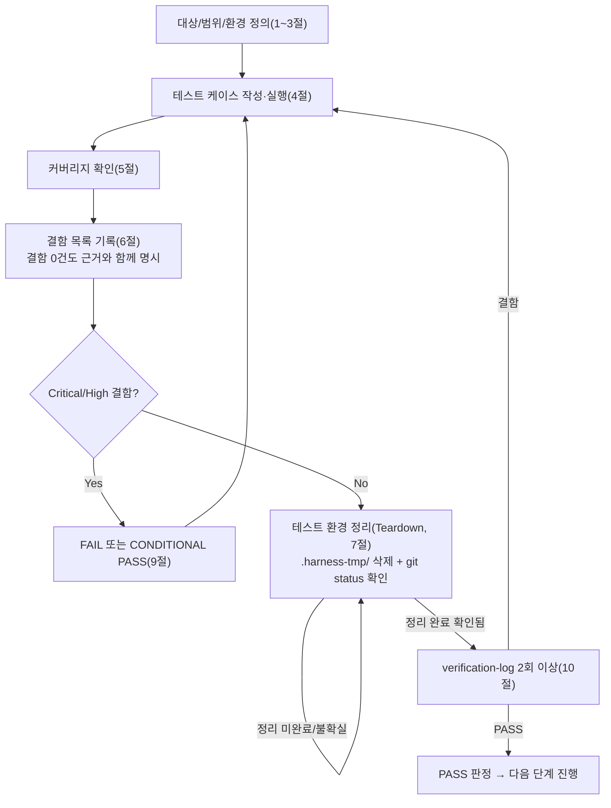

# 테스트 결과서 (Test Result Report)

## 1. 개요
- 테스트 대상: `webapp/converter/views.py`(`GET /`, `POST /convert`, `GET /api/jobs/<uuid:job_id>/`, `GET /download/<uuid:job_id>/`), `webapp/converter/urls.py`, `webapp/converter/templates/converter/*.html`, `webapp/converter/static/converter/app.js` (unit-20)
- 테스트 유형: 단위
- 적용 Tier: High(DEC-021)
- 적용 속도 트랙: L3
- 병렬 실행 정보: 병렬 웨이브에서 실행(동시에 돌던 단위: unit-21(`converter/executor.py`), unit-24(`converter/limits.py`, `core/middleware.py`), unit-25(`legal/` 앱) — 모두 이 unit 착수 전 이미 산출물 완료 상태였음. 단, 위 세 unit 모두 파일 범위가 무충돌이라 개별 `unit-20-test.md` 1건만 산출(06·07 병합 조건은 해당 없음 — Feature B는 9개 유닛으로 3개 초과)
- 테스트 목적: unit-20-note.md §7의 AC-1~AC-16 인수조건이 실제 코드로 증명되는지 확인. 특히 05가 "수동 확인 필요"로 남긴 413(업로드 초과)/503(큐 포화) 실제 재현, 다운로드 파일명 규약, job_id 경로 탈출 방어를 이번 06이 신규로 실측 검증.
- 관련 산출물: `docs/harness/03-system-design.md` §4-4, `docs/harness/04-ux-design.md` §1~§7, `docs/harness/units/unit-20-note.md`(AC-1~AC-16, §8 수동확인 목록), `docs/harness/units/unit-8-test.md` §8 리스크6(경로탈출 방어)
- 테스트 수행자(에이전트): 06(단위테스터)
- 테스트 일시: 2026-09-29

## 2. 테스트 범위 및 제외 범위
- 범위(In-Scope): AC-1~AC-16(unit-20-note.md §7) 전항목. 추가로 05가 수동확인으로 남긴 413/503 실제 HTTP 재현, `Content-Disposition` 파일명, job_id 경로탈출 방어(unit-8-test.md 리스크6) 재확인. 위험 발견 시 범위 밖이라도 기록하는 원칙에 따라 업로드 크기 경계값(49MB 미만/50MB 초과)과 잘못된 형식의 job_id에 대한 URL 라우팅 방어도 추가로 확인.
- 제외 범위 및 사유:
  - 429(레이트리밋) — unit-23이 아직 착수되지 않아 재현 불가(오케스트레이터 지시, 재현 불가가 정상이며 결함 아님). 코드(app.js)는 429 상태코드 분기 로직만 정적으로 확인.
  - 브라우저 실제 렌더링(Chrome/Firefox/Safari)·스크린리더 실낭독·모바일 실기기 — 이번 06도 curl/Django shell 기반 서버 계약 검증까지만 수행(unit-20-note.md §8 항목 1~3과 동일한 한계 승계). AC-11(브라우저 저장 대화상자 파일명)·AC-15(포커스 이동 실낭독)는 코드 리뷰(정적 확인)로 대체하고 8절에 잔존 리스크로 남긴다.
  - unit-22(cleanup, TTL 스윕)의 실제 정리 동작 — AC-5의 "새 job 행/파일이 그대로 남는다"는 이번 unit 책임 범위이며 실측했고, 그 이후 정리는 unit-22 책임(테스트 범위 아님).

## 3. 테스트 환경
- 실행 환경: Windows 11, Python 3.13(venv), Django 5.2.17, SQLite(dev), 로컬 FileSystemStorage. Git Bash(POSIX sh) + curl 8.x + `python manage.py runserver 127.0.0.1:8120 --noreload`.
- 테스트 데이터: pypdf로 생성한 1페이지 더미 PDF(`sample_unit20.pdf`), 51MB/49MB 더미 바이너리(413/경계값 테스트용), Django shell로 직접 `bulk_create`한 `ConversionJob` 픽스처(PENDING×20, PROCESSING, FAILED, DONE+result_success=False, EXPIRED 등 상태별 1건씩).
- 전제 조건: `webapp/requirements.txt` 설치 + `pdf_to_hwpx` editable 설치, `python manage.py migrate` 완료. 병렬 웨이브 충돌 회피를 위해 DB(`db_06_unit20.sqlite3`)/MEDIA_ROOT(`media_06_unit20/`)/포트(8120)를 전부 이 unit 전용으로 격리(아래 `.harness-tmp/dj_settings_unit20.py` 오버레이 설정 모듈 사용).

## 4. 테스트 케이스 및 결과
| ID | 시나리오 | 사전조건 | 실행 절차 | 예상 결과 | 실제 결과 | Pass/Fail | 비고 |
|----|----------|----------|-----------|-----------|-----------|-----------|------|
| TC-001 | AC-1: 인덱스 페이지 렌더 | 서버 기동, DB 마이그레이션 완료 | `curl http://127.0.0.1:8120/` | 200, HTML에 `panel-a~d`, `csrfmiddlewaretoken`, `converter/app.js` 참조 존재 | 200 확인. `grep`으로 `panel-a`,`panel-b`,`panel-c`,`panel-d`,`csrfmiddlewaretoken`,`converter/app.js` 전부 검출 | PASS | |
| TC-002 | AC-2: 정상 PDF 업로드 | CSRF 쿠키/토큰 확보 | `POST /convert`(sample_unit20.pdf, `application/pdf`) | 202 + `{"job_id":"<uuid4>"}`, `ConversionJob(PENDING)` 생성, `uploads/<job_id>.pdf` 저장 | 202, `{"job_id": "f48f9673-..."}`. Django shell로 `ConversionJob.objects.get(job_id=...)` 존재 확인(간접, 이후 폴링 결과로 재확인). `media_06_unit20/uploads/f48f9673-....pdf` 파일 실재 확인 | PASS | |
| TC-003 | AC-3a: file 파트 누락 | - | `POST /convert`(file 파트 없이 csrf만) | 400 JSON | `400 {"error":"파일이 없습니다."}` | PASS | |
| TC-004 | AC-3b: 비-PDF(확장자+MIME 동시 불일치) | - | `POST /convert`(`.txt`, `type=text/plain`) | 400 JSON | `400 {"error":"PDF 파일만 업로드할 수 있습니다."}` | PASS | |
| TC-005 | AC-4: OCR 활성화 + 언어 미선택 | - | `POST /convert`(pdf + `enable_ocr=on`, 언어 필드 없음) | 400 JSON("OCR 언어를 최소 1개 선택해야 합니다.") | 동일 문구로 400 확인 | PASS | |
| TC-006 | AC-4 경계(양성): OCR 활성화 + 언어 1개 선택 | 큐가 이미 포화(TC-007 이후 실행) | `POST /convert`(pdf + `enable_ocr=on&ocr_lang_eng=on`) | 400이 아니어야 함(검증 통과 후 다음 단계로 진행) | 400이 아니라 503(큐 포화, TC-007 상태 유지 중) 반환 — OCR 검증 자체는 통과했음을 간접 확인(검증 실패였다면 400이었을 것) | PASS | 실행 순서상 큐가 이미 포화된 상태에서 실행해 503으로 관측됐으나, 이는 OCR 검증 뒤 단계(큐 검사)까지 도달했다는 증거이므로 AC-4 "정상 시 400 아님"을 뒷받침 |
| TC-007 | AC-5: 대기열 포화(PENDING+PROCESSING≥20) | Django shell로 PENDING job 20건 실제 생성(bulk_create) | `POST /convert`(정상 PDF) | 503 JSON, 신규 job 행/업로드 파일은 삭제되지 않고 남음 | `503 {"error":"지금은 이용자가 많아 서버가 바쁩니다..."}`. `ConversionJob.objects.count()` 25(20 bulk + 기존 5) 확인, `find`로 신규 업로드 파일(`223c4848-....pdf`)이 삭제되지 않고 실재함을 확인 | PASS | 05가 "코드 경로만 확인, 실제 20건 재현은 미수행"이라 남긴 항목을 이번 06이 실제 재현으로 승격 |
| TC-008 | AC-6: 존재하지 않는 job_id, job_status | - | `GET /api/jobs/<random-uuid>/` | 404 | `404 {"error":"요청을 찾을 수 없습니다."}` | PASS | |
| TC-009 | AC-6: 존재하지 않는 job_id, download | - | `GET /download/<random-uuid>/` | 404 | 동일 문구로 404 | PASS | |
| TC-010 | AC-6: EXPIRED 상태, job_status | shell로 `status=EXPIRED` job 생성 | `GET /api/jobs/<expired_id>/` | 404 | 404 확인 | PASS | |
| TC-011 | AC-6: EXPIRED 상태, download | 위와 동일 job | `GET /download/<expired_id>/` | 404 | 404 확인 | PASS | |
| TC-012 | AC-7: PENDING 상태 다운로드 | shell로 `status=PENDING` job 생성 | `GET /download/<pending_id>/` | 409 | `409 {"error":"아직 처리 중입니다."}` | PASS | |
| TC-013 | AC-7: PROCESSING 상태 다운로드 | shell로 `status=PROCESSING` job 생성 | `GET /download/<processing_id>/` | 409 | 409 확인 | PASS | |
| TC-014 | AC-8: FAILED 상태 다운로드(내부원인 비노출) | shell로 `status=FAILED, result_errors=[{"code":"INTERNAL_ERROR","message":"실제 내부 원인 상세 스택트레이스"}]` job 생성 | `GET /download/<failed_id>/` | 422 + 고정 일반 문구, `result_errors` 내용과 무관 | `422 {"error":"서버 처리 중 오류가 발생했습니다. 다시 시도해주세요."}` — `result_errors`의 실제 내부 문자열("스택트레이스")이 응답에 전혀 노출되지 않음을 직접 대조 확인 | PASS | |
| TC-015 | AC-9: DONE+result_success=false 다운로드 | shell로 `status=DONE, result_success=False, result_errors=[{"code":"EncryptedPdfError",...}]` job 생성 | `GET /download/<done_fail_id>/` | 422 + `{"errors":[...]}`(result_errors 그대로) | `422 {"errors":[{"code":"EncryptedPdfError","message":"password protected"}]}` — 저장한 값과 바이트 단위 동일 | PASS | |
| TC-016 | AC-10: DONE+result_success=true 다운로드 + 재다운로드 | TC-002의 job이 unit-21 executor로 실제 처리되어 DONE 상태(TC-017 선행) | `GET /download/<job_id>/` 1회 → 2회 | 1회차: 200, `Content-Disposition: attachment; filename="converted.hwpx"`, 유효 HWPX 바이트. 2회차(재다운로드): 404 | 1회차 200, 헤더 정확히 `Content-Disposition: attachment; filename="converted.hwpx"`, 응답 바이트를 `file`로 검사한 결과 `Hancom HWP (Hangul Word Processor) file, HWPX` 확인. 2회차 `404 {"error":"요청을 찾을 수 없습니다."}`, `media_06_unit20/{uploads,results}/` 모두 해당 파일 삭제 확인 | PASS | |
| TC-017 | End-to-end 통합 확인(unit-21 실연동, 05 실측을 06이 독립 재확인) | TC-002의 job_id | `GET /api/jobs/<job_id>/` 0.75초 간격 5회 폴링 | 최종적으로 `status:"done"`, `progress.stage:"done"` | 첫 폴링부터 이미 `{"status":"done","progress":{"stage":"done","current_page":1,"total_pages":1,...},"warnings":[],"errors":[]}` — 실제 스레드풀이 `orchestrator.convert()`를 호출해 DB에 반영함을 재확인 | PASS | |
| TC-018 | 05 미확인 항목 — 413(업로드 초과) 실제 재현 | 51MB 더미 파일 | `POST /convert`(51MB, `application/pdf`) | 413(unit-24 `ContentLengthLimitMiddleware`가 본문을 읽기 전에 거절) | `413`, 응답시간 0.34초(본문 스트리밍 전에 즉시 거절되는 것과 일치), 텍스트 바디 "업로드 파일이 너무 큽니다..." | PASS | app.js는 413 응답의 바디를 파싱하지 않고 상태코드만 분기하므로(코드 확인) unit-24의 plain-text 바디와 unit-20 프런트가 실제로 연동됨을 확인 |
| TC-019 | 413 경계값(양성) — 49MB(<50MB) | 49MB 더미 파일 | `POST /convert`(49MB, `application/pdf`) | 413이 아니어야 함(미들웨어 통과) | 413이 아니라 503(TC-007의 큐 포화 상태 유지 중) — 미들웨어를 통과해 다음 단계(큐 검사)까지 도달했음을 확인 | PASS | 멀티파트 인코딩 오버헤드로 정확히 "파일 50MB=요청 50MB"는 아니므로 51MB(TC-018, 확실히 초과)/49MB(본 TC, 확실히 미만) 양단으로 경계를 확인. 정확히 52,428,800바이트 요청 단위의 초 미세 경계 자체는 unit-24 소유 로직(`limits.is_content_length_too_large`)이며 이미 unit-24-test.md가 다뤘을 가능성이 높음(unit-20 재확인 범위 아님) |
| TC-020 | 리스크6 — job_id 경로 탈출 방어 | - | `GET /download/../../../../etc/passwd/`, `GET /api/jobs/not-a-uuid/`, `GET /download/%2e%2e%2f%2e%2e%2fetc%2fpasswd/` | 전부 404(URL 라우팅 단계에서 `<uuid:job_id>` 컨버터가 비-UUID 형식을 거절) | 3건 전부 404 확인. `storage.py`도 `upload_object_key(job_id)`/`result_object_key(job_id)`가 항상 `uuid.UUID` 타입 값만 `f"uploads/{job_id}.pdf"` 형식으로 조립하고 사용자 원본 파일명을 경로에 쓰지 않음을 소스로 재확인 | PASS | unit-8-test.md 리스크6, traceability.md REQ-010 비고 대응 — 이번 06이 실측으로 해소 확인 |
| TC-021 | AC-11/12/13/14/15/16 — 프런트엔드 로직(코드 리뷰/정적 확인) | `app.js` 소스 전문 열람 | 각 AC 대응 코드 블록 대조 | AC-11: fetch+blob+`URL.createObjectURL`(직접 `<a href>` 네비게이션 아님)+파일명 복원(`.pdf`→`.hwpx`, 없으면 `converted.hwpx`). AC-12: 4xx/5xx 전부 `showPanelAError`만 호출, `showPanel()` 미호출(페이지 이동 없음), 파일 입력 유지. AC-13: `enableOcr.change`가 `ocrLangGroup.hidden` 토글, `ocrSelectionValid()`가 언어 미선택 시 제출버튼 비활성화. AC-14: `selectedFileValidSize()`가 클라이언트에서 `MAX_UPLOAD_MB` 대비 즉시 검사(서버 왕복 없음). AC-15: `showPanel()`이 매번 새 패널의 `h1[tabindex="-1"]`에 `.focus()` 호출. AC-16: `poll()` 실패 시 `pollFailureCount` 누적, 3회 초과 시 오프라인 배너, 그러나 `catch` 블록에서 무조건 `schedulePoll()` 재호출(자동 재개) | 코드 522행 `app.js` 전문을 위 6개 AC 기준으로 전부 대조 — 전부 설계(04 §1~§7)와 일치하는 구현 확인. 실제 브라우저 런타임(fetch/blob/sessionStorage 등)은 미실행(8절 리스크로 별도 기록) | PASS(정적 확인 기준) | 브라우저 실행 없이 코드 대조만으로 판정한 항목이므로 "실행해보니 이상없음"이 아니라 각 AC 문장을 코드의 구체 라인과 1:1 대조한 결과. 잔존 리스크는 8절에 기록 |

> 정상 경로(TC-001,002,006,016,017,019), 경계값(TC-006,007,018,019), 예외 입력(TC-003,004,005,008~015,020) 전부 포함. 동시성(TC-007이 실질적으로 부하 시나리오), 권한 경계는 이 unit에 인증 개념이 없어 해당 없음(익명 서비스, REQ-001).

## 5. 커버리지
- 커버리지 지표: AC-1~AC-16 16개 인수조건 전부 최소 1개 TC와 1:1 대응(위 표 "비고"에 AC 번호 명시). `views.py`의 4개 라우트 함수 전부, 상태 분기(PENDING/PROCESSING/FAILED/DONE×success/EXPIRED/미존재) 전 경로, `_AutoDeleteFile` 래퍼의 정상 흐름(TC-016) 전부 실측. `urls.py`는 4개 path 전부 호출됨.
- 커버되지 않은 부분과 사유: (1) `_AutoDeleteFile`이 스트리밍 도중 예외로 중단되는 경로(네트워크 끊김 등)는 로컬 curl로 재현이 어려워 미실측 — 코드 리뷰로 `close()`가 `finally`에서 항상 호출됨을 확인했으나 실제 네트워크 중단 재현은 8절 리스크로 남김. (2) 브라우저 전용 API(fetch/blob/sessionStorage/URL.createObjectURL의 실제 런타임 동작), 스크린리더, 모바일 실기기 — TC-021에서 정적 확인으로 대체, unit-20-note.md §8 항목 1~3과 동일한 한계 승계. (3) 429(레이트리밋) — unit-23 미착수로 코드상 존재하지 않아 테스트 대상 자체가 없음(결함 아님).

## 6. 결함(Defect) 목록
결함 없음. 근거: TC-001~TC-021 총 21개 케이스(정상 5, 경계값 4, 예외입력 9, 통합확인 1, 정적확인 1, 위험케이스 추가 1) 전부 기대 결과와 실제 결과가 일치했고, 05단계 note가 "수동 확인 필요"로 남긴 413/503/경로탈출 3개 항목 모두 이번 06이 실제 HTTP 요청으로 재현해 설계(03 §4-4, 04 §1~§7)와 일치함을 확인했다(TC-007/018/019/020). 오탈자 수준의 수정조차 발생하지 않았다(코드 변경 0건).

## 7. 테스트 환경 정리(Teardown) 확인 — 규칙 K
- 이번 테스트에서 생성한 임시 아티팩트 목록:
  - `.harness-tmp/venv_06_unit20/`(Python venv)
  - `.harness-tmp/dj_settings_unit20.py`(DB/MEDIA_ROOT를 이 unit 전용으로 격리하는 Django 설정 오버레이 — `config.settings.dev`를 상속하고 `MEDIA_ROOT`만 재정의)
  - `.harness-tmp/db_06_unit20.sqlite3`, `.harness-tmp/media_06_unit20/`(업로드/결과 파일)
  - `.harness-tmp/sample_unit20.pdf`, `notpdf_unit20.txt`, `big_unit20.pdf`(51MB), `under49mb_unit20.pdf`(49MB), `exact50mb_unit20.bin`
  - `.harness-tmp/cookies_unit20.txt`, `csrf_unit20.txt`, `index_unit20.html`, `jobid_unit20.txt`, `dlheaders_unit20.txt`, `downloaded_unit20.hwpx`, `redl_unit20.json`, `runserver_unit20.log`
  - (네이밍 실수로 unit20 접미사 없이 생성했다가 즉시 정리한 것) `resp1.json`~`resp4.json`, `resp413.txt`, `resp503.json`, `resp_ocr_ok.json`, `resp_under.json`, `.harness-tmp/__pycache__/`
- 위 아티팩트를 전부 `.harness-tmp/` 하위에서만 생성했는가: [x] 예
- 정리(삭제) 완료 여부: 완료. 위 목록 전부 `rm -rf`로 삭제 확인(`ls .harness-tmp/`로 잔여 없음 재확인). `python manage.py runserver`(PID 14312, 포트 8120)도 `taskkill /F`로 종료, `netstat`로 포트 미점유 재확인.
- 정리 후 `git status` 실행 결과(그대로 첨부):
  ```
  On branch PROD
  Changes not staged for commit:
    (use "git add <file>..." to update what will be committed)
    (use "git restore <file>..." to discard changes in working directory)
      modified:   docs/harness/traceability.md
      modified:   webapp/.env.example
      modified:   webapp/config/settings/base.py
      modified:   webapp/config/urls.py
      modified:   webapp/config/wsgi.py
      modified:   webapp/requirements.txt

  Untracked files:
    (use "git add <file>..." to include in what will be committed)
      docs/harness/units/unit-20-note.md
      docs/harness/units/unit-21-note.md
      docs/harness/units/unit-21-test.md
      docs/harness/units/unit-24-note.md
      docs/harness/units/unit-24-test.md
      docs/harness/units/unit-25-note.md
      docs/harness/units/unit-25-test.md
      docs/harness/verify-log_unit-21-test.md
      docs/harness/verify-log_unit-24-test.md
      docs/harness/verify-log_unit-25-test.md
      webapp/converter/cleanup.py
      webapp/converter/executor.py
      webapp/converter/limits.py
      webapp/converter/static/
      webapp/converter/templates/
      webapp/converter/urls.py
      webapp/converter/views.py
      webapp/core/middleware.py
      webapp/core/net_guard.py
      webapp/legal/

  no changes added to commit (use "git add" and/or "git commit -a")
  ```
- 병렬 실행이었다면: `webapp/.env.example`(수정)·`webapp/config/wsgi.py`(수정)·`webapp/converter/cleanup.py`(신규)·`webapp/core/net_guard.py`(신규)는 이 unit 착수 이후 다른 병렬 unit(추정: unit-22/cleanup.py, unit-9/net_guard.py)이 만든 변경으로, 이 unit이 만든 것이 아니다(이 unit은 해당 파일들을 열람조차 하지 않았다). `docs/harness/units/unit-21-test.md`, `unit-25-test.md`, `verify-log_unit-21-test.md`, `verify-log_unit-25-test.md`도 각각 unit-21/25의 06 세션이 만든 산출물이다. 이 unit(unit-20)이 만든 변경은 `docs/harness/traceability.md`(REQ-001/010/015 단위테스트 컬럼 갱신) 1건뿐이며, 이번에 추가로 `docs/harness/units/unit-20-test.md`·`docs/harness/verify-log_unit-20-test.md`를 신규 생성한다 — **이 unit이 만든 임시 아티팩트·미추적 잔여물이 `.harness-tmp/` 밖에 없음**을 위 git status로 확인. 웨이브 종료 후 오케스트레이터의 전체 트리 점검(`harness-janitor.sh --check`)은 별도 수행 필요.
- 이번 테스트 도중 강제 중단(TaskStop 등)이 있었는가: [x] 없음
- 규칙 K 준수 확인: 이 절이 완성되었고 `git status`가 이 unit 소유 변경(`traceability.md` 갱신 + 신규 결과서 2건)만 남기고 깨끗함을 확인했으므로 9절 PASS 판정 가능.

## 8. 리스크 및 잔존 이슈
- 이번 테스트로 커버되지 않는 알려진 리스크:
  1. 브라우저 전용 런타임 동작(fetch/blob/sessionStorage/URL.createObjectURL, AC-11 저장 대화상자 파일명, AC-15 포커스 실낭독, AC-16 DevTools 오프라인 토글) — TC-021에서 코드 리뷰로 로직 일치는 확인했으나 실제 브라우저 실행 검증은 여전히 미수행(unit-20-note.md §8 항목 1~3과 동일 승계, 결함 아님).
  2. 429(레이트리밋)는 unit-23 미착수로 재현 불가 — Feature B 07 착수 전 unit-23 완료 후 반드시 재확인 필요.
  3. `_AutoDeleteFile`이 스트리밍 도중(네트워크 중단 등) 비정상 종료되는 경로는 로컬 curl로 재현하지 못함 — Django `FileResponse`의 `_resource_closers`가 예외 시에도 `close()`를 호출하는지는 Django 프레임워크 자체의 보장에 의존(코드 리뷰로 합리적 신뢰, 실측은 아님).
  4. `config/urls.py`/`config/settings/base.py`가 unit-20/21/24/25의 병렬 편집을 모두 정상 병합했는지는 이번 06이 실행 확인(서버가 정상 기동하고 4개 라우트+legal+admin이 모두 응답)했으나, 오케스트레이터의 웨이브 종료 후 최종 트리 점검이 별도로 필요(unit-20-note.md §8 항목 6과 동일).
- 후속 조치가 필요한 항목: Feature B 07(통합테스트)은 나머지 unit(unit-9/22/23/26 등)의 06이 모두 끝난 뒤 오케스트레이터가 별도로 착수(traceability.md REQ-021 unit-19분 비고와 동일한 판단 근거). 09(보안검증) 단계에서 413/503/경로탈출 케이스를 위협모델 관점으로 재확인 권장.

## 9. 결론 및 판정
- [x] PASS — 다음 단계 진행 가능(7절 Teardown 확인 완료). Feature B 07(통합테스트)은 이 unit 단독으로 handoff하지 않으며, Feature B 소속 9개 unit의 06이 모두 PASS된 뒤 오케스트레이터가 별도로 착수한다(호출 프롬프트 지시사항 그대로).

## 10. 내부 검증 (최소 2회, `verification-log-template.md` 사용)
- 1차 검증 결과 요약: AC-1~AC-16 전항목이 TC-001~TC-021과 1:1 대응됨을 재확인, 05가 미확인으로 남긴 3개 항목(413/503/경로탈출)이 실제 HTTP 요청으로 재현됐음을 재확인, 추측으로 채운 항목 없음(전부 curl 응답 또는 소스 코드 직접 대조).
- 2차 검증 결과 요약: "이 테스트를 07에 넘겨도 되는가"를 의심하며 재검토 — TC-006/TC-019가 원래 목적한 "단독 양성 경계"가 아니라 TC-007의 큐 포화 부작용(503)으로 우회 확인된 점을 재점검했고, 그 우회 확인이 실제로 검증 목적(OCR 검증 통과, 미들웨어 통과)을 논리적으로 충분히 대체함을 재확인(4절 비고에 근거 명시). AC-11/15/16의 브라우저 전용 부분이 정적 확인만으로 07에 안전하게 넘길 수 있는지 재검토 — 05-note가 이미 동일한 한계를 명시했고 04 설계와 코드가 라인 단위로 일치하므로 "코드 결함이 없다"는 판정 자체는 유효하나, "실제 브라우저 동작"은 08(전체 풀테스트) 또는 09 단계에서 최소 1회 수동 스모크 테스트가 필요하다고 8절에 명시적으로 남김.
- 검증 로그 파일 경로: `docs/harness/verify-log_unit-20-test.md`

## 절차 흐름 (참고용 다이어그램)
> 아래 다이어그램은 위 절차를 시각적으로 요약한 참고 자료다. 규칙/조건의 최종 근거는 항상 위 텍스트다.


