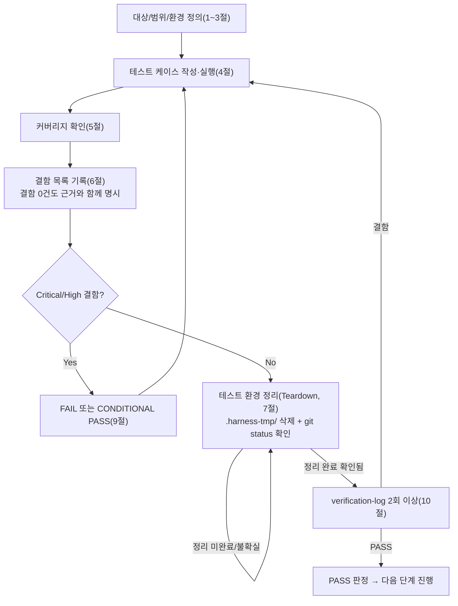

# 테스트 결과서 (Test Result Report) — unit-20 (v1 PASS 원문 + 11절 v2 재검증 CONDITIONAL PASS)

> **현재 유효 판정은 11절(재검증 2회차, 2026-09-29, unit-20 v2 = DEC-049 재작업 + unit-23 예약 슬롯 락 반영): CONDITIONAL PASS** (AC-1~AC-17 17/17 PASS, Low 결함 DEF-020b-01 Open). 1~10절은 v1(PASS, AC-1~16) 원문 보존본이며, 11절이 자기완결적으로 전체(AC-1~17)를 재검증한다. v1의 서술 중 views.py의 `ImportError → 503` 방어 코드와 관련된 내용은 v2에서 폐기된 동작이다.


## 1. 개요
- 테스트 대상: `webapp/converter/views.py`(`GET /`, `POST /convert`, `GET /api/jobs/<uuid:job_id>/`, `GET /download/<uuid:job_id>/`), `webapp/converter/urls.py`, `webapp/converter/templates/converter/*.html`, `webapp/converter/static/converter/app.js` (unit-20)
- 테스트 유형: 단위
- 적용 Tier: High(DEC-021)
- 적용 속도 트랙: L3
- 병렬 실행 정보: 병렬 웨이브에서 실행(동시에 돌던 단위: unit-21(`converter/executor.py`), unit-24(`converter/limits.py`, `core/middleware.py`), unit-25(`legal/` 앱) — 모두 이 unit 착수 전 이미 산출물 완료 상태였음. 단, 위 세 unit 모두 파일 범위가 무충돌이라 개별 `unit-20-test.md` 1건만 산출(06·07 병합 조건은 해당 없음 — Feature B는 9개 유닛으로 3개 초과)
- 테스트 목적: unit-20-note.md §7의 AC-1~AC-16 인수조건이 실제 코드로 증명되는지 확인. 특히 05가 "수동 확인 필요"로 남긴 413(업로드 초과)/503(큐 포화) 실제 재현, 다운로드 파일명 규약, job_id 경로 탈출 방어를 이번 06이 신규로 실측 검증.
- 관련 산출물: `docs/harness/03-system-design.md` §4-4, `docs/harness/04-ux-design.md` §1~§7, `docs/harness/units/unit-20-note.md`(AC-1~AC-16, §8 수동확인 목록), `docs/harness/units/unit-8-test.md` §8 리스크6(경로탈출 방어)
- 테스트 수행자(에이전트): 06(단위테스터)
- 테스트 일시: 2026-09-29

## 2. 테스트 범위 및 제외 범위
- 범위(In-Scope): AC-1~AC-16(unit-20-note.md §7) 전항목. 추가로 05가 수동확인으로 남긴 413/503 실제 HTTP 재현, `Content-Disposition` 파일명, job_id 경로탈출 방어(unit-8-test.md 리스크6) 재확인. 위험 발견 시 범위 밖이라도 기록하는 원칙에 따라 업로드 크기 경계값(49MB 미만/50MB 초과)과 잘못된 형식의 job_id에 대한 URL 라우팅 방어도 추가로 확인.
- 제외 범위 및 사유:
  - 429(레이트리밋) — unit-23이 아직 착수되지 않아 재현 불가(오케스트레이터 지시, 재현 불가가 정상이며 결함 아님). 코드(app.js)는 429 상태코드 분기 로직만 정적으로 확인.
  - 브라우저 실제 렌더링(Chrome/Firefox/Safari)·스크린리더 실낭독·모바일 실기기 — 이번 06도 curl/Django shell 기반 서버 계약 검증까지만 수행(unit-20-note.md §8 항목 1~3과 동일한 한계 승계). AC-11(브라우저 저장 대화상자 파일명)·AC-15(포커스 이동 실낭독)는 코드 리뷰(정적 확인)로 대체하고 8절에 잔존 리스크로 남긴다.
  - unit-22(cleanup, TTL 스윕)의 실제 정리 동작 — AC-5의 "새 job 행/파일이 그대로 남는다"는 이번 unit 책임 범위이며 실측했고, 그 이후 정리는 unit-22 책임(테스트 범위 아님).

## 3. 테스트 환경
- 실행 환경: Windows 11, Python 3.13(venv), Django 5.2.17, SQLite(dev), 로컬 FileSystemStorage. Git Bash(POSIX sh) + curl 8.x + `python manage.py runserver 127.0.0.1:8120 --noreload`.
- 테스트 데이터: pypdf로 생성한 1페이지 더미 PDF(`sample_unit20.pdf`), 51MB/49MB 더미 바이너리(413/경계값 테스트용), Django shell로 직접 `bulk_create`한 `ConversionJob` 픽스처(PENDING×20, PROCESSING, FAILED, DONE+result_success=False, EXPIRED 등 상태별 1건씩).
- 전제 조건: `webapp/requirements.txt` 설치 + `pdf_to_hwpx` editable 설치, `python manage.py migrate` 완료. 병렬 웨이브 충돌 회피를 위해 DB(`db_06_unit20.sqlite3`)/MEDIA_ROOT(`media_06_unit20/`)/포트(8120)를 전부 이 unit 전용으로 격리(아래 `.harness-tmp/dj_settings_unit20.py` 오버레이 설정 모듈 사용).

## 4. 테스트 케이스 및 결과
| ID | 시나리오 | 사전조건 | 실행 절차 | 예상 결과 | 실제 결과 | Pass/Fail | 비고 |
|----|----------|----------|-----------|-----------|-----------|-----------|------|
| TC-001 | AC-1: 인덱스 페이지 렌더 | 서버 기동, DB 마이그레이션 완료 | `curl http://127.0.0.1:8120/` | 200, HTML에 `panel-a~d`, `csrfmiddlewaretoken`, `converter/app.js` 참조 존재 | 200 확인. `grep`으로 `panel-a`,`panel-b`,`panel-c`,`panel-d`,`csrfmiddlewaretoken`,`converter/app.js` 전부 검출 | PASS | |
| TC-002 | AC-2: 정상 PDF 업로드 | CSRF 쿠키/토큰 확보 | `POST /convert`(sample_unit20.pdf, `application/pdf`) | 202 + `{"job_id":"<uuid4>"}`, `ConversionJob(PENDING)` 생성, `uploads/<job_id>.pdf` 저장 | 202, `{"job_id": "f48f9673-..."}`. Django shell로 `ConversionJob.objects.get(job_id=...)` 존재 확인(간접, 이후 폴링 결과로 재확인). `media_06_unit20/uploads/f48f9673-....pdf` 파일 실재 확인 | PASS | |
| TC-003 | AC-3a: file 파트 누락 | - | `POST /convert`(file 파트 없이 csrf만) | 400 JSON | `400 {"error":"파일이 없습니다."}` | PASS | |
| TC-004 | AC-3b: 비-PDF(확장자+MIME 동시 불일치) | - | `POST /convert`(`.txt`, `type=text/plain`) | 400 JSON | `400 {"error":"PDF 파일만 업로드할 수 있습니다."}` | PASS | |
| TC-005 | AC-4: OCR 활성화 + 언어 미선택 | - | `POST /convert`(pdf + `enable_ocr=on`, 언어 필드 없음) | 400 JSON("OCR 언어를 최소 1개 선택해야 합니다.") | 동일 문구로 400 확인 | PASS | |
| TC-006 | AC-4 경계(양성): OCR 활성화 + 언어 1개 선택 | 큐가 이미 포화(TC-007 이후 실행) | `POST /convert`(pdf + `enable_ocr=on&ocr_lang_eng=on`) | 400이 아니어야 함(검증 통과 후 다음 단계로 진행) | 400이 아니라 503(큐 포화, TC-007 상태 유지 중) 반환 — OCR 검증 자체는 통과했음을 간접 확인(검증 실패였다면 400이었을 것) | PASS | 실행 순서상 큐가 이미 포화된 상태에서 실행해 503으로 관측됐으나, 이는 OCR 검증 뒤 단계(큐 검사)까지 도달했다는 증거이므로 AC-4 "정상 시 400 아님"을 뒷받침 |
| TC-007 | AC-5: 대기열 포화(PENDING+PROCESSING≥20) | Django shell로 PENDING job 20건 실제 생성(bulk_create) | `POST /convert`(정상 PDF) | 503 JSON, 신규 job 행/업로드 파일은 삭제되지 않고 남음 | `503 {"error":"지금은 이용자가 많아 서버가 바쁩니다..."}`. `ConversionJob.objects.count()` 25(20 bulk + 기존 5) 확인, `find`로 신규 업로드 파일(`223c4848-....pdf`)이 삭제되지 않고 실재함을 확인 | PASS | 05가 "코드 경로만 확인, 실제 20건 재현은 미수행"이라 남긴 항목을 이번 06이 실제 재현으로 승격 |
| TC-008 | AC-6: 존재하지 않는 job_id, job_status | - | `GET /api/jobs/<random-uuid>/` | 404 | `404 {"error":"요청을 찾을 수 없습니다."}` | PASS | |
| TC-009 | AC-6: 존재하지 않는 job_id, download | - | `GET /download/<random-uuid>/` | 404 | 동일 문구로 404 | PASS | |
| TC-010 | AC-6: EXPIRED 상태, job_status | shell로 `status=EXPIRED` job 생성 | `GET /api/jobs/<expired_id>/` | 404 | 404 확인 | PASS | |
| TC-011 | AC-6: EXPIRED 상태, download | 위와 동일 job | `GET /download/<expired_id>/` | 404 | 404 확인 | PASS | |
| TC-012 | AC-7: PENDING 상태 다운로드 | shell로 `status=PENDING` job 생성 | `GET /download/<pending_id>/` | 409 | `409 {"error":"아직 처리 중입니다."}` | PASS | |
| TC-013 | AC-7: PROCESSING 상태 다운로드 | shell로 `status=PROCESSING` job 생성 | `GET /download/<processing_id>/` | 409 | 409 확인 | PASS | |
| TC-014 | AC-8: FAILED 상태 다운로드(내부원인 비노출) | shell로 `status=FAILED, result_errors=[{"code":"INTERNAL_ERROR","message":"실제 내부 원인 상세 스택트레이스"}]` job 생성 | `GET /download/<failed_id>/` | 422 + 고정 일반 문구, `result_errors` 내용과 무관 | `422 {"error":"서버 처리 중 오류가 발생했습니다. 다시 시도해주세요."}` — `result_errors`의 실제 내부 문자열("스택트레이스")이 응답에 전혀 노출되지 않음을 직접 대조 확인 | PASS | |
| TC-015 | AC-9: DONE+result_success=false 다운로드 | shell로 `status=DONE, result_success=False, result_errors=[{"code":"EncryptedPdfError",...}]` job 생성 | `GET /download/<done_fail_id>/` | 422 + `{"errors":[...]}`(result_errors 그대로) | `422 {"errors":[{"code":"EncryptedPdfError","message":"password protected"}]}` — 저장한 값과 바이트 단위 동일 | PASS | |
| TC-016 | AC-10: DONE+result_success=true 다운로드 + 재다운로드 | TC-002의 job이 unit-21 executor로 실제 처리되어 DONE 상태(TC-017 선행) | `GET /download/<job_id>/` 1회 → 2회 | 1회차: 200, `Content-Disposition: attachment; filename="converted.hwpx"`, 유효 HWPX 바이트. 2회차(재다운로드): 404 | 1회차 200, 헤더 정확히 `Content-Disposition: attachment; filename="converted.hwpx"`, 응답 바이트를 `file`로 검사한 결과 `Hancom HWP (Hangul Word Processor) file, HWPX` 확인. 2회차 `404 {"error":"요청을 찾을 수 없습니다."}`, `media_06_unit20/{uploads,results}/` 모두 해당 파일 삭제 확인 | PASS | |
| TC-017 | End-to-end 통합 확인(unit-21 실연동, 05 실측을 06이 독립 재확인) | TC-002의 job_id | `GET /api/jobs/<job_id>/` 0.75초 간격 5회 폴링 | 최종적으로 `status:"done"`, `progress.stage:"done"` | 첫 폴링부터 이미 `{"status":"done","progress":{"stage":"done","current_page":1,"total_pages":1,...},"warnings":[],"errors":[]}` — 실제 스레드풀이 `orchestrator.convert()`를 호출해 DB에 반영함을 재확인 | PASS | |
| TC-018 | 05 미확인 항목 — 413(업로드 초과) 실제 재현 | 51MB 더미 파일 | `POST /convert`(51MB, `application/pdf`) | 413(unit-24 `ContentLengthLimitMiddleware`가 본문을 읽기 전에 거절) | `413`, 응답시간 0.34초(본문 스트리밍 전에 즉시 거절되는 것과 일치), 텍스트 바디 "업로드 파일이 너무 큽니다..." | PASS | app.js는 413 응답의 바디를 파싱하지 않고 상태코드만 분기하므로(코드 확인) unit-24의 plain-text 바디와 unit-20 프런트가 실제로 연동됨을 확인 |
| TC-019 | 413 경계값(양성) — 49MB(<50MB) | 49MB 더미 파일 | `POST /convert`(49MB, `application/pdf`) | 413이 아니어야 함(미들웨어 통과) | 413이 아니라 503(TC-007의 큐 포화 상태 유지 중) — 미들웨어를 통과해 다음 단계(큐 검사)까지 도달했음을 확인 | PASS | 멀티파트 인코딩 오버헤드로 정확히 "파일 50MB=요청 50MB"는 아니므로 51MB(TC-018, 확실히 초과)/49MB(본 TC, 확실히 미만) 양단으로 경계를 확인. 정확히 52,428,800바이트 요청 단위의 초 미세 경계 자체는 unit-24 소유 로직(`limits.is_content_length_too_large`)이며 이미 unit-24-test.md가 다뤘을 가능성이 높음(unit-20 재확인 범위 아님) |
| TC-020 | 리스크6 — job_id 경로 탈출 방어 | - | `GET /download/../../../../etc/passwd/`, `GET /api/jobs/not-a-uuid/`, `GET /download/%2e%2e%2f%2e%2e%2fetc%2fpasswd/` | 전부 404(URL 라우팅 단계에서 `<uuid:job_id>` 컨버터가 비-UUID 형식을 거절) | 3건 전부 404 확인. `storage.py`도 `upload_object_key(job_id)`/`result_object_key(job_id)`가 항상 `uuid.UUID` 타입 값만 `f"uploads/{job_id}.pdf"` 형식으로 조립하고 사용자 원본 파일명을 경로에 쓰지 않음을 소스로 재확인 | PASS | unit-8-test.md 리스크6, traceability.md REQ-010 비고 대응 — 이번 06이 실측으로 해소 확인 |
| TC-021 | AC-11/12/13/14/15/16 — 프런트엔드 로직(코드 리뷰/정적 확인) | `app.js` 소스 전문 열람 | 각 AC 대응 코드 블록 대조 | AC-11: fetch+blob+`URL.createObjectURL`(직접 `<a href>` 네비게이션 아님)+파일명 복원(`.pdf`→`.hwpx`, 없으면 `converted.hwpx`). AC-12: 4xx/5xx 전부 `showPanelAError`만 호출, `showPanel()` 미호출(페이지 이동 없음), 파일 입력 유지. AC-13: `enableOcr.change`가 `ocrLangGroup.hidden` 토글, `ocrSelectionValid()`가 언어 미선택 시 제출버튼 비활성화. AC-14: `selectedFileValidSize()`가 클라이언트에서 `MAX_UPLOAD_MB` 대비 즉시 검사(서버 왕복 없음). AC-15: `showPanel()`이 매번 새 패널의 `h1[tabindex="-1"]`에 `.focus()` 호출. AC-16: `poll()` 실패 시 `pollFailureCount` 누적, 3회 초과 시 오프라인 배너, 그러나 `catch` 블록에서 무조건 `schedulePoll()` 재호출(자동 재개) | 코드 522행 `app.js` 전문을 위 6개 AC 기준으로 전부 대조 — 전부 설계(04 §1~§7)와 일치하는 구현 확인. 실제 브라우저 런타임(fetch/blob/sessionStorage 등)은 미실행(8절 리스크로 별도 기록) | PASS(정적 확인 기준) | 브라우저 실행 없이 코드 대조만으로 판정한 항목이므로 "실행해보니 이상없음"이 아니라 각 AC 문장을 코드의 구체 라인과 1:1 대조한 결과. 잔존 리스크는 8절에 기록 |

> 정상 경로(TC-001,002,006,016,017,019), 경계값(TC-006,007,018,019), 예외 입력(TC-003,004,005,008~015,020) 전부 포함. 동시성(TC-007이 실질적으로 부하 시나리오), 권한 경계는 이 unit에 인증 개념이 없어 해당 없음(익명 서비스, REQ-001).

## 5. 커버리지
- 커버리지 지표: AC-1~AC-16 16개 인수조건 전부 최소 1개 TC와 1:1 대응(위 표 "비고"에 AC 번호 명시). `views.py`의 4개 라우트 함수 전부, 상태 분기(PENDING/PROCESSING/FAILED/DONE×success/EXPIRED/미존재) 전 경로, `_AutoDeleteFile` 래퍼의 정상 흐름(TC-016) 전부 실측. `urls.py`는 4개 path 전부 호출됨.
- 커버되지 않은 부분과 사유: (1) `_AutoDeleteFile`이 스트리밍 도중 예외로 중단되는 경로(네트워크 끊김 등)는 로컬 curl로 재현이 어려워 미실측 — 코드 리뷰로 `close()`가 `finally`에서 항상 호출됨을 확인했으나 실제 네트워크 중단 재현은 8절 리스크로 남김. (2) 브라우저 전용 API(fetch/blob/sessionStorage/URL.createObjectURL의 실제 런타임 동작), 스크린리더, 모바일 실기기 — TC-021에서 정적 확인으로 대체, unit-20-note.md §8 항목 1~3과 동일한 한계 승계. (3) 429(레이트리밋) — unit-23 미착수로 코드상 존재하지 않아 테스트 대상 자체가 없음(결함 아님).

## 6. 결함(Defect) 목록
결함 없음. 근거: TC-001~TC-021 총 21개 케이스(정상 5, 경계값 4, 예외입력 9, 통합확인 1, 정적확인 1, 위험케이스 추가 1) 전부 기대 결과와 실제 결과가 일치했고, 05단계 note가 "수동 확인 필요"로 남긴 413/503/경로탈출 3개 항목 모두 이번 06이 실제 HTTP 요청으로 재현해 설계(03 §4-4, 04 §1~§7)와 일치함을 확인했다(TC-007/018/019/020). 오탈자 수준의 수정조차 발생하지 않았다(코드 변경 0건).

## 7. 테스트 환경 정리(Teardown) 확인 — 규칙 K
- 이번 테스트에서 생성한 임시 아티팩트 목록:
  - `.harness-tmp/venv_06_unit20/`(Python venv)
  - `.harness-tmp/dj_settings_unit20.py`(DB/MEDIA_ROOT를 이 unit 전용으로 격리하는 Django 설정 오버레이 — `config.settings.dev`를 상속하고 `MEDIA_ROOT`만 재정의)
  - `.harness-tmp/db_06_unit20.sqlite3`, `.harness-tmp/media_06_unit20/`(업로드/결과 파일)
  - `.harness-tmp/sample_unit20.pdf`, `notpdf_unit20.txt`, `big_unit20.pdf`(51MB), `under49mb_unit20.pdf`(49MB), `exact50mb_unit20.bin`
  - `.harness-tmp/cookies_unit20.txt`, `csrf_unit20.txt`, `index_unit20.html`, `jobid_unit20.txt`, `dlheaders_unit20.txt`, `downloaded_unit20.hwpx`, `redl_unit20.json`, `runserver_unit20.log`
  - (네이밍 실수로 unit20 접미사 없이 생성했다가 즉시 정리한 것) `resp1.json`~`resp4.json`, `resp413.txt`, `resp503.json`, `resp_ocr_ok.json`, `resp_under.json`, `.harness-tmp/__pycache__/`
- 위 아티팩트를 전부 `.harness-tmp/` 하위에서만 생성했는가: [x] 예
- 정리(삭제) 완료 여부: 완료. 위 목록 전부 `rm -rf`로 삭제 확인(`ls .harness-tmp/`로 잔여 없음 재확인). `python manage.py runserver`(PID 14312, 포트 8120)도 `taskkill /F`로 종료, `netstat`로 포트 미점유 재확인.
- 정리 후 `git status` 실행 결과(그대로 첨부):
  ```
  On branch PROD
  Changes not staged for commit:
    (use "git add <file>..." to update what will be committed)
    (use "git restore <file>..." to discard changes in working directory)
      modified:   docs/harness/traceability.md
      modified:   webapp/.env.example
      modified:   webapp/config/settings/base.py
      modified:   webapp/config/urls.py
      modified:   webapp/config/wsgi.py
      modified:   webapp/requirements.txt

  Untracked files:
    (use "git add <file>..." to include in what will be committed)
      docs/harness/units/unit-20-note.md
      docs/harness/units/unit-21-note.md
      docs/harness/units/unit-21-test.md
      docs/harness/units/unit-24-note.md
      docs/harness/units/unit-24-test.md
      docs/harness/units/unit-25-note.md
      docs/harness/units/unit-25-test.md
      docs/harness/verify-log_unit-21-test.md
      docs/harness/verify-log_unit-24-test.md
      docs/harness/verify-log_unit-25-test.md
      webapp/converter/cleanup.py
      webapp/converter/executor.py
      webapp/converter/limits.py
      webapp/converter/static/
      webapp/converter/templates/
      webapp/converter/urls.py
      webapp/converter/views.py
      webapp/core/middleware.py
      webapp/core/net_guard.py
      webapp/legal/

  no changes added to commit (use "git add" and/or "git commit -a")
  ```
- 병렬 실행이었다면: `webapp/.env.example`(수정)·`webapp/config/wsgi.py`(수정)·`webapp/converter/cleanup.py`(신규)·`webapp/core/net_guard.py`(신규)는 이 unit 착수 이후 다른 병렬 unit(추정: unit-22/cleanup.py, unit-9/net_guard.py)이 만든 변경으로, 이 unit이 만든 것이 아니다(이 unit은 해당 파일들을 열람조차 하지 않았다). `docs/harness/units/unit-21-test.md`, `unit-25-test.md`, `verify-log_unit-21-test.md`, `verify-log_unit-25-test.md`도 각각 unit-21/25의 06 세션이 만든 산출물이다. 이 unit(unit-20)이 만든 변경은 `docs/harness/traceability.md`(REQ-001/010/015 단위테스트 컬럼 갱신) 1건뿐이며, 이번에 추가로 `docs/harness/units/unit-20-test.md`·`docs/harness/verify-log_unit-20-test.md`를 신규 생성한다 — **이 unit이 만든 임시 아티팩트·미추적 잔여물이 `.harness-tmp/` 밖에 없음**을 위 git status로 확인. 웨이브 종료 후 오케스트레이터의 전체 트리 점검(`harness-janitor.sh --check`)은 별도 수행 필요.
- 이번 테스트 도중 강제 중단(TaskStop 등)이 있었는가: [x] 없음
- 규칙 K 준수 확인: 이 절이 완성되었고 `git status`가 이 unit 소유 변경(`traceability.md` 갱신 + 신규 결과서 2건)만 남기고 깨끗함을 확인했으므로 9절 PASS 판정 가능.

## 8. 리스크 및 잔존 이슈
- 이번 테스트로 커버되지 않는 알려진 리스크:
  1. 브라우저 전용 런타임 동작(fetch/blob/sessionStorage/URL.createObjectURL, AC-11 저장 대화상자 파일명, AC-15 포커스 실낭독, AC-16 DevTools 오프라인 토글) — TC-021에서 코드 리뷰로 로직 일치는 확인했으나 실제 브라우저 실행 검증은 여전히 미수행(unit-20-note.md §8 항목 1~3과 동일 승계, 결함 아님).
  2. 429(레이트리밋)는 unit-23 미착수로 재현 불가 — Feature B 07 착수 전 unit-23 완료 후 반드시 재확인 필요.
  3. `_AutoDeleteFile`이 스트리밍 도중(네트워크 중단 등) 비정상 종료되는 경로는 로컬 curl로 재현하지 못함 — Django `FileResponse`의 `_resource_closers`가 예외 시에도 `close()`를 호출하는지는 Django 프레임워크 자체의 보장에 의존(코드 리뷰로 합리적 신뢰, 실측은 아님).
  4. `config/urls.py`/`config/settings/base.py`가 unit-20/21/24/25의 병렬 편집을 모두 정상 병합했는지는 이번 06이 실행 확인(서버가 정상 기동하고 4개 라우트+legal+admin이 모두 응답)했으나, 오케스트레이터의 웨이브 종료 후 최종 트리 점검이 별도로 필요(unit-20-note.md §8 항목 6과 동일).
- 후속 조치가 필요한 항목: Feature B 07(통합테스트)은 나머지 unit(unit-9/22/23/26 등)의 06이 모두 끝난 뒤 오케스트레이터가 별도로 착수(traceability.md REQ-021 unit-19분 비고와 동일한 판단 근거). 09(보안검증) 단계에서 413/503/경로탈출 케이스를 위협모델 관점으로 재확인 권장.

## 9. 결론 및 판정
- [x] PASS — 다음 단계 진행 가능(7절 Teardown 확인 완료). Feature B 07(통합테스트)은 이 unit 단독으로 handoff하지 않으며, Feature B 소속 9개 unit의 06이 모두 PASS된 뒤 오케스트레이터가 별도로 착수한다(호출 프롬프트 지시사항 그대로).

## 10. 내부 검증 (최소 2회, `verification-log-template.md` 사용)
- 1차 검증 결과 요약: AC-1~AC-16 전항목이 TC-001~TC-021과 1:1 대응됨을 재확인, 05가 미확인으로 남긴 3개 항목(413/503/경로탈출)이 실제 HTTP 요청으로 재현됐음을 재확인, 추측으로 채운 항목 없음(전부 curl 응답 또는 소스 코드 직접 대조).
- 2차 검증 결과 요약: "이 테스트를 07에 넘겨도 되는가"를 의심하며 재검토 — TC-006/TC-019가 원래 목적한 "단독 양성 경계"가 아니라 TC-007의 큐 포화 부작용(503)으로 우회 확인된 점을 재점검했고, 그 우회 확인이 실제로 검증 목적(OCR 검증 통과, 미들웨어 통과)을 논리적으로 충분히 대체함을 재확인(4절 비고에 근거 명시). AC-11/15/16의 브라우저 전용 부분이 정적 확인만으로 07에 안전하게 넘길 수 있는지 재검토 — 05-note가 이미 동일한 한계를 명시했고 04 설계와 코드가 라인 단위로 일치하므로 "코드 결함이 없다"는 판정 자체는 유효하나, "실제 브라우저 동작"은 08(전체 풀테스트) 또는 09 단계에서 최소 1회 수동 스모크 테스트가 필요하다고 8절에 명시적으로 남김.
- 검증 로그 파일 경로: `docs/harness/verify-log_unit-20-test.md`

## 절차 흐름 (참고용 다이어그램)
> 아래 다이어그램은 위 절차를 시각적으로 요약한 참고 자료다. 규칙/조건의 최종 근거는 항상 위 텍스트다.




---

# 11. 재검증(2회차) — unit-20 v2 (DEC-049 재작업 + unit-23 예약 슬롯 락 반영, 규칙 F 전체 회귀)

> 이 절은 자기완결적이다. 1~10절(v1, PASS)은 원문 보존본이며, **현재 유효 판정은 이 11절의 9절 격인 「11-9 결론」이다.**

## 11-1. 개요
- 테스트 대상: `webapp/converter/views.py`(v2 — `convert()`의 `except ImportError → 503` 임시 방어 제거, executor import를 400/413 검증 직후·저장/job 생성 앞으로 이동, import 실패 시 `logger.exception` + 04 INTERNAL_ERROR 문구의 일반 500 JSON), 함께 회귀: `urls.py`, 템플릿, `static/converter/app.js`, 그리고 상호작용 대상인 `ratelimit.py`(unit-23 v2 예약 슬롯 락), `cleanup.py`(unit-22), `core/middleware.py`(unit-24), CSRF/보안 미들웨어(unit-19).
- 테스트 유형: 단위 + 실서버(로컬 runserver) 실측 + 프런트 로직 자동 검증(jsdom) + 뮤턴트 검증 (병합/07 범위 아님)
- 적용 Tier: High(DEC-021) / 속도 트랙: L3 / 병렬 웨이브 아님(단독 호출; 로컬 dev 서버 127.0.0.1:8000 및 `venv_run_local`·`run_local.log`·`webapp/db.sqlite3`·`webapp/.dev-media`는 열람·수정·종료 모두 하지 않음)
- 테스트 목적: (1) 신규 AC-17(설치 오류 시 은폐 없는 일반 500·전체 스택 로그·고아 0건·슬롯 반환) 증명, (2) AC-1~AC-16 전체 회귀, (3) unit-23/22/24/19 상호작용 회귀, (4) 보안 관점 실측, (5) 핵심 수정 되돌림 뮤턴트가 실제로 FAIL하는지 확인.
- 관련 산출물: `unit-20-note.md`(AC-1~16 + 재작업 이력 v2 R-1~R-7, AC-17), `verify-log_unit-20-note.md`, `decisions.md` DEC-049/DEC-050, `04-ux-design.md` §1-2/§7, `unit-23-test.md` 11절.
- 테스트 수행자: 06(단위테스터) / 일시: 2026-09-29

## 11-2. 범위 / 제외
- In-Scope: AC-1~AC-17 전부, 위 상호작용, 보안(500 바디·헤더 비노출, 업로드 파일명 로그 노출, Content-Disposition, CSRF 우회, 비정상 multipart, 동시 업로드), 프런트 04 §1-2 표 매핑.
- 5단계 게이트 확인(note): 게이트1 — 저장소에 ruff/flake8/mypy/eslint 설정 자체가 없음(note R-3, `pyproject.toml` 열람으로 재확인), 대체로 py_compile 통과(본 06의 모든 실행이 import에 성공하므로 구문 통과를 간접 재확인, `node`로 app.js를 jsdom에서 실행해 구문 통과 재확인). 게이트2 — note R-3의 6개 체크 `[x]` 표기 확인. **게이트 미통과로 인한 반려 사유 없음.**
- 제외/한계(정직 기록):
  - **실제 브라우저(Chrome/Firefox/Safari)·스크린리더·모바일 실기기는 실행하지 못했다.** AC-11(저장 대화상자 기본 파일명)·AC-15(포커스 낭독)·AC-16(DevTools 오프라인)은 "코드 리뷰 + jsdom 자동 검증"으로 대체했다(jsdom은 fetch/Blob/URL.createObjectURL/`HTMLElement.focus`를 스텁으로 대체하므로 *로직 분기*는 증명하지만 *브라우저 런타임 동작*은 증명하지 않는다). 11-8 리스크 1번.
  - production 설정(`config.settings.production`, 실제 XFF 미들웨어·R2·Neon·SMTP)은 기동하지 않았다. dev 설정 + 격리 SQLite/로컬 스토리지로 검증(DEBUG=False 오버라이드는 별도 케이스로 확인). gunicorn은 Windows 미지원이라 Django `runserver --noreload`(스레드 서버, 단일 프로세스, LocMemCache 공유)로 대체 — 03 §2-1의 `--workers 1 --threads 4` 전제와 동일한 "단일 프로세스·다중 스레드" 모델.
  - unit-21 executor 내부 로직·unit-22 스윕 자체·unit-23 데코레이터 자체의 단위 검증은 각 unit의 06 소관(여기서는 상호작용만).

## 11-3. 환경
- Windows 10 Pro, Python 3.11.9, Django 5.2.17, Pillow 11.3.0, pypdf 6.19.0, pdfplumber 0.11.9, platformdirs 4.12.1(설치 상태 시), reportlab 5.0.1(텍스트 PDF 생성용), coverage 7.16.2, node v24.18.0 + jsdom(프런트 검증). 격리 venv `.harness-tmp/venv_06_unit20b/`(`webapp/requirements.txt` + `pip install -e .`; cp949 로케일 때문에 `PYTHONUTF8=1` 필요 — v1 unit-23 06과 동일 이슈).
- 격리: DB `.harness-tmp/t20b_data/db_06_unit20b.sqlite3`(테스트 DB는 별도 파일), MEDIA_ROOT `.harness-tmp/t20b_data/media_06_unit20b`, TMP/TEMP도 `.harness-tmp/t20b_data/tmp`로 지정(Django 대용량 업로드 임시파일이 시스템 temp로 새지 않게), 서버 포트 **18120**(18xxx 대역), 설정 오버레이 `t20b_settings`(config.settings.dev 상속 + 위 경로만 재정의), 테스트 스크립트는 전부 `.harness-tmp/t20b/`(종료 시 삭제).
- **AC-17 재현 방법**: 같은 venv에서 `pip uninstall platformdirs`만 수행 → `pdf_to_hwpx.common.logging_setup`의 `from platformdirs import user_log_dir`에서 실제 `ModuleNotFoundError`(모의 아님) 발생. 이 상태에서 (a) 신규 views(현재 소스), (b) 수정 전 views(`git show HEAD:webapp/converter/views.py`, 파일 로드), (c) 뮤턴트 8종을 동일 테스트로 실행. 이후 `pip install platformdirs`로 복구해 정상 회귀·e2e 수행(설치 상태 검증은 그 이후).
- 방법론: Django `TransactionTestCase` + `Client`(REMOTE_ADDR 지정, CSRF 검사는 `enforce_csrf_checks=True` 케이스로 별도 검증) — 미들웨어 스택·URLconf 전체 통과. 정상 회귀에서는 변환 스레드풀(`_POOL`)만 스텁으로 두고 `executor.submit_job()`의 큐 카운트는 실제 코드를 사용. 실서버 케이스는 stdlib `http.client` 멀티파트 직접 조립 + 실제 executor 스레드풀 + 실제 `pdf_to_hwpx` 변환.

## 11-4. 테스트 케이스 및 결과

### (가) AC-17 — executor import 실패(platformdirs 미설치) 환경
| ID | AC | 시나리오 / 검증 포인트 | 기대 | 실제 | 결과 |
|---|---|---|---|---|---|
| TC-201 | 17 | 유효 PDF `POST /convert` 응답(단위 + 실서버 4회) | 500, `application/json`, `nosniff`, 바디 == 04 INTERNAL_ERROR 문구 정확 일치, 바디·모든 응답 헤더에 `platformdirs/Traceback/ModuleNotFoundError/ImportError/site-packages/venv/\/.py/executor/pdf_to_hwpx/C:/harness-tmp/SECRET_KEY` 없음, "이용자가 많아" 없음(503 위장 아님) | 전부 일치. 실서버 4회 모두 status=500, leak=[] | PASS |
| TC-202 | 17 | 서버 로그에 전체 스택 | `converter` 로거 ERROR 정확히 1건, `exc_info[0] is ModuleNotFoundError`, `.name=='platformdirs'`, 포맷 출력에 `Traceback (most recent call last)`·`ModuleNotFoundError: No module named 'platformdirs'`·`executor` 메시지 | 일치. 실서버 stderr 로그에도 views.py:98 → executor.py:36 → orchestrator.py:107 → logging_setup.py:30 → `ModuleNotFoundError: No module named 'platformdirs'` 전체 체인 출력 확인(요청 4회 → Traceback 4건) | PASS |
| TC-203 | 17 | 고아 job/업로드 0건(일반 + OCR 옵션 포함, 단위 + 실서버 SQLite 직접 조회 + 디스크 나열) | `ConversionJob` 0건, MEDIA_ROOT 파일 0건 | 0 / `[]` (단위·실서버 모두) | PASS |
| TC-204 | 17 | rate-limit 슬롯 반환: 같은 IP로 연속 6회 제출 | 6회 모두 500(동시 2건 한도라면 누수 시 3번째부터 429), 매 회 `ratelimit._reservations == {}`, 추적목록 비어있음 | 6/6 500, `{}`, 추적목록 없음 | PASS |
| TC-205 | 17 | 시간당 카운터는 500 시도도 계수(기존 설계 유지), 429는 뷰를 호출하지 않음 | 20회 500 → 21번째 429, 그 요청에서 `converter` ERROR 로그 0건 | 일치 | PASS |
| TC-206 | 17 | 무관 라우트 정상 | `GET /`·`/healthz`·`/privacy/` 200, 미존재 job 404 (단위 + 실서버) | 일치 | PASS |
| TC-207 | 17 | 400 경로는 import보다 앞 | 파일 없음/비-PDF/OCR 언어 미선택 → 400(JSON), ERROR 로그 0건 | 일치(OCR 문구 정확 일치) | PASS |
| TC-208 | 17 | 413 경로 정상 | `Content-Length` 50MB+1 → 413 | 413 | PASS |
| TC-209 | 17 | CSRF: 토큰 없음 403, 유효 토큰 시 500(설치 오류가 CSRF를 가리지 않음) | 403 → 500 | 일치 | PASS |
| TC-210 | 17 | 업로드 파일명(개인정보성 문자열 `개인정보_홍길동_주민번호.pdf`)이 500 응답·로그에 노출되지 않음 | 미노출 | 미노출(로그 레코드 ≥1건 존재를 확인한 뒤 부재를 확인 — 로그가 비어서 통과하는 가짜 PASS 방지) | PASS |
| TC-211 | 17 | `GET /convert` | 405 | 405 | PASS |
| TC-212 | 17 | (탐색) 500 경로의 ADMINS 메일 | (note R-5-2는 "발송되지 않음"이라 서술) | **`ADMINS` 설정 + `DEBUG=False` 시 메일 1통 발송**: 제목 `[Django] ERROR (EXTERNAL IP): Internal Server Error: /convert` (원인은 11-6 OBS-2) | 관찰 기록 |
| TC-213 | 17 | 실서버 A 구간 18개 체크(GET /, /healthz, /privacy/, 400×3, 500×4+비위장×4, DB 0건, 디스크 0건, CSRF 누락 403, GET 405) | 전부 기대대로 | 18/18 | PASS |
| TC-214 | 17 | **수정 전(HEAD) views로 동일 스위트 실행**(대조군) | 수정 전 결함이 재현되어야 함 | 5 FAIL + 1 ERROR — 응답 503 '이용자가 많아' 은폐(TC-201), 로그에 원인 없음(TC-202 ERROR), job/파일 방치(TC-203), 슬롯 관련(TC-204/205), CSRF 유효 토큰 시 503(TC-209). **note R-2의 "수정 전 503 은폐" 서술이 독립 재현됨** | PASS(결함 재현 확인) |
| TC-215 | 17 | 의존성 설치 후 **서버 재시작 없이** 복구 | 설치 전 500 → 설치 후 202 → DONE → 다운로드 200 | 설치 전 500, 설치 후 202, 상태 `processing → done`, `GET /download/` 200 `attachment; filename="converted.hwpx"` 2431B | PASS |

### (나) AC-1~AC-16 회귀 (의존성 설치 상태, 단위 30건 + 실서버)
| ID | AC | 시나리오 | 기대 | 실제 | 결과 |
|---|---|---|---|---|---|
| TC-220 | 1 | `GET /` | 200, `text/html`, nosniff, `panel-a~d`·`csrfmiddlewaretoken`·`converter/app.js`·`<noscript` 존재, `max-upload-mb`=50, `soft-timeout-seconds`=300, `csrftoken` 쿠키 | 일치 | PASS |
| TC-221 | 1 | 한도 상수 연동(unit-24): `limits` 값을 10MB/60초로 패치 | 템플릿 값이 따라감 | 10 / 60 | PASS |
| TC-222 | 2 | 정상 PDF 202 | 202 JSON, `job_id` uuid4, `PENDING` 행, `input_object_key=uploads/<id>.pdf`, 디스크에 해당 키 하나뿐·바이트 동일, 풀 submit 1회, 슬롯 반환, 추적목록에 job_id 승계 | 일치 | PASS |
| TC-223 | 2,3 | PDF 판정 변형 | `A.PDF`(octet-stream)·`noext`(application/pdf) 202, `x.txt`(text/plain)·`x.pdf.txt`·`pdf`(text/plain) 400 | 일치 | PASS |
| TC-224 | 3,4 | 400 세트 | 파일 없음 `파일이 없습니다.`, 비-PDF `PDF 파일만 업로드할 수 있습니다.`, OCR 언어 없음(`ocr_lang_kor=off`/빈 값 포함) `OCR 언어를 최소 1개 선택해야 합니다.`, 파일 자리에 문자열 → 400; job 0건·파일 0건·슬롯 `{}` | 일치 | PASS |
| TC-225 | 4 | OCR 언어 조합 5종 | `on+kor`→(True,kor) / `true+eng(1)`→(True,eng) / `1+kor+eng`→(True,kor+eng) / OCR 미체크+언어→(False,kor) / `off`→(False,kor) | 일치 | PASS |
| TC-226 | 5 | 대기열 포화(PENDING 20건) | 503 정확 문구 `지금은 이용자가 많아 서버가 바쁩니다. 1~2분 후 다시 시도해주세요.`, 새 job 행·업로드 파일 보존(21행/파일 1개), 풀 submit 0회, 슬롯 `{}`, 추적목록 비어있음, `converter` ERROR 로그 0건 | 일치 | PASS |
| TC-227 | 5 | 경계값 | 기존 18건 → 202, 19건 → 503, 20건 → 503, PENDING10+PROCESSING10 → 503, 18건+DONE/FAILED/EXPIRED 90건 → 202 | 일치 (**19건에서 503 — 새 job이 submit 이전에 저장되어 스스로를 센다. 11-6 OBS-1**) | PASS(관찰 있음) |
| TC-228 | 6 | 미존재/EXPIRED job의 status·download | 404 + `{"error":"요청을 찾을 수 없습니다."}` 4건 | 일치 | PASS |
| TC-229 | 7 | PENDING/PROCESSING 다운로드 | 409 | 일치 | PASS |
| TC-230 | 6/폴링 | job_status 페이로드 | `{status, progress{stage,current_page,total_pages,message}, warnings, errors}` 정확 일치 | 일치 | PASS |
| TC-231 | 8 | FAILED 다운로드 | 422 + 고정 문구, `result_errors`의 "Traceback secret /srv/app.py" 바디에 없음 | 일치 | PASS |
| TC-232 | 9 | DONE+false → 422 `{"errors": ...}` 그대로; (경계) DONE+`result_success=None` | 422 errors 그대로 / None도 422 `errors: []` | 일치(None 케이스는 OBS-4) | PASS |
| TC-233 | 10 | DONE+true 다운로드 | 200, `Content-Disposition: attachment; filename="converted.hwpx"`, `application/octet-stream`, nosniff, 바이트 일치, close 후 업로드+결과 파일 모두 삭제, `downloaded_at/purged_at` 기록, 재다운로드 404, 상태 조회는 여전히 200(done) | 일치 | PASS |
| TC-234 | 10 | 스트림 종료 전 삭제 없음 / `close()` 2회 | close 전 파일 2개 유지, close 후 0개 | 일치 | PASS |
| TC-235 | 10 | DONE+true인데 결과 오브젝트 없음 | 404 | 404 | PASS |
| TC-236 | 10(탐색) | `HEAD /download/<id>/` | 본문 미전달 요청이므로 자원이 보존되어야 정상 | **HEAD 200 후 `close()`에서 결과+업로드 삭제(2→0)**. 실서버에서도 `HEAD` 200 직후 `GET` **404** 재현 | **결함 DEF-020b-01 (11-6)** |
| TC-237 | 10(탐색) | 동일 job 동시 4다운로드(스레드) | 예외 없이 응답, 최소 1건 전량 수신, 종료 후 파일 0개 | 4건 모두 200 전량 수신(Windows), 예외 0 | PASS |
| TC-238 | 10 | `_AutoDeleteFile` 직접: 이중 `close()`, 내부 close 예외 시 | 삭제 콜백 1회만, 내부 close가 던져도 콜백 실행 | 일치 | PASS |
| TC-239 | 6 | 경로 탈출·비-UUID (단위 + 실서버) | `../../../../etc/passwd`, `not-a-uuid`, `%2e%2e%2f…`, 대문자 UUID, `%00`, `..%5c..%5cwindows`, `/api/jobs/1/`, 36개 0, `%5c..%5c`, `/download/../../windows/win.ini/` 전부 404; 슬래시 없는 UUID는 301(APPEND_SLASH); `default_storage.path("../../../etc/passwd")`는 `SuspiciousFileOperation` | 일치 | PASS |
| TC-240 | 5/413 | 50MB 경계 — 미들웨어 헤더 판정(단위) + **실서버 실바이트** | `CL=50MB-1`·`50MB`·`""`·`"abc"` 통과, `50MB+1` 413(job 0·슬롯 `{}`·시간당 카운터 미증가 — 미들웨어가 데코레이터보다 앞). 실서버: 총 요청 바이트 정확히 52,428,800 → 202, 52,428,801 → 413 `업로드 파일이 너무 큽니다…`, 이후 서버 정상(202) | 일치 | PASS |

### (다) 통합 상호작용 회귀 (unit-23 / 22 / 24 / 19)
| ID | 시나리오 | 기대 | 실제 | 결과 |
|---|---|---|---|---|
| TC-241 | 데코레이터: 동시 진행 2건 → 3번째 429(정확 문구), 뷰 미호출(job·파일 불변), 1건 done 후 202, 다른 IP는 독립 | 일치 | 일치 | PASS |
| TC-242 | 슬롯·카운터 방향성: 400×20 후 21번째(유효 PDF)도 429; 503 4연속에서도 429 없음·슬롯 `{}`; 뷰 내부 예외(`OSError` 주입) 4연속 500에서도 슬롯 `{}` | 일치 | 일치 | PASS |
| TC-243 | `GET /convert` 405가 카운터를 건드리지 않음(`require_http_methods`가 최외곽) | 카운터 키 없음 | 없음 | PASS |
| TC-244 | CSRF(`enforce_csrf_checks`): 토큰 없음 403(카운터 미증가 — CSRF가 데코레이터보다 앞), 위조 토큰 403, 유효 토큰+`Origin: https://evil.example` 403, 유효 202, 쿠키 제거 시 403, `X-CSRFToken` 헤더 방식 202 | 일치 | 일치 | PASS |
| TC-245 | unit-22 스윕: 61분 경과 DONE job + 결과 파일 → `GET /` 한 번으로 `EXPIRED`·파일 삭제 → status/download 404; 스윕이 예외를 던져도 `GET /` 200 + ERROR 로그 | 일치 | 일치 | PASS |
| TC-246 | unit-24/19 미들웨어 순서: `MIDDLEWARE[0]==ContentLengthLimitMiddleware` | 일치 | 일치 | PASS |
| TC-247 | 성공(202)·503 경로에서도 업로드 파일명이 로그·DB·저장 키에 없음(개인정보 최소처리, REQ-011/030) | 없음 | 없음 | PASS |
| TC-248 | 예상 밖 예외(스토리지 `OSError("C:\\secret\\path")`) + `DEBUG=False` | Django 500, 바디에 경로 비노출, 슬롯 `{}` | 일치 | PASS |
| TC-249 | (탐색) 큐 포화 503도 ADMINS 메일 | — | **1통 발송**(`[Django] ERROR … Service Unavailable: /convert`, 본문에 Python 경로 등 서버 정보 포함 — 수신자는 운영자) | 관찰 기록(OBS-2) |

### (라) 실서버 end-to-end (platformdirs 설치 상태, 실제 executor + 실제 변환)
| ID | 시나리오 | 결과 |
|---|---|---|
| TC-250 | reportlab으로 만든 실제 텍스트 PDF(3페이지, 제목/문단/표) 업로드(파일명 `보고서 2026.pdf`) → 202 → 폴링(`processing/extracting → done`) → 다운로드 | 202, done(warnings/errors 없음), 200, 헤더 `attachment; filename="converted.hwpx"`·`application/octet-stream`·nosniff, **zip 유효: 첫 엔트리 `mimetype`이 `ZIP_STORED`이고 내용 `application/hwp+zip`, 필수 파트 7종(version/settings/container/manifest/header/section0/content.hpf) 존재, 모든 XML(lxml) 파싱 성공, `testzip()` 정상, `section0.xml`에 원문 단어(Quarterly, Report, alpha, beta, quick brown fox) 전부 포함**. 저장 키는 `uploads/<uuid>.pdf`뿐(원본 파일명 미저장). 재다운로드 404, 파일 전부 삭제, `downloaded_at/purged_at` 기록, 상태 조회는 done 유지 — 22체크 중 21 PASS, 1 FAIL은 TC-236(DEF-020b-01)의 HEAD 탐색 체크 |
| TC-250b | 실제 콘텐츠가 PDF가 아닌 `fake-text.pdf`, 0바이트 `empty0.pdf` | 202 → `done` + `CorruptedPdfError` → 다운로드 422 `{"errors":[…]}`, 바디에 스택/경로 없음(매직넘버 검사는 없으나 워커가 통제된 오류로 처리 — OBS-5) |
| TC-250c | OCR 옵션(eng) 텍스트 PDF | 터미널 상태 도달, 다운로드 200(일관) |
| TC-251 | 동시 업로드 경쟁: 8개 스레드가 Barrier로 동시에 40페이지 PDF 제출(같은 IP) | 결과 `[202, 202, 429×6]` — 동시 2건 한도 정확 유지, DB job 행 == 202 개수(2), 429 바디는 JSON 안내 문구, 변환 종료 후 새 업로드 202(슬롯 해제) |
| TC-252 | (TC-240 실서버분) | 위 참조 |
| TC-253 | 공격/비정상 입력 20체크: 파일명 traversal(`../../evil.pdf`)·역슬래시·CRLF+따옴표(헤더 주입 시도)·10k 길이·널바이트·한글/이모지·비-UTF8 바이트, boundary 없는 multipart, 파일 파트 120개, `file` 파트 2개, 교차 출처 Origin, 쿠키 없는 토큰, 위조 헤더 토큰, 라우트 탈출 4종 | 20/20 PASS — 저장물은 전부 `uploads|results/<uuid>.(pdf|hwpx)` 형식(파일명 무관), MEDIA_ROOT 밖에 `evil.pdf` 생성 없음, `X-Injected` 응답 헤더 없음, 비정상 multipart는 400(500 아님; Django 기본 HTML 400은 app.js가 상태코드만 보고 일반 문구 처리), 교차 출처·토큰 불일치 403(바디에 스택/경로 없음) |

### (마) 프런트(app.js) — jsdom 자동 검증 62체크(코드 정독 병행)
- 방식: Django가 실제 렌더한 `index.html` + 실제 `app.js`를 jsdom에서 실행하고 `fetch`를 상태코드별로 스텁. 폴링 간격(750ms)만 5ms로 단축.
- 결과: **62/62 PASS** (초기 실행에서 2건 FAIL이 있었으나 테스트 타이밍(폴링이 검사보다 먼저 done까지 진행)이 원인이라 홀드 로직을 추가해 재실행 — 제품 결함 아님).

| 검증 | 결과 |
|---|---|
| 04 §1-2 표: 413 `파일이 너무 큽니다. 최대 50MB까지 업로드할 수 있습니다` / 429 `요청이 제한되었습니다. 시간당 업로드 횟수를 … 잠시 후 다시 시도해주세요` / 503 `지금은 이용자가 많아 서버가 바쁩니다. 1~2분 후 다시 시도해주세요` / 500·400·403·네트워크 오류 `문제가 발생했습니다. 다시 시도해주세요.` | 문구 정확 일치. 전부 Panel A 유지, 선택 파일 유지, 버튼 재활성화+`변환 시작` 복원, `?job=` 미설정 (AC-12) |
| 500 응답 바디의 서버 문구는 화면에 쓰이지 않음 | 확인(현재 유지 결정 DEC-050(1), 결함 아님 — 11-8 리스크 3) |
| 202 → Panel B 전환 + `?job=<id>` + 포커스가 새 패널 `<h1>`로 이동; 진행 텍스트 `내용 추출 중`, `1/3페이지` | PASS (AC-15 로직) |
| done+경고 → Panel C 경고 배지·다운로드 버튼; failed → danger·다운로드 없음; done+errors → 코드 매핑 문구·다운로드 없음; 폴링 404 → Panel D | PASS |
| 다운로드: `fetch('/download/<id>/')`→blob→동적 `<a download>` 클릭(직접 이동 아님), 저장 파일명 `보고서 2026.pdf`→`보고서 2026.hwpx`(sessionStorage 복원) | PASS (AC-11 로직) |
| 다운로드 실패 문구: 409 `아직 처리 중입니다…`, 404/500/422 `다운로드에 실패했습니다. 다시 시도해주세요.` | PASS |
| 서버 문자열 XSS: ``, `<b>` 를 errors.message로 주입 | 텍스트로만 렌더(주입된 요소 0개) |
| 폴링 실패 5회 → 오프라인 배너, 성공 시 자동 재개+배너 숨김 (AC-16) | PASS |
| `?job=` 재진입 시 Panel B에서 폴링 재개; 50MB 초과 선택 시 즉시 배지+제출 비활성(AC-14), 정확히 50MB는 허용; OCR 토글/언어 미선택 시 비활성(AC-13) | PASS |

### (바) 뮤턴트 검증 (AC-17 스위트를 platformdirs 미설치 환경에서 각 변형에 대해 실행)
| ID | 변형 | 기대 | 실제 (FAIL한 테스트) |
|---|---|---|---|
| TC-270 | 대조: 현재 소스 그대로 복사한 M0(로더/URLconf 치환 메커니즘 자체 검증) | 전부 PASS | 41 run OK — 메커니즘이 자체적으로 FAIL을 만들지 않음을 확인 |
| TC-271 | 수정 전 HEAD views (`before_head`) | FAIL | 5 FAIL + 1 ERROR (201/202/203/204/205/209) |
| TC-272 | M1: ImportError를 다시 503 '바쁨'으로 은폐 | FAIL | 4 FAIL + 1 ERROR (201/202/204/205/209) |
| TC-273 | M2: import를 저장·`job.save()` 뒤로 되돌림 | FAIL | TC-203(고아 job/파일) FAIL |
| TC-274 | M3: `logger.exception` 제거(`pass`) | FAIL | TC-202 FAIL |
| TC-275 | M8: `logger.error`(메시지만, 스택 없음) | FAIL | TC-202 ERROR(`exc_info` 없음) |
| TC-276 | M4: ratelimit의 슬롯 반환을 202일 때만 수행(500/4xx 미반환) | FAIL | TC-204/205/207 FAIL (unit-23 데코레이터와의 결합 검증) |
| TC-277 | M5: 500 바디에 예외 문자열 노출 | FAIL | TC-201 FAIL |
| TC-278 | M6: import를 업로드 검증(400) 앞으로 이동 | FAIL | TC-207 FAIL |
→ **핵심 수정 4종(재은폐·저장 뒤 import·로그 제거·슬롯 미반환) 및 부가 2종 모두 실제로 FAIL로 검출**. 뮤턴트 생존 0.

## 11-5. 커버리지
- AC ↔ TC 추적성(1:1 이상): AC-1: TC-220,221 / AC-2: TC-222,223,250 / AC-3: TC-223,224 / AC-4: TC-224,225 / AC-5: TC-226,227 / AC-6: TC-228,239 / AC-7: TC-229 / AC-8: TC-231 / AC-9: TC-232 / AC-10: TC-233~238,250 / AC-11: TC-260(마) / AC-12: (마) / AC-13,14: (마) / AC-15: (마, 로직만) / AC-16: (마) / **AC-17: TC-201~215,270~278**. **17/17 인수 조건 커버.**
- `views.py` 라인·분기: 정상 환경 실행 97%(미커버 99-105행 = ImportError 분기), 미설치 환경 실행이 정확히 그 분기를 커버 → 합집합 라인 100%. 분기는 합집합 측정 시 `185->exit`(`_AutoDeleteFile.close` 이중호출 가드) 1건 미커버였고 TC-238 추가 후 정상 환경 실행에서 분기 미커버 0(BrPart 0)으로 확인. (`--include=*/converter/views.py`)
- `app.js`: 커버리지 도구 미사용. jsdom 62체크가 제출/폴링/결과/다운로드/오프라인/재진입/검증 전 함수를 실행. 브라우저 전용 API 실동작은 미검증(11-8).
- 미커버 사유: 실제 스트리밍 도중 클라이언트 연결 끊김(로컬에서 재현 곤란 — 11-8), 실 브라우저, production 설정 기동.

## 11-6. 결함 및 관찰 목록

### 결함(Defect)
| ID | 심각도 | 상태 | 내용 | 재현 절차 | 권고 |
|---|---|---|---|---|---|
| **DEF-020b-01** | **Low** | **Open** (5단계 재작업 또는 위험 수용 결정 필요) | `download` 뷰가 HTTP 메서드를 제한하지 않아, **본문을 전달하지 않는 `HEAD /download/<job_id>/` 요청도 `FileResponse` 종료 시 `_AutoDeleteFile.close()`를 실행**해 결과·업로드 오브젝트를 삭제하고 `downloaded_at/purged_at`을 기록한다. 이후 정상 `GET`은 404이고 `job_status`는 여전히 `done`이라 사용자가 결과를 영구히 받지 못한다. **v1부터 존재**(DEC-049 재작업이 도입한 것 아님), v1의 AC 범위 밖이라 1회차에서 놓쳤다. | 실서버: DONE+success job에 대해 `curl -I http://127.0.0.1:18120/download/<id>/` → `200`; 이어서 `curl http://127.0.0.1:18120/download/<id>/` → `404`(실측 재현, TC-250 HEAD 탐색). 단위: `Client.head()` 후 `response.close()` → 파일 2→0(TC-236). | `download`(및 `job_status`)에 `@require_GET`(또는 `require_http_methods(["GET"])`) 추가 → HEAD는 405. 영향: job_id(uuid4) 를 아는 주체 또는 HEAD 프로브를 하는 중간자만 발동 가능하고 정상 브라우저 흐름(fetch GET)은 영향 없음 → Low. 변경은 1~2줄이지만 "동작/인터페이스 변경"이라 06이 직접 수정하지 않음(규칙: 5단계 반려). 원인은 이 단위 안(views.py)이며 다른 단위·공유 자원 아님. |

### 관찰(Observation, 결함 아님 — 사용자/오케스트레이터 결정 필요 항목 포함)
- **OBS-1 (질문 Q1) 대기열 실효 용량 19건**: `convert()`가 `job.save()` 후 `submit_job()`을 호출하므로 `submit_job`의 카운트(`>= 20`)에 새 job 자신이 포함된다. 기존 in-flight 19건이면 20번째 요청이 503이다(TC-227). AC-5의 "20건 이상에서 503"은 충족하지만 03 §5 서술("20건 초과 시 거절")과는 1건 차이. unit-21-test.md가 07에서 확인하라고 남긴 unit-20↔21 경계 항목이다. 영향 미미(안전 방향 오차).
- **OBS-2 (질문 Q2) DEC-050(2) 전제 불일치**: note R-5-2는 "500 경로는 `django.request` 로거를 타지 않아 ADMINS 메일이 발송되지 않는다"고 했으나, Django 핸들러는 **뷰가 반환한 5xx 응답도 `django.request` 로거에 ERROR로 기록**(TC-249의 로그 `ERROR:django.request:Service Unavailable: /convert`로 실측)하고 기본 `mail_admins` 핸들러가 연결돼 있어 production에서 `ADMINS`+`EMAIL_HOST`가 설정되면 **메일이 발송된다**: AC-17 500 경로(TC-212) 및 **큐 포화 503마다**(TC-249, v1부터). 메일 본문에는 트레이스백이 없다(스택은 stderr 로그에만). 현재는 SMTP가 `net_guard` 허용목록에 없어(DEC-040 미결) 실제 발송이 차단·무음 실패(`fail_silently`)될 수 있으나, DEC-040이 SMTP를 허용하는 순간 (a) "로그만 수용"이라는 사용자 결정(DEC-050)과 다르게 메일이 나가고, (b) 503은 공격자가 유발 가능(시간당 20회/IP 한도 내)해 **메일 폭주** 가능성이 있다. → DEC-050(2)의 전제 정정과 DEC-040 결정 시 재검토 필요. 코드는 06이 고치지 않음.
- **OBS-3**: `POST /`도 200(인덱스 뷰가 메서드 무제한). 기능 영향 없음.
- **OBS-4**: `DONE + result_success=NULL`이면 422 `errors: []`. 정상 흐름에서 도달 불가(executor가 항상 True/False 기록).
- **OBS-5**: 업로드 콘텐츠 매직넘버(`%PDF-`) 검사 없음 — 확장자 또는 클라이언트 MIME만 확인. 비-PDF 내용은 워커에서 `CorruptedPdfError` → DONE+false → 422로 통제되어 처리됨(TC-250b). 보안 결함 아님(파일은 파싱 라이브러리에만 전달).
- **OBS-6**: Django 기본 HTML 400(비정상 multipart/파일 파트 과다/초장문 파일명)과 unit-24 413의 plain-text 바디는 JSON이 아니지만 app.js가 상태코드만 사용하므로 UI 영향 없음(04 §7 설계와 일치).

## 11-7. 테스트 환경 정리(Teardown) — 규칙 K
- 생성한 임시 아티팩트(전부 `.harness-tmp/` 하위, 식별자 `_06_unit20b`): `venv_06_unit20b/`, `t20b/`(테스트·설정·뮤턴트 소스·스크립트), `t20b_data/`(SQLite, MEDIA, TMP, 서버 로그, 커버리지 데이터), `jsdom_06_unit20b/`(node_modules 포함). `.harness-tmp/` **밖**에서 생긴 것: `pip install -e .`가 만든 `pdf_to_hwpx.egg-info/`(gitignore 대상, 내가 생성/갱신한 시각과 일치) — 삭제. `webapp/.coverage` 등 부산물은 `--data-file`을 `.harness-tmp` 아래로 지정해 애초에 생성하지 않았음(확인).
- 서버: 포트 18120에 띄운 `runserver`는 매 구간 종료 후 `netstat`로 미점유 재확인(현재 LISTENING 없음). 오케스트레이터의 127.0.0.1:8000 서버·`venv_run_local`·`run_local.log`·`webapp/db.sqlite3`·`webapp/.dev-media`는 접촉하지 않음(`.harness-tmp/`에는 이 두 개만 남음).
- 삭제 완료 후 `ls .harness-tmp` → `run_local.log`, `venv_run_local`(오케스트레이터 소유)만 존재.
- 정리 후 `git status --short` 원문:
  ```
   M docs/harness/03-system-design.md               (오케스트레이터/타 단위)
   M docs/harness/decisions.md                       (오케스트레이터)
   M docs/harness/traceability.md                    (오케스트레이터)
   M docs/harness/units/unit-20-note.md              (unit-20 05 재작업 — 본 06 이전 변경)
   M docs/harness/units/unit-23-note.md              (unit-23)
   M docs/harness/units/unit-9-note.md               (unit-9)
   M docs/harness/units/unit-9-test.md               (unit-9)
   M docs/harness/verify-log_03-system-design.md     (03)
   M docs/harness/verify-log_unit-9-test.md          (unit-9)
   M webapp/config/wsgi.py                           (타 단위)
   M webapp/converter/ratelimit.py                   (unit-23)
   M webapp/converter/views.py                       (unit-20 05 재작업 — 본 06 이전 변경, 06은 미수정)
   M webapp/core/net_guard.py                        (타 단위)
  ?? "HWPX변환완료/"                                  (오케스트레이터)
  ?? docs/harness/units/unit-23-test.md              (unit-23)
  ?? docs/harness/verify-log_unit-20-note.md         (unit-20 05)
  ?? docs/harness/verify-log_unit-23-note.md         (unit-23)
  ?? docs/harness/verify-log_unit-23-test.md         (unit-23)
  ?? docs/harness/verify-log_unit-9-note.md          (unit-9)
  ?? "작업상태/"                                      (오케스트레이터)
  ```
  (출력의 8진 이스케이프 경로 `"HWPX\353…/"`, `"\354\236\221…/"`는 위와 같은 디렉터리명이다. 이 06의 산출물 `docs/harness/units/unit-20-test.md`(수정)와 `docs/harness/verify-log_unit-20-test.md`(수정)는 위 스냅샷 이후 갱신분이다. **소스·설계서·traceability·decisions는 수정하지 않았다.**)
- 이 06이 만든 임시 아티팩트·미추적 잔여물 없음. 작업 중 강제 중단(TaskStop)은 없었다.

## 11-8. 리스크 및 잔존 이슈
1. **실 브라우저 미실행**: fetch/Blob/`createObjectURL`/`download` 속성, 저장 대화상자의 실제 파일명(AC-11), 스크린리더 낭독·포커스(AC-15), DevTools 오프라인(AC-16), 반응형/터치는 코드 리뷰+jsdom 로직 검증으로만 확인. 08 또는 10(배포 후) 단계에서 최소 1회 수동 스모크 필요.
2. **production 미기동**: 실제 XFF 미들웨어 경유 IP 판정, R2/Neon, SMTP, gunicorn(`--workers 1 --threads 4`)은 미검증. 특히 단일 프로세스 전제(LocMemCache·`_reservations`)는 배포 설정과 일치해야 한다(unit-23 06 리스크와 동일).
3. **(사용자 결정 DEC-050(1)에 따라 결함 아님) 설치 오류(500)에서도 화면 문구는 '문제가 발생했습니다. 다시 시도해주세요.'**: 설치/배포 오류는 재시도로 해결되지 않으나 사용자에게 재시도를 유도하는 문구가 나간다. 서버가 보낸 04 INTERNAL_ERROR 문구는 app.js가 상태코드만 보고 폐기한다. 근거: 04 §1-2 표의 "기타 오류" 문구와 정확히 일치하며 04 §7이 바디 미파싱을 의도한 설계. 배포 후 실제 오류 유형을 보고 재결정(DEC-050 그대로).
4. **스트리밍 중단 시 데이터 손실(설계 리스크, DEC-036)**: 다운로드 도중 연결이 끊겨도 `close()`가 삭제를 수행하므로 재시도 불가(HEAD와 같은 뿌리). 로컬에서 재현하지 못했고 설계상 수용된 트레이드오프이나 DEF-020b-01 수정 시 함께 재논의할 가치가 있다.
5. Linux(Render)와 Windows의 열린 파일 삭제 의미 차이: 동시 다운로드 4건은 Windows에서 모두 성공했다. R2(S3) 백엔드에서의 삭제/열기 경합은 미검증.
6. 개인정보: 업로드 파일명은 서버 로그·DB·스토리지 키 어디에도 남지 않음을 정상/500/503 경로에서 실측 확인. 단 Django 요청 로그 라인에는 URL만 남고 파일명은 없다. 관리자 메일(OBS-2)에는 요청 URL·서버 경로가 포함되나 사용자 파일명·내용은 없다.

## 11-9. 결론 및 판정
- [x] **CONDITIONAL PASS** — **AC-1~AC-17 17/17 PASS**, v2 재작업의 4개 핵심 동작(은폐 제거·저장 앞 import·전체 스택 로그·슬롯 반환)이 독립 재현과 뮤턴트로 증명됨. 조건: **Low 결함 DEF-020b-01(HEAD가 결과를 삭제) 1건 Open** — (a) 05로 반려해 `@require_GET` 1~2줄 수정 후 06 미니 재검증, 또는 (b) 오케스트레이터가 위험을 수용하고 DEC로 기록한 뒤 07 진행 중 택1. Critical/High 없음, unit-20 v2 자체(AC-17)에는 결함 없음. Teardown 확인 완료(11-7).
- 07 handoff 시 확인 요청: (1) OBS-1 용량 19 vs 20 결정, (2) OBS-2 메일 전제 정정과 DEC-040 연동, (3) 07 필수 케이스(DEC-049): `requirements.txt`만으로 새 venv를 만들어 기동·변환 — 본 06은 `requirements.txt` + `pip install -e .`로 venv를 만들었으므로 requirements 단독 구성(unit-26 산출)은 07에서 별도 필요.

## 11-10. 내부 검증 (규칙 B, 상세는 `verify-log_unit-20-test.md` 회차 2)
- 1차: 17개 AC 전부에 TC 대응, 기대값의 근거(note R-1~R-4, 04 표, 03 §4-4)를 각 케이스에 명시. 작성 중 **테스트 설계 결함 7건을 스스로 발견·수정 후 재실행**(아래 로그 참조). 정상 환경 단위 스위트 최종 3회 연속 OK(41건×2, 최종 42건×1), 미설치 환경 4회 OK.
- 2차: "이 결과를 07에 넘겨도 되는가"를 의심 — (a) PASS가 가짜일 가능성(로그가 비어 통과, 로더 메커니즘 자체 결함) → 로그 레코드 ≥1 확인, M0 대조군 실행, (b) 뮤턴트 생존 여부 → 8종 전부 검출, (c) 발견한 DEF-020b-01이 테스트 artefact가 아님 → 미종료 응답 핸들 때문에 누수된 파일 문제를 분리한 뒤(응답 `close()` 호출) 실서버 `curl -I` → `GET` 404로 독립 재현, (d) 경계 재검토 → 50MB 실바이트 ±1, 19/20건, 429·503·500·400 각 경로의 슬롯·시간당 카운터 방향을 전부 실측. 2차에서 새 결함 없음(DEF-020b-01은 1차 탐색 단계에서 발견되어 2차에서 재현 확인).
- 검증 로그: `docs/harness/verify-log_unit-20-test.md`

## 11-11. 공유 문서 갱신 요청 (직접 수정하지 않음)
| 대상 | REQ-ID / DEC | 컬럼 | 값 |
|---|---|---|---|
| `traceability.md` | REQ-001 | 단위테스트(unit-n-test) | `unit-20-test.md 11절(v2 재검증) — CONDITIONAL PASS: AC-1~17 17/17 PASS(단위 42+실서버 67+프런트 62, 뮤턴트 8종 전부 검출), DEF-020b-01(Low, HEAD /download 시 결과 삭제) Open. 실브라우저 미실행` |
| `traceability.md` | REQ-010 | 단위테스트 | 위와 동일 + `DEF-020b-01은 REQ-010(다운로드 후 삭제)에 직접 관련` |
| `traceability.md` | REQ-015 | 단위테스트 | 위와 동일(프런트 jsdom 62체크, 실브라우저 미실행 8절 1번) |
| `traceability.md` | REQ-001 / REQ-015 | 구현 상태 | note R-6의 "06 재검증 대기(AC-17)" → `06 재검증 완료(CONDITIONAL PASS, DEF-020b-01 처리 결정 대기)` |
| `decisions.md` | 신규 DEC(제안) | DEF-020b-01 처리 | 재작업(`@require_GET`) vs 위험 수용 — 결정 요청 |
| `decisions.md` | DEC-050 | 정정 | (2)의 전제 "500 경로는 django.request 로거를 안 타 메일 미발송"은 사실과 다름(뷰가 반환한 5xx도 ERROR 로깅→mail_admins). DEC-040(SMTP 허용) 결정 시 (a) 500 메일 수용 여부 (b) 큐 포화 503마다 발송되는 메일 폭주 대책 함께 결정 |
| `decisions.md` | 신규(질문 Q1) | 대기열 용량 | 실효 19건(새 job이 자기 자신을 셈) 유지 vs 20건으로 정정 |
| `unit-20-note.md` | 정정 제안 | R-5-2 | 위 OBS-2에 따라 문구 수정 필요(05 소관) |
| `unit-20-note.md` | 참고 | R-7 | git status 스냅샷은 정확함(본 06 확인) |
