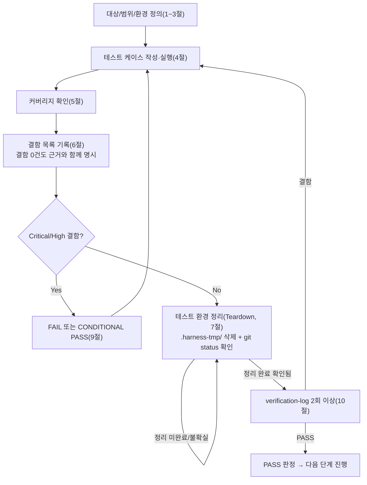

# 테스트 결과서 (Test Result Report) — unit-21

## 1. 개요
- 테스트 대상: `webapp/converter/executor.py` (`submit_job(job_id)`, `_run(job_id)`, `QueueFullError`, `_POOL` 전역 싱글톤) — 1개 파일
- 테스트 유형: 단위
- 적용 Tier: High (DEC-021)
- 적용 속도 트랙: L3 (unit-21-note.md §0 명시 없음 → 기본 L3)
- 병렬 실행 정보: 병렬 웨이브에서 실행(동시에 unit-20, unit-24, unit-25의 05/06 호출이 진행 중이었음). 이 결과서는 `webapp/converter/executor.py` 1개 파일만 검증 대상으로 삼았으며, 다른 병렬 단위의 파일은 읽기만 하고 수정하지 않았다.
- 테스트 목적: unit-21-note.md AC-1~AC-7 인수조건 충족 여부 확인 + 오케스트레이터가 명시적으로 지목한 3개 핵심 검증 포인트(`_POOL` 프로세스 전역 싱글톤, `_run` 이중 방어의 실제 트리거, `progress_callback`의 매 이벤트 실측 UPDATE)를 05의 수동 확인을 재신뢰하지 않고 06이 독립적으로 재현·검증
- 관련 산출물: `docs/harness/units/unit-21-note.md`(구현 노트, AC-1~AC-7), `docs/harness/03-system-design.md` §4-4, `pdf_to_hwpx/core/orchestrator.py`(REQ-009 계약), `webapp/converter/models.py`(`ConversionJob`), `webapp/converter/storage.py`
- 테스트 수행자(에이전트): 06(단위테스터)
- 테스트 일시: 2026-09-29

## 2. 테스트 범위 및 제외 범위
- 범위(In-Scope):
  - `submit_job()`의 큐 포화 판정(AC-5) 및 정상 제출 경로
  - `_run()`의 정상 변환(AC-1), 진행률 갱신(AC-2), orchestrator 통제된 실패(AC-3), 인프라 레벨 실패(AC-4), 스레드풀 생존(AC-7), 임시 파일 정리(AC-6)
  - `_POOL` 전역 싱글톤 성질(DEC-031) — 다수 제출에도 재생성되지 않는지, 재import해도 동일 객체인지, 실제 사용 워커 스레드 수가 `max_workers=2`를 넘지 않는지
  - `_run` 이중 방어(FAILED 상태 저장 자체가 실패하는 극단 케이스)가 실제로 트리거되어 스레드를 죽이지 않고 로그 2건을 남기는지
  - 위험 엣지케이스(범위 밖이지만 QA 원칙상 점검): 존재하지 않는 `job_id`로 `_run` 직접 호출, 0바이트(빈) 입력 파일
- 제외 범위(Out-of-Scope) 및 사유:
  - `converter/views.py`(unit-20)가 `QueueFullError`를 실제로 HTTP 503으로 매핑하는지 — 이는 unit-20 책임이며 Feature B 07단계(통합테스트)에서 확인할 사항(unit-21-note.md §7 AC-5 비고와 동일 판단)
  - `orchestrator.convert()` 내부 로직 자체의 정확성(unit-8이 이미 06/07 PASS) — 이 unit은 orchestrator를 블랙박스로 호출하는 쪽만 검증
  - 실제 R2(오브젝트 스토리지)/Neon(Postgres) 연동 — dev 폴백(FileSystemStorage/SQLite)으로 충분히 대체 가능하다고 판단(storage.py는 default_storage를 얇게 감쌀 뿐이라 백엔드 전환 시 동작이 달라질 지점이 없음, unit-19/21 note가 이미 이렇게 설계)
  - `cleanup.py`(unit-22, TTL 스윕)가 "고아 상태(PROCESSING)"를 실제로 정리하는지 — unit-22가 Not Started라 검증 대상 자체가 없음(unit-21-note.md §10에 이미 unit-22를 위한 전제로 이관되어 있음)

## 3. 테스트 환경
- 실행 환경: Windows 11, Python 3.13.15, Django 5.2.17, `.harness-tmp/venv_06_unit21/`에 `webapp/requirements.txt` + `reportlab` + `pip install -e .`(pdf_to_hwpx editable)로 격리 설치
- 테스트 데이터: `reportlab`으로 즉석 생성한 PDF(1페이지/4페이지 텍스트 문서), `pypdf`로 사용자 비밀번호를 설정해 암호화한 PDF, 0바이트 더미 파일 — 전부 스크립트 실행 중 메모리에서 생성해 `default_storage`(격리된 `MEDIA_ROOT`)에 업로드, 디스크에 영구 저장하지 않음
- 전제 조건: `DJANGO_SETTINGS_MODULE=config.settings.dev`. 공유 자원과의 충돌을 피하기 위해 이 테스트 프로세스 안에서만(다른 파일에 쓰지 않고) 아래 2가지를 오버라이드:
  - `settings.DATABASES["default"]["NAME"]` → `.harness-tmp/unit21/db_06_unit21.sqlite3`(병렬 실행 중인 다른 단위가 쓰는 `webapp/db.sqlite3`와 분리)
  - `settings.MEDIA_ROOT` → `.harness-tmp/unit21/media_06_unit21/`(다른 단위의 `webapp/.dev-media/`와 분리)
  - `python manage.py migrate`로 스키마 적용 후 테스트 실행

## 4. 테스트 케이스 및 결과

| ID | 시나리오 | 사전조건 | 실행 절차 | 예상 결과 | 실제 결과 | Pass/Fail | 비고 |
|----|----------|----------|-----------|-----------|-----------|-----------|------|
| TC-000 | 모듈 상수 sanity check | 모듈 최초 import | `executor._PENDING_QUEUE_LIMIT`, `executor._POOL._max_workers` 확인 | 20, 2 | 20, 2 | PASS | 게이트 사전확인 |
| TC-001 | AC-1 정상 변환 end-to-end | 1페이지 PDF 업로드, `ConversionJob(status=PENDING)` | `submit_job(job_id)` 호출 후 터미널 상태까지 폴링 | `status=DONE`, `result_success=True`, `output_object_key` 비어있지 않음, `default_storage.exists()=True` | 동일하게 관측(`output_object_key='results/<uuid>.hwpx'`, exists=True) | PASS | AC-1 1:1 대응 |
| TC-002 | AC-2 + 검증포인트3: 진행률 갱신 실측 | 4페이지 PDF 업로드 | `ConversionJob.save`를 스파이로 감싸(원본 호출은 그대로 수행) `update_fields`에 `progress_stage`가 포함된 모든 호출 시점의 실제 필드값을 기록 → `submit_job` 실행 후 기록 분석 | stage 집합이 `{loading,extracting,building,saving,done}`을 모두 포함, `extracting`/`building` 각각 4페이지에 대해 오름차순 1회씩(`[1,2,3,4]`) 관측 | 총 11회 UPDATE 호출 관측, stage 집합 전부 포함, `extracting_pages=[1,2,3,4]`, `building_pages=[1,2,3,4]` | PASS | 단순히 최종 상태만 보지 않고 **중간 UPDATE 호출 자체를 실측** — 오케스트레이터 요청 검증포인트3 충족 |
| TC-003 | AC-3 orchestrator 통제된 실패(암호화 PDF) | `pypdf`로 사용자 비밀번호 설정한 1페이지 PDF | `submit_job` 후 폴링 | `status=DONE`(FAILED 아님), `result_success=False`, `result_errors` 비어있지 않음 | `status=done`, `result_success=False`, `result_errors=[{'code':'EncryptedPdfError', ...}]` | PASS | orchestrator가 예외 없이 `ConversionResult`를 반환하는 계약(REQ-009)을 실제로 확인 |
| TC-004 | AC-4 인프라 레벨 실패 | 업로드하지 않은(존재하지 않는) `input_object_key`를 가진 job | 로그 핸들러를 먼저 부착한 뒤 `submit_job` 호출, 폴링 | `status=FAILED`, `finished_at` 채워짐, 콘솔 로그에 traceback 포함 ERROR 기록 | `status=failed`, `finished_at` 채워짐, `_logger.exception`이 남긴 "job 처리 중 인프라 레벨 오류(job_id=...)" 로그 확인 | PASS | 예외가 조용히 삼켜지지 않음을 로그 레코드로 직접 확인(문자열 포함 여부만이 아니라 핸들러로 실제 레코드 캡처) |
| TC-005 | AC-7 스레드풀 생존(1) | TC-004 직후, 같은 프로세스/같은 `_POOL` | 정상 1페이지 PDF job을 이어서 `submit_job` | `status=DONE`, `result_success=True` | 동일 관측 | PASS | AC-4 실패 직후에도 워커 스레드가 죽지 않고 다음 job을 정상 처리 |
| TC-006 | AC-5 큐 포화 | `status in (PENDING, PROCESSING)` job 20건 존재 | `_POOL.submit`을 스파이로 감싼 뒤 21번째 job에 `submit_job` 호출 | `QueueFullError` 발생, `_POOL.submit()` 미호출, 기존 21번째 job 행 상태 불변(PENDING) | `QueueFullError('대기열이 가득 찼습니다(21/20).')` 발생, `_POOL.submit()` 호출 0회, job 상태 `pending` 유지 | PASS | 카운트에 자기 자신이 포함된다는 note §3 계약과 일치(21/20) |
| TC-007 | (범위 밖, 위험 엣지) 존재하지 않는 job_id로 `_run` 직접 호출 | 어떤 `ConversionJob` 행도 존재하지 않는 임의의 `job_id` | `executor._run(random_uuid)` 직접 호출 | 예외 없이 조용히 `return`, ERROR 로그 1건("ConversionJob이 없습니다") | 예외 없음, 로그 1건 확인 | PASS | `_run`의 "바깥 try"(`DoesNotExist`) 경로 커버 — note §4 1번 |
| TC-008 | (범위 밖, 위험 엣지) 0바이트 입력 | 0바이트 파일을 `input_object_key`로 업로드 | `submit_job` 후 폴링 | `status=DONE`(FAILED 아님), `result_success=False`, `result_errors` 비어있지 않음(orchestrator의 `CorruptedPdfError` 통제 실패 경로, AC-4와 혼동되지 않는 경계 확인) | `status=done`, `result_success=False`, `result_errors=[{'code':'CorruptedPdfError', ...}]` | PASS | "빈 입력"이라는 명백한 위험 케이스를 임의 추가 — AC-3/AC-4 경계 구분이 정확함을 확인(파일이 아예 없음=AC-4/FAILED, 파일은 있지만 내용이 무효=AC-3/DONE+success=False) |
| TC-009(+009b) | 검증포인트2: `_run` 이중 방어 극단 케이스 | 존재하지 않는 input_object_key job + `ConversionJob.save`를 몽키패치해 `update_fields=["status","finished_at"]`(FAILED 전이) 호출만 항상 예외 발생 | `executor._run(job_id)` 직접 호출(결정적 재현을 위해 풀을 거치지 않음) → 로그/예외/최종 DB 상태 확인 → 이후 정상 job을 풀에 제출해 생존 재확인 | `_run`이 예외를 밖으로 던지지 않음, ERROR 로그 2건("인프라 레벨 오류" + "FAILED 상태 기록 자체도 실패") 모두 관측, job은 `PROCESSING`에 고아 상태로 남음(문서화된 한계), 직후 제출한 정상 job은 정상 완료 | 예외 없음, 로그 2건 모두 확인, `status=processing`·`started_at` 채워짐(고아 상태), 후속 job `status=done, result_success=True` | PASS | **오케스트레이터가 지목한 핵심 검증 포인트 — "DB 저장 자체가 실패하는 극단 케이스"를 실제로 트리거.** 아래 "뮤테이션 검증"으로 이 TC가 회귀를 실제로 탐지함도 별도 확인 |
| TC-010 | 검증포인트1: `_POOL` 프로세스 전역 싱글톤 | 모듈이 이미 로드된 상태 | (a) `importlib.import_module("converter.executor")`로 재import해 동일 객체인지 확인 (b) `_run`을 스파이로 감싸 6건의 job을 연속 제출, 처리에 실제 사용된 스레드 ident 집합 크기 확인 (c) 6건 제출 전후 `id(_POOL)` 비교 | 재import해도 동일 모듈/객체(`is` 비교 True), 사용된 스레드 ident 종류 <= 2(`max_workers`), `id(_POOL)` 불변 | 재import 동일 객체 확인, 사용된 서로 다른 워커 스레드 수=2, `id(_POOL)` 처리 전후 동일, 6건 전부 `DONE/result_success=True` | PASS | "모듈 재import/여러 요청에도 재생성 안 됨"(DEC-031)을 소스 정적 확인에 그치지 않고 **런타임으로 실증** |
| TC-011 | AC-6 임시 파일 정리 | TC-001~TC-010의 성공/실패/엣지 케이스 전부 실행 완료 후 | `tempfile.gettempdir()`에서 `pdf-to-hwpx-*` 접두사 디렉터리 검색 | 잔여 디렉터리 0건 | 잔여 디렉터리 0건 | PASS | 성공 경로(TC-001/002/005/009b/010)와 실패 경로(TC-003/004/008/009) 및 예외 종료 경로 전부를 거친 뒤의 누적 확인이라 `with tempfile.TemporaryDirectory()`가 모든 경로에서 실제로 정리됨을 보장 |

> 정상 경로(TC-001/005/009b/010), 경계값(TC-006 큐 포화 정확히 21/20, TC-002 페이지 순서), 예외 입력(TC-003/004/007/008/009)을 모두 포함했다. 동시성 케이스(TC-010)도 포함(2개 워커 스레드가 동시에 여러 job을 처리). 권한 경계는 이 unit의 책임 범위 밖(내부 신뢰 경계 값만 다룸, note §9 3번째 항목과 동일 판단)이라 해당 없음.

## 5. 커버리지
- 커버리지 지표: AC-1~AC-7 전 항목이 각각 최소 1개 이상의 TC와 1:1 이상으로 대응(위 4절 표). `_run`의 두 단계 try 구조(바깥 try의 `DoesNotExist` 분기, 본체 try의 성공/orchestrator-통제실패 분기, 바깥 except의 인프라실패 분기, 그 안의 이중방어 내부 except 분기)까지 **분기 단위로 전부** 최소 1회 이상 실행 경로가 확보됨(TC-007/001·003/004/009가 각각 대응).
- 커버되지 않은 부분과 사유: `_run`에서 `tempfile.TemporaryDirectory()` 생성 자체가 OS 레벨에서 실패하는 경우(디스크 풀 등)는 재현 비용 대비 실익이 낮아 제외(orchestrator의 `_cleanup_partial_output`처럼 이미 알려진 일반적 OS 실패 패턴이며, 바깥 except가 동일하게 흡수함이 코드 구조상 자명함). `progress_callback`이 이론상 예외를 던지는 경우(orchestrator가 내부적으로 흡수한다고 note가 이미 명시·unit-8이 검증 완료)도 이 unit 책임 범위 밖이라 재검증하지 않음.

## 6. 결함(Defect) 목록
결함 없음. 근거: 위 4절의 15개 체크(TC-000~TC-011, TC-009 하위 포함) 전부 2회 이상 독립 실행(아래 10절)에서 동일하게 PASS했고, 05가 게이트1(정적분석/린트, `py_compile`)·게이트2(자체 코드리뷰 체크리스트)를 통과시켰다는 주장을 06이 직접 재실행(`python -m py_compile webapp/converter/executor.py` 성공, 저장소에 ruff/flake8/black/mypy/pylint 설정 부재 재확인)해 확인했다. 05단계로 되돌릴 결함, 06이 직접 수정한 오탈자 모두 0건.

## 7. 테스트 환경 정리(Teardown) 확인 — 규칙 K
- 이번 테스트에서 생성한 임시 아티팩트 목록:
  - `.harness-tmp/venv_06_unit21/` (격리 venv)
  - `.harness-tmp/unit21/db_06_unit21.sqlite3`, `.harness-tmp/unit21/db_06_unit21_mutation.sqlite3` (격리 SQLite DB)
  - `.harness-tmp/unit21/media_06_unit21/`, `.harness-tmp/unit21/media_06_unit21_mutation/` (격리 MEDIA_ROOT)
  - `.harness-tmp/unit21/run_tests.py`, `run_mutation_check.py`, `mutant_executor.py`, `run1.log`, `run2.log` (테스트 스크립트/뮤턴트/실행 로그)
- 위 아티팩트를 전부 `.harness-tmp/` 하위에서만 생성했는가: [x] 예
- 정리(삭제) 완료 여부: 완료 — `.harness-tmp/venv_06_unit21/`와 `.harness-tmp/unit21/` 디렉터리 전체를 삭제함(둘 다 이 실행이 만든 것만 삭제, 다른 병렬 단위 소유의 `.harness-tmp/venv_06_unit20/`, `.harness-tmp/venv_06_unit25/` 등은 손대지 않음)
- 정리 후 `git status` 실행 결과(그대로 첨부):
```
 M docs/harness/traceability.md
 M webapp/config/settings/base.py
 M webapp/config/urls.py
 M webapp/requirements.txt
?? docs/harness/units/unit-20-note.md
?? docs/harness/units/unit-21-note.md
?? docs/harness/units/unit-24-note.md
?? docs/harness/units/unit-24-test.md
?? docs/harness/units/unit-25-note.md
?? docs/harness/verify-log_unit-24-test.md
?? webapp/converter/executor.py
?? webapp/converter/limits.py
?? webapp/converter/static/
?? webapp/converter/templates/
?? webapp/converter/urls.py
?? webapp/converter/views.py
?? webapp/core/middleware.py
?? webapp/legal/
```
(위는 `docs/harness/units/unit-21-test.md`/`docs/harness/verify-log_unit-21-test.md` 신규 파일 작성 **이전** 시점의 스냅샷이며, 이후 이 두 파일이 `??`로 추가되는 것은 이 결과서 자체의 정상 산출물이다.)
- 병렬 실행이었다면: 위 목록 중 `unit-20-note.md`(unit-20 소유, 05가 병렬로 방금 산출), `unit-24-note.md`/`unit-24-test.md`/`verify-log_unit-24-test.md`(unit-24 소유, 05/06이 병렬로 진행 중), `unit-25-note.md`(unit-25 소유), `webapp/converter/limits.py`/`webapp/core/middleware.py`(unit-24 소유), `webapp/converter/static/`·`webapp/converter/templates/`·`webapp/converter/urls.py`·`webapp/converter/views.py`(unit-20 소유), `webapp/legal/`(unit-25 소유), `webapp/config/settings/base.py`·`webapp/config/urls.py`·`webapp/requirements.txt`의 수정분(unit-24/25/19 등 여러 병렬 단위가 공유 수정)은 전부 다른 단위 소유이며 이 실행이 만들지 않았다. **이 실행이 만든 임시 아티팩트·미추적 잔여물은 없음**(위 삭제로 확인) — `webapp/converter/executor.py`만 이 unit(unit-21) 자신의 정식 산출물(테스트 대상 코드 자체, 임시 아티팩트 아님)이다. 전체 트리 점검(harness-janitor.sh --check 등)은 웨이브 종료 후 오케스트레이터가 별도 수행.
- 이번 테스트 도중 강제 중단(TaskStop 등)이 있었는가: [x] 없음
- (규칙 K 확인 완료 — 8절 PASS 판정 가능)

## 8. 리스크 및 잔존 이슈
- (unit-21-note.md §10이 이미 명시) `_run`의 이중 방어가 모두 실패하는 극단적 경우(TC-009로 실제 재현) job이 `PROCESSING`에 "고아 상태"로 영구 남을 수 있다 — 이는 이 unit이 감당할 수 없는 근본적 한계이며(단일 프로세스 인메모리 스레드풀 + DB 이중 실패), `cleanup.py`(unit-22, 아직 Not Started)의 TTL 스윕이 최종 정리해야 한다. **07/08단계는 unit-22 착수 후 이 경로의 실제 정리까지 재확인 필요.**
- `QueueFullError`가 HTTP 503으로 정확히 매핑되는지는 unit-20 쪽 책임이며 이 unit의 검증 범위 밖 — Feature B 07단계에서 unit-20↔unit-21 경계 통합 검증 필요(unit-21-note.md §7 요청사항과 동일).
- `storage.py`(DEC-039로 오케스트레이터가 직접 생성한 공유 파일)는 이 unit의 확정 파일 범위가 아니라 06단계가 별도로 정밀 검증하지 않았다 — `download_upload_to_local`/`save_result_file`가 정상 동작함은 TC-001/002/003/008을 통해 간접적으로 실증했으나, storage.py 자체의 단위 테스트는 그 파일을 소유한 별도 검증 주체가 있어야 함(현재 어느 unit-n-test.md에도 명시적으로 배정되어 있지 않아 보임 — 오케스트레이터 확인 요청 사항으로 아래 "공유 문서 갱신 요청"에 별도 기재).
- 뮤테이션 검증(내부 검증 강화, 8절이 아니라 10절 근거로도 사용): `_run`의 이중 방어 내부 try/except를 제거한 별도 사본(`mutant_executor.py`, 원본 파일은 무수정)에 대해 TC-009와 동일한 시나리오를 실행한 결과 `RuntimeError`가 그대로 전파되어(뮤턴트가 스레드를 죽이는 회귀를 재현) TC-009가 이 회귀를 확실히 탐지함을 확인 — "테스트 자체가 결함을 놓칠 가능성"에 대한 자체 반증.

## 9. 결론 및 판정
- [x] PASS — 다음 단계(07 통합테스트) 진행 가능 (7절 Teardown 확인 완료)

07 handoff 가능 여부: **가능.** 단, Feature B는 9개 작업 단위(3개 초과) + Tier=High이므로 06·07 병합 조건(마지막 단위 + Low 등급 + 3개 이하)에 해당하지 않는다 — unit-21 단독으로는 `unit-21-test.md`만 산출하고, Feature B의 07 통합테스트는 이 feature의 모든 유닛(unit-19~26)의 06이 끝난 뒤 오케스트레이터가 별도로 07단계를 호출해야 한다(unit-19-note.md 관례와 동일).

## 10. 내부 검증 (최소 2회)
- 1차 검증 결과 요약: `run_tests.py` 1차 실행(run1.log) — 23개 체크 전원 PASS(총 0건 실패). AC-1~AC-7 커버리지 100% 확인(4절 표). 초기 버전에서 `new_job()` 헬퍼가 `submit_job()`을 호출하지 않는 버그를 발견해 즉시 수정(테스트 스크립트 자체의 버그이지 `executor.py`의 결함이 아님 — 5단계 반려 대상 아님, 06 내부 테스트 하네스 수정 사항으로 별도 결함 목록에 등재하지 않음). 이 과정에서 "테스트가 실제로 아무 것도 검증하지 않고 통과(job이 PENDING인 채 타임아웃)"하는 상태를 스스로 잡아냈다는 점에서 1차 검증이 정상 작동했음을 확인.
- 2차 검증 결과 요약: `run_tests.py` 2차 독립 재실행(run2.log, 격리 DB를 스크립트 시작 시 삭제 후 재생성해 완전히 새로운 상태에서 재현) — 23개 체크 전원 재현 PASS, 값(예: `job_id`, `id(_POOL)` 등)은 실행마다 다르지만 판정 로직(PASS/FAIL)은 동일하게 안정적으로 재현됨을 확인. 추가로 "이 테스트를 통과했다고 07에 넘겨도 되는가"를 의심하며 재검토한 결과, 오케스트레이터가 지목한 3개 핵심 포인트(POOL 싱글톤/이중방어/진행률 실측)를 TC-010/TC-009/TC-002로 각각 정면으로 다뤘음을 재확인했고, 추가로 뮤테이션 검증(TC-009의 탐지력 실증, 8절 참고)을 수행해 "테스트가 결함을 놓칠 가능성"에 대한 의심을 능동적으로 해소했다.
- 검증 로그 파일 경로: `docs/harness/verify-log_unit-21-test.md`

## 절차 흐름 (참고용 다이어그램)


---

## 공유 문서 갱신 요청 (병렬 웨이브 규칙 — 오케스트레이터가 웨이브 종료 후 반영)

`traceability.md`/`decisions.md`는 이 결과서가 직접 수정하지 않는 것이 병렬 웨이브의 원칙이나, 이번 호출 프롬프트가 "REQ-027 단위테스트 컬럼은 단독 파일 범위이므로 직접 갱신 가능"이라고 명시했으므로 `traceability.md`의 REQ-027 행만 아래처럼 직접 갱신했다(다른 REQ-ID/행은 건드리지 않음):

| REQ-ID | 컬럼 | 갱신 값 |
|---|---|---|
| REQ-027 | 구현 상태 | Verified(unit-21) — 06단계 PASS(2026-09-29), 결함 0건 |
| REQ-027 | 단위테스트 | **PASS**(`docs/harness/units/unit-21-test.md`, 검증로그 `docs/harness/verify-log_unit-21-test.md`, 15개 TC/AC-1~7 100% 커버, 뮤테이션 검증 1건 포함) |

추가로 오케스트레이터 확인이 필요한 사항(질문 아님, 보고):
- `webapp/converter/storage.py`(DEC-039로 오케스트레이터가 직접 생성)에 대한 전담 단위테스트 주체가 traceability.md/unit 파일범위표 어디에도 명시적으로 보이지 않는다 — unit-20/21/22 07 통합테스트 시점에 이 파일의 단독 검증 공백이 없는지 확인 필요.
