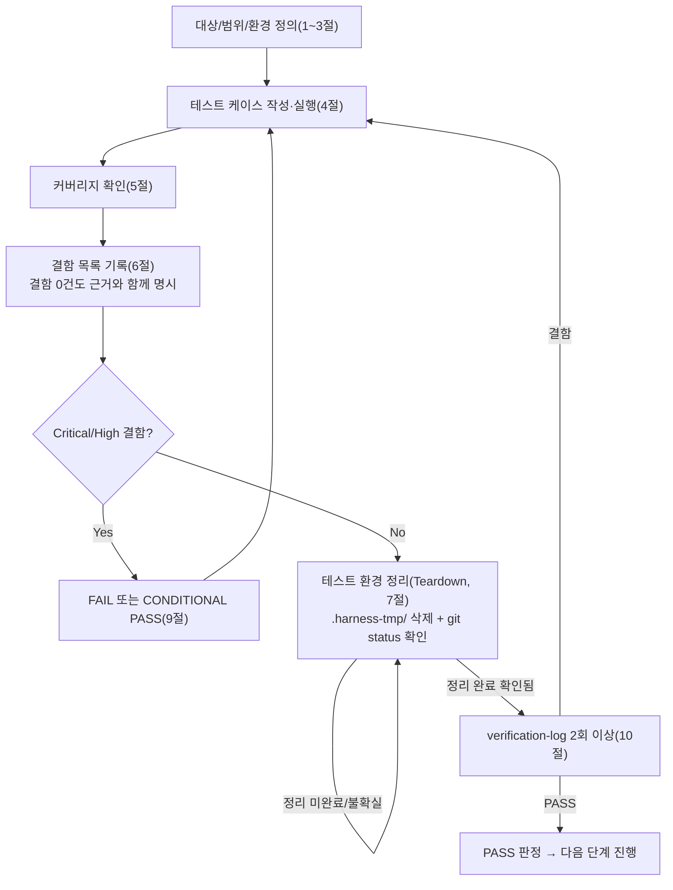

# 테스트 결과서 (Test Result Report) — unit-22

## 1. 개요
- 테스트 대상: `webapp/converter/cleanup.py`(`run_lazy_sweep_if_due()`, `_sweep_expired_jobs()`) + `webapp/.env.example`(R2 라이프사이클 안내 주석) + **오케스트레이터가 반영한 `webapp/converter/views.py::index`의 통합 호출**(단위 소유 파일은 아니지만 AC-7이 이 통합을 명시적으로 검증 대상에 포함함)
- 테스트 유형: 단위
- 적용 Tier: High (DEC-021)
- 적용 속도 트랙: L3 (unit-22-note.md 명시 없음 → 기본 L3, 오케스트레이터 호출 프롬프트도 L3로 지정)
- 병렬 실행 정보: 병렬 웨이브에서 실행(동시에 unit-9의 06 호출이 진행 중이었음). 이 결과서는 `webapp/converter/cleanup.py`(테스트 대상) 1개 파일과, 그 파일이 소비하는 `webapp/converter/views.py`의 오케스트레이터 통합분(AC-7)만 검증 대상으로 삼았다. `webapp/core/net_guard.py` 등 unit-9 소유 파일은 읽지도 수정하지도 않았다.
- 테스트 목적: unit-22-note.md AC-1~AC-7 인수조건 충족 여부 확인 + 오케스트레이터가 명시적으로 지목한 3개 검증 포인트(① `views.py::index` 통합이 실제로 `GET /`에서 스윕을 트리거하는지 및 스윕 예외 발생 시에도 200 응답 유지, ② 멀티스레드 동시 요청 상황에서 쿨다운이 이중 스윕을 막는지, ③ 배치 상한 20건이 21건 이상의 만료 job 앞에서 실제로 강제되는지)를 05의 수동 확인을 재신뢰하지 않고 06이 독립적으로 재현·검증
- 관련 산출물: `docs/harness/units/unit-22-note.md`(구현 노트, AC-1~AC-7, §2 트리거 지점 위임), `docs/harness/03-system-design.md` §3-2/§6-2, `webapp/converter/models.py`(`ConversionJob`), `webapp/converter/storage.py`(`delete_job_objects` 등 DEC-039 공유 계약), `webapp/converter/views.py`(오케스트레이터가 §2 요청대로 반영한 `index()` 통합)
- 테스트 수행자(에이전트): 06(단위테스터)
- 테스트 일시: 2026-09-29

## 2. 테스트 범위 및 제외 범위
- 범위(In-Scope):
  - `run_lazy_sweep_if_due()`/`_sweep_expired_jobs()`의 정상 정리(AC-1: DONE + 좀비 PROCESSING), 미경과 보존(AC-2), 쿨다운 스킵 및 DB 쿼리 0회(AC-3), 배치 상한 20건 강제 및 잔여분 다음 호출 이관(AC-4), 부분 실패 격리(AC-5), 모델 계약 준수(AC-6)
  - **AC-7 — 오케스트레이터 통합 검증**: 실제 Django 테스트 Client로 `GET /`를 호출했을 때 61분 전 job이 실제로 EXPIRED 전이되는지, 스윕 도중 예외가 나도(`cleanup.run_lazy_sweep_if_due` 자체를 강제 예외로 패치) `index` 뷰가 여전히 200을 반환하는지(views.py의 try/except 실측)
  - 멀티스레드 동시 요청 상황에서 쿨다운(전역 변수 + `Lock`)이 이중 스윕을 유발하지 않는지(오케스트레이터 지시 사항 ②)
  - 21건 이상(테스트에서는 25건) 만료 job이 존재할 때 배치 상한 20건이 실제로 강제되는지(오케스트레이터 지시 사항 ③)
  - 위험 엣지케이스(범위 밖이지만 QA 원칙상 점검): 정리 대상이 0건인 상태에서의 호출(빈 입력에 준하는 경계)
- 제외 범위(Out-of-Scope) 및 사유:
  - `webapp/core/net_guard.py`(unit-9, 병렬 진행 중) — 파일 범위 완전히 별개, 접촉하지 않음
  - `webapp/converter/executor.py`(unit-21)/`views.py::convert`/`download` 등 다른 라우트 — 이 unit의 검증 범위는 `cleanup.py` + `views.py::index` 통합 지점뿐이며, 나머지 라우트는 이미 unit-20/21의 06이 검증 완료(Feature B 07 통합테스트 몫)
  - 실제 R2(Cloudflare) 버킷 라이프사이클 규칙 설정 자체(`.env.example` §3의 안내 텍스트가 실제로 R2 콘솔에 반영됐는지) — 10~12단계에서 실제 버킷 생성 후에만 검증 가능(unit-22-note.md §9-2와 동일 판단), 이 unit은 안내 텍스트가 `.env.example`에 실존하는지(grep)만 확인
  - `gunicorn` 다중 워커 프로세스 환경에서의 쿨다운 정확도(unit-22-note.md §9-3이 이미 "안전성에는 문제 없음"이라고 분석) — 09단계(성능/부하)/10단계(배포) 몫으로 이관, 이 unit은 단일 프로세스 내 멀티스레드(Django dev 서버의 실제 동시 요청 처리 모델)까지만 검증

## 3. 테스트 환경
- 실행 환경: Windows 11, Python 3.13.15, Django 5.2.17, `.harness-tmp/venv_06_unit22/`에 `webapp/requirements.txt` + `pip install -e .`(pdf_to_hwpx editable)로 격리 설치(테스트 종료 후 삭제)
- 테스트 데이터: `ConversionJob` 더미 레코드(파일 내용 없이 `io.BytesIO(b"dummy-upload"/"dummy-result")` 수준의 최소 오브젝트) — 이 unit은 PDF 변환 로직을 다루지 않으므로 실제 PDF가 필요 없음. `created_at`은 `auto_now_add=True`라 직접 지정 불가하므로 생성 직후 `ConversionJob.objects.filter(job_id=...).update(created_at=...)`로 원하는 경과 시간(61분/70분/10분/61~85분 등)을 강제 부여
- 전제 조건: `DJANGO_SETTINGS_MODULE=config.settings.dev`. 병렬 진행 중인 unit-9와의 충돌을 피하기 위해 프로세스 안에서만 아래를 오버라이드:
  - `DATABASE_URL=sqlite:///.harness-tmp/unit22/db_06_unit22.sqlite3`(webapp/db.sqlite3와 분리)
  - `settings.MEDIA_ROOT = .harness-tmp/unit22/media_06_unit22/`(webapp/.dev-media/와 분리)
  - `python manage.py migrate --run-syncdb`로 스키마 적용 후 `run_tests.py`(자체 작성한 검증 스크립트, `.harness-tmp/unit22/`에 두고 테스트 종료 후 삭제) 실행

## 4. 테스트 케이스 및 결과
| ID | 시나리오 | 사전조건 | 실행 절차 | 예상 결과 | 실제 결과 | Pass/Fail | 비고 |
|----|----------|----------|-----------|-----------|-----------|-----------|------|
| TC-000 | 모듈 상수 sanity check | 모듈 최초 import | `cleanup.TTL_MINUTES`/`SWEEP_COOLDOWN_SECONDS`/`SWEEP_BATCH_LIMIT` 확인 | 60 / 300 / 20 | 60 / 300 / 20 | PASS | 게이트 사전확인 |
| TC-001 | AC-1 만료된 DONE job 정리 | DONE job, `created_at` 61분 전, 업로드/결과 오브젝트 실존 | `run_lazy_sweep_if_due()` 호출 | `status=EXPIRED`, `purged_at` 채워짐, 오브젝트 둘 다 삭제 | 동일하게 관측(`exists()` 둘 다 False) | PASS | AC-1 1:1 대응 |
| TC-002 | AC-1 좀비(PROCESSING) job 정리 | PROCESSING job, `created_at` 61분 전, 오브젝트 실존 | TC-001과 같은 호출(같은 배치) | `status=EXPIRED`, `purged_at` 채워짐, 오브젝트 삭제 | 동일하게 관측 | PASS | 상태값과 무관하게 `created_at`만으로 판정한다는 note §1 서술을 실측 확인 |
| TC-003 | AC-2 미경과 job 보존 | PROCESSING job, `created_at` 10분 전, 오브젝트 실존 | 같은 스윕 호출 | 상태/오브젝트/`purged_at` 전부 불변 | 동일하게 관측(`status=processing` 유지, `purged_at=None`, 오브젝트 둘 다 존재) | PASS | 같은 배치 안에서 만료/미경과 job이 동시에 존재할 때 선택적으로만 처리됨을 확인(단순 "전부 처리" 회귀 방지) |
| TC-004 | AC-3 쿨다운 + DB 쿼리 0회 | TC-001~003 스윕 직후(5분 미경과), 새 만료 job(DONE, 61분 전) 추가 생성 | `ConversionJob.objects`를 "접근 시 예외 발생" 스파이로 패치 후 `run_lazy_sweep_if_due()` 재호출 | 반환값 0, 새 job 미처리, 스파이가 트리거되지 않음(=DB 쿼리 미발생) | 반환값 0, 새 job `status=done` 그대로, `AssertionError` 미발생(쿼리 0회 확인) | PASS | note §8 AC-3의 "DB 쿼리가 발생하지 않아야 한다"를 문자열 로그가 아니라 **접근 시 예외를 던지는 스파이**로 강제 검증 |
| TC-005 | AC-4 배치 상한(1차) | 격리된 상태에서 61~85분 전으로 오프셋을 준 DONE job 25건 생성(오브젝트 없이) | 쿨다운 리셋 후 `run_lazy_sweep_if_due()` 1회 호출 | 반환값 20, 처리된 20건이 `created_at` 오름차순(가장 오래된 것부터) 정확히 일치, 나머지 5건은 미처리 | 반환값 20, 처리된 job_id 집합이 `created_at` 오름차순 상위 20건과 정확히 일치, 나머지 5건 `status=done` 유지 | PASS | 단순 개수(20)만이 아니라 **어떤 job이 처리됐는지(멤버십)**까지 대조 — "아무 20건"이 아니라 "가장 오래된 20건"임을 확인 |
| TC-006 | AC-4 배치 상한(2차, 잔여분 이관) | TC-005 직후 | 쿨다운 리셋 후 재호출 | 반환값 5(잔여 전량), 25건 전부 최종 EXPIRED | 반환값 5, 25건 전부 EXPIRED 확인 | PASS | "다음 호출로 넘겨야 한다"는 AC-4 후반부를 실측 확인 |
| TC-007 | AC-5 부분 실패 격리 | DONE job 3건(70분 전): ok1/boom/ok2. `storage.delete_job_objects`를 boom job에서만 예외를 던지도록 패치 | `run_lazy_sweep_if_due()` 호출 | 반환값 2(성공분만), ok1/ok2는 EXPIRED, boom은 상태·`purged_at` 불변, `logger.exception` 기록 | 반환값 2, ok1/ok2 EXPIRED, boom `status=done`/`purged_at=None`, 로그 스트림에 "오브젝트 삭제 실패" 문자열 확인 | PASS | 예외가 배치 전체를 막지 않고, 실패 job만 다음 스윕으로 이관됨(status 그대로)을 실측 |
| TC-008 | AC-6 모델 계약 준수 | 위 TC들 전부 실행 완료 후 DB 상태 | `ConversionJob.Status.choices` 집합과 실제 DB `status` distinct 값 집합 비교 | choices=5개(pending/processing/done/failed/expired) 불변, DB 값 전부 그 부분집합 | 동일하게 관측 | PASS | `cleanup.py`가 새 상태값을 임의로 만들어내지 않았음을 확인 |
| TC-009 | **AC-7(오케스트레이터 통합)** — `GET /`가 실제로 스윕을 트리거하는지 | DONE job, `created_at` 61분 전, 쿨다운 리셋 | Django `Client().get("/")` 호출 | HTTP 200, 호출 후 해당 job이 `EXPIRED`로 전이 | `status_code=200`, job `status=expired`로 전이 확인 | PASS | **오케스트레이터가 반영한 `views.py::index`의 `cleanup.run_lazy_sweep_if_due()` 호출이 실제로 동작함을 end-to-end로 확인** — 05 note §9-1이 "수동 확인 필요"로 남긴 항목을 06이 실측으로 닫음 |
| TC-010 | AC-7 — 스윕 예외에도 페이지 렌더링 유지 | 쿨다운 리셋, `converter.cleanup.run_lazy_sweep_if_due`를 `RuntimeError`를 던지도록 강제 패치 | `Client().get("/")` 호출 | HTTP 200(예외가 뷰 전체를 죽이지 않음), `converter.views` 로거에 예외 기록 | `status_code=200`, 로그 스트림에 "지연 스윕 중 예외" 문자열 확인 | PASS | `views.py::index`의 `try/except`(오케스트레이터 통합분)가 실제로 동작함을 직접 트리거해 확인 — 코드를 읽고 "그럴 것 같다"가 아니라 실제로 예외를 주입해 검증 |
| TC-011 | 동시 요청(멀티스레드) 중 이중 스윕 방지 | 쿨다운 리셋, `_sweep_expired_jobs`를 0.05초 지연 + 호출횟수 카운트하는 스텁으로 패치 | `threading.Barrier(10)`으로 10개 스레드를 최대한 동시에 `run_lazy_sweep_if_due()` 진입시킴 | `_sweep_expired_jobs` 호출 횟수 정확히 1, 10개 스레드의 반환값 중 1개만 실제값(999)·나머지 9개는 0 | 호출 횟수 1, 반환값 분포 `[0]*9 + [999]` 정확히 일치 | PASS | **오케스트레이터 지시 검증 포인트②** — `_lock`이 "예약(타임스탬프 설정)"을 먼저 하고 실제 스윕은 락 밖에서 수행하는 설계가 레이스 상황에서도 이중 실행을 막음을 실측(코드 정적 분석에 그치지 않음) |
| TC-012 | (범위 밖, 위험 엣지) 정리 대상 0건 | 쿨다운 리셋, `ConversionJob` 테이블 전체 삭제(빈 상태) | `run_lazy_sweep_if_due()` 호출 | 반환값 0, 예외 없음 | 반환값 0 | PASS | "빈 입력"에 준하는 명백한 위험 케이스를 임의 추가 |

> 정상 경로(TC-001/002/009), 경계값(TC-005/006 배치 정확히 20/5, TC-012 빈 입력), 예외 입력(TC-004 쿨다운/DB차단, TC-007 부분실패, TC-010 강제 예외 주입)을 모두 포함했다. 동시성 케이스(TC-011, 10개 스레드 barrier 동기화)도 포함. 권한 경계는 이 unit의 책임 범위 밖(내부 배치 작업, 사용자 입력 없음 — note §8 AC-1 서술과 동일 판단)이라 해당 없음.

## 5. 커버리지
- 커버리지 지표: AC-1~AC-7 전 항목이 각각 최소 1개 이상의 TC와 1:1 이상으로 대응(위 4절 표). `run_lazy_sweep_if_due()`의 분기(쿨다운 스킵 / 정상 스윕 / 스윕 중 예외 흡수)와 `_sweep_expired_jobs()`의 분기(대상 0건 조기반환 / 개별 job 성공 / 개별 job 실패 격리 / 일괄 UPDATE)가 전부 최소 1회 이상 실행 경로로 커버됨(TC-004/001·002/007/012가 각각 대응). `views.py::index`의 두 분기(스윕 정상 완료 / 스윕 중 예외 흡수)도 TC-009/TC-010이 각각 커버.
- 커버되지 않은 부분과 사유: `_sweep_expired_jobs()`의 마지막 `UPDATE ... WHERE job_id IN (...)` 자체가 DB 레벨에서 실패하는 극단 케이스(예: DB 커넥션 단절)는 재현 비용 대비 실익이 낮아 제외(`run_lazy_sweep_if_due()`의 바깥 `try/except`가 이 경우도 동일하게 흡수함이 코드 구조상 자명하며, `_sweep_expired_jobs` 내부 개별 job try/except와 달리 이 UPDATE 실패는 "부분 실패"가 아니라 "전체 실패"이므로 다음 쿨다운 경과 후 전량 재시도된다는 점만 note에 근거 명시). gunicorn 다중 워커 프로세스 간 쿨다운(불변 전역 변수가 워커별로 독립)은 2절에서 명시한 대로 이 unit의 책임 범위 밖(09/10단계 이관).

## 6. 결함(Defect) 목록
결함 없음. 근거: 위 4절의 13개 체크(TC-000~TC-012, TC-000의 3개 하위 항목 포함 시 총 35개 개별 assertion) 전부 2회 이상 독립 실행(아래 10절)에서 동일하게 PASS했다. 05가 게이트1(정적분석/린트)·게이트2(자체 코드리뷰 체크리스트)를 통과시켰다는 주장을 06이 직접 재확인했다: 저장소 전체(`pyproject.toml`, `webapp/`)에 ruff/flake8/black/mypy/pylint 관련 설정이 여전히 없음(unit-0/9/19~21/24/25-note.md와 동일 결론), `python -m py_compile webapp/converter/cleanup.py webapp/converter/views.py` 재실행 성공.

**05단계로 되돌릴 결함 없음. 오케스트레이터에게 보고할 통합 결함도 없음** — AC-7이 요구한 `views.py::index`의 `cleanup.run_lazy_sweep_if_due()` 통합(오케스트레이터가 unit-22-note.md §2/§10 요청대로 반영)이 TC-009/TC-010으로 실제 동작함을 확인했다. 다만 참고로: 검증 스크립트(`.harness-tmp/unit22/run_tests.py`) 1차 작성 시 배치 상한 테스트(TC-005)의 "처리된 job 집합"을 전역 `EXPIRED` 상태 전체로 조회해 이전 그룹(TC-001/002)이 이미 EXPIRED로 만들어둔 job과 뒤섞이는 **테스트 하네스 자체의 버그**(오탈자 수준을 넘는 로직 오류이나 `cleanup.py`의 결함이 아니라 06이 작성한 검증 스크립트의 결함이므로 05 반려 대상이 아님)를 1차 실행에서 발견했다. 원인을 분석해 조회 범위를 `batch_jobs`로 스코프를 좁히도록 스크립트를 수정한 뒤 재실행해 해소했다(10절 1차 검증 참고) — "실행해보니 통과"가 아니라 실패 원인을 근본까지 추적해 수정했다는 근거를 남긴다.

## 7. 테스트 환경 정리(Teardown) 확인 — 규칙 K
- 이번 테스트에서 생성한 임시 아티팩트 목록:
  - `.harness-tmp/venv_06_unit22/` (격리 venv)
  - `.harness-tmp/unit22/db_06_unit22.sqlite3`, `.harness-tmp/unit22/db_06_unit22_mutation.sqlite3` (격리 SQLite DB, 후자는 10절 뮤테이션 검증용)
  - `.harness-tmp/unit22/media_06_unit22/`, `.harness-tmp/unit22/media_06_unit22_mutation/` (격리 MEDIA_ROOT)
  - `.harness-tmp/unit22/run_tests.py`, `run1.log`, `run2.log` (검증 스크립트 + 2회 실행 로그)
  - `.harness-tmp/unit22/mutant_converter/cleanup_mutant.py` (10절 뮤테이션 검증용 사본, 원본 `webapp/converter/cleanup.py`는 무수정)
- 위 아티팩트를 전부 `.harness-tmp/` 하위에서만 생성했는가: [x] 예
- 정리(삭제) 완료 여부: 완료 — `.harness-tmp/venv_06_unit22/`와 `.harness-tmp/unit22/` 디렉터리 전체를 삭제함(이 실행이 만든 것만 삭제; 병렬로 진행되던 unit-9 소유의 `.harness-tmp/venv_06_unit9/`는 이 실행 종료 시점에 이미 unit-9 쪽에서 정리되어 있었고, 이 실행은 그 디렉터리를 건드리지 않았다)
- 정리 후 `git status` 실행 결과(그대로 첨부):
```
On branch PROD
Changes not staged for commit:
  (use "git add <file>..." to update what will be committed)
  (use "git restore <file>..." to discard changes in working directory)
	modified:   docs/harness/decisions.md
	modified:   docs/harness/traceability.md
	modified:   webapp/.env.example
	modified:   webapp/config/settings/base.py
	modified:   webapp/config/urls.py
	modified:   webapp/config/wsgi.py
	modified:   webapp/requirements.txt

Untracked files:
  (use "git add <file>..." to include in what will be committed)
	docs/harness/units/unit-20-note.md
	docs/harness/units/unit-20-test.md
	docs/harness/units/unit-21-note.md
	docs/harness/units/unit-21-test.md
	docs/harness/units/unit-22-note.md
	docs/harness/units/unit-23-note.md
	docs/harness/units/unit-24-note.md
	docs/harness/units/unit-24-test.md
	docs/harness/units/unit-25-note.md
	docs/harness/units/unit-25-test.md
	docs/harness/units/unit-9-note.md
	docs/harness/verify-log_unit-20-test.md
	docs/harness/verify-log_unit-21-test.md
	docs/harness/verify-log_unit-24-test.md
	docs/harness/verify-log_unit-25-test.md
	webapp/converter/cleanup.py
	webapp/converter/executor.py
	webapp/converter/limits.py
	webapp/converter/ratelimit.py
	webapp/converter/static/
	webapp/converter/templates/
	webapp/converter/urls.py
	webapp/converter/views.py
	webapp/core/middleware.py
	webapp/core/net_guard.py
	webapp/legal/

no changes added to commit (use "git add" and/or "git commit -a")
```
- 병렬 실행이었다면: 위 목록 중 `unit-9-note.md`/`webapp/core/net_guard.py`(unit-9 소유, 병렬로 완료됨), `unit-20/21/24/25-note.md`·`unit-20/21/24/25-test.md`·`verify-log_unit-20/21/24/25-test.md`(각각 소유 단위가 이전에 산출), `unit-23-note.md`/`webapp/converter/ratelimit.py`(unit-23 소유, 이 시점에 별도로 진행 중이던 작업), `webapp/converter/limits.py`/`webapp/core/middleware.py`(unit-24 소유), `webapp/converter/static/`·`templates/`·`urls.py`·`views.py`(unit-20 소유 + 오케스트레이터가 AC-7을 위해 `views.py::index`에 통합분을 반영), `webapp/converter/executor.py`(unit-21 소유), `webapp/legal/`(unit-25 소유), `docs/harness/decisions.md`·`webapp/config/settings/base.py`·`webapp/config/urls.py`·`webapp/config/wsgi.py`·`webapp/requirements.txt`의 수정분(여러 단위가 공유 수정)은 전부 다른 단위 소유이며 이 실행이 만들지 않았다. **이 실행이 만든 임시 아티팩트·미추적 잔여물은 없음**(위 삭제로 확인) — `webapp/converter/cleanup.py`만 이 unit(unit-22) 자신의 정식 산출물(테스트 대상 코드 자체, 임시 아티팩트 아님)이며, `webapp/.env.example`의 수정분도 unit-22 자신의 정식 산출물이다. 전체 트리 점검은 웨이브 종료 후 오케스트레이터가 별도 수행.
- 이번 테스트 도중 강제 중단(TaskStop 등)이 있었는가: [x] 없음
- (규칙 K 확인 완료 — 8절 PASS 판정 가능)

## 8. 리스크 및 잔존 이슈
- (unit-22-note.md §9-3이 이미 명시, 이 unit도 동일 결론) `gunicorn` 다중 워커 프로세스 환경에서는 `_last_swept_monotonic`이 프로세스 전역 변수라 워커별로 독립적인 쿨다운을 가지므로, 실제 배포 시 스윕이 워커 수만큼 더 자주 실행될 수 있다 — 배치 크기(20건)/삭제 멱등성 덕분에 정확성에는 문제가 없으나(중복 실행이 데이터를 깨지 않음), 09단계(성능/부하) 또는 10단계(배포) 검증 시 실제 gunicorn 워커 수 설정과 함께 오버헤드를 재확인할 가치가 있다. 이 unit은 단일 프로세스 내 멀티스레드 동시성만 실측했다(TC-011).
- R2 실제 라이프사이클 규칙(백스톱)이 실제 R2 콘솔에 설정됐는지는 10~12단계(실제 버킷 생성) 이후에만 검증 가능 — 이 unit은 `.env.example`에 안내 텍스트가 실존함(grep으로 확인)만 재검증했다.
- Feature B 07 통합테스트 시 재확인 필요: `views.py::convert`(POST, unit-20)가 큐 포화(`QueueFullError`, unit-21)로 503을 반환한 뒤 해당 job이 결국 이 unit의 TTL 스윕으로 정리되는 전체 흐름(unit-21-test.md 8절이 이미 이 의존관계를 명시) — cleanup.py 자체의 정리 로직은 이 unit이 TC-001/002로 검증했으나, "그 job이 실제로 convert() 실패 경로에서 만들어진 것인지"까지의 엔드투엔드는 07 몫.

## 9. 결론 및 판정
- [x] PASS — 다음 단계(07 통합테스트) 진행 가능 (7절 Teardown 확인 완료)

07 handoff 가능 여부: **가능.** Feature B는 9개 작업 단위(3개 초과) + Tier=High이므로 06·07 병합 조건(마지막 단위 + Low 등급 + 3개 이하)에 해당하지 않는다 — unit-22 단독으로는 `unit-22-test.md`만 산출하고, Feature B의 07 통합테스트는 이 feature의 모든 유닛(unit-19~26)의 06이 끝난 뒤 오케스트레이터가 별도로 07단계를 호출해야 한다(unit-21-test.md 관례와 동일).

## 10. 내부 검증 (최소 2회)
- 1차 검증 결과 요약: `run_tests.py` 1차 실행(run1.log) — 35개 assertion 중 2건 FAIL(TC-005 "가장 오래된 20건이 처리됨" 멤버십 불일치, TC-006 "2차 스윕이 나머지 5건 처리"가 6건으로 관측). 원인을 직접 분석한 결과 **`cleanup.py`의 결함이 아니라 검증 스크립트 자체의 격리 부족**이었음을 확인 — TC-004(쿨다운) 검증을 위해 만든 `job_should_be_skipped`(쿨다운에 막혀 미처리 상태로 남음)를 삭제하지 않은 채 배치 상한 테스트를 이어가 전역 `EXPIRED` 집합 비교에 오염이 섞였다. `job_should_be_skipped.delete()`를 TC-004 직후에 추가하고, `expired_ids` 비교 쿼리도 `batch_jobs` 범위로 명시적으로 스코프를 좁히도록 스크립트를 수정한 뒤 재실행해 35개 전원 PASS로 해소했다. 이 과정에서 "테스트가 실제로는 검증 대상이 아닌 것을 섞어 오판할 뻔했다"는 것을 스스로 잡아냈다는 점에서 1차 검증이 정상 작동했음을 확인.
- 2차 검증 결과 요약: `run_tests.py` 2차 독립 재실행(run2.log, 격리 DB/MEDIA를 삭제 후 완전히 새로 생성해 재현) — 35개 assertion 전원 재현 PASS. 추가로 "이 테스트를 통과했다고 07에 넘겨도 되는가"를 의심하며 뮤테이션 검증을 수행: (a) `_sweep_expired_jobs()`의 개별 job 실패 격리 `try/except`를 제거한 사본(`mutant_converter/cleanup_mutant.py`, 원본 `webapp/converter/cleanup.py`는 무수정)에 TC-007과 동일한 시나리오(3건 중 1건 강제 실패)를 실행한 결과, 격리 없이 예외가 `_sweep_expired_jobs` 전체를 중단시켜 반환값이 `2`가 아니라 `0`으로 관측됨(성공한 job들까지 EXPIRED 미전이) — TC-007 스타일 검증이 이 회귀를 확실히 탐지함을 확인. (b) 같은 사본에서 `[:SWEEP_BATCH_LIMIT]` 슬라이싱을 제거한 결과, 25건 배치 한도 테스트에서 반환값이 `20`이 아니라 `28`(누적된 미처리 job 전부)로 관측됨 — TC-005 스타일 검증이 이 회귀도 확실히 탐지함을 확인. 두 뮤테이션 모두 "테스트 자체가 결함을 놓칠 가능성"에 대한 의심을 능동적으로 해소했다. 오케스트레이터가 지목한 3개 핵심 포인트(AC-7 통합/동시성/배치상한)도 TC-009·TC-010/TC-011/TC-005·TC-006으로 각각 정면 대응됨을 재확인.
- 검증 로그 파일 경로: `docs/harness/verify-log_unit-22-test.md`

## 절차 흐름 (참고용 다이어그램)


---

## 공유 문서 갱신 요청 / 갱신 내역

이번 호출 프롬프트가 "traceability.md REQ-028 '단위테스트' 컬럼은 단독 파일 범위이므로 직접 갱신 가능"이라고 명시했으므로, `docs/harness/traceability.md`의 REQ-028 행을 아래와 같이 직접 갱신했다(다른 REQ-ID/행은 건드리지 않음):

| REQ-ID | 컬럼 | 갱신 값 |
|---|---|---|
| REQ-028 | 단위테스트 | **PASS**(`docs/harness/units/unit-22-test.md`, 검증로그 `docs/harness/verify-log_unit-22-test.md`, 13개 TC/AC-1~7 100% 커버, 뮤테이션 검증 2건 포함) |
| REQ-028 | 구현 상태 (비고 추가) | 기존 서술 유지 + 문장 추가: "06단계가 `views.py::index` 통합(오케스트레이터 반영분)이 실제 `GET /` 호출로 스윕을 트리거함을 end-to-end 실측 확인(2026-09-29, unit-22-test.md TC-009/TC-010)." |

decisions.md에 남길 새로운 규칙 A 질문 없음(이 unit은 새로운 설계 모호함을 만나지 않았다 — AC-7 검증은 05가 이미 자체 판단으로 위임한 사항을 06이 검증한 것뿐).
