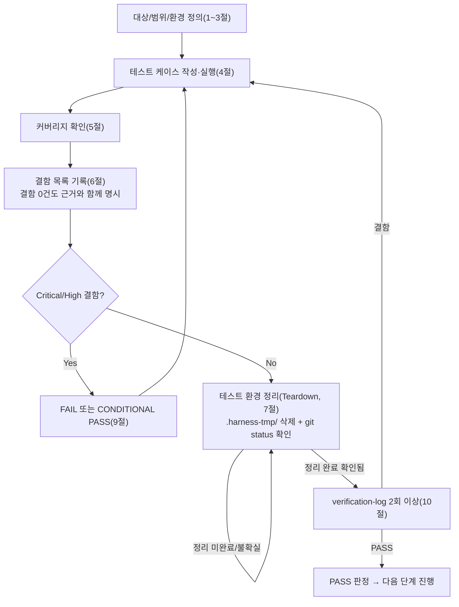

# 테스트 결과서 (Test Result Report) — unit-22 (v1 PASS 원문 + 11절 v2 재검증 PASS)

> **현재 유효 판정은 11절(재검증 2회차, 2026-09-29, unit-22 v2 = DEC-063·064 5단계 재작업, 대상 `cleanup.py` sha1 `dbbaa4f0…`): PASS** (AC-1~AC-12 12/12, 결함 0건, 관찰 6건). 1~10절은 v1 원문(AC-1~7, 13 TC)이며 그대로 보존한다. v1의 서술 중 "`_sweep_expired_jobs()`의 분기(대상 0건 조기반환 / …)", "`exclude(status=EXPIRED)`만으로 EXPIRED 행을 건너뜀" 취지의 기술은 v2에서 예약 행 회수 대상이 추가되어 갱신되었다. 11절이 자기완결적으로 전체(AC-1~12 회귀 포함)를 재검증한다.

## 1. 개요
- 테스트 대상: `webapp/converter/cleanup.py`(`run_lazy_sweep_if_due()`, `_sweep_expired_jobs()`) + `webapp/.env.example`(R2 라이프사이클 안내 주석) + **오케스트레이터가 반영한 `webapp/converter/views.py::index`의 통합 호출**(단위 소유 파일은 아니지만 AC-7이 이 통합을 명시적으로 검증 대상에 포함함)
- 테스트 유형: 단위
- 적용 Tier: High (DEC-021)
- 적용 속도 트랙: L3 (unit-22-note.md 명시 없음 → 기본 L3, 오케스트레이터 호출 프롬프트도 L3로 지정)
- 병렬 실행 정보: 병렬 웨이브에서 실행(동시에 unit-9의 06 호출이 진행 중이었음). 이 결과서는 `webapp/converter/cleanup.py`(테스트 대상) 1개 파일과, 그 파일이 소비하는 `webapp/converter/views.py`의 오케스트레이터 통합분(AC-7)만 검증 대상으로 삼았다. `webapp/core/net_guard.py` 등 unit-9 소유 파일은 읽지도 수정하지도 않았다.
- 테스트 목적: unit-22-note.md AC-1~AC-7 인수조건 충족 여부 확인 + 오케스트레이터가 명시적으로 지목한 3개 검증 포인트(① `views.py::index` 통합이 실제로 `GET /`에서 스윕을 트리거하는지 및 스윕 예외 발생 시에도 200 응답 유지, ② 멀티스레드 동시 요청 상황에서 쿨다운이 이중 스윕을 막는지, ③ 배치 상한 20건이 21건 이상의 만료 job 앞에서 실제로 강제되는지)를 05의 수동 확인을 재신뢰하지 않고 06이 독립적으로 재현·검증
- 관련 산출물: `docs/harness/units/unit-22-note.md`(구현 노트, AC-1~AC-7, §2 트리거 지점 위임), `docs/harness/03-system-design.md` §3-2/§6-2, `webapp/converter/models.py`(`ConversionJob`), `webapp/converter/storage.py`(`delete_job_objects` 등 DEC-039 공유 계약), `webapp/converter/views.py`(오케스트레이터가 §2 요청대로 반영한 `index()` 통합)
- 테스트 수행자(에이전트): 06(단위테스터)
- 테스트 일시: 2026-09-29

## 2. 테스트 범위 및 제외 범위
- 범위(In-Scope):
  - `run_lazy_sweep_if_due()`/`_sweep_expired_jobs()`의 정상 정리(AC-1: DONE + 좀비 PROCESSING), 미경과 보존(AC-2), 쿨다운 스킵 및 DB 쿼리 0회(AC-3), 배치 상한 20건 강제 및 잔여분 다음 호출 이관(AC-4), 부분 실패 격리(AC-5), 모델 계약 준수(AC-6)
  - **AC-7 — 오케스트레이터 통합 검증**: 실제 Django 테스트 Client로 `GET /`를 호출했을 때 61분 전 job이 실제로 EXPIRED 전이되는지, 스윕 도중 예외가 나도(`cleanup.run_lazy_sweep_if_due` 자체를 강제 예외로 패치) `index` 뷰가 여전히 200을 반환하는지(views.py의 try/except 실측)
  - 멀티스레드 동시 요청 상황에서 쿨다운(전역 변수 + `Lock`)이 이중 스윕을 유발하지 않는지(오케스트레이터 지시 사항 ②)
  - 21건 이상(테스트에서는 25건) 만료 job이 존재할 때 배치 상한 20건이 실제로 강제되는지(오케스트레이터 지시 사항 ③)
  - 위험 엣지케이스(범위 밖이지만 QA 원칙상 점검): 정리 대상이 0건인 상태에서의 호출(빈 입력에 준하는 경계)
- 제외 범위(Out-of-Scope) 및 사유:
  - `webapp/core/net_guard.py`(unit-9, 병렬 진행 중) — 파일 범위 완전히 별개, 접촉하지 않음
  - `webapp/converter/executor.py`(unit-21)/`views.py::convert`/`download` 등 다른 라우트 — 이 unit의 검증 범위는 `cleanup.py` + `views.py::index` 통합 지점뿐이며, 나머지 라우트는 이미 unit-20/21의 06이 검증 완료(Feature B 07 통합테스트 몫)
  - 실제 R2(Cloudflare) 버킷 라이프사이클 규칙 설정 자체(`.env.example` §3의 안내 텍스트가 실제로 R2 콘솔에 반영됐는지) — 10~12단계에서 실제 버킷 생성 후에만 검증 가능(unit-22-note.md §9-2와 동일 판단), 이 unit은 안내 텍스트가 `.env.example`에 실존하는지(grep)만 확인
  - `gunicorn` 다중 워커 프로세스 환경에서의 쿨다운 정확도(unit-22-note.md §9-3이 이미 "안전성에는 문제 없음"이라고 분석) — 09단계(성능/부하)/10단계(배포) 몫으로 이관, 이 unit은 단일 프로세스 내 멀티스레드(Django dev 서버의 실제 동시 요청 처리 모델)까지만 검증

## 3. 테스트 환경
- 실행 환경: Windows 11, Python 3.13.15, Django 5.2.17, `.harness-tmp/venv_06_unit22/`에 `webapp/requirements.txt` + `pip install -e .`(pdf_to_hwpx editable)로 격리 설치(테스트 종료 후 삭제)
- 테스트 데이터: `ConversionJob` 더미 레코드(파일 내용 없이 `io.BytesIO(b"dummy-upload"/"dummy-result")` 수준의 최소 오브젝트) — 이 unit은 PDF 변환 로직을 다루지 않으므로 실제 PDF가 필요 없음. `created_at`은 `auto_now_add=True`라 직접 지정 불가하므로 생성 직후 `ConversionJob.objects.filter(job_id=...).update(created_at=...)`로 원하는 경과 시간(61분/70분/10분/61~85분 등)을 강제 부여
- 전제 조건: `DJANGO_SETTINGS_MODULE=config.settings.dev`. 병렬 진행 중인 unit-9와의 충돌을 피하기 위해 프로세스 안에서만 아래를 오버라이드:
  - `DATABASE_URL=sqlite:///.harness-tmp/unit22/db_06_unit22.sqlite3`(webapp/db.sqlite3와 분리)
  - `settings.MEDIA_ROOT = .harness-tmp/unit22/media_06_unit22/`(webapp/.dev-media/와 분리)
  - `python manage.py migrate --run-syncdb`로 스키마 적용 후 `run_tests.py`(자체 작성한 검증 스크립트, `.harness-tmp/unit22/`에 두고 테스트 종료 후 삭제) 실행

## 4. 테스트 케이스 및 결과
| ID | 시나리오 | 사전조건 | 실행 절차 | 예상 결과 | 실제 결과 | Pass/Fail | 비고 |
|----|----------|----------|-----------|-----------|-----------|-----------|------|
| TC-000 | 모듈 상수 sanity check | 모듈 최초 import | `cleanup.TTL_MINUTES`/`SWEEP_COOLDOWN_SECONDS`/`SWEEP_BATCH_LIMIT` 확인 | 60 / 300 / 20 | 60 / 300 / 20 | PASS | 게이트 사전확인 |
| TC-001 | AC-1 만료된 DONE job 정리 | DONE job, `created_at` 61분 전, 업로드/결과 오브젝트 실존 | `run_lazy_sweep_if_due()` 호출 | `status=EXPIRED`, `purged_at` 채워짐, 오브젝트 둘 다 삭제 | 동일하게 관측(`exists()` 둘 다 False) | PASS | AC-1 1:1 대응 |
| TC-002 | AC-1 좀비(PROCESSING) job 정리 | PROCESSING job, `created_at` 61분 전, 오브젝트 실존 | TC-001과 같은 호출(같은 배치) | `status=EXPIRED`, `purged_at` 채워짐, 오브젝트 삭제 | 동일하게 관측 | PASS | 상태값과 무관하게 `created_at`만으로 판정한다는 note §1 서술을 실측 확인 |
| TC-003 | AC-2 미경과 job 보존 | PROCESSING job, `created_at` 10분 전, 오브젝트 실존 | 같은 스윕 호출 | 상태/오브젝트/`purged_at` 전부 불변 | 동일하게 관측(`status=processing` 유지, `purged_at=None`, 오브젝트 둘 다 존재) | PASS | 같은 배치 안에서 만료/미경과 job이 동시에 존재할 때 선택적으로만 처리됨을 확인(단순 "전부 처리" 회귀 방지) |
| TC-004 | AC-3 쿨다운 + DB 쿼리 0회 | TC-001~003 스윕 직후(5분 미경과), 새 만료 job(DONE, 61분 전) 추가 생성 | `ConversionJob.objects`를 "접근 시 예외 발생" 스파이로 패치 후 `run_lazy_sweep_if_due()` 재호출 | 반환값 0, 새 job 미처리, 스파이가 트리거되지 않음(=DB 쿼리 미발생) | 반환값 0, 새 job `status=done` 그대로, `AssertionError` 미발생(쿼리 0회 확인) | PASS | note §8 AC-3의 "DB 쿼리가 발생하지 않아야 한다"를 문자열 로그가 아니라 **접근 시 예외를 던지는 스파이**로 강제 검증 |
| TC-005 | AC-4 배치 상한(1차) | 격리된 상태에서 61~85분 전으로 오프셋을 준 DONE job 25건 생성(오브젝트 없이) | 쿨다운 리셋 후 `run_lazy_sweep_if_due()` 1회 호출 | 반환값 20, 처리된 20건이 `created_at` 오름차순(가장 오래된 것부터) 정확히 일치, 나머지 5건은 미처리 | 반환값 20, 처리된 job_id 집합이 `created_at` 오름차순 상위 20건과 정확히 일치, 나머지 5건 `status=done` 유지 | PASS | 단순 개수(20)만이 아니라 **어떤 job이 처리됐는지(멤버십)**까지 대조 — "아무 20건"이 아니라 "가장 오래된 20건"임을 확인 |
| TC-006 | AC-4 배치 상한(2차, 잔여분 이관) | TC-005 직후 | 쿨다운 리셋 후 재호출 | 반환값 5(잔여 전량), 25건 전부 최종 EXPIRED | 반환값 5, 25건 전부 EXPIRED 확인 | PASS | "다음 호출로 넘겨야 한다"는 AC-4 후반부를 실측 확인 |
| TC-007 | AC-5 부분 실패 격리 | DONE job 3건(70분 전): ok1/boom/ok2. `storage.delete_job_objects`를 boom job에서만 예외를 던지도록 패치 | `run_lazy_sweep_if_due()` 호출 | 반환값 2(성공분만), ok1/ok2는 EXPIRED, boom은 상태·`purged_at` 불변, `logger.exception` 기록 | 반환값 2, ok1/ok2 EXPIRED, boom `status=done`/`purged_at=None`, 로그 스트림에 "오브젝트 삭제 실패" 문자열 확인 | PASS | 예외가 배치 전체를 막지 않고, 실패 job만 다음 스윕으로 이관됨(status 그대로)을 실측 |
| TC-008 | AC-6 모델 계약 준수 | 위 TC들 전부 실행 완료 후 DB 상태 | `ConversionJob.Status.choices` 집합과 실제 DB `status` distinct 값 집합 비교 | choices=5개(pending/processing/done/failed/expired) 불변, DB 값 전부 그 부분집합 | 동일하게 관측 | PASS | `cleanup.py`가 새 상태값을 임의로 만들어내지 않았음을 확인 |
| TC-009 | **AC-7(오케스트레이터 통합)** — `GET /`가 실제로 스윕을 트리거하는지 | DONE job, `created_at` 61분 전, 쿨다운 리셋 | Django `Client().get("/")` 호출 | HTTP 200, 호출 후 해당 job이 `EXPIRED`로 전이 | `status_code=200`, job `status=expired`로 전이 확인 | PASS | **오케스트레이터가 반영한 `views.py::index`의 `cleanup.run_lazy_sweep_if_due()` 호출이 실제로 동작함을 end-to-end로 확인** — 05 note §9-1이 "수동 확인 필요"로 남긴 항목을 06이 실측으로 닫음 |
| TC-010 | AC-7 — 스윕 예외에도 페이지 렌더링 유지 | 쿨다운 리셋, `converter.cleanup.run_lazy_sweep_if_due`를 `RuntimeError`를 던지도록 강제 패치 | `Client().get("/")` 호출 | HTTP 200(예외가 뷰 전체를 죽이지 않음), `converter.views` 로거에 예외 기록 | `status_code=200`, 로그 스트림에 "지연 스윕 중 예외" 문자열 확인 | PASS | `views.py::index`의 `try/except`(오케스트레이터 통합분)가 실제로 동작함을 직접 트리거해 확인 — 코드를 읽고 "그럴 것 같다"가 아니라 실제로 예외를 주입해 검증 |
| TC-011 | 동시 요청(멀티스레드) 중 이중 스윕 방지 | 쿨다운 리셋, `_sweep_expired_jobs`를 0.05초 지연 + 호출횟수 카운트하는 스텁으로 패치 | `threading.Barrier(10)`으로 10개 스레드를 최대한 동시에 `run_lazy_sweep_if_due()` 진입시킴 | `_sweep_expired_jobs` 호출 횟수 정확히 1, 10개 스레드의 반환값 중 1개만 실제값(999)·나머지 9개는 0 | 호출 횟수 1, 반환값 분포 `[0]*9 + [999]` 정확히 일치 | PASS | **오케스트레이터 지시 검증 포인트②** — `_lock`이 "예약(타임스탬프 설정)"을 먼저 하고 실제 스윕은 락 밖에서 수행하는 설계가 레이스 상황에서도 이중 실행을 막음을 실측(코드 정적 분석에 그치지 않음) |
| TC-012 | (범위 밖, 위험 엣지) 정리 대상 0건 | 쿨다운 리셋, `ConversionJob` 테이블 전체 삭제(빈 상태) | `run_lazy_sweep_if_due()` 호출 | 반환값 0, 예외 없음 | 반환값 0 | PASS | "빈 입력"에 준하는 명백한 위험 케이스를 임의 추가 |

> 정상 경로(TC-001/002/009), 경계값(TC-005/006 배치 정확히 20/5, TC-012 빈 입력), 예외 입력(TC-004 쿨다운/DB차단, TC-007 부분실패, TC-010 강제 예외 주입)을 모두 포함했다. 동시성 케이스(TC-011, 10개 스레드 barrier 동기화)도 포함. 권한 경계는 이 unit의 책임 범위 밖(내부 배치 작업, 사용자 입력 없음 — note §8 AC-1 서술과 동일 판단)이라 해당 없음.

## 5. 커버리지
- 커버리지 지표: AC-1~AC-7 전 항목이 각각 최소 1개 이상의 TC와 1:1 이상으로 대응(위 4절 표). `run_lazy_sweep_if_due()`의 분기(쿨다운 스킵 / 정상 스윕 / 스윕 중 예외 흡수)와 `_sweep_expired_jobs()`의 분기(대상 0건 조기반환 / 개별 job 성공 / 개별 job 실패 격리 / 일괄 UPDATE)가 전부 최소 1회 이상 실행 경로로 커버됨(TC-004/001·002/007/012가 각각 대응). `views.py::index`의 두 분기(스윕 정상 완료 / 스윕 중 예외 흡수)도 TC-009/TC-010이 각각 커버.
- 커버되지 않은 부분과 사유: `_sweep_expired_jobs()`의 마지막 `UPDATE ... WHERE job_id IN (...)` 자체가 DB 레벨에서 실패하는 극단 케이스(예: DB 커넥션 단절)는 재현 비용 대비 실익이 낮아 제외(`run_lazy_sweep_if_due()`의 바깥 `try/except`가 이 경우도 동일하게 흡수함이 코드 구조상 자명하며, `_sweep_expired_jobs` 내부 개별 job try/except와 달리 이 UPDATE 실패는 "부분 실패"가 아니라 "전체 실패"이므로 다음 쿨다운 경과 후 전량 재시도된다는 점만 note에 근거 명시). gunicorn 다중 워커 프로세스 간 쿨다운(불변 전역 변수가 워커별로 독립)은 2절에서 명시한 대로 이 unit의 책임 범위 밖(09/10단계 이관).

## 6. 결함(Defect) 목록
결함 없음. 근거: 위 4절의 13개 체크(TC-000~TC-012, TC-000의 3개 하위 항목 포함 시 총 35개 개별 assertion) 전부 2회 이상 독립 실행(아래 10절)에서 동일하게 PASS했다. 05가 게이트1(정적분석/린트)·게이트2(자체 코드리뷰 체크리스트)를 통과시켰다는 주장을 06이 직접 재확인했다: 저장소 전체(`pyproject.toml`, `webapp/`)에 ruff/flake8/black/mypy/pylint 관련 설정이 여전히 없음(unit-0/9/19~21/24/25-note.md와 동일 결론), `python -m py_compile webapp/converter/cleanup.py webapp/converter/views.py` 재실행 성공.

**05단계로 되돌릴 결함 없음. 오케스트레이터에게 보고할 통합 결함도 없음** — AC-7이 요구한 `views.py::index`의 `cleanup.run_lazy_sweep_if_due()` 통합(오케스트레이터가 unit-22-note.md §2/§10 요청대로 반영)이 TC-009/TC-010으로 실제 동작함을 확인했다. 다만 참고로: 검증 스크립트(`.harness-tmp/unit22/run_tests.py`) 1차 작성 시 배치 상한 테스트(TC-005)의 "처리된 job 집합"을 전역 `EXPIRED` 상태 전체로 조회해 이전 그룹(TC-001/002)이 이미 EXPIRED로 만들어둔 job과 뒤섞이는 **테스트 하네스 자체의 버그**(오탈자 수준을 넘는 로직 오류이나 `cleanup.py`의 결함이 아니라 06이 작성한 검증 스크립트의 결함이므로 05 반려 대상이 아님)를 1차 실행에서 발견했다. 원인을 분석해 조회 범위를 `batch_jobs`로 스코프를 좁히도록 스크립트를 수정한 뒤 재실행해 해소했다(10절 1차 검증 참고) — "실행해보니 통과"가 아니라 실패 원인을 근본까지 추적해 수정했다는 근거를 남긴다.

## 7. 테스트 환경 정리(Teardown) 확인 — 규칙 K
- 이번 테스트에서 생성한 임시 아티팩트 목록:
  - `.harness-tmp/venv_06_unit22/` (격리 venv)
  - `.harness-tmp/unit22/db_06_unit22.sqlite3`, `.harness-tmp/unit22/db_06_unit22_mutation.sqlite3` (격리 SQLite DB, 후자는 10절 뮤테이션 검증용)
  - `.harness-tmp/unit22/media_06_unit22/`, `.harness-tmp/unit22/media_06_unit22_mutation/` (격리 MEDIA_ROOT)
  - `.harness-tmp/unit22/run_tests.py`, `run1.log`, `run2.log` (검증 스크립트 + 2회 실행 로그)
  - `.harness-tmp/unit22/mutant_converter/cleanup_mutant.py` (10절 뮤테이션 검증용 사본, 원본 `webapp/converter/cleanup.py`는 무수정)
- 위 아티팩트를 전부 `.harness-tmp/` 하위에서만 생성했는가: [x] 예
- 정리(삭제) 완료 여부: 완료 — `.harness-tmp/venv_06_unit22/`와 `.harness-tmp/unit22/` 디렉터리 전체를 삭제함(이 실행이 만든 것만 삭제; 병렬로 진행되던 unit-9 소유의 `.harness-tmp/venv_06_unit9/`는 이 실행 종료 시점에 이미 unit-9 쪽에서 정리되어 있었고, 이 실행은 그 디렉터리를 건드리지 않았다)
- 정리 후 `git status` 실행 결과(그대로 첨부):
```
On branch PROD
Changes not staged for commit:
  (use "git add <file>..." to update what will be committed)
  (use "git restore <file>..." to discard changes in working directory)
	modified:   docs/harness/decisions.md
	modified:   docs/harness/traceability.md
	modified:   webapp/.env.example
	modified:   webapp/config/settings/base.py
	modified:   webapp/config/urls.py
	modified:   webapp/config/wsgi.py
	modified:   webapp/requirements.txt

Untracked files:
  (use "git add <file>..." to include in what will be committed)
	docs/harness/units/unit-20-note.md
	docs/harness/units/unit-20-test.md
	docs/harness/units/unit-21-note.md
	docs/harness/units/unit-21-test.md
	docs/harness/units/unit-22-note.md
	docs/harness/units/unit-23-note.md
	docs/harness/units/unit-24-note.md
	docs/harness/units/unit-24-test.md
	docs/harness/units/unit-25-note.md
	docs/harness/units/unit-25-test.md
	docs/harness/units/unit-9-note.md
	docs/harness/verify-log_unit-20-test.md
	docs/harness/verify-log_unit-21-test.md
	docs/harness/verify-log_unit-24-test.md
	docs/harness/verify-log_unit-25-test.md
	webapp/converter/cleanup.py
	webapp/converter/executor.py
	webapp/converter/limits.py
	webapp/converter/ratelimit.py
	webapp/converter/static/
	webapp/converter/templates/
	webapp/converter/urls.py
	webapp/converter/views.py
	webapp/core/middleware.py
	webapp/core/net_guard.py
	webapp/legal/

no changes added to commit (use "git add" and/or "git commit -a")
```
- 병렬 실행이었다면: 위 목록 중 `unit-9-note.md`/`webapp/core/net_guard.py`(unit-9 소유, 병렬로 완료됨), `unit-20/21/24/25-note.md`·`unit-20/21/24/25-test.md`·`verify-log_unit-20/21/24/25-test.md`(각각 소유 단위가 이전에 산출), `unit-23-note.md`/`webapp/converter/ratelimit.py`(unit-23 소유, 이 시점에 별도로 진행 중이던 작업), `webapp/converter/limits.py`/`webapp/core/middleware.py`(unit-24 소유), `webapp/converter/static/`·`templates/`·`urls.py`·`views.py`(unit-20 소유 + 오케스트레이터가 AC-7을 위해 `views.py::index`에 통합분을 반영), `webapp/converter/executor.py`(unit-21 소유), `webapp/legal/`(unit-25 소유), `docs/harness/decisions.md`·`webapp/config/settings/base.py`·`webapp/config/urls.py`·`webapp/config/wsgi.py`·`webapp/requirements.txt`의 수정분(여러 단위가 공유 수정)은 전부 다른 단위 소유이며 이 실행이 만들지 않았다. **이 실행이 만든 임시 아티팩트·미추적 잔여물은 없음**(위 삭제로 확인) — `webapp/converter/cleanup.py`만 이 unit(unit-22) 자신의 정식 산출물(테스트 대상 코드 자체, 임시 아티팩트 아님)이며, `webapp/.env.example`의 수정분도 unit-22 자신의 정식 산출물이다. 전체 트리 점검은 웨이브 종료 후 오케스트레이터가 별도 수행.
- 이번 테스트 도중 강제 중단(TaskStop 등)이 있었는가: [x] 없음
- (규칙 K 확인 완료 — 8절 PASS 판정 가능)

## 8. 리스크 및 잔존 이슈
- (unit-22-note.md §9-3이 이미 명시, 이 unit도 동일 결론) `gunicorn` 다중 워커 프로세스 환경에서는 `_last_swept_monotonic`이 프로세스 전역 변수라 워커별로 독립적인 쿨다운을 가지므로, 실제 배포 시 스윕이 워커 수만큼 더 자주 실행될 수 있다 — 배치 크기(20건)/삭제 멱등성 덕분에 정확성에는 문제가 없으나(중복 실행이 데이터를 깨지 않음), 09단계(성능/부하) 또는 10단계(배포) 검증 시 실제 gunicorn 워커 수 설정과 함께 오버헤드를 재확인할 가치가 있다. 이 unit은 단일 프로세스 내 멀티스레드 동시성만 실측했다(TC-011).
- R2 실제 라이프사이클 규칙(백스톱)이 실제 R2 콘솔에 설정됐는지는 10~12단계(실제 버킷 생성) 이후에만 검증 가능 — 이 unit은 `.env.example`에 안내 텍스트가 실존함(grep으로 확인)만 재검증했다.
- Feature B 07 통합테스트 시 재확인 필요: `views.py::convert`(POST, unit-20)가 큐 포화(`QueueFullError`, unit-21)로 503을 반환한 뒤 해당 job이 결국 이 unit의 TTL 스윕으로 정리되는 전체 흐름(unit-21-test.md 8절이 이미 이 의존관계를 명시) — cleanup.py 자체의 정리 로직은 이 unit이 TC-001/002로 검증했으나, "그 job이 실제로 convert() 실패 경로에서 만들어진 것인지"까지의 엔드투엔드는 07 몫.

## 9. 결론 및 판정
- [x] PASS — 다음 단계(07 통합테스트) 진행 가능 (7절 Teardown 확인 완료)

07 handoff 가능 여부: **가능.** Feature B는 9개 작업 단위(3개 초과) + Tier=High이므로 06·07 병합 조건(마지막 단위 + Low 등급 + 3개 이하)에 해당하지 않는다 — unit-22 단독으로는 `unit-22-test.md`만 산출하고, Feature B의 07 통합테스트는 이 feature의 모든 유닛(unit-19~26)의 06이 끝난 뒤 오케스트레이터가 별도로 07단계를 호출해야 한다(unit-21-test.md 관례와 동일).

## 10. 내부 검증 (최소 2회)
- 1차 검증 결과 요약: `run_tests.py` 1차 실행(run1.log) — 35개 assertion 중 2건 FAIL(TC-005 "가장 오래된 20건이 처리됨" 멤버십 불일치, TC-006 "2차 스윕이 나머지 5건 처리"가 6건으로 관측). 원인을 직접 분석한 결과 **`cleanup.py`의 결함이 아니라 검증 스크립트 자체의 격리 부족**이었음을 확인 — TC-004(쿨다운) 검증을 위해 만든 `job_should_be_skipped`(쿨다운에 막혀 미처리 상태로 남음)를 삭제하지 않은 채 배치 상한 테스트를 이어가 전역 `EXPIRED` 집합 비교에 오염이 섞였다. `job_should_be_skipped.delete()`를 TC-004 직후에 추가하고, `expired_ids` 비교 쿼리도 `batch_jobs` 범위로 명시적으로 스코프를 좁히도록 스크립트를 수정한 뒤 재실행해 35개 전원 PASS로 해소했다. 이 과정에서 "테스트가 실제로는 검증 대상이 아닌 것을 섞어 오판할 뻔했다"는 것을 스스로 잡아냈다는 점에서 1차 검증이 정상 작동했음을 확인.
- 2차 검증 결과 요약: `run_tests.py` 2차 독립 재실행(run2.log, 격리 DB/MEDIA를 삭제 후 완전히 새로 생성해 재현) — 35개 assertion 전원 재현 PASS. 추가로 "이 테스트를 통과했다고 07에 넘겨도 되는가"를 의심하며 뮤테이션 검증을 수행: (a) `_sweep_expired_jobs()`의 개별 job 실패 격리 `try/except`를 제거한 사본(`mutant_converter/cleanup_mutant.py`, 원본 `webapp/converter/cleanup.py`는 무수정)에 TC-007과 동일한 시나리오(3건 중 1건 강제 실패)를 실행한 결과, 격리 없이 예외가 `_sweep_expired_jobs` 전체를 중단시켜 반환값이 `2`가 아니라 `0`으로 관측됨(성공한 job들까지 EXPIRED 미전이) — TC-007 스타일 검증이 이 회귀를 확실히 탐지함을 확인. (b) 같은 사본에서 `[:SWEEP_BATCH_LIMIT]` 슬라이싱을 제거한 결과, 25건 배치 한도 테스트에서 반환값이 `20`이 아니라 `28`(누적된 미처리 job 전부)로 관측됨 — TC-005 스타일 검증이 이 회귀도 확실히 탐지함을 확인. 두 뮤테이션 모두 "테스트 자체가 결함을 놓칠 가능성"에 대한 의심을 능동적으로 해소했다. 오케스트레이터가 지목한 3개 핵심 포인트(AC-7 통합/동시성/배치상한)도 TC-009·TC-010/TC-011/TC-005·TC-006으로 각각 정면 대응됨을 재확인.
- 검증 로그 파일 경로: `docs/harness/verify-log_unit-22-test.md`

## 절차 흐름 (참고용 다이어그램)


---

## 공유 문서 갱신 요청 / 갱신 내역

이번 호출 프롬프트가 "traceability.md REQ-028 '단위테스트' 컬럼은 단독 파일 범위이므로 직접 갱신 가능"이라고 명시했으므로, `docs/harness/traceability.md`의 REQ-028 행을 아래와 같이 직접 갱신했다(다른 REQ-ID/행은 건드리지 않음):

| REQ-ID | 컬럼 | 갱신 값 |
|---|---|---|
| REQ-028 | 단위테스트 | **PASS**(`docs/harness/units/unit-22-test.md`, 검증로그 `docs/harness/verify-log_unit-22-test.md`, 13개 TC/AC-1~7 100% 커버, 뮤테이션 검증 2건 포함) |
| REQ-028 | 구현 상태 (비고 추가) | 기존 서술 유지 + 문장 추가: "06단계가 `views.py::index` 통합(오케스트레이터 반영분)이 실제 `GET /` 호출로 스윕을 트리거함을 end-to-end 실측 확인(2026-09-29, unit-22-test.md TC-009/TC-010)." |

decisions.md에 남길 새로운 규칙 A 질문 없음(이 unit은 새로운 설계 모호함을 만나지 않았다 — AC-7 검증은 05가 이미 자체 판단으로 위임한 사항을 06이 검증한 것뿐).


---

# 11. 재검증(2회차, v2) — DEC-063·064 5단계 재작업 (규칙 F, 2026-09-29) — 자기완결

## 11-1. 개요
- 테스트 대상: `webapp/converter/cleanup.py` v2 (sha1 `dbbaa4f055b0dc64bbd555e26dc510789e70e134`). 스윕 대상에 "오래된 예약 행"(status=EXPIRED AND purged_at IS NULL AND 생성 후 70분 = TTL 60 + 유예 `ORPHAN_RESERVATION_GRACE_MINUTES` 10 경과) 추가. 뷰(`views.py`, sha1 `9d034aca…`)는 읽기·실행만 하고 수정하지 않음(unit-20 06 동시 검증 중, 그쪽 산출물 접촉 없음).
- 테스트 유형: 단위 + 계약 맞물림 E2E(별도 프로세스 `os._exit`). 적용 Tier: High. 속도 트랙: L3. 수행자: 06(단위테스터), 병렬 웨이브 중 식별자 `_06_unit22b`.
- 근거: unit-20-test.md 12절 DEF-020c-01(예약 EXPIRED 행+업로드 PDF가 프로세스 사망 등에서 영구 잔존), unit-22-note.md R절(R-1~R-10, AC-8~12), decisions.md DEC-063·064·065.
- 인수 조건: 기존 AC-1~AC-7 전체 회귀 + 신규 AC-8~12 (note R-7).

## 11-2. 범위
- In: AC-1~12, 시간 경계(1분/60분/65분/69분59.999초/70분정각/70분+1ms/71분/200분), 멱등, 삭제 실패 재시도, 배치 합계 20 상한과 일반 우선, 조건부 UPDATE, 쿨다운·락, 쿼리 수·인덱스, 스레드·프로세스 동시 스윕, 로그 개인정보(실측 캡처), 삭제 범위 한정, 뮤턴트, `os._exit` 예약 잔존의 실제 회수(GET / 트리거 경유).
- Out: 실제 R2 라이프사이클 설정(10~12단계), Postgres(Neon) 실측(SQLite만), gunicorn/Linux/Render, 뷰 쪽 검증(unit-20 06 몫).

## 11-3. 테스트 환경 (정직한 기록)
- **HWPX 재작업 중 격리**: 작업트리 `pdf_to_hwpx/`(hwpx_writer·core/orchestrator)는 unit-4R 재작업으로 import 단계에서 깨져 있다(의도된 상태). unit-22는 HWPX 출력과 무관하므로 `git archive HEAD pdf_to_hwpx | tar -x`로 HEAD 버전을 `.harness-tmp/_06_unit22b/pdf_to_hwpx`에 풀어 PYTHONPATH로 지정하고, `webapp/`은 작업트리 그대로 사용했다(`pip install -e .` 금지 준수). `converter.executor`(-> `pdf_to_hwpx.core.orchestrator`)는 이 HEAD 사본으로 import 성공. 즉 본 검증은 "작업트리 pdf_to_hwpx"가 아닌 HEAD 사본 기준이며, HWPX 재작업 완료 후 webapp 전체 통합(07/08)은 다시 확인해야 한다(`cleanup.py`는 `pdf_to_hwpx`를 import하지 않으므로 v2 판정에는 영향 없음).
- 격리 venv: **Python 3.11.9**(요청에 3.13을 쓰던 이전 관례가 있으나 이 머신에는 3.13이 없어 `py -3.13` 실패, 3.11 사용). 실제 설치된 조합: Django 5.2.17, django-storages 1.14.6, Pillow 11.3.0(requirements 그대로, Pillow 충돌 없음), pypdf 6.19.0, pdfplumber 0.11.9, lxml 6.1.3, pytest 9.1.1, coverage(측정용). 관찰 O-6: 한국어 주석 때문에 cp949 로케일 Windows에서 `pip install -r webapp/requirements.txt`가 `UnicodeDecodeError`로 실패(`PYTHONUTF8=1`로 우회).
- DB/스토리지: `DJANGO_SETTINGS_MODULE=s22b`(config.settings.dev 상속, DB/MEDIA_ROOT만 `.harness-tmp/_06_unit22b/` 하위 SQLite·media로 교체). 스토리지는 모킹이 아닌 실제 `FileSystemStorage`. 서버 포트는 쓰지 않고 Django 테스트 Client + 서브프로세스로 검증(183xx 미사용).
- **시간 경계 방식(결정적)**: 실시간 대기 없이 (a) 시계 주입 — 행은 실제 `auto_now_add`로 생성(경계 케이스마다 생성 직후 `created_at`이 실시간과 30초 이내임을 단정, B-real-*), 판정 시점만 `django.utils.timezone.now`를 `created_at + Δ`로 고정, (b) `created_at` UPDATE. 두 방식이 1/65/69/71/200분에서 동일 결과임을 X1로 교차 확인하여 조작이 실제 코드 경로를 우회하지 않음을 보였다. `cleanup.py`는 `timezone.now()`를 호출 시점에 조회하므로 주입이 그대로 반영됨은 뮤턴트 M05d(`lt`->`lte`, 1ms 경계)가 검출되는 것으로도 재확인.
- 검증 스크립트는 규칙 K에 따라 저장소에 남기지 않는다(`.harness-tmp/_06_unit22b/` 삭제 완료).

## 11-4. 테스트 케이스 및 결과
총 82개 단정 = core 45 + extra 20 + e2e 17, 전부 PASS. 최종 클린 재실행(DB/media 새로 생성)에서도 동일. (기대와 실제를 값으로 비교한 단정이며 "에러 없음"만으로 PASS 처리한 항목 없음.)

| ID | 대응 AC | 시나리오 / 절차 | 예상 | 실제 | 판정 |
|---|---|---|---|---|---|
| AC8-a/b/c | AC-8 | EXPIRED, purged NULL, 200분 경과 + 업로드·결과 파일 실존 -> 스윕 | 반환 1, 두 파일 삭제, purged_at 기록, 행 EXPIRED 유지 | 동일 | PASS |
| B-1분 ... B-200분 (8케이스) + B-real-* | AC-8/9 | 예약 행을 실제 생성 후 판정 시점을 +1분/60분/65분/69분59.999초/70분정각/70분+1ms/71분/200분으로 주입 | 70분 이하(정각 포함) 무변경, 70분+1ms 이상 회수 | 1·60·65·69:59.999·70:00 무변경(파일 잔존), 70:00.001·71·200 회수 | PASS |
| B-reg-* (3) | AC-1 회귀 | DONE 59분59.999초/60분정각/60분+1ms | 60분 초과만 정리 | 동일 | PASS |
| AC10-a/b | AC-10 | 이미 purged_at 있는 EXPIRED(200분) + 업로드 파일 | `delete_job_objects` 호출 없음, purged_at·파일 불변 | 동일(spy로 호출 인자 검사) | PASS |
| AC10-c | AC-1 회귀 | 200분 DONE 동시 존재 | EXPIRED + 파일 삭제, 반환 1 | 동일 | PASS |
| AC10-d/e | AC-10 | 재스윕(쿨다운 해제) | 0건, 전 행 (status,purged_at) 불변, delete 미호출 / 고아 정리 후 purged_at 불변 | 동일 | PASS |
| SEC-a/b | 보안 | 한 배치에 DONE 30분·59분(다운로드 대기), PENDING 5분, PROCESSING 20분, FAILED 40분, 예약 1·65·69분 + 회수 대상 예약 100분 | 앞의 8건 status/purged/파일 전부 무변경, 100분 예약만 회수 | 동일 | PASS |
| AC11-a/b | AC-11 | `delete_job_objects`가 OSError -> 스윕, 이어서 정상 스윕 | 0건·행 존재·purged NULL·파일 잔존 -> 다음 스윕 1건 회수 | 동일 | PASS |
| AC11-c | AC-5/11 | 3건 중 1건만 실패 | 2건 처리, 실패 1건만 행·파일 잔존 | 동일 | PASS |
| AC12-a~e | AC-12 | 일반 15(오래됨) + 예약 15 | 합계 정확히 20 = 일반 15 + 예약 5(오래된 순), 예약 10 이월, delete 호출 20회·중복 없음, 다음 스윕 10건 | 동일 | PASS |
| AC12-f | AC-12 | 예약 25건 | 20건, 5건 이월 | 동일 | PASS |
| AC12-g/h | AC-12/4 | 일반 20 + 예약 3 / 일반 21 | 일반이 20을 채우면 예약 이월(우선순위) / 21건도 20 상한 | 동일 | PASS |
| COND-a | AC-8 조건부 UPDATE | 삭제 도중(side effect) PENDING으로 승격 | purged_at 미기록, status PENDING 유지, 반환 0 | 동일 | PASS |
| COND-b | 조건부 UPDATE | 삭제 도중 다른 경로가 purged_at 기록 | 덮어쓰지 않음 | 동일 | PASS |
| CD-a/b/c | AC-3 | 쿨다운 이내 재호출(쿼리 0회 캡처) / monotonic 299.9초 / 300.0초 | 0건·쿼리 0 / 스킵 / 실행 | 동일 | PASS |
| X1 | 시간 조작 동치 | 시계 주입 vs created_at UPDATE (1/65/69/71/200분) | 결과 동일 | 동일 | PASS |
| X2-a~c | 쿼리 수 | 일반5+예약5 / 일반 20 / 대상 0 | SELECT 2·UPDATE 2 / SELECT 1 / SELECT 2·UPDATE 0 | 동일(실제 SQL 4문 캡처) | PASS |
| X2-d/e/f | 인덱스·성능 | 20k행에서 EXPLAIN QUERY PLAN, 스윕 1회 시간 | 예약 쿼리 인덱스 SEARCH, 1초 미만 | 예약: `SEARCH ... USING INDEX converter_c_status_ba430f_idx (status=? AND created_at<?)`, 일반: `SCAN` + `TEMP B-TREE FOR ORDER BY`(O-1), 스윕 13~17ms | PASS(O-1) |
| X3-a | 삭제 범위 | 대상 옆에 다른 job 파일·`uploads/keep_me.txt`·`<uuid>.pdf.bak`·`other/<uuid>.pdf` 배치 | 대상의 정확히 2개 키만 삭제 | 나머지 전부 잔존 | PASS |
| X3-b/c | 키 UUID 근거 | 코드(`upload_object_key`=`uploads/{job_id}.pdf`) + 디스크 실측(한글 원본명 `홍길동_주민번호_이력서.pdf`로 업로드) | 디스크 파일명 `<uuid>.pdf`, 원본명 미포함 | `['<uuid>.pdf']` | PASS |
| X3-d | 로그 실측(성공) | 루트 로거 DEBUG 핸들러로 캡처 | 원본명 조각 미포함 | 캡처 전문: `INFO converter.cleanup TTL 지연 스윕: 1건 정리(EXPIRED 처리, 그중 고아 예약 행 후보 1건)` - 파일명·경로·job_id 없음 | PASS |
| X3-e/f | 로그 실측(실패, 실제 OSError) | 업로드 키 위치를 비어있지 않은 디렉터리로 만들어 실제 `FileSystemStorage.delete`가 OSError -> 스윕, 원인 제거 후 재스윕 | 0건·purged NULL·로그에 job_id(UUID) 포함, 파일명/PII 조각 미포함 -> 재시도 성공 | 로그: `ERROR converter.cleanup TTL 스윕: job c0954791-... 오브젝트 삭제 실패...` + traceback(경로 `...\media\uploads\c0954791-....pdf` = UUID 기반 서버 경로, 원본명 없음), 다음 스윕 1건 회수 | PASS |
| X6-a/b | 관찰 | 영구 삭제 실패 일반 20건 / 영구 실패 예약 20건이 앞에 있음 | (관찰) 뒤 대기 행 회수 차단 | 3회 스윕 모두 0건, 정상 예약 행 잔존 | 관찰 O-2 |
| X7 | 예외 흡수 | `_sweep_expired_jobs`가 RuntimeError | 0 반환 + logger.exception, 쿨다운 소모 | 동일 | PASS |
| X8 | 관찰 | 다운로드로 purged_at이 이미 있는 DONE 65분 행 | (관찰) 일반 경로는 무조건 UPDATE라 purged_at 재기록 | 재기록됨(기존 v1 동작) | 관찰 O-4 |
| X4-a/a2 | 동시성(스레드) | 6스레드가 동시에 `_sweep_expired_jobs`(쿨다운 우회), 20 예약 행 | 20건 전부 회수, 행 20 유지, 예외 없음, 반환 합계 20 | 반환 `[18,1,1,0,0,0]` 합계 20 | PASS |
| X4-b | 락 | 10스레드 `run_lazy_sweep_if_due` | 내부 스윕 1회 | 1회, 반환 `[0]*9+[7]` | PASS |
| E1-a/b/c | **unit-20 맞물림** | 별도 프로세스가 실제 `POST /convert`(한글 파일명 PDF)에서 `submit_job` 단계에 `os._exit(7)` | 종료코드 7, EXPIRED 예약 행 1건(purged NULL) + 업로드 `<uuid>.pdf` 1개 잔존, 폴링·다운로드 404 | 동일 | PASS |
| E2-1/65/69.9/71 | 맞물림 회수 | 그 잔존 상태에서 다른 프로세스가 `GET /`(실제 트리거 경로 index -> `run_lazy_sweep_if_due`)를 시계 +1/65/69.9/71분으로 호출 | +71분에서만 파일 삭제·purged_at 기록, 200 응답, 행 EXPIRED 유지 | 동일 | PASS |
| E2-v, E2-idem/2 | 맞물림 | 회수 후 뷰 404 유지, +300분 재스윕 | 404 유지, purged_at 불변 | 동일 | PASS |
| E3-a/b/c | 정상 흐름 | 정상 제출(202, PENDING 승격) 후 +30분 / +71분 | +30분 무변화(예약 규칙 대상 아님); +71분은 기존 60분 규칙(AC-1)으로 정리(설계) | 동일 | PASS |
| E4 | **정상 예약 구간 보호** | `submit_job`을 3초 지연(락 안), 1초 시점 실시간 스윕 | 예약 행·업로드 보존, 이후 202·PENDING 승격·업로드 유지 | 동일(unit-20-test TC-270/271과 같은 지연 방식을 이 unit에서 독립 재현) | PASS |
| E5-a/b/c | 다중 프로세스 | 4프로세스가 같은 20 예약 행을 `run_lazy_sweep_if_due`로 동시 스윕(삭제 50ms 지연으로 겹치게), 추가 4라운드 반복 | 최종 상태 일관(20건 purged, 행 20, 파일 0), 반환 합계 20, 'database is locked' 없음 | 5회 모두 합계 20·전부 purged·purged_at 값 1종류. 반환 분포 예 `[2,18,0,0]`, `[14,1,2,3]`, `[0,1,19,0]`, `[16,0,4,0]` | PASS (O-3) |

### 11-4-1. 뮤턴트 검증 (같은 core 45단정을 뮤턴트 사본에 실행, 원본 무수정)
| 뮤턴트 | 결과 | 검출한 단정 |
|---|---|---|
| M00 대조군(무변경 복사) | 통과(0 FAIL) | - |
| M01 예약 조건 status=EXPIRED 제거 | KILLED | AC12-a/b/c/e |
| M02 예약 조건 purged_at IS NULL 제거 | KILLED | AC10-a/b/d, AC12-e |
| M03 예약 조건 시간 제거 | KILLED | B-1분·60분·65분·69분59.999초·70분정각, SEC-a/b |
| M04 조건부 UPDATE 제거(둘 다) / M04b purged_at 조건만 / M04c status 조건만 | KILLED x3 | COND-a, COND-b (b는 COND-b만, c는 COND-a만 정확히) |
| M05 유예 0 / M05b 9분 / M05c 11분 / M05d `lt`->`lte` | KILLED x4 | B-65분·69:59.999·70분정각·SEC-*; B-70분+1ms·71분; B-70분정각(1건만) |
| M06 정리 후 purged_at 미기록 | KILLED | 13개 |
| M07 삭제 실패를 성공 취급 / M07b 실패 시 행 삭제 | KILLED x2 | AC11-a/b/c |
| M08 예약 배치 상한([:remaining]) 제거 / M09 remaining 무시 | KILLED x2 | AC12-a~f |
| M10 일반 배치 상한 제거 | KILLED | AC12-h |
| M11 예약 정렬 내림차순 | KILLED | AC12-b/d |
| M12 쿨다운 제거 | KILLED | CD-a/b/c |
| M13 TTL 60->30 | KILLED | 8개 |
| M14 일반 쿼리 EXPIRED 제외 제거 | KILLED | 15개 |
| M15 일반 우선 위반(일반 슬라이스 10) | KILLED | AC12-a/b/d/g/h |
| M17 삭제 호출 생략 후 purged_at만 기록 | KILLED | 11개(AC8-b 등) |
- 21개 뮤턴트 전부 검출, 대조군 통과. 작성 중 테스트 설계 결함 1건 발견·수정: 최초 M15는 코드를 실제로 바꾸지 않는 무의미 뮤턴트라 생존했다 -> 실제 로직을 바꾸는 M15로 교체(생존을 "테스트가 약함"이 아니라 "뮤턴트가 무의미함"인지 먼저 의심).
- 라인 커버리지: `cleanup.py` 59문장 미커버 0 = 100%(core+extra 실행, coverage.py). 분기 커버리지는 측정하지 않음.

## 11-5. 커버리지 (AC 1:1)
| AC | 케이스 |
|---|---|
| AC-1~7 회귀 | AC10-c, B-reg-*, AC11-c, AC12-g/h, CD-a~c, SEC-*, 상태값 계약(스윕이 쓰는 status는 EXPIRED뿐, 소스 확인 + 전 케이스에서 기존 5값만 관측), `views.index` 트리거(E2, E3) |
| AC-8 | AC8-a/b/c, B-70분+1ms·71분·200분, E1/E2-71 |
| AC-9 | B-1분·60분·65분·69분59.999초·70분정각, SEC-a, E2-1/65/69.9, E4 |
| AC-10 | AC10-a~e, E2-idem2, COND-b |
| AC-11 | AC11-a/b/c, X3-e/f |
| AC-12 | AC12-a~h, X2-a/b |

## 11-6. 결함 및 관찰 목록
**결함(5단계 반려 대상): 없음.** 근거: 82개 단정 전부 PASS, 21개 뮤턴트 전원 검출, 최종 클린 재실행 동일, unit-20 계약과의 end-to-end(E1~E4) PASS.

5단계 게이트 확인: note R-6의 "저장소에 lint 설정 없음" 주장을 재확인 -> `pyproject.toml`에 ruff/mypy 설정 없음, `python -m py_compile webapp/converter/cleanup.py` 성공(생성된 pyc는 삭제). 자체 코드 리뷰 체크리스트(R-6)가 note에 기재되어 있고, 06이 코드를 직접 읽어 대조: 예외 삼킴 없음(`logger.exception`), 시크릿·신규 의존성 없음, 변경 범위 `cleanup.py` 1개 -> 일치.

관찰(결함 아님, 판정 무영향):
- **O-1 (Low, 문서 정확성/규모)**: note R-4는 "쿼리 2회 모두 인덱스 `(status, created_at)` 사용"이라 했으나 실측 플랜은 예약 쿼리만 인덱스 SEARCH이고, 일반 쿼리(`NOT status='expired' AND created_at<? ORDER BY created_at`)는 `SCAN` + `USE TEMP B-TREE FOR ORDER BY`다(v1부터 존재, v2에서 바뀌지 않음). `ConversionJob` 행이 03 §3-2/§6-2의 "30일 후 하드 삭제"로 지워지지 않으면(Q-1) 행이 선형 누적되어 스윕 비용도 선형 증가한다. 실측(SQLite): 20k행 스윕 13~17ms, 200k행 스윕 약 90~115ms(쿼리별 30~78ms). 무료 플랜 규모에서는 무시 가능. Postgres 플랜은 미측정.
- **O-2 (Low, 기아)**: 삭제가 영구 실패하는 일반 job이 20건 쌓이면 `created_at` 오름차순 선두를 계속 점유해 뒤의 예약 행(및 다른 정상 대상)이 처리되지 않는다(X6-a/b). "실패 시 행 유지 후 재시도"라는 의도된 설계의 부작용이며 현실 발생 조건은 스토리지 권한·경로 고장 같은 장애 상황이다(그 경우 삭제 자체가 전면 불가). `logger.exception`이 남으므로 운영 알림으로 감지 가능.
- **O-3 (Info, 동시성)**: 다중 프로세스가 같은 대상을 동시에 처리하면(03 §2-1은 단일 워커 전제) Windows `FileSystemStorage`에서 동시 삭제 경합으로 `PermissionError`가 개별 job 실패로 로그에 남을 수 있다(라운드당 2~24건). 최종 상태는 항상 일관(전부 회수, 합계 20, purged_at 단일 값, DB lock 없음)이고 실패분은 다음 스윕 재시도 대상이라 안전. R2(S3)는 삭제가 멱등이라 재현되지 않을 것으로 추정(미검증).
- **O-4 (Info, 기존 v1 동작)**: 일반 경로 UPDATE는 조건이 없어, 다운로드로 이미 `purged_at`이 기록된 DONE 행이 60분 후 스윕되면 `purged_at`이 스윕 시각으로 재기록된다(X8). 데이터 손실 없음. "최초 purge 시각"이 바뀐다는 점만 유의.
- **O-5 (Info, 문서 정확성)**: `cleanup.py` 주석·note R-3는 정상 예약 구간을 "`_submit_lock` 안의 save~승격"이라 하나, 실제 `views.convert`는 `job.save()`(예약)를 락 밖에서 수행하고 이후 업로드 저장 -> 락 대기 -> `submit_job` -> 승격 순이다. 실제 예약 구간 = 저장~승격 전체(50MB R2 업로드·락 대기 포함, 수 초~수십 초 추정). 70분 유예 대비 여전히 큰 여유이며 E4(3초 지연)로 보존을 실증했으나 서술 정정을 권고한다. 또 이론상 예약 행이 70분 넘게 살아있다가 "삭제 도중 승격"되면 조건부 UPDATE가 DB(status)는 지키지만 이미 지워진 업로드 파일은 복구 불가(COND-a) - 정상 흐름에서는 도달 불가.
- **O-6 (Info, 환경)**: cp949 Windows에서 `pip install -r webapp/requirements.txt` 실패(11-3).

## 11-7. 테스트 환경 정리(Teardown) - 규칙 K
- 생성 아티팩트: `.harness-tmp/_06_unit22b/` 전체(venv, SQLite DB, media, 검증 스크립트, 뮤턴트 사본 45개, coverage 데이터, 로그) - 전부 이 디렉터리 하위. 프로젝트 루트 egg-info·`webapp/.coverage` 없음(확인). `py_compile`이 만든 `webapp/converter/__pycache__/cleanup.cpython-311.pyc`(gitignore 대상)는 삭제.
- 삭제 완료: `.harness-tmp/_06_unit22b/`. 남은 `.harness-tmp/` 항목: `_06_unit20d`(상대 06 에이전트 소유), `probe`(사용자 전달물), `run_local.log`, `venv_run_local`(오케스트레이터) - 접촉하지 않음. `webapp/db.sqlite3`·`webapp/.dev-media`·8000 포트 서버는 손대지 않음(서버 종료 시도 없음).
- 소스·설계서·`tests/`·`pdf_to_hwpx/`·`참조HWPX/` 수정 없음. `traceability.md`·`decisions.md` 직접 수정 없음. 중단(TaskStop 등) 없음.
- 정리 후 `git status --short` 원문(소유 주석 추가):
```
 M .gitignore                                   <- 타 작업(오케스트레이터)
 M docs/harness/03-system-design.md             <- 타 작업
 M docs/harness/decisions.md                    <- 타 작업
 M docs/harness/traceability.md                 <- 타 작업
 M docs/harness/units/unit-20-note.md           <- unit-20
 M docs/harness/units/unit-20-test.md           <- unit-20 (동시 06 에이전트)
 M docs/harness/units/unit-22-note.md           <- unit-22 05 재작업(v2)
 M docs/harness/verify-log_03-system-design.md  <- 타 작업
 M docs/harness/verify-log_unit-20-note.md      <- unit-20
 M docs/harness/verify-log_unit-20-test.md      <- unit-20 (동시 06 에이전트)
 M pdf_to_hwpx/common/exceptions.py             <- unit-4R
 M pdf_to_hwpx/hwpx_kernel/__init__.py          <- unit-4R
 M pdf_to_hwpx/hwpx_kernel/container.py         <- unit-4R
 M pdf_to_hwpx/hwpx_kernel/schema.py            <- unit-4R
 M tests/hwpx_kernel/test_container.py          <- unit-4R
 M tests/hwpx_kernel/test_container_bin_data.py <- unit-4R
 M tests/hwpx_kernel/test_schema.py             <- unit-4R
 M webapp/converter/cleanup.py                  <- unit-22 05 재작업(v2, 테스트 대상)
 M webapp/converter/views.py                    <- unit-20 05 재작업(읽기·실행만)
?? docs/harness/analysis/                       <- 타 작업
?? docs/harness/units/unit-27-note.md           <- unit-27
?? docs/harness/units/unit-4R-note.md           <- unit-4R
?? docs/harness/verify-log_unit-22-note.md      <- unit-22 05 (v2)
?? docs/harness/verify-log_unit-27-note.md      <- unit-27
?? docs/harness/verify-log_unit-4R-note.md      <- unit-4R
?? pdf_to_hwpx/hwpx_kernel/{constants,context,flow,fonts,section,styles,validator}.py <- unit-4R
?? tests/fixtures/, tests/hwpx_kernel/{conftest,helpers,test_constants_fonts,test_flow,test_probe,test_section,test_styles}.py, tests/hwpx_validator/ <- unit-4R
?? tools/                                       <- 타 작업
?? 작업상태/현재상태_03.png                      <- 타 작업(이 단위 무관)
(이 06 호출이 갱신한 파일: docs/harness/units/unit-22-test.md, docs/harness/verify-log_unit-22-test.md - 두 파일은 위 스냅샷 시점 이후 수정되어 M로 표시됨)
```
- 판정: 이 단위가 만든 임시 아티팩트·미추적 잔여물 없음 -> Teardown 충족.

## 11-8. 리스크 및 잔존 이슈
1. **트리거 한계(기존 설계, 무변경)**: 스윕은 `GET /`(`views.index`)에서만 호출된다(03 §6-2의 "미들웨어 훅, 매 요청" 서술과 실제가 다름). 트래픽이 없으면 실행되지 않아 예약 잔존 행은 "70분 + 쿨다운 5분 + 다음 `GET /`"까지 남을 수 있다. 백스톱인 R2 버킷 라이프사이클(24시간 후 만료, 03 §6-2)은 `webapp/.env.example` 29~38행에 "해야 할 설정"으로만 안내되어 있고 실제 R2 콘솔 적용은 10~12단계 몫이라 현재는 미적용·검증 불가. 그 전까지 트래픽 부재 시 잔존 PDF의 상한은 사실상 없다.
2. 단일 프로세스(gunicorn `--workers 1`, 03 §2-1) 전제. 다중 워커면 쿨다운이 프로세스별이라 스윕 빈도만 늘며 안전성은 E5로 확인.
3. Postgres(Neon) 미검증: 조건부 UPDATE(`status=... AND purged_at IS NULL`)는 표준 SQL이라 동일할 것으로 추정하나 SQLite에서만 실측.
4. 프로세스 사망으로 남은 예약 행의 업로드 PDF는 클라이언트에 job_id가 전달된 적이 없어 "60분 후 삭제" 약속 대상은 아니나, 개인정보 관점에서는 저장 최대 시간이 사실상 70분+α로 늘 수 있다(방침 문구 확인은 unit-25/12단계 몫).
5. 실제 브라우저·Linux·Render·R2 미검증.

## 11-9. 결론 및 판정
- [x] **PASS** - AC-1~AC-12 12/12, 결함 0건, 관찰 O-1~O-6. 07 handoff 가능(Feature B 07은 전 단위 06 종료 후 오케스트레이터가 호출). unit-20 06(별도 에이전트) 판정과 함께 DEF-020c-01의 "뷰 측 예방 + 스윕 측 회수" 계약 맞물림은 E1~E4로 end-to-end 확인됨.
- 미결 질문(규칙 A, 판정 비차단):
  - **Q-1**: 03 §3-2/§6-2가 정한 "`ConversionJob` 행 30일 후 하드 삭제"를 구현하는 단위/코드가 저장소에 없다(`webapp` 내 해당 로직 없음 확인). REQ-028에 포함할지, 별도 단위로 둘지 결정 필요(O-1의 행 누적과 연결).
  - **Q-2**: 03 §6-2는 스윕 트리거를 "`core/middleware.py` 훅, 매 요청"으로 서술하나 실제는 `GET /`뿐이다(DEC-064 관찰과 동일). 설계서를 실제에 맞출지, 트리거를 넓힐지 결정 필요(현재 동작은 AC-7 기준으로 문제 없음).

## 11-10. 내부 검증 (규칙 B, 상세는 `verify-log_unit-22-test.md` 회차 2)
- 1차(작성자): AC-8~12 및 회귀 AC-1~7이 각각 1개 이상 단정과 대응(11-5). 예상값은 코드가 아니라 note R-7·DEC-064·03 §6-2 근거로 작성. 작성 중 발견한 테스트 설계 결함 2건 수정(M15 무의미 뮤턴트, E5 최초 실행에서 프로세스 겹침이 없었음 -> 삭제 지연 주입·시작 동기화·반복 라운드로 실제 경합을 만든 뒤 판정).
- 2차(독립 심사자): "통과했으니 07에 넘겨도 되는가"를 의심 - (a) 경계 단정이 ms 단위인지(M05d), (b) 시간 조작이 코드 경로를 우회하지 않는지(X1, B-real), (c) 조건부 UPDATE 각 조건이 개별 검출되는지(M04b/c), (d) 05가 `or True`로 무의미해서 뺀 "로그에 파일명 미포함"을 실제 로그 캡처로 실증했는지(X3-d/e 캡처 전문), (e) O-2 같은 운영 위험을 결함으로 과소평가하지 않았는지 -> 추가 결함 없음.

## 11-11. 공유 문서 갱신 요청 (직접 수정하지 않음)
| 대상 | ID | 컬럼 | 값 |
|---|---|---|---|
| traceability.md | REQ-028 | 단위테스트 | **PASS(v2 재검증 2회차, 2026-09-29)** - `docs/harness/units/unit-22-test.md` 11절, `verify-log_unit-22-test.md` 회차 2. AC-1~12 12/12, 82 단정, 뮤턴트 21/21 검출(대조군 통과), `cleanup.py` 라인 커버리지 100%, unit-20과 `os._exit` E2E 맞물림 확인. 결함 0, 관찰 O-1~O-6, 미결 Q-1·Q-2 |
| traceability.md | REQ-028 | 구현 상태 | "v2 재작업 ... 06 재검증 대기(AC-8~12)" 문구를 "06 재검증 PASS(2026-09-29)"로 교체 |
| 결함 추적 | DEF-020c-01 | 상태 | Closed(스윕 측 회수 확인) - unit-22 v2가 `os._exit` 잔존 예약 행+업로드를 +71분 `GET /` 트리거에서 회수함을 실증(뷰 측 예방 검증은 unit-20 06 판정과 합산) |
| decisions.md | DEC-064 | 비고 추가 | "06 재검증 PASS: 70분 경계 ms 단위 검증, 유예 근거는 E4로 재확인. 정정 권고 - 정상 예약 구간은 '락 안 save~승격'이 아니라 '저장~업로드~락대기~승격'(O-5). 기아(O-2)·일반 쿼리 비인덱스(O-1)는 Low 관찰" |
| decisions.md | 신규(규칙 A 질문) | - | Q-1(ConversionJob 30일 하드삭제 구현 단위 배정), Q-2(03 §6-2 트리거 서술 vs `GET /` 실제) 결정 요청 |
