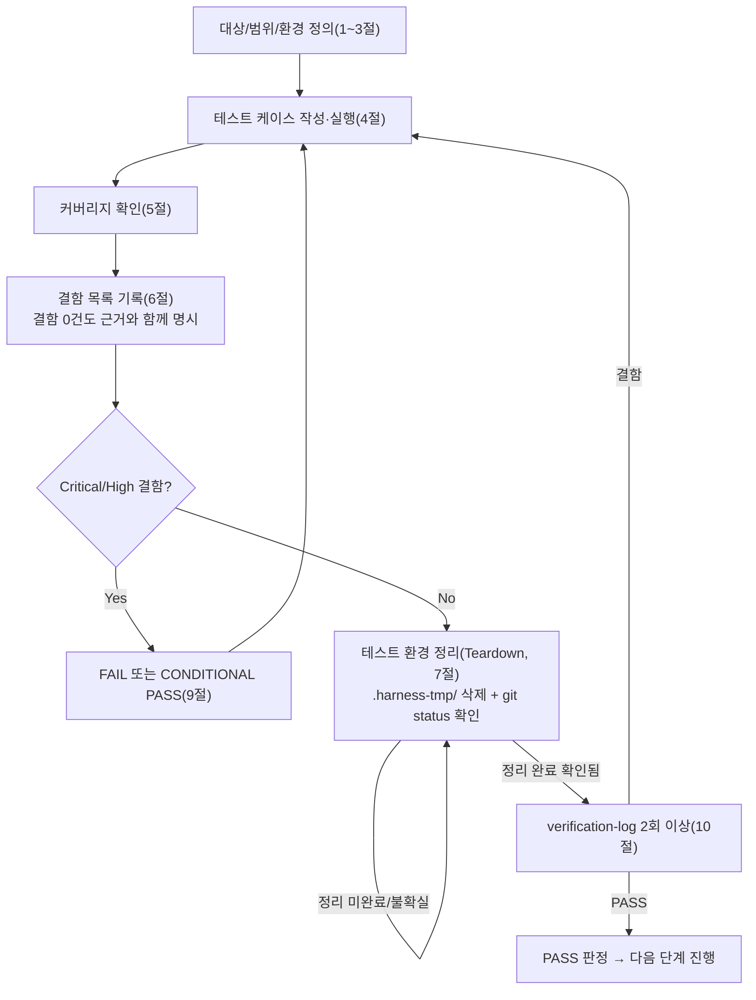

# 테스트 결과서 (Test Result Report) — unit-23 (v1 CONDITIONAL PASS 원문 + 11절 v2 재검증)

> **현재 유효 판정은 11절(재검증 2회차, 2026-09-29): PASS** (DEF-023-01 Fixed 검증, 신규 결함 0건, 134 TC + 스트레스 3, ratelimit.py 라인+분기 100%). 1~10절은 v1(CONDITIONAL PASS 70/71, DEF-023-01 Open) 원문 보존본이며 11절이 자기완결적으로 전체를 재검증한다.

## 1. 개요
- 테스트 대상: `webapp/converter/ratelimit.py`(IP 시간당 20회 + 동시 진행중 2건 레이트리밋 데코레이터), `webapp/converter/views.py`의 삽입 지점(`from . import ... ratelimit ...` + `@ratelimit.enforce_rate_limit` 1줄), 신뢰 IP 공급원 `webapp/config/middleware.py::XForwardedForMiddleware`(읽기·실측만) — REQ-026, unit-23
- 테스트 유형: 단위 (보안 관점 확장: 위조·경쟁·장애 주입 포함)
- 적용 Tier: Standard (규칙 B 최소 2회)
- 적용 속도 트랙: L3 (표기 없음 → 05-note가 L3로 간주, 06도 동일)
- 병렬 실행 정보: 병렬 웨이브 아님(단독 호출)이나 unit-9 검증이 별도 진행 중. 파일·포트·DB 무충돌(서버 포트 미사용 — Django 테스트 `Client`로 미들웨어 스택+URL 라우팅 전체 통과, DB/미디어는 `.harness-tmp/*_06_unit23` 고유 경로). `webapp/core/net_guard.py`·`webapp/config/wsgi.py`·`traceability.md`·`decisions.md`는 읽기/수정 모두 하지 않음(wsgi를 import하는 `runserver`를 쓰지 않은 이유이기도 함).
- 테스트 목적: unit-23-note.md의 AC-1~AC-8이 실제 코드로 증명되는지, 그리고 보안 관점 요청사항(경계값·XFF 위조·동시성 원자성·슬롯 누수·타 엔드포인트 무간섭·CSRF/검증 순서·캐시 장애 시 방향)을 실측
- 관련 산출물: `docs/harness/units/unit-23-note.md`, `03-system-design.md` §1-3/§6-4, DEC-032/DEC-036, `04-ux-design.md` §1-2/§7
- 테스트 수행자(에이전트): 06-unit-tester
- 테스트 일시: 2026-09-29

## 2. 테스트 범위 및 제외 범위
- 범위(In-Scope): `ratelimit.py` 전 함수(`is_upload_rate_limited`/`is_concurrent_limit_exceeded`/`_track_submitted_job`/`enforce_rate_limit`) 전 분기, 데코레이터 순서(`require_http_methods` → `enforce_rate_limit` → `convert`), 실제 `executor._run`을 동기 호출해 FAILED/DONE 전이에 따른 슬롯 반환, `cleanup._sweep_expired_jobs`(unit-22)와의 접점, production 형 `MIDDLEWARE`(XFF 미들웨어 선두)에서의 IP 판정
- 제외 범위(Out-of-Scope) 및 사유:
  - 실제 Render 엣지가 붙이는 `X-Forwarded-For` 형태·홉 수 — 배포 후(10~12단계) 실측 대상. 본 단위는 "rightmost 채택" 로직만 검증
  - 실제 gunicorn `--workers 1 --threads 4` 프로세스 기동 — 스레드 경쟁은 Django `Client` 다중 스레드로 재현(동일 프로세스·동일 LocMemCache·동일 뷰 경로). gunicorn 자체는 미기동
  - 실제 변환(`pdf_to_hwpx` 코어)·R2/Neon — `executor.convert`를 대체(스텁)하거나 로컬 FileSystemStorage/SQLite 사용
  - `executor.py`(unit-21)는 수정 금지 → 읽기·호출만

## 3. 테스트 환경
- 실행 환경: Windows 10 Pro, Python 3.11.9, 격리 venv `.harness-tmp/venv_06_unit23/`(`requirements.txt` + `pip install -e .` + `coverage`; cp949 로케일에서 requirements 한글 주석 때문에 `PYTHONUTF8=1` 필요했음 — 8절 참고), Django 5.2.17, Pillow 11.3.0, `config.settings.dev`(SQLite 파일 `.harness-tmp/db_06_unit23.sqlite3`, `MEDIA_ROOT`를 `.harness-tmp/media_06_unit23`로 override) / production 설정은 서브프로세스로 별도 로드(더미 env, 인프라 미접속)
- 테스트 데이터: 최소 PDF 헤더 바이트의 `SimpleUploadedFile`, `Client(REMOTE_ADDR=...)`로 IP 지정, `cache._expire_info` 조작으로 시계 전진(+ 창을 2초로 줄인 실시간 만료 대조)
- 전제 조건 확인(5단계 게이트, 규칙: 확인 안 되면 반려):
  - 게이트1(정적분석): note 3절 — 레포에 ruff/flake8/mypy 설정 자체가 없음을 재확인했다고 기록 + `py_compile` 통과. 본 06에서도 `find`로 설정 부재는 unit-19~21 note와 동일 결론이므로 신뢰, 대신 실제 실행(아래 71 TC + 분기 커버리지 100%)으로 대체 확인
  - 게이트2(자체 코드 리뷰 체크리스트): note 5절 6항목 전부 `[x]` 표기 확인
  - `git`상 `ratelimit.py`·`views.py` 삽입은 이미 커밋된 상태(`git status`에 미추적으로 안 보임)이며 `views.py` 63행 `@ratelimit.enforce_rate_limit`이 `@require_http_methods(["POST"])` 바로 아래 존재함을 직접 확인

## 4. 테스트 케이스 및 결과
(총 71건. 실행 스크립트는 삭제 전 3회 반복 실행: 1회차는 스크립트 결함 발견용(아래 10절), 2·3회차는 수정 스크립트로 71건 중 70 PASS / 1 FAIL(TC-903)로 동일 재현. 표의 "예상"은 note AC·03 §6-4·04 §1-2/§7 문구에서 직접 도출.)

### 4-1. AC 추적 매트릭스 (커버리지 100% 증명)
| AC | 내용 | 대응 TC | 결과 |
|----|------|---------|------|
| AC-1 | 21회째 429 + 확정 문구, 1~20 미차단, 성공/실패 무관 카운트 | TC-101~108, 109, 605 | PASS |
| AC-2 | 윈도우 리셋 | TC-201~205, 806 | PASS |
| AC-3 | IP 격리 | TC-301, 302, 701~705 | PASS |
| AC-4 | 동시 2건 초과 시 3번째 429, 부수효과 없음 | TC-401, 402, 403 (+경쟁 상황 TC-903 FAIL, 6절) | 순차 PASS / 병렬 FAIL |
| AC-5 | 동시 한도 해제(DONE/FAILED) | TC-404~407, 410~415 | PASS |
| AC-6 | 정상 경로 무간섭 | TC-110~114, 401, 417-* | PASS |
| AC-7 | XFF 위조 방어(production 설정 한정) | TC-700~713 | PASS |
| AC-8 | 캡차 미구현 | TC-801b | PASS |

### 4-2. 케이스 상세
| ID | 시나리오 | 사전조건 | 실행 절차 | 예상 결과 | 실제 결과 | Pass/Fail | 비고 |
|----|----------|----------|-----------|-----------|-----------|-----------|------|
| TC-101 | AC1 1~20번째 통과 | 신규 IP, submit_job=즉시 DONE 스텁(동시한도 비간섭) | 동일 IP 21회 POST | 앞 20회 202 | 202 x20 | PASS | 정상 경로 |
| TC-102 | AC1 21번째 차단 | 위와 동일 | 21번째 | 429 | 429 | PASS | 경계값 |
| TC-103 | 429 본문이 UX 문서와 일치 | 위와 동일 | 22번째 본문 파싱 | `{"error": "요청이 제한되었습니다. 시간당 업로드 횟수를 초과했거나 이미 진행 중인 작업이 있습니다. 잠시 후 다시 시도해주세요"}` | 완전 일치 | PASS | 04 §1-2/§7 |
| TC-104 | 429 Content-Type | 위와 동일 | 헤더 확인 | application/json | application/json | PASS | |
| TC-105 | Retry-After 헤더 | 위와 동일 | 헤더 확인 | (설계 미정의) 관찰 | **없음** | PASS(관찰) | 8절 리스크: 권고사항 |
| TC-106 | 차단 유지 | 위와 동일 | 22번째 | 429 | 429 | PASS | |
| TC-107 | 429는 부수효과 없음 | 위와 동일 | ConversionJob 수 | 20 | 20 | PASS | |
| TC-108 | 19→20→21번째 경계 | 신규 IP | 19회 후 20번째, 21번째 | (202, 429) | (202, 429) | PASS | 경계값 정밀 |
| TC-109 | 성공/실패 무관 카운트 | 신규 IP | 파일 없는 POST(400) x20 후 정상 POST | 400 x20, 21번째 429 | 동일 | PASS | 예외입력, AC1 |
| TC-110 | 통과 시 원 뷰 응답 유지(400 비PDF) | 신규 IP | text/plain 업로드 | 400 + 원 문구 | 동일 | PASS | AC6 |
| TC-111 | 400 파일 없음 | 신규 IP | 빈 POST | 400 + "파일이 없습니다." | 동일 | PASS | AC6 |
| TC-112 | 503 큐 포화 pass-through | submit_job=QueueFullError | POST | 503 | 503 | PASS | AC6 |
| TC-113 | 503은 추적목록 미등록 | 위 직후 | 캐시 조회 | None | None | PASS | 202만 추적 |
| TC-114 | GET /convert=405, 카운터 불변 | TC-110~112 후(시도 3건) | GET | 405, 카운터 3 | (405, 3) | PASS | 데코레이터 순서(메서드 검사가 바깥) |
| TC-201 | AC2 3599s 경과 | 21회 소진 후 시계 전진 | POST | 429 | 429 | PASS | 경계값 |
| TC-202 | AC2 3601s 경과 | 위 +2s | POST | 202 | 202 | PASS | |
| TC-203 | 새 윈도우 20회 | 위 이후 | 19회 추가, 1회 추가 | 19x202 후 429 | 동일 | PASS | 복구 후 재제한 |
| TC-204 | 실시간 만료 | 창=2초로 축소 | 20회+21번째, 2.3초 대기 후 | (429, 202) | (429, 202) | PASS | 시계 조작과 독립된 대조 |
| TC-205 | 429 폭주가 만료시각 연장 안 함 | 21회 소진 | 50회 추가 후 `_expire_info` 비교 | 동일 | 동일 | PASS | 고정 윈도우 확인 |
| TC-301 | AC3 시간당 IP 격리 | A 소진 | B 요청 / A 요청 | B 202, A 429 | 동일 | PASS | |
| TC-302 | AC3 동시한도 IP 격리 | submit_job=no-op | A 3회, B 1회 | A: 202,202,429 / B 202 | 동일 | PASS | |
| TC-401 | AC4 3번째 429 | 진행중 2건 | 3번째 POST | 429 + 문구 | 동일 | PASS | |
| TC-402 | AC4 부수효과 없음 | 위 직후 | Job 행 수·업로드 파일 수 비교 | 변화 없음 | 변화 없음 | PASS | 뷰 미호출 증명 |
| TC-403 | PROCESSING 포함 | 1건 PROCESSING | POST | 429 | 429 | PASS | |
| TC-404 | AC5 DONE 즉시 해제 | 1건 DONE | POST | 202 | 202 | PASS | |
| TC-405 | 재포화 | 위 직후 | POST | 429 | 429 | PASS | |
| TC-406 | AC5 FAILED 해제 | PENDING→FAILED | POST | 202 | 202 | PASS | |
| TC-407 | EXPIRED 제외 | 전체 EXPIRED | POST | 202 | 202 | PASS | |
| TC-410 | 실제 `executor._run`: convert 예외 | submit_job→`_run` 동기, convert=raise | 같은 IP 3회 | 전부 202, 행 FAILED | 동일 | PASS | 슬롯 누수 없음 |
| TC-411 | 변환 실패 결과(`success=False`) | convert→실패 결과 | 3회 | 202, 행 DONE | 동일 | PASS | |
| TC-412 | 스토리지 다운로드 예외 | storage 스텁 raise | 3회 | 202, 행 FAILED | 동일 | PASS | |
| TC-413 | 좀비 PENDING(워커가 안 돌린 job) 2건 | submit_job no-op | 3번째 | 429 | 429 | PASS | 설계상 정상 |
| TC-414 | 좀비여도 잠금 상한 60분 | 위 + 시계 3601s | POST | 202 | 202 | PASS | 추적목록 TTL로 영구잠금 없음 |
| TC-415 | unit-22 스윕과의 접점 | 좀비 2건 created_at=61분 전 | `_sweep_expired_jobs()` 후 POST | (2건 EXPIRED, 202) | (2, 202) | PASS | |
| TC-416 | 추적목록 상한 50 | 60건 등록 | 목록 조회 | 길이 50, 최신 유지 | 동일 | PASS | |
| TC-417-garbage/list/scalar/nojob | 202 본문이 비정상 JSON | 데코레이터에 스텁 뷰 | 각 본문 | 예외 없이 202 | 202 x4 | PASS | 예외처리 분기 |
| TC-700 | 통제 실험: XFF 미들웨어가 실제 적용됨 | production형 MIDDLEWARE, **새 Client** | XFF `5.5.5.5, 203.0.113.200` | 카운터는 rightmost 키에, 프록시IP 키는 없음 | (1, None) | PASS | 1회차 스크립트 결함 재발 방지용(10절) |
| TC-701 | AC7 leftmost 21종 위조 | 위와 동일 | rightmost 고정, leftmost 변경 x21 | 21번째 429 | 20x202 후 429 | PASS | 우회 불가 |
| TC-702 | AC7 키=rightmost | 위 직후 | 카운터 조회 | 21 | 21 | PASS | |
| TC-703 | 서로 다른 rightmost | 위와 동일 | 21명 각 1회 | 전부 202 | 전부 202 | PASS | 사용자 분리 |
| TC-705 | 타인 IP를 leftmost에 위조 | 위와 동일 | `203.0.113.77, 8.8.8.8` | 피해자 카운터 미증가 | (None, 1) | PASS | 타인 소진 불가 |
| TC-706 | rightmost가 `not-an-ip` | 위와 동일 | 요청 | 그대로 키로 사용(검증 없음) | 1 | PASS(관찰) | 8절 |
| TC-707 | IPv6 rightmost | 위와 동일 | `2001:db8::1` | 카운트 | 1 | PASS | |
| TC-708 | IPv6 대소문자 | 위와 동일 | `2001:DB8::1` | 별개 버킷(정규화 없음) | 1 | PASS(관찰) | 8절 |
| TC-709 | 후행 콤마/공백 | 위와 동일 | `1.2.3.4,` 및 공백 | rightmost 빈값 → 프록시 REMOTE_ADDR 버킷 폴백 | 프록시IP 버킷 2 | PASS(관찰) | 8절 |
| TC-710 | 400자 쓰레기 rightmost | 위와 동일 | 요청 | 크래시 없음 | 202 | PASS | CacheKeyWarning만 |
| TC-711 | XFF 없음 | 위와 동일 | 요청 | REMOTE_ADDR 그대로 | 1 | PASS | |
| TC-712 | dev(미들웨어 없음)에서 XFF 위조 | dev MIDDLEWARE | XFF 7.7.7.i x21 | 헤더 무시 → 21번째 429 | 429 | PASS | dev도 위조 우회 불가 |
| TC-713 | production 설정 실측 | 서브프로세스 `config.settings.production` | `MIDDLEWARE[0]`, CACHES 출력 | XFF 미들웨어 선두, LocMemCache | 동일 | PASS | 03 §6-4/unit-19 설계 일치 |
| TC-501 | 차단 IP의 GET 계열 | 21회 소진 IP | `/`, `/healthz`, `/privacy/`, `/api/jobs/<id>/`, `/download/<id>/`, 미존재 job | 429 없음 | 429 없음 | PASS | |
| TC-502 | GET이 카운터에 영향 | 위 직후 | 카운터 | 21 | 21 | PASS | |
| TC-601 | CSRF 토큰 없음 | `enforce_csrf_checks=True` | POST | 403, 카운터 미증가 | (403, None) | PASS | CSRF가 데코레이터보다 선행 |
| TC-602 | CSRF 유효 | 위 + 토큰 | POST | 202, 카운터 1 | (202, 1) | PASS | |
| TC-603 | 413(Content-Length 미들웨어) | `CONTENT_LENGTH=52428801` | POST | 413, 카운터 미증가 | (413, None) | PASS | unit-24 접점 |
| TC-604 | 차단 IP + 무효 본문 | 소진 IP | 빈 POST | 429(뷰 검증보다 선행) | 429 | PASS | |
| TC-605 | 동시한도로 차단된 시도의 시간당 가산 | submit_job no-op | 5회 | 카운터 5 | 5 | PASS(관찰) | 8절 |
| TC-801 | REMOTE_ADDR 빈 값 | `REMOTE_ADDR=""` | 25회 | 제한 없음(fail-open) | 25/25 202 | PASS(관찰) | 8절 |
| TC-802 | `cache.incr` 장애 | `ConnectionError` 주입 | POST | 500, Job/파일 미생성 | (500, 0, 0) | PASS(관찰) | 업로드 전 중단 |
| TC-803 | `cache.get` 장애 | 주입 | POST | 500 | 500 | PASS(관찰) | |
| TC-804 | `cache.set` 장애 | 주입 | POST | 500 | 500 | PASS(관찰) | |
| TC-805 | 추적 등록 장애(뷰 통과 후) | `_track_submitted_job` 예외 | POST | 500이지만 Job 행 1건 이미 생성 | (500, 1) | PASS(관찰) | 8절 |
| TC-806 | 캐시 flush/재시작 | 21회 소진 후 `cache.clear()` | POST | 리셋 | 202 | PASS(관찰) | 설계 한계 |
| TC-901 | 카운터 원자성 | 40스레드 동시 POST x15라운드, 동일 IP | 202가 정확히 20, 429가 20, 그 외 상태 없음 | 15라운드 전부 일치 | PASS | `cache.incr` 원자적 |
| TC-902 | 빈 캐시 첫 호출 경합 | 8스레드 x200회 | 최종 카운터 8 | 200회 모두 8 | PASS | 관찰상 lost update 없음(이론상 창 존재, 8절) |
| **TC-903** | **동시 2건 한도의 병렬 경쟁** | submit_job no-op, 같은 IP 4스레드 동시 최초 요청 x10 | 202가 2건을 넘지 않음 | **10라운드 모두 4건 전부 202, PENDING 행 4건** | **FAIL** | 6절 DEF-023-01 |
| TC-904 | 추적목록 lost update | 위와 동일 | 목록 길이 == 202 수 | 10/10 일치(4) | PASS | 이번 실측에선 유실 없음 |
| TC-905 | 버스트 이후 재유입 | 4건 진행중 | 5번째 요청 | 429 | 429 | PASS | 한도 초과분은 사후에라도 차단됨 |
| TC-801b | AC8 캡차 없음 | 전체 grep | `webapp/` 코드·템플릿·설정에서 captcha | 구현 코드 없음 | 히트 1건=`ratelimit.py` 15행 docstring("구현하지 않는다") | PASS | 주석 문구만 존재, 구현 없음 |

## 5. 커버리지
- 커버리지 지표: `coverage run --branch --source=converter.ratelimit` → `converter\ratelimit.py` 56 stmts / 0 miss / 12 branch / 0 partial / **100%** (라인+분기)
- 커버되지 않은 부분과 사유: 없음. 단, 라인 커버리지 100%가 경쟁 조건 부재를 뜻하지는 않는다(TC-903이 그 사례). 분기 커버리지와 별도로 스레드 경합 TC(901~905)를 둔 이유.

## 6. 결함(Defect) 목록
| ID | 설명 | 재현 절차 | 심각도 | 상태 | 조치 내용 |
|----|------|-----------|--------|------|-----------|
| DEF-023-01 | **"동시 진행중 2건" 한도가 병렬 요청에서 우회된다(check-then-act 경쟁).** `enforce_rate_limit`은 `is_concurrent_limit_exceeded()`로 조회한 뒤 뷰 전체(파일 저장·DB insert·submit)를 실행하고 *그 뒤에야* `_track_submitted_job()`으로 등록한다. 등록 전 구간이 길어 같은 IP의 동시 요청들이 모두 "진행중 0건"을 보고 통과한다. 목록 갱신도 `get → append → set` 비원자적이라 이론상 lost update도 가능(TC-904에선 미관측). 결과: gunicorn `--threads 4`(03 §2-1) 기준 한 IP가 동시 최대 4건(설계 2건)을 진행시킬 수 있음. | (1) 빈 캐시, `executor.submit_job`=no-op(job이 PENDING 유지). (2) 같은 `REMOTE_ADDR`로 4스레드가 `threading.Barrier`로 동시에 `POST /convert`. (3) 기대: 202 ≤ 2. 실제: 10/10 라운드에서 202 4건, PENDING 행 4건. (4) 버스트 이후 5번째 요청은 429이므로 *한 번의 버스트당* 초과분이 스레드 수(4)에 상한됨. | **Medium**(보안 DoS 방어 취지는 유지되나 DEC-032 문면 "동시 2건" 위반, 전역 큐 20·시간당 20·풀 2가 2차 방어) | **Open** — 5단계로 반려 요청 | 권고 수정(구현자 판단): 카운터를 뷰 호출 **전에** 예약(슬롯 선점)하고 뷰가 202가 아니면 반환. 단일 프로세스 전제이므로 모듈 전역 `threading.Lock`으로 "조회→예약"을 임계구역화(캐시의 `add`/`incr` 원자 연산으로 in-flight 카운터를 두는 방식도 가능하나 executor 완료 훅이 없어 DB 상태 재조회와 병행 필요). `executor.py`(unit-21) 수정 없이 가능. 수정 후 TC-903 재실행. 원인은 이 단위 내부(다른 단위·공유자원 아님). |

- (그 외 신규 결함 없음. 사소 오탈자 직접 수정 없음 — 소스 무수정.)

## 7. 테스트 환경 정리(Teardown) 확인 — 규칙 K
- 이번 테스트에서 생성한 임시 아티팩트 목록: `.harness-tmp/venv_06_unit23/`, `.harness-tmp/unit23_tests/`(스크립트·실행 로그 3개), `.harness-tmp/db_06_unit23.sqlite3`, `.harness-tmp/media_06_unit23/`(테스트 중 자동 삭제·재생성), `webapp/.coverage`(coverage 부산물)
- 위 아티팩트를 전부 `.harness-tmp/` 하위에서만 생성했는가: **아니오 1건** — `webapp/.coverage`는 `webapp/`에서 coverage를 실행해 생긴 부산물(unit-24 06과 동일 패턴). 발견 즉시 삭제함. `webapp/.dev-media/`는 `MEDIA_ROOT` override로 생성되지 않았음을 `ls`로 확인.
- 정리(삭제) 완료 여부: 완료. `ls -a .harness-tmp` 결과 빈 디렉터리(`.`,`..`만).
- 정리 후 `git status` 실행 결과 (그대로 첨부):
```
On branch PROD_SCH
Changes not staged for commit:
  (use "git add <file>..." to update what will be committed)
  (use "git restore <file>..." to discard changes in working directory)
	modified:   docs/harness/03-system-design.md
	modified:   docs/harness/decisions.md
	modified:   docs/harness/traceability.md
	modified:   docs/harness/units/unit-9-note.md
	modified:   webapp/config/wsgi.py
	modified:   webapp/core/net_guard.py

Untracked files:
  (use "git add <file>..." to include in what will be committed)
	docs/harness/verify-log_unit-9-note.md

no changes added to commit (use "git add" and/or "git commit -a")
```
- 병렬 실행 소유 표기: `docs/harness/03-system-design.md`(수정) — **내 세션 시작 시점 git status에 없던 변경**으로 다른 에이전트(소유 불명, 오케스트레이터 확인 필요) 작업으로 보이며 이 unit은 건드리지 않음. `decisions.md`·`traceability.md`·`unit-9-note.md`·`wsgi.py`·`net_guard.py`·`verify-log_unit-9-note.md` — unit-9 관련(타 단위 소유). **이 unit(23)이 만든 임시 아티팩트·미추적 잔여물은 없음.** (`docs/harness/units/unit-23-test.md`·`verify-log_unit-23-test.md`는 이 명령 이후 작성됨.)
- 이번 테스트 도중 강제 중단(TaskStop 등)이 있었는가: 없음. (venv 최초 생성 시 requirements 한글 주석 때문에 pip 설치가 조용히 실패해 재설치한 것 외 중단 없음.)

## 8. 리스크 및 잔존 이슈
- 이번 테스트로 커버되지 않는 알려진 리스크:
  1. **[설계 한계, 결함 아님] 다중 워커 시 제한 분산**: LocMemCache는 프로세스 로컬. `--workers N`이면 실효 한도가 대략 N배(시간당 20N회, 동시 2N건)로 느슨해지고 워커마다 카운터가 독립. 03 §2-1이 `--workers 1 --threads 4`를 확정, DEC-032가 "단일 워커 전제에서만 정확"을 명시적으로 수용(03 §2-1 캐시 행). 동일 사유로 프로세스 재시작·Render 무료플랜 스핀다운 시 카운터가 소실(TC-806) — 스핀다운 후 재기동은 사실상 리밋 리셋. 이 한계를 넘는 오남용이 관측되면 DEC-032의 "캡차 트리거"가 후속 수단. 그 외 `--threads 4`는 위 DEF-023-01의 직접 원인.
  2. **fail 방향(캐시 장애)**: 캐시 예외는 잡히지 않고 그대로 전파 → 500(TC-802~804), 업로드/Job 미생성이라 **fail-closed(서비스 거부)** 성격. LocMemCache는 프로세스 내부 메모리라 실무상 장애 확률은 매우 낮음(외부 Redis로 바꾸면 재평가 필요). 반면 TC-805(뷰 통과 후 추적 등록만 실패)는 Job 행/업로드 파일이 생성된 채 500이 나가므로 사용자에게는 실패, 서버에는 유령 job이 남음(cleanup TTL 스윕이 60분 후 정리).
  3. **fail-open 경로**: `REMOTE_ADDR`가 빈 문자열이면 제한을 아예 적용하지 않는다(TC-801, `admin_auth.py` 판단 계승). gunicorn이 unix 소켓 등으로 붙어 REMOTE_ADDR이 비는 배포 형태이거나, XFF 미들웨어가 어떤 이유로 빈 값을 세팅하는 상황에서 전체 제한이 무력화됨. Render 표준(TCP)에선 해당 없으나 배포 시 실측 권고.
  4. **IP 판정 한계**: (a) IPv6는 주소 단위 카운트라 /64 단위로 주소를 바꿔가며 우회 가능(주소 회전), (b) 대소문자·표기 정규화 없음(`2001:DB8::1` vs `2001:db8::1` 별개 버킷, TC-708) — 단 rightmost가 클라이언트가 통제할 수 없는 Render 부가값이라는 전제하에서만 현실적 위협이 없음, (c) rightmost 형식 검증 없음(TC-706/710), (d) 후행 콤마 등으로 rightmost가 비면 프록시 IP 공유 버킷으로 폴백(TC-709) — 정상 Render 엣지에서는 발생하지 않으나 발생 시 모든 사용자가 한 버킷을 공유. **Render 엣지가 XFF를 "append"하는지 "overwrite"하는지, 홉 수는 배포 후 실측 필요**(note 7절 1번과 동일, AC-7 실환경 검증은 07·10~12단계로 이관).
  5. **Retry-After 헤더 없음(TC-105)**: 04 §7이 바디·헤더 비의존 설계이므로 결함 아님. 향후 UX 개선 시 `Retry-After: 3600`(시간당) 권고. 또한 동시한도로 차단된 시도도 시간당 카운터를 소모(TC-605)해 정상 사용자가 대기 중 새로고침으로 쿼터를 깎을 수 있음 — 설계 판단 여지.
  6. **고정 윈도우 특성**: 윈도우 경계에서 최대 2배 버스트(20+20)가 가능(고정윈도우 일반 특성, DEC-032 수용).
  7. **좀비 잠금 상한**: 워커 스레드 소실 등으로 PENDING/PROCESSING이 남아도 추적목록 TTL(60분)로 최대 60분 잠금 후 자동 해제(TC-413/414). 영구 잠금 없음.
  8. **환경 특이사항**: 한국어 Windows(cp949)에서 `pip install -r webapp/requirements.txt`가 한글 주석 때문에 `UnicodeDecodeError`로 실패(`PYTHONUTF8=1`로 회피). 배포(Linux/UTF-8)에는 무영향이나 로컬 개발자 온보딩 마찰 — unit-26(requirements 최종본) 담당에 전달 권고.
- 후속 조치가 필요한 항목:
  - DEF-023-01 5단계 재작업 후 TC-903/904/905 재실행(06 재검증).
  - 03-system-design.md가 이번 세션 중 외부에서 수정됨 — 변경 내용이 §6-4/레이트리밋 서술에 영향 있는지 오케스트레이터 확인 권고(본 06의 대조 기준은 세션 시작 시점 내용).
  - 03 §6-4는 429 문구를 "요청이 너무 많습니다. 잠시 후 다시 시도해주세요."로, 04 §1-2/§7은 "요청이 제한되었습니다. 시간당…"으로 적어 **문서 간 문구 불일치**. 구현은 후행·UX 소유 문서인 04를 따랐고 note가 이 선택을 명시. 03 쪽 문구를 04 기준으로 정정하거나 정본 지정 필요(코드 결함 아님).

## 9. 결론 및 판정
- [ ] PASS
- [x] **CONDITIONAL PASS — 조건: DEF-023-01(동시 2건 한도의 병렬 경쟁, Medium) 5단계 수정 및 TC-903 재검증.** 근거: AC-1~AC-8 순차 시나리오와 IP 위조 방어·슬롯 반환·엔드포인트 무간섭·카운터 원자성은 모두 실측 PASS(70/71, 분기 100%)이며 Critical/High 결함은 없음. 그러나 "결함 발견 시 5단계로 되돌린다" 원칙에 따라 Open 결함이 있는 한 07(통합)은 수정 재검증 후 진행하는 것을 권고. 오케스트레이터가 Medium을 수용(리스크 등재)하고 07 진행을 택할 수도 있으나 그 결정은 DEC로 기록해야 함.
- [ ] FAIL

## 10. 내부 검증 (최소 2회, `verification-log-template.md` 사용)
- 1차 검증 결과 요약: AC 8개 전부 1:1 TC 대응 확인(4-1 매트릭스). 자가 재검토에서 **테스트 설계 결함 발견**: XFF 위조 TC-701이 "통과"했으나 통제 실험(TC-700) 추가 결과 Django `Client`가 첫 요청 시 고정한 미들웨어 체인 때문에 `override_settings(MIDDLEWARE=...)`가 반영되지 않았고, 프록시 IP 단일 버킷으로 우연히 429가 난 **거짓 PASS**였음. 새 `Client` 생성으로 수정·통제 실험 추가 후 재실행. AC8 grep은 docstring 문구를 오탐하여 주석 제외 규칙으로 정정.
- 2차 검증 결과 요약: "이 결과를 07로 넘겨도 되는가"를 의심 — 순차 AC만으로는 스레드 경합(gunicorn `--threads 4`)이 검증되지 않았음을 재확인하고 병렬 TC(901~905)를 추가해 DEF-023-01 발견. 카운터 원자성은 이론상 초기화 경합(get 실패→set) 창이 있어 200회 x 8스레드로 재현 시도(미관측, 8절 명시). 하지 않은 것: 실제 gunicorn 기동, 실 Render XFF — 8절 이관.
- 검증 로그 파일 경로: `docs/harness/verify-log_unit-23-test.md`

## 절차 흐름 (참고용 다이어그램)
> 아래 다이어그램은 위 절차를 시각적으로 요약한 참고 자료다. 규칙/조건의 최종 근거는 항상 위 텍스트다.



## 공유 문서 갱신 요청 (오케스트레이터가 반영)
- `traceability.md` REQ-026 / "단위테스트" 컬럼: `unit-23-test(CONDITIONAL PASS, 70/71 TC, ratelimit.py 분기 100%, DEF-023-01 Medium Open — 동시 2건 병렬 경쟁, 5단계 재작업 대기)`
- `traceability.md` REQ-026 / "구현 상태" 컬럼: "구현 완료(unit-23) — 6단계 CONDITIONAL PASS, DEF-023-01 수정 후 재검증 필요"
- `traceability.md` REQ-026 / 비고: "설계 한계 기록: LocMemCache 다중 워커/재시작 시 제한 분산·리셋(DEC-032 수용). 03 §6-4 429 문구와 04 §7 문구 불일치(구현은 04 기준)."
- `decisions.md` 후보: (a) DEF-023-01 수용 여부 결정, (b) 429 문구 정본을 04로 지정, (c) Retry-After 도입 여부(선택).
- 03-system-design.md가 세션 중 외부 변경되었음을 오케스트레이터에 알림(소유 불명).

---

# 11. 재검증(2회차) — v2 재작업(DEF-023-01 종결 검증 + 규칙 F 전체 회귀)

> 위 1~10절은 **v1 결과서(CONDITIONAL PASS 70/71, DEF-023-01 Open)의 원문 보존본**이다. 11절은 05단계 재작업(`unit-23-note.md` 하단 R-1~R-9: 예약 슬롯 + IP 해시 64개 스트라이프 락, `finally` 반환, 예약 TTL 60분, DEC-044)을 06단계가 처음부터 다시 검증한 결과이며 **자기완결적**이다. v1의 71개 케이스 전체를 v2 소스로 재실행했다. **11절의 판정이 이 unit의 현재 유효 판정이다.**

## 11-1. 개요
- 테스트 대상: `webapp/converter/ratelimit.py`(v2, 206행; `views.py`는 v1과 동일하게 데코레이터 1줄만, diff 없음), 신뢰 IP 공급원 `webapp/config/middleware.py::XForwardedForMiddleware`(읽기·실측만) — REQ-026, unit-23
- 테스트 유형: 단위 + 동시성/장애 주입 + 뮤턴트 검증(보안 관점 확장). 실제 HTTP 소켓 경유 스레드풀 서버 재현 포함
- 적용 Tier: Standard (규칙 B 최소 2회) / 속도 트랙 L3 / 재검증 사유: 규칙 F(DEF-023-01 재작업 후 06 전체 재실행, DEC-044)
- 병렬 실행 정보: 병렬 웨이브 아님. 동시에 (1) 오케스트레이터 dev 서버(127.0.0.1:8000, 미접촉·종료 안 함, 종료 후 `netstat`로 계속 LISTENING 확인), (2) unit-9 06 수행 중(`core/net_guard.py`, `config/wsgi.py` 미접촉·**미import** — 아래 3절 참고). 서버 포트는 18231(waitress) 하나만 사용, 시험 종료 후 해제 확인
- 테스트 목적: (1) DEF-023-01 재현 절차 그대로 재실행 + 수정 전(git HEAD 소스) 대조 실험 (2) 슬롯 누수 없음 (3) 락 설계 검증(락 안 느린 작업 없음, 데드락 없음, 다른 IP 무직렬화, 해시 충돌 IP 상호 무침범) (4) v1 71건 전체 회귀 (5) 뮤턴트로 테스트 유효성 증명 (6) 05가 '범위 외'로 남긴 리스크 재확인
- 관련 산출물: `unit-23-note.md`(R-1~R-9), `verify-log_unit-23-note.md`, `03-system-design.md` §2-1·§6-4, DEC-032·044, `04-ux-design.md` §1-2/§7
- 테스트 수행자: 06-unit-tester / 일시: 2026-09-29

## 11-2. 테스트 범위 및 제외 범위
- In-Scope: `ratelimit.py` 전 함수·전 분기(라인+분기 100%), 데코레이터 순서(`require_http_methods` → `enforce_rate_limit` → `convert`), 실제 `executor._run` 스레드풀(블로킹 `convert` 주입)과 실제 `cleanup._sweep_expired_jobs`(unit-22) 연동, production형 `MIDDLEWARE`(XFF 미들웨어 선두) IP 판정, 실제 `config.settings.production` 로드
- Out-of-Scope(결함이 아니라 8절 리스크): 실제 gunicorn 기동 불가(11-3 참고, 07/10단계 권고), 실제 Render 엣지 XFF 형태, 실제 R2/Neon 지연, 다중 워커
- 소스·설계서 무수정(diff 확인). `traceability.md`·`decisions.md` 무수정(하단 "공유 문서 갱신 요청" 사용)

## 11-3. 테스트 환경
- Windows 10 Pro, Python 3.11.9, 격리 venv `.harness-tmp/venv_06_unit23b/`(`requirements.txt` + `pdfplumber/pypdf/lxml/pytesseract/platformdirs`(pyproject 런타임 의존성) + `coverage` + 테스트 전용 `waitress`,`pyflakes`), Django 5.2.17. `pip install -e .`는 하지 않고 `sys.path`로 `pdf_to_hwpx`를 참조(→ `egg-info` 잔여물 없음). cp949 로케일 때문에 `PYTHONUTF8=1` 필요(v1 8절-8과 동일)
- 설정: `config.settings.dev`를 상속한 테스트 설정(SQLite 파일 `.harness-tmp/_06_unit23b/db_06_unit23b_*.sqlite3`, timeout 60s / `MEDIA_ROOT`를 `.harness-tmp/_06_unit23b/media_*`로 override) + production형(`config.middleware.XForwardedForMiddleware`를 MIDDLEWARE 선두에 추가한 설정). 실제 `config.settings.production`은 더미 env로 서브프로세스 로드만(인프라 미접속)
- **`config.wsgi`/`core.net_guard`는 import하지 않았다**: unit-9가 수정 중인 파일이며 `runserver`는 이를 로드한다. 대신 `django.core.wsgi.get_wsgi_application()`을 직접 사용
- **gunicorn 실제 기동 시도와 실패 사유**: 격리 venv에서 `import gunicorn.app.base` → `ModuleNotFoundError: No module named 'fcntl'`(gunicorn은 Windows 미지원). WSL에는 `docker-desktop` 배포판뿐이라 Linux Python 환경이 없고, Docker 이미지 pull/빌드는 `.harness-tmp/` 밖(사용자 Docker 저장소)에 잔여물을 남겨 규칙 K에 위배되어 시도하지 않음. **대체**: `gunicorn --threads 4`와 같은 모델(단일 프로세스·스레드풀 4·WSGI)인 `waitress`(`threads=4`)를 **진짜 TCP 소켓**으로 기동(127.0.0.1:18231), http.client 스레드 다수가 동시에 GET(CSRF 쿠키) → POST(multipart). waitress 기본값이 X-Forwarded-For를 지우는 것을 통제 실험(TC-H00)으로 발견해 `clear_untrusted_proxy_headers=False`로 설정 — 이는 Render→gunicorn 구간에서 XFF가 앱에 도달한다는 전제를 흉내낸 것(03 §6-4 전제, 실제 검증은 10~12단계)
- 시간 조작: `cache._expire_info`(LocMemCache 만료시각)와 `rl.time` 치환(예약 TTL의 monotonic) — 실시간 만료(TC-204)로 별도 대조
- 전제 조건 확인(5단계 게이트):
  - 게이트1(정적분석): note R-4 — 레포에 ruff/flake8/mypy/black 설정 없음. 06에서 직접 재확인: `pyproject.toml`에 lint 설정 없음, `setup.cfg`/`tox.ini`/`.flake8`/`ruff.toml`/`mypy.ini` 파일 없음. 대체로 `py_compile` 통과, `pyflakes ratelimit.py views.py` 경고 0(rc=0)
  - 게이트2(자체 코드 리뷰): note R-6 6항목 `[x]` 확인
  - `git diff HEAD --stat -- webapp/converter/views.py` 변경 없음(데코레이터는 v1부터 커밋된 상태), 변경 소스는 `ratelimit.py` 1개(114행 변경)

## 11-4. 테스트 케이스 및 결과
총 **134건 + 스트레스 3건 = 137건** 실행(`run1`=커버리지 포함, `run2`=새 프로세스 재실행(PYTHONHASHSEED 상이 → 스트라이프 배치 상이), 두 회차 모두 137/137 PASS와 동일 수치). 표의 "예상"은 note AC·R-7·03 §6-4·04 §1-2/§7·DEC-044에서 직접 도출. 429 문구는 코드 리터럴이 아니라 **04 문서 74~76행에서 프로그램으로 추출**해 비교했다.

### 11-4-0. AC 추적 매트릭스
| AC | 내용 | 대응 TC | 결과 |
|----|------|---------|------|
| AC-1 | 21회째 429 + 04 확정 문구, 1~20 미차단, 성공/실패 무관 | TC-101~109, 103b/c, 605 | PASS |
| AC-2 | 윈도우 리셋 | TC-200~205, 806 | PASS |
| AC-3 | IP 격리 | TC-301, 302, 701~705, H03, 903-MULTIIP, K09~K11 | PASS |
| AC-4 | 동시 2건 초과 429, 부수효과 없음 | TC-401~403, 413 (+**병렬 TC-903/903-B**) | PASS |
| AC-5 | 동시한도 해제(DONE/FAILED/EXPIRED) | TC-404~407, 410~415, L10~L12, Z01, H04 | PASS |
| AC-6 | 정상 경로 무간섭 | TC-110~114, L02, L03 | PASS |
| AC-7 | XFF 위조 방어 | TC-700~714, 712(dev), 713, H00 | PASS |
| AC-8 | 캡차 미구현 | TC-801b | PASS |
| **AC-9(신규, R-7)** | 같은 IP 4/16/40 스레드 동시 최초 POST: 202<=2, PENDING<=2, 나머지 429(문구 불변), 행 없음 | TC-903-4T/16T/40T/4T-amp/B/MULTIIP, 904-*, 905, 905b, S-4/16/40, H01-4/16, H02~H04 | PASS |
| R-7 부가 | 예외·4xx·503 후 슬롯 미누수, 데드락/행 없음 | TC-L01~L15, K01~K14 | PASS |

### 11-4-1. DEF-023-01 종결 실험 — 수정 전(HEAD 소스) 대조 (같은 스크립트, 소스만 교체)
재현 절차는 v1과 동일: 빈 캐시, `executor.submit_job`=no-op(job이 PENDING 유지), 같은 `REMOTE_ADDR`, `threading.Barrier`로 동시 최초 POST, 라운드마다 캐시·DB·예약 초기화. 각 스레드는 새 `Client`(미들웨어 체인 고정 문제 재발 방지) + 미들웨어 워밍업 GET 후 출발.

| 케이스 | 수정 전(HEAD `ratelimit.py`) | 수정 후(v2) | 판정 |
|---|---|---|---|
| TC-903-4T: 4스레드 x12라운드 | 202=4 (12/12라운드), PENDING=4 | **202=2 (12/12), PENDING=2**, 기타 코드 없음 | PASS |
| TC-903-16T: 16스레드 x12 | 202=16, PENDING=16 | **202=2, PENDING=2** | PASS |
| TC-903-40T: 40스레드 x12 | 202=20(시간당 한도가 상한), PENDING=20 | **202=2, PENDING=2** | PASS |
| TC-903-4T-amp: 4스레드 x40, `sys.setswitchinterval(1e-6)` | 202=4 (40/40) | **202=2 (40/40)** | PASS |
| TC-903-B: 기존 진행중 1건(추적됨) + 4스레드 x30 | 추가 202=4, PENDING=5 | **추가 202 정확히 1, PENDING=2** (30/30) | PASS |
| TC-903-MULTIIP: 8 IP x 4스레드 동시 | IP마다 202=4 | **IP마다 202=2, 429=2**(서로 침범 없음) | PASS |
| TC-905: 버스트 후 5번째 요청 / TC-905b: 문구 | 429 / 일치 | 429 / **04 문구 완전 일치** | PASS |
| TC-904-*: 추적목록 길이 == 202 수(lost update) 4/16/40T·amp | 일치(미관측) | 일치(0건 불일치) | PASS |
| TC-S-4/16/40: 스트레스(`switchinterval=1e-6`) 4T x300, 16T x100, 40T x60 라운드 | (미실행) | **라운드마다 202==2·PENDING==2, 위반 0/460**, 행(hang) 없음 | PASS |
| TC-H01-4/16: **실제 TCP 소켓 + waitress threads=4**, 같은 IP(XFF rightmost, leftmost 위조) 4/16 클라이언트 x12 | 202=4 / 202=5, PENDING=4 / 5 | **202=2, PENDING=2 (12/12)** | PASS |
| TC-H03: 실제 HTTP 4 IP x 4클라이언트 | IP별 202=1~4 (불일치) | **IP별 202=2, 429=2** | PASS |
| TC-H04: 실제 HTTP + **실제 executor 스레드풀**(convert 블로킹) 12동시 | 202=5(PENDING 3+PROCESSING 2) | **202=2 (PROCESSING 2), 429=10, 완료(DONE) 후 새 요청 202** | PASS |

- **원인 제거 증명**: 수정 전 소스는 위 표의 동시성 케이스에서 전부 FAIL(t_conc 6건 TC-903-4T/16T/40T/4T-amp/B/MULTIIP + 실제 HTTP 4건 H01-4/H01-16/H03/H04 = 10건), 수정 후는 전부 PASS. 원인(조회→등록 사이 구간의 check-then-act)이 예약(뷰 호출 전, 락 안에서 조회+예약 원자적)으로 사라졌음을 스레드 수(4/16/40)·타이밍 증폭·기존 진행 job 유무·다중 IP·실제 소켓 서버 모두에서 확인했다.
- TC-901 의미 변화(결함 아님): v1의 "40스레드 x15라운드 정확히 202=20/429=20"은 v1에서 동시한도가 무력했기 때문에 성립했다. v2에서는 동시 진행 예약이 정상 적용되어 202가 2로 수렴한다. 그래서 **TC-901a**(동시한도만 임시 무력화: 정확히 20/20 x15라운드 — 시간당 카운터의 원자성 재증명)와 **TC-901b**(실제 한도: 202+429=40, 202<=20, 카운터==40, 라운드별 202=2)로 분리했다. 추가로 **TC-901-atomic**: 40스레드에서 시간당 게이트를 통과해 예약을 시도한 요청이 정확히 20건, 카운터 40.

### 11-4-2. 슬롯 누수·이관·해제 (`t_leak`, 24건 전부 PASS)
| ID | 시나리오 | 예상 | 실제 | 결과 |
|---|---|---|---|---|
| TC-L01/L01b | 뷰 예외(저장 단계 RuntimeError) x5 → 500, 이후 정상 요청 | 500 x5, 예약 `{}`, 이후 202,202,429 | 동일 | PASS |
| TC-L02/L02b/L02c | 400(파일없음 x5, 비PDF x3) 후 | 예약 `{}`, 이후 202,202,429 | 동일 | PASS |
| TC-L03/L03b | 503(QueueFull) x4 | 예약 `{}`, 추적목록 None, 이후 202,202,429 | 동일 | PASS |
| TC-L04/L04b | CSRF 403 x4(토큰 없음) / 유효 토큰 | 403, **시간당 카운터 미생성(None)**, 예약 `{}` / 202, 카운터 1 | 동일 | PASS |
| TC-L05 | 413(Content-Length 초과) x3 | 카운터 None, 예약 `{}` | 동일 | PASS |
| TC-L06 | **"다이제스트"류 실패 ①**: 202인데 본문 파싱 불가 x5 | 예외 없이 202, 예약 `{}`, 추적 미등록 | 동일 | PASS(질문 Q1) |
| TC-L07 | **실패 ②**: 승계 중 `_track_submitted_job` 예외(캐시 장애) | 예외 전파(ConnectionError), 예약 `{}`(finally), 락 해제 | 동일 | PASS |
| TC-L08 | 뷰가 BaseException(SystemExit) | 예약 반환 | 예약 `{}` | PASS |
| TC-L09/L09b | 202 직후 job 추적 이관 | 예약 `{}`, 추적목록==[job_id], 진행중 1, 미초과 / 2건 후 초과=True | 동일 | PASS |
| TC-L10 | **실제 `executor._run` 스레드풀**(convert 블로킹): 202,202 → PROCESSING 중 3번째 | 429 → DONE 후 202 | (202,202,[processing x2],429,{done},202) | PASS |
| TC-L11 | 동일, convert가 예외 → FAILED | 429 → FAILED 후 202 | (…,{failed},202) | PASS |
| TC-L12 | unit-22 `_sweep_expired_jobs`: 61분 경과 2건 → EXPIRED | 스윕 2건, 이후 202 | (2,[expired],202) | PASS |
| TC-L13 | 뷰 2개가 매달림(finally 미도달) 동안, TTL 전 | 예약 2 유지, 3번째 429, +3599s에서도 429 | (2,429,429) | PASS |
| TC-L14 | 예약 TTL 경과(+3601s) | **영구 잠금 없음 → 202** | 202 | PASS |
| TC-L15 | 매달렸던 뷰가 뒤늦게 종료 | 예외 없이 202 x2, 예약 `{}`, 추적목록 3건(전부 승계) | ([202,202],{},3) | PASS |
| TC-Z01 | (관찰) 좀비 A(61분 경과)가 신규 등록으로 갱신된 추적목록 때문에 계속 슬롯 점유 → 스윕 후 해제 | (202,202,429,1건 EXPIRED,202) | 동일 | PASS(관찰, 8절) |
| TC-C01/C02 | 빈 IP/빈 job_id 방어 분기(커버리지 보강) | False / no-op | 동일 | PASS |

### 11-4-3. 락 설계 (`t_lock`, 14건 전부 PASS) — 20년차 아키텍트 관점
| ID | 검증 | 근거(실측/소스) | 결과 |
|---|---|---|---|
| TC-K01 | 락 안(전이 호출 포함)에 뷰 실행·`save_uploaded_file`·`submit_job` 호출 없음 | AST 분석: 락 획득 함수 3개(`is_concurrent_limit_exceeded`, `_try_reserve_slot`, `_release_slot`), 락 안 호출 전체 = `cache.get/set`, `ConversionJob.objects.filter().count()`(job_id<=50 IN 1회), `time.monotonic`, `uuid.uuid4`, dict 연산 | PASS |
| TC-K02 | 락 중첩·재진입 없음 → 자기교착/순서 역전 데드락 경로 없음 | 락 획득 함수 3개는 서로·자기 자신을 락 안에서 호출하지 않음(한 번에 락 1개만 획득) | PASS |
| TC-K04 | `view_func` 호출이 `with` 블록 밖 | AST | PASS |
| TC-K05 | 느린 뷰(저장 0.3s) 32요청 하 락 보유시간 | run1 max 0.13ms/p50 0.05ms, run2 max 0.10ms(**< 150ms 기준, 뷰 시간 0.3s와 무관**) | PASS |
| TC-K14 | 추적 50건 + DB IN 조회 포함 락 보유시간(SQLite 로컬, 400회) | p50 0.35~0.72ms, max 3.99~5.77ms(**< 50ms**) | PASS |
| TC-K06 | 서로 다른 16 IP가 느린 뷰(0.3s) 동시 수행 | 전부 202, 최대 지연 0.56s(직렬화 시 4.8s) | PASS |
| TC-K07 | 같은 IP 뷰 2건이 1.0s 진행 중일 때 3번째 요청 | **429가 1ms** 만에 반환(락이 뷰 동안 잡히지 않음) | PASS |
| TC-K08~K10 | 해시 충돌 IP 쌍(같은 스트라이프, 다른 문자열; 예 10.99.0.1/10.99.0.32, stripe 30): A 3회, B 3회 | 각각 (202,202,429). 예약·추적·카운터는 IP 문자열 키라 완전 분리 | PASS |
| TC-K11 | 충돌 IP A,B 동시 각 4스레드 | 각각 202 정확히 2 | PASS |
| TC-K12 | **락 안 DB 지연 0.1s 에뮬레이션**(Neon 왕복 흉내) | 다른 스트라이프 C=113~128ms, 충돌 B=204~213ms(대기만 2배), A=203~215ms. **충돌의 영향 = 대기(직렬화)뿐, 한도 침범 없음** | PASS |
| TC-K13 | 교착 스트레스: 129 IP(스트라이프 충돌 다수) 랜덤 혼합 200스레드 x3라운드 | 전부 join(행 없음), 코드 {202,429}만, IP당 진행 <=2 | PASS |
- 스트라이프 수 64: 임의의 두 IP가 충돌할 확률 1/64. 충돌 시 영향은 락 보유시간(로컬 ms 단위, Neon 원격 DB면 조회 1회 RTT)만큼의 대기이며, 락 안에는 DB 조회 1회 이상이 없다.

### 11-4-4. v1 71건 전체 회귀 (`t_regress` 60건 + `t_xff` 17건 + 기타)
| 그룹 | TC | 예상 → 실제 | 결과 |
|---|---|---|---|
| 시간당 20회 경계 | TC-101(1~20번째 202), 102(21번째 429), 108(19→20→21), 106/107(차단 유지·Job 수 20), 109(400 x20 후 429: 성공/실패 무관 카운트) | 일치 | PASS |
| 429 문구 | TC-103(본문이 04 74~76행 추출문과 완전 일치), **TC-103b(03 §6-4 문구 == 04, DEC-044 정정 확인)**, **TC-103c(app.js 클라이언트 문구 == 04)**, TC-104(application/json), TC-905b, H02(실제 HTTP 본문) | 일치. 03·04·구현·app.js 4곳이 동일 문구 | PASS |
| 뷰 무간섭 | TC-110/111(400 문구 원본), 112/113(503·미추적), 114(GET /convert 405·카운터 불변) | 일치 | PASS |
| 윈도우 | TC-200(윈도우 길이 3600s±5), 201(만료 3초 전 429), 202(1초 후 202), 203(새 윈도우 20회 후 재제한), **204(실시간 2초 창: 429 → 2.4s 후 202)**, 205(429 폭주가 만료시각 불연장), 806(cache.clear 리셋) | 일치 | PASS |
| IP 격리 | TC-301/302 | 일치 | PASS |
| 동시 2건(순차) | TC-401(202,202,429+문구), 402(429 시 Job 수·업로드 파일 수 불변), 403(PROCESSING 포함), 404(DONE 해제), 405(재포화), 406(FAILED), 407(EXPIRED), 413(좀비 2건 429), 414(추적 TTL 경과 후 해제), 415(스윕), 416(추적목록 상한 50·최신 유지), 417-garbage/list/scalar/nojob/badutf8(비정상 202 본문) | 일치 | PASS |
| 실제 executor 동기 | TC-410(convert 예외→FAILED), 411(success=False→DONE), 412(스토리지 예외→FAILED): 3회 모두 202 | 일치 | PASS |
| IP 판정(prod형 미들웨어) | TC-700(통제 실험: 카운터 키=rightmost, 프록시IP 키 없음), 701(leftmost 위조 21종→21번째 429), 702, 703(서로 다른 rightmost 21명 전부 202), **705(피해자 IP를 leftmost에 위조 → 피해자 카운터 None)**, 706~711(관찰), 714(leftmost 바꿔가며 동시 8스레드 → 202 정확히 2) | 일치 | PASS |
| dev 미들웨어 없음 | TC-712a/712/712b: dev에서 XFF 위조 x21 → 헤더 무시, 21번째 429, 키=127.0.0.1 | 일치 | PASS |
| production 설정 실측 | TC-713(실제 `config.settings.production` 서브프로세스: `MIDDLEWARE[0]`=XFF 미들웨어, 캐시=LocMemCache), 713a | 일치 | PASS |
| 타 엔드포인트 | TC-501(차단 IP의 `/`,`/healthz`,`/privacy/`,`/api/jobs/<id>/`,`/download/<id>/`,미존재 job → 429 아님: 200,200,200,200,422,404), 502(GET이 카운터 불변=21) | 일치 | PASS |
| 검증 순서 | TC-601(CSRF 403은 카운터·예약 미소모), 602, 603(413 카운터 미증가), 604(차단 IP+무효본문→429), 605(동시한도 차단 시도의 시간당 카운터 소모=관찰) | 일치 | PASS |
| 장애/방향 | TC-801(REMOTE_ADDR 빈값 fail-open, 예약 미생성), 802/803/804(cache.incr·get·incr+set 장애 → 500 fail-closed, Job/파일 미생성, 예약 `{}`, **락 해제 확인**), 805(추적 등록 장애 → 500·유령 Job 1건·예약 `{}`·락 해제) | 일치(관찰 항목은 8절) | PASS |
| 동시성 | TC-901a/901b/901-atomic, 902(빈 캐시 첫 호출 8스레드 x200: lost update 0) | 일치 | PASS |
| AC-8 | TC-801b: `webapp/` grep captcha 히트 = `ratelimit.py` 15행 docstring("구현하지 않는다") 1건 뿐 | 구현 없음 | PASS |

### 11-4-5. 뮤턴트 검증 (테스트 유효성 증명)
소스를 수정하지 않고 `ratelimit.py`를 문자열 치환한 변형 모듈을 `converter.ratelimit`로 로드해 실행(치환 대상 문자열 1회 일치를 assert). 각 뮤턴트는 아래 테스트가 **실제로 FAIL**해야 유효.

| 뮤턴트 | 제거한 방어 | 실행 스위트 → FAIL한 TC | 판정 |
|---|---|---|---|
| M1 `m1_nolock` | 락 제거(no-op 컨텍스트) | t_conc: **TC-903-4T-amp, TC-903-B** FAIL(평범한 TC-903-4T/16T/40T는 통과 — 후술). t_stress: **3/3 FAIL**(4T 116/300, 16T 45/100, 40T 36/60라운드 위반, 최대 진행 4~6). 실제 HTTP: **TC-H03 FAIL** | 검출됨 |
| M2 `m2_noreserve` | 예약을 저장하지 않음(토큰만 발급) | t_conc: TC-903-4T/16T/40T/4T-amp/B/MULTIIP 6건 FAIL. 실제 HTTP: H01-4/16/H03/H04 FAIL | 검출됨 |
| M3 `m3_noreturn` | 예약 반환(pop) 제거 | t_leak: TC-L01,L01b,L02,L02b,L02c,L03,L03b,L06,L07,L08,L09 FAIL 후 누수된 슬롯으로 429가 되어 스크립트가 KeyError로 중단(=검출). t_regress: 22건 FAIL | 검출됨 |
| M4 `m4_noinherit` | 202 시 추적목록 승계 제거(예약만 반환) | t_leak: TC-L01b,L02c,L03b,L07,L09,L09b,L10,L11,L12,L15,Z01 (11건). t_regress: TC-302 FAIL 후 중단 | 검출됨 |
| M5 `m5_nottl` | 예약 TTL 만료 제거 | t_leak: **TC-L14, TC-L15** FAIL(영구 잠금) | 검출됨 |
| M6 `m6_lockinview` | 뷰 실행 전체를 락 안에서 수행(설계 결함) | t_lock: **TC-K05(락 보유 ≥0.3s), TC-K07(429가 뷰 종료까지 대기)** FAIL. TC-K06은 16 IP의 해시 충돌 여부에 따라 통과/실패가 갈리는 비결정 케이스(1회 FAIL, 1회 PASS) — 결정적 검출기는 K05/K07 | 검출됨 |
| M7 = HEAD | 예약 대신 사후 등록(수정 전 원본) | 11-4-1 표 전체 FAIL | 검출됨 |
| M8 `m8_nofinally` | try/finally 제거(예외 시 반환 안 됨) | t_leak: **TC-L01, L01b, L08** FAIL | 검출됨 |
- **테스트 설계 한계 정직 고지**: 락 제거(M1)는 GIL 때문에 "빈 캐시 최초 요청" 시나리오만으로는 검출되지 않는다(조회~예약 사이 창이 `cache.get`뿐이라 수 μs). `switchinterval=1e-6` 증폭 또는 락 안 DB 조회가 있는 시나리오(기존 진행 job 1건)에서야 검출된다. 그래서 TC-903-4T-amp, TC-903-B, TC-S-*를 추가했다. 즉 **평범한 4스레드 TC-903 하나만으로는 락의 필요성을 증명하지 못하며**, 회귀 스위트에는 증폭·기존 job 케이스를 반드시 함께 유지해야 한다.

## 11-5. 커버리지
- `coverage run --branch --source=converter.ratelimit`(전 스위트 누적, run1): `converter\ratelimit.py` **103 stmts / 0 miss / 30 branch / 0 partial / 100%**(라인+분기). 1차 실행은 97%(127행 `is_concurrent_limit_exceeded('')`, 162행 `_track_submitted_job` 빈 입력 가드 미커버)였고 TC-C01/C02를 추가해 100%로 올렸다.
- 라인 100%가 경쟁 조건 부재를 뜻하지 않으므로 별도로 스레드 TC(903/S/H/K)와 뮤턴트로 보강(11-4-5).

## 11-6. 결함(Defect) 목록
| ID | 설명 | 재현 절차 | 심각도 | 상태 | 조치 내용 |
|----|------|-----------|--------|------|-----------|
| DEF-023-01 | (v1) 동시 진행중 2건 한도가 병렬 요청에서 우회(check-then-act) | 11-4-1 재현 절차 그대로 | Medium | **Fixed(06 검증 완료)** | 수정 전 소스 대조 실험에서 202=4/16/20(FAIL) → 수정 후 정확히 2(PASS), 스레드 4/16/40·증폭·기존 job·다중 IP·실제 소켓 서버 전부. 뮤턴트 M1/M2/M7로 테스트가 실제 결함을 검출함을 증명 |
- **신규 결함: 0건.** 소스·설계서 직접 수정 없음(사소 오탈자 수정 없음).
- 원인이 이 unit 밖(다른 단위·공유 자원)일 가능성: 없음. 시험 중 관찰한 유령 PENDING(뷰 통과 후 추적 실패, 503 후 PENDING 잔존)은 v1 8절에 이미 기록된 unit-20/21 계약상의 동작이며 이 unit의 결함이 아니다.

## 11-7. 테스트 환경 정리(Teardown) 확인 — 규칙 K
- 생성한 임시 아티팩트: `.harness-tmp/venv_06_unit23b/`, `.harness-tmp/_06_unit23b/`(스크립트·뮤턴트 소스·SQLite DB 다수(`db_06_unit23b_*.sqlite3`)·`media_06_unit23b_*`·`.cov23b`·출력 로그·`__pycache__`). 스크립트/출력 사본은 프로젝트 밖 세션 scratchpad(`...\scratchpad\unit23b_scripts\`)에만 보관(재현용, 저장소와 무관)
- 전부 `.harness-tmp/` 하위에서만 생성했는가: **예**. `COVERAGE_FILE`을 `.harness-tmp/_06_unit23b/.cov23b`로 지정해 `webapp/.coverage`가 생기지 않았고(`find`로 확인), `pip install -e .`를 쓰지 않아 `pdf_to_hwpx.egg-info/`도 없음. `MEDIA_ROOT` override로 `webapp/.dev-media/`에 테스트 파일이 생기지 않았다 — 단 `webapp/.dev-media/`는 **오케스트레이터 dev 서버 소유**(2026-09-29 12:18 생성, 11.8MB PDF, 내 시험 시작 이전이며 내 테스트 PDF는 수십 바이트)로 미접촉
- 정리 완료: `rm -rf .harness-tmp/venv_06_unit23b .harness-tmp/_06_unit23b` 후 `ls -a .harness-tmp` = `run_local.log`, `venv_run_local`(오케스트레이터 소유, 미접촉)만 남음. 포트 18231 해제 확인(`netstat`에 없음), 포트 8000 dev 서버는 시험 전후 계속 LISTENING
- 시험 중 강제 중단: 없음
- 정리 후 `git status`(원문, `git status --short --untracked-files=all`):
```
 M docs/harness/03-system-design.md               (오케스트레이터/타 에이전트 소유 — DEC-044 03 §6-4 문구 정정 등)
 M docs/harness/decisions.md                      (오케스트레이터)
 M docs/harness/traceability.md                   (오케스트레이터/unit-9)
 M docs/harness/units/unit-23-note.md             (unit-23 05 재작업 산출물 R-1~R-9)
 M docs/harness/units/unit-9-note.md              (unit-9)
 M docs/harness/units/unit-9-test.md              (unit-9 06)
 M docs/harness/verify-log_03-system-design.md    (타 에이전트)
 M docs/harness/verify-log_unit-9-test.md         (unit-9 06)
 M webapp/config/wsgi.py                          (unit-9)
 M webapp/converter/ratelimit.py                  (unit-23 05 재작업 — 이 06의 검증 대상, 06은 수정하지 않음)
 M webapp/core/net_guard.py                       (unit-9)
?? docs/harness/units/unit-23-test.md             (이 06 산출물)
?? docs/harness/verify-log_unit-23-note.md        (unit-23 05 산출물)
?? docs/harness/verify-log_unit-23-test.md        (이 06 산출물)
?? docs/harness/verify-log_unit-9-note.md         (unit-9)
?? "작업상태/현재상태_01.png"                       (소유 불명 — 이 시험 도중 새로 나타난 스크린샷, 06이 만들지 않음·미접촉, 오케스트레이터 확인 권고)
```
- 판정: **이 unit(06)이 만든 임시 아티팩트·미추적 잔여물 없음**(위 목록 중 `unit-23-test.md`/`verify-log_unit-23-test.md`는 산출물 자체).

## 11-8. 리스크 및 잔존 이슈 (결함 아님, 근거 포함)
- **실제 gunicorn 미기동(한계)**: Windows에서 gunicorn 실행 불가(`fcntl` 없음) → waitress(threads=4, 실제 소켓)로 대체 재현했다. gunicorn gthread 워커의 스레드 스케줄링·`--timeout` 워커 재시작·Render 프록시 조합은 미검증. **07(통합)/10단계에서 Linux 환경(Render 스테이징 또는 Docker)에서 `gunicorn --workers 1 --threads 4`로 같은 병렬 재현(TC-H01/H04 유형)을 재실행할 것을 권고.**
- 05가 '범위 외 유지'로 남긴 항목 재확인(모두 실측, 결함 아님):
  1. **Retry-After 미도입**(TC-105): 429에 `Retry-After` 없음. 04 §7이 바디·헤더 비의존 설계.
  2. **REMOTE_ADDR 빈 문자열 fail-open**(TC-801): 25/25 202, 예약도 미생성. Render(TCP)에선 해당 없을 것으로 추정, 배포 후 실측.
  3. **IPv6 정규화 없음**(TC-707/708): 대소문자 별개 버킷, /64 주소 회전 우회 가능. rightmost가 클라이언트 통제 불가라는 전제하에서만 현실 위협이 낮음.
  4. **후행 콤마 rightmost 빈값 폴백**(TC-709): 프록시 IP 공유 버킷으로 합쳐짐(정상 Render 엣지에서는 미발생 추정).
  5. **다중 워커 시 한도 느슨**: 락·예약 dict·캐시 모두 프로세스 로컬. `--workers N`이면 실효 한도가 대략 N배. 03 §2-1(`--workers 1 --threads 4`)·DEC-032가 수용. v2 락은 단일 프로세스 전제를 코드 주석으로 명시(ratelimit.py 86~88행).
  6. **동시 한도 차단 시도의 시간당 카운터 소모**(TC-605): 5시도 → 카운터 5. 대기 중 새로고침으로 쿼터를 깎을 수 있음(설계 판단 여지).
  7. 그 외 v1 8절 항목 유지: 캐시 장애 시 500 fail-closed(TC-802~804, **락은 예외에도 해제됨을 이번에 추가 확인**), 추적 등록 장애 시 유령 job(TC-805, 예약은 반환됨), 고정 윈도우 2배 버스트(경계), cp949 requirements 설치 마찰.
- **v2 신규 관찰**(결함 아님, 판단 자료):
  1. **락 안 DB 조회 1회(job_id<=50 IN)**: 로컬 SQLite max 4~6ms. 운영 Neon(원격 Postgres)에서는 RTT만큼 늘어난다. 영향 범위는 **같은 스트라이프(1/64)에 해시 충돌한 IP의 대기**뿐이며 한도 침범은 없다(TC-K08~K12: 락 안 DB 지연 0.1s 에뮬레이션에서 충돌 IP 204~213ms vs 비충돌 113~128ms). Neon 지연이 커질 경우(수백 ms) 스트라이프 수 확대 또는 락 밖 스냅샷+재검증이 후속 개선안. 지금은 조치 불필요.
  2. **좀비 슬롯 점유의 실제 상한**(TC-Z01): 추적목록 TTL(60분)은 같은 IP의 **신규 등록마다 갱신**되므로, 좀비 PENDING 1건이 있고 사용자가 계속 새 job을 올리면 좀비는 추적목록 TTL로는 해제되지 않고 **unit-22 스윕(`created_at` 60분 경과 → EXPIRED)** 이 최종 상한이다(TC-Z01/415에서 스윕 후 즉시 해제 확인). 스윕은 `GET /`(지연 스윕) 트리거이므로 정상 사용 흐름에서는 문제 없으나 v1 8절 7번의 "추적목록 TTL로 최대 60분" 서술은 이 조건에서 부정확했다 — 정정.
  3. **예약이 400 검증 중인 요청에도 슬롯을 점유**한다(같은 IP가 진행 job 1건 + 동시 업로드 2건을 보내면 셋째가 429). 짧은 순간이며 동시 2건 정책과 일치.
  4. 동시 최초 버스트에서 429가 되는 요청은 **시간당 카운터를 소모**한다(TC-605 계열, 40스레드 → 카운터 40). 위 6번과 동일 성격.
- **테스트 자체의 한계**: TC-K12의 DB 지연은 `_in_progress_job_count` 스텁 sleep이며 실제 Neon이 아니다. 뮤턴트 M6의 TC-K06은 비결정(위 표). SQLite 파일 DB를 쓰므로 DB 락 경합은 Postgres와 다르다.
- 발견한 **테스트 설계 오류**(코드 결함 아님, 수정 후 재실행): (1) waitress 기본 동작이 X-Forwarded-For를 제거해 실제 HTTP TC가 전부 단일 IP(127.0.0.1)로 판정됨 → 통제 실험 TC-H00 추가·`clear_untrusted_proxy_headers=False`로 수정, 이전 H01 PASS는 단일 IP 시나리오였음을 인지하고 전부 재실행(TC-H03의 최초 FAIL은 이 오류의 산물이었음) (2) 재현 스크립트의 `reset()`이 HEAD 변형에 없는 `_reservations`를 가정해 크래시 → `getattr` 처리 (3) v1 TC-901 기대(정확히 20/20)를 v2에서 그대로 쓰면 잘못됨 → 901a/901b로 분리 (4) 첫 커버리지 97% → TC-C01/C02 보강 (5) 실제 executor 시험 직후 `reset()`이 풀 스레드가 쓰던 행을 지워 `Save with update_fields did not affect any rows` 로그가 남음 → 라운드 사이 대기 추가(제품 결함 아님, 테스트 정리 타이밍).
- 후속 조치 필요 항목: (a) 07/10단계 Linux gunicorn 재현, (b) Retry-After·IPv6 정규화·fail-open 처분은 09단계 보안 점검에서 사용자에게 수용/완화 질문(임의 수용하지 않음), (c) unit-26(requirements) cp949 마찰 전달.

## 11-9. 결론 및 판정
- [x] **PASS** — 근거: DEF-023-01(Medium)이 수정 전 대조 실험(HEAD: 202=4/16/20, 실제 소켓 서버에서도 4/5)과 수정 후(정확히 2, 460라운드 스트레스 위반 0, 실제 HTTP·실제 executor 풀 포함)로 종결됨. 예약 슬롯 누수 없음(뷰 예외·400/413/503·CSRF 403·BaseException·승계 실패·TTL 만료·매달린 뷰), 락 안 느린 작업 없음(AST + 실측 max 0.13ms/DB포함 5.8ms)·중첩 없음·다른 IP 무직렬화·해시 충돌 IP 무침범, v1 71건 전체 회귀 PASS, 429 문구 03·04·구현·app.js 4곳 일치(DEC-044), 라인+분기 100%, 뮤턴트 8종 전부 검출. 신규 결함 0건, Critical/High/Medium Open 0건.
- [ ] CONDITIONAL PASS
- [ ] FAIL
- 07(통합)로 넘겨도 되는가에 대한 의심 결과: 실제 gunicorn·Neon·Render XFF 미검증이 남았으나 이는 06 범위 밖의 환경 의존 항목이며 8절·후속 조치에 이관했다. 07은 위 (a)를 통합 시나리오에 포함할 것.

## 11-10. 내부 검증 (규칙 B)
- 1차(작성자 자가 재검토): 인수 조건 AC-1~9 전부 1:1 TC 대응(11-4-0). 자가 점검에서 **테스트 설계 오류 5건**(11-8 마지막 항목)을 발견·수정. 특히 실제 HTTP 시험이 단일 IP로 돌고 있던 오류는 통제 실험(TC-H00) 덕에 발견됨 — "PASS가 나왔다고 믿지 않는다"의 사례.
- 2차(독립 심사자 관점 — "이 결과로 07에 넘겨도 되는가"): (i) 모든 TC가 PASS라는 사실 자체를 의심해 **뮤턴트 8종**을 돌렸고, M1(락 제거)이 평범한 TC-903으로는 검출되지 않는 **테스트 설계 허점**을 발견 → 증폭(TC-903-4T-amp)·기존 job(TC-903-B)·스트레스(TC-S)·실제 HTTP(H03)를 추가해 검출 확보. (ii) 새 프로세스로 전체 재실행(run2, 해시 시드가 달라 스트라이프 충돌 쌍이 달라짐) 결과 동일. (iii) M6의 K06 비결정성을 발견해 결정적 검출기(K05/K07)를 명시. (iv) v1 8절-7의 부정확한 서술(추적 TTL이 좀비 상한)을 TC-Z01로 정정.
- 3차(확인): 1·2차 조치 반영 후 run1(커버리지 포함)·run2 두 번 모두 134/134 + 스트레스 3/3 PASS, 새 결함 0건, 검증 로그 「v2 재검증」 절 참조.
- 검증 로그 파일 경로: `docs/harness/verify-log_unit-23-test.md`

## 11-11. 미결 질문 (규칙 A)
- Q1: 호출 지시서의 "다이제스트 실패 뒤 슬롯 반환"의 "다이제스트"가 정확히 무엇을 가리키는지 확인이 필요하다. 코드에는 다이제스트(해시) 연산이 없어 (a) 202 응답 본문 파싱(job_id 추출) 실패(TC-L06), (b) 승계 중 추적 등록(캐시) 실패(TC-L07)로 해석해 검증했다. 다른 의미(예: 업로드 파일 해시)라면 알려달라 — 현재 `ratelimit.py`/`views.py`에는 해당 로직이 없다.
- Q2: `작업상태/현재상태_01.png`(저장소 루트 미추적 파일)의 소유자 확인 — 이번 시험 중 새로 나타났으며 06은 만들지 않았다.
- (그 외 없음. 설계 판단이 필요한 Retry-After/IPv6/fail-open은 09단계 이관.)

## 11-12. 공유 문서 갱신 요청 (직접 수정하지 않음, 오케스트레이터 반영)
| 문서 | REQ-ID/항목 | 컬럼 | 값 |
|---|---|---|---|
| `traceability.md` | REQ-026 | 단위테스트(unit-n-test) | `unit-23-test.md v2 재검증 11절 — PASS (134 TC + 스트레스 3, ratelimit.py 라인+분기 100%, DEF-023-01 Fixed 검증완료: 수정 전 202=4/16/20 → 수정 후 정확히 2, 뮤턴트 8종 검출, 실제 gunicorn 미기동 → 07/10 권고)` |
| `traceability.md` | REQ-026 | 구현 상태 | `구현 완료(unit-23 v2) — 6단계 PASS(재검증), DEF-023-01 Fixed` |
| `traceability.md` | REQ-026 | 비고 | `설계 한계: LocMemCache·락·예약 모두 프로세스 로컬(--workers 1 전제, DEC-032). 03 §6-4 429 문구는 DEC-044로 04 정본에 정정 완료. 범위 외 리스크(Retry-After·IPv6 정규화·REMOTE_ADDR 빈값 fail-open·후행 콤마 폴백)는 09단계 보안 점검에서 수용/완화 질문. 07/10: Linux gunicorn --threads 4 병렬 재현 필요` |
| `decisions.md` | DEC-044 | 이행 기록 | `06 재검증 PASS로 종결: DEF-023-01 Fixed(수정 전 대조 + 뮤턴트 검증). 신규 결함 0. 동시성 회귀 스위트는 증폭(switchinterval)·기존 진행 job 케이스를 반드시 포함할 것(평범한 4스레드 TC만으론 락 제거를 검출 못 함)` |
| `decisions.md` 후보 | (선택) | 락 스트라이프 | Neon 지연이 커지면 락 안 DB 조회를 락 밖 스냅샷+재검증으로 옮기거나 스트라이프 확대 검토(현재 조치 불필요, 근거 TC-K12) |
| `verify-log_unit-23-note.md` 정정 | v1 8절-7 서술 | — | "추적목록 TTL로 좀비 최대 60분 잠금"은 신규 등록으로 TTL이 갱신되는 경우 부정확 — 상한은 unit-22 스윕(TC-Z01) |
