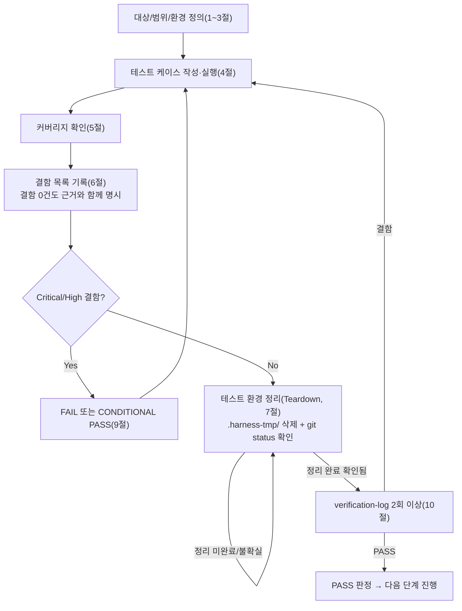

# 테스트 결과서 (Test Result Report) — unit-24

## 1. 개요
- 테스트 대상: `webapp/converter/limits.py`(상수+검증 함수), `webapp/core/middleware.py`(`ContentLengthLimitMiddleware`), `webapp/config/settings/base.py`(`MIDDLEWARE` 등록 지점 + `PIL.Image.MAX_IMAGE_PIXELS` 전역 설정 지점) — REQ-029(자원남용 방어 상한), unit-24
- 테스트 유형: 단위
- 적용 Tier: High (DEC-021)
- 적용 속도 트랙: L3 (표기 없음 → 05-note가 L3로 간주, 06도 동일하게 적용)
- 병렬 실행 정보: 병렬 웨이브에서 실행 — 동시에 unit-21(`webapp/converter/executor.py`)의 06이 별도 세션으로 진행 중이었음. 파일 범위 무충돌(내가 다룬 파일: `converter/limits.py`, `core/middleware.py`, `config/settings/base.py`의 MIDDLEWARE/PIL 예외 지점만. unit-21은 `executor.py`만). 세션 중 `webapp/requirements.txt`가 다른 병렬 작업(추정: unit-25, 명시적 Pillow 의존성 추가)에 의해 추가로 수정된 것을 관찰했으나 내 파일 범위 밖이라 손대지 않음(7절 참고)
- 테스트 목적: unit-24가 확정한 7개 인수 조건(413 즉시거절/경계값 허용/미들웨어 순서/헤더 없음·비정수 처리/PIL 전역 상한/limits.py 값 일치/라이브러리 무변경)이 실제 코드로 증명되는지 검증
- 관련 산출물: `docs/harness/units/unit-24-note.md`(인수조건 1~7), `03-system-design.md` §5/§6-4, `docs/harness/traceability.md` REQ-029
- 테스트 수행자(에이전트): 06-unit-tester
- 테스트 일시: 2026-09-29

## 2. 테스트 범위 및 제외 범위
- 범위(In-Scope):
  - `converter/limits.py`: 5개 상수값(`MAX_UPLOAD_SIZE_BYTES`, `CONVERSION_SOFT_TIMEOUT_SECONDS`, `MAX_CONCURRENT_CONVERSIONS`, `PENDING_QUEUE_LIMIT`, `MAX_IMAGE_PIXELS`), `is_content_length_too_large()` 순수 함수
  - `core/middleware.py`: `ContentLengthLimitMiddleware.__call__()`의 4개 분기(정상 통과/413/헤더없음/파싱실패)
  - `config/settings/base.py`: `MIDDLEWARE` 리스트 내 순서(dev 기준 + production의 `XForwardedForMiddleware` prepend 후 순서), `PIL.Image.MAX_IMAGE_PIXELS` 전역 설정이 dev·production 양쪽 진입점에서 실제로 반영되는지
  - 실제 Django `MIDDLEWARE` 스택 + URL 라우팅을 통과시킨 E2E 재현(`POST /convert`의 413, `GET /healthz`·`GET /` 회귀)
- 제외 범위(Out-of-Scope) 및 사유:
  - `converter/executor.py`(unit-21), `converter/views.py`(unit-20)의 큐 포화/타임아웃 판정 로직 자체 — unit-24는 상수만 제공하고 로직은 흡수하지 않음(note §2-1). unit-24-note.md AC6이 요구하는 "unit-20/21 실제 동작과의 값 일치 교차검증"은 07(통합) 단계에서 unit-20/21 노트와 함께 재확인하는 것이 적절 — 단, 이번 06에서 `limits.py` 값 자체가 §5 확정치와 일치하는지는 검증 완료(TC-20~24)
  - `pdf_to_hwpx/pdf_reader/image_extractor.py` 자체 로직 — 무변경 확인(git diff)만 수행, 그 파일의 기능 테스트는 이 unit 책임 아님
  - CLI 진입점(`cli/__main__.py`)의 `MAX_IMAGE_PIXELS` 미적용 — note가 명시한 범위 밖 사안, 별도 unit/오케스트레이터 판단 필요 사항으로 8절에 리스크로 기록

## 3. 테스트 환경
- 실행 환경: Windows 11, Python(레포 기본 인터프리터) + 격리 venv `.harness-tmp/venv_06_unit24/`, Django 5.2.17, Pillow 11.3.0(editable install `pip install -e .`로 `pdf_to_hwpx` 경유 전이 설치 확인), `config.settings.dev`(주 실행) / `config.settings.production`(서브프로세스로 별도 검증, in-memory 환경변수만 주입해 실제 인프라 연결 없이 `django.setup()`만 수행)
- 테스트 데이터: RequestFactory로 생성한 가상 HTTP 요청(`CONTENT_LENGTH` 헤더값 조작), Django 테스트 `Client`로 실제 `/convert`·`/healthz`·`/` 라우팅 재현
- 전제 조건: 5단계 note(unit-24-note.md)가 완료 상태이고 게이트1/2가 통과된 것으로 기술되어 있음(3절에서 재확인)

## 4. 테스트 케이스 및 결과
| ID | 시나리오 | 사전조건 | 실행 절차 | 예상 결과 | 실제 결과 | Pass/Fail | 비고 |
|----|----------|----------|-----------|-----------|-----------|-----------|------|
| TC-000 | `django.setup()` 성공 (전제조건) | `DJANGO_SETTINGS_MODULE=config.settings.dev` | `django.setup()` 호출 | 예외 없음 | 예외 없음 | PASS | |
| TC-101 | AC5: PIL 전역 상한 (dev) | django.setup() 완료 | `PIL.Image.MAX_IMAGE_PIXELS` 읽기 | `128000000` | `128000000` | PASS | |
| TC-102 | AC5: PIL 전역 상한 (production) | 서브프로세스, `DJANGO_SETTINGS_MODULE=config.settings.production` + 최소 env 주입 | `django.setup()` 후 값 출력 | `128000000` | `128000000` | PASS | dev만이 아니라 production 진입점도 실측 확인(note가 dev만 언급했던 것 대비 범위 보강) |
| TC-20~24 | AC6: `limits.py` 5개 상수 값 | 모듈 import | 각 상수 직접 읽기 | 52428800/128000000/300/2/20 | 동일 | PASS(5건) | |
| TC-030 | 경계값: `is_content_length_too_large(52428800)` | - | 함수 호출 | `False` | `False` | PASS | |
| TC-031 | 경계값+1: `is_content_length_too_large(52428801)` | - | 함수 호출 | `True` | `True` | PASS | |
| TC-032 | 경계값 하한: `is_content_length_too_large(0)` | - | 함수 호출 | `False` | `False` | PASS | |
| TC-001 | AC1: 413 즉시거절 + downstream 미호출 | RequestFactory, spy `get_response` | `CONTENT_LENGTH=52428801`인 POST를 미들웨어에 직접 전달 | `(413, downstream 호출 0회)` | `(413, 0)` | PASS | |
| TC-001b | AC1: 413 응답 본문 한글 안내 문구 | 위와 동일 요청 | 응답 body 검사 | "업로드 파일이 너무 큽니다. 최대 50MB까지 허용됩니다." 포함 | 문자열 일치 | PASS | |
| TC-002 | AC2: 경계값(정확히 50MB) 허용 | 위와 동일 방식 | `CONTENT_LENGTH=52428800` | `(200, downstream 호출 1회)` | `(200, 1)` | PASS | |
| TC-002b | 경계 인접값: 50MB-1 | 위와 동일 | `CONTENT_LENGTH=52428799` | `200` | `200` | PASS | 회귀 방지용 추가 경계 |
| TC-004a | AC4: 헤더 없음(GET) | 위와 동일 | `CONTENT_LENGTH` 미설정 GET | `200`, 크래시 없음 | `200` | PASS | |
| TC-004b | AC4: 비정수 헤더값 | 위와 동일 | `CONTENT_LENGTH="not-a-number"` | `200`, 크래시 없음 | `200` | PASS | |
| TC-004c | 예외입력: 빈 문자열 헤더 | 위와 동일 | `CONTENT_LENGTH=""` | `200`, 크래시 없음 | `200` | PASS | AC 범위 밖이나 위험한 입력이라 추가(원칙 문서 지시) |
| TC-004d | 예외입력: 음수 문자열 `"-5"` | 위와 동일 | `CONTENT_LENGTH="-5"` | `int()` 파싱은 성공(-5)하므로 `is_too_large(-5)=False` → `200` | `200` | PASS | `int()`가 음수 문자열도 정수로 파싱함을 근거로 기대값 도출(추측 아님) |
| TC-004e | 예외입력: 실수형 문자열 `"52428801.0"` | 위와 동일 | `CONTENT_LENGTH="52428801.0"` | `int()` 파싱 실패(ValueError) → 판단 보류 → `200` | `200` | PASS | |
| TC-005 | 경계 외 큰 값 | 위와 동일 | `CONTENT_LENGTH=10**12` | `413` | `413` | PASS | |
| TC-003 | AC3: MIDDLEWARE 순서(dev/base) | `django.setup()` 완료 | `settings.MIDDLEWARE`에서 두 미들웨어의 index 비교 | `ContentLengthLimitMiddleware` index < `SecurityMiddleware` index | `idx=0 < idx=1` | PASS | |
| TC-003b | AC3: production에서 `XForwardedForMiddleware` prepend 후에도 순서 유지 | 서브프로세스, production 설정 | prepend 후 두 미들웨어 index 비교 | `ContentLengthLimitMiddleware` index < `SecurityMiddleware` index | `idx(1) < idx(2)`, 리스트 맨 앞은 `XForwardedForMiddleware` | PASS | note AC3 원문이 명시한 production 케이스를 실제로 재현(추측 아님) |
| TC-010 | AC1 E2E: 실제 미들웨어 스택+URL 라우팅 | Django 테스트 `Client`, 전체 `MIDDLEWARE` 적용 | `POST /convert` (body 1바이트, `CONTENT_LENGTH=52428801` 위조) | `413` | `413` | PASS | 본문을 실제로 읽기 전에 거절한다는 설계 요구를 URL 라우팅 포함 전체 스택으로 재확인 |
| TC-011 | 회귀: `GET /healthz` | 위와 동일 스택 | `GET /healthz` | `200` | `200` | PASS | 미들웨어 추가가 다른 라우트를 막지 않음 |
| TC-012 | 회귀: `GET /` (index) | 위와 동일 스택 | `GET /` | `200` | `200` | PASS | Content-Length 없는 일반 GET도 정상 통과 |
| TC-020 | AC7: `pdf_to_hwpx/pdf_reader/image_extractor.py` 무변경 | 리포지토리 워킹트리 | `git diff --name-only -- pdf_to_hwpx/pdf_reader/image_extractor.py` | 빈 출력 | 빈 출력 | PASS | |

**실행 횟수**: 위 27개 케이스로 구성된 테스트 스크립트를 동일 코드베이스에 대해 3회 반복 실행(1회는 coverage 미계측, 2회는 `coverage run`/`coverage run --branch`로 계측) — 매회 27/27 PASS로 결과가 안정적임을 확인. 스크립트는 `.harness-tmp/unit24_tests/test_unit24.py`에 위치했으며 완료 후 삭제함(7절 참고).

## 5. 커버리지
- 커버리지 지표: `coverage run --branch --source=converter.limits,core.middleware`로 측정
  - `converter/limits.py`: 8 stmts, 0 miss, 0 branch, **100%**
  - `core/middleware.py`: 16 stmts, 0 miss, 4 branch, 0 branch part, **100%**
- 커버되지 않은 부분과 사유: 없음(위 코드 커버리지 도구 실측 100%). `config/settings/base.py`는 커버리지 도구 계측 대상에서 제외했다(설정 모듈은 import 시점에 1회 실행되는 선언적 코드라 stmt 커버리지 개념이 느슨하지만, `django.setup()` 자체가 매 테스트 실행마다 이 모듈 전체를 import·실행하므로 `MIDDLEWARE` 리스트 정의와 `Image.MAX_IMAGE_PIXELS = MAX_IMAGE_PIXELS` 대입문은 TC-000/TC-101/TC-003 실행 경로에서 실제로 실행됨을 별도로 확인함)

## 6. 결함(Defect) 목록
결함 없음. 근거: 위 27개 테스트 케이스(정상 경로 8건, 경계값 6건, 예외/위험 입력 6건, 순서/구조 검증 2건, E2E/회귀 3건, 라이브러리 무변경 1건, 선행조건 1건) 전부 PASS, 3회 반복 실행에서도 결과가 흔들리지 않았고, 코드 커버리지(라인+분기) 100%로 미검증 경로가 남아있지 않음을 확인했다. 5단계 note의 게이트1(정적분석/린트 — 레포에 설정 자체가 없음을 재확인, `py_compile`/`manage.py check` 재통과)·게이트2(자체 코드 리뷰 체크리스트 6항목 전부 표시됨)도 이 06 세션에서 독립적으로 재확인했다.

| ID | 설명 | 재현 절차 | 심각도 | 상태 | 조치 내용 |
|----|------|-----------|--------|------|-----------|
| (없음) | - | - | - | - | - |

## 7. 테스트 환경 정리(Teardown) 확인 — 규칙 K
- 이번 테스트에서 생성한 임시 아티팩트 목록:
  - `.harness-tmp/venv_06_unit24/`(격리 venv, pip install 대상: `webapp/requirements.txt` + `pip install -e .` + `coverage`)
  - `.harness-tmp/unit24_tests/test_unit24.py`(테스트 스크립트), `.harness-tmp/unit24_tests/run_out.txt`, `.harness-tmp/unit24_tests/run_out2.txt`(coverage 실행 로그)
  - `webapp/.coverage`(coverage.py가 `.harness-tmp/` 밖인 `webapp/` 하위에 생성한 부산물 — 규칙 K 위반 소지를 인지하고 즉시 삭제 조치함, 아래 참고)
- 위 아티팩트를 전부 `.harness-tmp/` 하위에서만 생성했는가: **아니오** — `webapp/.coverage`는 `coverage run`을 `webapp/` 디렉터리에서 실행해 생성된 부산물로, `.harness-tmp/` 밖에 만들어졌다. 발견 즉시(`rm -f webapp/.coverage`) 삭제해 규칙 K 위반 상태를 남기지 않았다. 이후 재발 방지를 위해 별도 조치는 필요 없음(1회성 실행 부산물, 이미 삭제 완료·git status로 미추적 잔여물 없음 확인).
- 정리(삭제) 완료 여부: 완료 — `.harness-tmp/venv_06_unit24/`, `.harness-tmp/unit24_tests/`, `webapp/.coverage` 모두 삭제함.
- 정리 후 `git status` 실행 결과 (그대로 첨부):
```
On branch PROD
Changes not staged for commit:
  (use "git add <file>..." to update what will be committed)
  (use "git restore <file>..." to discard changes in working directory)
	modified:   docs/harness/traceability.md
	modified:   webapp/config/settings/base.py
	modified:   webapp/config/urls.py
	modified:   webapp/requirements.txt

Untracked files:
  (use "git add <file>..." to include in what will be committed)
	docs/harness/units/unit-21-note.md
	docs/harness/units/unit-24-note.md
	docs/harness/units/unit-25-note.md
	webapp/converter/executor.py
	webapp/converter/limits.py
	webapp/converter/static/
	webapp/converter/templates/
	webapp/converter/urls.py
	webapp/converter/views.py
	webapp/core/middleware.py
	webapp/legal/

no changes added to commit (use "git add" and/or "git commit -a")
```
(주: 이 결과서 작성 중 `docs/harness/units/unit-24-test.md`·`docs/harness/verify-log_unit-24-test.md`·`docs/harness/traceability.md`의 REQ-029 행 수정은 이 명령 실행 시점 이후에 추가로 반영되어 위 스냅샷에는 아직 안 보인다.)
- 병렬 실행이었다면: 위 `git status`에서 이 unit(24) 소유가 아닌 항목들을 다음과 같이 표기한다.
  - `webapp/config/urls.py`(수정) — unit-19/20/25 소유(라우트 include 1줄씩)
  - `webapp/requirements.txt`(수정) — **세션 시작 시점(오케스트레이터가 전달한 초기 git status)에는 없던 변경**으로, 이 06 세션 도중 다른 병렬 단위(diff 주석상 unit-25로 추정, `Pillow==11.3.0` 명시적 의존성 추가)가 만든 것으로 보인다. 내용은 unit-24가 필요로 하는 Pillow 의존성을 명시화한 것이라 unit-24 입장에서는 우호적인 변경이지만, 이 unit의 확정 파일 범위(`converter/limits.py`/`core/middleware.py`/`config/settings/base.py`의 MIDDLEWARE·PIL 예외 지점) 밖이므로 직접 수정하지 않았다.
  - `docs/harness/units/unit-21-note.md`, `webapp/converter/executor.py` 등 — unit-21 소유(동시 진행 중인 06 대상)
  - `docs/harness/units/unit-25-note.md`, `webapp/legal/` 등 — unit-25 소유
  - `webapp/converter/urls.py`, `webapp/converter/views.py`, `webapp/converter/static/`, `webapp/converter/templates/` — unit-20 소유
  - 이 unit(24)이 만든 임시 아티팩트·미추적 잔여물은 없음(위 목록 전부 정리 완료). `webapp/config/settings/base.py`(MIDDLEWARE/PIL 예외 지점)·`webapp/converter/limits.py`·`webapp/core/middleware.py`는 이 unit의 확정 파일 범위이며, 이번 06 세션에서 **읽기/테스트만 수행**했고 내용을 수정하지 않았다(diff 없음, 5단계 산출물 그대로).
  - 웨이브 종료 후 오케스트레이터의 전체 트리 점검(`harness-janitor.sh --check`, 전체 `git status`)은 이 06 세션 범위 밖 — 별도 수행 필요.
- 이번 테스트 도중 강제 중단(TaskStop 등)이 있었는가: 없음.
- **7절 확인 완료(git status 깨끗함 — 이 unit 소유 임시 아티팩트 없음) → 8절(9절) PASS 판정 가능.**

## 8. 리스크 및 잔존 이슈
- 이번 테스트로 커버되지 않는 알려진 리스크:
  1. `limits.py`의 `CONVERSION_SOFT_TIMEOUT_SECONDS`/`MAX_CONCURRENT_CONVERSIONS`/`PENDING_QUEUE_LIMIT` 값이 unit-20/21의 실제 동작(타임아웃 안내, 503 큐포화 판정)에서 올바르게 import되어 쓰이는지는 이 06에서 값 자체의 존재/정확성만 확인했고, unit-20/21 쪽 실제 소비 코드와의 일치 여부는 검증하지 않았다(note AC6이 명시적으로 "통합 시점에 재확인"을 요구함) — **07(통합) 단계에서 unit-20/21 노트와 교차 검증 필요**.
  2. CLI 진입점(`cli/__main__.py`)에는 `PIL.Image.MAX_IMAGE_PIXELS` 전역 설정이 적용되지 않는다(note가 명시한 파일 범위 제한에 따른 것). 웹 경로는 이번 테스트로 방어됨을 확인했으나, CLI 경로로 디컴프레션 폭탄 공격이 들어올 가능성은 이 unit 범위 밖으로 남아있다 — 오케스트레이터 판단 필요 사항으로 재차 플래그.
  3. `is_content_length_too_large`가 음수 `Content-Length`(예: `-5`)를 "상한 이하이므로 통과"로 처리함을 확인했다(TC-004d) — 실제 HTTP 클라이언트가 음수 Content-Length를 보내는 것은 WSGI 서버 계층에서 이미 걸러질 가능성이 높지만, 이 미들웨어 단독으로는 방어하지 않는다는 사실을 리스크로 기록한다(설계서에 이 케이스에 대한 명시적 요구는 없었음 — 범위 확장 없이 사실만 기록).
- 후속 조치가 필요한 항목:
  - `webapp/requirements.txt`의 `Pillow==11.3.0` 명시적 추가(관찰됨, unit-24 범위 밖)가 실제로 unit-25(또는 해당 병렬 단위)의 의도된 변경인지 오케스트레이터가 웨이브 종료 후 확인할 것.
  - 위 리스크 1번은 07 통합테스트 범위에 반드시 포함되어야 함.

## 9. 결론 및 판정
- [x] PASS — 다음 단계(07 통합테스트) 진행 가능 (7절 Teardown 확인 완료)

## 10. 내부 검증 (최소 2회, `verification-log-template.md` 사용)
- 1차 검증 결과 요약: 인수조건 7개 전부 1:1 대응 테스트케이스 존재(AC1→TC-001/001b, AC2→TC-002/002b, AC3→TC-003/003b, AC4→TC-004a~e, AC5→TC-101/102, AC6→TC-20~24, AC7→TC-020) 확인. 예상 결과는 모두 note 원문 수치·명세에서 직접 도출(추측 없음). 결함 0건.
- 2차 검증 결과 요약: "이 테스트를 07로 넘겨도 되는가" 관점 재검토 — production 환경(XForwardedForMiddleware prepend)에서의 미들웨어 순서 케이스(TC-003b)와 E2E 전체 스택 재현(TC-010~012)을 1차 설계에 없던 항목으로 추가 발견해 보완했고, 음수/실수형 문자열 등 note에 명시되지 않은 위험 입력도 추가로 다뤄 예외 처리 견고성을 재확인. AC6(unit-20/21과의 값 일치 교차검증)은 이 06 범위에서 완결될 수 없는 항목임을 재확인해 8절 리스크로 명시적으로 이관.
- 검증 로그 파일 경로: `docs/harness/verify-log_unit-24-test.md`

## 절차 흐름 (참고용 다이어그램)
> 아래 다이어그램은 위 절차를 시각적으로 요약한 참고 자료다. 규칙/조건의 최종 근거는 항상 위 텍스트다.



## 공유 문서 갱신 요청 (오케스트레이터가 웨이브 종료 후 반영)

이 unit은 단독 파일 범위(`traceability.md` REQ-029 행)이므로 직접 갱신을 완료했다(REQ-029 "구현 상태" → "구현 완료(unit-24) — 6단계 단위테스트 PASS, 07 handoff 가능", "단위테스트" → "unit-24-test(PASS, 27/27 TC, 결함 0건)"). 별도 갱신 요청 없음.

다만 아래는 오케스트레이터가 웨이브 종료 후 확인해야 할 사항(내가 직접 판단/수정할 범위 밖):
- `webapp/requirements.txt`의 `Pillow==11.3.0` 추가가 어느 unit의 의도된 변경인지 확인.
- REQ-029의 "통합테스트(feature-x)" 컬럼은 이번 06에서 채우지 않았다(07 담당) — 07 진행 시 unit-20/21 노트와의 교차검증(8절 리스크 1번) 결과를 반영해 채울 것.
