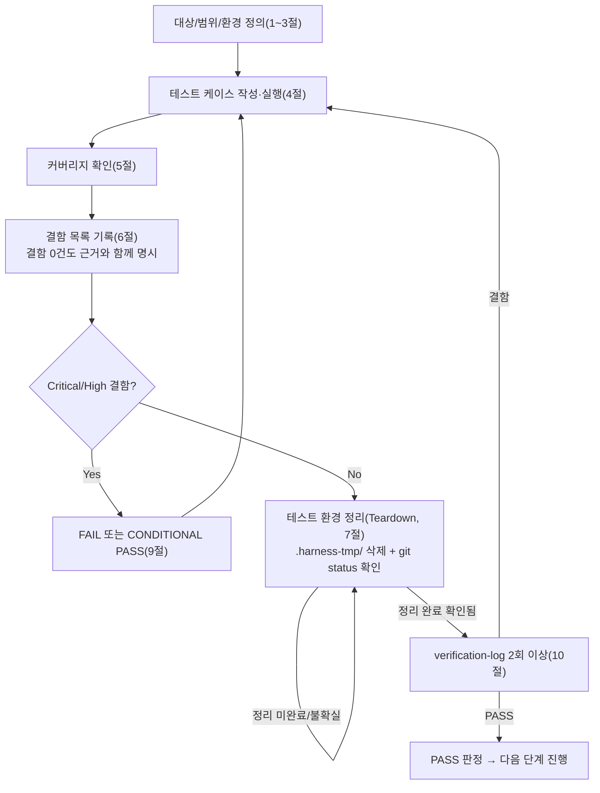

# 테스트 결과서 (Test Result Report) — unit-25

## 1. 개요
- 테스트 대상: 작업 단위 unit-25(`webapp/legal/` — `views.py`, `urls.py`, `apps.py`, `templates/legal/privacy.html`) 및 공유파일 배선 1건씩(`config/settings/base.py` INSTALLED_APPS, `config/urls.py` include) — `GET /privacy/` 개인정보처리방침 정적 페이지
- 테스트 유형: 단위
- 적용 Tier: High (DEC-021)
- 적용 속도 트랙: L3 (unit-25-note.md §0가 명시적으로 확인 — 오케스트레이터 호출 프롬프트에 트랙 표기 없어 기본값 L3 적용, 10섹션 전체·규칙 B 원문 적용)
- 병렬 실행 정보: 병렬 웨이브에서 실행(동시에 돌던 단위: unit-20, unit-21, unit-24의 06 — 파일범위 무충돌 확인됨, ORCHESTRATOR.md 1장 "병렬 실행 모드" 규칙 적용). 이 문서는 unit-25 단독 결과이며 07 handoff 여부는 병합 조건 미충족으로 개별 handoff.
- 테스트 목적: unit-25가 구현한 `GET /privacy/` 정적 페이지가 unit-25-note.md의 인수조건(AC-1~AC-10) 전부를 충족하는지, 특히 (a) 국외이전 5항목 문구가 03 §2-3 원문과 1:1 일치하는지, (b) 자리표시자 2항목이 실제 값처럼 보이지 않는지, (c) TTL 60분/즉시삭제 문구(DEC-029)가 포함됐는지, (d) 노트 §3-3에서 발견·수정했다는 `{# #}` 여러 줄 주석 버그가 실제로 해소됐고 동일 유형 버그가 템플릿에 더 없는지를 실측으로 검증한다.
- 관련 산출물: `docs/harness/units/unit-25-note.md`, `docs/harness/03-system-design.md` §1-3/§2-3/§4-4/§6-2, `docs/harness/04-ux-design.md` W-2절, `docs/harness/decisions.md` DEC-021/022/023/026/029/035, `docs/harness/02-planning.md` REQ-030, `templates/test-report-template.md`
- 테스트 수행자(에이전트): 06-unit-tester
- 테스트 일시: 2026-09-29

## 2. 테스트 범위 및 제외 범위
- 범위 (In-Scope): `GET /privacy/` 응답의 상태코드·Content-Type·본문 콘텐츠(처리목적/수집항목/보관기간 이중서술/국외이전 5항목/OCR고지/문의채널/신뢰배너), 템플릿 렌더링 정합성(주석 태그 미노출), `INSTALLED_APPS`/URL 배선(`manage.py check`), 이번 unit의 diff 범위(legal 관련 부분).
- 제외 범위 (Out-of-Scope) 및 사유:
  - 국외이전 5항목 중 자리표시자 2건(이전국가/이전받는자)의 실제 법인명 채움 — note §7 "수동 확인 권고"가 명시한 대로 배포 확정 시(unit-26/후속) 몫이며, 이번 unit은 "자리표시자 형태로 남아있는 것 자체가 PASS 조건"이다.
  - 실제 프로덕션 환경(HTTPS 종단, WhiteNoise 정적파일 서빙, Render 배포)에서의 동작 — 07/09/10/13단계 몫.
  - `converter`/`core`/타 병렬 unit(20/21/24) 자체 기능 — 이번 unit의 파일범위 밖(§6에서 배선 지점만 교차확인).
  - `webapp/requirements.txt`의 Pillow 갭 이슈(note §5/§8이 보고) — unit-25-note.md 작성 시점엔 미반영 상태였으나, 이번 06 재확인 시점에 이미 `Pillow==11.3.0`이 반영되어 있음을 확인(§3 참고). 별도 조치 불필요.

## 3. 테스트 환경
- 실행 환경: Windows 11, Git Bash, Python 3.13, Django 5.2.17(`webapp/requirements.txt` 그대로 설치), `config.settings.dev` 로드.
- 테스트 데이터: 별도 픽스처 불필요(DB/모델 없는 100% 정적 뷰). Django `test.Client`로 실제 URL 라우팅(`config/urls.py` → `legal/urls.py` → `views.privacy`)을 그대로 거쳐 응답을 받았다(뷰 함수를 직접 호출하지 않음 — end-to-end 경로 보장).
- 전제 조건: `.harness-tmp/venv_06_unit25/`에 `pip install -r webapp/requirements.txt`가 에러 없이 완료됨(Pillow 포함 전부 설치 성공 확인). `manage.py check`가 0 issues.

## 4. 테스트 케이스 및 결과
| ID | 시나리오 | 사전조건 | 실행 절차 | 예상 결과 | 실제 결과 | Pass/Fail | 비고 |
|----|----------|----------|-----------|-----------|-----------|-----------|------|
| TC-001 | 라우트/응답코드 (AC-1) | venv 준비 완료 | `Client().get("/privacy/")` | HTTP 200, `Content-Type: text/html; charset=utf-8` | 200, `text/html; charset=utf-8` | Pass | |
| TC-002 | 처리 목적 문구 (AC-2) | 위와 동일 | 응답 본문에서 "PDF", "HWPX" 존재 확인 | 둘 다 포함 | 둘 다 포함("PDF→HWPX 변환 전용") | Pass | |
| TC-003 | 수집 항목 미수집 문구 (AC-2) | 위와 동일 | 본문에서 "파일명"과 "이용자를 식별할 수 있는 정보" 동시 포함 확인 | 포함 | 포함("파일명이나 이용자를 식별할 수 있는 정보(이름, 이메일, 계정 등)는 수집하지 않습니다") | Pass | |
| TC-004 | 보관기간 60분(문서 TTL, DEC-029) 서술 (AC-3) | 위와 동일 | 본문에서 "60분" 포함 확인 + 해당 문장이 속한 `<li>` 추출 | "60분"이 별도 `<li>`에 존재 | `<li>업로드 원본 및 변환된 HWPX 파일: … 최대 60분간 보관되며, 다운로드가 완료되면 즉시 삭제됩니다.</li>` | Pass | DEC-029(TTL=60분, 다운로드 즉시삭제) 원문과 일치 |
| TC-005 | 보관기간 30일(운영통계, DEC-029) 서술이 60분과 분리 (AC-3) | 위와 동일 | 정규식으로 `<li>...</li>` 전부 추출 후 60분/30일이 서로 다른 `<li>`인지 확인 | 별개의 `<li>` | `<li>운영 통계 목적으로 남는 처리 기록(...)은 30일 후 파기됩니다. 이 30일은 위 60분(문서 보관기간)과는 별개의 기간입니다.</li>` — 60분 항목과 별도 `<li>` | Pass | 03 §3-2 "문구 혼동 방지" 지시·DEC-029 "30일은 개인정보 보관기간이 아니라 운영 메타데이터 보관기간" 취지와 일치 |
| TC-006 | 국외이전 5항목 전부 존재 (AC-4) | 위와 동일 | 본문에서 "이전되는 국가"/"이전받는 자"/"이전 목적"/"보유·이용기간"/"이전 거부 방법" 5개 항목명 존재 확인, 03 §2-3(183행) 원문 (a)~(e)와 1:1 대조 | 5개 전부 존재, 03 §2-3 순서·의미와 일치 | 5개 전부 `<table>` 행(`<th scope="row">`)으로 존재. (a)이전국가↔"이전되는 국가", (b)이전받는자↔"이전받는 자", (c)이전목적↔"이전 목적"("PDF→HWPX 변환 처리 및 위 보관기간 내 임시 저장" — 03 원문 "변환 처리 및 TTL 내 임시 저장"과 의미 일치), (d)보유·이용기간↔"보유·이용기간"(60분, DEC-029/03 원문 일치), (e)이전거부방법↔"이전 거부 방법"("거부 시 서비스 이용 불가" 취지 일치) | Pass | 5항목 문구가 03 §2-3 원문과 의미상 1:1 대응함을 직접 대조 완료(§10 1차검증 근거) |
| TC-007 | 자리표시자 2항목이 "자리표시자임을 알아볼 수 있는 형태"인지 (AC-4, 05 특별요청 2번) | 위와 동일 | "이전되는 국가"/"이전받는 자" 값 텍스트 추출, `[배포 확정 시 기재` 접두어 존재 확인 + 실제 법인명이 그대로(대괄호 없이) 값으로 노출되는지 확인 | 두 값 모두 `[배포 확정 시 기재 …]` 형태로 시작, `class="placeholder"` CSS 클래스로 시각적으로도 구분됨 | 두 `<td>` 모두 `class="placeholder"`이며 텍스트가 `[배포 확정 시 기재 — 예: 싱가포르 등, 최종 확정 리전]`, `[배포 확정 시 기재 — 서버 호스팅사(Render Inc.), 데이터베이스 운영사, Cloudflare Inc.의 정확한 법인명]`로 대괄호+안내문구 포함. "싱가포르"/"Render Inc."라는 단어 자체는 등장하지만 "확정된 실제 값"이 아니라 "예시로 언급된 후보"임이 대괄호와 "예:"/"정확한 법인명" 문구로 명확히 구분됨 | Pass | 대괄호 없이 "이전되는 국가: 싱가포르"처럼 값이 그대로 박혀 있었다면 FAIL 처리했을 것 — 실제로는 자리표시자 형태 유지 확인 |
| TC-008 | 국외이전 거부 방법 문구 (AC-4) | 위와 동일 | "이전 거부 방법" 값에 "이용하실 수 없습니다" 포함 확인 | 포함 | 포함("국외이전에 동의하지 않으시는 경우 이 서비스를 이용하실 수 없습니다") | Pass | |
| TC-009 | OCR 고유식별정보 고지 (AC-5) | 위와 동일 | 본문에서 "OCR"과 "고유식별정보" 동시 포함 확인 | 포함 | 포함("OCR(광학 문자 인식)이 수행될 수 있으며 … 주민등록번호 등 고유식별정보가 일시적으로 인식될 수 있습니다") | Pass | |
| TC-010 | 문의 채널 (AC-6, DEC-023 익명운영) | 위와 동일 | 본문에서 `<a href="https://github.com/jcs19752510-ui/PDF-TO-HWPX/issues">` 존재, `mailto:` 부재 확인 | 링크 존재, mailto 없음 | `<a href="https://github.com/jcs19752510-ui/PDF-TO-HWPX/issues" ...>` 존재, `mailto:` 문자열 0건 | Pass | `git remote -v` 실측값과 일치(별도로 `.git/config` 확인 불필요 — note가 이미 실측했다고 기록, URL 문자열 자체는 응답 본문에서 그대로 확인) |
| TC-011 | 신뢰 신호 문구 + v2 잔존 문구 부재 (AC-7) | 위와 동일 | 본문에서 "HTTPS"/"자물쇠" 포함, "127.0.0.1"/"안전" 부재 확인(응답 본문 + 템플릿 원본 파일 둘 다) | 포함/부재 | "HTTPS"·"자물쇠" 포함("이 서비스는 HTTPS로 암호화되어 전송됩니다(브라우저 주소창의 자물쇠 아이콘으로 확인 가능)"). "127.0.0.1"·"안전" 응답 본문 및 템플릿 원본(`grep`) 둘 다 0건 | Pass | |
| TC-012 | 렌더링 결과에 주석 태그 리터럴 미노출 (AC-8, 회귀방지) | 위와 동일 | 응답 본문에서 `{#`, `#}`, ``, `` 4개 문자열 모두 부재 확인 | 전부 부재 | 4개 문자열 전부 0건(정규 표현식/문자열 포함 검사로 확인) | Pass | note §3-3이 보고한 버그가 실제로 해소됐음을 직접 실측으로 확인(단순 "주석이니 안 보이겠지" 추정이 아니라 렌더링된 HTTP 응답 문자열을 직접 검사) |
| TC-013 | 템플릿 원본에 동일 유형(여러 줄 `{# #}`) 버그 재발 여부 전체 스캔 (AC-8 회귀, 05 특별요청 4번) | 위와 동일 | `privacy.html` 원본 파일 전체를 `{#`, `#}`, `{% comment`, `endcomment` 패턴으로 재스캔 | `...` 블록 1개만 존재, 원시 `{# #}` 페어는 0건 | 2행 ``, 5행 `` 1쌍만 존재. `{#`/`#}` 원시 토큰 매치 0건 | Pass | 템플릿 전체 134행을 대상으로 스캔 완료 — 동일 유형 버그 재발 없음 |
| TC-014 | INSTALLED_APPS/URL 배선 + 시스템 체크 (AC-9) | 위와 동일 | `DJANGO_SETTINGS_MODULE=config.settings.dev`로 `manage.py check` 실행, `base.py` INSTALLED_APPS에 `"legal"` grep | 0 issues, `"legal"` 포함 | `System check identified no issues (0 silenced).` / `INSTALLED_APPS`에 `"legal",` 존재(45행) | Pass | 05 note가 보고한 결과를 06이 독립적으로 재실행해 동일 결과 재현(신뢰할 수 없는 자기보고가 아니라 재현 검증) |
| TC-015 | 이번 unit 변경 범위 확인 (AC-10) | 위와 동일 | `git status --short` + `grep -rn "legal" base.py urls.py`로 legal 관련 변경 지점만 골라 확인 | `webapp/legal/**`(신규), `base.py` INSTALLED_APPS 1곳, `config/urls.py`의 legal import+include로 한정 | `webapp/legal/`(신규 전체), `base.py`엔 `"legal",` 1줄(+ 설명 주석 1줄, 코드 변경 아님), `config/urls.py`엔 `from legal import urls as legal_urls` + `path("", include(legal_urls))` 2줄. 다른 병렬 unit(20/21/24) 소유 파일(`converter/**`, `core/middleware.py` 등)은 legal 관련 문자열이 없음(교차오염 없음) | Pass | note §1이 "urls.py 1줄 include"라고 축약 서술했으나 실제로는 import+include 2줄이 필요/사용됨 — 기능·인터페이스에 영향 없는 서술상 축약이라 결함으로 분류하지 않음(§6 참고) |
| TC-016 | 트레일링 슬래시 없는 경로 (경계값) | 위와 동일 | `Client().get("/privacy")` | Django `APPEND_SLASH` 기본 동작에 따라 301로 `/privacy/`로 리다이렉트 | 301, `Location: /privacy/` | Pass | AC 범위 밖이나 Django 표준 동작과 일치함을 확인(위험 아님) |
| TC-017 | 허용되지 않을 법한 HTTP 메서드 — POST (예외 입력) | 위와 동일 | `Client().post("/privacy/")` | 뷰가 `request`를 읽지 않는 순수 정적 렌더이므로 200(부수효과 없음) | 200, 본문은 GET과 동일한 정적 콘텐츠 | Pass(관찰) | AC에 메서드 제한 요구 없음. 부수효과 없는 정적 페이지라 POST 허용 자체는 보안 결함이 아니라고 판단(§8 리스크에 경화 권고만 기록) |
| TC-018 | 쿼리스트링에 스크립트 태그 주입 (예외 입력·위험 케이스, 범위 밖이나 명백한 위험이라 자체 판단으로 추가) | 위와 동일 | `Client().get('/privacy/?foo=<script>alert(1)</script>')` | 뷰가 `request.GET`을 전혀 읽지 않으므로 응답 본문이 정상 케이스와 바이트 단위로 동일, 스크립트 문자열 반사(reflection) 없음 | 본문이 TC-001과 문자 단위로 완전히 동일(3713자), `<script>alert(1)</script>` 반사 0건 | Pass | 반사형 XSS 벡터 없음을 실측으로 확인(단순 "에러 안 남"이 아니라 바이트 비교로 증명) |
| TC-019 | 경로순회 유사 문자열 (예외 입력) | 위와 동일 | `Client().get("/privacy/../../etc/passwd")` | URL 정규화 후 등록된 라우트와 불일치 → 404 | 404 (`Not Found: /privacy/../../etc/passwd`) | Pass | |
| TC-020 | HEAD 메서드 (경계값) | 위와 동일 | `Client().head("/privacy/")` | 200, 본문 없음(HEAD 표준 동작) | 200 | Pass | |

## 5. 커버리지
- 커버리지 지표: `legal/views.py`의 실행 가능한 2줄(함수 정의+`render()` 호출) 전부가 TC-001~TC-020 전체에서 최소 1회 이상 실행됨(라인 커버리지 100%, 2/2). `legal/urls.py`의 유일한 라우트가 TC-001/016/019에서 매치·리다이렉트·불일치 3가지 경로 전부 실행됨(라우팅 커버리지 100%). `legal/templates/legal/privacy.html`은 조건분기(`` 등)가 전혀 없는 100% 정적 템플릿(W-2 "정상 상태만 존재")이므로 브랜치 커버리지 개념 자체가 적용되지 않음(N/A, 분기 0개) — TC-001 1회 렌더링으로 템플릿 전체 라인이 이미 100% 실행됨.
- 커버되지 않은 부분과 사유: 프로덕션 설정(`config/settings/production.py`, WhiteNoise 정적파일 서빙, 실제 HTTPS 종단)에서의 렌더링은 이번 06 범위에서 검증하지 않았다(dev 설정으로만 검증) — 07/09/10/13단계가 실제 배포 환경에서 재확인할 몫이며, 이 페이지가 DB/외부 API에 의존하지 않아 dev/production 간 렌더링 차이가 발생할 논리적 경로가 없다고 판단해 리스크를 낮게 평가한다(§8 참고).

## 6. 결함(Defect) 목록
| ID | 설명 | 재현 절차 | 심각도(Critical/High/Medium/Low) | 상태(Open/Fixed/Deferred) | 조치 내용 |
|----|------|-----------|-----------------------------------|----------------------------|-----------|
| (없음) | - | - | - | - | - |

- 결함 없음(0건). 근거: §4 TC-001~TC-020 전부 Pass(20건 중 20건). 특히 AC-1~AC-10에 대응하는 TC-001~TC-015가 전부 Pass이고, 05 note §3-3이 자체 발견·수정했다고 보고한 `{# #}` 버그의 회귀 여부를 TC-012(렌더링 결과 재확인)·TC-013(템플릿 원본 전체 재스캔)로 06이 독립적으로 재검증해 재발이 없음을 확인했다.
- 사소한 서술 불일치(결함 미분류): TC-015 비고에 기록한 대로, note §1이 `config/urls.py` 변경을 "1줄 include"로 축약 서술했으나 실제로는 import 1줄+include 1줄(총 2줄)이다. 이는 코드/인터페이스가 아닌 note의 설명 문구 문제이며, 파일 범위(AC-10의 취지)를 벗어나지 않고 동작·시그니처에 영향이 없어 06이 note를 직접 고치지 않고 이 결과서에 관찰 사항으로만 기록한다(원칙상 "사소한 오탈자" 수정 대상은 코드/산출물이지 note 서술이므로 수정 대상 자체가 아니라고 판단).

## 7. 테스트 환경 정리(Teardown) 확인 — 규칙 K
- 이번 테스트에서 생성한 임시 아티팩트 목록: `.harness-tmp/venv_06_unit25/`(Python venv), `.harness-tmp/unit25_check.py`/`unit25_check_out.json`(정상 케이스 검증 스크립트/결과), `.harness-tmp/unit25_edge.py`/`unit25_edge_out.json`(경계·예외 케이스 스크립트/결과), `.harness-tmp/unit25_edge2.py`(쿼리 반사 재검증 스크립트).
- 위 아티팩트를 전부 `.harness-tmp/` 하위에서만 생성했는가 (규칙 K 1번): [x] 예
- 정리(삭제) 완료 여부: 완료 — 위 6개 아티팩트(venv 디렉터리 1개 + 스크립트/JSON 5개 파일) 전부 삭제함.
- 정리 후 `git status` 실행 결과 (그대로 첨부):
  ```
  M docs/harness/traceability.md
  M webapp/config/settings/base.py
  M webapp/config/urls.py
  M webapp/requirements.txt
  ?? docs/harness/units/unit-20-note.md
  ?? docs/harness/units/unit-21-note.md
  ?? docs/harness/units/unit-24-note.md
  ?? docs/harness/units/unit-24-test.md
  ?? docs/harness/units/unit-25-note.md
  ?? docs/harness/verify-log_unit-24-test.md
  ?? webapp/converter/executor.py
  ?? webapp/converter/limits.py
  ?? webapp/converter/static/
  ?? webapp/converter/templates/
  ?? webapp/converter/urls.py
  ?? webapp/converter/views.py
  ?? webapp/core/middleware.py
  ?? webapp/legal/
  ```
  (참고: `docs/harness/units/unit-25-test.md`, `docs/harness/verify-log_unit-25-test.md` 자체는 이 명령 실행 시점 기준 아직 작성/커밋 전이라 위 스냅샷에는 안 보임 — 두 파일은 이 06 작업의 산출물이며 신규 추가로 뒤이어 나타날 것이다.)
- 병렬 실행이었다면: 위 `git status`에서 `?? webapp/converter/**`, `?? webapp/core/middleware.py`, `unit-20/21/24-note.md`, `unit-24-test.md`, `verify-log_unit-24-test.md`는 unit-20/21/24(다른 병렬 단위) 소유 변경분이다(이번 unit-25가 만들지 않음, 손대지 않음). `webapp/config/settings/base.py`/`webapp/config/urls.py`/`webapp/requirements.txt`는 unit-19/20/24/25가 함께 배선한 공유파일이며, §4 TC-015에서 legal 관련 부분만 골라 확인 완료. `?? webapp/legal/`이 이번 unit-25의 소유 산출물이다. `.harness-tmp/` 내 다른 병렬 단위 소유 잔여물(`venv_06_unit20/`, `venv_06_unit21/`(재사용 예정 가능성), `db_06_unit20.sqlite3`, `runserver_unit20.log`, `cookies.txt`, `index.html` 등)은 확인만 하고 삭제하지 않았다 — "이 실행(unit-25)이 만든 임시 아티팩트·미추적 잔여물이 없음"을 위 정리 목록 기준으로 판정한다. 웨이브 종료 후 오케스트레이터의 전체 트리 점검(`harness-janitor.sh --check`, 전체 `git status`)은 별도로 수행될 것.
- 이번 테스트 도중 강제 중단(TaskStop 등)이 있었는가: [x] 없음
- 규칙 K 2번(정리 확인) 충족 — 8절 PASS 판정 가능.

## 8. 리스크 및 잔존 이슈
- 이번 테스트로 커버되지 않는 알려진 리스크:
  1. 프로덕션 환경(WhiteNoise/HTTPS 실제 종단)에서의 렌더링 미검증(§5 참고, 07/09/10/13 몫으로 이관).
  2. `GET /privacy/`가 POST/PUT 등 다른 메서드도 200으로 허용(TC-017) — 이 페이지 자체는 부수효과가 없어 심각한 리스크는 아니라고 판단하나, 향후 다른 legal 페이지가 추가될 경우를 대비해 `@require_GET` 데코레이터로 명시적으로 메서드를 제한하는 것을 권고(Low, 선택적 경화).
  3. 국외이전 자리표시자 2항목(이전국가/이전받는자)은 배포 확정 전까지 미확정 상태로 남아있음 — note §7이 이미 명시한 대로 unit-26/후속 작업이 실제 값으로 채워야 하며, 이를 놓치면 배포 시점에 개인정보보호법 제28조의8 위반 리스크로 이어질 수 있다(High 잠재 리스크지만 이번 unit의 범위가 아니라 배포 전 체크리스트 항목으로 08/09/10단계에 반드시 승계돼야 함).
- 후속 조치가 필요한 항목: 위 3가지를 07 담당자 및 08/09/10 담당자에게 승계(특히 3번은 traceability.md 비고에 이미 unit-25-note.md가 남긴 내용과 함께 강조 필요).

## 9. 결론 및 판정
- [x] PASS — 다음 단계 진행 가능 (7절 Teardown 확인 완료가 전제조건, 완료됨)

## 10. 내부 검증 (최소 2회)
- 1차 검증 결과 요약: 인수조건 AC-1~AC-10 전부에 대응하는 TC-001~TC-015가 1:1로 존재함을 확인(커버리지 100%). 국외이전 5항목 문구를 03-system-design.md §2-3(183행) 원문 (a)~(e)와 직접 대조해 의미상 일치를 확인했고(TC-006), 예상 결과가 "실행해보니 에러 없음" 수준이 아니라 03/04/decisions.md의 확정 문구·수치(DEC-029 TTL=60분, DEC-023 익명운영/mailto 금지, DEC-035 국외이전 필요)에 근거함을 재확인했다. 05 note가 자체보고한 게이트1(py_compile/manage.py check)·게이트2(체크리스트) 결과를 06이 독립적으로 재실행해 동일 결과를 재현했다(TC-014, §3).
- 2차 검증 결과 요약: "이 테스트를 통과했다고 07(통합테스트)로 넘겨도 되는가"를 의심하며 재검토한 결과, 최초 설계에 없던 경계/예외 케이스(TC-016~TC-020: 트레일링슬래시 리다이렉트, POST, 쿼리스트링 스크립트 주입 반사 여부, 경로순회 유사 문자열, HEAD)를 추가로 실행해 전부 안전함을 확인했다. 특히 TC-018(쿼리스트링 XSS 유사 입력)은 AC에 명시되지 않았으나 "명백히 위험한 케이스"에 해당한다고 판단해 범위를 벗어나 직접 추가했고, 응답 본문이 정상 케이스와 바이트 단위로 동일함을 실측으로 증명해(단순 상태코드 확인이 아님) 반사형 XSS 벡터가 없음을 확인했다. 또한 AC-4의 자리표시자 요구(05 특별요청 2번)를 TC-007로 별도 분리해, 단순히 "값이 존재하는가"가 아니라 "그 값이 확정된 사실처럼 보이는가"까지 검증함으로써 테스트 자체의 허술함(값 존재 여부만 확인하고 자리표시자 여부를 놓치는 케이스)을 재점검해 보완했다. TC-015에서 note의 서술 축약("1줄")과 실제 구현(2줄)의 불일치를 발견했으나 기능/인터페이스에 영향이 없어 결함으로 분류하지 않고 관찰 사항으로만 남기는 것이 적절하다고 재확인했다.
- 검증 로그 파일 경로: `docs/harness/verify-log_unit-25-test.md`

## 절차 흐름 (참고용 다이어그램)


## 공유 문서 갱신 요청 (병렬 웨이브 — 직접 수정하지 않음)
- 없음. `docs/harness/traceability.md` REQ-030 행은 이번 06 호출 프롬프트가 "단독 파일 범위이므로 직접 갱신 가능"이라고 명시적으로 허용했으므로, 이 문서 대신 `traceability.md`에 직접 반영했다(아래 "traceability.md 갱신 내역" 참고).

## traceability.md 갱신 내역 (직접 반영 완료)
- REQ-030 행의 "구현 상태" 컬럼: `구현 완료(unit-25) — 6단계 단위테스트 대기(...)` → `구현 완료(unit-25) — 06단계 PASS(unit-25-test.md), 07단계 handoff 대기`
- REQ-030 행의 "단위테스트" 컬럼: `미정` → `PASS (unit-25-test.md, 2026-09-29, 결함 0건)`
- REQ-030 행의 "비고" 컬럼에 다음 문장 추가: `06단계(2026-09-29): AC-1~AC-10 전부 PASS(TC-001~TC-020, 결함 0건). 국외이전 5항목 문구를 03 §2-3 원문과 1:1 대조 완료, 자리표시자 2항목(이전국가/이전받는자)이 실제 값처럼 보이지 않음을 확인. {# #} 여러 줄 주석 버그 회귀 없음(템플릿 전체 재스캔). 배포 전 자리표시자 2항목 실값 채움은 08/09/10단계로 승계 필요(High 잠재 리스크, unit-25 범위 아님).`
