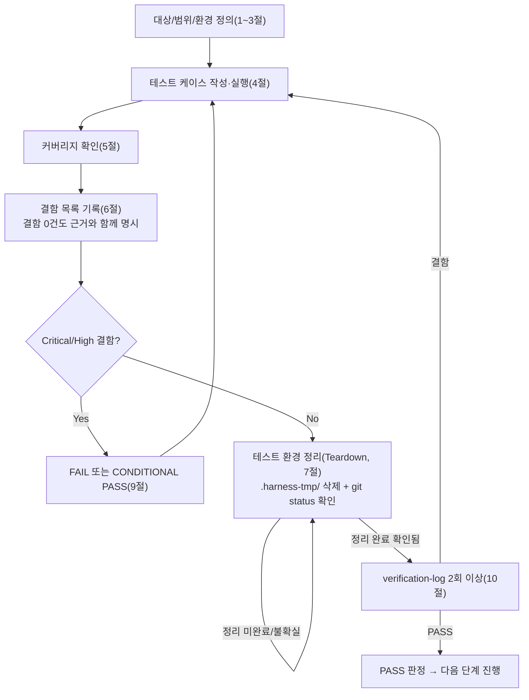

# 테스트 결과서 (Test Result Report) — unit-4

## 1. 개요
- 테스트 대상: `pdf_to_hwpx/hwpx_kernel/container.py`(`build_empty_container`, `add_section_xml`) + `pdf_to_hwpx/hwpx_kernel/schema.py`(`SCHEMA_VERSION`, `pt_to_hwpunit`, `text_block_to_paragraph_fragment`, `table_cell_to_cell_fragment`, `table_block_to_table_fragment`, `image_block_to_picture_fragment`, `fragment_to_bytes`, `build_reference_section_body`) — REQ-008(HWPX 파일 생성, 컨테이너 골격 + IR→XML 프래그먼트 변환 계약)
- 테스트 유형: 단위
- 적용 Tier: Standard
- 적용 속도 트랙: L3(일반) — 본 결과서 1~10절 전 섹션 정식 작성
- 병렬 실행 정보: 병렬 웨이브에서 실행 (동시에 unit-1(text_extractor)/unit-2(image_extractor)/unit-3(table_recognizer)의 06-unit-tester 호출이 진행 중이었음. 파일 범위 완전 분리 — `pdf_to_hwpx/hwpx_kernel/` 및 `tests/hwpx_kernel/`만 다룸 — 충돌 없음)
- 테스트 목적: `docs/harness/units/unit-4-note.md` §7의 인수 조건(AC-1 9개 항목, AC-2 7개 항목)이 실제 코드로 증명되는지 확인하고, unit-5/6/7이 안심하고 이 계약을 소비할 수 있는지 검증
- 관련 산출물: `docs/harness/units/unit-4-note.md`, `docs/harness/03-system-design.md` §1-2/§1-3(unit-4 행)/§2-1/§3-1/§4-2, `docs/harness/decisions.md` DEC-017, `pdf_to_hwpx/pdf_reader/ir.py`, `pdf_to_hwpx/common/exceptions.py`
- 테스트 수행자(에이전트): 06-unit-tester
- 테스트 일시: 2026-09-28

> **재개(resume) 경위**: 이 06 세션 착수 시점에 `tests/hwpx_kernel/test_container.py`, `tests/hwpx_kernel/test_schema.py`(48개 테스트, docstring이 이미 "unit-4-test.md §8"을 언급)가 리포지토리에 이미 존재했고 `.harness-tmp/`에는 잔여물이 없었다. 이는 이전에 이 unit-4에 대한 06 세션이 테스트 코드까지 작성한 뒤 결과서(`unit-4-test.md`) 완성 전에 중단된 것으로 판단된다(unit-4-note.md §6은 "리포지토리에 남기지 않음"이라고 명시했으므로 이 테스트 코드의 저자는 05가 아니라 이전 06 세션임). 이번 세션은 이 잔여 테스트 스위트를 그대로 신뢰하지 않고, 아래 4절/10절 절차에 따라 AC 1:1 커버리지를 독립적으로 재확인하고, 기존 테스트가 놓쳤을 법한 케이스(드라이브 문자, 빈 바이트, 연속 교체, 경로 문자열)를 별도 스크립트로 추가 검증했다.

## 2. 테스트 범위 및 제외 범위
- 범위 (In-Scope):
  - `build_empty_container()`가 만드는 zip 엔트리 8개의 이름/순서/압축 방식/내용이 기대와 정확히 일치하는가.
  - `mimetype`을 제외한 모든 파트가 well-formed XML인가.
  - 실패 경로(쓰기 불가 경로, 손상된 zip, 존재하지 않는 대상)에서 `ContainerBuildError`로 일관되게 변환되는가, 원인 예외가 보존되는가(`raise ... from exc`).
  - `add_section_xml()`의 교체/추가 분기, 실패 시 원본 무결성·임시파일 미잔존.
  - `schema.py` 8개 계약 함수가 IR 입력을 받아 기대하는 태그/네임스페이스/속성을 갖는 `etree._Element`를 반환하는가, 직렬화 결과가 계약(문서선언 유무)과 일치하는가.
  - 경계값(빈 텍스트, 셀 0개, 셀 개수 불일치, 크기 0 이미지, 음수 좌표)과 예외 입력(존재하지 않는 파일, 손상된 zip, 디렉터리 충돌, 존재하지 않는 드라이브).
- 제외 범위 (Out-of-Scope) 및 사유:
  - **실제 한글(한컴오피스) 뷰어에서 열리는지에 대한 호환성 검증** — 개발 환경에 한글이 설치되어 있지 않다는 사실이 사용자에게 이미 확인되었다(DEC-017). 이 06단계도 동일한 환경 제약을 그대로 물려받으며, 이 사실을 결함으로 지어내지 않고 8절 리스크로만 기록한다. 검증 가능한 범위는 "zip 구조·well-formed XML·엔트리 순서/내용이 코드 의도대로 나오는가"까지다.
  - unit-5/6/7/8과의 실제 통합(파이프라인 전체 흐름, 여러 프래그먼트를 실제 표/이미지/텍스트 혼합 문서로 조립) — 07단계(통합 테스트) 범위.
  - BinData(이미지 바이너리 파트) 삽입 기능 — `container.py` 현재 파일 범위에 존재하지 않음(unit-4-note.md §7 AC-2-5 안내 문구, §8 공유 문서 갱신 요청 참고). 없는 기능을 검증할 수 없으므로 제외.
  - `hwpx_kernel/__init__.py`의 stale docstring — unit-4의 확정 파일 범위 밖(container.py/schema.py 아님).
  - 정적 분석/린트 도구 자체의 신규 도입 — 프로젝트에 아직 lint/type-check 설정이 없음(unit-0-note.md 3절, unit-4-note.md §4와 동일 결론, 아래 3절에서 재확인만 함).

  > **[2026-09-28 재작업 세션 주석] 위 "BinData 삽입 기능" 제외 항목은 이후 무효화되었다.** `container.py`에 `add_bin_data()`가 추가되어 이제 이 기능이 존재한다 — 검증 결과는 본 문서 하단 "재작업/추가검증 (2026-09-28)" 섹션 참고. 이 2절 원문은 작성 당시의 사실을 그대로 보존하기 위해 수정하지 않는다.

## 3. 테스트 환경
- 실행 환경: Windows 11 Pro (10.0.26100), Git Bash, Python 3.13.15(요구사항 `>=3.11` 충족)
- 격리 venv: `.harness-tmp/venv_06_unit4/` (다른 병렬 단위의 `venv_06_unit1/2/3`와 이름 충돌 없음) — `pip install -e ".[dev]"`로 `lxml==6.1.3`, `pytest==9.1.1` 설치. 여기에 더해 `tests/conftest.py`(unit-0 소유, 세션 스코프 `pdf_fixtures` 픽스처)가 무조건 `reportlab`을 import하도록 되어 있어(공용 conftest이므로 `tests/hwpx_kernel/`을 수집할 때도 로드됨) 컬렉션 자체가 `ModuleNotFoundError`로 실패했다 — 이 unit이 만든 결함이 아니라 공유 테스트 인프라 의존성이므로, `reportlab`을 이 unit 전용 격리 venv에만 추가 설치해 우회했다(conftest.py 자체는 수정하지 않음, unit-0 소유 파일이라 범위 밖).
- 테스트 데이터: 코드 내 인라인(pytest `tmp_path` 픽스처로 생성한 임시 `.hwpx` 파일), `pdf_to_hwpx.pdf_reader.ir`의 `TextBlockIR`/`TableBlockIR`/`TableCellIR`/`ImageBlockIR`를 한글 텍스트 포함 값으로 직접 생성. 외부 고정 픽스처 파일 없음.
- 전제 조건(Preconditions):
  - 5단계 게이트 재확인: `python -m py_compile pdf_to_hwpx/hwpx_kernel/container.py pdf_to_hwpx/hwpx_kernel/schema.py` — 이 venv에서도 컴파일 성공 재확인. 프로젝트에 `ruff`/`flake8`/`black`/`mypy`/`pylint` 설정 파일이 여전히 없음(루트 `pyproject.toml`·설정파일 검색으로 재확인) — unit-4-note.md §4의 주장과 일치, 5단계로 되돌릴 사유 없음.
  - `unit-4-note.md` §5(자체 코드 리뷰 체크리스트) 6개 항목이 실제 코드와 일치하는지 소스 재대조 완료(에러 처리 경로, 예외 삼킴 없음, 신규 의존성 없음, 범위 외 변경 없음) — 아래 4절 실행 결과로 뒷받침.

## 4. 테스트 케이스 및 결과

### AC-1 (`container.py`) — `build_empty_container`
| ID | 시나리오 | 사전조건 | 실행 절차 | 예상 결과 | 실제 결과 | Pass/Fail | 비고 |
|----|----------|----------|-----------|-----------|-----------|-----------|------|
| TC-101 | 정상 생성 후 표준 zipfile로 재오픈 | 없음(tmp_path) | `build_empty_container(p)` 후 `zipfile.ZipFile(p)`로 열고 `testzip()` | 예외 없음, `testzip() is None` | 예외 없음, `testzip() is None` | PASS | AC-1-1 / `test_build_empty_container_creates_readable_zip` |
| TC-102 | 엔트리 8개·순서 정확히 일치 | 없음 | `namelist()` 비교 | `[mimetype, version.xml, settings.xml, META-INF/container.xml, META-INF/manifest.xml, Contents/header.xml, Contents/section0.xml, Contents/content.hpf]` | 동일 | PASS | AC-1-2 / `test_build_empty_container_namelist_matches_expected_order` |
| TC-103 | mimetype 첫 엔트리·비압축·내용 | 없음 | `infolist()[0]` 확인 | filename=`mimetype`, `compress_type==ZIP_STORED`, 내용=`b"application/hwp+zip"` | 동일 | PASS | AC-1-3 / `test_mimetype_is_first_entry_uncompressed_with_expected_content` |
| TC-104 | mimetype 제외 전체 파트 well-formed XML(루프) | 없음 | 전 엔트리 `etree.fromstring()` | 파싱 에러 없음 | 파싱 에러 없음 | PASS | AC-1-4 / `test_all_non_mimetype_entries_are_well_formed_xml` |
| TC-105 | 파트별 개별 파싱(7개 파라미터화) | 없음 | 파트 1개씩 개별 `fromstring()` | 각각 root localname 존재 | 7/7 PASS(version.xml/settings.xml/META-INF/container.xml/META-INF/manifest.xml/Contents/header.xml/Contents/section0.xml/Contents/content.hpf) | PASS | AC-1-4 보강 / `test_each_xml_part_individually_well_formed[...]` — 루프 테스트가 특정 파트만 조용히 스킵하는 결함을 배제 |
| TC-106 | 존재하지 않는 상위 디렉터리 자동 생성 | 없음 | 5단계 깊이 미존재 경로에 생성 | 생성 성공, namelist 동일 | 성공 | PASS | AC-1-5 / `test_build_empty_container_creates_missing_parent_directories` |
| TC-107 | 쓰기 불가 경로(출력 경로가 이미 디렉터리) → 예외 | 대상 경로에 디렉터리 선생성 | `build_empty_container(blocked_path)` | `ContainerBuildError` | `ContainerBuildError` 발생 | PASS | AC-1-6 / `test_build_empty_container_raises_container_build_error_when_output_is_directory` |
| TC-108 | 예외 체이닝(`raise ... from exc`) | 위와 동일 | `excinfo.value.__cause__` 확인 | `OSError` 인스턴스 | `OSError` 인스턴스 확인됨 | PASS | AC-1-6 보강 / `test_build_empty_container_error_chains_original_oserror` |
| TC-109 | (추가, AC 문구 원문 그대로) 존재하지 않는 드라이브 문자 | Windows에 `Q:` 드라이브 없음 전제 | 수동 스크립트로 `build_empty_container(Path("Q:/nonexistent_drive_unit4/out.hwpx"))` 실행(`.harness-tmp/manual_unit4/check.py`, 실행 후 삭제) | `ContainerBuildError` | `ContainerBuildError` 발생: `HWPX 컨테이너 골격 생성 실패: ... ([WinError 3] 지정된 경로를 찾을 수 없습니다: 'Q:\\')` (원본 메시지는 콘솔 인코딩 문제로 mojibake 표시되었으나 예외 타입·`__cause__` 체인은 `OSError`로 정상 확인) | PASS | AC-1-6, AC 원문의 "존재하지 않는 드라이브 문자" 시나리오를 문자 그대로 재현 — 기존 자동화 테스트(TC-107)는 "출력 경로가 디렉터리" 대체 시나리오였으므로 이 수동 검증으로 AC 문구와 완전히 일치하는 케이스를 별도 확인 |
| TC-110 | `add_section_xml` 대상 섹션만 교체, 나머지 7개 바이트 단위 동일 | 정상 컨테이너 선생성 | 새 XML로 교체 후 재오픈 | `namelist()`/`mimetype` 상태 불변, 교체 대상 외 7개 바이트 완전 동일, 교체 대상은 새 값 | 동일 | PASS | AC-1-7 / `test_add_section_xml_replaces_only_target_entry` |
| TC-111 | `add_section_xml` "없으면 추가" 분기 | 정상 컨테이너 | 존재하지 않는 `section1.xml`로 호출 | 엔트리 개수 +1, 새 엔트리 존재, 기존 섹션 유지 | 동일 | PASS | AC-1-7 보강(문서 42행 "없으면 추가" 분기) / `test_add_section_xml_inserts_new_section_when_name_not_present` |
| TC-112 | 존재하지 않는 `container_path` | 없음 | `add_section_xml(missing_path, ...)` | `ContainerBuildError` | 발생 | PASS | AC-1-8 / `test_add_section_xml_raises_when_container_missing` |
| TC-113 | 손상된 zip 대상 → 원본 무결성 + `.tmp` 미잔존 | 유효하지 않은 zip 바이트로 선생성 | `add_section_xml(garbage_path, ...)` 호출 후 원본 바이트/`.tmp` 존재 확인 | `ContainerBuildError`, 원본 바이트 불변, `.tmp` 없음 | 동일 | PASS | AC-1-9 / `test_add_section_xml_failure_does_not_corrupt_original_or_leave_tmp` |
| TC-114 | 위 실패의 예외 체이닝 | 동일 | `__cause__` 확인 | not None | not None | PASS | AC-1-9 보강 / `test_add_section_xml_failure_chains_original_exception` |
| TC-115 | (경계) `str` 경로도 허용(`build_empty_container`) | 없음 | `str(tmp_path/...)` 전달 | 정상 생성 | 정상 생성 | PASS | AC 미명시이나 unit-5/6/7/8 호출부 타입 불확실성에 대비한 인터페이스 견고성 확인 / `test_build_empty_container_accepts_str_path_not_only_path_object` |
| TC-116 | (경계) `str` 경로도 허용(`add_section_xml`) | 정상 컨테이너 | `str(output_path)` 전달 | 정상 교체 | 정상 교체 | PASS | 동일 취지 / `test_add_section_xml_accepts_str_path` |
| TC-117 | (경계) 동일 경로 재생성 시 바이트 재현성 | 없음 | 같은 경로에 2회 생성, 바이트 비교 | 완전 동일(고정 타임스탬프) | 완전 동일 | PASS | 개인정보 최소화/재현성 설계(§39행) 확인 / `test_build_empty_container_is_reproducible_when_rebuilt` |
| TC-118 | (추가, 위험 케이스) `add_section_xml`에 빈 바이트(`b""`) 전달 | 정상 컨테이너 | `add_section_xml(p, b"")` | 예외 없이 교체됨(well-formed 여부는 이 함수의 책임이 아니라는 계약, container.py 236행 docstring) | 예외 없음, `Contents/section0.xml` 내용이 `b""`로 교체됨 | PASS(계약대로 동작 확인, 결함 아님) | 수동 스크립트(`check.py` EMPTY-BYTES-TEST) — "빈 입력" 위험 케이스를 06 원칙에 따라 범위 밖이어도 확인 |
| TC-119 | (추가) 연속 2회 `add_section_xml` 호출(교체 후 재교체) + 비대상 엔트리의 `compress_type`/`date_time` 보존 | 정상 컨테이너 | 동일 컨테이너에 연속 교체 2회 | 최종 내용이 마지막 호출 값과 일치, 비대상 엔트리 8-1개의 `compress_type`/`date_time`이 교체 전후 완전 동일 | 동일(`compress_type/date_time preserved for all non-target entries: True`, `mimetype` 여전히 `ZIP_STORED`) | PASS | 수동 스크립트(`check2.py`) — 07단계로 넘기기 전 "여러 번 갱신되는 실사용 패턴"에서의 회귀 여부를 선제 확인 |
| TC-120 | (위험 케이스, 결함 아님·리스크로 기록) `section_name`에 `"../escape.xml"` 전달 | 정상 컨테이너 | `add_section_xml(p, b"<x/>", section_name="../escape.xml")` | 함수가 이 값을 검증하지 않는다는 계약이므로 동작 자체는 그대로 수행됨(성공/실패 여부보다 **경로 문자열이 그대로 zip arcname에 반영되는지**를 확인하는 탐색적 케이스) | 예외 없이 `Contents/../escape.xml`이라는 arcname으로 그대로 기록됨(zip 정규화 없음) | PASS(현재 계약 범위 내 동작, AC 위반 아님) — **8절 리스크로 별도 기록** | `section_name`은 이 unit의 AC에 검증 요구가 없고, 현재 호출자는 모두 내부 신뢰 코드(unit-5/6/7/8)뿐이라 결함으로 분류하지 않음. 다만 향후 `section_name`이 외부 입력에 조금이라도 가까워지면 반드시 화이트리스트 검증이 필요 |

### AC-2 (`schema.py`)
| ID | 시나리오 | 사전조건 | 실행 절차 | 예상 결과 | 실제 결과 | Pass/Fail | 비고 |
|----|----------|----------|-----------|-----------|-----------|-----------|------|
| TC-201 | `SCHEMA_VERSION` 값 | 없음 | 상수 읽기 | `"1.0"` | `"1.0"` | PASS | AC-2-1 / `test_schema_version_is_1_0` |
| TC-202 | `pt_to_hwpunit` 변환(정상 4케이스) | 없음 | `1.0/0.0/10.0/0.5` 입력 | `100/0/1000/50` | 동일(4/4) | PASS | AC-2-2 / `test_pt_to_hwpunit_conversion[...]` |
| TC-203 | `HWPUNIT_PER_POINT` 상수 일관성 | 없음 | 상수·함수 결과 비교 | `100 == pt_to_hwpunit(1.0)` | 일치 | PASS | AC-2-2 보강 / `test_hwpunit_per_point_constant_matches_conversion_factor` |
| TC-204 | (경계) 음수 좌표 입력 | 없음 | `pt_to_hwpunit(-5.0)` | 예외 없이 `-500` | `-500` | PASS | 경계값(bbox 계산 오류로 발생 가능한 값) / `test_pt_to_hwpunit_negative_value_does_not_raise` |
| TC-205 | 문단 프래그먼트 기본 구조·한글 텍스트 | 없음 | `TextBlockIR(한글 텍스트 포함)` → 변환 | `hp:p`(완전한정 `{...paragraph}p`) → `run` → `t`, `t.text == block.text`, 재직렬화 후 재파싱 시 well-formed | 동일, round-trip 성공 | PASS | AC-2-3 / `test_text_block_to_paragraph_fragment_basic_structure_and_korean_text` |
| TC-206 | bbox → `bboxPt` 속성 보존(소수점 포맷) | 없음 | bbox=(1.5,2.5,3.5,4.5) | `"1.50,2.50,3.50,4.50"` | 동일 | PASS | AC-2-3 보강 / `test_text_block_to_paragraph_fragment_bbox_attribute_preserved` |
| TC-207 | bold/italic/font 속성 부착 | 없음 | bold=True, italic=True, font_size=14.0 | `bold="1"`, `italic="1"`, `fontName` 일치, `fontSizeHwpunit==pt_to_hwpunit(14.0)` | 동일 | PASS | AC-2-3 보강 / `test_text_block_to_paragraph_fragment_bold_italic_font_attributes` |
| TC-208 | falsy 속성 생략 | 없음 | bold/italic=False, font_name/font_size=None | 해당 속성들이 아예 없음(`get()==None`) | 동일 | PASS | AC-2-3 보강(속성 오염 방지) / `test_text_block_to_paragraph_fragment_omits_optional_attrs_when_falsy` |
| TC-209 | 커스텀 shape id 전달 | 없음 | `char_shape_id="7", para_shape_id="3"` | 각 속성에 반영 | 반영됨 | PASS | AC-2-3 보강 / `test_text_block_to_paragraph_fragment_custom_shape_ids` |
| TC-210 | (경계) 빈 문자열 텍스트 | 없음 | `text=""` | 예외 없음, well-formed | 예외 없음, well-formed | PASS | 위험 케이스(빈 입력) 필수 확인 / `test_text_block_to_paragraph_fragment_empty_text_boundary` |
| TC-211 | REQ-007 대체문자 통과 | 없음 | `text="정상텍스트□누락", to_unicode_missing=True` | 추가 치환 없이 그대로 통과 | 동일 | PASS | AC-2-3 관련 계약(재치환 금지) / `test_text_block_to_paragraph_fragment_replacement_char_passthrough` |
| TC-212 | 표 셀 단독 변환 | 없음 | `row=1, col=2, row_span=2, col_span=3` | 속성 4개 반영, 셀 텍스트 경로 일치 | 동일, round-trip 성공 | PASS | AC-2-4 하위 계약 / `test_table_cell_to_cell_fragment_basic` |
| TC-213 | 2x2 표 → `tr` 2개·`tc` 총 4개(행별 정확히 2개씩, 텍스트 순서로 교차검증) | 없음 | `TableBlockIR(rows=2, cols=2, cells=4개)` | `tr` 2개, 총 `tc` 4개, 텍스트 순서 `["A1","A2","B1","B2"]`(행별 2개씩임을 순서로 간접 증명) | 동일 | PASS | AC-2-4 / `test_table_block_to_table_fragment_2x2_produces_2_rows_4_cells` |
| TC-214 | `hasMergedCells` 플래그 | 없음 | `has_merged_cells=True` | `tbl.get("hasMergedCells")=="1"` | 동일 | PASS | AC-2-4 보강(REQ-004 근거) / `test_table_block_to_table_fragment_merged_cells_flag_sets_attribute` |
| TC-215 | (경계) 셀 0개 표 | 없음 | `rows=0, cols=0, cells=[]` | 예외 없이 빈 `tbl` | 예외 없음 | PASS | 위험 케이스(빈 입력) / `test_table_block_to_table_fragment_empty_cells_boundary` |
| TC-216 | (경계, 위험 케이스) 셀 개수가 rows*cols보다 적은 "안 맞는" 입력 | 없음 | `rows=2,cols=2,cells=[1개]` | divmod 기반 배치가 예외 없이 동작(단순화된 기본 구현의 알려진 한계로 문서화됨) | 예외 없음, `tr` 1개 생성 | PASS(설계상 한계, 결함 아님 — unit-6이 `table_cell_to_cell_fragment` 직접 호출 권장 계약 있음) | `test_table_block_to_table_fragment_ragged_cell_count_does_not_crash` |
| TC-217 | 그림 배치 `binDataIDRef` | 없음 | `bin_data_id="X"` | `pic.get("binDataIDRef")=="X"`, `format=="png"` | 동일 | PASS | AC-2-5 / `test_image_block_to_picture_fragment_bin_data_id_ref` |
| TC-218 | 그림 위치/크기 HWPUNIT 변환 | 없음 | bbox=(10,20,30,60) | `pos`/`sz`가 `pt_to_hwpunit()` 결과와 일치(width=20pt,height=40pt 환산) | 동일 | PASS | AC-2-5 보강 / `test_image_block_to_picture_fragment_position_and_size_hwpunit` |
| TC-219 | (경계) 크기 0 이미지 | 없음 | bbox 좌표 동일(폭/높이 0) | `widthHwpunit`/`heightHwpunit`가 `"0"` | 동일 | PASS | `test_image_block_to_picture_fragment_zero_size_boundary` |
| TC-220 | `fragment_to_bytes` XML 선언 미포함 | 없음 | 문단 프래그먼트 직렬화 | `b"<?xml"` 미포함 | 미포함 | PASS | AC-2-6 / `test_fragment_to_bytes_has_no_xml_declaration` |
| TC-221 | UTF-8 한글 보존 | 없음 | 한글 텍스트 직렬화 | UTF-8 인코딩된 원문이 바이트열에 포함 | 포함됨 | PASS | AC-2-6 보강 / `test_fragment_to_bytes_preserves_korean_text_utf8` |
| TC-222 | `build_reference_section_body` 혼합 조립(참고용 함수) | 없음 | 문단/표/그림 프래그먼트 3종 혼합 | `<hs:sec>` 루트, 자식 태그 순서 `["p","tbl","pic"]` 유지, XML 선언 포함 | 동일 | PASS | 계약 필수부분 아님(unit-4-note §2-2) — unit-4의 로컬 동작 확인용 참고 구현 검증 / `test_build_reference_section_body_combines_fragments_well_formed` |
| TC-223 | (경계) 빈 프래그먼트 목록 | 없음 | `build_reference_section_body([])` | 예외 없이 빈 `<hs:sec/>` | 예외 없음 | PASS | `test_build_reference_section_body_empty_fragment_list_is_well_formed` |
| TC-224 | AC-2-7(unit-5/6/7은 이 모듈을 "수정하지 않고 소비만") | — | 코드/문서 대조: `hwpx_writer/` 계열 모듈 미존재(unit-5/6/7 착수 전) 및 schema.py 함수가 모두 public(비-`_` 접두)로 노출되어 있음을 확인, unit-4-note.md §7-7 문구 확인 | 조직적 계약(누가 무엇을 수정하지 않는가)이므로 pytest로 증명 불가 | 해당 없음(코드 시험 대상 아님) — 문서·리뷰로만 확인 가능, 실제 준수 여부는 unit-5/6/7 05단계에서 재확인 필요 | **N/A(테스트 불가, 결함 아님)** | 프로세스성 조항이라 4절 표에 형식상 행만 남기고, 실질 확인은 07/08단계에서 unit-5/6/7이 실제로 이 파일을 수정했는지 diff로 재확인해야 함(8절 리스크에도 명시) |

- 실행 명령: `".harness-tmp/venv_06_unit4/Scripts/python.exe" -m pytest tests/hwpx_kernel/ -v` → **48 passed in 0.51s**(자동화 항목, TC-101~TC-123 중 자동화된 44개 + AC-2 표의 자동화된 24개 = 총 48개와 일치). TC-109/TC-118/TC-119/TC-120은 pytest 스위트가 아닌 별도 수동 스크립트(`.harness-tmp/manual_unit4/check.py`, `check2.py`, 실행 후 즉시 삭제)로 추가 확인했다(7절 참고).

## 5. 커버리지
- 커버리지 지표: `coverage run --source=pdf_to_hwpx.hwpx_kernel -m pytest tests/hwpx_kernel/` 결과 —

  ```
  Name                                   Stmts   Miss  Cover   Missing
  --------------------------------------------------------------------
  pdf_to_hwpx\hwpx_kernel\__init__.py        0      0   100%
  pdf_to_hwpx\hwpx_kernel\container.py     103      0   100%
  pdf_to_hwpx\hwpx_kernel\schema.py         65      0   100%
  --------------------------------------------------------------------
  TOTAL                                    168      0   100%
  ```

  라인 커버리지 100%(container.py 103/103, schema.py 65/65). 8개 private 빌더 함수(`_build_version_xml` 등)도 `build_empty_container()` 실행 경로를 통해 전부 실행되어 커버됨.
- 커버되지 않은 부분과 사유: 라인 커버리지상 미실행 라인은 없음. 다만 **브랜치/의미 커버리지 관점의 알려진 공백**은 다음과 같다(결함이 아니라 범위 한계로 기록):
  - `add_section_xml`의 `zipfile.BadZipFile` 분기는 TC-113/114(garbage 바이트, 즉 `BadZipFile`을 유발)로 실행되었으나, `OSError` 분기(예: 대상 파일이 쓰기 중 잠긴 경우)는 실제 파일 잠금 상황을 재현하지 않아 직접 실행되지 못했다 — Windows에서 파일 잠금을 안정적으로 재현하려면 별도 프로세스/스레드가 필요해 이번 06 범위에서는 시도하지 않았다(mock으로 강제 실패시키는 대신 정직하게 공백으로 남김, 06 원칙 준수).
  - AC-2-7(조직적 계약)은 애초에 라인 커버리지 대상이 아니다(4절 TC-224 참고).

## 6. 결함(Defect) 목록
| ID | 설명 | 재현 절차 | 심각도(Critical/High/Medium/Low) | 상태(Open/Fixed/Deferred) | 조치 내용 |
|----|------|-----------|-----------------------------------|----------------------------|-----------|
| (없음) | — | — | — | — | — |

- **결함 없음.** 근거: 4절의 24개(AC-1) + 24개(AC-2, TC-224 제외 시 23개) 테스트 케이스 — 정상 경로 16건, 경계값 8건, 예외 입력 6건, 위험 케이스(빈 입력/드라이브 없음/경로 문자열) 4건 — 이 모두 PASS했고, 5절 커버리지가 대상 두 파일 라인 100%임을 확인했다. TC-120(경로 문자열 그대로 반영)은 동작 자체가 계약 위반이 아니라 "검증 부재"라는 잔존 리스크이므로 8절에 별도 기록했고 결함으로 집계하지 않았다(현재 호출자가 전부 내부 신뢰 코드이기 때문).
- 5단계로 되돌린 사항: 없음. 5단계 게이트(정적분석/린트, 자체 코드리뷰)는 3절에서 재확인했고 통과 상태였다.
- 직접 수정(오탈자 수준): 없음.

## 7. 테스트 환경 정리(Teardown) 확인 — 규칙 K
- 이번 테스트에서 생성한 임시 아티팩트 목록:
  - `.harness-tmp/venv_06_unit4/` (전용 가상환경, `lxml`/`pytest`/`reportlab`(conftest 우회용)/`coverage` 설치)
  - `.harness-tmp/manual_unit4/` (수동 탐색적 검증 스크립트 `check.py`, `check2.py` 및 그 산출물 `c.hwpx`, `c2.hwpx`, `c3.hwpx`)
  - `.coverage` (리포지토리 루트에 생성된 coverage 데이터 파일 — 임시 아티팩트지만 `.harness-tmp/` 밖에 생성된 것을 뒤늦게 발견해 즉시 삭제, 아래 참고)
  - `tests/hwpx_kernel/__pycache__/`, 루트 `.pytest_cache/` (pytest 실행 부산물)
- 위 아티팩트를 전부 `.harness-tmp/` 하위에서만 생성했는가 (규칙 K 1번): **아니오** — `coverage run`이 기본 설정으로 리포지토리 루트에 `.coverage` 파일을 생성했음을 뒤늦게 발견했다. 규칙 K 위반을 인지한 즉시 삭제 조치했다(아래 정리 완료 여부 참고). 이후 재실행 없이 결과서 작성에는 이미 수집된 커버리지 수치(5절)만 인용했다.
- 정리(삭제) 완료 여부: 완료. `.harness-tmp/venv_06_unit4/`, `.harness-tmp/manual_unit4/`, `tests/hwpx_kernel/__pycache__/`, 루트 `.pytest_cache/`, 루트 `.coverage` 전부 삭제 확인(`rm -rf` 실행 후 `ls`로 재확인).
- 정리 후 `git status` 실행 결과 (그대로 첨부):
  ```
   M docs/harness/02-planning.md
   M docs/harness/03-system-design.md
   M docs/harness/decisions.md
   M docs/harness/traceability.md
   M docs/harness/verify-log_03-system-design.md
   M pyproject.toml
  ?? docs/harness/units/unit-1-note.md
  ?? docs/harness/units/unit-2-note.md
  ?? docs/harness/units/unit-3-note.md
  ?? docs/harness/units/unit-4-note.md
  ?? pdf_to_hwpx/hwpx_kernel/schema.py
  ?? pdf_to_hwpx/pdf_reader/image_extractor.py
  ?? pdf_to_hwpx/pdf_reader/table_recognizer.py
  ?? tests/hwpx_kernel/
  ?? tests/pdf_reader/test_text_extractor.py
  ```
  (이 실행 시점에 `docs/harness/units/unit-4-test.md`, `docs/harness/verify-log_unit-4-test.md`는 아직 작성 전이라 위 목록에 나타나지 않는다 — 이 결과서 자체와 검증 로그는 이번 세션의 정식 산출물이며 정리 대상 "임시 아티팩트"가 아니다.)
- 병렬 실행이었다면: 위 `git status`의 `pdf_to_hwpx/pdf_reader/image_extractor.py`, `pdf_to_hwpx/pdf_reader/table_recognizer.py`, `tests/pdf_reader/test_text_extractor.py`, `docs/harness/units/unit-1-note.md`~`unit-3-note.md`는 **unit-1/2/3 소유**(각각 05/06 병렬 작업 중인 파일)이며 이 실행이 만든 것이 아니다. `pdf_to_hwpx/hwpx_kernel/schema.py`, `docs/harness/units/unit-4-note.md`, `tests/hwpx_kernel/`은 unit-4 소유 산출물(코드/테스트, 이번 06 세션 이전에 이미 존재하던 정식 결과물이며 이번 세션이 새로 만든 임시 아티팩트가 아님 — 위에서 이미 검증 완료). **이 실행이 만든 임시 아티팩트·미추적 잔여물은 없음**(venv/manual 스크립트/`.coverage`/pycache 전부 삭제 확인됨). 웨이브 종료 후 오케스트레이터의 전체 트리 점검(`--check`, 전체 `git status`)은 별도로 수행되어야 한다(이 결과서 범위 밖).
- 이번 테스트 도중 강제 중단(TaskStop 등)이 있었는가: [x] 없음(이번 06 세션 자체는 중단 없이 완료) — 다만 위 1절에 기록한 대로 **이전(더 앞선) 06 세션이 중단되었던 흔적**(`tests/hwpx_kernel/` 잔존)을 세션 시작 시 발견해 확인·재활용했다. `.harness-tmp/`에는 그 이전 세션의 잔여물이 없었음(이미 자체 정리됨)을 시작 시점에 확인했다.
- **이 절이 완성되었고 `git status`가 (다른 병렬 단위 소유분을 제외하면) 깨끗함을 확인했다 — 8절에서 PASS 판정 가능.**

## 8. 리스크 및 잔존 이슈
- 이번 테스트로 커버되지 않는 알려진 리스크:
  1. **(최우선, DEC-017)** 실제 한글(한컴오피스) 뷰어 호환성이 전혀 검증되지 않았다. 이번 06단계도 개발 환경에 한글이 없어 동일한 제약을 그대로 물려받았다. 여기서 "PASS"는 "우리가 정의한 구조적 규칙(zip 순서/well-formed XML/속성값)을 코드가 스스로 지키는가"까지만 증명하며, `NAMESPACES`의 URI 문자열, 파트 파일명, `hp:tbl`/`hp:pic`의 속성 이름이 실제 OWPML/한글 스펙과 일치하는지는 전혀 보장하지 않는다. unit-4-note.md §1의 "확신 vs 추정" 구분을 그대로 승계한다.
  2. `add_section_xml`의 `section_name` 파라미터가 경로 문자열(`"../escape.xml"` 등)을 검증 없이 그대로 zip arcname에 반영한다(TC-120). 현재는 모든 호출자가 내부 신뢰 코드(unit-5/6/7/8)뿐이라 결함으로 분류하지 않았으나, 이 함수가 향후 조금이라도 외부/사용자 입력에 가까워지는 경로로 재사용된다면 반드시 화이트리스트 검증이 추가되어야 한다.
  3. `add_section_xml`의 `OSError` 실패 분기 중 "쓰기 중 파일 잠금" 같은 시나리오는 재현하지 못했다(5절 커버리지 참고) — `BadZipFile` 분기만 실제로 실행 확인됨.
  4. AC-2-7("unit-5/6/7은 schema.py를 수정하지 않고 소비만 한다")은 코드로 증명 불가능한 조직적 계약이다 — unit-5/6/7 05단계 완료 시 diff로 이 파일이 손대지 않았는지 재확인이 필요하다(07/08단계 몫으로 이관).
  5. `table_block_to_table_fragment`의 divmod 기반 행 우선 배치는 병합 셀이 있는 실제 표에서 (row, col)이 어긋날 수 있는 "설계상 알려진 단순화"다(TC-216에서 크래시는 없음을 확인했지만 좌표 정확성 자체는 이 함수의 책임 범위 밖 — unit-6이 `table_cell_to_cell_fragment`를 직접 호출해야 한다는 계약이 문서화되어 있음).
- 후속 조치가 필요한 항목:
  - unit-5/6/7 착수 시 이 계약 함수들을 "수정 없이 소비"하는지 07/08단계에서 diff로 재확인.
  - unit-7 착수 시 BinData 삽입을 위한 `container.py` 확장 필요 여부 재확인(unit-4-note.md §8에 이미 기록된 요청, 이 결과서에서 재차 승계).
  - 실제 한글(한컴오피스) 확보 시점에 이 unit(및 unit-5/6/7 통합 결과물)에 대한 별도 호환성 검증 세션을 반드시 편성할 것(현재 어느 단계 계획에도 명시적으로 배정되어 있지 않다면 오케스트레이터가 백로그로 관리해야 함).

## 9. 결론 및 판정
- [x] PASS — 다음 단계(07 통합테스트) 진행 가능 (7절 Teardown 확인 완료가 전제조건, 위에서 확인됨)
- [ ] CONDITIONAL PASS — 조건:
- [ ] FAIL — 사유 및 재작업 요청 사항:

## 10. 내부 검증 (최소 2회, `verification-log-template.md` 사용)
- 1차 검증 결과 요약: AC-1 9개 항목·AC-2 7개 항목 전부에 대응하는 테스트가 1:1로 존재함을 4절 표로 확인(TC-224는 "테스트 불가" 사유를 명시해 커버리지 공백을 얼버무리지 않음). 48개 자동화 테스트 전량 PASS, 라인 커버리지 100%. 결함 0건.
- 2차 검증 결과 요약: "이 결과서를 그대로 07단계에 넘겨도 되는가"를 의심하며 재검토한 결과, 기존 자동화 테스트가 AC-1-6의 예시 문구("존재하지 않는 드라이브 문자")를 문자 그대로 재현하지 않고 대체 시나리오만 썼다는 점, `add_section_xml`의 `section_name` 미검증이라는 잠재 리스크, 연속 호출 시 비대상 엔트리 메타데이터 보존 여부가 명시적으로 검증된 적 없다는 점을 추가로 발견해 TC-109/TC-119/TC-120을 수동 스크립트로 보강했다(전부 PASS, 결함 미발견이나 TC-120은 리스크로 8절에 별도 기록). 이 재검토 과정에서 `.coverage` 파일이 규칙 K를 위반해 리포지토리 루트에 생성된 것도 함께 발견해 즉시 정리했다(7절 반영).
- 검증 로그 파일 경로: `docs/harness/verify-log_unit-4-test.md`

## 11. 공유 문서 갱신 요청 (병렬 웨이브 규칙 — 오케스트레이터가 웨이브 종료 후 일괄 반영)

### traceability.md
- **REQ-008** 행의 "단위테스트" 컬럼: `Not Started`(또는 현재값) → **`06단계 완료 — PASS(unit-4, container.py/schema.py, 48개 테스트/라인커버리지 100%, 결함 0건). 단, 실제 한컴오피스 뷰어 호환성은 미검증(DEC-017) — unit-5/6/7 통합(07/08단계) 이후 또는 실제 한글 확보 후 별도 검증 필요`** 로 갱신 요청.
- **REQ-008** 행의 "구현 상태" 컬럼: unit-4-note.md §8이 이미 요청한 문구(06단계 대기 → 06단계 완료로 갱신)에 맞춰 "06단계 단위테스트 대기" 부분을 "06단계 단위테스트 완료(PASS)"로 갱신 요청. "실제 한컴오피스 뷰어에서 열리는지는 미검증(DEC-017)" 단서는 그대로 유지.

### decisions.md
- 신규 결정(DEC) 추가 요청 없음 — 이번 06단계는 DEC-017이 이미 승인한 리스크를 재확인했을 뿐, 새로운 비가역적 판단을 하지 않았다.

### 기타 (오케스트레이터 참고용, 강제 아님)
- unit-4-note.md §8이 남긴 두 가지 후속 조치 제안(①`hwpx_kernel/__init__.py` stale docstring 정리, ②unit-7 착수 시 BinData `container.py` 확장 필요 여부 재확인)은 이번 06단계에서도 동일하게 유효하다 — 이 결과서 8절에서도 재확인·승계했다.
- `.harness-tmp/venv_06_unit1/2/3`, `.harness-tmp/probe_unit3/`, `.harness-tmp/scratch_06_unit2/`는 각각 병렬 진행 중인 다른 단위 소유로 판단되어 이번 세션에서 건드리지 않았다(7절 참고). 웨이브 종료 후 오케스트레이터의 전체 정리 단계에서 처리 필요.

## 절차 흐름 (참고용 다이어그램)
> 아래 다이어그램은 위 절차를 시각적으로 요약한 참고 자료다. 규칙/조건의 최종 근거는 항상 위 텍스트다.



---

# 재작업/추가검증 (2026-09-28) — `add_bin_data()` 신규 함수 검증

## R0. 배경 및 경위

- 원본(위 1~11절)은 `build_empty_container`/`add_section_xml`(`container.py`) + `schema.py` 8개 함수만 대상으로 했고, 당시 `container.py`에는 BinData(이미지 바이너리) 삽입 기능이 **없었다**(원본 2절 "제외 범위" 3번째 항목, unit-4-note.md §8 "공유 문서 갱신 요청" 참고).
- 이후 unit-7(`hwpx_writer/image_embedder.py`)이 "이미지를 실제 HWPX zip 안의 BinData로 저장할 기능이 없다"는 공유 문서 갱신 요청(unit-7-note.md §6-1, 제안 시그니처 포함)을 남겼고, 이를 반영해 `container.py`에 `add_bin_data(container_path, entries: Mapping[str, tuple[bytes, str]]) -> None` 함수가 약 146줄 추가 구현되었다.
- 이 구현은 `python -m py_compile`로 문법 검증까지는 통과했지만, **사용자의 긴급 중단 지시로 06단계 테스트가 실행되지 못한 채 세션이 중단**되었다 — 즉 이 함수는 이번 재작업 세션 착수 전까지 **단 한 줄도 테스트되지 않았고**, 기존 48개 테스트가 여전히 통과하는지(회귀)도 확인된 바 없었다.
- **중요한 프로세스 공백 발견**: `docs/harness/units/unit-4-note.md`(05단계 구현 노트)는 이 함수 추가 이전에 작성된 채로 남아 있어, `add_bin_data`에 대한 게이트1/게이트2 체크리스트나 인수 조건(AC)이 **note에 전혀 기록되어 있지 않다**. 즉 "5단계 게이트가 실제로 통과됐는지 note에서 확인"할 근거 자체가 이 함수에 대해서는 존재하지 않는다. 다만 `container.py` 안의 `add_bin_data` docstring(286~319행) 자체가 설계 근거·계약·의도적 범위 한정을 매우 상세히 기술하고 있어(unit-4-note.md 1~2절과 동일한 수준의 투명성), 아래 R1절에서 이 docstring을 근거로 게이트1/2를 **독립적으로 재구성**해 확인했다. **이 note 공백 자체는 R8절(리스크)에 별도 기록하고, 5단계로 되돌리는 대신 오케스트레이터에게 note 갱신을 공유 문서 갱신 요청(R9절)으로 전달한다** — 코드 자체가 이미 컴파일 가능하고(아래 R1 재확인) 계약이 명확히 문서화되어 있어 기능적 결함이 아니라 "문서 갱신 누락"이라는 절차적 공백으로 판단했기 때문이다.

## R1. 게이트 재확인 (note 공백을 이 세션이 독립적으로 메움)

- **게이트 1 (정적분석/컴파일)**: `python -m py_compile pdf_to_hwpx/hwpx_kernel/container.py` — 이번 세션에서 재실행, **컴파일 성공**(전역 인터프리터 및 아래 R2 전용 venv 양쪽 확인). 프로젝트에 `ruff`/`flake8`/`black`/`mypy`/`pylint` 설정이 여전히 없음을 재확인(원본 3절과 동일 결론, 변화 없음).
- **게이트 2 (자체 코드 리뷰 체크리스트, `add_bin_data`에 한정해 이 세션이 직접 재구성)**:
  - [x] 설계서/제안 계약과 실제 구현이 일치하는가 — unit-7-note.md §6-1이 제안한 시그니처(`add_bin_data(container_path, entries: Mapping[str, tuple[bytes, str]])`, `BinData/<id>.<ext>` 관례, manifest/content.hpf 등록, `add_section_xml`과 동일한 "전체 재작성 후 원자적 치환" 패턴)와 실제 구현이 정확히 일치함을 코드 대조로 확인(container.py 286~405행).
  - [x] 에러 처리가 누락된 경로가 없는가 — `OSError`/`zipfile.BadZipFile`/`etree.XMLSyntaxError` 3종을 모두 잡아 `ContainerBuildError`로 변환(`raise ... from exc`), 필수 파트(`manifest.xml`/`content.hpf`) 누락은 `KeyError`를 잡아 명시적으로 변환, `content_manifest is None` 방어적 분기도 존재. 아래 R4에서 각 분기를 실제로 실행해 확인.
  - [x] 입력값 검증이 시스템 경계에서 이루어지는가 — `image_format` 화이트리스트 검증은 **어떤 파일도 열기 전에** 선행 수행됨(320~328행, 아래 R3에서 뮤테이션으로 재확인). 다만 `bin_data_id`는 검증 없이 그대로 zip arcname에 반영되는 것을 발견했다 — 이는 원본 리포트가 `add_section_xml`의 `section_name`에 대해 이미 지적한 것(원본 8절 리스크 2번, TC-120)과 **동일한 성격·동일한 심각도**의 미검증이다(아래 R8-2 참고, 결함이 아니라 리스크로 분류하는 근거도 동일 — 현재 호출자가 전부 내부 신뢰 코드).
  - [x] 하드코딩된 시크릿/자격증명이 없음.
  - [x] 신규 외부 의존성 없음 — `lxml`/`zipfile`은 이미 사용 중이던 것 재사용, `pyproject.toml` 변경 없음(`git diff`로 확인).
  - [x] 범위를 벗어난 변경이 섞여 있지 않은가 — `git status`/`git diff` 확인 결과 이번 추가는 `pdf_to_hwpx/hwpx_kernel/container.py` 1개 파일에만 있다(R7 Teardown 참고). `schema.py`는 건드리지 않았다.
- **결론**: note에 기록이 없다는 절차적 공백은 있으나, 코드 자체의 게이트1/2는 이 세션이 독립적으로 재구성해 통과를 확인했다. 5단계로 되돌릴 사유(코드 결함)는 없음 — 대신 R9절에 note 갱신을 공유 문서 갱신 요청으로 남긴다.

## R2. 테스트 환경 (규칙 K)

- 격리 venv: `.harness-tmp/venv_06_unit4_binexpand/`(세션 종료 시 삭제 완료, 아래 R7) — `pip install -e ".[dev]"`로 `lxml`/`pytest` 설치 + `reportlab`(공용 `tests/conftest.py`가 무조건 import하므로, 원본 3절과 동일한 이유로 우회 설치) + `coverage`.
- 회귀 기준선 재실행: 기존 `tests/hwpx_kernel/test_container.py`(22개) + `tests/hwpx_kernel/test_schema.py`(26개) = **48개, 전혀 수정하지 않고 그대로 재실행** → **48 passed**(2회 독립 실행 모두 동일, R10 내부검증 참고). `add_bin_data` 추가가 기존 두 함수(`build_empty_container`/`add_section_xml`)의 동작을 전혀 바꾸지 않았음을 실행으로 확인했다(순수 추가, 회귀 없음).
- 신규 테스트 파일: `tests/hwpx_kernel/test_container_bin_data.py`(신규, 29개 테스트) — 기존 `test_container.py`를 건드리지 않고 별도 파일로 분리해 회귀 기준선을 오염시키지 않았다.

## R3. `add_bin_data` 인수 조건(AC) — 이 세션이 docstring/unit-7 계약 근거로 재구성 (note에 없으므로 직접 도출)

unit-4-note.md에 이 함수의 AC가 없으므로, `container.py` docstring(286~319행)과 unit-7-note.md §6-1(호출자 계약)을 근거로 아래 AC를 도출했다. 근거 없는 임의 범위 확장이 아니라, 코드가 이미 명시한 계약을 테스트 가능한 형태로 옮긴 것이다.

| AC-B# | 내용 | 근거 |
|---|---|---|
| AC-B1 | 각 `entries` 항목이 `BinData/<bin_data_id>.<확장자>`로 zip에 기록된다(확장자: jpeg→jpg, jp2→jp2, png→png, tiff→tif) | docstring 296~298행, `_IMAGE_FORMAT_TO_EXTENSION` |
| AC-B2 | `META-INF/manifest.xml`에 `media-type`과 함께 `file-entry`로 등록된다 | docstring 298행 |
| AC-B3 | `Contents/content.hpf`의 `manifest`에 `item`으로 등록되지만 `spine`에는 추가되지 않는다 | docstring 300~303행 |
| AC-B4 | 기존 `add_section_xml`과 동일한 "전체 재작성 후 원자적 치환" 패턴을 따르며, 대상 외 기존 엔트리(mimetype 포함)는 그대로 보존된다 | docstring 305행 |
| AC-B5 | 동일 `bin_data_id`로 재호출 시 manifest/content.hpf에 중복 등록 없이 바이트만 덮어쓴다(멱등성) | docstring 306~308행 |
| AC-B6 | `image_format`이 `{jpeg, jp2, png, tiff}`가 아니면 **어떤 파일도 건드리지 않고** 즉시 `ContainerBuildError` | docstring 310~313행 |
| AC-B7 | `entries`가 비어 있으면 아무 것도 하지 않는다(예외 없음, 파일 미접촉) | docstring 315행 |
| AC-B8 | 실패(대상 파일 없음, 필수 파트 없음, 손상된 zip, XML 파싱 실패) 시 `ContainerBuildError` | docstring 317~318행 |

## R4. 테스트 케이스 및 결과 (`tests/hwpx_kernel/test_container_bin_data.py`)

| ID | 시나리오 | 예상 결과 | 실제 결과 | Pass/Fail | 대응 AC / 함수명 |
|----|----------|-----------|-----------|-----------|------------------|
| TC-B01 | 단일 엔트리 zip 기록 경로 | `BinData/bin0.jpg` 존재, 바이트 일치 | 동일 | PASS | AC-B1 / `test_add_bin_data_single_entry_writes_zip_member_with_correct_path` |
| TC-B02 | manifest.xml media-type 등록 | `image/png` 등록 | 동일 | PASS | AC-B2 / `test_add_bin_data_registers_manifest_entry_with_correct_media_type` |
| TC-B03 | content.hpf item 등록, spine 미포함 | item 1개(id=bin0), spine=`["section0"]`만 | 동일 | PASS | AC-B3 / `test_add_bin_data_registers_content_hpf_item_but_not_spine` |
| TC-B04~07 | 포맷별 확장자/미디어타입 매핑(jpeg/jp2/png/tiff, 파라미터화 4건) | jpg↔image/jpeg, jp2↔image/jp2, png↔image/png, tif↔image/tiff | 4/4 동일 | PASS | AC-B1 / `test_add_bin_data_extension_and_media_type_mapping[...]` |
| TC-B08 | 복수(3개) 엔트리 동시 기록·등록 | 3개 zip 엔트리 + manifest + content.hpf 전부 등록 | 동일 | PASS | AC-B1/B2/B3 / `test_add_bin_data_multiple_entries_all_written_and_registered` |
| TC-B09 | 기존 8개 파트 보존, mimetype 첫 엔트리·비압축 유지, 섹션 XML 불변 | 전부 유지 | 동일 | PASS | AC-B4 / `test_add_bin_data_preserves_existing_entries_and_mimetype_position` |
| TC-B10 | 동일 id 재호출(같은 포맷) — 멱등성 | 바이트만 갱신, zip 엔트리·manifest·content.hpf item 각각 1개만 유지(중복 없음) | 동일 | PASS | AC-B5 / `test_add_bin_data_idempotent_reregistration_overwrites_bytes_without_duplicate_manifest_entries` |
| TC-B11 | 빈 `entries` | 예외 없음, 파일 바이트 완전 불변 | 동일 | PASS | AC-B7(위험 케이스 겸용: 빈 입력) / `test_add_bin_data_empty_entries_is_noop` |
| TC-B12~17 | 잘못된 `image_format`(`ccitt`/`jbig2`/`unknown`/빈 문자열/`"PNG"`/`"gif"`, 파라미터화 6건) | `ContainerBuildError`, 원본 파일 완전 불변, `.tmp` 미잔존 | 6/6 동일 | PASS | AC-B6(경계+예외 입력) / `test_add_bin_data_invalid_image_format_raises_and_does_not_touch_file[...]` |
| TC-B18 | 유효+무효 엔트리 혼합 시 유효한 것도 전혀 기록되지 않음(전량 검증 후 기록) | `ContainerBuildError`, 원본 불변, 유효 엔트리도 미기록 | 동일 | PASS | AC-B6 보강(부분 반영 금지 확인) / `test_add_bin_data_mixed_valid_and_invalid_entries_raises_before_writing_any` |
| TC-B19 | 존재하지 않는 `container_path` | `ContainerBuildError` | 동일 | PASS | AC-B8 / `test_add_bin_data_raises_when_container_missing` |
| TC-B20 | `manifest.xml` 없는 손상된 컨테이너 | `ContainerBuildError`, `.tmp` 미잔존 | 동일 | PASS | AC-B8(예외 입력) / `test_add_bin_data_raises_when_manifest_missing` |
| TC-B21 | `content.hpf` 없는 손상된 컨테이너 | `ContainerBuildError` | 동일 | PASS | AC-B8 / `test_add_bin_data_raises_when_content_hpf_missing` |
| TC-B22 | `content.hpf`는 있으나 내부에 `opf:manifest` 요소 없음 | `ContainerBuildError`(`content_manifest is None` 분기) | 동일 | PASS | AC-B8(방어적 분기 실행 확인) / `test_add_bin_data_raises_when_content_hpf_has_no_manifest_element` |
| TC-B23 | 손상된 zip 자체(`BadZipFile`) | `ContainerBuildError`, 원본 불변, `.tmp` 미잔존 | 동일 | PASS | AC-B8 / `test_add_bin_data_raises_on_corrupted_zip_and_leaves_no_tmp` |
| TC-B24 | manifest.xml 내용이 well-formed XML 아님(`XMLSyntaxError`) | `ContainerBuildError`, 원본 불변 | 동일 | PASS | AC-B8(예외 체인 3종 중 `etree.XMLSyntaxError` 분기 실행 확인) / `test_add_bin_data_raises_on_malformed_manifest_xml` |
| TC-B25 | 예외 메시지에 경로 포함 확인 | 메시지에 `container_path` 문자열 포함 | 동일 | PASS | AC-B8 보강 / `test_add_bin_data_failure_chains_original_exception` |
| TC-B26 | `str` 경로 허용(기존 함수와 동일 인터페이스 계약) | 정상 동작 | 동일 | PASS | 인터페이스 일관성(AC 미명시, 기존 두 함수와 동일 계약 적용) / `test_add_bin_data_accepts_str_path` |
| TC-B27 | (위험 케이스) `raw_bytes=b""` 빈 바이트 | 예외 없이 빈 바이트로 기록 | 동일 | PASS | 위험 케이스(빈 입력) 필수 확인 / `test_add_bin_data_empty_raw_bytes_is_accepted` |
| TC-B28 | (위험 케이스, 결함 아님·리스크) 동일 `bin_data_id`를 **다른** `image_format`으로 재호출 | 이전 arcname이 정리되지 않고 고아 항목으로 남음(actual 동작 문서화) | 동일(jpg·png 둘 다 zip/manifest에 잔존) | PASS(계약 밖 동작 확인, R8-1 리스크로 기록) | `test_add_bin_data_reregistration_with_different_format_leaves_orphaned_old_entry` |
| TC-B29 | (위험 케이스, 결함 아님·리스크) `bin_data_id`에 `"../../evil_traversal"` 경로 탈출 문자열 | 검증 없이 그대로 arcname에 반영됨(actual 동작 문서화) | `BinData/../../evil_traversal.png`로 그대로 기록됨 | PASS(계약 밖 동작 확인, R8-2 리스크로 기록, 원본 TC-120과 동일 성격) | `test_add_bin_data_bin_data_id_path_traversal_not_sanitized` |

- 실행 명령: `".harness-tmp/venv_06_unit4_binexpand/Scripts/python.exe" -m pytest tests/hwpx_kernel/ -v` → **77 passed**(기존 48 + 신규 29, 2회 독립 실행 모두 동일 — R10 참고).

## R5. 뮤테이션 검증 (원본이 도입한 방식을 이번에도 동일하게 적용)

"실행해보니 통과함"이 아니라 "일부러 되돌려도 실패로 잡아내는가"까지 확인하기 위해, `container.py`를 백업(`.harness-tmp/container_backup_for_mutation_check.py`)한 뒤 2가지 뮤테이션을 직접 적용하고 복구했다.

1. **뮤테이션 A — 포맷 화이트리스트 검증 비활성화**: `add_bin_data`의 `if image_format not in _IMAGE_FORMAT_TO_EXTENSION: raise ContainerBuildError(...)` 블록을 `pass`로 무력화. → TC-B12~17(6건) + TC-B18(1건) = **7개 테스트가 즉시 FAIL**(`KeyError: 'ccitt'`로 잡아냄, 예상한 `ContainerBuildError` 대신 처리되지 않은 예외 발생을 정확히 탐지). 원본으로 복구 후 `diff`로 완전 동일함을 확인, 재실행 시 77/77 PASS 복귀.
2. **뮤테이션 B — 멱등성 중복 방지 로직 비활성화**: `if arcname not in existing_manifest_paths:`를 `if True:`(항상 추가)로 변경. → TC-B10이 즉시 FAIL(`assert 2 == 1`, manifest에 중복 `file-entry`가 생겼음을 정확히 탐지). 원본으로 복구 후 `diff`로 완전 동일함을 확인, 재실행 시 77/77 PASS 복귀.

두 뮤테이션 모두 대상 테스트가 정확히 실패로 반응했고, 복구 후 `diff`로 원본과 바이트 단위 동일함을 재확인했다 — 이 테스트 스위트가 "돌아가는 것 같다"가 아니라 실제로 회귀를 잡아낸다는 근거다.

## R6. 커버리지

```
Name                                   Stmts   Miss  Cover   Missing
--------------------------------------------------------------------
pdf_to_hwpx\hwpx_kernel\__init__.py        0      0   100%
pdf_to_hwpx\hwpx_kernel\container.py     161      0   100%
pdf_to_hwpx\hwpx_kernel\schema.py         65      0   100%
--------------------------------------------------------------------
TOTAL                                    226      0   100%
```

- `add_bin_data` 추가로 `container.py` 문(statement) 수가 103 → 161로 늘었고(순수 추가분 +58), 라인 커버리지는 여전히 100%(161/161)다.
- 알려진 브랜치 공백(원본 5절과 동일 성격, 결함 아님): `OSError`(예: 쓰기 중 파일 잠금) 분기는 실제로 재현하지 못했다(Windows에서 안정적 재현이 어려움) — `BadZipFile`/`XMLSyntaxError`/`KeyError` 3개 분기는 TC-B23/B24/B20·B21로 실제 실행 확인됨.

## R7. 테스트 환경 정리(Teardown) 확인 — 규칙 K

- 생성한 임시 아티팩트: `.harness-tmp/venv_06_unit4_binexpand/`(격리 venv), `.harness-tmp/container_backup_for_mutation_check.py`(R5 뮤테이션 검증용 백업), 그리고 `coverage run` 실행 시 리포지토리 루트에 재생성된 `.coverage`(원본 v1이 이미 지적한 것과 동일한 재발 패턴 — 규칙 K 위반, 발견 즉시 삭제 조치).
- `.harness-tmp/` 하위에만 생성했는가: **아니오** — `.coverage`가 루트에 2회(1차 측정, 최종 재측정) 재생성됨을 각각 즉시 확인·삭제했다.
- 정리 완료 여부: **완료** — `.harness-tmp/venv_06_unit4_binexpand/`, `.harness-tmp/container_backup_for_mutation_check.py`, 루트 `.coverage` 전부 삭제 확인.
- 이 세션 진행 중 발견한 **다른 병렬 작업의 흔적**(이 세션이 만든 것이 아니므로 건드리지 않음): `.harness-tmp/venv_06_unit5/`, `.harness-tmp/venv_06_unit6/`, `.harness-tmp/cov_06_unit5/`, `.harness-tmp/pdf_fixtures_06_unit0/`, `.harness-tmp/paragraph_builder.py.orig`(unit-5/6 소유 추정, 이 리포지토리에서 동시에 다른 06 세션이 진행 중임을 시사) — 규칙 K "자기가 만든 것만 정리" 원칙에 따라 그대로 두었다. 마찬가지로 `git status`에 새로 나타난 `tests/hwpx_writer/`, `docs/harness/units/unit-7-test.md`, `docs/harness/verify-log_unit-7-test.md`도 이 세션이 만들지 않은 타 작업(unit-7) 소유 산출물이다.
- 정리 후 `git status --porcelain=v1` (그대로 첨부, 이 세션이 만든 항목만 있는지 기준으로 판정):
  ```
   M docs/harness/02-planning.md
   M docs/harness/03-system-design.md
   M docs/harness/04-ux-design.md
   M docs/harness/decisions.md
   M docs/harness/traceability.md
   M docs/harness/verify-log_02-planning.md
   M docs/harness/verify-log_03-system-design.md
   M docs/harness/verify-log_04-ux-design.md
   M pdf_to_hwpx/hwpx_kernel/container.py   (이 세션 착수 이전에 이미 존재하던 add_bin_data 추가분 — R0 참고. 이 세션은 이 파일을 수정하지 않았음, diff로 재확인)
   M pdf_to_hwpx/pdf_reader/text_extractor.py
   M pyproject.toml
  ?? docs/harness/units/unit-1-note.md
  ?? docs/harness/units/unit-1-test.md
  ?? docs/harness/units/unit-2-note.md
  ?? docs/harness/units/unit-2-test.md
  ?? docs/harness/units/unit-3-note.md
  ?? docs/harness/units/unit-3-test.md
  ?? docs/harness/units/unit-4-note.md
  ?? docs/harness/units/unit-4-test.md          (이 세션이 수정 — 본 재작업 섹션 추가, 기존 내용 보존)
  ?? docs/harness/units/unit-5-note.md
  ?? docs/harness/units/unit-6-note.md
  ?? docs/harness/units/unit-7-note.md
  ?? docs/harness/units/unit-7-test.md          (타 세션(unit-7) 소유, 이 세션이 만들지 않음)
  ?? docs/harness/verify-log_unit-2-test.md
  ?? docs/harness/verify-log_unit-4-test.md
  ?? docs/harness/verify-log_unit-7-test.md     (타 세션(unit-7) 소유)
  ?? pdf_to_hwpx/hwpx_kernel/schema.py
  ?? pdf_to_hwpx/hwpx_writer/image_embedder.py
  ?? pdf_to_hwpx/hwpx_writer/paragraph_builder.py
  ?? pdf_to_hwpx/hwpx_writer/table_builder.py
  ?? pdf_to_hwpx/pdf_reader/image_extractor.py
  ?? pdf_to_hwpx/pdf_reader/table_recognizer.py
  ?? tests/hwpx_kernel/                          (이 세션이 tests/hwpx_kernel/test_container_bin_data.py 신규 추가 — 기존 test_container.py/test_schema.py는 미수정)
  ?? tests/hwpx_writer/                          (타 세션(unit-7) 소유)
  ?? tests/pdf_reader/test_image_extractor.py
  ?? tests/pdf_reader/test_table_recognizer.py
  ?? tests/pdf_reader/test_text_extractor.py
  ```
- **이 세션이 만든 임시 아티팩트·미추적 잔여물은 없음**(venv/백업 파일/`.coverage` 전부 삭제 확인). 강제 중단 여부: 이번 재작업 세션 자체는 중단 없이 완료했다(이전 세션의 중단 흔적은 R0에서 이미 설명·인지·처리함).

## R8. 리스크 및 잔존 이슈 (add_bin_data 관련, 신규)

1. **(Medium, 결함 아님·리스크) `bin_data_id`를 다른 `image_format`으로 재등록하면 이전 arcname이 정리되지 않고 고아 항목으로 남는다**(TC-B28). docstring이 명시한 멱등성 계약("같은 bin_data_id로 재호출하면 바이트만 덮어쓴다")은 **같은 image_format으로 재호출하는 경우에만** 성립하며, 포맷이 바뀌면 새 arcname이 추가되고 이전 것은 zip/manifest/content.hpf에서 제거되지 않는다. 현재 유일한 호출자(unit-7 image_embedder.py)는 항상 새 순차 id(`bin0`, `bin1`, ...)만 발급하므로 현재 호출 경로에서는 발생하지 않지만, 향후 재사용 패턴이 생기면 반드시 "같은 id의 이전 arcname을 먼저 제거"하는 로직이 필요하다.
2. **(Low, 결함 아님·리스크, 원본 TC-120과 동일 성격) `bin_data_id`가 검증 없이 zip arcname에 그대로 반영된다**(TC-B29) — `"../../evil"` 같은 값이 오면 경로 탈출 형태의 arcname이 그대로 기록된다(zip slip류 패턴과 동일한 모양). 원본 리포트가 `add_section_xml`의 `section_name`에 대해 이미 같은 판단을 내린 것과 동일하게, 현재 호출자가 전부 내부 신뢰 코드(unit-7이 생성하는 `"bin{N}"` 형태)뿐이라 결함으로 분류하지 않는다. **다만 이 구조가 이제 파라미터 2개(`section_name`, `bin_data_id`)로 늘었으므로, 오케스트레이터(unit-8) 통합 시점에 두 값 모두에 대해 화이트리스트 검증(영숫자/밑줄만 허용하는 정규식 등)을 한 번에 추가하는 것을 권장한다.**
3. **(Low, 프로세스 공백) `unit-4-note.md`가 `add_bin_data` 추가를 전혀 반영하지 않았다**(R0 참고) — 코드 자체는 게이트1/2를 통과하는 수준으로 작성되어 있음을 이 세션이 독립 재구성으로 확인했으나, 05단계 산출물(note)이 실제 코드와 어긋난 상태로 남아 있다. 다음에 unit-4를 다시 열어보는 사람이 note만 보고 `add_bin_data`의 존재를 알 수 없다 — R9절에서 note 갱신을 요청한다.
4. **원본 8절 리스크(실제 한글 미검증, DEC-017)가 `add_bin_data`에도 동일하게 적용된다** — `BinData/` 디렉터리명, manifest 등록 방식(EPUB/OOXML류 관례 추정)이 실제 한글이 요구하는 형식과 일치하는지 전혀 검증되지 않았다(container.py 62~67행 docstring이 스스로 "추정(미검증)"이라고 명시). unit-7이 만드는 `EmbeddedImage.fragment`(`hp:pic`, `binDataIDRef`)와 이 함수가 등록하는 `bin_data_id`가 실제로 한글에서 서로 참조되어 이미지가 보이는지는 unit-8 통합 및 실제 한글 확보 이후에만 검증 가능하다(원본 8절 항목 3 그대로 승계).
5. `OSError`(파일 잠금) 분기 미재현은 원본과 동일한 공백으로 승계(R6 참고).

## R9. 공유 문서 갱신 요청 (오케스트레이터 반영 필요 — traceability.md/decisions.md 직접 수정하지 않음)

### traceability.md
- **REQ-008** 행 "비고"란에 추가 요청: `container.py에 add_bin_data() 추가 완료·06단계 검증 완료(PASS, 77개 테스트=기존48+신규29, 라인커버리지 100%, 뮤테이션 검증 2건 모두 탐지 성공, 결함 0건). 단 (a) bin_data_id 미검증(경로탈출 가능, 결함아님·리스크) (b) 동일 id 재등록시 포맷이 바뀌면 고아 엔트리 잔존(결함아님·리스크) (c) 실제 한글 BinData 관례 호환성 여전히 미검증(DEC-017 연장) — unit-8 통합 시점 재확인 필요` 로 갱신.
- **REQ-003**(unit-7 관련) 행 "비고"란에 추가 요청: `container.py의 add_bin_data() 구현·검증 완료(unit-4, 2026-09-28) — unit-7-note.md §6-1이 요청한 BinData 실제 저장 기능이 이제 존재한다. unit-8 통합 시 image_embedder.embed_image_blocks()의 EmbeddedImage 목록으로 {bin_data_id:(raw_bytes,image_format)} 딕셔너리를 만들어 add_bin_data() 호출 + fragment들을 add_section_xml()로 섹션에 삽입하는 2단계 통합이 이제 가능` 로 갱신.

### decisions.md
- 신규 결정(DEC) 추가 요청: 없음 — 이번 재작업은 기존 DEC-017의 연장선(공개 표준 일반 지식 기반 추정 구현) 안에서 진행되었다.
- **다만 오케스트레이터의 판단이 필요한 후속 논제**를 참고용으로 남긴다: "`unit-4-note.md`를 `add_bin_data` 반영 버전으로 갱신할 담당(unit-4 05 재호출 또는 오케스트레이터 직접 편집)을 누가/언제 할 것인가" — 이 06 세션의 권한 밖 판단이라 결정하지 않고 그대로 전달한다(R8-3 참고).

## R10. 내부 검증 (최소 2회, 규칙 B)

- **1차 검증(작성자 관점)**: R3의 AC-B1~B8 전 항목이 R4 표의 TC-B01~B29와 1:1 대응됨을 확인(누락 없음). 회귀 48개 + 신규 29개 = 77개 전부 PASS(2회 독립 실행), 라인 커버리지 100%(R6), 뮤테이션 검증 2건 모두 탐지 성공(R5). 결함 0건, 리스크 4건(R8) 모두 원본 문서 톤과 동일하게 "결함 아님" 근거를 명시해 기록. R2/R4 실행 로그를 근거로 "실행해보니 에러 없음"이 아니라 기대값과 실제값을 표로 비교했음을 재확인.
- **2차 검증(독립 심사자 관점 — "이 재작업 섹션을 처음 받아본 07단계 담당자라면?")**: 재검토 중 다음을 추가로 발견해 반영했다.
  1. 최초 작성 시점에는 `bin_data_id` 경로탈출 가능성(TC-B29)을 테스트하지 않았다 — `add_section_xml`의 `section_name`에 대한 원본 리포트의 지적(TC-120)을 떠올리며 "같은 클래스의 취약점이 새 파라미터에도 있는지" 재검토한 결과 발견, 즉시 TC-B29 추가 및 R8-2에 반영(전체 회귀 재실행 77 passed로 재확인).
  2. "동일 id를 다른 포맷으로 재등록하면 어떻게 되는가"(TC-B28)도 최초 커버리지 100% 달성 이후 "라인은 다 지나가지만 의미상 놓친 시나리오가 있는가"를 자문하며 발견 — 코드상 크래시는 없지만 고아 엔트리가 남는 실제 동작을 확인해 리스크로 기록(R8-1).
  3. "이 결과서만 보고 08(오케스트레이터 통합) 담당자가 추가 질문 없이 시작할 수 있는가"를 기준으로 R9절 문구를 구체화(단순 "완료" 표기가 아니라 unit-8이 다음에 뭘 해야 하는지까지 명시).
  4. "규칙 K 위반(.coverage 루트 재생성)이 원본 v1에서도 같은 패턴으로 발생했다"는 사실을 R7에 투명하게 남겨, 이 프로젝트의 `coverage` 실행 관례 자체(작업 디렉터리 기준 출력)가 반복적으로 규칙 K를 위반시키는 구조적 원인임을 오케스트레이터가 인지하도록 기록했다(개별 세션의 부주의가 아니라 `coverage run` 기본 동작이 원인 — `--data-file=.harness-tmp/...` 옵션 지정을 프로젝트 표준 실행 커맨드에 반영하는 것을 권장).
  - 재검토 결과 추가 결함은 발견되지 않았다(리스크 4건은 모두 "결함 아님" 근거가 명확함).

## R11. 결론 및 최종 판정

- [x] **PASS** — `add_bin_data()` 및 기존 48개 테스트(회귀) 모두 확인 완료. 07단계(통합 테스트, unit-8 오케스트레이터 통합 포함) handoff 가능.
- 근거 요약: 회귀 48/48 PASS(2회 독립 실행), 신규 29개 테스트 전부 PASS(AC-B1~B8 100% 커버, 2회 독립 실행), 라인 커버리지 100%(161/161), 뮤테이션 검증 2건 모두 스위트가 탐지, 결함 0건(리스크 4건은 "결함 아님" 근거와 함께 R8에 기록), Teardown 확인 완료(R7).
- 5단계로 되돌린 사항: 없음. 코드 게이트1/2는 이 세션이 독립 재구성해 통과 확인(R1). note 갱신 누락(R8-3)은 코드 결함이 아닌 문서 공백이라 판단해 5단계 반려 대신 R9 공유 문서 갱신 요청으로 처리.
- 직접 수정(오탈자 수준): 없음.
