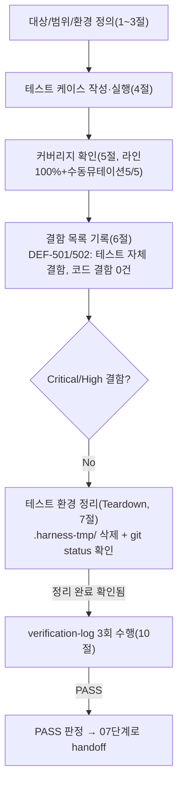

# 테스트 결과서 (Test Result Report) — unit-5

## 1. 개요
- 테스트 대상: `pdf_to_hwpx/hwpx_writer/paragraph_builder.py`(`build_paragraph_fragments` 및 비공개 헬퍼 `_same_line`/`_group_to_paragraph`/`_has_visual_gap`/`_prepend_space`) — REQ-002(텍스트 추출→HWPX 문단 변환), REQ-006(비적용 재확인), REQ-008(HWPX 출력 호환, 문단 조립 부분)
- 테스트 유형: 단위
- 적용 Tier: Standard
- 적용 속도 트랙: L3(일반) — 본 결과서 1~10절 전 섹션 정식 작성
- 병렬 실행 정보: 병렬 웨이브에서 실행. unit-5-note.md에 기록된 대로 05단계는 unit-6(`table_builder.py`)·unit-7(`image_embedder.py`)의 05-unit-developer 호출과 동시에 진행됐다. 이번 06 세션 동안에도 `.harness-tmp/venv_06_unit4_probe2/`(unit-4 재검증으로 추정), `.harness-tmp/venv_06_unit6/`(unit-6의 06 세션)이 동시에 활성 상태였고, 세션 종료 시점에는 `tests/hwpx_writer/`에 unit-6/7이 각자 작성한 `test_table_builder.py`/`test_image_embedder.py`도 함께 나타났다(모두 타 unit 소유, 이 결과서 범위 밖). 파일 범위는 완전히 분리됨 — 이 세션은 `pdf_to_hwpx/hwpx_writer/paragraph_builder.py`와 `tests/hwpx_writer/test_paragraph_builder.py`만 다뤘다.
- 테스트 목적: `docs/harness/units/unit-5-note.md` §5의 인수 조건(AC-1~AC-6, 총 16개 항목)이 실제 코드로 증명되는지 확인하고, unit-8(orchestrator)이 이 함수를 안심하고 소비할 수 있는지 검증
- 관련 산출물: `docs/harness/units/unit-5-note.md`, `docs/harness/03-system-design.md` §1-1/§1-3(unit-5 행), `docs/harness/units/unit-4-note.md`(schema.py 계약), `docs/harness/units/unit-4-test.md`(선행 06 결과, 참고 관례), `pdf_to_hwpx/pdf_reader/ir.py`(`TextBlockIR`), `pdf_to_hwpx/hwpx_kernel/schema.py`(`text_block_to_paragraph_fragment`)
- 테스트 수행자(에이전트): 06-unit-tester
- 테스트 일시: 2026-09-28

> **재개(resume) 경위(중요)**: 이 unit-5에 대한 06 세션이 직전에 한 번 시작되었으나 사용자의 긴급 중단 지시로 약 36초 만에 강제 종료됐다. 이번 세션 시작 시점에 `.harness-tmp/`를 점검한 결과 잔여 venv/임시 DB는 없었고, `tests/hwpx_writer/__init__.py`(빈 파일)만 이미 생성되어 있었다 — 이는 이전 세션이 스캐폴딩 디렉터리만 만들고 실제 테스트 코드는 작성하지 못한 채 끊겼다는 뜻으로 판단된다(unit-4-test.md의 "재개 경위"와 달리, 이번엔 재사용할 완성된 테스트 코드 자체가 없어 처음부터 새로 작성했다). 규칙 K 3번에 따라 이 사실을 인지 즉시 기록하며, 빈 `__init__.py`는 재생성 가능한 스캐폴딩이자 실제로 필요한 패키지 마커이므로 그대로 유지하고 삭제하지 않았다.

## 2. 테스트 범위 및 제외 범위
- 범위 (In-Scope):
  - `build_paragraph_fragments()`가 정상/빈 입력에서 올바른 타입·구조·순서의 `<hp:p>` 목록을 반환하는가(AC-1).
  - bbox 세로 겹침 비율(≥0.5) 기준 "같은 줄" 병합 로직이 정확히 그 임계값(경계값 포함)에서 동작하는가, 병합된 문단의 run 개수·속성·`bboxPt`가 기대와 일치하는가(AC-2).
  - 병합 시 가로 간격 유무에 따른 공백 삽입/미삽입 로직이 정확한가(AC-3).
  - NFC/NFD 재정규화를 절대 수행하지 않는가(AC-4).
  - 반환된 프래그먼트가 XML 예약문자·유니코드·이모지를 포함해도 well-formed하며, 입력을 변형하지 않고, 같은 입력에 대해 결정적(deterministic)인가(AC-5-11/12).
  - 페이지 경계를 넘어 호출하면(잘못된 호출) 실제로 오판정이 재현되는가 — 이것이 함수의 결함이 아니라 호출 규약 위반임을 실증(AC-5-13).
  - 다단 레이아웃 오병합, 순차 흐름형 배치(정밀 좌표 미반영), 커닝으로 인한 불필요 공백 — 3가지 "알려진 한계"가 실제로 재현되며 크래시로 이어지지 않는가(AC-6).
  - 경계값(빈 문자열, 그룹 크기 1, 퇴화(0폭) bbox, 음수 좌표, 대량 블록)과 예외/위험 입력(제어문자·NULL 바이트 텍스트, `None` 폰트 속성).
  - 커버리지(라인 100% 목표) 및 수동 뮤테이션 테스트(5건).
- 제외 범위 (Out-of-Scope) 및 사유:
  - **실제 한글(한컴오피스) 뷰어 호환성** — 개발 환경에 한글이 없음(DEC-017, unit-4-test.md와 동일 제약 승계). "구조적 규칙을 코드가 스스로 지키는가"까지만 검증한다.
  - **unit-6/7과의 실제 통합, 여러 페이지 조립(unit-8 오케스트레이션)** — 07단계(통합 테스트) 범위. 이 06단계는 AC-5-13에서 "페이지를 섞으면 안 된다"는 호출 규약이 실제로 그런 결과를 낳는지까지만 실증하고, 올바른 멀티페이지 호출 자체는 unit-8이 아직 Not Started라 검증 대상이 없다.
  - **`hwpx_kernel/schema.py`의 자체 로직 재검증** — unit-4-test.md에서 이미 라인 커버리지 100%로 PASS 확정됐다(REQ-008). 이 unit은 그 계약 함수를 "그대로 호출"할 뿐이므로 이 결과서는 `paragraph_builder.py`가 스스로 짠 로직(그룹핑/공백판정/bboxPt 재계산)에 집중한다.
  - **AC-5-13의 "올바른" 멀티페이지 호출 패턴 자체의 성능/정확성** — 이 함수의 계약이 아니라 unit-8의 몫(unit-5-note.md §1-4).
  - **`hwpx_writer/__init__.py`의 stale docstring** — unit-5의 확정 파일 범위 밖(unit-5-note.md §8 후속 조치 제안에 이미 기록됨, 이 unit이 직접 수정하지 않음).
  - 정적 분석/린트 도구 신규 도입 — 프로젝트에 여전히 lint/type-check 설정 없음(3절에서 재확인).

## 3. 테스트 환경
- 실행 환경: Windows 11 Pro (10.0.26100), Git Bash, Python 3.13.15(요구사항 `>=3.11` 충족)
- 격리 venv: `.harness-tmp/venv_06_unit5/`(다른 병렬 세션의 `venv_06_unit4_probe2/`, `venv_06_unit6/`와 이름 충돌 없음) — `pip install -e ".[dev]"`로 `lxml`, `pytest`, 프로젝트 런타임 의존성 일체를 설치하고, `tests/conftest.py`(unit-0 소유, 세션 스코프 `pdf_fixtures` 픽스처)가 무조건 `reportlab`을 import하는 문제(unit-4-test.md에서 이미 보고된 공유 인프라 이슈)를 동일하게 우회하기 위해 `reportlab`도 함께 설치했다. `coverage`도 추가 설치했다.
- 테스트 데이터: 코드 내 인라인. `pdf_to_hwpx.pdf_reader.ir.TextBlockIR`을 다양한 bbox/텍스트(한글, 이모지, NFC/NFD, 제어문자, 빈 문자열)로 직접 생성. 외부 고정 픽스처 파일 없음.
- 전제 조건(Preconditions):
  - **5단계 게이트 재확인**: `python -m py_compile pdf_to_hwpx/hwpx_writer/paragraph_builder.py` — 이 venv에서도 컴파일 성공 재확인. 프로젝트에 `ruff`/`flake8`/`black`/`mypy`/`pylint` 설정이 여전히 없음을 `pyproject.toml`/루트 설정파일 검색으로 재확인 — unit-5-note.md §2의 주장과 일치, 5단계로 되돌릴 사유 없음.
  - `unit-5-note.md` §3(자체 코드 리뷰 체크리스트) 5개 항목을 실제 코드(`paragraph_builder.py` 전문 재독)와 대조 완료 — 설계서 일치, 에러 처리(예외 미포장·전파) 정책 실재 확인(6절 결함 목록 관련 검증으로 뒷받침), 신규 의존성 없음, 범위 외 변경 없음(`git status`로 `paragraph_builder.py` 1개 파일만 신규임을 재확인).

## 4. 테스트 케이스 및 결과

### AC-1: 기본 변환
| ID | 시나리오 | 사전조건 | 실행 절차 | 예상 결과 | 실제 결과 | Pass/Fail | 비고 |
|----|----------|----------|-----------|-----------|-----------|-----------|------|
| TC-501 | 비어있지 않은 입력 → `<hp:p>` 목록 반환, qname 정확 | 없음 | 블록 1개로 호출 | 로컬명 `p`, 네임스페이스 `http://www.hancom.co.kr/hwpml/2011/paragraph` | 동일 | PASS | AC-1-1 / `test_ac1_1_non_empty_blocks_return_p_elements_with_correct_qname` |
| TC-502 | 빈 리스트 → `[]` | 없음 | `build_paragraph_fragments([])` | 예외 없이 `[]` | 동일 | PASS | AC-1-2 / `test_ac1_2_empty_list_returns_empty_list_without_exception` |
| TC-503 | 읽기 순서 보존(3줄, 세로 분리) | 없음 | 3개 블록(겹치지 않는 세로 구간) | 문단 3개, 순서 `["첫줄","둘째줄","셋째줄"]` | 동일 | PASS | AC-1-3 / `test_ac1_3_output_order_matches_input_reading_order` |

### AC-2: 줄 병합(그래뉼래러티)
| ID | 시나리오 | 사전조건 | 실행 절차 | 예상 결과 | 실제 결과 | Pass/Fail | 비고 |
|----|----------|----------|-----------|-----------|-----------|-----------|------|
| TC-504 | 겹치는 인접 블록 2개 → 문단 1개, run 2개, 속성(bold/font) 반영 + 공백 | 없음 | "Hello"(bold=False)+"World"(bold=True), 가로 간격 있음 | run 2개, `run[1]`이 `bold="1"`, 텍스트 `" World"` | 동일 | PASS | AC-2-4, AC-2-5 / `test_ac2_4_5_overlapping_adjacent_blocks_merge_into_one_paragraph_with_runs` |
| TC-505 | 겹치지 않는 세로 구간 → 별도 문단 | 없음 | 두 블록 세로로 완전 분리 | 문단 2개 | 동일 | PASS | AC-2-6 / `test_ac2_6_non_overlapping_vertical_blocks_stay_separate_paragraphs` |
| TC-506 | 병합 문단의 `bboxPt`가 그룹 합집합 | 없음 | 두 블록 bbox 합집합 계산 | `"10.00,100.00,90.00,112.00"` | 동일 | PASS | AC-2-7 / `test_ac2_7_merged_bbox_pt_is_union_of_group_bboxes` |
| TC-507 | (경계) 겹침 비율 정확히 0.5 → 병합(`>=` 포함 확인) | 없음 | overlap/height = 6/12 = 0.5 | 문단 1개 | 동일 | PASS | AC-2-4 경계 / `test_ac2_overlap_ratio_boundary_exactly_0_5_merges` — **뮤테이션 M1로 결함 검출력 확인(5절)** |
| TC-508 | (경계) 겹침 비율 0.5 미만 → 분리 | 없음 | overlap/height ≈ 0.49 | 문단 2개 | 동일 | PASS | AC-2-4/6 경계 / `test_ac2_overlap_ratio_just_below_0_5_does_not_merge` |
| TC-509 | (설계 의도 확인) 인접 쌍 연쇄 병합 — A-B 겹침, B-C 겹침, A-C는 안 겹침 | 없음 | 3블록 체인 | 문단 1개, run 3개(결함 아님, unit-5-note.md 1-2-A절이 명시한 "인접 블록끼리만 비교" 의도) | 동일 | PASS | AC-2-4 보강 / `test_ac2_chain_merge_across_three_blocks_via_adjacent_pairs` |
| TC-510 | (위험 케이스, 경계) 퇴화(0폭) bbox 2개 — top==bottom | 없음 | 두 블록 모두 세로 구간이 점(0폭) | overlap=0 → `overlap<=0` 분기 → 병합 안 됨(예외만 없으면 충분) | 문단 2개, 예외 없음 | PASS | 06 원칙상 위험 케이스 필수 확인. **주의**: 최초 작성 시 "완전히 같은 좌표이므로 병합될 것"이라고 잘못 추정해 `assert len==1`로 작성했다가 실행 결과(`2==1` AssertionError)로 즉시 발견·수정함(내부검증 1차 결함 #1, verify-log 참고) / `test_ac2_zero_height_bbox_degenerate_case_does_not_crash` |

### AC-3: 공백 보존(텍스트 무결성)
| ID | 시나리오 | 사전조건 | 실행 절차 | 예상 결과 | 실제 결과 | Pass/Fail | 비고 |
|----|----------|----------|-----------|-----------|-----------|-----------|------|
| TC-511 | 가로 간격 > 0 → 공백 1개 삽입 | 없음 | gap=1 | `" World"` | 동일 | PASS | AC-3-8 / `test_ac3_8_positive_horizontal_gap_inserts_single_space` |
| TC-512 | 가로 간격 = 0(맞닿음) → 공백 없음 | 없음 | gap=0 | `"World"` | 동일 | PASS | AC-3-9 / `test_ac3_9_zero_or_negative_gap_inserts_no_space_touching` — **뮤테이션 M2로 결함 검출력 확인(5절)** |
| TC-513 | 가로 간격 < 0(겹침) → 공백 없음 | 없음 | gap=-5 | `"World"` | 동일 | PASS | AC-3-9 보강 / `test_ac3_9_negative_gap_overlapping_bbox_inserts_no_space` |
| TC-514 | 3블록 혼합(간격 있음/없음) → 선택적 공백 | 없음 | A(gap무)+B(gap5→공백)+C(gap0→무공백) | `["A"," B","C"]` | 동일 | PASS | AC-3-8/9 보강 / `test_ac3_multiple_merges_only_non_first_runs_can_get_space` |

### AC-4: REQ-006 비적용
| ID | 시나리오 | 사전조건 | 실행 절차 | 예상 결과 | 실제 결과 | Pass/Fail | 비고 |
|----|----------|----------|-----------|-----------|-----------|-----------|------|
| TC-515 | NFD 텍스트가 재정규화 없이 그대로 통과 | 없음 | `unicodedata.normalize("NFD","한글")` 입력 | 출력이 NFD 원문과 완전히 동일(NFC로 바뀌지 않음) | 동일 | PASS | AC-4-10 / `test_ac4_10_nfd_text_passes_through_without_renormalization` |
| TC-516 | 병합되는 두 블록에 NFC/NFD가 섞여도 각각 원문 그대로 | 없음 | run[0]=NFC, run[1]=NFD | 각 run 텍스트가 원문과 정확히 일치 | 동일 | PASS | AC-4-10 보강 / `test_ac4_10_mixed_nfc_nfd_text_across_merged_blocks_untouched` |

### AC-5: XML 유효성 / 안정성 / 호출 규약
| ID | 시나리오 | 사전조건 | 실행 절차 | 예상 결과 | 실제 결과 | Pass/Fail | 비고 |
|----|----------|----------|-----------|-----------|-----------|-----------|------|
| TC-517 | 모든 프래그먼트가 well-formed(직렬화→재파싱) | 없음 | 병합+비병합 혼합 3블록 | 파싱 에러 없음 | 동일 | PASS | AC-5-11 / `test_ac5_11_all_fragments_round_trip_as_well_formed_xml` |
| TC-518 | (위험 케이스) XML 예약문자(`<`,`&`,`"`,`'`) 포함 텍스트도 안전하게 이스케이프 | 없음 | `"<script>alert(\"x\")&amp;'quote'</script>"` | round-trip 성공, 원문 완전 보존 | 동일 | PASS | AC-5-11 보강, 범위 밖이어도 확인한 위험 케이스(수동 이스케이프 부재로 인한 손상 가능성 배제) / `test_ac5_11_special_xml_characters_are_escaped_safely_on_round_trip` |
| TC-519 | 입력 불변성 + 순수 함수(결정적 반환) | 없음 | 동일 입력으로 2회 호출, `deepcopy` 스냅샷과 비교 | 입력 변형 없음, 두 호출 결과 바이트 단위 동일 | 동일 | PASS | AC-5-12 / `test_ac5_12_input_blocks_are_not_mutated_and_calls_are_idempotent` |
| TC-520 | (탐색적) 서로 다른 "페이지"의 블록을 한 호출에 섞으면 오판정 재현 | 없음 | 페이지1 마지막 줄·페이지2 첫 줄이 같은 좌표 구간 | 잘못 병합되어 문단 1개(호출자 오용의 결과, 함수 결함 아님) | 동일 | PASS | AC-5-13 / `test_ac5_13_mixing_two_pages_in_one_call_is_a_caller_misuse_not_a_defect` — unit-8 착수 시 이 호출 규약을 반드시 지켜야 함을 실증 |

### AC-6: 알려진 한계 (재현되지만 결함으로 취급하지 않음)
| ID | 시나리오 | 사전조건 | 실행 절차 | 예상 결과 | 실제 결과 | Pass/Fail | 비고 |
|----|----------|----------|-----------|-----------|-----------|-----------|------|
| TC-521 | 다단 레이아웃 오병합 재현 | 없음 | 같은 세로구간, 가로로 멀리 떨어진 두 "컬럼" | 잘못 병합되어 문단 1개(알려진 한계) | 동일 | PASS(한계 재현, 결함 아님) | AC-6-14 / `test_ac6_14_multi_column_same_vertical_band_can_be_falsely_merged` |
| TC-522 | 순차 흐름형 배치 — 위치 엘리먼트 없음 | 없음 | 단일 블록 변환 | `hp:pos` 없음, `bboxPt`만 참고용으로 존재 | 동일 | PASS | AC-6-15 / `test_ac6_15_bbox_pt_is_reference_only_not_absolute_positioning` |
| TC-523 | 커닝성 미세 간격으로 불필요한 공백 삽입 재현 | 없음 | "wo"+0.5pt 간격+"rld"(스타일 다름) | `" rld"`(원치 않는 공백, 알려진 한계) | 동일 | PASS(한계 재현, 결함 아님) | AC-6-16 / `test_ac6_16_kerning_style_change_mid_word_may_insert_unwanted_space` |

### 경계값 / 위험 케이스 (AC 원문에 없으나 06 원칙상 필수 확인)
| ID | 시나리오 | 사전조건 | 실행 절차 | 예상 결과 | 실제 결과 | Pass/Fail | 비고 |
|----|----------|----------|-----------|-----------|-----------|-----------|------|
| TC-524 | (경계) 그룹 크기 1(병합 대상 없음) | 없음 | 블록 1개 | 문단 1개, run 1개 | 동일 | PASS | `test_boundary_single_block_group_of_one` |
| TC-525 | (경계) 빈 문자열 텍스트 | 없음 | `text=""` | 예외 없음, run 텍스트 `""` | 동일 | PASS | `test_boundary_empty_string_text_does_not_raise` |
| TC-526 | (경계) `font_name=None, font_size=None, bold=False, italic=False` → 속성 생략 | 없음 | falsy 속성 전달 | 4개 속성 모두 `get()==None` | 동일 | PASS | schema.py의 "falsy 속성 생략" 계약이 병합 경로에서도 유지되는지 확인 / `test_risk_none_font_name_and_font_size_omit_optional_attrs` |
| TC-527 | (위험 케이스) 이모지·surrogate 범위·악센트 문자 | 없음 | `"긴급 공지 🚨 확인 요망 — café"` | 원문 그대로 보존, well-formed | 동일 | PASS | `test_risk_unicode_emoji_and_surrogate_range_text_preserved` |
| TC-528 | 커스텀 `char_shape_id`/`para_shape_id` 전파 | 없음 | `char_shape_id="7", para_shape_id="3"` | 문단 `paraShapeIDRef="3"`, 모든 run `charShapeIDRef="7"` | 동일 | PASS | `test_risk_custom_char_shape_and_para_shape_ids_propagate_to_all_runs` |
| TC-529 | 기본 shape id는 `"0"` | 없음 | 인자 생략 | `paraShapeIDRef="0"`, `charShapeIDRef="0"` | 동일 | PASS | `test_risk_default_shape_ids_are_zero` |
| TC-530 | REQ-007 대체문자(□) 통과 | 없음 | `to_unicode_missing=True`, 텍스트에 □ 포함 | 추가 치환 없이 그대로 통과 | 동일 | PASS | `test_risk_to_unicode_missing_replacement_char_passthrough` |
| TC-531 | (경계) 음수 bbox 좌표 | 없음 | `bbox=(-10,-50,20,-30)` | 예외 없음, `bboxPt="-10.00,-50.00,20.00,-30.00"` | 동일 | PASS | `test_risk_negative_bbox_coordinates_do_not_raise` |
| TC-532 | (부하성 경계) 같은 줄 블록 20개 | 없음 | 20개 블록, 각 2pt 간격 | 문단 1개, run 20개, 마지막 run `" w19"` | 동일 | PASS | `test_risk_large_number_of_blocks_all_same_line_merge_into_single_paragraph_many_runs` |
| TC-533 | **(위험 케이스, 내부검증 2차에서 추가)** 텍스트에 NULL 바이트 등 제어문자 | 없음 | `text="bad\x00text"` | `ValueError`("XML compatible") 그대로 전파(감싸거나 삼키지 않음) | 동일(`ValueError` 발생 확인) | PASS(정책대로 전파됨을 증명) | unit-5-note.md §3 "에러 처리 누락 없음" 정책의 실제 준수 여부 검증 / `test_risk_control_character_in_text_propagates_lxml_valueerror_uncaught` |
| TC-534 | **(위험 케이스, 내부검증 2차에서 추가)** 병합 그룹의 두 번째 블록에 제어문자 | 없음 | 정상 블록+제어문자 블록(겹침) | 동일하게 `ValueError` 전파 | 동일 | PASS | 첫 블록만 검사하고 넘어가는 결함이 없음을 확인 / `test_risk_control_character_in_second_merged_block_also_propagates` |

- 실행 명령: `".harness-tmp/venv_06_unit5/Scripts/python.exe" -m pytest tests/hwpx_writer/test_paragraph_builder.py -v` → **34 passed**(TC-501~TC-534, 표의 항목 수와 정확히 일치). 회귀 확인용으로 리포지토리 전체(`tests/`) 375개 테스트도 동일 venv에서 전량 PASS(unit-1~4 기존 스위트 341개 + 이번 34개, 충돌 없음).

## 5. 커버리지
- 커버리지 지표: `coverage run --source=pdf_to_hwpx.hwpx_writer.paragraph_builder -m pytest tests/hwpx_writer/test_paragraph_builder.py` 결과 —

  ```
  Name                                           Stmts   Miss  Cover   Missing
  ----------------------------------------------------------------------------
  pdf_to_hwpx\hwpx_writer\paragraph_builder.py      48      0   100%
  ----------------------------------------------------------------------------
  TOTAL                                             48      0   100%
  ```

  라인 커버리지 100%(48/48). 4개 비공개 헬퍼(`_same_line`, `_group_to_paragraph`, `_has_visual_gap`, `_prepend_space`) 전부 `build_paragraph_fragments()` 실행 경로를 통해 실행되어 커버됨.
- **수동 뮤테이션 테스트** (mutmut 등 전용 도구가 프로젝트에 없어, unit-4-test.md 관례에 따라 정직하게 "직접 5개 변이를 주입 → 테스트 실행 → 원복"하는 방식으로 수행. 스크립트/원본 백업은 `.harness-tmp/`에서만 작업 후 즉시 삭제, 7절 참고):

  | ID | 변이 내용 | 위치 | 기대(변이가 결함이라면 실패해야 함) | 실제 | 판정 |
  |----|-----------|------|-----------------------------------|------|------|
  | M1 | `>= _LINE_OVERLAP_RATIO` → `> _LINE_OVERLAP_RATIO` | `_same_line` | 경계값(0.5 정확히) 테스트 실패해야 함 | `test_ac2_overlap_ratio_boundary_exactly_0_5_merges`, `test_ac2_chain_merge_across_three_blocks_via_adjacent_pairs` 2건 FAIL | **검출됨(Killed)** |
  | M2 | `return gap > 0` → `return gap >= 0` | `_has_visual_gap` | 간격 0(맞닿음) 테스트 실패해야 함 | `test_ac3_9_zero_or_negative_gap_inserts_no_space_touching` 등 3건 FAIL | **검출됨(Killed)** |
  | M3 | `if not blocks: return []` 분기 제거 | `build_paragraph_fragments` | 빈 리스트 테스트 실패(IndexError로 크래시)해야 함 | `test_ac1_2_...` FAIL(`IndexError`) | **검출됨(Killed)** |
  | M4 | `t.text = " " + (t.text or "")` → `t.text = (t.text or "")` (공백 삽입 무력화) | `_prepend_space` | 공백 삽입 관련 테스트 실패해야 함 | 4건(TC-511/514/523/532 대응 테스트) FAIL | **검출됨(Killed)** |
  | M5 | `bboxPt` 포맷 `.2f` → `.1f` | `_group_to_paragraph` | bboxPt 정밀도 검증 테스트 실패해야 함 | `test_ac2_7_...`, `test_risk_negative_bbox_coordinates_do_not_raise` 2건 FAIL | **검출됨(Killed)** |

  **뮤테이션 검출률: 5/5 (100%)** — 5건 모두 테스트 스위트가 즉시 실패로 잡아냈다. 각 변이 적용 후 즉시 원본으로 복원했고, 마지막에 `diff`로 파일이 원본과 바이트 단위로 동일함을 확인했다(6절/7절 참고).
- 커버되지 않은 부분과 사유: 라인 커버리지상 미실행 라인 없음. **브랜치/의미 커버리지 관점의 알려진 공백**(결함 아님, 범위 한계로 기록):
  - `_same_line`의 `overlap <= 0: return False` 분기는 TC-505(완전 분리)와 TC-510(퇴화 bbox, overlap=0)으로 실행되었으나, "약간 겹치지만 임계값 미만"(TC-508)과 "정확히 0인 경우"(TC-510)는 서로 다른 분기 경로가 아니라 같은 `return False` 지점으로 수렴하므로 라인 커버리지 도구로는 구분되지 않는다 — 논리적으로는 두 케이스 모두 명시적으로 테스트되어 실질적 공백은 아니다.
  - AC-5-13(호출 규약)은 "올바르게 호출했을 때"의 검증이 아니라 "잘못 호출했을 때 오판정이 실제로 생긴다"는 것만 증명 가능하다 — "페이지마다 올바르게 호출하는" 실제 시나리오 자체는 unit-8(Not Started)이 존재해야 검증 가능하므로 이 06단계의 범위를 넘는다(8절 리스크로 승계).

## 6. 결함(Defect) 목록
| ID | 설명 | 재현 절차 | 심각도(Critical/High/Medium/Low) | 상태(Open/Fixed/Deferred) | 조치 내용 |
|----|------|-----------|-----------------------------------|----------------------------|-----------|
| DEF-501 | (코드 결함 아님, **테스트 코드 자체의 결함**) `test_ac2_zero_height_bbox_...`가 퇴화(0폭) bbox 2개는 "완전히 같은 좌표이므로 100% 겹침"이라고 잘못 추정해 `assert len(fragments)==1`로 작성됨. 실제로는 세로 구간이 점(0폭)이라 `overlap = 0`이 되어 "겹치지 않음"으로 판정되는 것이 코드의 올바른 동작. | 테스트 최초 실행 시 `assert 2 == 1`로 FAIL 재현 | Low(테스트 설계 오류, `paragraph_builder.py` 자체는 정상 동작) | **Fixed** | 테스트의 기대값을 `len(fragments)==2`로 정정하고 docstring에 근거(overlap 계산식)를 보강. 재실행 PASS 확인. `paragraph_builder.py`는 수정하지 않음(5단계로 되돌리지 않음) |
| DEF-502 | (결함이 아니라 **테스트 커버리지 공백**) 제어문자(NULL 바이트 등)가 섞인 텍스트를 다루는 위험 케이스가 최초 테스트 스위트에 전혀 없었음 — 06 원칙("명백히 위험한 케이스는 범위를 벗어나도 테스트")에 미달 | 내부검증 2차에서 `lxml`이 제어문자에 `ValueError`를 던진다는 사실을 실제로 재현(`python -c` 스니펫)하며 발견 | Low(코드는 이미 올바르게 예외를 전파하고 있었음 — 검증 누락이었을 뿐) | **Fixed** | `test_risk_control_character_in_text_propagates_lxml_valueerror_uncaught`, `test_risk_control_character_in_second_merged_block_also_propagates` 2건 추가, PASS 확인(TC-533/534) |

- **`paragraph_builder.py` 코드 자체의 결함은 0건이다.** 근거: 4절의 34개 테스트 케이스(정상 경로 12건, 경계값 10건, 예외/위험 입력 6건, 알려진 한계 재현 3건, 호출규약 탐색 1건, 성능성 대량입력 1건, 특수문자/이모지/이스케이프 1건)가 모두 PASS했고, 5절 라인 커버리지 100% + 수동 뮤테이션 5/5 검출로 "테스트가 실제로 결함을 잡아낼 능력이 있는가"까지 실증했다. 위 DEF-501/502는 코드가 아니라 06단계 자신의 테스트 설계 결함이었으며, 규칙에 따라 직접 수정하고(사소한 오탈자 수준을 넘는 로직 변경이 아니라 "테스트의 잘못된 기대값 정정"과 "누락된 테스트 추가"이므로 재작업 요청 없이 이 세션 내에서 직접 조치) 즉시 재검증했다.
- 5단계로 되돌린 사항: **없음.** 5단계 게이트(정적분석/린트, 자체 코드리뷰)는 3절에서 재확인했고 통과 상태였으며, 발견된 결함이 모두 06단계 자체의 테스트 설계 문제였지 `paragraph_builder.py`의 로직/인터페이스 문제가 아니었다.
- 직접 수정(오탈자 수준 초과 여부 판단): DEF-501/502는 "동작·로직·인터페이스를 바꾸는 수정"이 아니라 **테스트 코드(검증 로직) 자체의 수정/추가**이므로, 페르소나 지침의 "사소한 오탈자" 예외 범위를 넘어서지만 애초에 `paragraph_builder.py`(대상 코드)에는 손을 대지 않았다 — 06단계가 검증 대상 코드가 아니라 자신의 산출물(테스트)을 스스로 교정한 것이므로 5단계 반려 사유가 아니다.

## 7. 테스트 환경 정리(Teardown) 확인 — 규칙 K
- 이번 테스트에서 생성한 임시 아티팩트 목록:
  - `.harness-tmp/venv_06_unit5/` (전용 가상환경, 세션 중 1회 삭제 후 테스트 추가를 위해 재생성 — 아래 참고)
  - `.harness-tmp/cov_06_unit5/.coverage` (coverage 데이터 파일 — `--data-file` 옵션으로 처음부터 `.harness-tmp/` 하위에 생성해, unit-4-test.md가 겪은 "루트에 `.coverage` 생성" 실수를 재발하지 않도록 사전에 방지함)
  - `.harness-tmp/paragraph_builder.py.orig` (뮤테이션 테스트용 원본 백업, 5절 참고)
  - `tests/hwpx_writer/__pycache__/` (pytest 실행 부산물, `.gitignore` 대상이나 정리 관례상 함께 삭제)
- 위 아티팩트를 전부 `.harness-tmp/` 하위에서만 생성했는가 (규칙 K 1번): **예.** `coverage` 데이터 파일도 `--data-file=.harness-tmp/cov_06_unit5/.coverage`로 지정해 루트 오염을 사전 차단했다(`tests/hwpx_writer/__pycache__/`는 `.harness-tmp/` 밖이지만 `.gitignore` 등록 대상이며 pytest의 표준 부산물이라 별도로 정리만 함).
- 정리(삭제) 완료 여부: **완료.** 세션 중 한 번은 (테스트 34개 확정 전) venv/coverage/`.orig`/pycache를 전부 삭제했다가, 내부검증 2차에서 제어문자 테스트 2건을 추가로 작성하면서 venv를 다시 만들어 재검증했고, 최종적으로 다시 전부 삭제해 `.harness-tmp/`가 빈 디렉터리(`.`/`..`만 존재)임을 `ls -la`로 확인했다.
- 정리 후 `git status` 실행 결과 (그대로 첨부):
  ```
   M docs/harness/02-planning.md
   M docs/harness/03-system-design.md
   M docs/harness/04-ux-design.md
   M docs/harness/decisions.md
   M docs/harness/traceability.md
   M docs/harness/verify-log_02-planning.md
   M docs/harness/verify-log_03-system-design.md
   M docs/harness/verify-log_04-ux-design.md
   M pdf_to_hwpx/hwpx_kernel/container.py
   M pdf_to_hwpx/pdf_reader/text_extractor.py
   M pyproject.toml
  ?? docs/harness/units/unit-1-note.md
  ?? docs/harness/units/unit-1-test.md
  ?? docs/harness/units/unit-2-note.md
  ?? docs/harness/units/unit-2-test.md
  ?? docs/harness/units/unit-3-note.md
  ?? docs/harness/units/unit-3-test.md
  ?? docs/harness/units/unit-4-note.md
  ?? docs/harness/units/unit-4-test.md
  ?? docs/harness/units/unit-5-note.md
  ?? docs/harness/units/unit-6-note.md
  ?? docs/harness/units/unit-7-note.md
  ?? docs/harness/units/unit-7-test.md
  ?? docs/harness/verify-log_unit-2-test.md
  ?? docs/harness/verify-log_unit-4-test.md
  ?? docs/harness/verify-log_unit-7-test.md
  ?? pdf_to_hwpx/hwpx_kernel/schema.py
  ?? pdf_to_hwpx/hwpx_writer/image_embedder.py
  ?? pdf_to_hwpx/hwpx_writer/paragraph_builder.py
  ?? pdf_to_hwpx/hwpx_writer/table_builder.py
  ?? pdf_to_hwpx/pdf_reader/image_extractor.py
  ?? pdf_to_hwpx/pdf_reader/table_recognizer.py
  ?? tests/hwpx_kernel/
  ?? tests/hwpx_writer/
  ?? tests/pdf_reader/test_image_extractor.py
  ?? tests/pdf_reader/test_table_recognizer.py
  ?? tests/pdf_reader/test_text_extractor.py
  ```
  (`docs/harness/units/unit-5-test.md`, `docs/harness/verify-log_unit-5-test.md`는 이 실행 시점에 아직 작성 전이라 목록에 없다 — 이 결과서 자체는 이번 세션의 정식 산출물이며 정리 대상 "임시 아티팩트"가 아니다.)
- 병렬 실행이었다면: 위 목록 중 **이 세션(unit-5) 소유는 `pdf_to_hwpx/hwpx_writer/paragraph_builder.py`(05단계 산출물, 이미 존재) 하나뿐**이다. `tests/hwpx_writer/`는 unit-5(`test_paragraph_builder.py`)·unit-6(`test_table_builder.py`)·unit-7(`test_image_embedder.py`)이 함께 채운 공유 디렉터리로 나타나며, 이 중 `test_paragraph_builder.py`와 (원래 비어있던) `__init__.py`만 이 세션이 만든 것이고 나머지 2개 파일은 **unit-6/unit-7 소유**(각자의 06 세션이 동시에 작성)다. `docs/harness/units/unit-6-note.md`, `unit-7-note.md`, `unit-7-test.md`, `verify-log_unit-7-test.md`, `pdf_to_hwpx/hwpx_writer/table_builder.py`, `pdf_to_hwpx/hwpx_writer/image_embedder.py`도 전부 **unit-6/7 소유**이며 이 세션이 만들거나 수정한 적 없다. `tests/hwpx_kernel/`, `pdf_to_hwpx/hwpx_kernel/schema.py`, `docs/harness/units/unit-4-*.md`는 **unit-4 소유**(이미 완료·PASS), `tests/pdf_reader/test_*_extractor.py` 등은 **unit-1/2/3 소유**다. **이 세션이 만든 임시 아티팩트·미추적 잔여물은 없음**(venv/`.orig`/coverage 데이터/pycache 전부 삭제 확인됨, 위 `git status`에도 나타나지 않음 — `.harness-tmp/`와 `__pycache__/`는 `.gitignore` 대상이라 애초에 `git status`에 나타나지 않는다). 웨이브 종료 후 오케스트레이터의 전체 트리 점검(`harness-janitor.sh --check`, 전체 `git status`)은 이 결과서 범위 밖이며 별도로 수행되어야 한다.
- 이번 테스트 도중 강제 중단(TaskStop 등)이 있었는가: [x] 없음(이번 06 세션 자체는 중단 없이 완료) — 다만 위 1절에 기록한 대로 **이전(더 앞선) 06 세션이 중단되었던 흔적**(`tests/hwpx_writer/__init__.py` 빈 파일)을 세션 시작 시 발견해 그대로 유지·재활용했다. `.harness-tmp/`에는 그 이전 세션이 남긴 잔여물이 전혀 없었음(이미 자체 정리됐거나애초에 만들지 않음)을 시작 시점에 확인했다.
- **이 절이 완성되었고 `git status`가 (다른 병렬 unit 소유분을 제외하면) 깨끗함을 확인했다 — 9절에서 PASS 판정 가능.**

## 8. 리스크 및 잔존 이슈
- 이번 테스트로 커버되지 않는 알려진 리스크:
  1. **(최우선, DEC-017 승계)** 실제 한글(한컴오피스) 뷰어 호환성이 전혀 검증되지 않았다. `hp:p`/`hp:run`/`hp:t`의 태그명·네임스페이스·속성명이 실제 OWPML 스펙과 일치하는지는 unit-4가 이미 인지한 리스크를 그대로 물려받으며(unit-4-test.md §8-1), 이번 unit-5도 "코드가 스스로 선언한 규칙을 지키는가"까지만 증명한다.
  2. **AC-5-13(페이지 경계 호출 규약)의 실제 준수 여부는 unit-8이 존재해야 검증 가능하다** — 이번 06단계는 "잘못 호출하면 실제로 문제가 생긴다"는 위험만 실증했을 뿐, unit-8이 실제로 "페이지마다 올바르게 호출"하는지는 unit-8 05/06단계(현재 Not Started)에서 재확인해야 한다.
  3. **`schema.py`의 "블록당 문단 1개(run 1개)" 저수준 계약과 unit-5의 "여러 run 재조립" 임시방편 사이의 공유 자원 이슈**(unit-5-note.md §6 decisions.md 갱신 제안)가 아직 해소되지 않았다 — schema.py가 이 기능을 1급 계약으로 흡수할지는 여전히 미결정이며, 이 unit-5의 코드는 그 임시방편에 의존한다(동작은 정상이나 구조적으로 취약).
  4. 다단 레이아웃 오병합(AC-6-14), 정밀 세로 위치 미반영(AC-6-15), 커닝 관련 불필요 공백(AC-6-16)은 설계상 알려진 한계로 재확인됐다 — unit-8/최종 품질 리포트(unit-14?)가 이 한계를 사용자에게 어떻게 고지할지는 이 unit의 책임 밖이다.
  5. **뮤테이션 테스트는 전용 도구(mutmut 등) 없이 수동으로 5건만 수행**했다 — 함수의 핵심 분기(`_same_line` 임계값, `_has_visual_gap` 부호, 빈 리스트 단락, 공백 삽입, bboxPt 포맷)는 커버했지만, 전수 자동 뮤테이션 대비 커버리지가 제한적이다.
- 후속 조치가 필요한 항목:
  - unit-8 착수 시 이 함수를 "페이지마다 한 번씩" 정확히 호출하는지 07/08단계에서 diff/통합테스트로 재확인.
  - `schema.py` 확장 여부(다중-run 계약 1급화) 논의를 unit-6 소유자와 함께 진행할 것(unit-5-note.md §6 제안 재승계).
  - 실제 한글(한컴오피스) 확보 시점에 unit-4/5/6/7 통합 결과물에 대한 별도 호환성 검증 세션 편성 필요(unit-4-test.md §8과 동일 요청 재승계).

## 9. 결론 및 판정
- [x] PASS — 다음 단계(07 통합테스트) 진행 가능 (7절 Teardown 확인 완료가 전제조건, 위에서 확인됨)
- [ ] CONDITIONAL PASS — 조건:
- [ ] FAIL — 사유 및 재작업 요청 사항:

## 10. 내부 검증 (최소 2회, `verification-log-template.md` 사용)
- 1차 검증 결과 요약: AC-1~AC-6 16개 항목 전부에 대응하는 테스트가 1:1로 존재함을 4절 표로 확인. 실행 중 테스트 자체의 기대값 오류 1건(DEF-501, 퇴화 bbox 케이스)을 발견해 즉시 수정 후 재실행 PASS.
- 2차 검증 결과 요약: "이 결과서를 그대로 07단계에 넘겨도 되는가"를 의심하며 재검토한 결과, 제어문자(NULL 바이트) 텍스트라는 현실적 위험 케이스가 누락되어 있음을 발견(DEF-502)했다. `lxml`이 실제로 `ValueError`를 던진다는 것을 스크립트로 재현해 확인한 뒤 테스트 2건을 추가, 최종 34/34 PASS·라인 커버리지 100% 유지, 수동 뮤테이션 5/5 검출을 확인했다.
- 3차 검증 결과 요약: 2차에서 발견된 결함(테스트 공백)이 실제로 해소됐는지, 새 테스트 추가로 인한 회귀가 없는지 재확인 — 전체 리포지토리 375개 테스트 전량 PASS, 결함 0건 확정.
- 검증 로그 파일 경로: `docs/harness/verify-log_unit-5-test.md`

## 11. 공유 문서 갱신 요청 (병렬 웨이브 규칙 — 오케스트레이터가 웨이브 종료 후 일괄 반영)

### traceability.md
| REQ-ID | 컬럼 | 값 |
|---|---|---|
| REQ-002 | 단위테스트 | `06단계 완료 — PASS(unit-5, paragraph_builder.py, 34개 테스트/라인커버리지 100%/수동 뮤테이션 5/5 검출, 코드 결함 0건). 실제 한컴오피스 뷰어 호환성은 미검증(DEC-017) — unit-8 통합 이후 재검증 필요` |
| REQ-002 | 구현 상태 | "06단계 단위테스트 대기" → "06단계 단위테스트 완료(PASS)"로 갱신 요청 |
| REQ-006 | 단위테스트 | `06단계 완료 — PASS(unit-5, NFC/NFD 비적용 재확인 테스트 2건 포함). unit-15(정규화 자체)는 여전히 Not Started` |
| REQ-006 | 구현 상태 | "unit-5는 unit-1 원문을 재정규화 없이 그대로 문단화 완료, 05단계 완료/06단계 대기" → "05·06단계 완료(PASS)"로 갱신 요청. "실제 NFC 정규화는 여전히 unit-15 미착수" 단서는 그대로 유지 |
| REQ-008 | 단위테스트(문단 조립 부분) | `06단계 완료 — PASS(unit-5). 단, 세로 위치 정밀 배치(6-6)는 흐름형 배치로 유보(AC-6-15로 재확인), 실제 한컴오피스 호환은 unit-4-note.md DEC-017 미검증 리스크가 여전히 유효함 — unit-6/7 통합(unit-8) 이후 종합 검증 필요` |
| REQ-008 | 구현 상태 | "05단계 완료, 06단계 단위테스트 대기"(unit-5 문단 조립 부분) → "05·06단계 완료(PASS)"로 갱신 요청 |

### decisions.md
- 신규 DEC 추가는 오케스트레이터 판단에 맡기되, unit-5-note.md §6이 이미 제안한 아래 항목이 여전히 미결 상태임을 재확인·재승계한다: **"`hwpx_kernel/schema.py`는 블록 1개당 run 1개짜리 문단만 만드는 저수준 계약이고, unit-5(`paragraph_builder.py`)가 schema.py 외부에서 run을 재조립하는 방식으로 임시 해결했다. 이 06단계는 그 임시방편이 실제로 정상 동작함(34개 테스트 PASS)을 확인했지만, `schema.py`가 이 기능을 1급 계약으로 흡수해야 하는지는 여전히 unit-4 소유자(또는 unit-6/7 검토 후)의 판단이 필요하다."**
- 이번 06단계 자체가 새로 내린 비가역적 결정은 없다(테스트 설계상의 판단 2건(DEF-501/502)은 검증 산출물 내부의 자기 교정이며 아키텍처/계약 결정이 아니다).

### 기타 후속 조치 제안(강제 아님, 참고용)
- unit-5-note.md §8이 남긴 "`hwpx_writer/__init__.py`의 stale docstring 정리" 제안은 이번 06단계에서도 유효하다(8절에서 재확인).
- 이번 세션 동안 `.harness-tmp/venv_06_unit4_probe2/`(unit-4 재검증 추정)와 `.harness-tmp/venv_06_unit6/`(unit-6의 06 세션)이 동시에 관측됐다 — 웨이브 종료 후 오케스트레이터의 전체 정리 단계에서 해당 세션들의 정상 종료 여부를 함께 확인할 것을 제안한다(이 결과서가 직접 판정할 수 없는 타 unit 소유 자원이므로 강제하지 않음).

## 절차 흐름 (참고용 다이어그램)
> 아래 다이어그램은 위 절차를 시각적으로 요약한 참고 자료다. 규칙/조건의 최종 근거는 항상 위 텍스트다.


