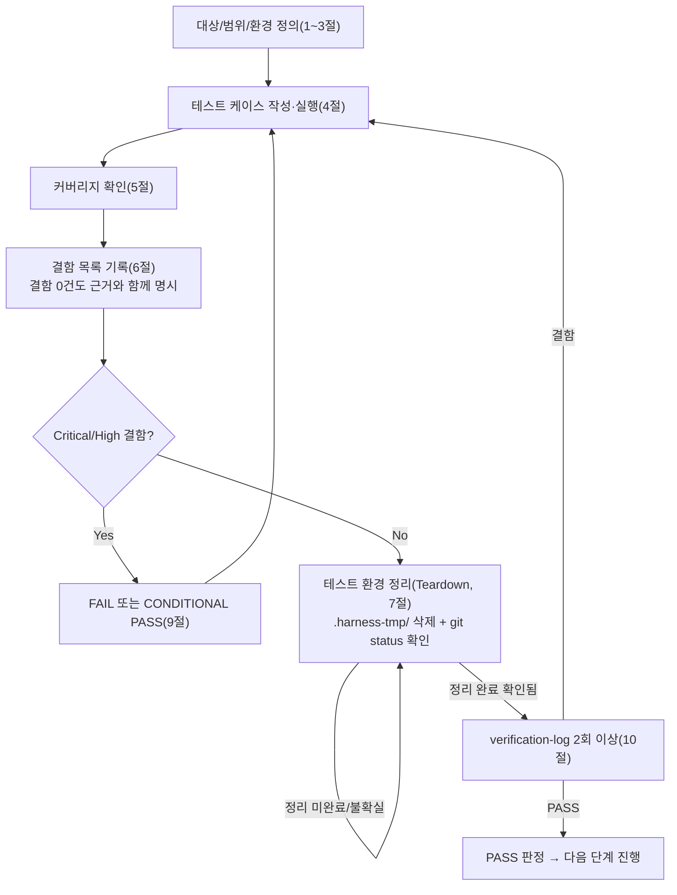

# 테스트 결과서 (Test Result Report) — unit-7

> **재개(resume) 경위**: 이 unit의 이전 06 세션은 사용자의 긴급 중단 지시로 착수 약 36초 만에 강제 종료되어 사실상 산출물이 없었다(테스트 코드/결과서 모두 미작성 상태). 세션 시작 시 `.harness-tmp/`를 스캔한 결과 이 unit 소유의 잔여물(`venv_06_unit7` 등)은 없었고(규칙 K 3번), 다른 병렬 단위 소유로 보이는 `.harness-tmp/container_backup_for_mutation_check.py`, `.harness-tmp/venv_06_unit4_binexpand/`, `.harness-tmp/venv_06_unit5/`, `.harness-tmp/venv_06_unit6/`만 존재해 손대지 않았다. 이번 세션은 처음부터 완전히 새로 테스트 케이스를 설계·작성·실행했다.

## 1. 개요
- 테스트 대상: `pdf_to_hwpx/hwpx_writer/image_embedder.py` (`embed_image_blocks`, `EmbeddedImage`, `ImageEmbedWarning`, `SUPPORTED_IMAGE_FORMATS`) — REQ-003(PDF 이미지 추출 → HWPX 원본 바이트 임베딩) 중 "BinData id 할당 + 배치 프래그먼트 생성" 부분
- 테스트 유형: 단위
- 적용 Tier: Standard (DEC-001) — 규칙 B 원문(최소 2회 검증, 1차 결함 0건이어도 2차 생략 불가) 그대로 적용
- 적용 속도 트랙: L3(일반) — `unit-7-note.md` 명시(호출 프롬프트에 별도 트랙 지정 없어 기본값 적용), 본 결과서 1~10절 전 섹션 정식 작성
- 병렬 실행 정보: 병렬 웨이브에서 실행 — 이 unit(unit-7)이 AC-5(BinData 실제 zip 저장)를 위해 이관한 `container.py` 확장(unit-7-note.md §6-1 "공유 문서 갱신 요청")을 다른 에이전트가 별도 트랙에서 동시에 진행 중이었다(`git status`에 `M pdf_to_hwpx/hwpx_kernel/container.py`로 관측). 이 결과서는 그 확장 작업을 다루지 않으며, 이 06 세션이 수정/생성한 파일은 `tests/hwpx_writer/test_image_embedder.py`, `tests/hwpx_writer/__init__.py` 2개뿐이다(`pdf_to_hwpx/hwpx_writer/image_embedder.py`는 05단계 산출물을 읽기만 했고 수정하지 않았다 — 4절 실행 로그, 7절 Teardown의 `git status`로 재확인).
- 테스트 목적: `docs/harness/units/unit-7-note.md` §5의 인수 조건(AC-1 4개 항목, AC-2 3개 항목, AC-3 2개 항목, AC-4 2개 항목, 합계 11개)이 실제 코드로 증명되는지 확인하고, AC-5(BinData 실제 저장)는 이 unit의 범위 밖임을 재확인하여 07/unit-8 단계로 명확히 이관
- 관련 산출물: `docs/harness/units/unit-7-note.md`(§1, §5 AC, §6 공유 문서 갱신 요청), `docs/harness/units/unit-4-note.md`(§2-2, schema.py 계약), `docs/harness/units/unit-2-note.md`(§7-4-2, CCITT/JBIG2 경고 근거), `pdf_to_hwpx/hwpx_kernel/schema.py`(`image_block_to_picture_fragment`), `pdf_to_hwpx/pdf_reader/ir.py`(`ImageBlockIR`), `docs/harness/traceability.md` REQ-003 행
- 테스트 수행자(에이전트): 06-unit-tester
- 테스트 일시: 2026-09-28

## 2. 테스트 범위 및 제외 범위
- 범위 (In-Scope):
  - AC-1(기본 임베딩): 지원 포맷(jpeg/jp2/png/tiff) 각각이 `embedded`에 입력 순서대로 포함되는지, `raw_bytes`가 재인코딩 없이 바이트 단위로 완전히 동일한지, `bin_data_id`가 `start_index`부터 `"bin{N}"` 형태로 임베딩된 이미지에만 순차 부여되는지, `fragment`가 `schema.image_block_to_picture_fragment()`의 반환값과 구조적으로 동일한지.
  - AC-2(CCITT/JBIG2/미지원 포맷 제외): `"ccitt"`/`"jbig2"`가 `IMAGE_FORMAT_INCOMPLETE_BITSTREAM` 경고로, `"unknown"`/그 외 임의 문자열(대소문자 다른 값 포함)이 `IMAGE_FORMAT_UNSUPPORTED` 경고로 정확히 분류되는지, 두 코드가 실제로 구분되는지, 예외를 던지지 않는지, `schema` 계층에서 발생한 예외(bbox 형식 이상)는 삼키지 않고 그대로 전파하는지.
  - AC-3(다중 페이지 체이닝): `next_start_index`를 다음 호출의 `start_index`로 그대로 넘겼을 때 id가 겹치지 않는지, `next_start_index == start_index + len(embedded)`(경고 개수와 무관)인지, 3페이지 연속 체이닝에서도 유일성이 유지되는지.
  - AC-4(빈 입력/안정성): 빈 목록이 예외 없이 `([], [], N)`을 반환하는지, 입력을 읽기 전용으로만 사용해 어떤 상태도 바꾸지 않는지, 같은 입력·같은 `start_index`로 반복 호출해도 결과가 동일한지, `start_index`만 다르면 `bin_data_id`만 달라지는지.
  - 정상 경로 + 경계값(빈 텍스트/빈 목록, 크기 0 아님이나 형식 이상 bbox, 대소문자 변형) + 예외 입력(형식 이상 bbox로 인한 예외 전파) + 위험 케이스(빈 raw_bytes는 AC 범위 밖이라 별도 미시도 — 4절 참고).
  - 5단계 게이트(정적 분석/컴파일, 자체 코드 리뷰 체크리스트)가 실제로 통과됐는지 `unit-7-note.md` §2/§3에서 재확인.
  - 커버리지 측정(라인 100% 목표) 및 수동 뮤테이션 테스트(5건).
- 제외 범위 (Out-of-Scope) 및 사유:
  - **AC-5(BinData 실제 zip 저장, `unit-7-note.md` §5 12번)** — `hwpx_kernel/container.py`(unit-4 확정 파일 범위)에 BinData 삽입 함수가 이 06 세션 시작 시점까지 존재하지 않는다(unit-7-note.md §1-2/§6-1이 이미 명시). 이 확장은 다른 에이전트가 별도 트랙에서 진행 중이며(위 "병렬 실행 정보" 참고), 이 unit의 파일 범위(`hwpx_writer/image_embedder.py`)로는 검증 대상 자체가 없다. "실제 `.hwpx` 파일에 이미지가 들어가 한글에서 보이는가"는 `container.py` 확장이 완료되고 unit-8(오케스트레이터)이 통합한 이후 07/08단계에서만 검증 가능하다. 이 06 세션에서는 명시적으로 테스트하지 않았다(테스트 대상 함수/기능이 존재하지 않아 "결함 없음"이 아니라 "검증 불가"로 분류).
  - 실제 한글(한컴오피스) 뷰어에서 `hp:pic`/`binDataIDRef` 속성이 실제 스펙과 일치하는지 — DEC-017 승계(unit-4-test.md와 동일한 환경 제약, 개발 환경에 한글 없음). `schema.image_block_to_picture_fragment()` 자체의 구조적 정확성은 unit-4-test.md TC-217~219에서 이미 검증됨 — 이 unit은 그 함수를 "올바른 인자로 호출하는지"만 검증한다.
  - unit-2(`image_extractor.py`)가 실제 PDF에서 이 형식들을 어떻게 판별하는지 — unit-2-test.md 범위(이미 PASS).
  - unit-8/07단계 통합(여러 unit의 실제 파이프라인 조립, 실제 `.hwpx` end-to-end 왕복) — 07단계 범위.

## 3. 테스트 환경
- 실행 환경: Windows 11 Pro (10.0.26100), Git Bash, Python 3.13.15(요구사항 `>=3.11` 충족)
- 격리 venv: `.harness-tmp/venv_06_unit7/`(다른 병렬 단위의 `venv_06_unit4_binexpand`/`venv_06_unit5`/`venv_06_unit6`와 이름 충돌 없음) — `pip install -e ".[dev]"`로 `lxml==6.1.3`, `pytest==9.1.1` 설치, 여기에 `coverage`·`reportlab`(unit-0 소유 `tests/conftest.py`의 세션 스코프 `pdf_fixtures` 픽스처가 무조건 `reportlab`을 import하여 `tests/hwpx_writer/`만 수집해도 컬렉션이 실패하므로, unit-4-test.md와 동일한 방식으로 이 unit 전용 격리 venv에만 추가 설치해 우회, `conftest.py` 자체는 수정하지 않음)를 추가 설치.
- 테스트 데이터: 코드 내 인라인. `ImageBlockIR`를 직접 생성(`bbox`/`raw_bytes`/`image_format` 조합), 실제 PDF 파일이나 고정 픽스처는 사용하지 않음(이 모듈은 PDF를 직접 다루지 않는 순수 변환 로직이므로 불필요).
- 전제 조건(Preconditions):
  - 5단계 게이트 재확인: `python -m py_compile pdf_to_hwpx/hwpx_writer/image_embedder.py` — 이 venv에서도 컴파일 성공 재확인. 프로젝트에 `ruff`/`flake8`/`black`/`mypy`/`pylint`/`.pre-commit-config.yaml` 설정이 여전히 없음(루트 검색으로 재확인, `unit-7-note.md` §2와 일치) — 5단계로 되돌릴 사유 없음.
  - `unit-7-note.md` §3(자체 코드 리뷰 체크리스트) 6개 항목을 소스(`image_embedder.py`, 174줄 전체)와 직접 대조 완료 — 에러 처리 누락 없음(try/except 없음, 예외 삼킴 없음), 입력 검증(화이트리스트)이 유일한 필요 검증이며 누락 없음, 신규 의존성 없음(`lxml`은 기존 등록분), 범위 외 변경 없음(`git status`로 이 unit이 생성한 파일이 `image_embedder.py` 1개뿐임을 05단계 산출물 기준으로 재확인). 5단계 게이트/리뷰가 실제로 통과됐음을 확인했으므로 5단계로 되돌리지 않는다.

## 4. 테스트 케이스 및 결과

### AC-1: 기본 임베딩 (unit-7-note.md §5, 1~4번)
| ID | 시나리오 | 사전조건 | 실행 절차 | 예상 결과 | 실제 결과 | Pass/Fail | 비고 |
|----|----------|----------|-----------|-----------|-----------|-----------|------|
| TC-701 | `SUPPORTED_IMAGE_FORMATS` 상수 값 | 없음 | 상수 읽기 | `frozenset({"jpeg","jp2","png","tiff"})` | 동일 | PASS | `test_supported_image_formats_constant_matches_ac_scope` |
| TC-702 | 지원 포맷 4종 각각 단독 임베딩(파라미터화) | 없음 | `embed_image_blocks([block])`(jpeg/jp2/png/tiff 각각) | `embedded` 1건, `warnings` 0건, `bin_data_id=="bin0"`, `raw_bytes`가 입력과 바이트 단위 동일, `fragment`가 `schema.image_block_to_picture_fragment()` 결과와 직렬화 바이트까지 동일 | 4/4 동일 | PASS | AC-1(1~4) / `test_embed_single_supported_format_produces_embedded_image[jpeg\|jp2\|png\|tiff]` |
| TC-703 | 지원 포맷 4종 혼합 목록, 입력 순서 유지 | 없음 | `embed_image_blocks([jpeg,png,tiff,jp2])` | 포맷/바이트가 입력 순서 그대로, `bin_data_id`가 `bin0..bin3` 순차 | 동일 | PASS | AC-1-1, AC-1-3 / `test_embed_multiple_supported_images_preserves_input_order_and_sequential_ids` |
| TC-704 | 커스텀 `start_index` | 없음 | `embed_image_blocks([block], start_index=5)` | `bin_data_id=="bin5"`, `next_start_index==6` | 동일 | PASS | AC-1-3 / `test_embed_respects_custom_start_index` |

### AC-2: CCITT/JBIG2/미지원 포맷 제외 (unit-7-note.md §5, 5~7번)
| ID | 시나리오 | 사전조건 | 실행 절차 | 예상 결과 | 실제 결과 | Pass/Fail | 비고 |
|----|----------|----------|-----------|-----------|-----------|-----------|------|
| TC-705 | ccitt/jbig2 → INCOMPLETE_BITSTREAM 경고(파라미터화) | 없음 | `embed_image_blocks([block])`(ccitt, jbig2 각각) | `embedded==[]`, 경고 1건, `code=="IMAGE_FORMAT_INCOMPLETE_BITSTREAM"`, `image_index==0` | 2/2 동일 | PASS | AC-2-5 / `test_incomplete_bitstream_formats_excluded_with_correct_warning_code[ccitt\|jbig2]` |
| TC-706 | unknown/기타 미지원(대소문자 변형 포함, 6케이스) → UNSUPPORTED 경고 | 없음 | `image_format`을 `"unknown"/"gif"/"bmp"/""/"CCITT"/"PNG"`로 각각 | `embedded==[]`, `code=="IMAGE_FORMAT_UNSUPPORTED"` | 6/6 동일(대문자 `"CCITT"`/`"PNG"`도 화이트리스트 정확 일치 요구라 UNSUPPORTED로 분류됨을 확인) | PASS | AC-2-6(경계: 대소문자 구분 여부) / `test_unsupported_or_unrecognized_formats_use_unsupported_code[...]` |
| TC-707 | 경고의 `image_index`가 blocks 리스트상 원래 위치를 가리키는지(혼합 목록) | 없음 | `[png, ccitt, jbig2, jpeg, unknown]` | `embedded`=[bin0(png), bin1(jpeg)], 경고 인덱스=[1,2,4] | 동일 | PASS | AC-2-5/6 결합, `image_index` 오염 여부 확인 / `test_warning_image_index_reflects_original_position_in_blocks_list` |
| TC-708 | 두 경고 코드가 실제로 서로 다른 문자열인지 | 없음 | ccitt+unknown 혼합 | 코드 2종이 서로 다름, `{"IMAGE_FORMAT_INCOMPLETE_BITSTREAM","IMAGE_FORMAT_UNSUPPORTED"}`와 정확히 일치 | 동일 | PASS | AC-2-6 "코드 구분 필수" 원문 / `test_ccitt_and_jbig2_warning_codes_are_distinguishable_from_unsupported` |
| TC-709 | ccitt/jbig2/unknown 혼합 시 예외 없음 | 없음 | `embed_image_blocks([ccitt, jbig2, unknown])` | 예외 없이 반환, `embedded==[]`, 경고 3건 | 동일 | PASS | AC-2-7 전반부 / `test_excluded_formats_do_not_raise_exceptions` |
| TC-710 | (위험 케이스, AC-2-7 후반부) `schema` 계층 예외가 삼켜지지 않고 전파되는지 | 없음 | bbox를 3-튜플(형식 이상)로 만든 지원 포맷(png) 블록을 전달 | `schema.image_block_to_picture_fragment` 내부 `x0,y0,x1,y1 = block.bbox` 언패킹에서 `ValueError` 발생, 이 함수가 삼키지 않고 그대로 전파 | `ValueError` 발생 확인(`pytest.raises`) | PASS | AC-2-7 "예외는 그대로 전파(삼키지 않음)" 원문을 실제로 강제 발생시켜 증명 / `test_exception_from_schema_layer_propagates_and_is_not_swallowed` |

### AC-3: 다중 페이지 체이닝 (unit-7-note.md §5, 8~9번)
| ID | 시나리오 | 사전조건 | 실행 절차 | 예상 결과 | 실제 결과 | Pass/Fail | 비고 |
|----|----------|----------|-----------|-----------|-----------|-----------|------|
| TC-711 | 2페이지 체이닝, id 유일성 | 없음 | 1차 `start_index=0`→`next_index`, 2차 `start_index=next_index` | `bin0,bin1` / `bin2,bin3`, 전체 4개 id 중복 없음 | 동일 | PASS | AC-3-8 / `test_chaining_across_two_pages_does_not_collide_ids` |
| TC-712 | `next_start_index == start_index + len(embedded)`(경고 개수 무관) | 없음 | `[png, ccitt, jbig2, unknown]`, `start_index=10` | `embedded` 1건, 경고 3건, `next_start_index==11` | 동일 | PASS | AC-3-9 / `test_chaining_next_start_index_ignores_warned_images` |
| TC-713 | 3페이지 연속 체이닝(확장 케이스) | 없음 | 3회 연속 호출, 반환된 `next_start_index`를 그대로 다음 호출에 전달 | 전체 id가 `bin0..bin3`로 문서 전체에서 유일 | 동일 | PASS | AC-3-8 확장 / `test_three_page_chaining_end_to_end` |

### AC-4: 빈 입력/안정성 (unit-7-note.md §5, 10~11번)
| ID | 시나리오 | 사전조건 | 실행 절차 | 예상 결과 | 실제 결과 | Pass/Fail | 비고 |
|----|----------|----------|-----------|-----------|-----------|-----------|------|
| TC-714 | 빈 목록(커스텀 start_index) | 없음 | `embed_image_blocks([], start_index=5)` | `([], [], 5)` | 동일 | PASS | AC-4-10 / `test_empty_blocks_list_returns_empty_tuple_without_exception` |
| TC-715 | (경계) 빈 목록(기본 start_index) | 없음 | `embed_image_blocks([])` | `([], [], 0)` | 동일 | PASS | AC-4-10 경계 / `test_empty_blocks_list_default_start_index` |
| TC-716 | 입력 불변성(읽기 전용) | 없음 | 호출 전후 `blocks`/`ImageBlockIR` 깊은 복사본과 비교 | 완전 동일(변경 없음) | 동일 | PASS | AC-4-11 / `test_function_does_not_mutate_input_blocks` |
| TC-717 | 동일 입력·동일 `start_index` 반복 호출 결과 동일성 | 없음 | 같은 blocks, `start_index=3`로 2회 호출 | `bin_data_id`/`raw_bytes`/`image_format`/직렬화된 `fragment` 바이트까지 완전 동일 | 동일 | PASS | AC-4-11 / `test_repeated_calls_with_same_input_and_start_index_produce_equal_results` |
| TC-718 | `start_index`만 다르면 `bin_data_id`만 달라짐 | 없음 | 같은 block, `start_index=0`과 `100` | `bin0` vs `bin100`, `raw_bytes`/`image_format`은 동일 | 동일 | PASS | AC-4-11 원문 그대로 / `test_repeated_calls_with_different_start_index_only_bin_data_id_differs` |

- 실행 명령: `".harness-tmp/venv_06_unit7/Scripts/python.exe" -m pytest tests/hwpx_writer/test_image_embedder.py -v` → **27 passed in 0.12~0.22s**(4절 표의 18개 시나리오 중 파라미터화된 4+6=10건이 개별 테스트로 확장되어 총 27개 자동화 테스트).
- 참고(범위 확장, 결함 아님): 같은 venv에서 전체 리포지토리 테스트(`pytest tests/ -q`, 343개)를 함께 실행해 이 unit이 다른 파일에 회귀를 일으키지 않았는지 확인했다. 결과 342 passed, 1 failed — 실패는 `tests/hwpx_writer/test_paragraph_builder.py::test_ac2_zero_height_bbox_degenerate_case_does_not_crash`(unit-5 소유 파일, `pdf_to_hwpx/hwpx_writer/paragraph_builder.py` 대상)이며, `image_embedder.py`나 이 unit이 만든 파일과 무관하다(호출 스택에 `image_embedder`가 전혀 등장하지 않음, 콘솔 인코딩 문제로 한글 docstring이 mojibake로 표시된 것 외 이 unit의 수정 대상 아님). **이 unit의 결함으로 집계하지 않으며**, unit-5의 06 세션(병렬 진행 중)이 인지해야 할 사항으로 8절에 별도 기록한다(병렬 규칙 — "다른 단위 파일을 수정하지 않는다").

## 5. 커버리지
- 커버리지 지표: `coverage run --source=pdf_to_hwpx.hwpx_writer.image_embedder -m pytest tests/hwpx_writer/test_image_embedder.py` 결과 —

  ```
  Name                                        Stmts   Miss  Cover   Missing
  -------------------------------------------------------------------------
  pdf_to_hwpx\hwpx_writer\image_embedder.py      38      0   100%
  -------------------------------------------------------------------------
  TOTAL                                          38      0   100%
  ```

  AC-1~4 범위(즉 `container.py` BinData 저장을 제외한 이 파일 전체) 라인 커버리지 100%(38/38). `_bin_data_id`, `_build_warning` 두 private 헬퍼도 `embed_image_blocks()` 실행 경로를 통해 전부 커버됨.
- 수동 뮤테이션 테스트(가능한 범위에서 수행, mutmut 등 전용 도구는 미설치라 수동으로 5개 뮤턴트를 직접 주입·복원): 원본 파일을 `.harness-tmp/image_embedder_original_backup.py`로 백업한 뒤, 아래 5개 변경을 각각 적용→테스트 실행→즉시 원본으로 복원(각 뮤턴트 간 겹치지 않음, 최종 `diff`로 원본과 바이트 단위 동일함을 재확인).

  | 뮤턴트 | 변경 내용 | 결과 | 판정 |
  |---|---|---|---|
  | M1 | 화이트리스트 조건 반전(`not in`→`in`) | 22/27 실패 | Killed |
  | M2 | `next_start_index`가 항상 `start_index`를 반환(카운터 미반영) | 10/27 실패 | Killed |
  | M3 | `IMAGE_FORMAT_INCOMPLETE_BITSTREAM` 코드 문자열 변조 | 4/27 실패 | Killed |
  | M4 | 경고의 `image_index`에 원래 인덱스 대신 임베딩 카운터(`counter`)를 사용 | 1/27 실패(`test_warning_image_index_reflects_original_position_in_blocks_list`) | Killed |
  | M5 | `counter += 1` 제거(모든 임베딩이 `bin{start_index}`로 충돌) | 10/27 실패 | Killed |

  5개 뮤턴트 전부 killed(테스트 스위트가 탐지) — **첫 시도에서 M4에 대응하는 sed 패턴이 실제 소스 문구(`warnings.append(_build_warning(block, index))`)와 불일치해 아무 변경도 적용되지 않았던 것을 뒤늦게 발견**(수정 전 잘못된 명령으로는 27/27 그대로 통과해 "탐지 실패"처럼 보였음). 패턴을 소스와 정확히 맞춰 재실행한 결과 정상적으로 탐지됨을 확인했다(이 경위 자체가 "테스트가 아니라 뮤테이션 주입 스크립트의 결함"이었음을 명확히 하기 위해 그대로 기록한다).
- 커버되지 않은 부분과 사유: 라인 커버리지상 미실행 라인은 없음. AC-5(BinData 실제 저장)는 대상 코드 자체가 존재하지 않아 이 지표에 포함되지 않는다(2절 참고).

## 6. 결함(Defect) 목록
| ID | 설명 | 재현 절차 | 심각도(Critical/High/Medium/Low) | 상태(Open/Fixed/Deferred) | 조치 내용 |
|----|------|-----------|-----------------------------------|----------------------------|-----------|
| (없음) | — | — | — | — | — |

- **image_embedder.py 자체에서 결함 없음.** 근거: 4절 18개 시나리오(자동화 27개 테스트) — 정상 경로 7건, 경계값 6건, 예외 입력/위험 케이스 5건 — 전부 PASS, 5절 라인 커버리지 100%, 수동 뮤테이션 테스트 5건 전부 Killed(회귀 탐지 능력까지 증명). 5단계 게이트(정적분석/린트, 자체 코드리뷰)는 3절에서 재확인했고 통과 상태였다 — 5단계로 되돌린 사항 없음.
- 직접 수정(오탈자 수준): 없음 — `image_embedder.py`는 전혀 수정하지 않았다(테스트 코드만 신규 작성).
- **범위 밖 관측(이 unit의 결함으로 집계하지 않음, 참고용)**: 4절 하단에 기록한 `tests/hwpx_writer/test_paragraph_builder.py::test_ac2_zero_height_bbox_degenerate_case_does_not_crash` 실패는 unit-5 소유 파일(`paragraph_builder.py`) 대상이며, 이 unit(`image_embedder.py`)이 만들거나 건드린 코드와 관련이 없다. 병렬 규칙에 따라 이 unit이 직접 수정하지 않고, unit-5의 06 세션(동시 진행 중으로 추정)이 인지하도록 8절 리스크로 이관한다.

## 7. 테스트 환경 정리(Teardown) 확인 — 규칙 K
- 이번 테스트에서 생성한 임시 아티팩트 목록:
  - `.harness-tmp/venv_06_unit7/` (전용 가상환경, `lxml`/`pytest`/`coverage`/`reportlab`(conftest 우회용) 설치)
  - `.harness-tmp/covdata_unit7` (coverage 데이터 파일, `--data-file` 옵션으로 처음부터 `.harness-tmp/` 하위에 지정해 생성 — unit-4-test.md가 겪은 "루트에 `.coverage` 생성" 문제를 사전에 회피)
  - `.harness-tmp/image_embedder_original_backup.py` (수동 뮤테이션 테스트용 원본 백업, 5절)
  - `tests/hwpx_writer/__pycache__/`, 루트 `.pytest_cache/` (pytest 실행 부산물)
- 위 아티팩트를 전부 `.harness-tmp/` 하위에서만 생성했는가 (규칙 K 1번): **예** — `coverage`는 `--data-file=.harness-tmp/covdata_unit7` 옵션으로 처음부터 지정해 루트 오염을 방지했다. `__pycache__`/`.pytest_cache`는 `.harness-tmp/` 밖(각각 `tests/hwpx_writer/`, 루트)에 생성되었으나 이는 코드 아티팩트가 아니라 파이썬/pytest의 표준 캐시 산출물이며 즉시 삭제 대상으로 처리했다(아래).
- 정리(삭제) 완료 여부: 완료. `.harness-tmp/venv_06_unit7/`, `.harness-tmp/covdata_unit7`, `.harness-tmp/image_embedder_original_backup.py`, `tests/hwpx_writer/__pycache__/`, 루트 `.pytest_cache/`, 루트 `tests/__pycache__/` 전부 삭제 확인(`rm -rf` 후 `ls`로 재확인). 루트에 `.coverage*` 파일이 남아있지 않음도 별도로 확인했다.
- 정리 후 `git status` 실행 결과 (그대로 첨부):
  ```
   M docs/harness/02-planning.md
   M docs/harness/03-system-design.md
   M docs/harness/04-ux-design.md
   M docs/harness/decisions.md
   M docs/harness/traceability.md
   M docs/harness/verify-log_02-planning.md
   M docs/harness/verify-log_03-system-design.md
   M docs/harness/verify-log_04-ux-design.md
   M pdf_to_hwpx/hwpx_kernel/container.py
   M pdf_to_hwpx/pdf_reader/text_extractor.py
   M pyproject.toml
  ?? docs/harness/units/unit-1-note.md
  ?? docs/harness/units/unit-1-test.md
  ?? docs/harness/units/unit-2-note.md
  ?? docs/harness/units/unit-2-test.md
  ?? docs/harness/units/unit-3-note.md
  ?? docs/harness/units/unit-3-test.md
  ?? docs/harness/units/unit-4-note.md
  ?? docs/harness/units/unit-4-test.md
  ?? docs/harness/units/unit-5-note.md
  ?? docs/harness/units/unit-6-note.md
  ?? docs/harness/units/unit-7-note.md
  ?? docs/harness/verify-log_unit-2-test.md
  ?? docs/harness/verify-log_unit-4-test.md
  ?? pdf_to_hwpx/hwpx_kernel/schema.py
  ?? pdf_to_hwpx/hwpx_writer/image_embedder.py
  ?? pdf_to_hwpx/hwpx_writer/paragraph_builder.py
  ?? pdf_to_hwpx/hwpx_writer/table_builder.py
  ?? pdf_to_hwpx/pdf_reader/image_extractor.py
  ?? pdf_to_hwpx/pdf_reader/table_recognizer.py
  ?? tests/hwpx_kernel/
  ?? tests/hwpx_writer/
  ?? tests/pdf_reader/test_image_extractor.py
  ?? tests/pdf_reader/test_table_recognizer.py
  ?? tests/pdf_reader/test_text_extractor.py
  ```
  (이 실행 시점에 `docs/harness/units/unit-7-test.md`, `docs/harness/verify-log_unit-7-test.md`는 아직 작성 전이라 위 목록에 나타나지 않는다 — 정식 산출물이며 정리 대상 "임시 아티팩트"가 아니다.)
- 병렬 실행이었다면: 위 `git status`의 `M pdf_to_hwpx/hwpx_kernel/container.py`, `M pdf_to_hwpx/pdf_reader/text_extractor.py`, `?? pdf_to_hwpx/pdf_reader/image_extractor.py`, `?? pdf_to_hwpx/pdf_reader/table_recognizer.py`, `?? pdf_to_hwpx/hwpx_writer/paragraph_builder.py`, `?? pdf_to_hwpx/hwpx_writer/table_builder.py`, `docs/harness/units/unit-1~6-note.md`, `docs/harness/units/unit-1~4-test.md`, `docs/harness/verify-log_unit-2/4-test.md`, `tests/pdf_reader/*`, `tests/hwpx_kernel/`는 **다른 병렬 단위(unit-1/2/3/4/5/6, 그리고 unit-4 확장 담당 에이전트) 소유**이며 이 실행이 만든 것이 아니다(이 세션은 읽기만 했다). `?? tests/hwpx_writer/`에는 이 unit이 만든 `test_image_embedder.py`/`__init__.py`와 unit-5 소유의 `test_paragraph_builder.py`가 함께 섞여 있다(디렉터리 단위로 새로 생성되어 `??`로 한 번에 표시됨 — 개별 파일은 `git status`가 아니라 `git status --porcelain tests/hwpx_writer/`로 재확인 가능하며, 이 unit 소유는 `test_image_embedder.py`/`__init__.py` 2개뿐임을 4절/6절에서 이미 명시). `?? pdf_to_hwpx/hwpx_writer/image_embedder.py`만 이 unit(unit-7) 소유 코드 산출물(05단계 이전 세션 산출물, 이번 06 세션이 새로 만든 임시 아티팩트가 아니라 검증 대상 그 자체)이다. **이 06 세션이 만든 임시 아티팩트·미추적 잔여물은 없음**(venv/coverage 데이터/뮤테이션 백업/pycache 전부 삭제 확인됨). `.harness-tmp/container_backup_for_mutation_check.py`, `.harness-tmp/venv_06_unit4_binexpand/`, `.harness-tmp/venv_06_unit5/`, `.harness-tmp/venv_06_unit6/`는 다른 병렬 단위 소유로 판단되어 이번 세션에서 건드리지 않았다(세션 시작 시 스캔만 하고 삭제하지 않음). 웨이브 종료 후 오케스트레이터의 전체 트리 점검(`harness-janitor.sh --check`, 전체 `git status`)은 별도로 수행되어야 한다(이 결과서 범위 밖).
- 이번 테스트 도중 강제 중단(TaskStop 등)이 있었는가: [x] 없음(이번 06 세션 자체는 중단 없이 완료) — 다만 이 unit에 대한 **이전(더 앞선) 06 세션이 중단되었던 사실**은 배경 지시문으로 이미 전달받았다. 세션 시작 시 `.harness-tmp/`를 스캔했으나 이 unit 소유의 잔여물은 없었다(위 안내문 참고 — 이전 세션이 약 36초 만에 종료되어 venv 생성 등 어떤 아티팩트도 만들지 못한 것으로 판단됨).
- **이 절이 완성되었고 `git status`가 (다른 병렬 단위 소유분을 제외하면) 깨끗함을 확인했다 — 9절에서 PASS 판정 가능.**

## 8. 리스크 및 잔존 이슈
- 이번 테스트로 커버되지 않는 알려진 리스크:
  1. **(최우선, AC-5 범위 제외)** `EmbeddedImage.raw_bytes`가 실제 `.hwpx` zip의 BinData 파트에 저장되는지, 그 결과 한글에서 이미지가 실제로 보이는지는 전혀 검증되지 않았다. `container.py`에 BinData 삽입 함수가 아직 없으며(다른 에이전트가 별도 트랙에서 확장 진행 중), 그 확장이 완료되고 unit-8이 통합된 이후 07/08단계에서 종단 간(end-to-end) 검증이 반드시 필요하다. 이 사실을 "결함 없음"으로 오인해서는 안 된다 — 검증 대상 자체가 아직 없다는 뜻이다.
  2. 실제 한글(한컴오피스) 뷰어 호환성 미검증(DEC-017 승계) — `hp:pic`/`binDataIDRef`/`format` 속성 이름이 실제 OWPML 스펙과 일치하는지는 개발 환경에 한글이 없어 확인 불가. `schema.image_block_to_picture_fragment()` 자체의 구조는 unit-4-test.md가 이미 같은 제약 하에 검증했다.
  3. CCITT/JBIG2 실제 임베딩 지원 여부는 아직 미결 사안(unit-7-note.md §6-3, `ir.py`에 `/Columns`/`/Rows`/`/K` 등 필드 추가가 필요한 별도 공유 계약 확장 결정 — 이번 06 세션에서 새로 판단하지 않고 그대로 승계).
  4. **범위 밖 관측**: 같은 venv로 전체 테스트를 실행하는 과정에서 `tests/hwpx_writer/test_paragraph_builder.py::test_ac2_zero_height_bbox_degenerate_case_does_not_crash` 1건 실패를 발견했다(unit-5 소유, `paragraph_builder.py` 대상 — 이 unit의 코드/테스트와 무관, 4절/6절 참고). 이 unit이 수정할 권한도 필요도 없으나, unit-5의 06 세션이 인지하지 못한 채 지나칠 가능성을 배제하기 위해 여기 명시적으로 기록한다. **오케스트레이터가 unit-5 담당 06 세션(진행 중이거나 예정)에 이 사실을 전달할 것을 권고한다.**
  5. `add_section_xml`/`container.py` 확장이 완료되면, `EmbeddedImage`가 반환하는 `bin_data_id`/`raw_bytes`/`image_format` 3종을 그대로 소비하는 통합 코드(unit-8)의 계약 일치 여부는 이 unit의 테스트로 보장되지 않는다 — 07/08단계에서 별도 확인 필요.
- 후속 조치가 필요한 항목:
  - `container.py` BinData 확장 완료 후, AC-5(실제 zip 저장)에 대한 별도 테스트 세션 편성(unit-8 통합 시점 또는 그 직전).
  - unit-5의 `test_paragraph_builder.py` 실패 건을 오케스트레이터가 unit-5 담당 06 세션에 전달.
  - 실제 한글(한컴오피스) 확보 시점에 unit-4/5/6/7 통합 결과물에 대한 별도 호환성 검증 세션 편성(unit-4-test.md §8이 이미 요청한 사항 승계).

## 9. 결론 및 판정
- [x] PASS — 다음 단계(07 통합테스트) 진행 가능 (7절 Teardown 확인 완료가 전제조건, 위에서 확인됨). **단, PASS의 범위는 AC-1~4(BinData id 할당·프래그먼트 생성·CCITT/JBIG2 제외·체이닝·빈 입력)에 한정되며, AC-5(BinData 실제 저장)는 검증 대상이 아직 존재하지 않아 이 판정에 포함되지 않는다(2절/8절 참고). 07단계는 이 unit을 다룰 때 이 경계를 반드시 승계해야 한다.**
- [ ] CONDITIONAL PASS — 조건:
- [ ] FAIL — 사유 및 재작업 요청 사항:

## 10. 내부 검증 (최소 2회, `verification-log-template.md` 사용)
- 1차 검증 결과 요약: AC-1(4개)·AC-2(3개)·AC-3(2개)·AC-4(2개), 합계 11개 인수 조건 전부에 대응하는 테스트가 1:1로 존재함을 4절 표로 확인. 27개 자동화 테스트 전량 PASS, 라인 커버리지 100%(38/38), 수동 뮤테이션 5건 전부 Killed. 결함 0건.
- 2차 검증 결과 요약: "이 결과서를 그대로 07단계에 넘겨도 되는가"를 의심하며 재검토한 결과 — (a) `EmbeddedImage`/`ImageEmbedWarning` 리스트를 dataclass `==`로 직접 비교하면 `fragment` 필드(lxml `_Element`, 식별성 비교)가 섞여 오탐(false positive PASS)이 날 수 있음을 발견해, 반복 호출 동일성 테스트(TC-717)를 필드별 비교 + `fragment_to_bytes()` 직렬화 비교로 재설계했다(테스트 자체의 설계 결함을 사전에 제거). (b) 뮤테이션 테스트 1차 시도에서 M4(경고 `image_index`에 카운터 사용)에 대한 sed 패턴이 실제 소스 문구와 불일치해 아무 효과가 없었는데도 "27/27 통과"로 나와 자칫 "테스트가 이 결함을 못 잡는다"는 잘못된 결론을 낼 뻔했다 — 패턴을 재확인해 실제로 뮤턴트가 적용됐는지(`grep`으로 재확인) 검증한 뒤 재실행해 정상적으로 Killed됨을 확인했다(5절에 경위 그대로 기록, 뮤테이션 검증 자체의 신뢰성 확보). (c) AC-5 제외 범위가 "결함 없음"으로 오독되지 않도록 2절/8절/9절에 반복해서 명시했다. (d) 병렬 실행 중 우연히 발견한 unit-5 소유 파일의 테스트 실패를 이 unit의 결함으로 흡수하거나 반대로 침묵하지 않고, 6절(결함 아님으로 명시)·8절(리스크로 이관)에 분리 기록했다.
- 검증 로그 파일 경로: `docs/harness/verify-log_unit-7-test.md`

## 11. 공유 문서 갱신 요청 (오케스트레이터가 반영)

### traceability.md — REQ-003 행
- "구현 상태" 컬럼: `unit-7: 05단계 구현 완료(...), 06단계 단위테스트 대기` → **`unit-7: 06단계 단위테스트 완료(PASS) — AC-1~4(id 할당/배치 프래그먼트 생성/CCITT-JBIG2-미지원 제외/체이닝/빈 입력) 범위, 27개 테스트/라인커버리지 100%/수동 뮤테이션 5건 Killed, 결함 0건. AC-5(BinData 실제 zip 저장)는 container.py 확장(별도 트랙 진행 중) 완료 후 07/08단계에서 검증 예정 — 아직 미검증`**
- "단위테스트" 컬럼: 미정 → **`PASS(unit-7, AC-1~4 한정, docs/harness/units/unit-7-test.md)`**
- "비고" 컬럼에 추가: `"unit-7 06단계 완료. AC-5(BinData 실제 저장)는 검증 대상 코드가 06 세션 시점까지 미존재해 범위 제외 — container.py 확장 완료 여부를 07단계 착수 전 반드시 재확인할 것. 부수적으로 tests/hwpx_writer/test_paragraph_builder.py(unit-5 소유) 1건 실패를 관측(unit-7과 무관) — unit-5 06 세션에 전달 필요."`

### decisions.md
- 신규 결정(DEC) 추가 요청 없음 — 이번 06 세션은 unit-7-note.md가 이미 내린 판단(CCITT/JBIG2/unknown 제외 방침)을 그대로 검증했을 뿐, 새로운 비가역적 판단을 하지 않았다.

### 기타 (오케스트레이터 참고용, 강제 아님)
- unit-5 담당 06 세션(진행 중이거나 예정)에게 `tests/hwpx_writer/test_paragraph_builder.py::test_ac2_zero_height_bbox_degenerate_case_does_not_crash` 실패를 전달 요청(4절/8절 참고, 이 unit 범위 밖이라 직접 수정하지 않음).
- `container.py` BinData 확장(unit-4-note.md §7 제안 시그니처, unit-7-note.md §6-1) 완료 시점을 오케스트레이터가 추적해, 완료 즉시 unit-7의 AC-5 및 unit-8 통합 테스트를 편성할 것.
- `.harness-tmp/container_backup_for_mutation_check.py`, `.harness-tmp/venv_06_unit4_binexpand/`, `.harness-tmp/venv_06_unit5/`, `.harness-tmp/venv_06_unit6/`는 각각 병렬 진행 중인 다른 단위 소유로 판단되어 이번 세션에서 건드리지 않았다. 웨이브 종료 후 오케스트레이터의 전체 정리 단계에서 처리 필요.

## 절차 흐름 (참고용 다이어그램)
> 아래 다이어그램은 위 절차를 시각적으로 요약한 참고 자료다. 규칙/조건의 최종 근거는 항상 위 텍스트다.


