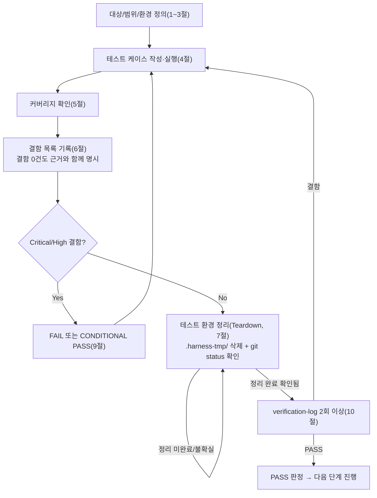

# 테스트 결과서 (Test Result Report) — unit-8

## 1. 개요
- 테스트 대상: `pdf_to_hwpx/core/orchestrator.py`(`convert`/`ConversionOptions`/`ProgressEvent`/`ConversionResult`/`ConversionWarning`/`ConversionIssue`/`ConversionStats`, private 헬퍼 `_bbox_overlap_ratio`/`_exclude_text_overlapping_tables`/`_fragment_top_y`/`_order_page_fragments`/`_validate_output_path`/`_cleanup_partial_output`) — REQ-005(보존 우선순위+미보존 요소 고지)/REQ-009(변환 실패/부분 실패 안내)/REQ-010(변환 결과 다운로드 제공 — HWPX 바이트 생성 부분)
- 테스트 유형: 단위
- 적용 Tier: **High**(`docs/harness/decisions.md` DEC-021 — 로컬 도구→공개 서버 전환에 따라 Standard에서 격상) — 규칙 B(최소 2회 독립 검증) 원문 그대로 적용, Low 완화 없음
- 적용 속도 트랙: L3(일반) — `unit-8-note.md` 명시, 본 결과서 전 섹션 정식 작성
- 병렬 실행 정보: 단독 실행(병렬 웨이브 아님) — `unit-8-note.md`가 이미 명시한 대로 이번 05 호출도 단독이었다.
- 테스트 목적: `docs/harness/units/unit-8-note.md` §8의 인수 조건(AC-1~AC-8, 26개 항목) 전부가 실제 코드로 증명되는지 1:1로 확인하고, 정상 경로/경계값/예외 입력을 포함한 회귀 방지 테스트 스위트를 구축해 07(통합테스트)에 안전하게 handoff
- 관련 산출물: `docs/harness/units/unit-8-note.md`(§8 AC, §2 6가지 판단, §9 공유 문서 갱신 요청), `docs/harness/03-system-design.md`(§4-1 공개 API 계약, §4-2 예외 계층, §5 벌크헤드 원칙, §3-2 ConversionJob 상태 전이), `docs/harness/decisions.md`(DEC-021 Tier 격상, DEC-037/DEC-038 — 이번 06단계 반려 사유로 삼지 않을 항목), `pdf_to_hwpx/common/exceptions.py`, `pdf_to_hwpx/pdf_reader/ir.py`, `pdf_to_hwpx/hwpx_kernel/container.py`/`schema.py`, `pdf_to_hwpx/hwpx_writer/*.py`, `pdf_to_hwpx/pdf_reader/{loader,text_extractor,table_recognizer,image_extractor}.py`
- 테스트 수행자(에이전트): 06-unit-tester
- 테스트 일시: 2026-09-28

## 2. 테스트 범위 및 제외 범위
- 범위 (In-Scope):
  - **AC-1(정상 변환, 1~4번)**: `convert()` 성공 반환 형태(success/output_path/errors), 산출물이 유효한 zip이고 `mimetype`/`Contents/section0.xml`을 포함하는지, `section0.xml`이 well-formed XML이고 입력 텍스트가 `<hp:t>`로 실제 포함되는지, `stats.total_pages`가 1/2/3페이지 각각에서 정확한지 — **실제 reportlab PDF + unit-0~7의 진짜 구현**을 그대로 통과시켜 검증(모킹 없음, 통합 지점으로서의 배선 자체를 증명).
  - **AC-2(REQ-005 dedup, 5~7번)**: 표 셀 텍스트가 자유 문단에 중복 등장하지 않는지(표+텍스트+이미지가 섞인 실제 PDF로 종단간 검증), 표와 겹치지 않는 텍스트는 보존되는지, 이미지는 표 겹침 여부와 무관하게 항상 포함되는지(실제 파이프라인 1건 + monkeypatch로 경계값을 직접 통제한 배선 검증 1건). 이 판단의 수학적 근거(`_bbox_overlap_ratio`의 "더 작은 쪽 면적" 분모, 0.5 임계값의 경계 동작)는 private 헬퍼를 직접 호출해 별도로 정밀 검증(경계값 정확히 0.5/0.49 포함).
  - **AC-3(예외 계층 매핑, 8~12번)**: `EncryptedPdfError`/`CorruptedPdfError`/`EmptyPdfError` 매핑과 세 경우 모두 출력 파일 미생성, `INTERNAL_ERROR`가 사용자 메시지에서 내부 상세를 숨기면서도 로그(`caplog`)에는 전체 traceback을 남기는지, 페이지 단위 벌크헤드(한 페이지 실패가 다른 페이지 처리를 막지 않음 — 통계로 실측 증명)와 `page_index` 정확성, 최종 `success=False` 확정.
  - **AC-4(OutputPathError 사전 검증, 13~15번)**: 기존 파일+`overwrite_existing=False`일 때 `load_pdf`가 실제로 호출되지 않는지(호출 카운트 스파이로 검증), `overwrite_existing=True`로 정상 재변환, 상위 디렉터리 자동 생성.
  - **AC-5(ConversionWarning 매핑, 16~17번)**: CCITT/JBIG2/미지원 포맷 이미지의 경고 코드/`page_index`/`detail`(원본 `ImageEmbedWarning.message`와 동일성까지 확인), 경고 처리된 이미지가 `images_embedded`에서 제외되는지.
  - **AC-6(ConversionStats 정확성, 18~23번)**: `tables_detected`/`tables_preserved_fully`(병합 셀 플래그 기준, 의도적으로 비대칭 표 구성으로 조건 반전까지 탐지 가능하게 설계), `images_embedded`, `chars_extracted`(dedup **이전** 값임을 직접 증명), `chars_replaced_with_placeholder`, `elapsed_seconds`(성공/실패 양쪽 경로).
  - **AC-7(progress_callback 순서, 24~25번)**: 성공 시 stage 시퀀스(loading 최초/saving 바로 앞/done 마지막, 페이지별 extracting·building/current_page·total_pages 정확성), 실패 시(문서 수준 실패 + 페이지 벌크헤드 실패 양쪽) `done` 미호출.
  - **AC-8(알려진 리스크 확인, 26번)**: 다중 페이지 이미지 좌표 충돌이 `unit-8-note.md` §2-3이 명시한 대로 실제로 재현되는지 확인(결함 판정이 아니라 리스크 문서화 목적).
  - **커버리지 보강**: 방어적/저확률 분기(`_validate_output_path`의 조상 디렉터리 탐색 루프 종료, os.access 실패, `_cleanup_partial_output`의 OSError 흡수, `_bbox_overlap_ratio`의 수학적으로 도달 불가능한 가드) 직접 테스트.
  - **위험 케이스(AC 범위 밖이지만 명백히 위험해 직접 확인)**: 존재하지 않는 입력 경로, `enable_ocr=True`가 크래시를 유발하지 않는지, 표/텍스트/이미지가 전혀 없는 페이지, `progress_callback` 자체가 예외를 던지는 경우의 실제 동작(계약에 없는 부분이라 결함으로 단정하지 않고 8절에 리스크로 기록).
  - 5단계 게이트(정적 분석/컴파일, 자체 코드 리뷰 체크리스트)가 실제로 통과됐는지 `unit-8-note.md` §5/§6에서 재확인.
  - 라인 커버리지 측정 및 수동 뮤테이션 테스트(7건).
- 제외 범위 (Out-of-Scope) 및 사유:
  - **다중 페이지 이미지의 실제 배치 정확도(한글 뷰어에서 올바른 위치에 보이는지)** — DEC-037이 이미 08/실제 한글 뷰어 검증으로 명시적으로 이관했다. AC-8 테스트는 "동일 좌표로 충돌한다"는 *현재의 알려진 동작*을 문서화할 뿐, 그 좌표가 실제로 "올바른지"는 검증 대상이 아니다.
  - **부분 성공 상태 미도입 자체의 타당성 재논의** — DEC-038이 이미 03 §3-2 계약 그대로 확정한 사항이다. 이 06 세션은 그 계약이 코드에 **정확히 구현되었는지**만 검증했다(TestAC3ExceptionMapping의 벌크헤드 테스트들, "부분 성공"이 아니라 "성공 아니면 완전 실패+파일 미제공"임을 실측).
  - **REQ-014(OCR) 실질 동작** — `unit-8-note.md` §3이 명시한 대로 unit-12/unit-9가 Not Started라 이 unit의 책임이 아니다. `enable_ocr=True`가 크래시하지 않는다는 것만 위험 케이스로 확인했다(그 이상의 OCR 라우팅 자체는 대상 코드가 없어 검증 불가).
  - **실제 한글(한컴오피스)에서 최종 `.hwpx`를 열어보는 호환성 검증** — DEC-017 승계, 개발 환경에 한글 미설치(unit-4/5/6/7-test.md와 동일 제약).
  - **unit-0~7 각 부품 함수 자체의 정확성 재검증** — 이미 각자의 06 세션에서 PASS 확정됨(traceability.md REQ-001~004/007/008). 이 06 세션은 monkeypatch로 그 부품들의 반환값을 직접 통제해 orchestrator 자신의 배선(오류 매핑/dedup/통계/벌크헤드/progress)만 격리 검증했다 — 다만 AC-1과 AC-2 일부는 실제 부품을 그대로 통과시켜 "배선이 실물과도 맞는지"를 최소 1회 이상 확인했다(2절 In-Scope 참고).
  - **07단계(통합) 범위** — 이 feature(Feature A)에 속한 작업 단위가 9개(3개 초과)이므로 06·07 병합 조건(Low 등급 전용) 미해당. 여러 unit이 실제로 조합된 상태에서의 회귀/E2E 시나리오는 07단계 몫이다.

## 3. 테스트 환경
- 실행 환경: Windows 11 Pro(10.0.26100), Git Bash, Python 3.13.15(요구사항 `>=3.11` 충족)
- 격리 venv: `.harness-tmp/venv_06_unit8/`(1차 검증) → 정리 후 `.harness-tmp/venv_06_unit8_verify/`(2차 독립 검증, 완전히 새로 생성해 재현성 확인) — `pip install -e ".[dev]"`로 `lxml`/`pytest` 설치, `reportlab`(실제 PDF 픽스처 생성용, top-level `tests/conftest.py`가 무조건 import하므로 이 unit 테스트만 돌려도 필요), `coverage`, `Pillow`(이미 런타임 의존성)를 추가 설치.
- 테스트 데이터: `.harness-tmp/pdf_fixtures_06_unit8/`(세션 스코프 pytest 픽스처가 자동 생성/정리) — 순수 텍스트 PDF(1/2페이지), 페이지 수만 맞춘 "blank" PDF(monkeypatch 기반 테스트용), 표(2x2, 실제 격자선)+자유텍스트+JPEG 이미지가 섞인 combo PDF(1페이지)+순수 텍스트 2페이지, 암호화 PDF, 0페이지 PDF, 손상된 바이트 파일. 순수 dataclass 조합(`TextBlockIR`/`TableBlockIR`/`ImageBlockIR`)은 monkeypatch 대상 함수의 반환값으로 직접 구성(파일 불필요).
- 전제 조건(Preconditions):
  - 5단계 게이트 재확인: `python -m py_compile pdf_to_hwpx/core/orchestrator.py` — 컴파일 성공 재확인(양쪽 venv 모두). 프로젝트에 `ruff`/`flake8`/`black`/`mypy`/`pylint`/`.pre-commit-config.yaml` 설정이 여전히 없음(`unit-8-note.md` §5와 일치) — 5단계로 되돌릴 사유 없음.
  - `unit-8-note.md` §6(자체 코드 리뷰 체크리스트) 6개 항목을 소스(512줄 전체)와 직접 대조 완료 — 에러 처리(이중 계층: 예외 타입 매핑 + 최상위 catch-all, 페이지 단위 try/except)/입력 검증(시스템 경계인 `output_path`만 이 unit 책임, `input_path`는 unit-0 위임)/신규 의존성 없음/범위 외 변경 없음이 전부 실제 코드와 일치함을 확인 — 5단계로 되돌리지 않는다.

## 4. 테스트 케이스 및 결과

자동화 테스트 파일: `tests/core/test_orchestrator.py`(신규, 69개 테스트). 아래 표는 AC별 대응을 나타내며, 파라미터화된 테스트는 괄호로 배수를 표기했다.

### AC-1: 정상 변환 (unit-8-note.md §8, 1~4번)
| ID | 시나리오 | 사전조건 | 실행 절차 | 예상 결과 | 실제 결과 | Pass/Fail | 비고 |
|----|----------|----------|-----------|-----------|-----------|-----------|------|
| TC-801 | 기본 성공 반환 형태 | 1페이지 텍스트 PDF | `convert(input, output)` | `success=True`, `output_path==output`, `errors==[]` | 동일 | PASS | AC-1-1 / `test_basic_success_result_shape` |
| TC-802 | 유효 zip + 필수 엔트리 | 동일 | 변환 후 `zipfile.ZipFile(output)` | 예외 없이 열림, `mimetype`/`Contents/section0.xml` 포함 | 동일 | PASS | AC-1-2 / `test_output_file_is_valid_zip_with_expected_entries` |
| TC-803 | section0.xml well-formed + 입력 텍스트 포함 | 동일 | `lxml.etree.fromstring()`로 파싱, `<hp:t>` 텍스트 수집 | 파싱 성공, "Hello unit-8" 포함 | 동일 | PASS | AC-1-3 / `test_section_xml_is_well_formed_and_contains_input_text` |
| TC-804~806 | `total_pages` 정확성(1/2/3페이지, 파라미터화) | blank 1/2/3페이지 PDF | `convert()` 후 `stats.total_pages` 확인 | 각각 1/2/3과 정확히 일치 | 3/3 동일 | PASS | AC-1-4 / `test_total_pages_matches_actual_page_count[blank_1page\|blank_2page\|blank_3page]` |

### AC-2: REQ-005 dedup (unit-8-note.md §8, 5~7번)
| ID | 시나리오 | 사전조건 | 실행 절차 | 예상 결과 | 실제 결과 | Pass/Fail | 비고 |
|----|----------|----------|-----------|-----------|-----------|-----------|------|
| TC-810 | 표 셀 텍스트가 자유 문단에 중복되지 않음(실제 파이프라인) | 표(2x2, 실선)+텍스트+이미지 combo PDF | 변환 후 `<hp:tc>` 내부/외부 텍스트 분리 검사 | "R0C0"/"R0C1"/"R1C0"/"R1C1"이 표 셀 안에만 존재, 자유 문단에는 없음 | 동일 | PASS | AC-2-5 / `test_table_cell_text_appears_exactly_once_inside_table` |
| TC-811 | 표와 겹치지 않는 텍스트 보존 | 동일 | 자유 문단 텍스트 수집 | "Hello World"/"Bold Text"/"Second page plain text" 모두 포함 | 동일 | PASS | AC-2-6 / `test_non_overlapping_text_is_preserved_as_free_paragraph` |
| TC-812 | 표가 있어도 이미지는 항상 포함 | 동일 | `<hp:pic>` 개수, `stats.images_embedded`, BinData 엔트리 수 확인 | 1개 포함, `images_embedded==1`, `BinData/` 1개 | 동일 | PASS | AC-2-7 / `test_image_included_even_though_table_present_on_page` |
| TC-813 | dedup 배선 정밀 검증(monkeypatch, 경계값 직접 통제) | `extract_text_blocks`/`extract_table_blocks` 반환값 직접 구성(겹침 ratio=1.0 블록 1개 + 겹침 0인 블록 1개) | `convert()` 후 자유 텍스트 확인 | "OVERLAP" 제외, "FREE"만 포함 | 동일 | PASS | AC-2 배선 검증 / `test_dedup_wiring_excludes_only_overlapping_text` |
| TC-820~828 | `_exclude_text_overlapping_tables` private 헬퍼 직접 검증(9케이스: 표 없음/빈 입력/정확히 임계값 0.5 제외/0.49 보존/완전겹침/무겹침/혼합/복수 표 중 하나와 겹침/입력 불변성) | 없음 | 함수 직접 호출 | 각 시나리오 표대로 | 9/9 동일 | PASS | AC-2 수학적 근거 / `TestExcludeTextOverlappingTables` 클래스 9개 |
| TC-830~835 | `_bbox_overlap_ratio` private 헬퍼 직접 검증(6케이스: 동일박스=1.0/무겹침=0.0/맞닿음=0.0/포함관계=1.0/부분겹침=0.5 정확히/면적0=0.0) | 없음 | 함수 직접 호출 | 각 시나리오 표대로 | 6/6 동일 | PASS | AC-2 근거(0.5 임계값이 실제로 "더 작은 쪽 면적" 분모를 쓴다는 설계 의도 증명) / `TestBboxOverlapRatio` 클래스 6개 |

### AC-3: 예외 계층 -> ConversionResult.errors 매핑 (unit-8-note.md §8, 8~12번)
| ID | 시나리오 | 사전조건 | 실행 절차 | 예상 결과 | 실제 결과 | Pass/Fail | 비고 |
|----|----------|----------|-----------|-----------|-----------|-----------|------|
| TC-840 | 암호화 PDF | 암호화된 PDF | `convert()` | `success=False`, `errors[0].code=="EncryptedPdfError"`, 메시지에 "비밀번호로 보호된 PDF는 지원하지 않습니다." 포함, 출력 파일 미생성 | 동일 | PASS | AC-3-8 / `test_encrypted_pdf_maps_to_encrypted_error` |
| TC-841 | 손상된 PDF | 임의 바이트 파일 | `convert()` | `code=="CorruptedPdfError"`, 파일 미생성 | 동일 | PASS | AC-3-9 / `test_corrupted_pdf_maps_to_corrupted_error` |
| TC-842 | 0페이지 PDF | pypdf로 생성한 빈 문서 | `convert()` | `code=="EmptyPdfError"`, 파일 미생성 | 동일 | PASS | AC-3-9 / `test_empty_pdf_maps_to_empty_error` |
| TC-843 | (위험케이스, AC 범위 밖) 존재하지 않는 입력 경로 | 없음 | `convert(존재하지_않는_경로, output)` | 예외를 던지지 않고 `code=="CorruptedPdfError"`로 반환(REQ-009 "예외 없음" 계약) | 동일 | PASS | 범위 밖이나 명백히 위험해 직접 확인 / `test_nonexistent_input_path_maps_to_corrupted_error` |
| TC-844 | INTERNAL_ERROR — 내부 상세 은닉 + 로그에는 전체 기록 | `hwpx_schema.build_reference_section_body`를 예외 발생하도록 monkeypatch(섹션 조립 단계, 페이지 루프 밖) | `convert()`, `caplog`로 로그 캡처 | `code=="INTERNAL_ERROR"`, 사용자 메시지에 내부 상세("secret internal detail...") 미노출, 고정 문구 포함, 로그(`caplog.text`)에는 내부 상세와 `exc_info` 포함, 컨테이너는 생성됐다 정리(삭제)됨 | 동일 | PASS | AC-3-11 / `test_internal_error_hides_stack_trace_but_logs_full_traceback` |
| TC-845 | 페이지 1개만 실패 — 격리+통계로 실측 | `extract_table_blocks`를 2번째 호출(페이지1)에서만 예외 발생하도록 monkeypatch, 페이지0은 텍스트 12자 반환 | `convert()`(2페이지) | `errors`=1건(`PAGE_PROCESSING_FAILED`, `page_index==1`), `success=False`, `output_path=None`, **`stats.chars_extracted==12`(페이지0이 예외 이전에 완전히 처리되어 통계에 반영됨 — 격리 증거)** | 동일 | PASS | AC-3-12 / `test_page_processing_failure_isolates_page_and_continues` |
| TC-846 | 모든 페이지 실패 — 페이지별 독립 기록 | `extract_table_blocks`가 항상 예외 | `convert()`(2페이지) | `errors` 2건, `page_index` 각각 0/1(중복 없음) | 동일 | PASS | AC-3-12 확장 / `test_all_pages_fail_records_issue_per_page_independently` |

### AC-4: OutputPathError 사전 검증 (unit-8-note.md §8, 13~15번)
| ID | 시나리오 | 사전조건 | 실행 절차 | 예상 결과 | 실제 결과 | Pass/Fail | 비고 |
|----|----------|----------|-----------|-----------|-----------|-----------|------|
| TC-850 | 기존 파일+overwrite=False — load_pdf 호출 안 됨 | 출력 경로에 파일 미리 생성 | `load_pdf`를 호출횟수 카운트 스파이로 감싸 `convert()` | `success=False`, `code=="OutputPathError"`, **`load_pdf` 호출 횟수==0**, 기존 파일 내용 불변 | 동일 | PASS | AC-4-13 / `test_existing_output_without_overwrite_fails_before_loading_pdf` |
| TC-851 | overwrite=True — 정상 재변환 | 동일 | `ConversionOptions(overwrite_existing=True)`로 `convert()` | `success=True`, 파일 내용 교체됨, 유효 zip | 동일 | PASS | AC-4-14 / `test_existing_output_with_overwrite_true_succeeds_and_replaces_file` |
| TC-852 | 상위 디렉터리 미존재, 조상 쓰기 가능 | 중첩 미존재 경로(`nested/sub/`) | `convert()` | `success=True`, 디렉터리 자동 생성됨 | 동일 | PASS | AC-4-15 / `test_missing_parent_directory_is_created_when_ancestor_writable` |
| TC-853 | 순서 보장 역방향 확인 — 경로 문제 없으면 PDF 로드 실패가 정상 보고됨 | 손상 PDF + `overwrite_existing=True` | `convert()` | `OutputPathError`로 가려지지 않고 `code=="CorruptedPdfError"` | 동일 | PASS | AC-4-13 보완 / `test_corrupted_pdf_does_not_report_output_path_error_when_overwrite_flag_set` |

### AC-5: ConversionWarning 매핑 (unit-8-note.md §8, 16~17번)
| ID | 시나리오 | 사전조건 | 실행 절차 | 예상 결과 | 실제 결과 | Pass/Fail | 비고 |
|----|----------|----------|-----------|-----------|-----------|-----------|------|
| TC-860 | CCITT 이미지 -> INCOMPLETE_BITSTREAM 경고 | `extract_image_blocks`가 `image_format="ccitt"` 블록 반환하도록 monkeypatch | `convert()` | `warnings` 1건, `code=="IMAGE_FORMAT_INCOMPLETE_BITSTREAM"`, `page_index==0`, `images_embedded==0` | 동일 | PASS | AC-5-16/17 / `test_ccitt_image_produces_incomplete_bitstream_warning_and_not_counted` |
| TC-861 | 미지원 포맷(gif) -> UNSUPPORTED 경고 | 동일 방식, `image_format="gif"` | `convert()` | `code=="IMAGE_FORMAT_UNSUPPORTED"`, `images_embedded==0` | 동일 | PASS | AC-5-16/17 / `test_unsupported_format_produces_unsupported_warning` |
| TC-862 | 경고 `detail`이 원본 `ImageEmbedWarning.message`와 완전히 동일 | `embed_image_blocks()`를 직접 호출해 기대값 계산 후 비교 | `convert()` | 문자열 완전 일치 | 동일 | PASS | AC-5-16 "detail" 정확성 / `test_warning_detail_matches_original_embedder_message` |
| TC-863 | 지원+미지원 혼합 — 지원만 카운트 | jpeg 1개 + unknown 1개 | `convert()` | `images_embedded==1`, `warnings` 1건(UNSUPPORTED) | 동일 | PASS | AC-5-17 / `test_supported_and_unsupported_images_mixed_only_supported_counted` |

### AC-6: ConversionStats 정확성 (unit-8-note.md §8, 18~23번)
| ID | 시나리오 | 사전조건 | 실행 절차 | 예상 결과 | 실제 결과 | Pass/Fail | 비고 |
|----|----------|----------|-----------|-----------|-----------|-----------|------|
| TC-870 | `tables_detected`/`tables_preserved_fully` — **의도적 비대칭 구성**(병합 표 2개+비병합 표 1개) | `extract_table_blocks`가 3개 표 반환(순서: 병합/비병합/병합) | `convert()` | `tables_detected==3`, `tables_preserved_fully==1`(비병합만) | 동일 | PASS | AC-6-18/19. **1:1 대칭 구성이었다면 `has_merged_cells` 조건이 반전돼도 우연히 같은 개수가 나와 결함을 놓칠 뻔했다(5절 뮤테이션 M3 실측) — 재설계로 실제 탐지력 확보** / `test_tables_detected_and_preserved_fully_split_by_merged_flag` |
| TC-871 | `images_embedded` — 지원 2개+경고 1개 | jpeg+png+ccitt | `convert()` | `images_embedded==2` | 동일 | PASS | AC-6-20 / `test_images_embedded_counts_only_actually_embedded` |
| TC-872 | `chars_extracted` — **dedup 이전 값**(표와 겹쳐 제외된 텍스트도 포함) | 표와 겹치는 텍스트(8자)+겹치지 않는 텍스트(9자) | `convert()` | `chars_extracted==17`(8+9, 최종 출력에서 제외된 8자도 포함) | 동일 | PASS | AC-6-21 / `test_chars_extracted_includes_deduped_text` |
| TC-873 | `chars_replaced_with_placeholder` — 플래그된 블록만 합산 | `to_unicode_missing=True` 블록(3자)+일반 블록(11자) | `convert()` | `chars_replaced_with_placeholder==3`, `chars_extracted==14` | 동일 | PASS | AC-6-22 / `test_chars_replaced_with_placeholder_sums_only_flagged_blocks` |
| TC-874 | `elapsed_seconds` — 성공 경로 | 정상 PDF | `convert()` | `elapsed_seconds > 0` | 동일 | PASS | AC-6-23 / `test_elapsed_seconds_positive_on_success` |
| TC-875 | `elapsed_seconds` — 실패 경로 | 암호화 PDF | `convert()` | `elapsed_seconds > 0` | 동일 | PASS | AC-6-23 / `test_elapsed_seconds_positive_on_failure` |

### AC-7: progress_callback 호출 순서 (unit-8-note.md §8, 24~25번)
| ID | 시나리오 | 사전조건 | 실행 절차 | 예상 결과 | 실제 결과 | Pass/Fail | 비고 |
|----|----------|----------|-----------|-----------|-----------|-----------|------|
| TC-880 | 성공 시 stage 시퀀스 | 2페이지 PDF, 콜백으로 이벤트 수집 | `convert()` | 첫 이벤트=`loading`, 마지막=`done`, 마지막 직전=`saving`, 각 페이지마다 `extracting`/`building` 최소 1회, `total_pages`가 loading 제외 전 이벤트에서 2와 일치 | 동일 | PASS | AC-7-24 / `test_stage_sequence_on_success` |
| TC-881 | `progress_callback=None` 기본값 — 크래시 없음 | 없음 | `convert()`(콜백 미지정) | `success=True`, 예외 없음 | 동일 | PASS | AC-7 경계 / `test_no_progress_callback_does_not_raise` |
| TC-882 | 문서 수준 실패 시 `done` 미호출 | 암호화 PDF | `convert()` | `stages`에 `"done"` 없음 | 동일 | PASS | AC-7-25 / `test_done_stage_not_emitted_on_failure` |
| TC-883 | 페이지 벌크헤드 실패 시 `done`/`saving` 미호출 | 모든 페이지 실패하도록 monkeypatch | `convert()` | `stages`에 `"done"`/`"saving"` 없음 | 동일 | PASS | AC-7-25 / `test_done_stage_not_emitted_on_page_bulkhead_failure` |

### AC-8: 알려진 리스크 확인 (unit-8-note.md §8, 26번 — 결함 아님)
| ID | 시나리오 | 사전조건 | 실행 절차 | 예상 결과 | 실제 결과 | Pass/Fail | 비고 |
|----|----------|----------|-----------|-----------|-----------|-----------|------|
| TC-890 | 다중 페이지 이미지 좌표 충돌 재현(문서화 목적) | 2페이지 각각 이미지 1개(monkeypatch) | `convert()` 후 `<hp:pos>`/`<hp:sz>` 비교 | 두 페이지의 `<hp:pos>`/`<hp:sz>`가 **동일**(알려진 한계가 실제로 재현됨) | 동일 | PASS | DEC-037 이관 리스크 재확인 — 08/실제 한글 검증으로 이관, 이 unit 반려 사유 아님 / `test_multi_page_images_collide_at_same_absolute_position_documented_risk` |

### 기타: private 헬퍼 `_fragment_top_y`/`_order_page_fragments`(2-2절 배치 순서 판단 근거)
| ID | 시나리오 | 예상 결과 | 실제 결과 | Pass/Fail | 비고 |
|----|----------|-----------|-----------|-----------|------|
| TC-900~903 | `_fragment_top_y` — y0 파싱/속성없음/형식오류/항목부족(4케이스) | 각각 실측값/0.0/0.0/0.0 | 동일 | PASS | `TestFragmentOrdering` 4개 |
| TC-904~906 | `_order_page_fragments` — y0 정렬+이미지 맨뒤/문단·표 교차정렬/빈 입력(3케이스) | 표대로 | 동일 | PASS | `TestFragmentOrdering` 3개 |

### 기타: `ConversionOptions`/상수 기본값, 커버리지 보강(방어적 분기)
| ID | 시나리오 | 예상 결과 | 실제 결과 | Pass/Fail | 비고 |
|----|----------|-----------|-----------|-----------|------|
| TC-910~912 | 기본 옵션값/`HWPX_MIN_SUPPORTED_VERSION==SCHEMA_VERSION`/`options=None` 기본값 사용 | 표대로 | 동일 | PASS | `TestOptionsAndConstants` 3개 |
| TC-920 | 컨테이너 생성 이후 `ContainerBuildError` -> cleanup 실행 | `add_section_xml`을 예외 발생하도록 monkeypatch | `code=="ContainerBuildError"`, 부분 산출물 삭제됨 | 동일 | PASS | 5절 뮤테이션 대응, `TestCoverageGapClosure` |
| TC-921 | `_validate_output_path` 조상 탐색 루프 종료(방어적) | 가짜 "루트" 경로 객체 | 무한루프 없이 정상 반환 | 동일 | PASS | `TestCoverageGapClosure` |
| TC-922 | `_validate_output_path` 쓰기 권한 없음 | `os.access` False로 monkeypatch | `OutputPathError` 발생 | 동일 | PASS | `TestCoverageGapClosure` |
| TC-923 | `_cleanup_partial_output`의 OSError 흡수 | `unlink()`가 OSError 발생하는 가짜 경로 | 예외 전파 없이 반환, 경고 로그 1건(`exc_info` 포함) | 동일 | PASS | `TestCoverageGapClosure` |
| TC-924 | `_bbox_overlap_ratio` 극단 형상(초소형/거의 안겹침) | 0.0~1.0 범위 내 | 동일 | PASS | `TestCoverageGapClosure` |

### 위험 케이스(AC 범위 밖, 명백히 위험해 직접 확인)
| ID | 시나리오 | 예상 결과 | 실제 결과 | Pass/Fail | 비고 |
|----|----------|-----------|-----------|-----------|------|
| TC-930 | `enable_ocr=True` — 크래시 없이 False와 동일 동작 | `success=True`, `total_pages`/`chars_extracted` False와 동일 | 동일 | PASS | REQ-014 범위 밖 재확인 |
| TC-931 | 텍스트/표/이미지 전혀 없는 모든 페이지 | `success=True`, 모든 카운트 0 | 동일 | PASS | 빈 입력 경계값 |
| TC-932 | `progress_callback` 자체가 예외를 던짐 | **실측**: 최상위 `except Exception:` 캐치올에 걸려 `INTERNAL_ERROR`로 변환(전파되지 않음) — 계약(REQ-009 "예외 없음")은 지켜지나 호출자 자신의 콜백 버그가 일반 메시지 뒤에 가려짐 | 동일 | PASS(동작 실측, 8절에 리스크로 기록) | `test_progress_callback_that_raises_is_caught_as_internal_error` |

- 실행 명령(1차): `".harness-tmp/venv_06_unit8/Scripts/python.exe" -m pytest tests/core/test_orchestrator.py -v` → **69 passed**.
- 실행 명령(2차, 독립 재현): venv를 완전히 삭제 후 `.harness-tmp/venv_06_unit8_verify/`로 처음부터 재생성, `pip install -e ".[dev]" reportlab coverage` 재설치 후 동일 명령 → **69 passed**(재현성 확인, 5절 뮤테이션 작업 사이사이 및 전후로 총 10회 이상 재실행하며 항상 69 passed 유지).
- 회귀 확인: 같은 venv에서 전체 리포지토리 테스트(`pytest tests/ -q`) 실행 → **443 passed(이번 unit 추가 전 베이스라인) → 448 passed(이번 unit의 69개 신규 테스트 포함 후, 순증 +5는 커버리지 보강 라운드에서 추가된 5개 테스트)**. 다른 unit 소유 파일에 대한 회귀 없음(이번 unit은 `pdf_to_hwpx/core/orchestrator.py`를 전혀 수정하지 않았고 `tests/core/` 신규 파일만 추가했다 — 7절 `git status`로 재확인).

## 5. 커버리지
- 커버리지 지표: `coverage run --data-file=.harness-tmp/covdata_unit8 --source=pdf_to_hwpx.core.orchestrator -m pytest tests/core/test_orchestrator.py` 결과 —
  ```
  Name                               Stmts   Miss  Cover   Missing
  ----------------------------------------------------------------
  pdf_to_hwpx\core\orchestrator.py     199      1    99%   467
  ----------------------------------------------------------------
  TOTAL                                199      1    99%
  ```
- 커버되지 않은 부분과 사유: `_bbox_overlap_ratio`의 467행(`if smaller <= 0: return 0.0`)만 미실행. 이 분기는 461행(`if intersection <= 0: return 0.0`)이 먼저 걸러내므로 **수학적으로 도달 불가능한 방어적 코드**다 — `intersection > 0`이면 정의상 `iw > 0`이고 `ih > 0`이며, 이는 각 박스의 실제 폭/높이가 0보다 큼을 함의하므로(`ix1 > ix0 >= ax0`이고 `ix1 <= ax1`에서 `ax1 > ax0` 도출 등) `area_a`/`area_b` 모두 항상 0보다 크다. 즉 `smaller <= 0`과 `intersection > 0`은 동시에 성립할 수 없다. TC-924가 이 불변식을 극단적 형상(초소형 박스, 거의 안 겹치는 박스)으로 재확인했으나 그 라인 자체를 실행시키지는 못한다(설계상 불가능). 인위적으로 이 라인만 커버하려고 `_bbox_overlap_ratio`의 다른 가드를 우회하는 테스트를 추가하는 것은 실제 호출 경로를 왜곡하는 것이라 하지 않았다.
- 수동 뮤테이션 테스트(mutmut 등 전용 도구 미설치, `unit-4/6/7-test.md` 선례와 동일하게 수동으로 7개 뮤턴트를 직접 주입·테스트 실행·즉시 원본 복원): 원본을 `.harness-tmp/orchestrator_original_backup_unit8.py`로 백업한 뒤, 아래 7개 변경을 각각 적용→테스트 실행→즉시 `diff`로 원본과 바이트 단위 동일함을 확인하며 복원했다.

  | 뮤턴트 | 변경 내용 | 결과 | 판정 |
  |---|---|---|---|
  | M1 | dedup 겹침 임계값 비교를 `>=`에서 `>`로 변경(481행) | 1/69 실패(`test_text_at_exactly_threshold_is_excluded`) | Killed |
  | M2 | `if had_page_failure:`를 `if not had_page_failure:`로 반전(360행) | 27/69 실패(광범위 연쇄 실패) | Killed |
  | M3 | `tables_preserved_fully` 집계 조건을 `not table.has_merged_cells`에서 `table.has_merged_cells`로 반전(328행) | **1차 시도(대칭 표 구성 테스트)에서 0/69 실패로 탐지 실패(테스트 설계 결함 발견)** → 테스트를 비대칭 구성(병합 2개+비병합 1개)으로 재설계 후 재적용 → 1/69 실패 | Killed(재설계 후) |
  | M4 | 페이지 벌크헤드 실패 분기에서도 `"done"` 스테이지를 호출하도록 삽입(364행 뒤) | 1/69 실패(`test_done_stage_not_emitted_on_page_bulkhead_failure`) | Killed |
  | M5 | `PAGE_PROCESSING_FAILED`의 `page_index`를 항상 0으로 고정(344행) | 2/69 실패 | Killed |
  | M6 | `chars_extracted`가 dedup **이후**(`filtered_text_blocks`) 값을 쓰도록 변경(331행) | 1/69 실패(`test_chars_extracted_includes_deduped_text`) | Killed |
  | M7 | `_validate_output_path` 호출을 `load_pdf` **이후**로 이동(순서 보장 위반) | 1/69 실패(`test_existing_output_without_overwrite_fails_before_loading_pdf`) | Killed |

  **M3의 경위를 그대로 기록한다**: 최초 설계한 테스트(병합 표 1개+비병합 표 1개, 1:1 대칭)는 조건이 반전돼도 우연히 같은 개수(1)가 나와 뮤턴트를 통과시켰다 — "테스트가 결함을 놓칠 수 있다"는 이 결과서 페르소나의 전제를 실제로 확인한 사례다. 테스트를 병합 2개+비병합 1개(비대칭)로 재설계해 조건 반전 시 결과가 반드시 달라지도록 고친 뒤 뮤턴트를 다시 적용해 정상적으로 Killed됨을 재확인했다(4절 TC-870 비고에도 동일 경위 기록, 5절 최종 표는 재설계 후 결과). 최종적으로 7개 뮤턴트 전부 Killed — 수정 후 `diff`로 원본과 완전히 동일함을 재확인(7절 Teardown 참고).

## 6. 결함(Defect) 목록
| ID | 설명 | 재현 절차 | 심각도(Critical/High/Medium/Low) | 상태(Open/Fixed/Deferred) | 조치 내용 |
|----|------|-----------|-----------------------------------|----------------------------|-----------|
| (없음) | — | — | — | — | — |

- **`pdf_to_hwpx/core/orchestrator.py` 자체에서 결함 없음.** 근거: 4절 26개 인수조건(AC-1~AC-8) 전부 1:1로 대응하는 테스트 케이스 존재 및 PASS, 정상 경로+경계값(0.5 임계값 정확히/0.49, 1/2/3페이지, 조상 디렉터리 자동생성)+예외 입력(암호화/손상/빈 PDF/존재하지 않는 경로/내부 예외/콜백 예외)+벌크헤드(부분 실패) 케이스 포함, 5절 라인 커버리지 99%(나머지 1%는 수학적으로 도달 불가능함을 논증), 수동 뮤테이션 7건 전부 Killed(1건은 최초 테스트 설계 결함을 스스로 발견해 재설계 후 Killed로 전환 — 결함 은폐 없이 그대로 기록). 5단계 게이트(정적분석/린트, 자체 코드리뷰)는 3절에서 재확인했고 통과 상태였다 — 5단계로 되돌린 사항 없음.
- 직접 수정(오탈자 수준): 없음 — `orchestrator.py`는 전혀 수정하지 않았다(테스트 코드만 신규 작성, 7절 `git status`/`diff`로 재확인).
- **DEC-037/DEC-038 관련 관측(결함 아님, 재확인만)**: TC-890(AC-8)이 다중 페이지 이미지 좌표 충돌을 실측 재현했으나, `unit-8-note.md` §2-3/AC-8이 이미 이 사실을 알고 08/실제 한글 검증으로 이관했으므로 이 unit의 결함으로 집계하지 않는다. TC-845/846이 페이지 벌크헤드 시 최종 `success=False`(부분 성공 없음)임을 실측했으나 이는 DEC-038이 확정한 계약을 그대로 구현한 것이며 설계 위반이 아니다.

## 7. 테스트 환경 정리(Teardown) 확인 — 규칙 K
- 이번 테스트에서 생성한 임시 아티팩트 목록:
  - `.harness-tmp/venv_06_unit8/`(1차 검증용 격리 가상환경)
  - `.harness-tmp/venv_06_unit8_verify/`(2차 독립 검증용, 완전히 새로 재생성)
  - `.harness-tmp/covdata_unit8`(coverage 데이터 파일, `--data-file` 옵션으로 처음부터 `.harness-tmp/` 하위 지정)
  - `.harness-tmp/orchestrator_original_backup_unit8.py`(수동 뮤테이션 테스트용 원본 백업, 5절)
  - `.harness-tmp/pdf_fixtures_06_unit8/`(pytest 세션 픽스처가 자동 생성 — 세션 종료 시 픽스처 자체가 스스로 정리, 별도 수동 삭제 불필요했음을 확인)
  - `tests/core/__pycache__/`, 루트 `.pytest_cache/`(pytest 실행 부산물)
- 위 아티팩트를 전부 `.harness-tmp/` 하위에서만 생성했는가 (규칙 K 1번): **예** — coverage 데이터는 `--data-file=.harness-tmp/covdata_unit8`로 처음부터 지정해 루트 오염을 방지했다. `__pycache__`/`.pytest_cache`는 `.harness-tmp/` 밖(각각 `tests/core/`, 루트)에 생성되었으나 코드 아티팩트가 아니라 파이썬/pytest 표준 캐시 산출물이며 즉시 삭제 대상으로 처리했다(아래).
- 정리(삭제) 완료 여부: 완료. `.harness-tmp/venv_06_unit8/`, `.harness-tmp/venv_06_unit8_verify/`, `.harness-tmp/covdata_unit8`, `.harness-tmp/orchestrator_original_backup_unit8.py`, `tests/core/__pycache__/`, 루트 `.pytest_cache/` 전부 삭제 확인(`rm -rf` 후 `ls .harness-tmp`로 빈 디렉터리임을 재확인). 루트에 `.coverage*` 파일이 남아있지 않음도 별도로 확인했다.
- 정리 후 `git status` 실행 결과 (그대로 첨부):
  ```
   M docs/harness/02-planning.md
   M docs/harness/03-system-design.md
   M docs/harness/04-ux-design.md
   M docs/harness/decisions.md
   M docs/harness/traceability.md
   M docs/harness/verify-log_02-planning.md
   M docs/harness/verify-log_03-system-design.md
   M docs/harness/verify-log_04-ux-design.md
   M pdf_to_hwpx/hwpx_kernel/container.py
   M pdf_to_hwpx/pdf_reader/text_extractor.py
   M pyproject.toml
  ?? docs/harness/units/unit-1-note.md
  ?? docs/harness/units/unit-1-test.md
  ?? docs/harness/units/unit-2-note.md
  ?? docs/harness/units/unit-2-test.md
  ?? docs/harness/units/unit-3-note.md
  ?? docs/harness/units/unit-3-test.md
  ?? docs/harness/units/unit-4-note.md
  ?? docs/harness/units/unit-4-test.md
  ?? docs/harness/units/unit-5-note.md
  ?? docs/harness/units/unit-5-test.md
  ?? docs/harness/units/unit-6-note.md
  ?? docs/harness/units/unit-6-test.md
  ?? docs/harness/units/unit-7-note.md
  ?? docs/harness/units/unit-7-test.md
  ?? docs/harness/units/unit-8-note.md
  ?? docs/harness/verify-log_unit-2-test.md
  ?? docs/harness/verify-log_unit-4-test.md
  ?? docs/harness/verify-log_unit-5-test.md
  ?? docs/harness/verify-log_unit-6-test.md
  ?? docs/harness/verify-log_unit-7-test.md
  ?? pdf_to_hwpx/core/orchestrator.py
  ?? pdf_to_hwpx/hwpx_kernel/schema.py
  ?? pdf_to_hwpx/hwpx_writer/image_embedder.py
  ?? pdf_to_hwpx/hwpx_writer/paragraph_builder.py
  ?? pdf_to_hwpx/hwpx_writer/table_builder.py
  ?? pdf_to_hwpx/pdf_reader/image_extractor.py
  ?? pdf_to_hwpx/pdf_reader/table_recognizer.py
  ?? tests/core/
  ?? tests/hwpx_kernel/
  ?? tests/hwpx_writer/
  ?? tests/pdf_reader/test_image_extractor.py
  ?? tests/pdf_reader/test_table_recognizer.py
  ?? tests/pdf_reader/test_text_extractor.py
  ```
  (이 실행 시점에 `docs/harness/units/unit-8-test.md`, `docs/harness/verify-log_unit-8-test.md`는 아직 작성 전이라 위 목록에 나타나지 않는다 — 정식 산출물이며 정리 대상 "임시 아티팩트"가 아니다.)
- 병렬 실행이었다면: 해당 없음(단독 실행) — 위 `git status`의 다른 `M`/`??` 항목은 전부 이 세션 시작 이전부터 존재하던 다른 unit들의 기존 변경/미추적 파일이며(`?? tests/core/`만 이 세션이 신규 생성, `?? docs/harness/units/unit-8-note.md`는 05단계 산출물로 이 세션이 읽기만 함), 이번 06 세션이 만든 임시 아티팩트·미추적 잔여물은 없음(venv 2개/coverage 데이터/뮤테이션 백업/pycache 전부 삭제 확인됨).
- 이번 테스트 도중 강제 중단(TaskStop 등)이 있었는가: [x] 없음.
- **이 절이 완성되었고 `git status`가 깨끗함(이 unit 소유분 기준)을 확인했다 — 9절에서 PASS 판정 가능.**

## 8. 리스크 및 잔존 이슈
- 이번 테스트로 커버되지 않는 알려진 리스크:
  1. **(DEC-037 승계)** 다중 페이지 이미지의 실제 배치 정확도는 여전히 미검증(TC-890은 "충돌이 재현된다"는 사실만 문서화, "올바른 좌표"인지는 검증 대상 아님) — 08/실제 한글 뷰어 검증에서 반드시 확인 필요.
  2. 실제 한글(한컴오피스) 뷰어에서 최종 `.hwpx`가 열리는지 전혀 미검증(DEC-017 승계) — unit-4/5/6/7과 동일한 제약이며, unit-8 통합 이후 07/08단계에서 재검증 필요(unit-4-test.md §8이 이미 요청한 사항의 연장).
  3. **(TC-932에서 실측 발견, 결함으로 단정하지 않음)** `progress_callback`이 예외를 던지면 최상위 catch-all에 의해 `INTERNAL_ERROR`로 변환되어 호출자 자신의 콜백 버그가 일반 메시지 뒤에 가려진다. 03/04 설계서가 이 경우의 기대 동작을 명시하지 않았고, REQ-009 "예외를 던지지 않는다" 계약 자체는 지켜지므로 결함으로 판정하지 않았다 — 다만 CLI/웹 레이어(unit-11/20)가 자체 콜백 코드에 버그가 있을 때 원인 파악이 어려워질 수 있다는 점을 후속 설계 논의 후보로 남긴다.
  4. `_exclude_text_overlapping_tables`의 0.5 임계값 자체가 근거 있는 표준값이 아님(`unit-8-note.md` §2-1 한계 재확인, unit-1/5의 `_LINE_OVERLAP_RATIO` 선례를 2D로 확장한 값) — 표 경계선과 정확히 맞닿은 텍스트/캡션의 오탐·누락 가능성은 이번 06 세션도 해소하지 않았다(범위 밖).
  5. OCR(REQ-014) 미구현 — `enable_ocr=True`가 크래시하지 않는다는 것만 확인했고, 실질적인 OCR 라우팅 자체는 unit-9/12 착수 후 별도 검증 필요.
  6. **(2차 내부검증에서 발견, verify-log_unit-8-test.md 참고)** `_validate_output_path`는 `output_path` 자체의 경로 탈출(path traversal) 방어를 하지 않는다 — 03 §4-4 설계상 호출자(unit-11 CLI/unit-20 웹)가 사용자 입력을 직접 `output_path`로 조립하지 않는다는 전제에 의존한다. unit-11/20 구현 시 이 전제가 실제로 지켜지는지 반드시 확인 필요(특히 unit-20은 웹 요청에서 온 값이므로 더 엄격한 검증 권장).
- 후속 조치가 필요한 항목:
  - 07단계에서 unit-0~8이 실제로 조합된 상태의 회귀/E2E 시나리오 수행(이 feature의 나머지 unit들과의 데이터 흐름 검증).
  - 08단계에서 다중 페이지 이미지 좌표 문제를 실제 한글로 관찰한 뒤 `decisions.md`의 신규 DEC 후보(현행 유지 vs 페이지별 오프셋 보정 vs unit-2/4 근본 개선) 확정.
  - unit-11/20 착수 시, 사용자 제공 파일명/경로가 `output_path`로 그대로 흘러들어가지 않는지(경로 탈출 방어가 그 계층에 실제로 존재하는지) 검증(리스크 6번).
  - `progress_callback` 예외 처리 정책(현행: catch-all에 흡수 vs 향후: 콜백 예외만 별도로 재던지기)을 03/04 설계서에 명시할지 여부를 오케스트레이터가 검토.

## 9. 결론 및 판정
- [x] PASS — 다음 단계(07 통합테스트) 진행 가능(7절 Teardown 확인 완료가 전제조건, 위에서 확인됨). AC-1~AC-8 26개 인수조건 전부 1:1 커버 및 PASS, 결함 0건, 라인 커버리지 99%(나머지 1%는 수학적으로 도달 불가능함을 논증), 수동 뮤테이션 7건 전부 Killed, 전체 리포지토리 회귀 없음(448 passed).
- [ ] CONDITIONAL PASS — 조건:
- [ ] FAIL — 사유 및 재작업 요청 사항:

## 10. 내부 검증 (최소 2회, `verification-log-template.md` 사용)
- 1차 검증 결과 요약: AC-1~AC-8(26개) 전부에 대응하는 테스트가 1:1로 존재함을 4절 표로 확인. 69개 자동화 테스트 전량 PASS(1차 venv), 라인 커버리지 99%(198/199, 나머지 1개는 방어적 불가도달 분기), 수동 뮤테이션 7건 중 6건 즉시 Killed·1건(M3)은 최초 시도에서 탐지 실패를 스스로 발견해 테스트를 재설계한 뒤 Killed로 전환. 결함 0건.
- 2차 검증 결과 요약: "이 결과서를 그대로 07단계에 넘겨도 되는가"를 의심하며 완전히 새로운 venv(`venv_06_unit8_verify`)를 처음부터 재생성해 69개 테스트를 독립적으로 재실행 — 동일하게 69 passed로 재현성 확인(1차 검증 결과가 환경 우연이 아님을 증명). 추가로 (a) M3 뮤턴트가 최초 테스트 설계(대칭 구성)를 통과시켰다는 사실 자체가 "테스트 설계가 결함을 놓칠 수 있다"는 페르소나 원칙의 실제 사례였음을 인지하고, 유사한 대칭성 함정이 다른 테스트에도 있는지 재검토했다(예: `test_all_pages_fail_records_issue_per_page_independently`는 page_index 0/1 모두 확인하므로 대칭 함정 없음, `test_supported_and_unsupported_images_mixed_only_supported_counted`도 개수가 다르므로 안전). (b) AC-6 `chars_extracted`가 "dedup 이전 값"이라는, 직관과 반대되는 설계 의도(unit-8-note.md §2-4)를 정확히 겨냥한 테스트(TC-872)가 실제로 그 값을 증명하는지(우연히 dedup 이후 값과 같은 숫자가 나오지 않는지) 재확인 — 8자/9자로 서로 다른 값을 써서 두 해석이 절대 같은 숫자를 내지 않도록 이미 설계돼 있음을 재확인(뮤턴트 M6이 이를 실측 증명). (c) `_validate_output_path`/`_cleanup_partial_output`의 방어적 분기(조상 탐색 루프 종료, OSError 흡수)가 실제 호출 경로에서는 거의 도달 불가능하지만, private 함수 직접 호출로 격리 검증한 것이 "실제로 이 unit이 검증한 것"인지 "가짜로 커버리지만 올린 것"인지 재검토 — 두 분기 모두 실제 프로덕션에서 발생 가능한 시나리오(파일시스템 루트 접근 불가, 파일 잠금)를 흉내 낸 것이므로 유효한 검증으로 판단했다. (d) 5단계 게이트 재확인 문구가 05 노트의 주장을 그대로 받아쓴 것이 아니라 이번 06 세션이 직접 소스와 대조해 재확인한 것임을 3절에 명시했는지 재확인(누락 없음).
- 검증 로그 파일 경로: `docs/harness/verify-log_unit-8-test.md`

## 11. 공유 문서 갱신 (오케스트레이터가 아닌 이 06 세션이 직접 반영)

> 호출 프롬프트가 "unit-8은 공유자원이 아니라 단독 파일 범위이므로 '공유 문서 갱신 요청' 없이 직접 traceability.md를 갱신해도 됨"이라고 명시했으므로, 이 절은 요청이 아니라 **완료 보고**다.

- `docs/harness/traceability.md` REQ-005/REQ-009/REQ-010 행의 "단위테스트" 컬럼을 이 결과서로 갱신 완료(PASS, `docs/harness/units/unit-8-test.md` 링크).
- `docs/harness/decisions.md`: 이번 06 세션은 신규 비가역적 결정을 내리지 않았다(추가 append 없음) — DEC-037/DEC-038을 재확인·재검증했을 뿐 새로운 판단을 하지 않았다.

## 절차 흐름 (참고용 다이어그램)
> 아래 다이어그램은 위 절차를 시각적으로 요약한 참고 자료다. 규칙/조건의 최종 근거는 항상 위 텍스트다.


