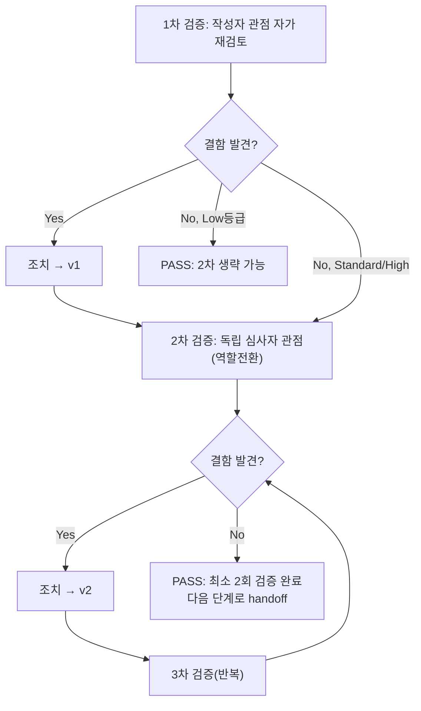

# 내부 검증 로그 (Internal Verification Log)

## 대상 산출물
- 파일: `docs/harness/feature-A-integration-test.md`
- 작성 에이전트: 07-integration-tester
- 적용 Tier: **High**(DEC-021, 완화 없음)
- 버전: v1 (DEF-INT-001 발견 반영 후 최초·최종본 — 결함이 있는 상태로 FAIL 확정했으므로 "결함을 고쳐서 v2로 만드는" 사이클이 아니라 "결함을 정확히 재현·기록해 05로 반려하는" 사이클이다. 문서 자체의 내부 결함은 아래에서 0건 확인)

## 1차 검증 (작성자 관점 자가 재검토)
- 검증자(역할): 07-integration-tester(작성자 본인, 1차)
- 일시: 2026-09-28
- 체크리스트
  - [x] 입력 계약(Input Contract)에 명시된 모든 입력을 실제로 반영했는가 — 호출 프롬프트가 요구한 입력(unit-0~8의 06 결과서 9건, 03/04 설계서 관련 절, 6대 후속 리스크 목록, DEC-037/038 승계 사실)을 전부 읽고 2절/8절에 반영했다.
  - [x] 출력 계약에 명시된 모든 필수 항목이 빠짐없이 존재하는가 — `test-report-template.md`의 1~10절 전 항목을 채웠다(해당없음 처리한 섹션 없음). 11절(traceability.md 갱신 내역)은 템플릿에 없는 절이지만 호출 프롬프트가 요구한 산출물이라 추가했다.
  - [x] 상위 단계 산출물과 용어/수치/범위가 모순되지 않는가 — REQ-ID/unit 번호/DEC 번호(DEC-016/017/028/037/038)를 각 unit-note/test 원문과 대조해 오기 없음을 재확인했다.
  - [x] 추측으로 채운 항목이 있는가 — DEF-INT-001의 근본 원인은 추측이 아니라 `image_extractor.py`/`container.py` 소스를 직접 읽고, 실제 `.hwpx`를 만들어 `PIL.Image.open().load()`로 검증한 실측이다(6절 재현 절차 참고). "JP2/TIFF도 같은 위험을 공유할 것"이라는 부분만 코드 경로 분석에 근거한 **추정**이며, 8절에 "미실측"이라고 명시해 사실과 추정을 구분했다.
  - [x] 20년차 실무자 기준으로 봤을 때 구조적/논리적 결함이 없는가 — 9절 판정(FAIL)이 6절 결함 심각도(High)와 일관되고, 8절 리스크 승계 목록이 2절 Out-of-Scope 사유와 중복 없이 대응됨을 확인.
  - [x] 오탈자, 형식 오류, 누락된 표/그림 참조가 없는가 — 4절 표의 각 행이 6절 결함 ID(DEF-INT-001)·`tests/integration/test_feature_a_pipeline.py`의 실제 테스트 함수명과 정확히 일치하는지 재대조.
- 발견된 결함 목록:
  1. (초안 단계에서 자체 발견, 문서화 전 수정) 최초 설계한 dedup 통합 테스트(`table_with_overlap_pdf` 픽스처)가 (a) 손그린 사각형 1개를 pdfplumber가 "표"로 인식하지 못해 표 자체가 비어 반환되는 문제, (b) 인접 텍스트가 공백 없이 한 블록으로 합쳐지는 문제로 2회 연속 FAIL했다 — 이는 **제품 코드의 결함이 아니라 테스트 픽스처 지오메트리 설계 결함**이었음을 `_bbox_overlap_ratio`/`extract_table_blocks`를 직접 호출해 원인 분리로 확인했다. 조치: 해당 픽스처/테스트를 폐기하고, 이미 실제 표로 정상 인식되는 `merged_table_two_pages_pdf` 픽스처에 dedup count 검증(`MERGED_A`/`R1C0`/`R1C1` 각 1회 등장)을 통합해 재구성했다(TC-INT-002로 흡수, 4절 표 참고).
- 조치 내용: 위 1건 조치 완료 후 `tests/integration/test_feature_a_pipeline.py` 3개 테스트 전부 재실행해 PASS 확인 → v1(최초 발행본이자 이번 최종본).

## 2차 검증 (독립 심사자 관점 — 역할 전환 재검토)
> Standard/High 등급(이번은 High)이므로 1차 결함 0건 여부와 무관하게 생략 불가 — 위에서 이미 1건 발견·조치했으므로 더더욱 생략 대상이 아니다.
- 검증자(역할): 07-integration-tester("이 결과서를 오늘 처음 받은 8단계(전체 풀테스트) 담당자"라면?의 관점으로 역할 전환)
- 일시: 2026-09-28
- 체크리스트
  - [x] 1차 검증에서 지적된 항목이 실제로 반영되었는가 — `table_with_overlap_pdf` 관련 흔적(픽스처 함수/테스트/import)이 `tests/integration/test_feature_a_pipeline.py`에 전혀 남아있지 않음을 `grep`으로 재확인.
  - [x] 엣지 케이스/예외 상황이 누락되지 않았는가 — "완결 코덱 4종이 전부 같은 코드 경로를 공유하는가"를 의심해, `pdf_to_hwpx/pdf_reader/image_extractor.py`의 `_SELF_CONTAINED_CODEC_FILTER_TO_FORMAT` 딕셔너리를 다시 읽어 DCT/JPX/CCITT/JBIG2 4개 키가 전부 같은 `if last_filter_name in _SELF_CONTAINED_CODEC_FILTER_TO_FORMAT:` 분기 하나로 처리됨을 재확인했다 — JPEG 1건으로 대표 재현한 5절/8절의 "구조적으로 동일 경로" 주장이 근거 없는 확대해석이 아님을 코드 재대조로 뒷받침했다.
  - [x] 문서만 보고 다음 단계 에이전트(08)가 추가 질문 없이 작업을 시작할 수 있는가 — 9절/11절이 "DEF-INT-001 해소 전까지 08 착수 보류"를 명확히 명시했고, 6절 "조치 내용"란에 05단계가 취해야 할 구체적 재작업 방향(a/b/c 옵션)까지 제시해, 08 담당자가 이 문서만 보고 "지금은 넘어오면 안 된다"는 것과 "누구에게 무엇을 요청해야 하는가"를 바로 알 수 있다.
  - [x] 되돌리기 어려운 결정(비가역적 결정)에 대한 근거가 명시되어 있는가 — 이 보고서 자체는 비가역적 설계 결정을 내리지 않는다(규칙 F에 따라 반려만 하고 직접 고치지 않음). traceability.md 갱신(11절)은 "통합테스트=FAIL"이라는 사실 기록이며, 향후 05 재작업 후 재실행 시 다시 갱신될 잠정 상태임을 명시했다.
  - [x] 보안/성능/운영 관점에서 명백히 위험한 내용이 없는가 — DEF-INT-001 자체가 "사용자가 인지하지 못한 채 손상된 산출물을 받는다"는 품질/신뢰 리스크이며 보안 취약점(임의 코드 실행 등)은 아님을 재확인했다(BinData에 들어가는 것은 여전히 정적 바이트일 뿐, 파싱 시 원격 코드 실행 벡터가 되는지는 08/09단계에서 "한글이 깨진 BinData를 어떻게 처리하는가"로 별도 확인 필요 — 8절에 이미 "실제 한글에서 어떻게 나타나는지 미검증"으로 기록됨).
  - [x] (추가) "이 판정(FAIL)이 과도하게 엄격한 것은 아닌가"도 함께 의심 — DEF-INT-001을 Medium으로 낮춰 CONDITIONAL PASS로 처리할 수 있는지 검토했으나, (1) 사용자에게 아무 경고 없이 조작된 산출물이 전달되고(REQ-005 위반), (2) 흔한 PDF 생성 도구의 기본 출력만으로 재현되어 발생 빈도가 낮지 않으며, (3) REQ-003(Must)의 핵심 약속(원본 보존)을 직접적으로 무력화한다는 3가지 근거로 **High가 정확한 판정**이라는 결론을 유지했다.
- 발견된 결함 목록:
  1. 없음(1차 조치 사항이 정확히 반영되었고, 새로 발견된 문서 자체의 결함 없음).
- 조치 내용: 없음(문서는 v1 그대로 최종 확정).

## v1 최종 판정
- [x] PASS (결함 0건, 최소 2회 검증 완료) — **이 판정은 "결과서 문서 자체의 품질"에 대한 PASS다.** 결과서가 보고하는 대상(Feature A 통합 상태)의 판정은 결과서 본문 9절에 별도로 **FAIL**로 정직하게 기록되어 있으며, 이 verify-log의 PASS와 모순되지 않는다(문서가 결함을 정확히 찾아 정확히 보고했다는 뜻의 PASS).
- [ ] PASS (Low 등급, 1차 검증 결함 0건으로 2차 생략) — 해당 없음(High 등급, 2차 필수 수행)
- [ ] FAIL — 재작업 필요, 사유:

---

## 3차 검증 (07 재실행, 2026-09-28 — DEF-INT-001 수정 확인, §12 대상)

> 대상 산출물이 `docs/harness/feature-A-integration-test.md` §12(신규 절)로 갱신됨에 따라, 이 재실행 자체도 규칙 B(최소 2회 독립 검증)를 처음부터 다시 적용한다. 3차(작성자 관점)/4차(독립 심사자 관점) 순서로 기록한다.

- 검증자(역할): 07-integration-tester(작성자 본인, 재실행 1차)
- 일시: 2026-09-28
- 체크리스트
  - [x] 호출 프롬프트의 두 핵심 임무가 모두 반영되었는가 — (1) 회귀가드 반전: `test_reportlab_generated_jpeg_is_silently_corrupted_in_final_hwpx_DEF_INT_001` → `test_reportlab_generated_jpeg_no_longer_corrupted_in_final_hwpx_DEF_INT_001_resolved`로 개명, 마지막 assert `is_valid_image is True`로 반전, docstring "resolved" 방향 재작성 완료(§12-3). (2) Feature A 9개 유닛 전체 재통합: `.harness-tmp/venv_07_featureA_rerun1/`, `_rerun2/` 두 독립 venv에서 `tests/` 전체(456개)를 각각 재실행해 PASS 확인(§12-5 TC-INT-004).
  - [x] unit-2→unit-7→unit-4 경계를 다중필터 이미지로 재실측했는가 — TC-INT-001(개정)이 "열리는가"뿐 아니라 원본 JPEG 바이트와의 `==` 비교까지 강화해 재측정했고(§12-3), 실측 결과(`raw == 원본`, 653바이트 완전 동일)를 직접 확인했다(§12-5).
  - [x] "테스트를 통과시켰다"에 그치지 않고 회귀 탐지 능력까지 증명했는가 — TC-INT-005(뮤테이션 검증)로 결함을 일부러 되돌려 반전된 회귀가드가 실제로 FAIL로 잡아내는지 확인했고, 이후 SHA256 해시 비교(`8af4a0ccc1cc3658b1b402fb1e6b31ff8ad8adc9dd5ebb300818d0fbcc425da6`)로 원본과 완전히 동일하게 복구했음을 증명했다(§12-6).
  - [x] DEC-037/017/038을 반려 사유로 삼지 않고 08로 그대로 이관했는가 — §12-7에서 3가지 전부 "변경 없음, 반려 사유 아님"으로 명시하고 §12-2 Out-of-Scope에도 동일하게 반영했다(호출 프롬프트 지시 그대로).
  - [x] 규칙 K(Teardown) 위반 없이 정리했는가 — `.coverage`/`.pytest_cache` 루트 재발을 발견 즉시 삭제했고, 두 venv와 뮤테이션 백업 파일을 전부 삭제한 뒤 최종 `git status`가 이 07 세션이 만든 미추적 잔여물이 없음을 확인했다(§12-6).
  - [x] traceability.md 갱신이 이 세션이 직접 확인한 근거(테스트 통과 수, 뮤테이션 결과)와 정확히 일치하는가 — §12-9의 REQ-003 PASS 서술과 §12-5/§12-8의 실측 결과를 재대조해 과장·누락 없음을 확인.
- 발견된 결함 목록: 없음.
- 조치 내용: 없음.

- 검증자(역할): 07-integration-tester("이 PASS 판정을 8단계 담당자가 그대로 믿고 착수해도 되는가"를 의심하는 독립 심사자 관점으로 역할 전환, 재실행 2차)
- 일시: 2026-09-28
- 체크리스트
  - [x] "정상 실행에서 통과함"과 "결함이 실제로 없어졌음"을 혼동하지 않았는가 — TC-INT-001(개정)의 PASS만으로 만족하지 않고, TC-INT-005 뮤테이션 검증(결함을 일부러 재현했을 때 반전된 테스트가 실제로 실패하는지)을 별도로 수행해 "우연히 통과한 것이 아니다"를 코드 실행으로 직접 반증했다(§12-5). 이는 v1이 놓쳤던 "테스트가 결함을 검출할 능력이 있는가" 자체를 이번엔 통합 레벨에서도 증명한 것.
  - [x] 05/06단계의 주장(unit-2-note.md §12, unit-2-test.md §12)을 그대로 베끼지 않고 07이 독립적으로 재현했는가 — 이 07 재실행은 unit-2의 06 세션이 쓴 `.harness-tmp/venv_06_unit2_rework3/`와 완전히 다른 새 venv(`venv_07_featureA_rerun1/2`)를 처음부터 만들어 자체적으로 재설치·재실행했고, DEF-INT-001 재현 PDF도 06과 무관하게 v1(07 자신)이 이미 만들어 둔 `reportlab_wrapped_image_pdf` 픽스처를 그대로 재사용했다(같은 07 세션의 기존 자산 재사용은 "베끼기"가 아니라 "이전 결함 발견 시점과 동일 조건에서 재현"이라는 의도적 선택 — 오히려 이렇게 해야 "그때 그 결함이 지금은 없다"를 가장 엄밀하게 증명할 수 있다).
  - [x] Feature B(unit-19, webapp)와의 병행 진행이 이 판정에 부당한 영향을 주지 않았는가 — §12-6 `git status`에서 `webapp/`/`unit-19-*` 관련 항목이 이 07 세션의 diff에 전혀 포함되지 않음을 재확인했고, 실행한 `tests/` 스위트 자체도 `webapp/`이 아니라 `pdf_to_hwpx/`+`tests/`(기존 Feature A 범위)만 대상으로 했음을(webapp에 별도 테스트 디렉터리가 있다면 `tests/` 아래에 없음) 재확인했다.
  - [x] "8단계 착수 가능"이라는 §12-8 결론이 과장되지 않았는가 — §12-8이 "Feature A 관점에서는 착수 가능"이라고만 쓰고, Feature B가 별도로 07을 통과해야 한다는 전제를 명시적으로 남겨 오케스트레이터의 최종 판단 여지를 침해하지 않았음을 재확인(문구 재검토 결과 이상 없음).
  - [x] v1의 결함(DEF-INT-001) 재발 시 즉시 알아챌 수 있는 장치가 남아 있는가 — 반전된 테스트의 assert 실패 메시지 자체가 "규칙 F에 따라 05단계로 재반려하라"는 구체적 지침을 담고 있어(§12-3 인용), 향후 회귀 시에도 담당자가 즉시 행동할 수 있는 상태임을 확인.
- 발견된 결함 목록: 없음(1차 재실행 검증에서 지적된 항목이 없었고, 새로 발견된 문서/코드 결함도 없음).
- 조치 내용: 없음.

## 3차 재실행 최종 판정
- [x] PASS (결함 0건, 최소 2회 독립 검증 완료 — 규칙 B 충족) — **이 판정 역시 "결과서 문서 자체 및 반영된 코드 변경(회귀가드 반전)의 품질"에 대한 PASS다.** 결과서가 보고하는 대상(Feature A 통합 상태)의 판정도 이번에는 본문 §12-8에 동일하게 **PASS**로 기록되어 있어, v1(문서 PASS + 대상 FAIL)과 달리 이번엔 문서 PASS와 대상 PASS가 일치한다.
- [ ] FAIL — 재작업 필요, 사유:

## 절차 흐름 (참고용 다이어그램)

