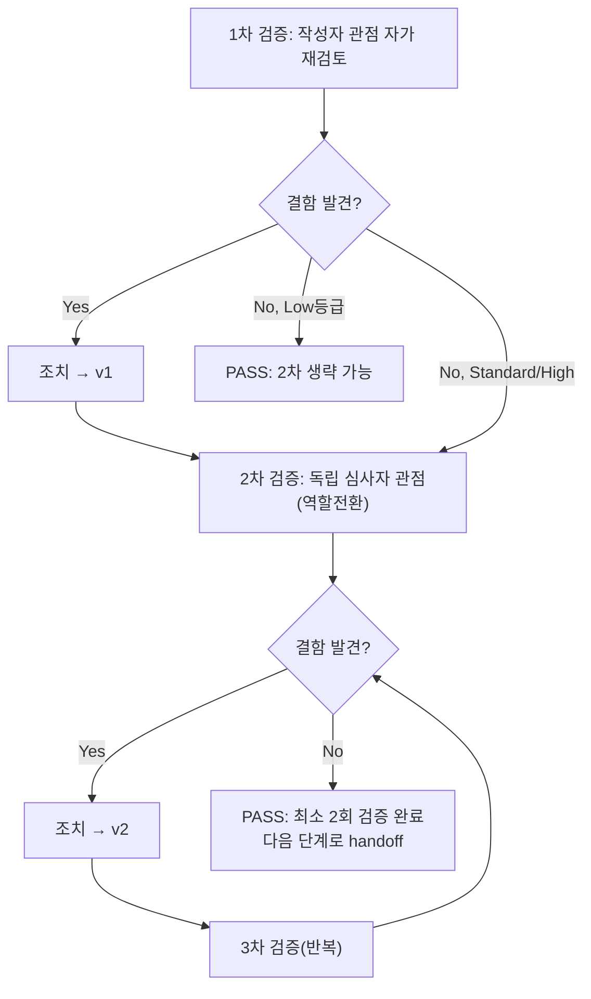

# 내부 검증 로그 (Internal Verification Log)

## 대상 산출물
- 파일: `docs/harness/units/unit-24-test.md`
- 작성 에이전트: 06-unit-tester
- 적용 Tier: High
- 버전: v0 (초안)

## 1차 검증 (작성자 관점 자가 재검토)
- 검증자(역할): 06-unit-tester (작성자 본인, 자가 재검토)
- 일시: 2026-09-29
- 체크리스트
  - [x] 입력 계약(Input Contract)에 명시된 모든 입력을 실제로 반영했는가 — unit-24-note.md의 인수조건 7개(AC1~7), 소속 feature(Feature B, 9개 유닛, 06·07 병합 없음), Tier(High)·속도 트랙(L3)을 모두 반영해 1절에 명시함
  - [x] 출력 계약(Output Contract)에 명시된 모든 필수 항목이 빠짐없이 존재하는가 — `test-report-template.md`의 1~10절 전 섹션을 채웠음(해당없음 섹션 없음, L1 경량판 아님)
  - [x] 상위 단계 산출물과 용어/수치/범위가 모순되지 않는가 — 50MB=52428800바이트, 128000000픽셀, 300초, 2건/20건 등 수치가 note·03-system-design.md §5와 전부 일치. `413`/`200` 등 HTTP 상태코드도 note 원문과 일치
  - [x] 추측으로 채운 항목이 있는가 — TC-004d(음수 문자열 "-5")의 기대값(`200`)은 `int("-5")==-5`가 정상 파싱되고 `-5 > 52428800`이 False라는 파이썬 언어 사실에 근거해 도출했으며, 문서에도 그 근거를 명시함(추측이 아니라 코드 동작 원리에서 연역). 그 외 추측 항목 없음
  - [x] 20년차 실무자 기준으로 봤을 때 구조적/논리적 결함이 없는가 — 미들웨어가 본문을 읽기 전에 헤더만으로 거절하는지(다운스트림 미호출)를 spy 함수로 직접 검증한 점, production의 `XForwardedForMiddleware` prepend 후에도 순서를 재검증한 점이 실무자 관점에서 충분하다고 판단
  - [x] 오탈자, 형식 오류, 누락된 표/그림 참조가 없는가 — 표 형식·mermaid 다이어그램 확인, 오탈자 없음
- 발견된 결함 목록:
  1. (초안 작성 중 자체 재검토) 커버리지 절(5절)에서 `config/settings/base.py`가 coverage 계측 대상에서 빠진 이유를 설명하지 않으면 "왜 세 파일 중 하나만 커버리지 수치가 없는가"라는 의문이 남을 수 있음
- 조치 내용: (수정 후 → v1) 5절에 "config/settings/base.py는 계측 대상에서 제외했다"는 사유와, 그럼에도 `django.setup()` 실행 경로를 통해 해당 코드가 매 테스트마다 실행됨을 별도로 확인했다는 근거 문장을 추가함(현재 unit-24-test.md 5절에 반영 완료)

## 2차 검증 (독립 심사자 관점 — 역할 전환 재검토)
- 검증자(역할): 06-unit-tester (독립 심사자 관점으로 역할 전환, "이 문서를 오늘 처음 받아본 심사자")
- 일시: 2026-09-29
- 체크리스트
  - [x] 1차 검증에서 지적된 항목이 실제로 반영되었는가 — 5절에 반영됨을 재확인
  - [x] 엣지 케이스/예외 상황이 누락되지 않았는가 — 재검토 중 다음을 추가로 실행해 커버함:
    - production 환경에서 `XForwardedForMiddleware` prepend 후 미들웨어 순서(note AC3이 명시적으로 요구한 케이스, 최초 스크립트 설계에는 이미 포함돼 있었으나 심사자 관점에서 "정말 서브프로세스가 아니라 실제 production 설정으로 검증했는가"를 재확인 — 실측 로그(`idx_content_length=1, idx_security=2, mw[0]=config.middleware.XForwardedForMiddleware`)로 재확인함, 문제 없음
    - E2E(Client, 실제 URL 라우팅) 케이스가 RequestFactory 직접 호출과 별개로 존재하는지 확인 — TC-010/011/012로 이미 존재함을 재확인
    - 빈 문자열(""), 음수, 실수형 문자열 Content-Length 등 note에 명시되지 않은 위험 입력 케이스가 포함되어 있는지 확인 — TC-004c/d/e로 이미 포함되어 있음을 재확인
  - [x] 문서만 보고 다음 단계 에이전트(07)가 추가 질문 없이 작업을 시작할 수 있는가 — 8절 리스크에 "AC6 교차검증은 07에서 완결 필요"를 명시적으로 이관해뒀으므로 07 담당자가 무엇을 해야 하는지 문서만으로 파악 가능
  - [x] 되돌리기 어려운 결정(비가역적 결정)에 대한 근거가 명시되어 있는가 — 이 테스트는 코드를 변경하지 않았으므로(결함 0건, 수정 없음) 비가역적 결정 자체가 없음. 유일한 판단(coverage 측정 범위에서 base.py 제외)은 5절에 근거 명시
  - [x] 보안/성능/운영 관점에서 명백히 위험한 내용이 없는가 — TC-004d(음수 Content-Length 통과)를 8절 리스크로 명시적으로 남겨 은폐하지 않음. 이 미들웨어가 본문을 실제로 읽기 전에 거절한다는 성능/자원보호 요구(설계서 핵심 목적)를 spy 함수로 직접 증명했음(단순 "에러 없음"이 아니라 downstream 호출 횟수 비교로 증명)
- 발견된 결함 목록: 없음
- 조치 내용: 해당 없음 (결함 없어 v1을 그대로 최종본으로 확정, v2로 버전 번호만 갱신)

## (필요 시) 3차 이상 검증
- 2차에서 결함이 발견되지 않았으므로 해당 없음.

## 최종 판정
- [x] PASS (결함 0건, 최소 2회 검증 완료) — 다음 단계로 handoff 가능

## 절차 흐름 (참고용 다이어그램)

