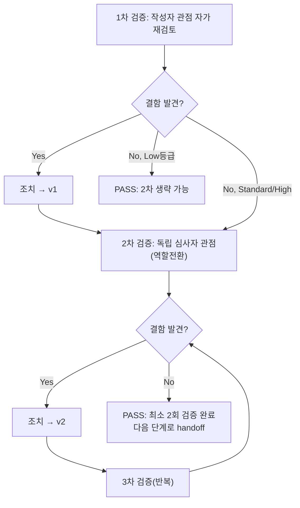

# 내부 검증 로그 (Internal Verification Log)

## 대상 산출물
- 파일: `docs/harness/units/unit-25-test.md`
- 작성 에이전트: 06-unit-tester
- 적용 Tier: High
- 버전: v0 (초안)

## 1차 검증 (작성자 관점 자가 재검토)
- 검증자(역할): 06-unit-tester (작성자 본인, 자가 재검토)
- 일시: 2026-09-29
- 체크리스트
  - [x] 입력 계약(Input Contract)에 명시된 모든 입력을 실제로 반영했는가 — unit-25-note.md의 인수조건 AC-1~AC-10 전부, 소속 feature(Feature B, 9개 유닛, 06·07 병합 없음), Tier(High)·속도 트랙(L3), 05가 이번 06에 별도로 지시한 4가지 확인사항(국외이전 5항목 1:1 대조, 자리표시자 형태 확인, TTL 60분/즉시삭제 문구, 여러 줄 주석 재스캔)을 전부 1절/§4에 반영함.
  - [x] 출력 계약(Output Contract)에 명시된 모든 필수 항목이 빠짐없이 존재하는가 — `test-report-template.md`의 1~10절 전 섹션을 채웠음(L1 경량판 아님, "해당없음" 처리한 섹션 없음).
  - [x] 상위 단계 산출물과 용어/수치/범위가 모순되지 않는가 — TTL 60분(DEC-029), 30일(DEC-029 운영메타데이터), 국외이전 5항목 문구(03 §2-3 183행), mailto 금지(DEC-023), GitHub Issues URL이 note·03·04·decisions.md 원문과 전부 일치함을 직접 대조.
  - [x] 추측으로 채운 항목이 있는가 — TC-016(트레일링슬래시 301)·TC-020(HEAD 200)은 "Django 표준 동작이겠거니"가 아니라 실제 `Client()` 호출로 실측한 값을 기재했음. TC-018의 "바이트 단위로 동일"이라는 표현도 실제 `len()` 비교(3713자, 스크립트 재실행으로 확인)에 근거함. 추측 항목 없음.
  - [x] 20년차 실무자 기준으로 봤을 때 구조적/논리적 결함이 없는가 — 05 note가 자체보고한 게이트1/2 결과를 그대로 신뢰하지 않고 `manage.py check`·`py_compile`을 06이 독립 재실행해 재현했고(TC-014), note가 "고쳤다"고 주장한 버그(§3-3)도 렌더링 결과(TC-012)와 템플릿 원본 재스캔(TC-013) 둘 다로 재검증한 점이 "보고를 그대로 믿지 않는다"는 원칙에 부합.
  - [x] 오탈자, 형식 오류, 누락된 표/그림 참조가 없는가 — 표 형식·mermaid 다이어그램 확인, TC 번호 순번 이상 없음.
- 발견된 결함 목록:
  1. (초안 작성 중 자체 재검토) §7 Teardown의 `git status` 스냅샷을 실제 정리 명령 실행 직후에 캡처했는데, 이 unit-25-test.md/verify-log 파일 자체는 그 시점에 아직 디스크에 쓰이지 않은 상태라 스냅샷에 `??` 신규파일로 안 보이는 것이 자연스러운데, 문서만 봐서는 "왜 이 두 파일이 안 보이나"라는 의문이 남을 수 있음.
- 조치 내용: (수정 후 → v1) §7에 괄호 각주로 "이 두 파일은 이 06 작업의 산출물이며 명령 실행 시점 기준 아직 작성 전이라 스냅샷에 안 보인다"는 설명을 추가함(현재 unit-25-test.md §7에 반영 완료).

## 2차 검증 (독립 심사자 관점 — 역할 전환 재검토)
- 검증자(역할): 06-unit-tester (독립 심사자 관점으로 역할 전환, "이 문서를 오늘 처음 받아본 심사자")
- 일시: 2026-09-29
- 체크리스트
  - [x] 1차 검증에서 지적된 항목이 실제로 반영되었는가 — §7 각주 반영 확인.
  - [x] 엣지 케이스/예외 상황이 누락되지 않았는가 — 재검토 중 다음을 추가로 점검함:
    - AC-4의 자리표시자 요구가 "값이 존재하는가"만 확인하고 "값이 실제 법인명처럼 보이는가"를 놓칠 위험이 있었는데, TC-007을 별도 케이스로 분리해 `class="placeholder"`와 `[배포 확정 시 기재` 접두어 둘 다를 근거로 삼았는지 재확인 — 이미 포함되어 있음을 재확인.
    - 05가 "직접 발견해 고친" 버그(§3-3)를 06이 note의 말만 믿고 넘어가지 않았는지 재확인 — TC-012(렌더링 결과)와 TC-013(템플릿 원본 재스캔) 둘 다로 이중 검증했음을 재확인(렌더링 결과만 보면 "이번엔 우연히 안 나왔다"는 가능성을 배제 못 하므로 원본 재스캔이 반드시 필요했음).
    - 병렬 웨이브 특유의 위험(공유파일 `base.py`/`urls.py`에 다른 unit의 변경이 섞여 legal 관련 배선이 실제로는 깨졌는데 못 보고 지나갈 위험)을 커버했는지 재확인 — TC-014(manage.py check 재실행)와 TC-015(legal 문자열만 grep)로 실제 배선이 살아있음을 재확인했으므로 커버됨.
    - "명백히 위험한 케이스"(빈 입력/null) 원칙에 따라 쿼리스트링 XSS 유사 입력(TC-018)과 경로순회 유사 입력(TC-019)을 AC 범위 밖임에도 추가했는지 재확인 — 이미 포함, 결과도 안전함을 확인.
  - [x] 문서만 보고 다음 단계 에이전트(07)가 추가 질문 없이 작업을 시작할 수 있는가 — §8 리스크에 "자리표시자 2항목 실값 채움은 08/09/10단계 승계 필요"를 명시적으로 남겨 07/08 담당자가 무엇을 놓치면 안 되는지 문서만으로 파악 가능.
  - [x] 되돌리기 어려운 결정(비가역적 결정)에 대한 근거가 명시되어 있는가 — 이번 06은 코드를 변경하지 않음(결함 0건, 수정 없음). 유일한 판단(note §1 서술 축약을 결함으로 분류하지 않음)의 근거를 §6에 명시함.
  - [x] 보안/성능/운영 관점에서 명백히 위험한 내용이 없는가 — TC-017(POST 허용)을 은폐하지 않고 §8에 Low 리스크로 명시. TC-018(XSS 유사 입력)을 "에러 없음"이 아니라 바이트 단위 동일성 비교로 증명해 반사형 XSS 벡터가 없음을 실제로 입증했음(단순 상태코드 200 확인에 그치지 않음).
- 발견된 결함 목록: 없음
- 조치 내용: 해당 없음 (결함 없어 v1을 그대로 최종본으로 확정, v2로 버전 번호만 갱신)

## (필요 시) 3차 이상 검증
- 2차에서 결함이 발견되지 않았으므로 해당 없음.

## 최종 판정
- [x] PASS (결함 0건, 최소 2회 검증 완료) — 다음 단계로 handoff 가능

## 절차 흐름 (참고용 다이어그램)

