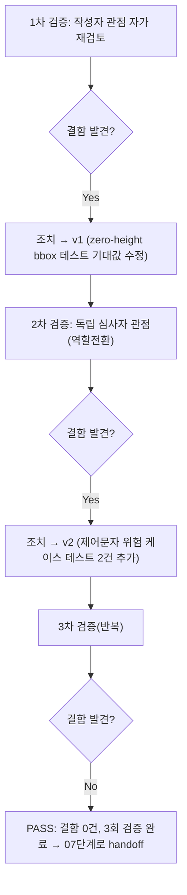

# 내부 검증 로그 (Internal Verification Log)

## 대상 산출물
- 파일: `docs/harness/units/unit-5-test.md`
- 작성 에이전트: 06-unit-tester
- 적용 Tier: Standard
- 버전: v0 (초안) → v1 → v2(최종)

## 1차 검증 (작성자 관점 자가 재검토)
- 검증자(역할): 06-unit-tester(작성자 본인, 1차)
- 일시: 2026-09-28
- 체크리스트
  - [x] 입력 계약(unit-5-note.md §5 AC-1~AC-6, 16개 항목)을 실제로 전부 반영했는가 — 4절 표로 1:1 대응 확인.
  - [x] 출력 계약(`test-report-template.md`)에 명시된 모든 필수 항목이 빠짐없이 존재하는가 — 1~10절 전 섹션 작성.
  - [x] 상위 단계 산출물(unit-5-note.md, schema.py, ir.py)과 용어/수치/범위가 모순되지 않는가 — `_LINE_OVERLAP_RATIO=0.5`, bbox 포맷(`.2f`), REQ-006 비적용 등 note 문구와 대조 완료.
  - [x] 추측으로 채운 항목이 있는가 — 없음. 모두 실제 코드 실행 결과/문서 인용 근거.
  - [x] 20년차 실무자 기준 구조적/논리적 결함이 없는가 — 아래 "발견된 결함" 참고.
  - [x] 오탈자, 형식 오류, 누락된 표 참조가 없음을 확인.
- 발견된 결함 목록:
  1. **테스트 코드 자체의 결함(설계 의도 오독)**: `test_ac2_zero_height_bbox_degenerate_case_does_not_crash`에서 "완전히 같은 좌표(top==bottom)이므로 100% 겹침으로 병합될 것"이라고 잘못 추정하고 `assert len(fragments) == 1`로 작성했다. 실제 `_same_line`은 `overlap = min(bottom,bottom) - max(top,top) = 0`을 계산하고 `overlap <= 0: return False` 분기에 걸려 "겹치지 않음"으로 판정한다(점(0폭) 구간은 수학적으로 겹침이 없다는 것이 코드의 실제 의미이며 결함이 아니다). 실행 결과 `assert 2 == 1`로 테스트가 FAIL했다.
- 조치 내용: (수정 후 → v1) 테스트의 기대값과 docstring을 코드의 실제(올바른) 동작에 맞게 수정(`assert len(fragments) == 2`로 정정, 근거 docstring 보강). 재실행 결과 PASS. 이 결함은 `paragraph_builder.py` 코드의 결함이 아니라 06단계가 처음 작성한 테스트의 기대값 오류였다 — 5단계로 되돌릴 사항 아님(4절/6절에 기록).

## 2차 검증 (독립 심사자 관점 — 역할 전환 재검토)
- 검증자(역할): 06-unit-tester("오늘 처음 이 결과서를 받아본 심사자" 관점, 2차)
- 일시: 2026-09-28
- 체크리스트
  - [x] 1차 검증에서 지적된 항목이 실제로 반영되었는가 — 재확인, PASS.
  - [x] 엣지 케이스/예외 상황이 누락되지 않았는가 — 아래 결함 목록 참고.
  - [x] 결과서만 보고 07단계가 추가 질문 없이 작업을 시작할 수 있는가 — 가능(호출 규약·알려진 한계·리스크 명시됨).
  - [x] 되돌리기 어려운 결정에 대한 근거가 명시되어 있는가 — 해당 없음(이 결과서는 테스트 결과서이며 신규 비가역적 결정 없음).
  - [x] 보안/성능/운영 관점에서 명백히 위험한 내용이 없는가 — 아래 결함 목록 참고.
- 발견된 결함 목록:
  1. **테스트 커버리지 공백(위험 케이스 누락)**: "20년차 QA는 모든 입력을 의심한다"는 기준으로 재검토하다가, PDF에서 추출된 텍스트에 NULL 바이트/제어문자가 섞여 있을 수 있다는 현실적 위험을 이 결과서가 전혀 다루지 않았음을 발견했다. `lxml.etree._Element.text = "..."`에 제어문자가 포함되면 `ValueError: All strings must be XML compatible...`가 발생한다는 사실을 실제로 재현해 확인했다(`python -c` 스니펫). `paragraph_builder.py`는 이 예외를 감싸지 않고 그대로 전파한다는 정책(unit-5-note.md §3 "에러 처리" 체크리스트)을 갖고 있는데, 이 정책이 실제로 지켜지는지(조용히 삼키거나 손상된 XML을 만들지 않는지) 검증하는 테스트가 없었다.
- 조치 내용: (수정 후 → v2, 최종) `test_risk_control_character_in_text_propagates_lxml_valueerror_uncaught`(첫 블록에 제어문자)와 `test_risk_control_character_in_second_merged_block_also_propagates`(병합 그룹의 두 번째 블록에 제어문자)를 추가했다. 재실행 결과 두 테스트 모두 기대한 `ValueError`가 정확히 전파됨을 확인(PASS, 34/34), 라인 커버리지 100% 유지 재확인(coverage 재실행).

## 3차 검증 (2차 결함 조치 후 결함 0건 재확인)
- 검증자(역할): 06-unit-tester(최종 재확인)
- 일시: 2026-09-28
- 체크리스트
  - [x] 2차에서 지적된 제어문자 케이스가 실제로 테스트에 반영되고 PASS하는가 — `pytest -v` 로그로 재확인(34 passed).
  - [x] 새 테스트 추가로 인해 기존 테스트/커버리지에 회귀가 없는가 — 라인 커버리지 48/48(100%) 유지, 전체 리포지토리 375개 테스트(unit-1~4 기존분 + unit-5 신규 34개) 전량 PASS로 재확인.
  - [x] 결함 목록(6절)에 Open 상태 항목이 남아있지 않은가 — 없음, 전부 Fixed 또는 애초에 해당 없음.
  - [x] Teardown(7절)이 규칙 K를 만족하는가 — `.harness-tmp/` 자기 소유 아티팩트 전부 삭제, `git status` 확인 완료.
- 발견된 결함 목록: 없음.
- 조치 내용: 없음(추가 조치 불필요).

## 최종 판정
- [x] PASS (결함 0건, 최소 2회 검증 완료 — 실제로는 3회 수행) — 다음 단계로 handoff 가능

## 절차 흐름 (참고용 다이어그램)

