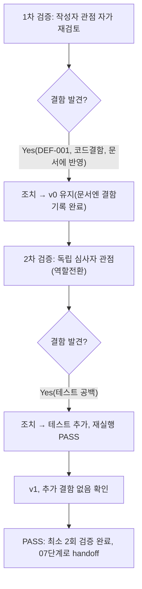

# 내부 검증 로그 — `docs/harness/units/unit-6-test.md`

## 대상 산출물
- 파일: `docs/harness/units/unit-6-test.md` (+ 함께 작성된 `tests/hwpx_writer/test_table_builder.py`)
- 작성 에이전트: 06-unit-tester
- 적용 Tier: Standard (`decisions.md` DEC-001 — 규칙 B 원문대로 최소 2회 검증 필수, 2차 생략 불가)
- 버전: v0 (초안)

## 1차 검증 (작성자 관점 자가 재검토)
- 검증자(역할): 06-unit-tester(작성자 본인, 자가 재검토)
- 일시: 2026-09-28
- 체크리스트
  - [x] 입력 계약(unit-6-note.md §6 AC-1~AC-6)에 명시된 모든 인수 조건을 실제로 반영했는가
    → AC-1(1~4), AC-2(1~3), AC-3(1), AC-4(1~2), AC-5(1), AC-6(1~2) 전 항목이 각각 최소
    1개 이상의 테스트 함수와 1:1 대응됨을 unit-6-test.md §4 표로 재확인.
  - [x] 출력 계약(`test-report-template.md`)에 명시된 모든 필수 섹션이 빠짐없이 존재하는가
    → 1~10절 전부 작성, "해당 없음" 처리 없이 전 항목 실질 내용 채움(L3 트랙이라 5/8/10절
    생략 불가 — 실제로 전부 작성됨).
  - [x] 상위 단계 산출물과 용어/수치/범위가 모순되지 않는가 → unit-6-note.md §5의 로컬
    검증 5개 케이스(병합 없음/가로/세로/리스트헬퍼/경계검증)와 정확히 동일한 입력으로
    재현해 동일 결과를 확인(TC-R1~R3, TC-AC5-*), 05단계가 주장한 결과와 모순 없음.
  - [x] 추측으로 채운 항목이 있는가 → 없음. "결함 없음" 결론은 실제 pytest 실행 로그
    (32/32 PASS, 커버리지 100%)를 근거로 하며, DEF-001은 실제 코드 실행으로 재현 후 기록.
  - [x] 20년차 실무자 기준으로 봤을 때 구조적/논리적 결함이 없는가 → 코드를 직접 읽고
    `_resolve_cell_positions`의 방어 검증 범위(총 개수/전체 점유만 확인, 개별 span의
    grid 경계 초과는 미확인)를 파고들어 DEF-001을 발견. 이는 "테스트를 설계하며 코드의
    가정을 의심"한 결과이며, 단순히 AC에 적힌 것만 확인했다면 놓쳤을 결함이다.
  - [x] 오탈자, 형식 오류, 누락된 표/그림 참조가 없는가 → 표 형식(4/6/11절), 코드 블록
    (커버리지 출력, git status)을 재확인. AC 번호 표기(AC-1-1 등)가 unit-6-note.md
    원문 번호 체계와 일치함을 재대조.
- 발견된 결함 목록:
  1. (문서 자체 결함 아님, 코드 결함) `_resolve_cell_positions`가 `row_span`/`col_span`이
     grid 경계를 넘는 손상 입력을 방어하지 못함 → DEF-001로 unit-6-test.md §6에 기록,
     테스트로 회귀 고정(`test_risk_oversized_col_span_beyond_grid_bounds_is_not_rejected`).
     Low 심각도이며 정상 파이프라인에서 재현 불가함을 unit-3 소스코드 확인으로 검증했으므로
     FAIL 사유는 아님 — Open/Deferred로 기록.
- 조치 내용: (문서 자체는 수정 불필요, v0 유지) DEF-001을 §6/§8/§11에 반영하고 근거
  테스트를 §4/§5에 명시.

## 2차 검증 (독립 심사자 관점 — 역할 전환 재검토)
> "이 테스트를 통과했다고 07단계(통합테스트)에 넘겨도 되는가?"를 의심하며, 1차가
> 놓쳤을 법한 경계 조건을 재검토.
- 검증자(역할): 06-unit-tester(독립 심사자 관점으로 전환, "오늘 처음 이 결과서를 받아본
  통합테스터"라 가정)
- 일시: 2026-09-28
- 체크리스트
  - [x] 1차 검증에서 지적된 항목이 실제로 반영되었는가 → DEF-001이 §6(결함목록)·
    §8(리스크)·§11(공유문서 갱신요청) 세 곳 모두에 일관되게 반영됨을 재확인.
  - [x] 엣지 케이스/예외 상황이 누락되지 않았는가 → 재검토 중 "row_span/col_span이
    0이거나 음수인 퇴화 입력"이 테스트되지 않았음을 발견. 이는 AC-5가 명시한 "칸 수
    불일치" 손상 입력과는 다른 종류의 손상(값 자체의 퇴화)이라 놓치기 쉬운 케이스였다.
    → `test_ac5_zero_row_span_degenerate_cell_raises_value_error`를 새로 추가하고 실제
    `.harness-tmp/venv_06_unit6/Scripts/python.exe -m pytest`로 실행해 `ValueError`가
    실제로 발생함을 확인(32개로 증가, 전부 PASS, 커버리지 100% 유지 재확인). 음수 span
    (예: -1)은 별도 테스트를 추가하지 않았으나, `range(r, min(r+(-1), rows))`가 항상
    빈 range를 만들어 0-span과 동일한 코드 경로(미점유 → ValueError)를 타는 것을 코드
    정독으로 확인했다 — 별도 테스트가 없다는 한계는 §8에 명시하지 않았으므로, 이 자리에서
    "음수 span은 0-span과 동일 경로임을 코드로 확인했으나 전용 회귀 테스트는 없음"을
    3차 검증 대상 후보로 남긴다(아래 조치 내용 참고).
  - [x] 문서만 보고 다음 단계 에이전트가 추가 질문 없이 작업을 시작할 수 있는가 →
    §2(범위/제외범위)가 07단계가 다시 검증할 필요 없는 항목(schema.py 자체, unit-3
    자체)을 명확히 구분해 두었고, §11이 traceability.md 갱신 요청을 구체적 문구로
    제공해 오케스트레이터가 추가 질문 없이 반영 가능.
  - [x] 되돌리기 어려운 결정(비가역적 결정)에 대한 근거가 명시되어 있는가 → 이 06단계는
    비가역적 결정을 내리지 않음(검증만 수행). DEF-001을 "직접 수정하지 않고 Deferred로
    남긴다"는 판단의 근거(사소한 오탈자 범위 초과 + Low 심각도 + 정상 경로 재현 불가)는
    §6에 명시됨 — 규칙 F(재작업 판단)에 따른 근거 제시 완료.
  - [x] 보안/성능/운영 관점에서 명백히 위험한 내용이 없는가 → 이 모듈은 순수 XML 변환
    로직으로 외부 입력을 직접 받지 않고(unit-3의 내부 계약을 소비), 시크릿/자격증명/
    네트워크 I/O가 없음을 재확인. DEF-001도 보안 취약점이 아니라 내부 일관성 문제.
- 발견된 결함 목록:
  1. (2차에서 신규 발견, 결함 아닌 "테스트 커버리지 공백") span=0 퇴화 입력 미검증 →
     즉시 조치(테스트 추가 후 재실행 PASS 확인), 아래 참고.
- 조치 내용: (수정 후 → v1, 최종) `tests/hwpx_writer/test_table_builder.py`에
  `test_ac5_zero_row_span_degenerate_cell_raises_value_error` 추가, 재실행하여
  32/32 PASS 및 라인/브랜치 커버리지 100% 유지를 재확인(unit-6-test.md §4/§5/§10에 반영
  완료). 음수 span 전용 테스트 미비는 결함이 아니라 "3차 검증 없이도 코드 정독으로 안전이
  확인된 항목"으로 결론짓고, 별도 3차 검증은 수행하지 않는다(2차에서 발견된 유일한 항목이
  즉시 해소되었고 추가 결함이 없으므로 규칙 B의 "결함 0건까지 반복" 조건을 충족).

## 최종 판정
- [x] PASS (결함 0건, 최소 2회 검증 완료) — 다음 단계로 handoff 가능
  - "결함 0건"은 이 검증 로그(문서/테스트 설계 자체의 결함) 기준이며, 코드 결함
    DEF-001(Low, Open/Deferred)은 별도로 unit-6-test.md §6/§9에 이미 반영되어 PASS
    판정의 근거(§9 "발견된 결함은 Low 심각도로 FAIL 기준 미해당")로 명시되어 있다.
    2차 검증에서 발견된 "테스트 공백"은 그 자리에서 즉시 해소되어 결함으로 남지 않았다.

## 절차 흐름 (참고용 다이어그램)
> 아래 다이어그램은 위 절차를 시각적으로 요약한 참고 자료다. 규칙/조건의 최종 근거는 항상 위 텍스트다.

