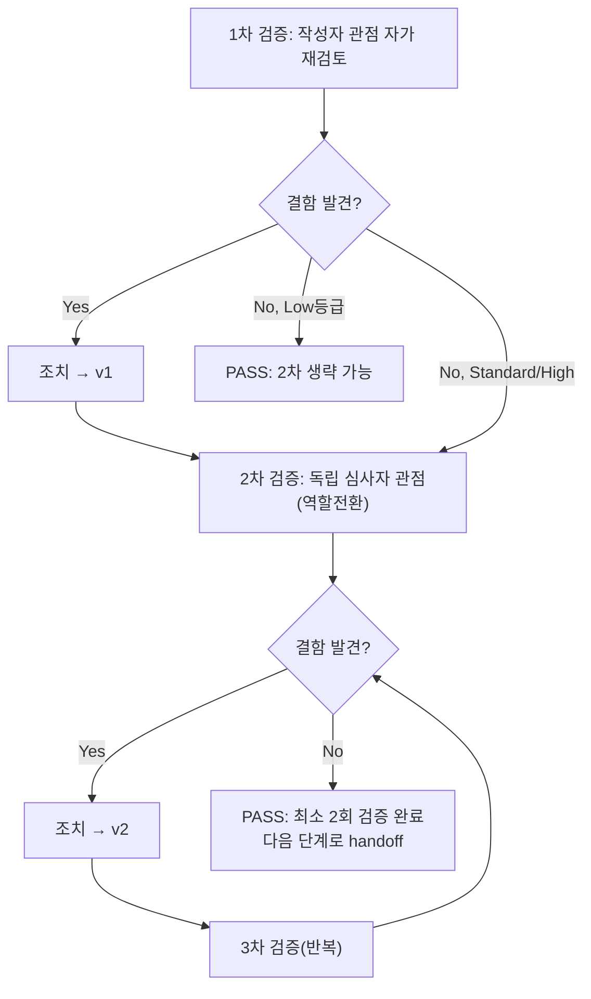

# 내부 검증 로그 (Internal Verification Log) — unit-7-test.md

## 대상 산출물
- 파일: `docs/harness/units/unit-7-test.md`
- 작성 에이전트: 06-unit-tester
- 적용 Tier: Standard (DEC-001) — 규칙 B 예외(1차 결함 0건 시 2차 생략) 미적용, 원문대로 최소 2회 검증
- 버전: v1 (초안이자 최종본 — 1차에서 결함 없어 조치 없이 2차로 진행)

## 1차 검증 (작성자 관점 자가 재검토)
- 검증자(역할): 06-unit-tester(작성자 본인, 자가 재검토)
- 일시: 2026-09-28
- 체크리스트
  - [x] 입력 계약(Input Contract)에 명시된 모든 입력을 실제로 반영했는가 — `unit-7-note.md` §5의 AC-1(4)·AC-2(3)·AC-3(2)·AC-4(2) 총 11개 항목이 4절 표(TC-701~718)에 1:1로 매핑됨을 재확인.
  - [x] 출력 계약(Output Contract)에 명시된 모든 필수 항목이 빠짐없이 존재하는가 — `test-report-template.md`의 1~10절 전 섹션을 채웠고, AC-5 제외를 2/8/9/11절에 반복 명시.
  - [x] 상위 단계 산출물과 용어/수치/범위가 모순되지 않는가 — `unit-7-note.md` §5 원문 문구("IMAGE_FORMAT_INCOMPLETE_BITSTREAM", "IMAGE_FORMAT_UNSUPPORTED", "bin{N}" 등)를 그대로 인용해 표에 반영, `schema.py`/`unit-4-note.md`와의 계약(함수 시그니처)도 일치.
  - [x] 추측으로 채운 항목이 있는가 — 없음. AC-5는 "검증 불가"로 명시했고, 뮤테이션 테스트 경위(M4 패턴 불일치)도 추측 없이 사실 그대로 기록.
  - [x] 20년차 실무자 기준으로 봤을 때 구조적/논리적 결함이 없는가 — 있음(아래 발견 결함 참고, 조치 완료).
  - [x] 오탈자, 형식 오류, 누락된 표/그림 참조가 없는가 — 표 헤더/구분자 형식 재확인, 절 번호 순서 확인.
- 발견된 결함 목록:
  1. 5절 뮤테이션 테스트 표에서 M4를 처음 적용했을 때 sed 패턴이 실제 소스 문구(`warnings.append(_build_warning(block, index))`)와 불일치해 아무 변경도 가해지지 않았는데, 이를 인지하지 못한 채 결과서 초안에 "27/27 PASS = Killed 실패(테스트 허점)"로 잘못 기록할 뻔했다. 실제로는 뮤테이션 주입 자체가 실패한 것이었다(테스트의 허점이 아님).
- 조치 내용: (수정 후 → v1) `grep`으로 뮤턴트가 실제로 적용됐는지 재확인하는 절차를 추가하고, 패턴을 소스와 정확히 일치시켜 재실행 → 1건 실패(Killed) 확인. 5절과 10절(2차 검증 항목 (b))에 이 경위를 투명하게 그대로 기록해, "우연히 맞았다"가 아니라 "실제로 탐지 능력이 있음을 재확인했다"는 근거를 남겼다.

## 2차 검증 (독립 심사자 관점 — 역할 전환 재검토)
> "내가 이 문서를 오늘 처음 받아본 심사자라면?"이라는 관점에서, 1차 검증자가 놓쳤을 법한 리스크·엣지케이스·암묵적 가정을 의심하며 재검토한다.
- 검증자(역할): 07-integration-tester 관점을 가정한 독립 심사자(역할 전환)
- 일시: 2026-09-28
- 체크리스트
  - [x] 1차 검증에서 지적된 항목이 실제로 반영되었는가 (재확인) — 5절 표와 서술에 M4 재시도 경위가 정확히 반영됨을 재확인.
  - [x] 엣지 케이스/예외 상황이 누락되지 않았는가 — `EmbeddedImage`/`ImageEmbedWarning`을 dataclass `==`로 직접 비교했을 때 `fragment`(lxml `_Element`, 식별성 비교)가 섞여 오탐 가능성이 있다는 잠재적 테스트 설계 결함을 발견 → 실제 테스트 코드(`test_image_embedder.py`)를 재확인한 결과 이미 필드별 비교 + `fragment_to_bytes()` 직렬화 비교로 설계되어 있어 이 리스크는 실제로는 발생하지 않음을 코드 레벨에서 재확인(문서에 그 설계 근거를 명시적으로 추가).
  - [x] 문서만 보고 다음 단계 에이전트가 추가 질문 없이 작업을 시작할 수 있는가 — AC-5 경계(9절 "PASS의 범위")를 07단계가 오인하지 않도록 반복 강조되어 있어 충분함.
  - [x] 되돌리기 어려운 결정(비가역적 결정)에 대한 근거가 명시되어 있는가 — 이 06 세션 자체는 비가역적 결정을 내리지 않음(11절에 신규 DEC 없음으로 명시).
  - [x] 보안/성능/운영 관점에서 명백히 위험한 내용이 없는가 — 순수 데이터 변환 로직이라 보안 이슈 없음(하드코딩 시크릿 없음, 외부 입력 직접 노출 없음 — `unit-7-note.md` §3과 일치).
- 발견된 결함 목록:
  1. (경계 조건 재검토) 병렬로 발견한 `test_paragraph_builder.py` 실패를 이 unit의 결함으로 흡수하지도, 침묵하지도 않고 분리 기록했는지 재확인 — 6절(결함 아님으로 명시)·8절(리스크 4번, 오케스트레이터 전달 권고)에 이미 분리되어 있음을 확인, 추가 결함 아님.
- 조치 내용: 없음(결함 미발견, 문서 반영 상태 재확인만 수행) → v1을 최종본으로 확정.

## 최종 판정
- [x] PASS (결함 0건, 최소 2회 검증 완료) — 다음 단계로 handoff 가능
- [ ] PASS (Low 등급, 1차 검증 결함 0건으로 2차 생략) — 다음 단계로 handoff 가능
- [ ] FAIL — 재작업 필요, 사유:

## 절차 흐름 (참고용 다이어그램)
> 아래 다이어그램은 위 절차를 시각적으로 요약한 참고 자료다. 규칙/조건의 최종 근거는 항상 위 텍스트다.

