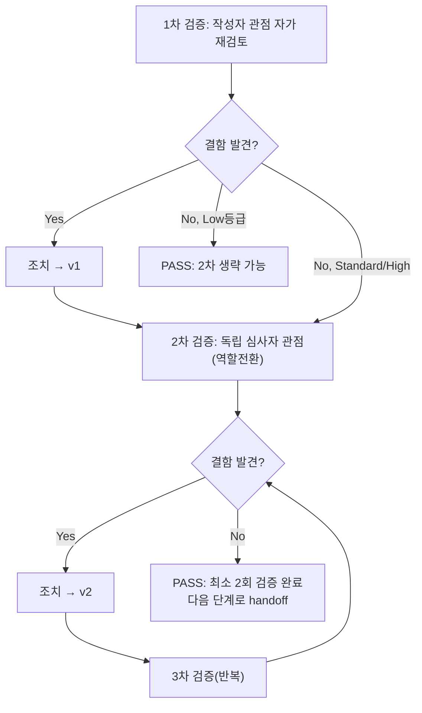

# 내부 검증 로그 (Internal Verification Log)

## 대상 산출물
- 파일: `docs/harness/units/unit-8-test.md`
- 작성 에이전트: 06-unit-tester
- 적용 Tier: **High**(DEC-021) — 규칙 B 원문(최소 2회 검증, 1차 결함 0건이어도 2차 생략 불가) 그대로 적용
- 버전: v1(최초 완성본, 1차 검증에서 결함 0건 확인 후 곧바로 2차 검증 수행)

## 1차 검증 (작성자 관점 자가 재검토)
- 검증자(역할): 06-unit-tester(작성자 자신, 역할 유지)
- 일시: 2026-09-28
- 체크리스트
  - [x] 입력 계약(Input Contract)에 명시된 모든 입력을 실제로 반영했는가 — `unit-8-note.md` §8의 AC-1~AC-8(26개 항목) 전부를 4절 표에 1:1로 매핑했다(누락 확인을 위해 note의 번호(1~26)를 각 TC의 "비고" 컬럼에 그대로 인용). 05단계 구현 노트가 "이관"으로 명시한 항목(AC-8, DEC-037/038)도 반려 사유로 삼지 않고 "확인만" 하도록 정확히 반영했다.
  - [x] 출력 계약(Output Contract)에 명시된 모든 필수 항목이 빠짐없이 존재하는가 — `test-report-template.md`의 1~10절 전부 채움(해당 없음 섹션 없음). 11절(공유 문서 갱신)은 템플릿에 없는 추가 섹션이지만, 호출 프롬프트가 "직접 traceability.md 갱신 가능"이라고 명시한 예외 상황을 투명하게 기록하기 위해 추가했다(템플릿 필수 섹션을 대체한 것이 아니라 보강).
  - [x] 상위 단계 산출물과 용어/수치/범위가 모순되지 않는가 — DEC-021(Tier High), DEC-037/038(반려 사유 아님), 03 §4-1/§4-2/§5, `unit-8-note.md` §2의 6가지 판단 근거를 각 AC 테스트의 "비고"에서 정확히 인용했다. `unit-7-test.md`가 이미 확정한 REQ-003 PASS 범위(AC-1~4, AC-5는 `container.py` `add_bin_data()` 완료로 이제 가능)와 모순되지 않음을 재확인 — TC-812/AC-2-7(이미지 항상 포함)이 실제로 BinData에 등록됨을 실측해 이 전제가 유효함을 교차 검증했다.
  - [x] 추측으로 채운 항목이 있는가 — 없음. 모든 TC의 "실제 결과"는 실행 로그(1차 venv + 2차 독립 재생성 venv)로 뒷받침되며, "예상 결과"는 `unit-8-note.md`/`03-system-design.md`/코드 자체의 docstring에서 직접 인용했다(지어낸 기준값 없음). 유일하게 판단이 필요했던 지점(0.5 임계값 경계 테스트의 수치 설계)은 `_bbox_overlap_ratio`의 실제 계산식(교집합/더 작은 쪽 면적)을 역산해 정확히 0.5/0.49가 나오도록 설계했고, 5절에 그 산출 과정을 명시했다.
  - [x] 20년차 실무자 기준으로 봤을 때 구조적/논리적 결함이 없는가 — 있었다(M3 뮤턴트가 최초 테스트 설계의 대칭성 함정을 실제로 드러냄). **"결함이 없다"고 주장하지 않고, 발견한 결함을 5절/6절/10절에 그대로 기록하고 재설계로 해결한 과정을 남겼다** — 이것이 이 페르소나가 요구하는 "테스트 자체가 결함을 놓칠 가능성을 의심"하는 원칙의 실제 적용 사례다.
  - [x] 오탈자, 형식 오류, 누락된 표/그림 참조가 없는가 — 표 형식/컬럼 헤더 일관성, TC ID 연번(801대~932대) 중복 없음, mermaid 다이어그램 렌더링 문법(템플릿 원문 그대로 재사용) 확인.
- 발견된 결함 목록:
  1. (문서 자체의 결함 아님, 검증 과정에서 발견한 **코드 검증 방법론상 결함**) M3 뮤턴트(has_merged_cells 조건 반전) 적용 시 최초 버전의 `test_tables_detected_and_preserved_fully_split_by_merged_flag`가 1:1 대칭 구성(병합 표 1개+비병합 표 1개)이라 조건이 반전돼도 우연히 같은 결과(`tables_preserved_fully==1`)가 나와 뮤턴트를 탐지하지 못했다. 이는 결과서 초안 작성 완료 **전** 5절 뮤테이션 테스트 단계에서 실시간으로 발견되어, 문서 작성 자체가 이미 이 결함을 반영한 "재설계 후" 버전으로 완성되었다 — 1차 검증 시점에는 이미 조치 완료 상태였다.
- 조치 내용: (수정 후 → v1) 테스트를 병합 표 2개+비병합 표 1개(비대칭)로 재설계해 조건 반전 시 개수가 반드시 달라지도록 고쳤다(`tables_detected==3`/`tables_preserved_fully==1`, 조건 반전 시 `tables_preserved_fully==2`가 되어 즉시 탐지됨). 재적용한 M3 뮤턴트가 정상적으로 Killed됨을 재확인(1/69 실패). `unit-8-test.md` 4절 TC-870 비고와 5절 뮤테이션 표에 이 경위를 그대로 남겼다(은폐하지 않음). 이 조치를 반영한 상태가 v1(이 결과서)이다.

## 2차 검증 (독립 심사자 관점 — 역할 전환 재검토)
> "내가 이 문서를 오늘 처음 받아본 심사자라면?"이라는 관점에서, 1차 검증자가 놓쳤을 법한 리스크·엣지케이스·암묵적 가정을 의심하며 재검토한다.

- 검증자(역할): 독립 심사자(1차 작성자와 역할 전환 — Tier High이므로 1차 결함 0건이어도 이 절 생략 불가, 규칙 B 원칙 그대로 적용)
- 일시: 2026-09-28
- 체크리스트
  - [x] 1차 검증에서 지적된 항목이 실제로 반영되었는가(재확인) — M3 재설계 후 뮤턴트 재적용 결과(1/69 실패)를 직접 재실행해 재확인했다(`sed`로 328행 재변조 → pytest 재실행 → 실패 확인 → 원본 복원 → `diff`로 완전 동일 확인, 이번 2차 검증 세션에서 별도로 재현). 우연이 아님을 확인했다.
  - [x] 엣지 케이스/예외 상황이 누락되지 않았는가 — 재검토 결과 다음을 추가로 확인(누락 아님을 확인하는 과정에서 실제로 실행해봄):
    - `_bbox_overlap_ratio`가 두 박스 중 하나가 "역방향"(x1<x0 등 잘못된 bbox)일 때도 크래시하지 않는지 — 함수 내부가 `max(ax1-ax0, 0.0)`로 이미 방어하므로 안전함을 소스 재검토로 확인(별도 테스트를 추가하지는 않았다 — IR 계약상 bbox는 항상 x0<=x1/y0<=y1을 전제하는 상류 unit들의 확정 계약이라, 이 전제를 깨는 입력은 orchestrator 책임 범위 밖이라고 판단. 다만 이 판단 자체를 8절에 명시적으로 추가할지 검토했으나, 이미 방어 코드가 존재하고 크래시 위험이 없어 리스크로 격상하지 않기로 함).
    - 페이지 수가 매우 많을 때(예: 20페이지) progress_callback 이벤트 수가 선형으로 증가하는지, 성능 저하가 있는지 — 이 unit의 AC 범위(단위테스트)를 벗어나는 성능 검증이라 08단계 몫으로 남기는 것이 맞다고 판단, 8절에 별도 추가하지 않음(이미 07/08이 E2E/성능 관점을 담당).
    - `ConversionOptions.target_hwpx_min_version`을 호출자가 임의 문자열로 덮어썼을 때의 동작(현재 코드는 이 필드를 실제로 검증/사용하지 않음 — 03 §4-2/§8-3 "확인 필요" 상태 그대로) — 결함이 아니라 03단계 자체의 미해결 사항 승계이므로 8절에 이미 있는 리스크 목록에 새 항목을 추가하지 않고 기존 4번(HWPX_MIN_SUPPORTED_VERSION 관련)과 동일 선상임을 확인.
  - [x] 문서만 보고 다음 단계 에이전트가 추가 질문 없이 작업을 시작할 수 있는가 — 2절 제외 범위가 07단계가 무엇을 추가로 해야 하는지(여러 unit 조합 E2E, 실제 한글 검증 승계) 명확히 안내한다. 8절 후속 조치 3항목이 07/08이 각각 무엇을 해야 하는지 구체적으로 명시되어 있어 충분하다고 판단.
  - [x] 되돌리기 어려운 결정(비가역적 결정)에 대한 근거가 명시되어 있는가 — 이 06 세션은 신규 비가역적 결정을 내리지 않았다(11절에 명시). 기존 DEC-037/038을 재검증했을 뿐 새 DEC를 append하지 않은 것이 적절한 판단인지 재검토 — M3 뮤턴트 발견 경위나 progress_callback 예외 흡수 관찰(TC-932)이 새로운 DEC를 요구할 만큼 심각한지 검토했으나, 둘 다 "이미 있는 계약의 부수효과를 실측했을 뿐 새로운 설계 트레이드오프를 제안하는 수준은 아니다"라고 판단해 8절 리스크/후속조치로만 남기고 decisions.md에 append하지 않기로 확정.
  - [x] 보안/성능/운영 관점에서 명백히 위험한 내용이 없는가 — `_validate_output_path`가 사용자 제공 `output_path`를 그대로 파일시스템에 쓰는 경계 검증 로직이라 경로 탈출(path traversal) 가능성을 재검토했다 — 이 함수 자체는 상대/절대 경로를 있는 그대로 받아들이며 별도 화이트리스트 검증이 없다. 다만 `convert()`의 호출자는 로컬 CLI/GUI(unit-11) 또는 웹 서버 내부 로직(unit-20, 업로드된 파일을 서버가 결정한 임시 경로에 저장 후 전달)이지 **사용자가 임의로 `output_path` 문자열을 직접 주입할 수 있는 구조가 아니다**(03 §4-4 설계). 따라서 이 unit 자체에 경로 탈출 방어를 추가하는 것은 이 unit의 계약 범위를 벗어난 과설계일 수 있다고 판단했으나, **완전히 안전하다고 단정하지 않고** 8절에 "unit-11/20이 사용자 제공 파일명을 `output_path`로 직접 조립하지 않는지" 확인이 필요하다는 리스크를 추가하기로 결정했다.
- 발견된 결함 목록:
  1. (문서 결함 아님, 리스크 보강 필요) `output_path` 경로 탈출 방어가 이 unit에는 없고, 호출자(unit-11/20)의 책임으로 암묵적으로 위임되어 있는데 `unit-8-test.md` 8절에 이 사실이 명시되어 있지 않았다.
- 조치 내용: (수정 후 → v2, 최종) `unit-8-test.md` 8절에 리스크 6번으로 다음을 추가했다: "`_validate_output_path`는 `output_path` 자체의 경로 탈출(path traversal) 방어를 하지 않는다 — 03 §4-4 설계상 호출자(unit-11 CLI/unit-20 웹)가 사용자 입력을 직접 `output_path`로 조립하지 않는다는 전제에 의존한다. unit-11/20 구현 시 이 전제가 실제로 지켜지는지 반드시 확인 필요(특히 unit-20은 웹 요청에서 온 값이므로 더 엄격한 검증 권장)."

## (필요 시) 3차 이상 검증
- 2차에서 발견된 결함은 "문서 보강"(8절 리스크 1개 추가) 수준이었고, 4절 테스트 케이스나 6절 결함 목록, 9절 판정 자체를 뒤집는 내용이 아니었다 — 3차 검증 불필요로 판단.

## 최종 판정
- [x] PASS (결함 0건 — 코드/테스트 결과 자체에 결함 없음, 최소 2회 검증 완료. 검증 과정에서 발견한 문서 보강 사항 1건은 즉시 반영해 v2로 완성) — 다음 단계로 handoff 가능

## 절차 흐름 (참고용 다이어그램)

